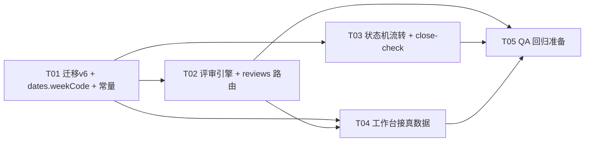

# B10 增量架构设计 + 任务分解（审批上线 + 工作台接真数据）

> **文档性质**：B10 增量设计（相对 B9「工时统计报表」已交付基线）。输入为 `docs/B10-增量PRD.md`（PM 许清楚，IS_READY: YES）。
> **原则**：基于现有代码**最小变更**；前端 ApprovalsPage / ReviewsPage / WorkbenchPage 已写好，**零改动**目标；后端以 `web/src/api/mock/index.ts`（评审 L1956-2148 / 工作台 L2332-2379 / 流转 L887-917）与 `web/src/types/*` 为**唯一契约源**逐字段对齐。
> **范围**：R1 评审 7 接口真实化（替换 stubs 桩）→ R2 项目状态机 transition + close-check 真实化 → R3 工作台接真数据（pendingApprovals / myApprovals / missingReports / reportReminders）。R4（变更单审批 / 评审类型扩展 / 导出）**不做**。
> **默认主题**：浅色；品牌青 `#2E7D87`（交互）/ `#6DA8AE`（装饰），与 B7/B8/B9 一致（前端已实现，后端无感知）。

---

## 0. 关键决策摘要（采纳 PRD 推荐并校准）

| # | 决策 | 结论 | 影响 |
|---|------|------|------|
| D1 | 迁移 v6 | **建 4 表**：`reviews` / `review_steps` / `review_approvals` + 空 `changes`（Q5 推荐后者：一次建表避免二次迁移） | 见 §A3.1 DDL |
| D2 | 审批链模板（Q1） | `reviewType==='project'` → 用 `config.js APPROVAL_TEMPLATES[project.type]`（A/C 三级 `[pmo,tl,management]`、B 二级 `[pm,tl]`，`_default` 兜底），`mode='serial'`，`templateKey='project:'+type`；其余类型 → `enums.REVIEW_TEMPLATES[reviewType]`（formal/technical/code/ccb），`templateKey=tpl.key` | 决定审批链形态 |
| D3 | 角色绑定（Q1） | `assignees[idx]` 覆盖 > 项目成员 `project_role===role` > 全局用户 `global_role===role` > `ROLE_FALLBACK_ORDER` 兜底（服务端常量 `['pmo','management','tl','qa','cm','po','pm']`，与 Mock L98 一致）；`customer_rep` 走兜底 | buildSteps 顺序 |
| D4 | admin 兜底（Q1） | **admin 可批/驳任意当前步骤**（serial=steps[currentStep]、parallel=首个 current step）；与 Mock `canDecide`（仅按 assignee 匹配）**有差异，属预期**，代码注释说明 | 影响 myApprovals 集合 |
| D5 | transition 引擎位置 | **新建 `server/services/project-flow.service.js`**（transitionProject + closeBlockers + checkClose）。`project.service.js` 保持建项/读链不动（最小 diff）；project-flow 与 review.service **互不依赖**（close-check / Q3 特判直查 `reviews` 表），避免环 | 文件归属 |
| D6 | transition 双通道（Q3） | 完整状态机 = `enums.PROJECT_TRANSITIONS`（**不做增减**）。特例：`审批中→已批准/已驳回` 且项目存在 `status='审批中'` 的 `project` 类型评审 → `E_VALIDATION`「存在审批中的立项评审，请走评审流程」，由评审终审联动；无该评审（legacy 老数据）→ 允许拥有 `project:transition` 者直转兜底 | 见 §A3.3 |
| D7 | 结项检查（Q2/Q5） | 阻塞项：未过门（`quality_gates.status NOT IN (已通过,有条件通过)`）/ 未达成碑（`milestones.done_at IS NULL`，done 只由 done_at 派生）/ 审批中评审（`reviews.status='审批中'`）/ 变更（`changes` 空表恒空）；与 Mock `closeBlockers` L218-250 同口径 | close-check 复用同一函数 |
| D8 | 周报口径（Q2） | `reportReminders` = 我参与（`project_members` 含我）且 `status='进行中'` 的项目，**每项目一行**；`filled` = 本周存在 `work_reports.status='已提交'`（项目级、任一成员提交即算）；`missingReports` = 未填行数 | 与 Mock 零漂移 |
| D9 | legacy 老审批流（Q4） | **保留 `legacy.routes.js` 原样**（devcheck/test_runner 仍打老接口），新前端已切新契约、不暴露老入口；批次清理随 D-9 计划 | 回归基线 |
| D10 | 前端改动 | **零改动**：逐字段核对（见 §A3.2 字段清单），仅后端补齐 | 验收依据 |

---

# Part A 系统设计

## A1 实现思路（难点 + 框架选择 + 架构模式）

**核心难点**
1. 审批链生成与「角色→用户」绑定（assignees 覆盖 > 项目成员 > 全局角色 > 兜底，含虚拟角色 `customer_rep`）。
2. 状态机推进三态：`serial`（currentStep+1，末步终审）、`parallel_veto`（全票通过 / 任一驳回置 skipped）、`single`（单步串行等价）。
3. 终态联动：project 评审通过 → 项目 `审批中→已批准` + 审计；gate 评审通过 → 门 `已通过` + 挂载里程碑达成（复用 B4 `milestoneService.achieveMilestoneByGate`）；change 评审（本期空表）防御性实现。
4. RBAC + 状态机校验顺序（发起可写+review:start；决策可决策性；撤回发起人/admin；终态 409；customer_rep 证据 400）。
5. 工作台聚合口径与「我的任务/我的项目」既有实现同构（复用 `projectService.listMyProjectItems` + 新增评审/周报聚合）。

**框架选择**：不引入任何新框架/新依赖（复用 better-sqlite3 + express + 现有 lib）。
- 错误码/信封/审计/RBAC/日期全部沿用 `server/lib/*`、`server/middleware/rbac.js`、`server/config/enums.js`。
- `server/lib/dates.js` 需补 `weekCode`（对齐前端 `web/src/utils/date.ts#weekCode`，ISO 8601 周，无 dayjs 依赖，纯原生 Date UTC 计算）。

**架构模式**：沿用 B4 起定型的「route 薄壳 + service 纯数据层 + rbac 断言 + audit 旁路」分层（对照 `reports.routes.js` / `report.service.js` 同构实现），**MVC 变体（无 View 层，API 即出口）**。新文件全部照抄既有约定：service 零 Express 依赖、事务在 service、响应体禁 snake_case、审计写事务外。

**最小变更边界**（明确不动的文件）：
- `web/` 全部（前端零改动）
- `server/routes/legacy.routes.js`（D9 保留）
- `server/services/project.service.js`（D5 不动，transition 放新文件）
- `server/services/gate.service.js` / `milestone.service.js` / `report.service.js`（仅被复用，不改）
- `server/config/index.js` 不存在（配置在 `pm-app/config.js`），`APPROVAL_TEMPLATES` 已有，不改

## A2 改动文件清单

### 新增（4 个代码/脚本 + 2 个交付图）

| 文件（相对 pm-app） | 内容 |
|---|---|
| `server/services/review.service.js` | 评审引擎：`createReview` / `buildSteps` / `decide`（approve/reject）/ `withdrawReview` / `listReviews` / `listMyApprovals` / `getReview` / `canDecide` / `onReviewApproved`；留痕 + 审计 |
| `server/routes/reviews.routes.js` | 7 接口薄壳（`/reviews` 静态段 my-approvals 早于 `:id`）；requireAuth + rbac 断言 + 调 service |
| `server/services/project-flow.service.js` | 状态机流转 `transitionProject` + `closeBlockers` + `checkClose`（含 Q3 特判、归档拦截、结项前检查、审计） |
| `scripts/qa_b10_verify.mjs` | B10 独立验收脚本（用例见 §B2 T05） |
| `docs/B10-class-diagram.mermaid` | 类图（交付物） |
| `docs/B10-sequence-diagram.mermaid` | 时序图（交付物） |

### 修改（7 个）

| 文件 | 改动 |
|---|---|
| `server/dal/migrations.js` | 新增 `migrationV6`（4 表 DDL，全部 `IF NOT EXISTS` 幂等），注册进 `MIGRATIONS` |
| `server/lib/dates.js` | 新增并导出 `weekCode(dateStr)`（ISO 8601 周编码 `YYYY-Www`，对齐前端） |
| `server/config/enums.js` | 新增常量 `REVIEW_ROLE_FALLBACK_ORDER`（与 Mock L98 一致），供 buildSteps 兜底 |
| `server/routes/index.routes.js` | 挂载 `reviewsRoutes`（在 `reportsRoutes` 之后、`stubsRoutes` **之前**） |
| `server/routes/stubs.routes.js` | 删除 7 条评审桩 + `transition` + `close-check` 桩（共 9 行，见 §A3.4） |
| `server/routes/projects.routes.js` | 新增 `POST /projects/:id/transition`、`GET /projects/:projectId/close-check`（调 project-flow.service） |
| `server/services/workbench.service.js` + `server/routes/workbench.routes.js` | 新增 `listMyApprovals` / `countPendingApprovals` / `listReportReminders` / `countMissingReports`；路由把降级常量替换为真数据 |

> T04 另会小改 `review.service.js`（导出工作台复用的判定口径函数，见任务说明），避免工作台重复实现 canDecide。

## A3 数据与接口变更

### A3.1 迁移 v6 DDL（`server/dal/migrations.js`）

幂等守卫：四张表全部 `CREATE TABLE IF NOT EXISTS` + 索引 `IF NOT EXISTS`（沿用 v2/v3 范式）；注册 `{ version: 6, name: 'connect-v6-reviews-transition', up: migrationV6 }`。**列名避开 SQLite 关键字**（D-10）：无 `key/order/group/select` 等。

```sql
-- 1. 评审主表（对齐 Review：除 projectName 外全部落库；projectName 读时 join）
CREATE TABLE IF NOT EXISTS reviews (
  id                TEXT PRIMARY KEY,
  project_id        TEXT NOT NULL REFERENCES projects(id) ON DELETE CASCADE,
  ref_type          TEXT NOT NULL DEFAULT 'project',
  ref_id            TEXT NOT NULL DEFAULT '',
  review_type       TEXT NOT NULL,
  title             TEXT NOT NULL,
  template_key      TEXT NOT NULL DEFAULT '',
  mode              TEXT NOT NULL DEFAULT 'serial',
  status            TEXT NOT NULL DEFAULT '审批中',
  current_step      INTEGER NOT NULL DEFAULT 0,
  initiator_open_id TEXT NOT NULL,
  initiator_name    TEXT NOT NULL DEFAULT '',
  created_at        TEXT NOT NULL,
  updated_at        TEXT NOT NULL,
  closed_at         TEXT
);
CREATE INDEX IF NOT EXISTS idx_reviews_project   ON reviews(project_id, created_at);
CREATE INDEX IF NOT EXISTS idx_reviews_status    ON reviews(status);
CREATE INDEX IF NOT EXISTS idx_reviews_initiator ON reviews(initiator_open_id);

-- 2. 评审步骤（对齐 ReviewStep）
CREATE TABLE IF NOT EXISTS review_steps (
  id               TEXT PRIMARY KEY,
  review_id        TEXT NOT NULL REFERENCES reviews(id) ON DELETE CASCADE,
  step_index       INTEGER NOT NULL,
  role             TEXT NOT NULL,
  assignee_open_id TEXT,
  assignee_name    TEXT NOT NULL DEFAULT '',
  required         INTEGER NOT NULL DEFAULT 1,
  status           TEXT NOT NULL DEFAULT 'pending',
  decided_by       TEXT,
  decided_by_name  TEXT NOT NULL DEFAULT '',
  decided_at       TEXT,
  comment          TEXT NOT NULL DEFAULT '',
  UNIQUE (review_id, step_index)
);
CREATE INDEX IF NOT EXISTS idx_review_steps_review ON review_steps(review_id, step_index);

-- 3. 审批留痕（对齐 Approval）
CREATE TABLE IF NOT EXISTS review_approvals (
  id            TEXT PRIMARY KEY,
  review_id     TEXT NOT NULL REFERENCES reviews(id) ON DELETE CASCADE,
  project_id    TEXT NOT NULL,
  step_index    INTEGER NOT NULL,
  step_role     TEXT NOT NULL,
  actor_open_id TEXT NOT NULL,
  actor_name    TEXT NOT NULL DEFAULT '',
  action        TEXT NOT NULL,
  comment       TEXT NOT NULL DEFAULT '',
  evidence_url  TEXT NOT NULL DEFAULT '',
  created_at    TEXT NOT NULL
);
CREATE INDEX IF NOT EXISTS idx_review_approvals_review ON review_approvals(review_id, created_at);

-- 4. 变更单（Q5：仅 DDL，本期无服务；close-check 的 kind:'change' 查此表恒返回空）
CREATE TABLE IF NOT EXISTS changes (
  id               TEXT PRIMARY KEY,
  project_id       TEXT NOT NULL REFERENCES projects(id) ON DELETE CASCADE,
  change_type      TEXT NOT NULL,
  title            TEXT NOT NULL,
  content          TEXT NOT NULL DEFAULT '',
  impact_analysis  TEXT NOT NULL DEFAULT '',
  effort_days      REAL NOT NULL DEFAULT 0,
  target_type      TEXT NOT NULL DEFAULT '',
  target_id        TEXT NOT NULL DEFAULT '',
  status           TEXT NOT NULL DEFAULT '草稿',
  route            TEXT NOT NULL DEFAULT 'pm_only',
  created_by       TEXT NOT NULL DEFAULT '',
  created_at       TEXT NOT NULL,
  updated_at       TEXT NOT NULL
);
CREATE INDEX IF NOT EXISTS idx_changes_project ON changes(project_id);
```

### A3.2 评审 7 接口出参 schema（逐字段对齐 `web/src/types/review.ts` + Mock）

**Review**（`GET /reviews`、`GET /reviews/my-approvals`、`GET /reviews/:id`、`POST /reviews`、`POST /reviews/:id/approve|reject|withdraw` 统一返回）

| 字段 | 类型 | 来源/说明 |
|---|---|---|
| id | string | `RV` 前缀（`lib/ids.genId`） |
| projectId | string | 落库 `project_id` |
| projectName | string | 读时 join `projects.name`（不落库，Mock 落库冗余，服务端读时拼） |
| refType | string | `project/gate/change/...`，payload 透传（前端 ReviewsPage 恒 'project'） |
| refId | string | payload 透传，缺省 projectId |
| reviewType | string | `formal/technical/code/ccb/project` |
| title | string | 必填 |
| templateKey | string | project 类型 = `project:A|B|C`；其余 = `tpl.key` |
| mode | string | project 类型恒 `serial`；其余取模板 |
| status | string | `草稿/审批中/已通过/已驳回/已撤回`（创建即 `审批中`） |
| currentStep | number | serial 当前步；parallel 保持 0 |
| initiator / initiatorName | string | 发起人 openId / name |
| createdAt / updatedAt | string | ISO8601 |
| closedAt | string \| null | 终态时写入 |
| steps | ReviewStep[] | 见下 |
| approvals | Approval[] | 见下 |

**ReviewStep**：`id`（`${reviewId}-S${i+1}`）/ `reviewId` / `stepIndex` / `role`（`CHAIN_ROLES` 含 customer_rep）/ `assigneeOpenId: string|null` / `assigneeName`（绑不到人 = `待指派`）/ `required`（恒 true）/ `status`（`pending|current|approved|rejected|skipped`）/ `decidedBy: string|null` / `decidedByName` / `decidedAt: string|null` / `comment`。

**Approval**：`id` / `reviewId` / `projectId` / `stepIndex`（发起 submit 为 -1）/ `stepRole`（发起为 `initiator`）/ `actorOpenId` / `actorName` / `action`（`submit|approve|reject|withdraw`）/ `comment` / `evidenceUrl` / `createdAt`。

**接口契约细节（对齐 http.ts / contract.ts / Mock）**

| 方法 | 路径 | 入参 | 出参 | 校验 |
|---|---|---|---|---|
| GET | `/api/reviews?projectId=` | query 可选 | Review[]（createdAt 倒序） | requireAuth |
| GET | `/api/reviews/my-approvals` | — | Review[]（canDecide 命中，createdAt 倒序） | requireAuth |
| GET | `/api/reviews/:id` | — | Review | requireAuth；404 |
| POST | `/api/reviews` | `{projectId, refType, refId, reviewType, title, assignees?}` | Review（含 submit 审批记录） | requireAuth → assertWritable（归档 `E_PROJECT_ARCHIVED`）→ assertCan(`review:start`) → 业务校验（reviewType/title 必填 `E_VALIDATION`） |
| POST | `/api/reviews/:id/approve` | `{comment, evidenceUrl?}` | Review | requireAuth；`审批中` 否则 `E_REVIEW_CLOSED`；非当前审批人 `E_NOT_APPROVER`；customer_rep 缺意见且缺凭证 `E_PROXY_EVIDENCE_REQUIRED` |
| POST | `/api/reviews/:id/reject` | `{comment, evidenceUrl?}` | Review | 同 approve + **comment 必填**（`E_VALIDATION`「驳回必须填写意见」，对齐 Mock L2043） |
| POST | `/api/reviews/:id/withdraw` | `{comment, evidenceUrl?}` | Review | requireAuth；`审批中` 否则 `E_REVIEW_CLOSED`；仅发起人/admin 否则 `E_FORBIDDEN`（对齐 Mock L2053） |

> 归档态项目**只拦发起新评审**（assertWritable），不拦已存在评审的决策/撤回（按评审状态校验，对齐 PRD §3.1 矩阵）。

**canDecide（服务端权威口径，对齐 Mock L455 + D4 admin 兜底）**

```
status !== '审批中'            → null
parallel_veto                 → steps.find(s => s.assigneeOpenId===me && s.status==='current')
serial / single               → steps[currentStep] 满足 assigneeOpenId===me && status==='current'
admin 兜底（B10 新增，注释与 Mock 差异）：
  serial/single → steps[currentStep]（status current）
  parallel_veto → 首个 status==='current' 的 step
```

### A3.3 transition / close-check 接口变更

**POST `/api/projects/:id/transition`**（替换桩，body `{to, comment}` → `Project`）
1. `rbac.loadProject` 404 → `rbac.assertWritable`（归档态 `E_PROJECT_ARCHIVED` 先拦）→ `rbac.assertCan('project:transition')`。
2. `to` ∈ `enums.PROJECT_TRANSITIONS[p.status]`，否则 `E_VALIDATION`「不允许从 X 流转到 Y」（对齐 Mock L894）。
3. **Q3 特判**：`to==='已批准'||to==='已驳回'` 且 `p.status==='审批中'` 且存在 `reviews.status='审批中' AND review_type='project' AND project_id=p.id` → `E_VALIDATION`「存在审批中的立项评审，请走评审流程」。
4. `to==='已结项'` → 跑 `closeBlockers(db, id)`，有阻塞 → `E_CLOSE_BLOCKED` + `data.blockers`（CloseBlocker[]）；无阻塞 `actual_end = today()`。
5. 写 `projects.status` + `updated_at`；审计 `entity_type='project'`、`action='status_change'`、diff `{field:'status', label:'项目状态', before, after}`。

**GET `/api/projects/:projectId/close-check`**（替换桩 → `CloseBlocker[]`，data 直接数组）
- `rbac.loadProject` 404；读 `quality_gates` / `milestones` / `reviews` / `changes`。
- CloseBlocker：`{kind:'gate'|'milestone'|'review'|'change', message}`，文案对齐 Mock rules.ts L218-250（未过门/未达成碑/审批中评审/未关闭变更）。
- 与 transition 的结项检查**同一函数** `closeBlockers(db, projectId)`（口径唯一）。

### A3.4 工作台接口变更（`GET /api/workbench` → WorkbenchData，结构不变、字段补齐）

| 区块 | 现状（降级） | B10 后 |
|---|---|---|
| `stats.pendingApprovals` | 0 | `countPendingApprovals` = `listMyApprovals().length`（同一 canDecide 口径） |
| `stats.overdueTasks` | 已真实 | 不动 |
| `stats.missingReports` | 0 | `countMissingReports` = `reportReminders.filter(!filled).length` |
| `myProjects` | 已真实 | 不动 |
| `myTasks` | 已真实 | 不动 |
| `myApprovals` | [] | `listMyApprovals(db, me)`（完整 Review，含 steps 供 ReviewStepper） |
| `reportReminders` | [] | `listReportReminders(db, me)`：我参与且 `status='进行中'` 项目，每项目一行 |

**ReportReminder**：`{projectId, projectName, week, weekStart, weekEnd, filled}`
- `week` = `dates.weekCode()`（如 `2026-W33`）
- `weekStart/weekEnd` = `dates.weekRange(week).start/end` **截前 10 位**（`YYYY-MM-DD`，与前端展示逐字一致；注意服务端 weekRange 返回 ISO 带时区串，需 `.slice(0,10)`）
- `filled` = `EXISTS(SELECT 1 FROM work_reports WHERE project_id=? AND week=? AND status='已提交')`（草稿不计）

### A3.5 `server/lib/dates.js` 新增 `weekCode`

- 签名：`weekCode(dateStr?)` → `'YYYY-Www'`（缺省 `today()`），与前端 `weekCode`（dayjs isoWeekYear/isoWeek）逐字一致。
- 算法（原生 Date，UTC 日粒度，与 `toUtcDay` 同源）：本周四决定 ISO 周编号年 → 该年 1 月 4 日所在周为第 1 周反推 week1 周一 → `floor((周四 - week1周一)/7天) + 1` → 补零两位。
- 边界样例（QA 单测）：`2026-01-01 → 2026-W01`、`2025-01-01 → 2025-W01`、`2021-01-01 → 2020-W53`、`2022-01-01 → 2021-W52`。

### A3.6 stubs 删除清单（`server/routes/stubs.routes.js`）

删除 9 行（保留其余变更/审计/风险/文档/reset 桩）：
`POST /projects/:id/transition`、`GET /projects/:projectId/close-check`、`GET /reviews/my-approvals`、`GET /reviews`、`GET /reviews/:id`、`POST /reviews`、`POST /reviews/:id/approve`、`POST /reviews/:id/reject`、`POST /reviews/:id/withdraw`。

## A4 类图与调用流

- 类图：`docs/B10-class-diagram.mermaid`（ReviewService / Review / ReviewStep / Approval / ProjectFlowService / WorkbenchService / 复用点）。
- 时序图：`docs/B10-sequence-diagram.mermaid`（发起评审 → 逐级审批 → 终态联动项目；transition → close-check 拦截路径）。

核心调用流（文字版）：
1. **发起评审**：`ReviewsPage → POST /reviews` → route（assertWritable + assertCan review:start）→ `review.service.createReview` → 取模板（project→APPROVAL_TEMPLATES[type] / 其余→REVIEW_TEMPLATES）→ `buildSteps`（assignees>成员>全局>兜底）→ 事务写 review + steps + submit 审批记录 → 审计（review/create）。
2. **审批决策**：`ApprovalsPage → POST /reviews/:id/approve|reject` → route（requireAuth）→ `review.service.decide` → 状态机校验（E_REVIEW_CLOSED / canDecide / E_NOT_APPROVER / customer_rep 证据）→ 事务写 step + approval + 推进/终态 → 终态时 `onReviewApproved`（project→UPDATE projects 已批准 + 审计；gate→UPDATE quality_gates + `milestoneService.achieveMilestoneByGate`）→ 审计（review/approve|reject）。
3. **撤回**：`withdrawReview` → 状态机（E_REVIEW_CLOSED）+ 发起人/admin（E_FORBIDDEN）→ 已撤回 + withdraw 留痕 + 审计（review/update）。
4. **流转**：`POST /projects/:id/transition` → project-flow.service → 状态机边（E_VALIDATION）→ Q3 特判 → 结项检查（E_CLOSE_BLOCKED+blockers）→ 写状态 + 审计。
5. **工作台**：`GET /workbench` → workbench.routes → projectService.listMyProjectItems（既有）+ workbench.service（myTasks 既有 + listMyApprovals + listReportReminders）→ 组装 WorkbenchData。

## A5 审计与留痕约定（评审域新增）

| 事件 | entity_type | action | summary 参考 | diff |
|---|---|---|---|---|
| 发起评审 | review | create | `发起评审「{title}」（{label}·{mode}）` | — |
| 通过（推进） | review | approve | `{name} 在「{title}」第 N 步通过，流转至下一审批人` / parallel `{name} 在「{title}」投出通过票` | — |
| 终审通过 | review | approve | `评审「{title}」终审通过` | `[{status, 审批中→已通过}]` |
| 驳回 | review | reject | `驳回评审「{title}」：{comment}` | `[{status, 审批中→已驳回}]` |
| 撤回 | review | update | `撤回评审「{title}」` | — |
| 评审联动项目 | project | status_change | `立项审批通过，项目状态变更为「已批准」` | `[{status, 审批中→已批准}]` |

审计一律 `writeAudit` 事务外调用（lib/audit.js 铁律：吞异常不回滚业务）。

---

# Part B 任务分解

## B1 必需包

**无新增依赖**。沿用：`express`、`better-sqlite3`（均已在 `package.json`）。QA 脚本沿用 `node --experimental-... `? 否——qa 脚本沿用既有 `.mjs` 纯 Node（无新包，对照 `qa_b9_verify.mjs`）。

## B2 任务列表（按依赖排序，T01 为基础设施）

### T01 迁移 v6 + dates weekCode + 常量（项目基础设施）

- **Source Files**：`server/dal/migrations.js`（v6 四表 DDL + 注册）、`server/lib/dates.js`（weekCode）、`server/config/enums.js`（REVIEW_ROLE_FALLBACK_ORDER）
- **Dependencies**：无
- **Priority**：P0
- **内容**：
  1. `migrationV6`：§A3.1 DDL，全部 `IF NOT EXISTS`；注册 `MIGRATIONS`（只追加）。
  2. `dates.weekCode`：§A3.5 算法 + 导出。
  3. `enums.REVIEW_ROLE_FALLBACK_ORDER = ['pmo','management','tl','qa','cm','po','pm']`（与 Mock L98 逐字一致）。
- **验收**：重复启动迁移幂等（schema_migrations v6 只应用一次）；`weekCode` 4 个跨年样例正确；`node -e` 冒烟 require 不报错。

### T02 评审引擎 + 路由（R1）

- **Source Files**：`server/services/review.service.js`（新）、`server/routes/reviews.routes.js`（新）、`server/routes/index.routes.js`（挂载）、`server/routes/stubs.routes.js`（删 7 条评审桩）
- **Dependencies**：T01
- **Priority**：P0
- **内容**：
  1. `review.service`：createReview / buildSteps / canDecide（含 admin 兜底，注释差异）/ decide / withdrawReview / listReviews / listMyApprovals / getReview / onReviewApproved（project+gate+change 防御性联动）；导出 `listMyApprovals` 供 T04 复用。
  2. `reviews.routes`：7 接口薄壳；静态段 my-approvals 早于 `:id`。
  3. `index.routes.js` 挂载于 stubs 之前；删 stubs 评审桩。
- **验收**：对齐 PRD B10-R1/R1.1/R1.2/R1.3/R1.4 全项（审批链生成、推进、驳回 skipped、parallel 全票、撤回、RBAC 403、409、400、留痕、审计、归档发起 403）。

### T03 状态机流转 + 结项检查（R2）

- **Source Files**：`server/services/project-flow.service.js`（新）、`server/routes/projects.routes.js`（加 2 路由）、`server/routes/stubs.routes.js`（删 transition/close-check 桩）
- **Dependencies**：T01（reviews 表已建，close-check 才能查审批中评审；与 T02 可并行）
- **Priority**：P0
- **内容**：
  1. `transitionProject`（状态机边校验 / Q3 特判 / 结项前检查 / 写状态+actual_end / 审计）。
  2. `closeBlockers(db, projectId)` + `checkClose`（同一函数双入口）。
- **验收**：PRD B10-R2/R2.1 全项（非法流转 400、归档拦截、E_CLOSE_BLOCKED+blockers、审计 diff、close-check 与 transition 同口径）。

### T04 工作台接真数据（R3）

- **Source Files**：`server/services/workbench.service.js`（4 新函数）、`server/routes/workbench.routes.js`（替换降级常量）、`server/services/review.service.js`（小改：导出工作台复用的 `listMyApprovals` / `canDecide` 判定，若 T02 未留则此处补）
- **Dependencies**：T01、T02（myApprovals 复用 review.service）
- **Priority**：P0
- **内容**：`listMyApprovals` / `countPendingApprovals` / `listReportReminders`（周报直查 `work_reports`，复用口径）/ `countMissingReports`；路由组装完整 WorkbenchData（结构字段齐全，前端无 NaN）。
- **验收**：PRD B10-R3/R3.2 全项（三数字、四数组、filled 翻转、week/weekStart/weekEnd 格式、与 myApprovals.length 一致性）。

### T05 QA 回归准备

- **Source Files**：`scripts/qa_b10_verify.mjs`（新）、`devcheck.js`（pm-app 根，回归执行，不改）、`test_runner.js`（pm-app 根，回归执行，不改）
- **Dependencies**：T02、T03、T04
- **Priority**：P0
- **内容**：写 B10 独立验收脚本 + 跑既有回归（devcheck / test_runner / qa_b7/b8/b9），回归期缺陷修复兜底（预期 0~2 处服务/路由小修）。
- **qa_b10_verify.mjs 用例清单**（对齐 PRD §4）：
  1. 401：7 评审接口 + transition + close-check 未登录拦截。
  2. 404：`GET /reviews/:id` 不存在、transition/close-check 项目不存在。
  3. createReview：project 类型按 A/B/C 取链（A/C 3 步、B 2 步、mode=serial）；formal parallel_veto 全 current；technical single 1 步；首条 approval `submit` + stepIndex=-1；`assignees` 覆盖生效；customer_rep 兜底绑定；归档项目发起 403 `E_PROJECT_ARCHIVED`；无 review:start 403。
  4. serial 推进：approve → currentStep+1、下一人 current；末步通过 → `已通过`+closedAt+项目 `审批中→已批准`+项目审计。
  5. reject：→ `已驳回` + 其余 pending/current 置 skipped + 审计 diff。
  6. parallel_veto：单票通过不终态；全票通过 → `已通过`；任一驳回 → `已驳回`+skipped。
  7. withdraw：发起人/admin 成功；非发起人 403 `E_FORBIDDEN`；已终态 409 `E_REVIEW_CLOSED`。
  8. RBAC/状态：非当前审批人 approve/reject 403 `E_NOT_APPROVER`；customer_rep 缺意见且缺凭证 400 `E_PROXY_EVIDENCE_REQUIRED`；驳回无意见 400；已终态再操作 409。
  9. 留痕：review_approvals 行数 = 操作次数（submit/approve/reject/withdraw 各一条）；审计 entity_type=review 事件齐全。
  10. transition：非法流转 400（message 含「不允许从 X 流转到 Y」）；归档态（已结项/已终止）任何 transition 403；进行中→已结项 有阻塞 → 409 `E_CLOSE_BLOCKED` + data.blockers 为 CloseBlocker[]；无阻塞 → 成功 + 审计 diff。
  11. Q3：审批中 project 评审存在时 `审批中→已批准` 直转 400；无评审（构造 legacy）时直转成功。
  12. close-check：gate/milestone/review 阻塞项及 message 文案；无阻塞返回 []；与 transition 结项检查同一结果。
  13. workbench：`stats.pendingApprovals === myApprovals.length`；myApprovals 完整字段（title/projectName/initiatorName/status/steps）可渲染 ReviewStepper；`reportReminders` 每项目一行、week/weekStart/weekEnd 格式、filled 口径（草稿不计）；提交周报后 filled=true 且 missingReports 减一；字段齐全无 NaN。
  14. weekCode 单测：§A3.5 边界样例。
  15. 回归：devcheck.js / test_runner.js 全绿（legacy 保留 D9）；qa_b7/b8/b9 全绿；全响应无 snake_case。

## B3 共享约定

**沿用（既有铁律）**：
- 响应信封 `{code,data,message}`：成功 code=0；列表 `data` 直接数组（分页仅 listProjects/listAudit）。
- 库内 snake_case、出参 camelCase；响应体禁 snake_case。
- RBAC 顺序：`requireAuth` → 查实体 → `assertWritable`（归档拦截）→ `assertCan` → 业务校验（rbac.js 铁律）。
- 审计 `writeAudit` 事务外、吞异常；`entity_type`/`action` 取值 ∈ `enums.AUDIT_*`。
- 错误码/HTTP 映射沿用 `server/lib/errors.js`（E_NOT_APPROVER=403、E_REVIEW_CLOSED=409、E_PROXY_EVIDENCE_REQUIRED=400、E_PROJECT_ARCHIVED=403、E_CLOSE_BLOCKED=409）。
- 日期 `YYYY-MM-DD`、时间戳 ISO8601；`dates.today()` 服务器本地。
- 迁移只追加、事务内执行、IF NOT EXISTS 幂等；列名避 SQLite 关键字（D-10）。
- 前端唯一契约源：`web/src/api/mock/index.ts` + `web/src/types/*`。

**新增（B10）**：
- 评审状态/步骤状态取值：`enums.REVIEW_STATUSES` / `enums.REVIEW_STEP_STATUSES`（不在响应中出现英文别名）。
- 模板选择：`reviewType==='project'` → `config.APPROVAL_TEMPLATES[project.type]`（mode=serial）；其余 → `enums.REVIEW_TEMPLATES`。
- 角色绑定优先级：assignees 覆盖 > 项目成员 > 全局角色 > `REVIEW_ROLE_FALLBACK_ORDER` 兜底；绑不到人 assigneeName=`待指派`、assigneeOpenId=null。
- `canDecide` 服务端口径含 **admin 兜底**（与 Mock 差异注释说明）；myApprovals / pendingApprovals 与 canDecide 同一函数。
- 工作台口径：`pendingApprovals === myApprovals.length`；`missingReports === reportReminders 未填数`；reportReminders 仅「我参与且进行中」项目、每项目一行、filled 项目级。
- `weekCode` 服务端与前端逐字一致；reportReminders 的 weekStart/weekEnd 为 `YYYY-MM-DD`（weekRange 结果截前 10 位）。

## B4 待明确事项（无阻塞）

1. **transition 直转权限集**：PRD Q3 写「admin/pmo 直转兜底」，但 `project:transition` 权限已含项目 pm。实现按「拥有 project:transition 者（admin/pmo/pm）」放行；若产品要求收紧到 admin/pmo，改 `project-flow.service` 一处即可。
2. **非 project 评审的 refType 来源**：契约支持 gate/change 等 refType，本期 UI 仅发 project；服务端按 payload 透传并实现 gate/change 联动（防御性），QA 以 project 为主。
3. **全库无任何可绑用户时**：步骤 assigneeOpenId=null、无人可决策（保持 Mock 行为）；QA 依赖 seed 演示账号（ou_xuwenbin01 admin / ou_zhangmin04 pmo / ou_wangqiang02 tl / ou_zhoutao08 management / ou_sunyue07 po 等）覆盖链上角色。
4. **`myProjects` 归档过滤差异（非 B10 范围）**：Mock 工作台 myProjects 排除已结项/已终止，现有 `projectService.listMyProjectItems` 不过滤；B10 不动（既有一致性问题留给后续批次），工作台新增字段不受影响。
5. **changes 表**：本期仅 DDL；close-check 的 change 阻塞查询空表恒空（与 Q5 一致），变更单功能（R4）落地时直接复用表结构。

## B5 任务依赖图



---

**一句话总结**：B10 以「前端零改动」为目标，后端新增 review.service / reviews.routes / project-flow.service 三块，v6 一次建齐 reviews 三表 + 空 changes 表；评审按模板生成审批链（project 走 legacy A/B/C 模板、其余走 REVIEW_TEMPLATES）、逐级推进/parallel 一票否决/终态联动项目与门并全量留痕；transition 按 PROJECT_TRANSITIONS 状态机 + Q3 双通道特判 + 结项前检查；工作台 pendingApprovals/myApprovals/missingReports/reportReminders 全部接真数据（周报直查 work_reports、补 dates.weekCode）；T01→T05 五任务按依赖推进，QA 独立脚本对齐 PRD 全部验收要点。
