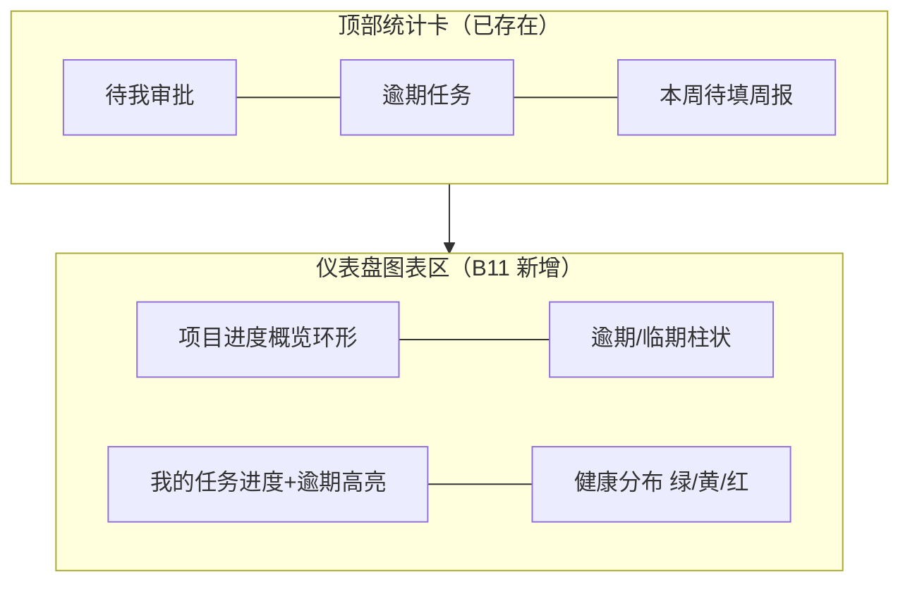

# B11 看板 / 仪表盘增强 — 简单 PRD

> 文档类型：**简单 PRD（默认模板，非完整竞品分析）**
> 作者：产品（许清楚）｜主理人：齐活林
> 项目盘址：`C:/Users/xuwen/WorkBuddy/AstrBytes/pm-app/`
> 技术栈：Vite + React + TS + MUI + Tailwind；后端 Node(Express) + better-sqlite3（真实 DB）；RBAC 服务端强制
> 生成日期：2026-08-10

---

## 0. 现状盘点（务必先读：避免重复造轮子）

B11 启动前，主理人要求先确认现有系统。**经源码核对，需求 #1「项目看板视图（Kanban）」在 B7–B10 期间已被完整实现**，并非空白。下表是已落地能力，B11 只在其上做**增强**，不要重写。

| 能力 | 现状（已落地，可直接复用） | 关键代码位置 |
|---|---|---|
| 看板页面 | 完整拖拽看板：`BoardPage.tsx`，四列（待办/进行中/待评审/完成） | `web/src/pages/projects/BoardPage.tsx` |
| 拖拽改状态 | `@dnd-kit/core` 跨列拖拽 → 调 `POST /wbs/:id/move-status`，改 `status`+`board_order` | `wbsStore.moveTask` → `api.moveTask` |
| WIP 上限 | 每列可设上限（默认「进行中 ≤ 5」），超限拦截 `E_WIP_EXCEEDED` | `board.service.moveTask` `wbs.checkWip` |
| 看板配置 | `board_configs` 表（懒创建），`PATCH /projects/:id/board-config` 改 WIP | `server/services/board.service.js` |
| 后端数据 | `wbs_nodes.status` / `board_order`；卡片＝真叶子（非 nodeType 判定） | `server/services/board.service.js#getBoardInner` |
| 路由 | 项目内独立页签 `GET /projects/:id/board` | `router/index.tsx` + `projects.routes.js` |
| 工作台 | 3 统计卡（待我审批/逾期任务/本周待填周报）+ 4 列表（待我审批/周报提醒/我的任务/我的项目） | `WorkbenchPage.tsx` + `workbench.service.js` |
| 工作台接口 | `GET /api/workbench` → `{stats, myProjects, myTasks, myApprovals, reportReminders}` | `routes/workbench.routes.js` |

**已落地 / 待增强对照（B11 真正要做的）**

| B11 诉求 | 现状 | B11 处置 |
|---|---|---|
| 看板视图（拖拽改状态） | ✅ 已完整 | 仅补缺口（见需求池）：阻塞列缺失、筛选、负责人维度、入口形态 |
| 工作台更直观（图表/进度/风险可视化） | ⚠️ 仅文字列表，无图表 | **B11 主要增量**：在现有 `workbench` 数据上做可视化 |
| 基本筛选 | ❌ 无 | P1 新增 |
| 移动端适配 | ❌ 无 | P2（用户倾向后置） |

> 结论：**B11 工作量重心从「造看板」转移到「仪表盘可视化 + 看板补缺」**。看板后端/前端骨架不动，只补列、筛选、维度、入口等增量。

---

## 1. 产品目标（解决什么痛点）

1. **让进度与风险一眼可见**：工作台从「文字列表」升级为「图表仪表盘」，用户进入即看清逾期、健康度、整体完成度，减少逐条扫读。
2. **补全看板可见性缺口**：现有看板漏掉「阻塞」状态任务、缺乏筛选与按负责人维度，导致部分任务「在板上消失」，需补齐。
3. **在不破坏现有能力的前提下增强**：复用已落地的 `board` / `workbench` 接口与 RBAC，新增能力以增量方式叠加，避免重写与回归。
4. **为移动端/高级可视化留接口**：本次以桌面 MVP 为主，但数据结构与组件预留筛选、多维度、响应式扩展点。

---

## 2. 用户故事（按角色 + 验收标准）

### 2.1 项目经理（PM）
- **US-PM-1｜看全局进度**：作为 PM，我希望在工作台看到「我负责项目的整体进度概览（环形/条）与逾期分布」，以便晨会前 30 秒掌握健康度。
  - *验收*：仪表盘含「项目进度环」与「逾期任务数/分布」；数据来自 `/api/workbench` 现有 `myProjects`/`myTasks`，无需新增后端字段即可渲染。
- **US-PM-2｜看板管理 WIP**：作为 PM，我希望在看板给「进行中」等列设 WIP 上限，超限拖入被拦截。
  - *验收*：该能力**已存在**（`updateBoardConfig`），B11 仅需确认是否默认对所有列开放编辑入口。
- **US-PM-3｜看板找阻塞**：作为 PM，我希望在看板上看到「阻塞」状态的任务，而不是它们在板上消失。
  - *验收*：看板新增「阻塞」列（或明确归并规则），`status='阻塞'` 的任务有可见卡片。

### 2.2 项目成员（Member）
- **US-M-1｜我的任务可视化**：作为成员，我希望工作台用进度条/色块呈现「我的任务」逾期与临期，而非纯文字。
  - *验收*：我的任务区保留列表但增加进度环/逾期高亮；逾期任务红色标识、临期（≤3 天）黄色标识（现状已部分具备，B11 统一视觉规范）。
- **US-M-2｜按负责人看板（可选）**：作为成员，我希望看板能切换成「按负责人分列」，快速看清自己名下任务分布。
  - *验收*：提供「按状态 / 按负责人」视图切换（P1，待确认是否纳入本期）。

### 2.3 管理员 / PMO（Admin）
- **US-A-1｜全局仪表盘（待确认）**：作为管理员，我希望有一个跨项目的全局仪表盘（各项目健康度、逾期汇总、周报填报率）。
  - *验收*：若确认纳入，新增 `GET /api/dashboard`（与遗留 `/api/dashboard` 不冲突，前端不消费旧接口）或在 workbench 增 `companyStats`；否则本期只做个人工作台（见待确认 #9）。
- **US-A-2｜风险可视化**：作为 PMO，我希望仪表盘用颜色区分项目健康（绿/黄/红），并对红色项目给风险提示。
  - *验收*：仪表盘含「项目健康分布」，红/黄项目可点击下钻到项目概览。

---

## 3. 需求池（P0 / P1 / P2）

> 优先级：**P0 = 看板补缺核心 + MVP 仪表盘图表**；**P1 = 筛选/拖拽交互细节/移动端**；**P2 = 高级可视化**。
> 默认技术约束：浅色主题为主（品牌色 `#6DA8AE` 主 / `#2E7D87` 交互功能色 / `#DAF3F7` 极浅底，色相锁 182~188）；不新增 Render 等第三方部署配置；不使用 localStorage 替代真实后端。

### P0（本期必须，MVP）
| 编号 | 需求 | 说明 |
|---|---|---|
| P0-1 | 看板补「阻塞」状态列 | 现有 `BOARD_COLUMNS=[待办,进行中,待评审,完成]` 缺 `阻塞`，导致阻塞任务不可见。后端 `ensureBoardConfig` 默认列与前端 `BOARD_COLUMNS` 同步补「阻塞」，或明确归并规则。 |
| P0-2 | 工作台「项目进度概览」卡片 | 基于 `/api/workbench` 现有 `myProjects`（含 `progress`/`health`）渲染整体完成度环形图 + 健康分布。纯前端聚合，零后端改动。 |
| P0-3 | 工作台「逾期 / 临期可视化」 | 基于 `myTasks` 的 `dueDate` 渲染逾期柱状/计数（现状已有 `stats.overdueTasks` 文本，B11 升级为图表+逐项目下钻）。 |
| P0-4 | 仪表盘视觉规范统一 | 图表采用品牌色板，浅色主题；图表组件封装为 `components/common` 复用（进度环、柱状、分布）。 |

### P1（本期应包含，体验增强）
| 编号 | 需求 | 说明 |
|---|---|---|
| P1-1 | 看板基础筛选 | 按里程碑、负责人、关键字筛选看板卡片（现状无筛选）。前端基于现有 `BoardView` 客户端过滤即可。 |
| P1-2 | 看板「按状态 / 按负责人」维度切换 | 默认按状态（现状）；可选切换为按负责人分列（泳道）。后端 `getBoard` 支持 `groupBy` 参数（status\|owner）。 |
| P1-3 | 看板入口形态确认 | 现状为项目内独立 Tab `/board`；确认是否改为 WBS 页内「树 / 看板」视图切换开关（更贴合用户原始表述「在 WBS 树基础上新增看板视图」）。 |
| P1-4 | 拖拽改负责人（可选） | 现状拖拽仅改 `status`；P1 可研究拖到「负责人泳道」改 `owner`（需后端 `PATCH /wbs/:id` owner，已存在）。 |
| P1-5 | 移动端基础适配 | 看板列横向滚动/堆叠、仪表盘卡片单列；用户倾向后置但建议本期至少保证可读（非完美）。 |

### P2（后续迭代 / 高级）
| 编号 | 需求 | 说明 |
|---|---|---|
| P2-1 | 工时趋势图 | 基于 `myTasks`/`effortHours` 渲染工时累计/趋势（需后端按周聚合或复用 B9 工时报表）。 |
| P2-2 | 全局仪表盘（管理员/PMO） | 跨项目健康、逾期、周报填报率；新增 `GET /api/dashboard` 服务端聚合（见 US-A-1）。 |
| P2-3 | 风险热力 / 关键路径标记 | 看板卡片标 `isCritical`，仪表盘叠加风险维度。 |
| P2-4 | 拖拽排序持久化优化 | 同列内 `board_order` 排序的手感与落库一致性增强（现状已支持 `order` 参数）。 |
| P2-5 | 图表导出 / 分享 | 仪表盘快照导出（PNG/PDF）。 |

---

## 4. UI 设计稿（关键布局，文字 + Mermaid）

### 4.1 看板页面（增强后，单项目内）
- **布局**：横向四/五列（待办 / 进行中 / 待评审 / 阻塞 / 完成），列头含状态名 + WIP Chip（`n/上限`）+ 编辑图标；列体为可放置区，卡片含 `wbsCode+名称`、`进度条`、估/实工时、负责人头像。
- **顶部工具条**：视图切换（状态｜负责人，P1-2）+ 筛选（里程碑/负责人/关键字，P1-1）+ 刷新。
- **交互**：拖卡片跨列改状态（已存在）；WIP 超限 toast 拦截（已存在）。

```mermaid
flowchart LR
  subgraph Toolbar["看板工具条"]
    V[视图: 状态|负责人]
    F[筛选: 里程碑/负责人/关键字]
  end
  subgraph Board["看板区 单项目 /projects/:id/board"]
    C1["待办\nWIP n/∞"]
    C2["进行中\nWIP n/5"]
    C3["待评审\nWIP n/∞"]
    C4["阻塞 ★新增\nWIP n/∞"]
    C5["完成\nWIP n/∞"]
  end
  Toolbar --> Board
  C1 --- C2 --- C3 --- C4 --- C5
```

### 4.2 工作台仪表盘（增强后，个人视角）
- **顶部**：保留 3 张统计卡（待我审批/逾期任务/本周待填周报），下方进入图表区。
- **图表区（2×2 栅格，浅色主题）**：
  1. 项目进度概览（环形：整体完成度 + 健康色环）
  2. 逾期 / 临期分布（柱状：按项目或按状态）
  3. 我的任务进度（列表+进度环，逾期红/临期黄）
  4. 健康分布（堆叠条：绿/黄/红项目数，可下钻）
- 保持与 `WorkbenchPage` 现有「待我审批 / 周报提醒 / 我的任务 / 我的项目」4 区块共存或折叠为「详情」。



---

## 5. 待确认问题（需主理人 / 用户拍板）

> 以下为范围收敛关键决策点，请逐条回复；标注「★」者为本次必须拍板项。

1. **★ 看板分列维度**：现状为「按状态」固定四列（待办/进行中/待评审/完成）。B11 是否要增加「按负责人」维度/切换（P1-2）？默认仍按状态？
2. **★ 看板拖拽改哪个字段**：现状只改 `status`（及 `board_order`），负责人不可经看板拖拽改。是否要支持拖到「负责人泳道」改 `owner`（P1-4）？还是本期维持「只改状态」？
3. **★ 仪表盘要哪些图表**：进度环（P0-2）、逾期柱状（P0-3）、健康分布（P0-4）、工时趋势（P2-1）中，本期 P0 必做哪几个？建议 P0 = 进度环 + 逾期柱状 + 健康分布。
4. **★ 数据范围（看板）**：现状看板是**单项目内**（`/projects/:id/board`）。是否要跨项目全局看板？建议本期维持单项目，全局看板列入 P2。
5. **★ 移动端适配**：用户倾向放后面，本次是否纳入？建议：本期至少保证可读（P1-5 基础适配），不追求完美。
6. **【新增·阻塞列】**：看板当前 `BOARD_COLUMNS` 不含「阻塞」，导致 `status='阻塞'` 任务在板上不可见。请拍板：① 补「阻塞」独立列（推荐）；② 归并到「待办」列？建议补独立列（P0-1）。
7. **【新增·入口形态】**：现状看板是项目内独立 Tab，与 WBS 树并列。B11 是保持独立 Tab，还是在 WBS 页内做「树 / 看板」视图切换开关（更贴合原始表述）？建议保持独立 Tab，降低改动面（P1-3）。
8. **【新增·仪表盘数据来源】**：MVP 仪表盘是否允许**纯前端聚合**现有 `/api/workbench`（`myProjects`/`myTasks`）来画图（零后端改动）？还是必须服务端出聚合接口？建议：P0 纯前端聚合；P2 全局仪表盘再上服务端聚合（US-A-1）。
9. **【新增·全局仪表盘】**：仪表盘是「个人工作台」（现状，推荐本期）还是要一个「管理员/PMO 全局仪表盘」（跨项目）？建议：本期只做个人工作台；全局仪表盘列入 P2-2。

---

## 6. 范围建议（一句话）

**B11 = 在已落地的看板基础上补「阻塞列 + 筛选 +（可选）负责人维度」，并把工作台从文字列表升级为「进度环 + 逾期柱状 + 健康分布」的图表仪表盘（纯前端聚合现有 workbench 数据，零后端破坏性改动）。**

---

## 附录：关键约束与复用清单
- 品牌色（色相 182~188，浅色为主）：主 `#6DA8AE`、交互功能 `#2E7D87`/`#3D7178`、亮 `#77C1C4`、极浅底 `#DAF3F7`。
- 不新增 Render 等第三方部署配置；不改用 localStorage / mock 替代真实后端。
- 复用：`GET /api/workbench`、`GET /projects/:id/board`、`POST /wbs/:id/move-status`、`PATCH /projects/:id/board-config`、RBAC（`task:status` / `board:config`）。
- 状态枚举 `TaskStatus = 待办/进行中/待评审/完成/阻塞`；看板默认列 `BOARD_COLUMNS = [待办, 进行中, 待评审, 完成]`（缺阻塞，见待确认 #6）。
