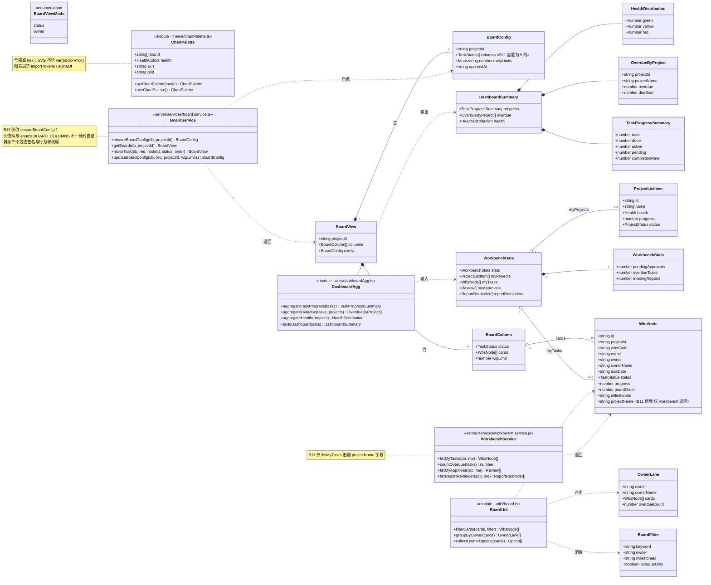
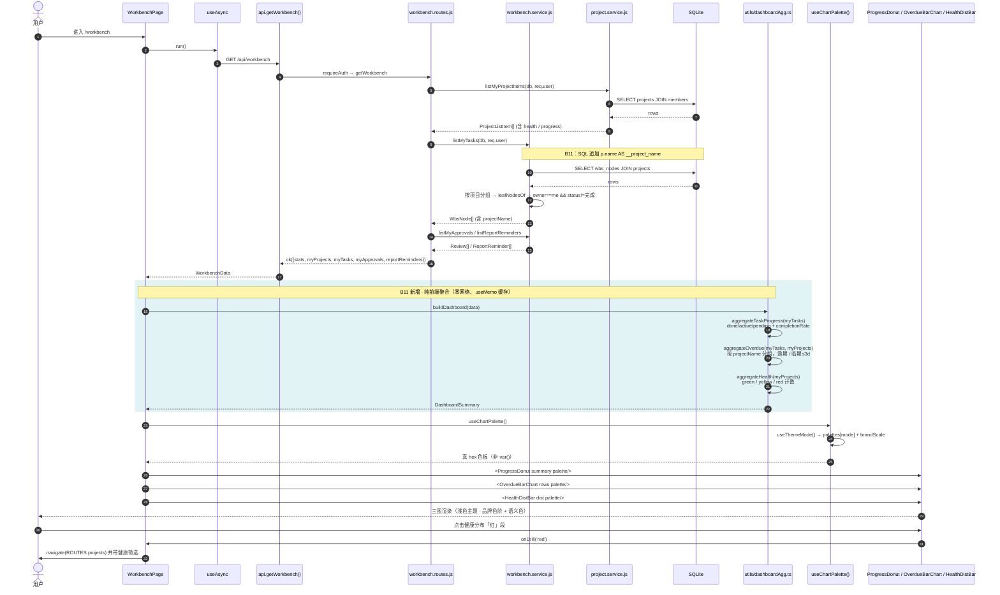
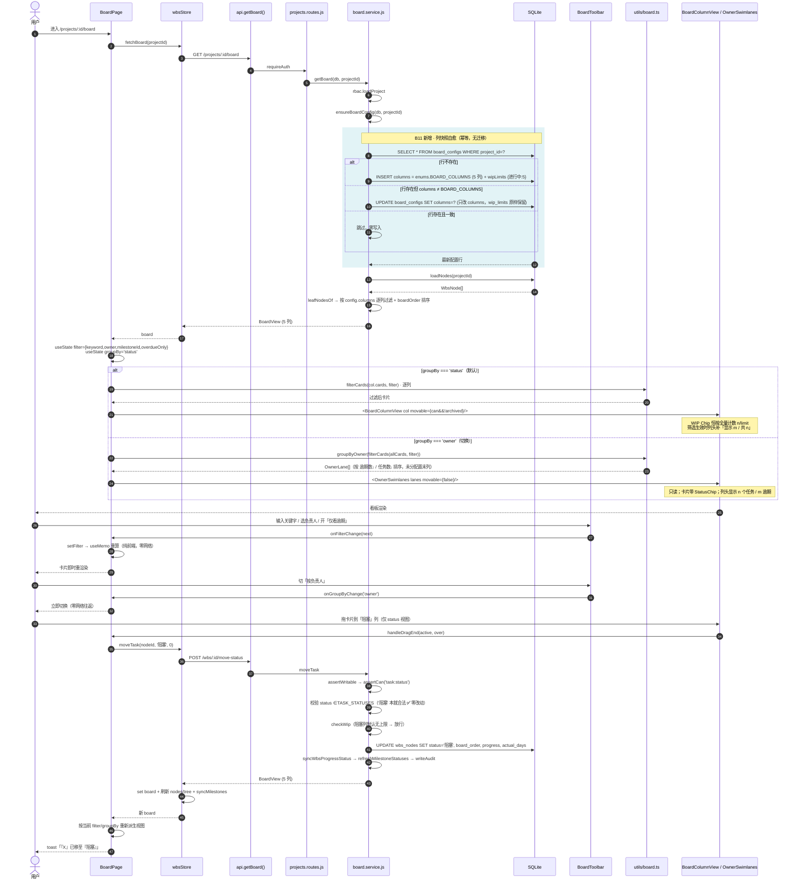
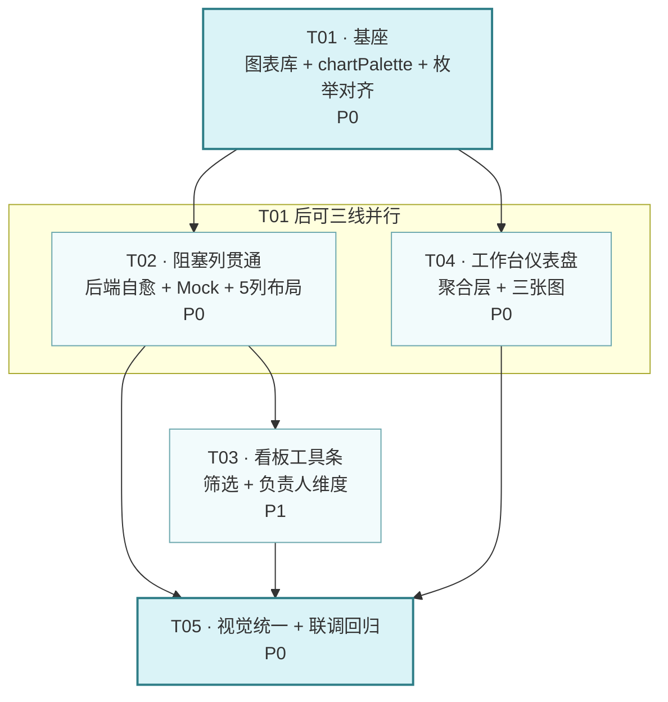

# B11 架构设计与任务分解 — 仪表盘可视化 + 看板补缺

> 文档类型：**系统设计 + 任务分解（一体）**
> 作者：架构（高见远）｜主理人：齐活林｜上游输入：`docs/B11-PRD.md`（许清楚）
> 项目盘址：`C:/Users/xuwen/WorkBuddy/AstrBytes/pm-app/`
> 生成日期：2026-08-10
> 适用范围：**个人工作台仪表盘 MVP + 单项目内看板补缺**（跨项目全局仪表盘、移动端完美适配已由用户拍板后置）

---

## 0. 读码结论（先纠三条事实，避免按错误前提施工）

本节是设计的地基，工程师开工前**必须先认这三条**，否则会做多余的活。

| # | 传闻 / 假设 | **实际源码事实** | 影响 |
|---|---|---|---|
| ①| 「`BOARD_COLUMNS` 只有 待办/进行中/完成 三列」 | ❌ 错。`server/config/enums.js:88` 与 `web/src/types/wbs.ts:37` 均为 **4 列**：`['待办','进行中','待评审','完成']` | 补列后是 **5 列**，不是 4 列；布局要按 5 列算宽度 |
| ②| 「需要扩展状态枚举才能支持阻塞」 | ❌ 错。`TASK_STATUSES`（前后端两处，`enums.js:85` / `enums.ts:152` / `types/wbs.ts:35`）**已含 `'阻塞'`**；`LEGACY_TASK_STATUS_MAP` 也已映射 `已阻塞→阻塞`；`tokens.ts:254` 已有 `阻塞 → danger` 配色 | **状态枚举零改动**，向后兼容问题不存在 |
| ③| 「`moveTask` 拖到阻塞列会被拒」 | ❌ 错。`board.service.js:99` 校验的是 `enums.TASK_STATUSES`（含阻塞），不是 `BOARD_COLUMNS` | **拖拽落库逻辑零改动**，补列即通 |

### 由此得出的核心判断

> **「阻塞列」是一个纯展示层缺口，不是数据模型缺口。**
> 真正要改的只有两处枚举数组 + 一处历史配置自愈。**无需 DB migration、无需 schema 变更、无需数据回填。**

**补充发现（真正的坑，必须处理）**：
`board_configs.columns` 在 `ensureBoardConfig`（`board.service.js:36-49`）**懒创建时把当时的 `BOARD_COLUMNS` 快照落库**，而 `getBoardInner`（L234）遍历的是 `config.columns`（DB 值）而非 `enums.BOARD_COLUMNS`。同时 `updateBoardConfig`（L170-207）**只写 `wip_limits`，从不写 `columns`** —— 意味着：

- `columns` 对用户**不可配置**，它只是一份「创建时刻的枚举快照」；
- 光改 `enums.js` 常量，**已有项目的看板仍然是 4 列**（老快照），新项目才 5 列 → 会出现「同一套代码两种列数」的诡异现象。

**处置结论（决策 D-B11-1）**：在 `ensureBoardConfig` 里加**读时自愈（reconcile）**——发现 DB 快照与 `enums.BOARD_COLUMNS` 不一致就就地改写。理由：
1. 幂等、无迁移文件、无停机，读一次修一次；
2. 覆盖面比 migration 更广（含未来任何列增删、含已 seed 的开发库）；
3. `columns` 本就不是用户数据（无 API 可改），改写不丢任何用户配置（`wip_limits` 不动）。

> ⚠️ 反面做法：写 `migrations.js` v7 做一次性 UPDATE。不推荐——它只修一次，下次再加列还得再写一版；且开发同学本地库版本参差，容易漏。自愈是长期正确解。

---

## 1. 实现方案与框架选型

### 1.1 核心技术难点

| 难点 | 处置 |
|---|---|
| **D1 图表库要与既有 MUI 体系无缝共存**，不引入第二套样式范式 | 选 `@mui/x-charts`（见 1.2） |
| **D2 SVG 不吃 CSS 变量** —— 现有 `tokens` 全部是 `var(--x)`，`alphaOf()` 返回 `color-mix()`。图表库把颜色写进 SVG **presentation attribute**（`fill="..."`），此处 CSS 变量与 `color-mix()` **不生效**，会渲染成黑色/透明 | 新建 `chartPalette.ts`，从 `brandScale` / `palettes[mode]`（这两个是**真 hex**）取色，经 `useThemeMode()` 按主题解析；**图表层禁用 `tokens.*` 与 `alphaOf()`** |
| **D3 品牌色相锁 182~188 与「绿黄红健康度」语义色冲突** | 定分层规则（见 1.4）：**量级类图表走品牌色阶，风险/健康类图表走语义色**，二者不混用 |
| **D4 筛选后 WIP 计数口径会失真** | 定规则：WIP Chip **恒按全量卡片计数**，筛选只影响可见卡片；筛选生效时列头补显「显示 m / 共 n」（见 §7 SK-B11-3） |
| **D5 按负责人分列时「拖拽」语义歧义**（拖到别人泳道 = 改 owner？） | 本期**负责人视图只读不可拖**，改 owner 属 P1-4，明确不做。切回状态视图恢复拖拽（见 §3.3） |
| **D6 仪表盘不能引入后端破坏性改动** | 纯前端聚合 `/api/workbench`；仅追加**一个**非破坏性字段 `myTasks[].projectName`（见 1.5） |

### 1.2 图表库选型 —— **结论：`@mui/x-charts@^7.12.0`**

| 维度 | **@mui/x-charts v7** ✅ 选定 | recharts v2 ❌ 落选 |
|---|---|---|
| 与现有栈一致性 | 项目已装 `@mui/x-date-pickers@^7.12.0`、`@mui/x-tree-view@^7.12.0`，**同一 x 系列同一 v7 主线**，升级/锁版本节奏统一 | 独立生态，第三方版本轴 |
| peerDependency | 要求 `@mui/material ^5.15.14 \|\| ^6`，项目为 `^5.16.7` ✅ 直接兼容，无需升 MUI | 无 MUI 约束，但也无 MUI 感知 |
| 主题贯通 | 直接消费 MUI `Theme`（字体、`palette.text.secondary`、断点），坐标轴/图例天生跟随浅色主题 | 需手写 `<ResponsiveContainer>` + 逐项传 style，主题切换要自己搭桥 |
| 样式范式 | Emotion（项目已有），**不新增 runtime** | 自带样式方案，与 Emotion 并存 |
| 许可 | 本期用到的 `PieChart` / `BarChart` 均在 **MIT 社区包**内（Pro 仅限热力图等高级件），自部署商用无风险 | MIT |
| 体积 | 按需引入 `d3-scale/d3-shape` 子包，Vite 可 tree-shake | 同量级，但多一份 d3 副本 |
| 无障碍 / 响应式 | 内置 `width`/`height` 自适应 + `<title>` | 需自行补 |

**取舍说明**：recharts 的 API 更「React 味」、社区示例更多，学习成本略低。但本期只画 3 张标准图（环形/柱状/堆叠条），复杂度不足以抵消「引入第二套图表生态 + 主题手工搭桥」的长期成本。**选型不再讨论，工程师照 `@mui/x-charts` 实施。**

- 新增依赖：`@mui/x-charts@^7.12.0`（`dependencies`）
- 无需新增 `@emotion/*`、`d3-*`（作为 x-charts 传递依赖自动安装）
- 无 devDependency 变更

### 1.3 仪表盘为何「纯前端聚合」

`GET /api/workbench` 已一次性返回 `{stats, myProjects, myTasks, myApprovals, reportReminders}`，三张图所需的**全部原子数据都在里面**：

| 图 | 数据来源 | 聚合方式 |
|---|---|---|
| 进度环 | `myTasks[].status` | 按 `完成 / 进行中·待评审 / 待办·阻塞` 三段计数 + 总完成度% |
| 逾期柱状 | `myTasks[].dueDate` + `projectId/projectName` | 按项目分组，算「逾期 / 临期(≤3d)」两个序列 |
| 健康分布 | `myProjects[].health` | 按 `green/yellow/red` 计数 |

服务端再做一次聚合 = 重复计算 + 新增接口 + 新增 RBAC 面 + 新增回归面，收益为零。**MVP 阶段前端聚合是正确的架构选择**；等 P2 做「跨项目全局仪表盘」（数据量与权限面质变）时再上服务端聚合接口，届时前端聚合函数可原样复用为契约参考。

### 1.4 图表配色规范（硬约束落地）

**分层规则（决策 D-B11-2）——两类图表用两套色，不得混用：**

| 图表语义 | 取色来源 | 具体值（light） | 适用 |
|---|---|---|---|
| **量级类**（进度、任务数、工时——「多少」） | `brandScale` 色阶 | `#2E7D87`(700) / `#6DA8AE`(500) / `#9BD3D9`(300) / `#DAF3F7`(100) | 进度环、逾期柱状 |
| **风险类**（健康度、逾期告警——「好坏」） | `palettes[mode]` 语义色 | `#047857` 绿 / `#B45309` 黄 / `#DC2626` 红 | 健康分布、逾期序列着色 |

**为什么允许语义色破「色相锁 182~188」**：色相锁的目的是**防止彩虹配色与高饱和撞色**，而非禁用红绿黄。项目 light 主题的语义三色（`#047857/#B45309/#DC2626`）本身是**低饱和沉稳色**，与青蓝品牌色共存视觉不冲突；且「健康度绿黄红」是 PMO 领域的通用心智，改用青蓝深浅表达反而降低可读性。**规则：一张图内只用一套色系；同一页面两套色系可并存。**

**主题约束**：`DEFAULT_THEME_MODE = 'light'`（`themeContext.tsx:30`）已经是浅色，**本期不改任何主题默认值**。`chartPalette` 同时提供 dark 取值，仅为切换时不崩，不作为设计目标。

### 1.5 后端改动清单（非破坏性，仅 1 项）

| 改动 | 性质 | 说明 |
|---|---|---|
| `ensureBoardConfig` 列自愈 | **行为修正**（非契约变更） | 返回结构不变，只是 `config.columns` 从 4 项变 5 项 |
| `enums.BOARD_COLUMNS` 加 `'阻塞'` | 常量变更 | 见 §0 决策 D-B11-1 |
| `myTasks[].projectName` | **纯字段追加** | 逾期柱状图需要按项目分组展示名称。`myTasks` 可能包含 `草稿/审批中/挂起` 项目的任务，而 `myProjects` 只列「在办」，前端 join 会漏 → 服务端直接给名字最稳。**不删不改任何既有字段**，老前端无感 |

> ❌ **明确不做**：不新增 `GET /api/dashboard`；不给 `getBoard` 加 `groupBy` 参数（分组是纯视图问题，见 §3.3）；不动 `moveTask` / `updateBoardConfig` 任何签名；不新增 migration；不新增/修改任何部署平台配置（用户自有服务器自部署）。

---

## 2. 文件列表（相对 `pm-app/`）

图例：🆕 新建 ｜ ✏️ 修改 ｜ 行数为**预估增量**

### 2.1 后端（server/）

| 文件 | 操作 | 职责 | 增量 |
|---|---|---|---|
| `server/config/enums.js` | ✏️ | `BOARD_COLUMNS` 补 `'阻塞'` → `['待办','进行中','阻塞','待评审','完成']`；同步更新 L87 注释（原注释「不含阻塞」需删） | ~2 行 |
| `server/services/board.service.js` | ✏️ | `ensureBoardConfig` 增**列自愈**：读到的 `columns` 与 `enums.BOARD_COLUMNS` 不等值时，就地 `UPDATE board_configs SET columns=?`（**不动 `wip_limits`**，不写审计——非用户行为） | ~18 行 |
| `server/services/workbench.service.js` | ✏️ | `listMyTasks` 的 SQL 追加 `p.name AS __project_name`，映射后挂 `projectName` 字段（其余口径一字不改） | ~6 行 |
| `server/routes/workbench.routes.js` | ✏️ | 仅注释补充「myTasks 含 projectName」；**代码无需改**（透传） | ~3 行 |

> `server/lib/mappers.js`、`server/routes/projects.routes.js`、`server/routes/wbs.routes.js`、`server/dal/migrations.js`、`server/middleware/rbac.js` —— **全部不动**。

### 2.2 前端 · 主题与类型

| 文件 | 操作 | 职责 | 增量 |
|---|---|---|---|
| `web/src/theme/chartPalette.ts` | 🆕 | **图表取色唯一入口**。导出 `getChartPalette(mode)` → `{ brand: string[], health: {green,yellow,red}, axis, grid, tooltipBg }`（全部真 hex，来自 `brandScale` / `palettes`）；导出 `useChartPalette()` hook（内部 `useThemeMode()`）。**文件头写死禁令：图表层禁止 import `tokens` 与 `alphaOf`** | ~70 行 |
| `web/src/types/wbs.ts` | ✏️ | `BOARD_COLUMNS` 补 `'阻塞'`（与后端逐字一致）；新增 `BoardGroupBy = 'status' \| 'owner'`、`BoardFilter` 接口 | ~15 行 |
| `web/src/types/dashboard.ts` | 🆕 | 仪表盘聚合结果类型：`TaskProgressSummary`、`OverdueByProject`、`HealthDistribution`、`DashboardSummary` | ~45 行 |

> `web/src/theme/tokens.ts`、`muiTheme.ts`、`themeContext.tsx`、`styles/index.css` —— **不动**（浅色默认已符合要求）。

### 2.3 前端 · 仪表盘（B11 主增量）

| 文件 | 操作 | 职责 | 增量 |
|---|---|---|---|
| `web/src/utils/dashboardAgg.ts` | 🆕 | **纯函数聚合层**（参照既有 `utils/reportAgg.ts` 范式，零 React 依赖、可单测）。`aggregateTaskProgress(myTasks)` / `aggregateOverdue(myTasks, myProjects)` / `aggregateHealth(myProjects)` / `buildDashboard(data)` | ~130 行 |
| `web/src/components/dashboard/ProgressDonut.tsx` | 🆕 | 环形图（`PieChart` + `innerRadius`），中心叠加「总完成度 %」大字。三段：完成/在办(进行中+待评审)/未启动(待办+阻塞)，品牌色阶 | ~90 行 |
| `web/src/components/dashboard/OverdueBarChart.tsx` | 🆕 | 横向 `BarChart`，按项目分组，两序列「已逾期(danger)/临期≤3天(warning)」。空数据显示「无逾期任务 🎉」 | ~95 行 |
| `web/src/components/dashboard/HealthDistBar.tsx` | 🆕 | 单行堆叠 `BarChart`（绿/黄/红），下方图例含数量，点击图例段可 `navigate` 下钻到项目列表 | ~85 行 |
| `web/src/components/dashboard/ChartCard.tsx` | 🆕 | 图表统一外壳：复用 `SectionCard` + 固定高度 + 加载骨架 + 空态。**保证三图视觉一致，避免各画各的** | ~55 行 |
| `web/src/components/dashboard/index.ts` | 🆕 | barrel 导出 | ~6 行 |
| `web/src/pages/WorkbenchPage.tsx` | ✏️ | 在 3 张 `StatCard` 与既有 4 区块之间插入「图表区」（`xs:1fr / md:repeat(3,1fr)` 栅格）；调用 `buildDashboard(data)`。**既有 4 区块与交互全部保留不动** | ~40 行 |

### 2.4 前端 · 看板补缺

| 文件 | 操作 | 职责 | 增量 |
|---|---|---|---|
| `web/src/utils/board.ts` | 🆕 | 纯函数：`filterCards(cards, filter)`（关键字匹配 `wbsCode+name`、负责人、里程碑、仅逾期）、`groupByOwner(cards)`、`collectOwnerOptions(cards)` | ~95 行 |
| `web/src/components/board/BoardToolbar.tsx` | 🆕 | 工具条：关键字 `TextField` + 负责人 `Select` + 里程碑 `Select` + 「仅看逾期」`Switch` + 视图切换 `ToggleButtonGroup`(状态/负责人) + 「清空筛选」 | ~130 行 |
| `web/src/components/board/OwnerSwimlanes.tsx` | 🆕 | 按负责人分列的**只读**视图：每人一列，列头 `UserAvatar`+姓名+`n 个任务 / m 逾期`，卡片带 `StatusChip`（列不再表状态，必须在卡上标） | ~110 行 |
| `web/src/components/board/index.ts` | 🆕 | barrel | ~4 行 |
| `web/src/pages/projects/BoardPage.tsx` | ✏️ | ①接工具条与筛选状态；②按 `groupBy` 切换渲染 `BoardColumnView[]` / `OwnerSwimlanes`；③5 列布局宽度调整（`minWidth` 200→176、`flex 1 1 200px`）；④列头补「显示 m / 共 n」；⑤owner 视图下 `movable=false`。**`DndContext`/`BoardCard`/`CardBody`/WIP 弹窗全部原样保留** | ~85 行 |
| `web/src/api/mock/index.ts` | ✏️ | Mock 侧 `columns: [...BOARD_COLUMNS]` 会自动跟随（L530/L838/L1615 无需改）；仅需在 seed 里补 1~2 条 `status='阻塞'` 样本任务，保证 mock 模式也能看到阻塞列有卡 | ~10 行 |

### 2.5 文档与验证

| 文件 | 操作 | 职责 |
|---|---|---|
| `scripts/qa_b11_verify.mjs` | 🆕 | 沿用 `qa_b9/b10_verify.mjs` 范式：校验 ①`getBoard` 返回 5 列且含阻塞 ②老 `board_configs` 行被自愈 ③拖到阻塞列成功落库 ④`/api/workbench` 的 `myTasks[0].projectName` 存在 ⑤既有 WIP 拦截未回归 |
| `docs/api-contract.md` | ✏️ | 更新 `BoardConfig.columns` 默认值、`myTasks` 追加 `projectName` |
| `docs/B11-class-diagram.mermaid` | 🆕 | §3 类图（已生成） |
| `docs/B11-sequence-diagram.mermaid` | 🆕 | §4 时序图（已生成） |

---

## 3. 数据结构与接口

### 3.1 类图



### 3.2 接口契约变更（**唯一一处 diff**）

**`GET /api/workbench`** — 结构不变，`myTasks[]` 追加字段：

```diff
  myTasks: [{
      id, projectId, wbsCode, name, owner, ownerName,
      startDate, dueDate, status, progress, boardOrder, ...
+     projectName: string     // B11 新增·纯追加，老客户端无感
  }]
```

**`GET /api/projects/:projectId/board`** — **结构完全不变**，仅返回值内容变化：

```diff
  {
    projectId,
    columns: [
      { status: '待办',   cards, wipLimit: 0 },
      { status: '进行中', cards, wipLimit: 5 },
+     { status: '阻塞',   cards, wipLimit: 0 },   // 新增列
      { status: '待评审', cards, wipLimit: 0 },
      { status: '完成',   cards, wipLimit: 0 }
    ],
-   config: { columns: ['待办','进行中','待评审','完成'], wipLimits: {...} }
+   config: { columns: ['待办','进行中','阻塞','待评审','完成'], wipLimits: {...} }
  }
```

**`POST /api/wbs/:nodeId/move-status`** / **`PATCH /api/projects/:projectId/board-config`** — **零变更**（`阻塞` 本就是合法 `TaskStatus`，`updateBoardConfig` 依旧只收 `wipLimits`）。

### 3.3 关键设计决策

#### D-B11-3 · 列顺序 = `待办 → 进行中 → 阻塞 → 待评审 → 完成`

`阻塞` 是「进行中的异常分支」而非流程终点，紧邻 `进行中` 放置，PM 扫一眼就能看到「在办但卡住」的量；`完成` 恒为最右终点符合看板通识。
> ⚠️ 此顺序与 PRD §4.1 示意图（`…待评审/阻塞/完成`）不同，是有意为之，见 §9 待明确 #1（默认按本设计执行）。

#### D-B11-4 · 阻塞列默认不设 WIP 上限

`wipLimits` 默认值保持 `{进行中: 5}` 一字不改。理由：给阻塞设上限会导致「任务卡住了还不让标阻塞」的荒谬拦截。列头仍显示计数（`n`，无分母），PM 可通过既有 WIP 弹窗自行加限。

#### D-B11-5 · 分组与筛选 100% 在前端做，后端零改动

`getBoard` 已一次性返回项目内全部叶子卡片，分组/筛选是**纯视图变换**。加 `groupBy` 查询参数只会带来：新增服务端分支 + 新增 RBAC 面 + 每次切视图多一次网络往返 + 拖拽后要重新决定返回形状。**前端 `useMemo` 一行搞定，且切视图零延迟。**

#### D-B11-6 · 负责人视图只读

按负责人分列时，「拖到别人泳道」的自然语义是改 `owner`，属 PRD P1-4（本期不做）。若保留拖拽但只允许同泳道内改状态，交互解释成本极高。**结论：`groupBy==='owner'` 时 `movable=false`，工具条给 Tooltip「按负责人视图为只读，切回『按状态』可拖拽改状态」。**

---

## 4. 程序调用流程

### 4.1 工作台加载 → 三图渲染



### 4.2 看板加载 → 筛选 / 维度切换 / 拖拽



---

## 5. 依赖包

### 5.1 新增（仅 1 个）

```
@mui/x-charts@^7.12.0   图表库（PieChart / BarChart，MIT 社区包）
                        peer: @mui/material ^5.15.14 || ^6  ← 项目 ^5.16.7 ✅
                        与已装 @mui/x-date-pickers@^7.12.0 / @mui/x-tree-view@^7.12.0 同主线
```

### 5.2 安装命令

```bash
cd C:/Users/xuwen/WorkBuddy/AstrBytes/pm-app/web
npm i @mui/x-charts@^7.12.0
npm run typecheck        # 必须先过类型再写业务代码
```

### 5.3 安装要点（避坑）

1. **不要装 v8**。`@mui/x-charts@8` 要求 `@mui/material ^7`，会连锁逼升整个 MUI 大版本 → 全站回归。**锁 `^7.12.0`**。
2. **不要额外手装 `d3-*`**。作为传递依赖自动进来；手装易出双版本。
3. 后端 **零新增依赖**（`server/` 的 `package.json` 不动）。
4. 装完先跑 `npm run build` 确认产物体积可接受（预期 +~180KB gzip 前）。若超预算，按需从 `@mui/x-charts/PieChart`、`@mui/x-charts/BarChart` 子路径引入而非从包根引。

---

## 6. 任务列表

> **5 个任务，按依赖顺序。** T02 / T03 / T04 在 T01 完成后**可三线并行**。
> 括号内为主理人原始 T1–T9 设想的映射，便于对表。

### T01 · 基座：图表库接入 + 图表配色规范 + 枚举单一数据源对齐
- **优先级**：P0
- **依赖**：无
- **映射**：主理人 T1 + T8(规范部分) + T2(枚举部分)
- **源文件**：
  - `web/package.json`（+ `@mui/x-charts@^7.12.0`）
  - `web/src/theme/chartPalette.ts` 🆕
  - `web/src/types/wbs.ts` ✏️（`BOARD_COLUMNS` 补 `'阻塞'`；新增 `BoardGroupBy` / `BoardFilter`）
  - `web/src/types/dashboard.ts` 🆕
  - `server/config/enums.js` ✏️（`BOARD_COLUMNS` 补 `'阻塞'` + 修注释）
- **完成标准**：
  1. `npm run typecheck` 通过；
  2. 前后端两处 `BOARD_COLUMNS` **逐字一致**（`['待办','进行中','阻塞','待评审','完成']`）；
  3. `chartPalette.ts` 导出值全为 `#RRGGBB`，全文件无 `var(--`、无 `alphaOf`、无 `color-mix`；
  4. 文件头注释写明「图表层禁止 import tokens / alphaOf（SVG 属性不解析 CSS 变量）」。

### T02 · 看板「阻塞」列贯通（后端自愈 + Mock 同步 + 5 列布局）
- **优先级**：P0
- **依赖**：T01
- **映射**：主理人 T2
- **源文件**：
  - `server/services/board.service.js` ✏️（`ensureBoardConfig` 列自愈）
  - `web/src/api/mock/index.ts` ✏️（seed 补阻塞样本任务）
  - `web/src/pages/projects/BoardPage.tsx` ✏️（5 列宽度：`minWidth` 200→176、`flex:'1 1 200px'`）
  - `scripts/qa_b11_verify.mjs` 🆕（骨架 + 阻塞列断言）
- **完成标准**：
  1. **老项目**（DB 里已有 4 列快照）刷新看板后变 5 列，且 `wip_limits` **原值未丢**；
  2. 连续两次 `getBoard` 第二次**零 UPDATE**（自愈幂等）；
  3. `status='阻塞'` 的任务出现在阻塞列；
  4. 拖任务到阻塞列成功落库并写审计；
  5. 既有 WIP 拦截（`E_WIP_EXCEEDED`）未回归；
  6. `VITE_USE_MOCK=true` 与 `false` 两种模式列数一致。
- ⚠️ **红线**：`updateBoardConfig` / `moveTask` / `getBoardInner` 的**签名与既有行为一字不改**；不写 migration；自愈**不写审计日志**（非用户行为）。

### T03 · 看板工具条：筛选 + 按负责人维度切换
- **优先级**：P1
- **依赖**：T02
- **映射**：主理人 T3 + T4
- **源文件**：
  - `web/src/utils/board.ts` 🆕（`filterCards` / `groupByOwner` / `collectOwnerOptions`）
  - `web/src/components/board/BoardToolbar.tsx` 🆕
  - `web/src/components/board/OwnerSwimlanes.tsx` 🆕
  - `web/src/components/board/index.ts` 🆕
  - `web/src/pages/projects/BoardPage.tsx` ✏️（接入工具条 / 分组切换 / 列头计数）
- **完成标准**：
  1. 关键字命中 `wbsCode` 或 `name`（忽略大小写、去首尾空格）；
  2. 筛选后 **WIP Chip 仍显示全量 `n/limit`**，列头额外显示「显示 m / 共 n」（仅筛选生效时出现）；
  3. 「按负责人」视图：每人一列，按 `逾期数↓ → 任务数↓` 排序，**未分配（owner 为空）恒排最后一列**；卡片带 `StatusChip`；
  4. 负责人视图下卡片**不可拖**，工具条 Tooltip 有说明；切回状态视图拖拽恢复正常；
  5. 切视图 / 改筛选**零网络请求**（DevTools Network 验证）；
  6. 筛选/视图状态**仅存组件内 state**，不落 URL、不落 localStorage（本期不做持久化）。
- ⚠️ **红线**：`DndContext` / `BoardCard` / `CardBody` / WIP 编辑弹窗**原样保留**；Hooks 数量不得随卡片数变化（沿用现有「真组件」写法，勿退回 `renderCard()` 函数式渲染）。

### T04 · 工作台仪表盘：前端聚合层 + 三张图
- **优先级**：P0
- **依赖**：T01（**可与 T02 / T03 并行**）
- **映射**：主理人 T5 + T6 + T7
- **源文件**：
  - `web/src/utils/dashboardAgg.ts` 🆕
  - `web/src/components/dashboard/ChartCard.tsx` 🆕
  - `web/src/components/dashboard/ProgressDonut.tsx` 🆕
  - `web/src/components/dashboard/OverdueBarChart.tsx` 🆕
  - `web/src/components/dashboard/HealthDistBar.tsx` 🆕
  - `web/src/components/dashboard/index.ts` 🆕
  - `web/src/pages/WorkbenchPage.tsx` ✏️
  - `server/services/workbench.service.js` ✏️（`listMyTasks` 追加 `projectName`）
  - `server/routes/workbench.routes.js` ✏️（仅注释）
- **完成标准**：
  1. `dashboardAgg.ts` **零 React 依赖**（不 import react / MUI），纯函数可直接 node 跑；
  2. 逾期口径与后端 `countOverdue` **完全一致**（`diffDays(today, dueDate) < 0`，复用 `utils/date`，**禁止另写日期比较**）；
  3. 环形图中心「总完成度 %」与 `TaskProgressSummary.completionRate` 一致；`myTasks` 为空时显示空态而非 `NaN`；
  4. 逾期柱状按项目分组，项目名取 `projectName`，缺失时回落 join `myProjects`，再缺回落「未命名项目」；无逾期时显示正向空态；
  5. 健康分布点击可下钻 `ROUTES.projects`；
  6. 三图均包在 `ChartCard` 内，等高、栅格 `xs:1fr / md:repeat(3,1fr)`；
  7. `WorkbenchPage` 既有 3 张 `StatCard` 与 4 个 `SectionCard` **功能与交互零回归**（含「我的任务」行内改状态）。
- ⚠️ **红线**：不新增任何后端接口；`projectName` 是**纯追加**，不得改动 `listMyTasks` 的过滤口径（叶子判定 / `owner===me` / `status!=='完成'` / 排除归档项目）与排序。

### T05 · 视觉规范统一 + 端到端联调回归
- **优先级**：P0
- **依赖**：T02、T03、T04
- **映射**：主理人 T8 + T9
- **源文件**：
  - `web/src/pages/WorkbenchPage.tsx` ✏️ / `web/src/pages/projects/BoardPage.tsx` ✏️（间距、圆角、空态、响应式收口）
  - `web/src/components/dashboard/ChartCard.tsx` ✏️（空/错/载三态统一）
  - `scripts/qa_b11_verify.mjs` ✏️（补全端到端断言）
  - `docs/api-contract.md` ✏️
- **完成标准**：
  1. **浅色主题为默认且视觉正确**（`DEFAULT_THEME_MODE` 仍为 `'light'`，未被改动）；
  2. 切 dark 后图表不出现黑块/不可见文字（`chartPalette` dark 分支生效）——**dark 只要不崩，不作视觉目标**；
  3. 全量搜索确认：`components/dashboard/**` 内**无** `var(--`、无 `alphaOf(`；
  4. 品牌色相校验：量级类图表取色全部落在 `brandScale`；风险类图表取色全部落在 `palettes[mode]` 语义三色；
  5. 1440 / 1024 / 768 三档宽度下仪表盘与看板可读不溢出（768 档看板列横向滚动即可）；
  6. `qa_b11_verify.mjs` 全绿；`npm run typecheck` + `npm run lint` + `npm run build` 全过；
  7. 回归清单：WBS 树 / 里程碑 / 周报 / 审批 四处未受影响（因 `moveTask` 联动 `syncWbsProgressStatus` 与 `refreshMilestoneStatuses`）。
- ⚠️ **红线**：**不得新增或修改任何部署平台配置**（Render / Vercel / Netlify 等一律不碰）；不得引入 localStorage 兜底业务数据。

### 任务依赖图



**建议排期**：T01（0.5d）→ T02（0.5d）‖ T04（1.5d）→ T03（1d）→ T05（0.5d）≈ **3.5～4 人日**。

---

## 7. 共享知识（跨文件约定 · 工程师必读）

### SK-B11-1 · 图表取色唯一入口 = `theme/chartPalette.ts`

**背景（这是最容易踩的坑）**：项目 `tokens.*` 全部是 `var(--brand-primary)` 形式，`alphaOf()` 返回 `color-mix(...)`。图表库把颜色写进 **SVG presentation attribute**（`fill="..."`），而 **SVG 属性不解析 CSS 自定义属性，也不解析 `color-mix()`** → 图表会渲染成黑色或完全不可见。

**约定**：
- `components/dashboard/**` **禁止** `import { tokens, alphaOf } from '@/theme/tokens'`；
- 一律 `const palette = useChartPalette()`，拿到的全是真 hex；
- `chartPalette.ts` 内部从 `brandScale`（真 hex）与 `palettes[mode]`（真 hex）取值，是**唯一**允许触碰真色值的图表侧文件；
- 需要半透明时，在 `chartPalette` 内预先算好 8 位 hex（如 `#2E7D8733`），**不要在组件里调 `alphaOf`**。

### SK-B11-2 · 状态枚举 / 看板列的单一数据源

项目**没有**运行时枚举同步机制，靠「人肉逐字一致 + 注释互指」。B11 要维护的镜像对：

| 概念 | 后端 | 前端 | 规则 |
|---|---|---|---|
| `TASK_STATUSES` | `server/config/enums.js:85` | `web/src/config/enums.ts:152` + `web/src/types/wbs.ts:35`(type) | **B11 不改**，已含 `阻塞` |
| `BOARD_COLUMNS` | `server/config/enums.js:88` | `web/src/types/wbs.ts:37` | **B11 两处同改**，逐字一致 |

**硬约定**：
1. 改任一侧必须同一个 commit 改另一侧，并在两处注释互相指路（现有注释 `// 与前端 web/src/types/wbs.ts BOARD_COLUMNS 一致` 保留并更新）；
2. **前端组件禁止硬编码状态字符串数组**，一律 `import { BOARD_COLUMNS, TASK_STATUSES }`；
3. **看板列的运行时单一数据源是 `BoardView.config.columns`（服务端下发），不是前端常量**。前端 `BOARD_COLUMNS` 仅用于 Mock 与类型约束，`BoardPage` 渲染必须遍历 `board.columns`（现有实现已正确，勿改坏）。

### SK-B11-3 · 筛选与 WIP 计数的口径分离

- **WIP Chip 恒按全量卡片计数** `n/limit`，`n` 来自 `col.cards.length`（未过滤）。理由：WIP 是**流程管控指标**，不能被观察者的筛选行为篡改，否则「筛掉几张就不超限了」会误导 PM。
- 筛选生效时（`filter` 非空），列头**额外**显示 `显示 m / 共 n`（`m` = 过滤后数量）。
- 服务端 `wbs.checkWip` 口径**完全不变**。

### SK-B11-4 · 日期口径复用，禁止另起炉灶

- 逾期 = `diffDays(today(), dueDate) < 0`（与 `server/services/workbench.service.js#countOverdue` 一致）；
- 临期 = 非逾期 且 `diffDays(today(), dueDate) <= 3`（与 `WorkbenchPage.tsx:233` 现有 `soon` 一致）；
- 一律复用 `web/src/utils/date.ts` 的 `today` / `diffDays` / `isOverdue`。**禁止在 `dashboardAgg.ts` 里 `new Date()` 手撸比较**，否则前后端数字会对不上，QA 必挂。

### SK-B11-5 · 聚合层纯函数化（沿用 `utils/reportAgg.ts` 范式）

`utils/dashboardAgg.ts` 与 `utils/board.ts` 均为**纯函数模块**：无 React import、无副作用、输入输出确定。好处：可被 `scripts/qa_b11_verify.mjs` 直接 import 做断言，也便于后续 P2 把逻辑平移到服务端。组件层只负责「调聚合 + 传色板 + 渲染」。

### SK-B11-6 · 空态与错误态

三张图**必须**处理空数据，且空态文案要正向：
- 进度环无任务 → 「暂无进行中的任务」
- 逾期柱状无逾期 → 「太好了，没有逾期任务 🎉」（**不要**画一张空坐标轴）
- 健康分布无项目 → 「暂未参与在办项目」

统一由 `ChartCard` 的 `empty` prop 承载，复用既有 `EmptyState`（`components/common`）。

### SK-B11-7 · 全局红线（本期不可越界）

| 禁止 | 原因 |
|---|---|
| 新增/修改 Render 等第三方部署配置 | 用户自有服务器自部署，明确要求 |
| 用 localStorage / mock 替代真实后端数据 | 这是全公司在用的真实系统 |
| 把默认主题改成 dark，或新增 dark 优先样式 | 用户明确不喜欢深色背景 |
| 新增 DB migration / 改 schema | B11 无数据模型变更 |
| 改 `moveTask` / `updateBoardConfig` / `getBoardInner` 签名或行为 | 看板已稳定，只补展示层 |
| 图表用彩虹色 / 高饱和撞色 | 品牌色相锁；仅健康度可用语义三色 |

---

## 8. 风险与回归清单

| 风险 | 等级 | 缓解 |
|---|---|---|
| 补列后 5 列在 1024px 下过窄 | 中 | `minWidth: 176`，容器 `overflowX:'auto'`（现有已有）；T05 三档宽度实测 |
| `moveTask` 联动 `syncWbsProgressStatus` / `refreshMilestoneStatuses`，拖到「阻塞」可能影响里程碑状态 | 中 | 本期不改这两个函数；T02 完成标准 #4、T05 回归清单 #7 专项验证 |
| `@mui/x-charts` 打包体积超预算 | 低 | 子路径按需引入；T01 完成后立即 `npm run build` 看产物 |
| `dashboardAgg` 逾期数与 `stats.overdueTasks` 对不上 | 中 | SK-B11-4 强制复用同一日期工具；T04 完成标准 #2 |
| 自愈逻辑写坏导致 `wip_limits` 被清空 | **高** | 自愈 SQL **只 SET columns 一列**；T02 完成标准 #1 专项断言 |

---

## 9. 待明确事项（需主理人 / 用户拍板）

> 均已给出**默认执行方案**，未收到反对意见即按默认执行，不阻塞开工。

1. **【低风险·建议直接采纳】看板列顺序**
   本设计定为 `待办 → 进行中 → 阻塞 → 待评审 → 完成`（阻塞紧邻进行中，因其是「在办异常」）；PRD §4.1 示意为 `…待评审 → 阻塞 → 完成`。
   **默认执行**：按本设计。若坚持 PRD 顺序，只需改 `enums.js` / `types/wbs.ts` 两个数组元素位置，零代码成本，T05 前随时可调。

2. **【已有明确结论·仅需确认】阻塞是「正式状态」还是「仅展示列」**
   **答案是：本就是正式状态**。`TASK_STATUSES` 前后端均已含 `'阻塞'`，`LEGACY_TASK_STATUS_MAP` 已映射，DB 中 `wbs_nodes.status` 可合法存 `'阻塞'`（`WorkbenchPage` 的状态下拉本就能选到它）。所谓「向后兼容风险」不存在——B11 只是让**已存在的合法状态在看板上可见**。
   **默认执行**：不做任何枚举扩展，仅补看板列。

3. **【需一句话确认】负责人视图是否需要「拖拽改负责人」**
   本设计定为**只读**（见 D-B11-6），改 owner 属 PRD P1-4。若要做，需追加：`PATCH /wbs/:id` 的 owner 写权限校验、跨泳道拖拽的 RBAC 提示、乐观更新回滚，预计 +1 人日。
   **默认执行**：只读，不做。

4. **【需一句话确认】筛选状态是否需要持久化**
   本设计**不持久化**（刷新即重置）。若要写 URL query（可分享链接）需改路由层，+0.5 人日；写 localStorage 与「不用 localStorage 存业务数据」的红线不冲突（这是 UI 偏好非业务数据），但本期从简。
   **默认执行**：不持久化。

5. **【信息同步·无需决策】PRD §4.2 的「图 3：我的任务进度+逾期高亮」**
   现有 `WorkbenchPage` 的「我的任务」区块**已具备**进度条 + 逾期红/临期黄高亮（L232-262），本期归入 T05「视觉规范统一」微调即可，**不新画第四张图**（用户已拍板三图）。

---

## 附录 · 本设计与 PRD 待确认项的对应关系

| PRD 待确认 # | 用户拍板 | 本设计落点 |
|---|---|---|
| 1 看板分列维度 | 增加按负责人切换，默认按状态 | T03，D-B11-5/6 |
| 2 拖拽改哪个字段 | 维持只改 status | D-B11-6，§9-3 |
| 3 仪表盘图表 | 进度环 + 逾期柱状 + 健康分布 | T04 |
| 4 数据范围 | 维持单项目 | 全文范围声明 |
| 5 移动端 | 后置，保证可读 | T05 完成标准 #5 |
| 6 阻塞列 | 补独立列 | T01 + T02，§9-2 |
| 7 入口形态 | 保持独立 Tab | 不改路由 |
| 8 仪表盘数据来源 | 纯前端聚合 | §1.3，T04 |
| 9 全局仪表盘 | 本期不做 | 范围外，P2 |
