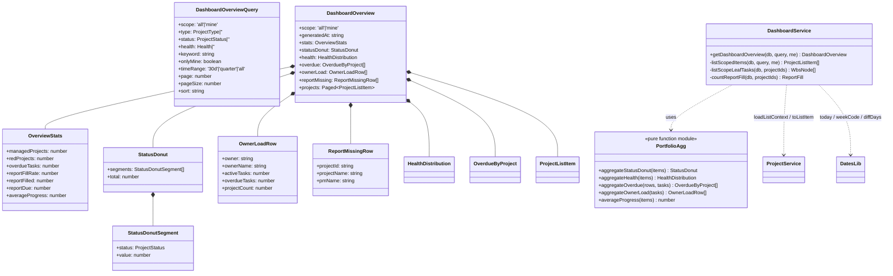
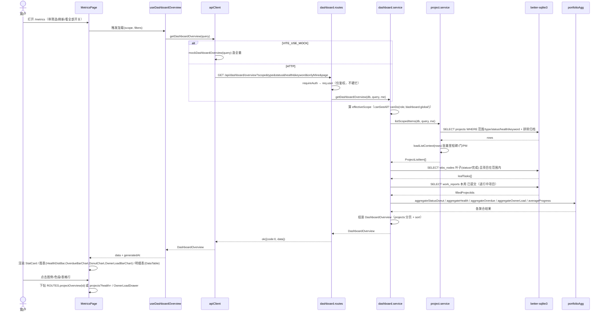
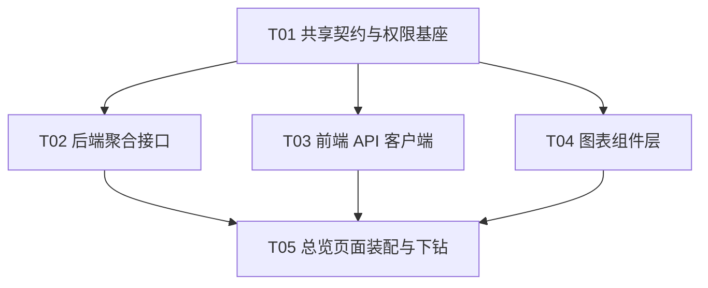

# B12 全局仪表盘 / 多项目总览 — 架构设计 + 任务分解

> 文档类型：**架构设计（Architecture Design）+ 任务分解（Task Decomposition）**
> 作者：架构师（高见远）｜主理人：齐活林｜产品：许清楚
> 项目盘址：`C:/Users/xuwen/WorkBuddy/AstrBytes/pm-app/`
> 上游输入：`docs/B12-PRD.md`（简单 PRD）｜`docs/B11-架构设计.md`（复用范式）
> 技术栈：Vite + React + TS + MUI + Tailwind；图表 `@mui/x-charts` v7；后端 Node(Express) + better-sqlite3（真实 DB）；RBAC 服务端强制
> 生成日期：2026-08-10

---

## 0. 读码结论（先读代码再设计）

| # | 结论 | 来源 | 对 B12 的影响 |
|---|---|---|---|
| C1 | B11 是**纯前端聚合**（`buildDashboard` 吃 `GET /api/workbench` 的原子数据）；B12 看全公司，前端拿不到别人的任务，N+1 搬到浏览器不可行。 | `web/src/utils/dashboardAgg.ts` §1.3 | **必须新增服务端聚合接口** `GET /api/dashboard/overview`，且复用 `project.service.loadListContext` 避免 N+1。 |
| C2 | `ProjectListItem.progress` = 里程碑达成率（`milestoneDone/milestoneTotal`，已结项恒 100）；详情页是 WBS 加权，两者会不一致。 | `project.service.js#toListItem` | 总览「整体进度」用里程碑达成率，UI 副标题显式标注口径。 |
| C3 | `toListItem.highRiskCount` 恒为 0（risks 表未接，TODO 明确）。 | `project.service.js` L265 | 本期「风险/红灯项目」只用 `health==='red'`，不读 `highRiskCount`。 |
| C4 | `loadListContext(db, ids)` 已用 `IN (...)` 批量预加载 PM 名/里程碑/门，消除 N+1。 | `project.service.js` L187 | 服务端聚合直接复用，不新写批量查询。 |
| C5 | `listProjects(db, query, me)` 支持 `keyword/type/status/health/onlyMine/pm` 过滤，`MAX_PAGE_SIZE=200`，返回 `Paged<ProjectListItem>`。 | `project.service.js` L281 | B12 筛选栏参数**逐字复用**该 query 语义，不新造。 |
| C6 | 取色唯一入口 `useChartPalette()`，返回真 hex；图表层禁 import `tokens`/`alphaOf`/`colorOf`（CSS 变量/color-mix 写进 SVG 不解析）。 | `web/src/theme/chartPalette.ts` | 所有新图表（含 `DonutChart`/`OwnerLoadBarChart`）一律走 `useChartPalette()`。 |
| C7 | 权限矩阵 `server/config/permissions.js` ↔ `web/src/config/permissions.ts` **手工双写**，`scripts/smoke_b3.mjs` 断言两端 key 集合相等。 | PRD 附录 A-3 | 新增 `dashboard:global` 两端都加，漏一边 CI 红。 |
| C8 | `WorkbenchPage.tsx` 调 `<ProgressDonut summary={dashboard.progress} />`、`<OverdueBarChart rows={...} />`、`<HealthDistBar dist={...} onDrill={...} />`。 | `web/src/pages/WorkbenchPage.tsx` | `ProgressDonut` 泛化后**调用签名不变**，B11 工作台零改动。 |
| C9 | `OverdueBarChart` 默认 `maxRows=5`，`shortName` 截断 >8 字；`HealthDistBar` 已含 `onDrill(health)`。 | 两组件源码 | 前者改默认 `maxRows` 5→8，其余零改动；后者零改动。 |
| C10 | `DataTable<T>` 泛型列 `{key,label,width,align,render,hideOnMobile}`，支持 `onRowClick`/`pagination`/`dense`。 | `web/src/components/common/DataTable.tsx` | 项目明细表直接复用，不新造表格。 |
| C11 | `groupByOwner` 排序心智「逾期↓ → 任务↓ → 姓名↑，未分配最后」。 | `web/src/utils/board.ts` | 负责人负荷图沿用同一心智。 |
| C12 | `requireGlobalRole(...roles)` 中间件已存在，但 B12 采用「降级而非硬拦」策略（P1-9）。 | `server/middleware/auth.js` | 路由只 `requireAuth`，scope 由 service 按角色算。 |

---

## 1. 实现方案与框架选型

### 1.1 核心难点

| 难点 | 选型 / 处理 |
|---|---|
| **① 跨项目聚合，前端不可为** | 新增**服务端聚合接口** `GET /api/dashboard/overview`，一次返回全部总览数据（图表+明细表首页）。复用 `project.service.loadListContext` 批量取里程碑/门/PM，避免 N+1（C1/C4）。 |
| **② 角色化统计范围** | `scope` 由服务端按当前用户全局角色推导：`admin/pmo/management` 可看 `all`（全公司）；其余角色强制 `mine`（仅「我参与的项目」，`project_members` 含我）。前端「看全部」开关对非特权角色映射为 `onlyMine` 布尔（见 §3.3）。直链访问 `/metrics` 对非特权用户**降级为 mine 而非报错**（P1-9）。 |
| **③ 进度口径双轨** | 总览「整体进度」= 里程碑达成率（`ProjectListItem.progress` 算术平均），UI 副标题标注「按里程碑达成率」，避免与详情页 WBS 加权口径混淆被判数据错（C2，B12-P0-14）。 |
| **④ 风险口径** | 「风险/红灯项目」= `health==='red'` 计数；`highRiskCount` 恒 0，本期不使用（C3）。 |
| **⑤ 组件复用边界** | `HealthDistBar` 零改动；`OverdueBarChart` 仅 `maxRows` 5→8；`ProgressDonut` 抽出通用 `DonutChart` 后降为薄封装（B11 调用零改）；`DataTable`/`ChartCard`/`StatCard` 直接复用。 |

### 1.2 框架与库选型

| 关注点 | 选型 | 理由 |
|---|---|---|
| 图表库 | **`@mui/x-charts` v7**（已安装，**不新增**） | PRD 附录 A-8 锁定；折线（P2 趋势）届时同库 `LineChart`。 |
| 服务端聚合 | Node(Express) + better-sqlite3（真实库） | 不引缓存/ORM；聚合纯函数放 `server/lib/portfolioAgg.js`，零 DB 依赖，可被 QA 脚本 import 断言（PRD 附录 A-4，B12-P0-10）。 |
| 取色 | `useChartPalette()`（唯一入口） | C6；新增图表一律真 hex，禁止 CSS 变量。 |
| 状态/请求 | 既有 `api` 客户端（Mock/HTTP 双实现，`VITE_USE_MOCK` 切换） | `getDashboardOverview` 两端签名一致，页面零改动切换（PRD 附录 A-7）。 |
| 布局 | MUI `Grid` + Tailwind | 图表区 `xs:1 / md:2 / lg:3`，明细表窄屏横滚（P1-8）。 |

**架构模式**：后端 **Service + Route** 分层（沿用既有 `project.service`/`workbench.routes` 范式）；前端 **Page + Hook + 复用组件**（`useDashboardOverview` 封装取数与 scope 切换）。

### 1.3 复用资产清单（不重写）

| 资产 | 位置 | 复用方式 |
|---|---|---|
| `ChartCard` / `ChartLegend` | `web/src/components/dashboard/ChartCard.tsx` | 所有图表包其内，复用 `loading` 骨架 / `empty` 空态 / `CHART_BODY_HEIGHT=216`。 |
| `HealthDistBar` | `web/src/components/dashboard/HealthDistBar.tsx` | **零改动**，换 `dist` 数据源，`onDrill` 跳项目列表带 health 筛选。 |
| `OverdueBarChart` | `web/src/components/dashboard/OverdueBarChart.tsx` | 仅 `maxRows` 默认 5→8，其余零改动。 |
| `ProgressDonut` | `web/src/components/dashboard/ProgressDonut.tsx` | 抽出 `DonutChart` 后变**薄封装**，props 签名不变。 |
| `DataTable` | `web/src/components/common/DataTable.tsx` | 项目明细表直接复用，`onRowClick` 下钻。 |
| `StatCard` / `PageHeader` / `SectionCard` | `web/src/components/common/` | 顶部 4 卡 + 页头复用。 |
| `useChartPalette` | `web/src/theme/chartPalette.ts` | 唯一取色入口。 |
| `loadListContext` / `toListItem` | `server/services/project.service.js` | 服务端聚合复用，避免 N+1。 |
| `groupByOwner` 排序心智 | `web/src/utils/board.ts` | 负责人负荷图排序沿用。 |
| `dates.weekCode/Range/today/diffDays` | `server/lib/dates.js` | 周报填报率 & 日期口径唯一来源（C2/SK-B12-2）。 |

---

## 2. 文件清单（相对路径，新建 / 修改，B11 复用标注）

> 约定：`[新]` 新建；`[改]` 修改；`[复用·零改]` 直接复用。

### 2.1 后端（新增服务端聚合层）

| 文件 | 状态 | 说明 |
|---|---|---|
| `server/lib/portfolioAgg.js` | **[新]** | 聚合纯函数（零 DB 依赖）：状态环、健康分布、负责人负荷、逾期、整体进度。可被 QA 脚本 import。 |
| `server/services/dashboard.service.js` | **[新]** | `getDashboardOverview(db, query, me)`：算 effectiveScope → 拉范围项目 → 拉叶子任务 → 拉周报填报 → 调 portfolioAgg → 组装 `DashboardOverview`（含 `projects` 分页）。 |
| `server/routes/dashboard.routes.js` | **[新]** | `GET /api/dashboard/overview`，`requireAuth` + `asyncHandler` + `ok(...)`。 |
| `server/routes/index.routes.js` | **[改]** | 在 `workbenchRoutes` 之后、`stubsRoutes` 之前 `require` 并 `router.use(dashboardRoutes)`。 |
| `server/config/permissions.js` | **[改]** | `PERMISSIONS` 新增 `dashboard:global: { global: ['admin','pmo','management'], project: [] }`。 |

### 2.2 前端 · 契约 / 类型 / 权限

| 文件 | 状态 | 说明 |
|---|---|---|
| `web/src/types/dashboard.ts` | **[改]** | 新增 `DashboardOverview`、`DashboardOverviewQuery`、`StatusDonut`、`StatusDonutSegment`、`OwnerLoadRow`、`ReportMissingRow`、`OverviewStats`；保留既有 `TaskProgressSummary`/`OverdueByProject`/`HealthDistribution`/`DashboardSummary`。 |
| `web/src/api/contract.ts` | **[改]** | `ApiClient` 新增 `getDashboardOverview(query: DashboardOverviewQuery): Promise<DashboardOverview>`。 |
| `web/src/api/http.ts` | **[改]** | `HttpApiClient` 实现 `getDashboardOverview`：`GET /dashboard/overview?...`（用既有 `qs`）。 |
| `web/src/api/mock.ts` | **[改]** | `MockApiClient` 实现 `getDashboardOverview`（造全量 mock 数据，复用 `mockProjects`/`mockWbs`）。 |
| `web/src/config/permissions.ts` | **[改]** | 双写 `dashboard:global`（与后端 key 集合一致，过 `smoke_b3`）。 |
| `web/src/config/routes.ts` | **[改]** | `MAIN_MENU` 的 `metrics` 项：去 `phase:'P1'`、加 `roles:['admin','pmo','management']`（pm 是否放开见 §8）。 |

### 2.3 前端 · 图表组件

| 文件 | 状态 | 说明 |
|---|---|---|
| `web/src/components/dashboard/DonutChart.tsx` | **[新]** | 通用环形图：`segments[] + centerValue + centerLabel`，品牌色阶。 |
| `web/src/components/dashboard/ProgressDonut.tsx` | **[改]** | 改为 `DonutChart` 薄封装，props 签名 `{summary: TaskProgressSummary}` **不变**。 |
| `web/src/components/dashboard/OwnerLoadBarChart.tsx` | **[新]** | 负责人负荷横向柱状（两序列：在办/逾期），排序沿用 `groupByOwner` 心智，`onDrill(owner)` 开抽屉。 |
| `web/src/components/dashboard/index.ts` | **[改]** | 导出新增 `DonutChart`、`OwnerLoadBarChart`。 |
| `web/src/components/dashboard/HealthDistBar.tsx` | **[复用·零改]** | — |
| `web/src/components/dashboard/OverdueBarChart.tsx` | **[改]** | `maxRows` 默认 5→8（一行改动）。 |
| `web/src/components/common/DataTable.tsx` | **[复用·零改]** | 明细表。 |
| `web/src/components/dashboard/ChartCard.tsx` | **[复用·零改]** | 图表外壳。 |

### 2.4 前端 · 页面装配

| 文件 | 状态 | 说明 |
|---|---|---|
| `web/src/hooks/useDashboardOverview.ts` | **[新]** | 封装取数 + `scope` 切换 + 筛选参数 + 刷新时间戳 + loading/error。 |
| `web/src/pages/MetricsPage.tsx` | **[改]** | 占位页 → 真实全局总览（筛选栏 + 4 卡 + 图表区 + 明细表 + 下钻）。 |
| `web/src/components/dashboard/OwnerLoadDrawer.tsx` | **[新]** | P1-6 负责人下钻抽屉（跨项目任务分布）。 |

---

## 3. 数据结构与接口（`GET /api/dashboard/overview`）

### 3.1 请求（Query 参数）

| 参数 | 类型 | 默认 | 说明 |
|---|---|---|---|
| `scope` | `'all' \| 'mine'` | 角色推导 | 仅 `admin/pmo/management` 的 `all` 生效；其余角色**强制 `mine`**（见 §3.3）。 |
| `type` | `ProjectType \| ''` | `''` | A/B/C 筛选，直通 `listProjects`。 |
| `status` | `ProjectStatus \| ''` | `''` | 八态之一；为空时默认叠加「在管三态」过滤（见 §3.3）。 |
| `health` | `'green'\|'yellow'\|'red' \| ''` | `''` | 健康度筛选。 |
| `keyword` | `string` | `''` | 名称/编号/客户模糊搜。 |
| `onlyMine` | `boolean` | `false` | 非特权角色的「看全部↔只看我负责的」开关（见 §3.3）。 |
| `timeRange` | `'30d'\|'quarter'\|'all'` | `'all'` | **P1-3 预留参数，本期服务端忽略**（锁定决策 #2：本期不做时间范围筛选）。 |
| `page` | `number` | `1` | 明细表分页。 |
| `pageSize` | `number` | `20`（≤200） | 明细表分页。 |
| `sort` | `'health'\|'progress'\|'overdue'\|'nextMilestone'` | `'health'` | 明细表排序键（P1-5）。 |

### 3.2 响应（`DashboardOverview`，信封 `{code:0, data:DashboardOverview}`）

```ts
/** 请求参数（前端契约） */
export interface DashboardOverviewQuery {
  scope?: 'all' | 'mine';
  type?: ProjectType | '';
  status?: ProjectStatus | '';
  health?: 'green' | 'yellow' | 'red' | '';
  keyword?: string;
  onlyMine?: boolean;
  timeRange?: '30d' | 'quarter' | 'all';   // P1-3 预留，本期忽略
  page?: number;
  pageSize?: number;
  sort?: 'health' | 'progress' | 'overdue' | 'nextMilestone';
}

/** 顶部统计卡数据源 */
export interface OverviewStats {
  /** 在管项目数（排除归档；默认收敛到「在管三态」） */
  managedProjects: number;
  /** 红灯项目数（health==='red'） */
  redProjects: number;
  /** 逾期任务总数（范围内未完成叶子任务 diffDays(today,dueDate)<0） */
  overdueTasks: number;
  /** 本周周报填报率 0~100（已提交/应填报） */
  reportFillRate: number;
  /** 已填报项目数（分母=进行中项目数） */
  reportFilled: number;
  /** 应填报项目数（状态=进行中） */
  reportDue: number;
  /** 整体进度（里程碑达成率算术平均，0~100） */
  averageProgress: number;
}

/** 项目状态分布环：八态计数 */
export interface StatusDonutSegment {
  status: ProjectStatus;
  value: number;
}
export interface StatusDonut {
  segments: StatusDonutSegment[];   // 八态（含 0），前端合并 Top4 + 其他
  total: number;
}

/** 负责人负荷行（P1-2） */
export interface OwnerLoadRow {
  owner: string;          // wbs_nodes.owner（open_id）或 '' 表示未分配
  ownerName: string;      // 姓名或 '未分配'
  activeTasks: number;    // 在办任务数（status∈待办/进行中/待评审/阻塞 的叶子）
  overdueTasks: number;   // 其中逾期数
  projectCount: number;   // 涉及项目数
}

/** 未填周报项目（P1-4） */
export interface ReportMissingRow {
  projectId: string;
  projectName: string;
  pmName: string;
}

/** 总览聚合结果（一次返回全部） */
export interface DashboardOverview {
  /** 实际生效范围（后端推导后回填，前端据此显示副标题） */
  scope: 'all' | 'mine';
  /** 数据截至时间戳（ISO），驱动「数据截至 HH:mm」 */
  generatedAt: string;
  stats: OverviewStats;
  statusDonut: StatusDonut;
  /** 复用 B11 既有类型 */
  health: HealthDistribution;
  /** 复用 B11 既有类型（全局逾期 Top N） */
  overdue: OverdueByProject[];
  ownerLoad: OwnerLoadRow[];
  reportMissing: ReportMissingRow[];
  /** 明细表首页（分页，复用 Paged<ProjectListItem>） */
  projects: Paged<ProjectListItem>;
}
```

> **复用类型**：`HealthDistribution`、`OverdueByProject` 来自既有 `web/src/types/dashboard.ts`；`ProjectListItem` 来自 `web/src/types/project.ts`；`Paged<T>` 来自 `web/src/types/api.ts`。

### 3.3 角色范围（scope）逻辑

```
canSeeAll = canDo(me.globalRole, 'dashboard:global')   // == role ∈ {admin, pmo, management}
if canSeeAll:
    effectiveScope = query.scope === 'mine' ? 'mine' : 'all'   // 特权角色可切
else:
    effectiveScope = 'mine'                                // 非特权强制 mine（P1-9 降级）
    // 非特权「看全部」开关 → onlyMine 布尔：
    //   onlyMine=false（默认/看全部我参与的）   → 项目过滤 = project_members 含我
    //   onlyMine=true （只看我负责的）           → 项目过滤 = 我是 PM 或任务 owner
```

**项目范围 WHERE（服务端 `listScopedItems`）**：
- 基线：`p.deleted_at IS NULL`
- 归档排除：默认 `p.status NOT IN ('已结项','已终止')`
- **默认「在管三态」**（当 `query.status` 为空时叠加）：`p.status IN ('已批准','进行中','挂起')`（锁定决策 #2；可被筛选器显式覆盖；见 §8 待拍板 ③）
- 特权 `all`：仅上述 + `type/status/health/keyword` 过滤
- 特权 `mine` / 非特权：再叠加 `EXISTS(project_members WHERE user_open_id = me)`；非特权 `onlyMine=true` 进一步收窄为「我是 PM 或 WBS owner」
- `type/status/health/keyword` 直通 `listProjects` 现有语义（C5）

**任务范围（负责人负荷 / 逾期 / 逾期任务数）**：范围内项目下的**叶子节点**（`NOT EXISTS` 子节点）且 `status != '完成'`，跨项目聚合。

**周报填报率**：分母 = 范围内 `status='进行中'` 项目数；分子 = 本周（`dates.weekCode()`）存在 `work_reports.status='已提交'` 的项目数（项目级、任一成员提交即算，与 `listReportReminders` 口径逐字一致，C12/PRD §0.2）。

### 3.4 服务端聚合字段来源（一一对应）

| 前端字段 | 服务端计算 | 纯函数归属 |
|---|---|---|
| `stats.managedProjects` | 范围项目计数 | service |
| `stats.redProjects` | `items.filter(health==='red').length` | `portfolioAgg.aggregateHealth` 派生 |
| `stats.overdueTasks` | 范围叶子任务 `diffDays(today,dueDate)<0` 计数 | service + `dates` |
| `stats.reportFillRate/Filled/Due` | 周报填报查询 | service |
| `stats.averageProgress` | `mean(items.progress)`（里程碑达成率） | `portfolioAgg.averageProgress` |
| `statusDonut` | 八态计数 | `portfolioAgg.aggregateStatusDonut` |
| `health` | green/yellow/red 计数 | `portfolioAgg.aggregateHealth`（复用 B11 逻辑） |
| `overdue` | 按项目分组逾期/临期 Top N | `portfolioAgg.aggregateOverdue`（复用 B11 算法，输入换全局叶子任务） |
| `ownerLoad` | 按 owner 聚合在办/逾期/项目数，排序 | `portfolioAgg.aggregateOwnerLoad` |
| `reportMissing` | 未提交周报的进行中项目 | service |
| `projects` | 范围项目 `toListItem` 后分页 + 排序 | `project.service` |

### 3.5 类图（Mermaid）



---

## 4. 程序调用流程图（Mermaid Sequence）



---

## 5. 任务清单（有序，按依赖）

> 遵循「≤5 任务 / 每任务 ≥3 文件 / 首任务为基础层」原则。依赖图见 §6。

### T01 · 共享契约与权限基座（基础层，所有任务依赖）⭐ P0
| 项 | 内容 |
|---|---|
| 源文件 | `server/config/permissions.js` [改]；`web/src/config/permissions.ts` [改]；`web/src/types/dashboard.ts` [改]；`web/src/config/routes.ts` [改] |
| 依赖 | 无 |
| 优先级 | P0 |
| 交付 | ① `permissions.js` + `permissions.ts` 双写 `dashboard:global: { global:['admin','pmo','management'], project:[] }`（过 `smoke_b3`）；② `types/dashboard.ts` 落地 §3.2 全部新增类型；③ `routes.ts` 的 `metrics` 菜单去 `phase:'P1'`、加 `roles:['admin','pmo','management']`（pm 放开见 §8）。 |

### T02 · 后端聚合接口（service + 纯函数 + route + 挂载）⭐ P0
| 项 | 内容 |
|---|---|
| 源文件 | `server/lib/portfolioAgg.js` [新]；`server/services/dashboard.service.js` [新]；`server/routes/dashboard.routes.js` [新]；`server/routes/index.routes.js` [改] |
| 依赖 | T01（`dashboard:global` 权限 + `DashboardOverview` 类型形态） |
| 优先级 | P0 |
| 交付 | ① `portfolioAgg.js` 纯函数（零 DB）；② `dashboard.service.getDashboardOverview` 实现 §3.3 scope 逻辑 + §3.4 字段；③ `GET /api/dashboard/overview` 路由 `requireAuth`；④ 在 `index.routes.js` 挂载（workbench 后、stubs 前）。 |

### T03 · 前端 API 客户端（contract + http + mock）⭐ P0
| 项 | 内容 |
|---|---|
| 源文件 | `web/src/api/contract.ts` [改]；`web/src/api/http.ts` [改]；`web/src/api/mock.ts` [改] |
| 依赖 | T01（类型） |
| 优先级 | P0 |
| 交付 | `ApiClient.getDashboardOverview(query)` 两端签名一致；`http.ts` 用 `qs` 拼 `GET /dashboard/overview`；`mock.ts` 造全量 `DashboardOverview`（复用 `mockProjects`/`mockWbs`），`VITE_USE_MOCK` 零改动切换。 |

### T04 · 图表组件层（泛化 + 新增）⭐ P0/P1
| 项 | 内容 |
|---|---|
| 源文件 | `web/src/components/dashboard/DonutChart.tsx` [新]；`web/src/components/dashboard/ProgressDonut.tsx` [改]；`web/src/components/dashboard/OwnerLoadBarChart.tsx` [新]；`web/src/components/dashboard/index.ts` [改]；`web/src/components/dashboard/OverdueBarChart.tsx` [改·maxRows 5→8] |
| 依赖 | T01（类型） |
| 优先级 | P0（泛化+负荷图 P1-2 合并进本任务） |
| 交付 | ① `DonutChart` 通用环形（`segments/centerValue/centerLabel`，品牌色阶）；② `ProgressDonut` 薄封装，**`WorkbenchPage` 调用零改动**；③ `OwnerLoadBarChart` 两序列（在办 brand[1] / 逾期 health.red），排序沿用 `groupByOwner` 心智，`onDrill` 开抽屉；④ `index.ts` 导出；⑤ `OverdueBarChart.maxRows` 默认改 8。 |

### T05 · 总览页面装配与下钻（集成）⭐ P0/P1
| 项 | 内容 |
|---|---|
| 源文件 | `web/src/hooks/useDashboardOverview.ts` [新]；`web/src/pages/MetricsPage.tsx` [改]；`web/src/components/dashboard/OwnerLoadDrawer.tsx` [新] |
| 依赖 | T02（接口）、T03（客户端）、T04（图表） |
| 优先级 | P0（页面骨架+4卡+图表+明细表）+ P1（抽屉 P1-6 / 未填清单展开 P1-4 / 排序分页 P1-5 / 刷新 P1-7 / 响应式 P1-8） |
| 交付 | ① `useDashboardOverview` 封装取数 + scope 切换 + 筛选 + 刷新时间戳 + loading/error；② `MetricsPage` 真实化：筛选栏 + 4 `StatCard`（tone 按阈值切 brand/warning/danger/success）+ 图表区（状态环 DonutChart / 健康 HealthDistBar / 逾期 OverdueBarChart / 负荷 OwnerLoadBarChart）+ `DataTable` 明细表（整行下钻 `ROUTES.projectOverview(id)`，健康色段下钻 `ROUTES.projects?health=`，图例下钻同）；③ `OwnerLoadDrawer` 负责人跨项目分布（P1-6）。复用 `DataTable`/`ChartCard`/`StatCard`/`PageHeader`/`SectionCard` **零改动**。 |

---

## 6. 任务依赖关系



> 依赖说明：**T01 为唯一基础层**，T02/T03/T04 平行依赖 T01；T05 为集成任务，依赖 T02+T03+T04。无跨级长链。

---

## 7. 共享知识（跨文件约定 · Shared Knowledge）

- **SK-B12-1（取色唯一入口）**：图表组件一律 `useChartPalette()` 取真 hex；**禁止**在 `components/dashboard/**` import `tokens`/`alphaOf`/`colorOf`（CSS 变量/color-mix 写进 SVG 不解析，图表黑屏）。量级类用 `palette.brand`，风险类用 `palette.health`。
- **SK-B12-2（日期口径唯一来源）**：前端 `web/src/utils/date.ts`、后端 `server/lib/dates.js`；逾期 `diffDays(today,dueDate)<0`，临期 `非逾期 && <=3`（`DUE_SOON_DAYS`）。聚合代码禁写 `new Date()` / 手撸字符串比较。
- **SK-B12-3（聚合纯函数零框架依赖）**：`server/lib/portfolioAgg.js` 不 import react/MUI/store/组件、无副作用，可被 QA 脚本 import 做数值断言（延续 `dashboardAgg.ts` 规格）。
- **SK-B12-4（权限矩阵双写）**：`server/config/permissions.js` ↔ `web/src/config/permissions.ts` 的 action key 集合必须相等，`scripts/smoke_b3.mjs` 断言；新增 `dashboard:global` 两端都加，漏改一边 CI 红。
- **SK-B12-5（进度双口径）**：总览「整体进度」= **里程碑达成率**（`ProjectListItem.progress` 算术平均），与项目详情页 WBS 加权口径**不同**；UI 副标题标注「按里程碑达成率」，避免被判数据错。
- **SK-B12-6（风险=红灯）**：「风险/红灯项目」= `health==='red'` 计数；`ProjectListItem.highRiskCount` 恒为 0（risks 表未接），**本期不使用该字段**。
- **SK-B12-7（范围 scope 逻辑）**：`canSeeAll = role∈{admin,pmo,management}`；特权可 `all`/`mine` 切换，非特权强制 `mine`（降级而非报错，P1-9）；非特权前端「看全部」开关映射 `onlyMine` 布尔（false=我参与的全部，true=只看我负责的）。
- **SK-B12-8（复用边界）**：`HealthDistBar` 零改动；`OverdueBarChart` 仅 `maxRows` 5→8；`ProgressDonut` 泛化为 `DonutChart` 薄封装且 **`WorkbenchPage` 调用零改动**；`DataTable`/`ChartCard`/`StatCard` 直接复用。
- **SK-B12-9（响应信封）**：所有 `/api/*` 恒为 `{code,data,message}`；`overview` 非分页字段 `data` 为对象，`projects` 为 `Paged` 子结构；禁裸数组/裸对象直出。
- **SK-B12-10（负责人负荷排序心智）**：逾期数 ↓ → 在办数 ↓ → 姓名 ↑，未分配（`owner===''`）恒最后；负荷=在办任务数 + 其中逾期数（非工时，工时口径留 P2）。
- **SK-B12-11（避免 N+1）**：服务端聚合复用 `project.service.loadListContext` 批量取里程碑/门/PM；范围项目用单条 `SELECT ... WHERE ... IN (...)`，不逐项目查。
- **SK-B12-12（避免新依赖）**：图表库锁定 `@mui/x-charts` v7，不新增图表库/状态库；数据走 better-sqlite3 真实库，不用 localStorage 顶替。

---

## 8. 待主理人拍板事项（Pending Clarifications）

| # | 事项 | 本设计暂定方案 | 阻塞级 |
|---|---|---|---|
| ① | **PM 是否进 `dashboard:global` 可见范围**（PRD 待确认 6） | 菜单 `roles:['admin','pmo','management']`，pm 不进；pm 经直链 `/metrics` 降级看「我参与的项目」 | ★ 影响 T01 菜单 roles |
| ② | **页面/菜单命名**：「度量看板」→「全局总览」？（PRD 待确认 5） | 采纳改名，菜单 `label:'全局总览'`、页面 `PageHeader` 标题「全局总览」，与「我的工作台」形成个人/公司两级对照 | 建议拍板，不阻塞 |
| ③ | **默认统计状态口径**（PRD 待确认 9） | 默认排除归档 `已结项/已终止`，且 `status` 为空时叠加「在管三态」`已批准/进行中/挂起`；筛选器可显式覆盖（含选空=全部非归档） | ★ 影响 T02 默认 WHERE |
| ④ | **时间范围筛选（P1-3）** | 锁定决策 #2：本期不做；schema 预留 `timeRange` 参数，服务端本期忽略 | 不阻塞（已锁定） |
| ⑤ | **周报填报率是否进 P0 四卡**（PRD 待确认 11） | 采纳进 P0（US-PMO-2 高频诉求），作为第四张卡「本周周报填报率」 | 不阻塞（已采纳） |
| ⑥ | **负责人下钻抽屉（P1-6）/ 未填周报清单展开（P1-4）落 P0 还是 P1** | 落 P1，本设计 T05 含其实现；若主理人认为 P0 也需请拍板 | 不阻塞 |

> 已拍板（锁定决策，本设计已落地，不再赘述）：① 统计范围按角色（scope 推导）；② 本期无时间范围筛选；③ 负责人负荷=在办+逾期（零聚合成本）；④ 明细表+下钻到 B11 单项目仪表盘（`/metrics` 复用、`?projectId=` 经 `ROUTES.projectOverview(id)` 下钻，不新路由）。
