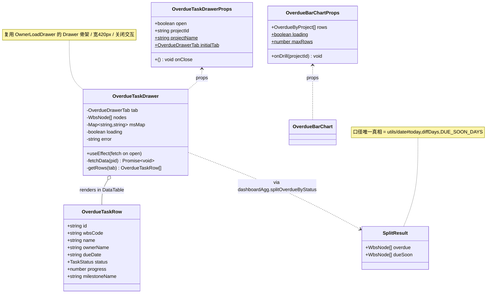
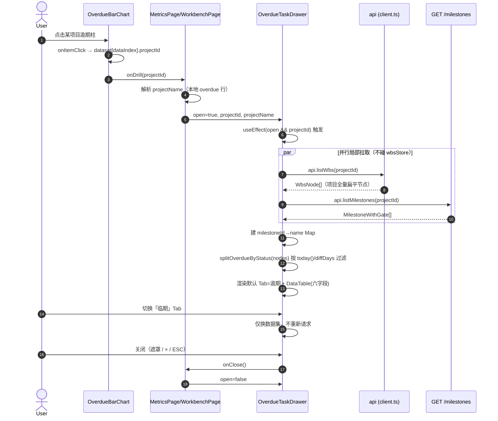
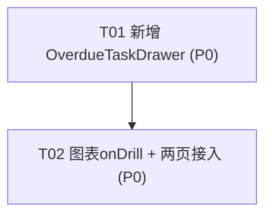

# B13 逾期/临期任务下探抽屉 — 架构设计与任务分解

> 文档类型：**架构设计 + 任务分解（Architect 产出）**
> 作者：架构师 高见远（Gao）｜主理人：齐活林
> 设计依据：`docs/B13-PRD.md` + 主理人已拍板的 §6 待确认项
> 生成日期：2026-08-17
> 技术栈：Vite + React + TS + MUI + Tailwind；图表 `@mui/x-charts` v7；后端 Node(Express) + better-sqlite3

---

## 1. 实现方案 + 框架选型

### 1.1 核心思路（一句话）

在 B11/B12 已有的 `OverdueBarChart` 上补一个**点击钻取回调 `onDrill(projectId)`**，由 `MetricsPage` / `WorkbenchPage` 各自打开一个**纯前端、局部拉取**的 `OverdueTaskDrawer` 抽屉，抽屉内直接调 `api.listWbs(projectId)` + `api.listMilestones(projectId)`，按 `utils/date` 的日期口径前端过滤出「逾期 / 临期」任务清单。**零后端新增接口、零新依赖、零全局状态污染。**

### 1.2 为什么是「纯前端下探」（决策依据）

| 维度 | 结论 | 理由 |
|---|---|---|
| 是否需要新后端接口 | **否** | ① 任务明细 = `GET /api/projects/:projectId/wbs`（`api.listWbs` 已封装）；② 里程碑名 = `GET /api/projects/:projectId/milestones`（`api.listMilestones` 已封装）；③ 来源报表（B11 workbench / B12 overview）已给出 `projectId` 与 `overdue/dueSoon` 计数。前端按 `dueDate` 过滤即可，服务端再聚合成本为零。 |
| 是否需要后端在 WBS 返回里带 `milestoneName` | **否** | 纯前端用 `milestoneId` 经 milestones 接口建 `id→name` 映射即可（主理人 Q2 拍板：零后端改动）。这是本需求唯一一处「名称解析」，前端可独立完成。 |
| 是否复用全局 `wbsStore` | **否** | `wbsStore` 为单项目全局 store，`fetchWbs` 会覆盖当前 `projectId` 状态（主理人 Q3）。抽屉**直接调 `api.listWbs(projectId)` 局部拉取**，关闭即丢弃，绝不污染其它页面。 |
| 是否做分页 / 虚拟滚动 | **否（P2）** | 单项目 WBS 节点可能上百，但按逾期/临期分 Tab 后数量有限；主理人 Q4 拍板初期不做。 |
| 是否需要 mock | **否** | `web/.env.*` 均为 `VITE_USE_MOCK=false`，抽屉数据一律走真实接口。 |

### 1.3 框架 / 库选型

- **UI 容器**：复用现有 MUI `Drawer`（`anchor="right"`）+ `DataTable`（抽屉内任务清单直接复用，支持 `columns` / `rowKey` / `loading` / `empty*` / `dense` / `onRowClick`）。与 `OwnerLoadDrawer` 完全一致，零新学习成本。
- **状态管理**：不引入任何 store / 状态库。抽屉内部用 `useState` + `useEffect` 自管 `loading / nodes / msMap / tab`；两页各自用 1~2 个 `useState` 维护 `drawerOpen / drawerProjectId / drawerProjectName`。
- **图表钻取**：`OverdueBarChart` 复用 `@mui/x-charts` `BarChart` 的 `onItemClick` 回调捕获点击，从 `dataset[dataIndex]` 取 `projectId` 回调 `onDrill`（参考同目录 `HealthDistBar` 的 `onDrill` 模式——它复用 `ChartLegend` 的 `onClick`；柱图点击走 `onItemClick`）。
- **日期口径**：统一调用 `utils/date#today` / `diffDays`；阈值常量 `DUE_SOON_DAYS = 3`（已在 `utils/dashboardAgg.ts` 定义）全局复用。**禁止在组件里 `new Date()` / 手撸字符串比较。**
- **不换框架、不引入新重型依赖**（满足约束）。

### 1.4 架构分层（薄前端，无后端）

```
MetricsPage / WorkbenchPage          ← 页面：持有 onDrill + drawer 本地状态
        │  onDrill(projectId)
        ▼
OverdueBarChart  (补 onDrill + onItemClick)
        │
        ▼ 打开
OverdueTaskDrawer  (新增，自管 fetch/筛选/渲染)
        ├─ api.listWbs(projectId)        → WbsNode[]   (项目全量)
        ├─ api.listMilestones(projectId) → MilestoneWithGate[]  (建 id→name map)
        └─ utils/dashboardAgg#splitOverdueByStatus(nodes)  (日期口径过滤，单一真相)
```

---

## 2. 文件列表及相对路径

> 路径均以 `web/src` 为基准。新增 1 个文件，修改 4 个文件。

### 2.1 新增（1）

| 文件 | 作用 |
|---|---|
| `components/dashboard/OverdueTaskDrawer.tsx` | 逾期/临期任务下探抽屉：复用 `OwnerLoadDrawer` 骨架/样式/关闭交互；内部 Tab（逾期/临期）、局部拉取 WBS + milestones、前端过滤、六字段渲染、空/加载态。 |

### 2.2 修改（4）

| 文件 | 改动点 |
|---|---|
| `components/dashboard/OverdueBarChart.tsx` | 新增 `onDrill?: (projectId: string) => void` prop；`dataset` 补 `projectId` 字段；绑定 `BarChart#onItemClick` → 取 `dataset[dataIndex].projectId` 回调 `onDrill`。 |
| `pages/MetricsPage.tsx` | `OverdueBarChart` 接 `onDrill`；本地维护 `drawerOpen/drawerProjectId/drawerProjectName`；`<OverdueTaskDrawer>` 并列渲染于 `<OwnerLoadDrawer>` 旁。 |
| `pages/WorkbenchPage.tsx` | 同上：`<OverdueBarChart onDrill>` + 本地 drawer 状态 + 渲染 `<OverdueTaskDrawer>`。 |
| `utils/dashboardAgg.ts` | 新增导出纯函数 `splitOverdueByStatus(nodes: WbsNode[]): { overdue: WbsNode[]; dueSoon: WbsNode[] }`，复用既有 `DUE_SOON_DAYS` 与 `diffDays/today`，作为抽屉过滤的**单一真相入口**（避免口径在抽屉里复制一份）。 |
| `types/dashboard.ts` | 新增视图模型类型 `OverdueTaskRow`（抽屉表格行）与字面量类型 `OverdueDrawerTab`，集中管理、便于复用与校验。 |

> 说明：`types/dashboard.ts` 的改动仅新增类型，不影响既有导出；`dashboardAgg.ts` 仅新增一个导出函数，既有函数零改动。

---

## 3. 数据结构与接口

### 3.1 TypeScript 类型定义

```ts
// ── types/dashboard.ts 新增 ───────────────────────────────
/** 抽屉 Tab 字面量（默认 'overdue'） */
export type OverdueDrawerTab = 'overdue' | 'dueSoon';

/** 抽屉表格行视图模型（由 WbsNode + milestoneName 映射得到） */
export interface OverdueTaskRow {
  id: string;            // WbsNode.id
  wbsCode: string;       // 如 "1.2.3"
  name: string;          // 任务名
  ownerName: string;     // 负责人姓名；空 → "未分配"
  dueDate: string;       // YYYY-MM-DD
  status: TaskStatus;    // 看板五态之一
  progress: number;      // 0~100
  milestoneName: string; // milestoneId→name；无 → "未关联"
}

// ── components/dashboard/OverdueTaskDrawer.tsx ───────────
export interface OverdueTaskDrawerProps {
  /** 是否打开 */
  open: boolean;
  /** 当前下钻项目 id（来源报表行的 projectId） */
  projectId: string;
  /** 项目名（用于抽屉头部标题；来源报表行已含，可不传由抽屉本地回退） */
  projectName?: string;
  /** 初始 Tab，默认 'overdue' */
  initialTab?: OverdueDrawerTab;
  /** 关闭抽屉（遮罩 / × / ESC） */
  onClose: () => void;
}

// ── components/dashboard/OverdueBarChart.tsx 新增 prop ───
export interface OverdueBarChartProps {
  rows: OverdueByProject[];
  loading?: boolean;
  maxRows?: number;
  /** 钻取回调：点击某项目柱时触发，参数为该项目的 projectId */
  onDrill?: (projectId: string) => void;
}

// ── utils/dashboardAgg.ts 新增导出 ───────────────────────
/**
 * 按日期口径把 WBS 节点拆成「逾期 / 临期」两组。
 * 口径（与 B12 后端逐字一致，唯一真相）：
 *   逾期 = diffDays(today, dueDate) < 0
 *   临期 = 0 <= diffDays(today, dueDate) <= DUE_SOON_DAYS(3)
 *   且 status !== '完成'
 */
export function splitOverdueByStatus(nodes: WbsNode[]): {
  overdue: WbsNode[];
  dueSoon: WbsNode[];
};
```

### 3.2 关键复用字段（来自既有类型）

- `WbsNode`（`types/wbs.ts`）：`id, projectId, wbsCode, name, owner, ownerName, dueDate, status, progress, milestoneId` 全部齐备，抽屉直接消费。
- `MilestoneWithGate`（`types/project.ts`，`extends Milestone`）：含 `id, name`，用于建 `milestoneId → name` 映射。
- `OverdueByProject`（`types/dashboard.ts`）：`projectId / projectName / overdue / dueSoon`，是 `onDrill` 的入参来源与页面解析 `projectName` 的依据。

### 3.3 类图（Mermaid）



> 完整类图已导出至 `docs/B13-class-diagram.mermaid`。

---

## 4. 程序调用流程（时序图）

覆盖「点击 OverdueBarChart 项目条 → onDrill → 打开抽屉 → listWbs + milestones → 过滤 → 渲染 → 切 Tab → 关闭」全过程。



> 完整时序图已导出至 `docs/B13-sequence-diagram.mermaid`。

---

## 5. 有序任务列表（依赖关系 + 优先级）

> 设计约束：本期**零后端新增**、**零新依赖**，故不存在「项目基础设施 / 脚手架」任务；T01 即为第一个实现任务。两个任务均 P0，T02 依赖 T01（页面需渲染已存在的抽屉组件）。

### T01 · P0｜新增 `OverdueTaskDrawer` 抽屉组件（含数据拉取 / 里程碑解析 / Tab 筛选 / 六字段 / 空态 / 日期口径）

- **源文件**：
  - `components/dashboard/OverdueTaskDrawer.tsx`【新增】
  - `utils/dashboardAgg.ts`【改·新增 `splitOverdueByStatus` 导出】
  - `types/dashboard.ts`【改·新增 `OverdueTaskRow` / `OverdueDrawerTab`】
- **依赖**：无
- **优先级**：P0
- **要点**：
  1. 复用 `OwnerLoadDrawer` 的 `<Drawer anchor="right" width:420 maxWidth:'92vw'>` 骨架、头部 `subtitle1+关闭 IconButton`、遮罩/×/ESC 关闭交互。
  2. `useEffect` 监听 `open && projectId`：`Promise.all([api.listWbs(pid), api.listMilestones(pid)])` 局部拉取；`milestones` 建 `Map<id,name>`。
  3. 调 `splitOverdueByStatus(nodes)` 得 `{overdue, dueSoon}`；头部副标题「逾期 X · 临期 Y」由本地重算（不依赖来源报表计数，更稳）。
  4. `Tabs` 默认 `initialTab ?? 'overdue'`，切换只换 `DataTable` 数据集、不发请求。
  5. `DataTable` 列：任务名(`wbsCode name`)、负责人(`ownerName`→「未分配」)、计划完成日(`fmtDate(dueDate)`，逾期红/临期黄)、状态(`StatusChip`)、进度(`ProgressBar`)、所属里程碑(`msMap.get(milestoneId) ?? '未关联'`)。
  6. `loading` 走 `DataTable` 骨架；空态文案如「该项目暂无已逾期任务」。
  7. 日期口径严格走 `utils/date#today`/`diffDays`，禁止 `new Date()`。

### T02 · P0｜`OverdueBarChart` 增加 `onDrill` 回调 + `MetricsPage` / `WorkbenchPage` 接入打开同一抽屉

- **源文件**：
  - `components/dashboard/OverdueBarChart.tsx`【改·加 `onDrill` + `onItemClick` + dataset 补 `projectId`】
  - `pages/MetricsPage.tsx`【改·接 `onDrill` + 本地 drawer 状态 + 渲染 `<OverdueTaskDrawer>`】
  - `pages/WorkbenchPage.tsx`【改·同上】
- **依赖**：T01（抽屉组件须先存在，页面才能渲染；图表 `onDrill` 签名自身独立，但页面接线依赖 T01）
- **优先级**：P0
- **要点**：
  1. `OverdueBarChart`：`dataset` 每项补 `projectId`；`BarChart` 绑 `onItemClick={(_, d) => { const r = dataset[d.dataIndex]; if (r && onDrill) onDrill(r.projectId); }}`（x-charts v7 `onItemClick` 的 `dataIndex` 映射需工程师按实际 dataset 验证）。
  2. 两页各自本地维护 `const [ov, setOv] = useState<{open:boolean; projectId:string; projectName:string}>({open:false, projectId:'', projectName:''})`；`onDrill=(pid)=> setOv({open:true, projectId:pid, projectName: 本地overdue行.projectName})`。
  3. 两页均 `<OverdueTaskDrawer open={ov.open} projectId={ov.projectId} projectName={ov.projectName} onClose={()=>setOv(s=>({...s,open:false}))} />` 并列于既有 `<OwnerLoadDrawer>` 旁。
  4. **复用度建议**：两页各自独立维护抽屉状态（~3 行），**不抽公共 hook**。理由：两页数据源不同（B11 workbench vs B12 overview）、抽屉是受控组件且 props 已自包含，抽 hook 对仅 2 个调用点的收益极低、反增间接层。

### 任务依赖图（Mermaid）



> P2 项（行点击跳 WBS 页、虚拟滚动、二次筛选、仅看我负责开关）本期不做，见 §8。

---

## 6. 依赖包列表

**本期零新增依赖**，全部复用现有：

```
- react / react-dom            : 既有（页面/组件框架）
- @mui/material                : 既有（Drawer / Tabs / DataTable 等）
- @mui/x-charts@^7             : 既有（BarChart + onItemClick 钻取）
- dayjs                        : 既有（utils/date 底层，today/diffDays）
- @/utils/dashboardAgg         : 既有（新增 splitOverdueByStatus 导出，无新包）
```

无需 `package.json` / `vite.config` / `tailwind.config` 任何改动。

---

## 7. 共享知识（跨文件约定）

| 约定项 | 取值 / 规则 | 说明 |
|---|---|---|
| 抽屉宽度 | `width: 420, maxWidth: '92vw'` | 团队右侧抽屉标准，与 `OwnerLoadDrawer` 逐字一致；若未来抽公共常量再统一。 |
| Tab 字面量 | `'overdue' \| 'dueSoon'`，默认 `'overdue'` | `OverdueDrawerTab` 类型集中定义。 |
| 日期口径唯一入口 | `utils/date#today()` + `diffDays(today, dueDate)`；阈值 `DUE_SOON_DAYS = 3`（`dashboardAgg`） | **禁止**组件内 `new Date()` / 手撸字符串比较；过滤封装在 `splitOverdueByStatus`。 |
| 过滤条件 | `status !== '完成'` 且（逾期 `<0` 或 临期 `0..3`） | 与 B12 后端、`dashboardAgg` 逐字一致。 |
| 里程碑映射 | 抽屉内 `Map<milestoneId, name>`，无 → `'未关联'` | 纯前端，`api.listMilestones` 已封装。 |
| 负责人兜底 | `ownerName` 空 → `'未分配'` | 与 `OwnerLoadDrawer` 一致。 |
| 颜色语义 | 逾期 `error.main`、临期 `warning.main` | 沿用 `StatusChip` / `ProgressBar` 既有语义着色。 |
| 数据拉取 | 抽屉内 `Promise.all([api.listWbs, api.listMilestones])` | **不写 `wbsStore`**，关闭即丢弃，零全局污染。 |
| 抽屉状态归属 | 各页面本地 `useState` 维护 `open/projectId/projectName` | 受控组件，props 自包含。 |

---

## 8. 待明确事项（如有）

1. **`today()` 与基准日 2026-08-17 对齐（主理人 Q5）**：`VITE_USE_MOCK=false` 下 `today()` 取真实本地日期（`dayjs()` 本地时区）。演示/QA 环境需确认系统时钟与时区为 `Asia/Shanghai` 且日期为 2026-08-17，否则抽屉过滤与报表数字会偏离。**工程师实现时必须验证这一点**（可在 `WorkbenchPage` 副标题已显示 `today()`，比对即可）。
2. **`onDrill` 仅传 `projectId`**：`projectName` 由调用页从本地 `overdue: OverdueByProject[]` 解析（两页均已持有该数组，含 `projectName`）。若将来图表行结构变化（仅留 `projectId`），需同步调整页面解析逻辑。
3. **x-charts v7 `onItemClick` 的 `dataIndex` 映射**：`dataset` 已补 `projectId` 字段，`onItemClick` 回调的 `itemData.dataIndex` 需工程师按实际运行时 dataset 顺序验证（v7 文档：`onItemClick?: (event, itemData) => void`，`itemData.dataIndex` 为 dataset 行索引）。
4. **`WbsNode` 全为 `task`/`subtask`**：`WbsNodeType` 仅此两值，故「项目全量」拉取后无需再按叶子过滤——所有节点都是干活单元，直接套用日期口径即可（与 B11 `myTasks` 叶子口径互补，不冲突）。
5. **P2 范围（本期不做）**：任务行点击跳 WBS 页（P2-1）、虚拟滚动/分页（P2-2）、抽屉内二次筛选（P2-3）、工作台下探「仅看我负责」开关（P2-4）——均延后，架构预留 `onRowClick` 与 `DataTable` 现有 `dense` 能力即可平滑追加。

---

> 附：类图 `docs/B13-class-diagram.mermaid` ｜ 时序图 `docs/B13-sequence-diagram.mermaid`
