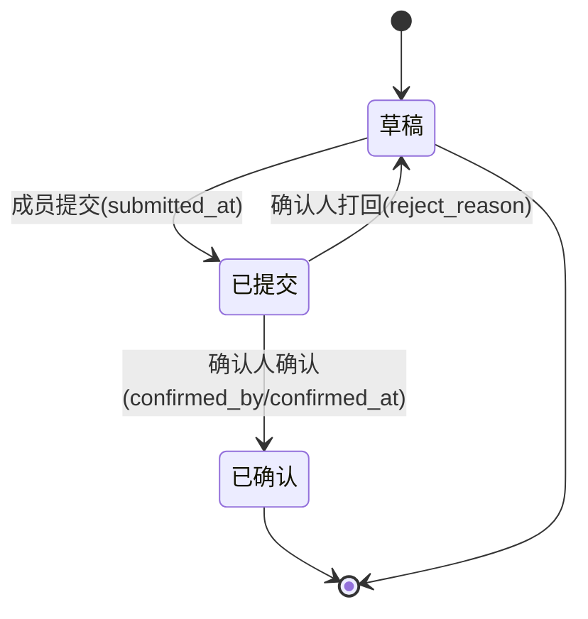

# B14 任务优先级 + 周报轻量闭环 + 统一待办中心 — 简单 PRD

> 文档类型：**简单 PRD（默认模板，不含竞品分析）**
> 作者：产品（许清楚）｜主理人：齐活林
> 项目盘址：`C:/Users/xuwen/WorkBuddy/AstrBytes/pm-app/`
> 技术栈：Vite + React + TS + MUI + Tailwind；图表 `@mui/x-charts` v7；后端 Node(Express) + better-sqlite3（真实 DB）
> 前置：B10（审批+工作台接真数据）、B11（工作台仪表盘增强）、B12（全局仪表盘）、B13/B13.5（逾期下探抽屉）已交付
> 生成日期：2026-08-17

---

## 0. 现状盘点与关键事实（先读 schema/代码再动笔的结论）

### 0.1 三块都依赖的真实表结构（来自 `docs/schema.sql`，已逐列核对）

| 表 | 字段（与本需求相关） | 现状结论 |
|---|---|---|
| `wbs_nodes` | `id, project_id, name, owner, due_date, status, progress, milestone_id, is_critical, ...` | **当前无 `priority` 字段**，需加列（块1 真实 schema 扩展） |
| `reports` | `id, project_id, week, week_start, week_end, author, status, done_note, plan_items, resource_note, snapshot, submitted_at, created_at, updated_at` | 周报表，**当前 `status` 仅 `('草稿','已提交')`**；无 `confirmed_by/confirmed_at/reject_reason`；需扩展状态机 + 加 3 列（块2） |
| `projects` | `id, code, name, ..., created_by, ...` | ⚠️ **无 `pm` 列**。项目负责人通过 `project_members(project_role='pm')` 解析（见 0.3） |
| `project_members` | `project_id, user_open_id, project_role`（`project_role IN ('pm','tl','po','qa','cm','pmo','member')`） | 项目内 PM/TL 解析源；确认人规则依赖此表 |
| `users` | `open_id, name, global_role`（`global_role IN ('admin','management','pmo','pm','tl','qa','cm','po','member')`） | 系统管理员（`global_role='admin'`）为周报确认兜底升级人 |
| `reviews` | B10 审批主表 | 周报**不接**此表（块2 明确不接 B10 审批流） |

### 0.2 ⚠️ 与上游任务简报的 3 处命名差异（务必先对齐，避免返工）

| 简报表述 | 实际 schema/代码 | PRD 采用 | 处置 |
|---|---|---|---|
| `work_reports` 表 | 实际表名为 `reports`（`/api/reports` 在 legacy 中已标注删除，现行周报走 `reports` 表 + `ReportsPage.tsx`） | **以 `reports` 为准** | 需在架构设计阶段确认现行周报读写路由落点 |
| `work_reports.author_open_id` / `author_name` | 实际列 `reports.author`（存 `users.open_id`）；**无 `author_name` 列**，姓名需 `JOIN users.name` | 用 `reports.author` | 显示姓名处走联表/接口附带，不新增列 |
| `projects.pm`（项目负责人 openId） | `projects` 表**无 `pm` 列**；PM 由 `project_members` 中 `project_role='pm'` 解析 | 确认人 = `project_members(project_role='pm')` | 见 §0.3 与 §6 待确认项 |

### 0.3 块2 确认人规则的落地口径（基于真实 schema 推导）

周报提交（草稿→已提交）后，"待确认人"按以下解析（纯查询逻辑，不新增表）：

1. **默认确认人** = 该项目 `project_members` 中 `project_role='pm'` 的用户（通常 1 人）。
2. **约束：填报人不能确认自己** → 若 `reports.author == 默认确认人`（即 PM 自己填的周报），则升级确认人：
   - 优先：该项目 `project_members` 中 `project_role='tl'` 的用户；
   - 兜底：任意 `users.global_role='admin'` 的系统管理员。
3. 确认人看到"待确认周报"待办（块3）；可执行 `确认`（→ 已确认，写 `confirmed_by/confirmed_at`）或 `打回`（→ 草稿，写 `reject_reason`）。

### 0.4 块3 待办聚合的现有数据源（已确认存在，尽量复用）

| 待办类型 | 数据源 | 说明 |
|---|---|---|
| 待我审批 | `GET /api/approvals`（B10，现有 ApprovalsPage 逻辑） | 来自 `reviews` 表，待当前用户审批的步骤 |
| 待确认周报 | 块2 新增：`reports.status='已提交'` 且 当前用户=其确认人 | 需新查询（见 §5 约束：纯前端聚合 or 后端汇总接口，待定） |
| 待填周报 | `GET /api/dashboard/overview` 的 `reportMissing`（B12） | 本周该项目无周报 |
| 逾期任务 | `GET /api/projects/:projectId/wbs`（B13 口径：`diffDays<0` 且在办） | 复用 B13 过滤逻辑 |
| 指派给我的任务 | `GET /api/workbench` 的 `myTasks`（B11） | owner=当前用户且在办 |
| 阻塞任务 | 同上 WBS，`status='阻塞'` | 与逾期同源不同口径 |

### 0.5 必须复用的前端资产

| 资产 | 位置 | B14 复用方式 |
|---|---|---|
| `ReportsPage.tsx` | `web/src/pages/projects/ReportsPage.tsx` | 块2 提交/确认/打回交互的宿主页 |
| `ApprovalsPage.tsx` | `web/src/pages/ApprovalsPage.tsx` | 块3 "待我审批"已有逻辑，待办中心直接聚合其数据 |
| `ReportFormModal.tsx` | `web/src/components/report/ReportFormModal.tsx` | 块1 优先级选择控件挂入此表单（创建/编辑周报任务项时若有任务关联）|
| `ProgressDonut.tsx` | `web/src/components/dashboard/ProgressDonut.tsx` | 块1 优先级分布环图参考其实现 |
| `OverdueTaskDrawer` / `wbsStore` / `api.listWbs` | B13 资产 | 块3 逾期/指派任务下探、排序复用 |
| 日期口径 | `web/src/utils/date.ts` | 逾期/临期判定唯一真相，禁止手写日期比较 |

---

## 1. 产品目标

B14 把 B10–B13 的"看数"能力收口成一个**可行动闭环**：块1 给每个任务打上 `P0–P3` 优先级，让仪表盘/工作台从"看健康度"升级为"看优先级分布"，并把逾期/临期明细按优先级排序（P0 置顶），使最该救的任务最先被看见；块2 给周报补上"已提交→已确认/打回"的轻量闭环（不接 B10 重审批，只让上级阅知或打回重填），让进展汇报有回响而非石沉大海；块3 把散落在审批、周报、WBS 里的待办聚合进顶部铃铛+独立页，形成"看数 → 审批/确认 → 下探/待办"的单入口，让 PM/PMO 在一个地方看清"我现在该处理什么、点进去就能处理"。三块共同把 pm-app 从"数据看板"推进为"带行动项的协作中枢"。

---

## 2. 用户故事

- **US-1｜优先级聚焦救火**：作为项目经理，我希望仪表盘/工作台能按 `P0–P3` 看任务分布、且逾期清单把 P0 排在最前，以便我一眼锁定最紧急任务、优先调度资源，而不是在长列表里肉眼挑。
- **US-2｜周报有回响**：作为上级（项目 PM），我希望成员提交周报后我能一键"确认"或"打回（留原因）"，且我自己填的周报会自动升级给 TL/管理员确认，以便周报不只是"交了"，而是有上级阅知闭环、问题能被打回重填。
- **US-3｜待办一页看全**：作为 PMO，我希望顶部铃铛汇总"待我审批 + 待确认周报 + 待填周报 + 逾期/指派/阻塞任务"并显示总数，点一条直接跳处理页，以便我不必在审批页、周报页、看板间来回切找待办。
- **US-4｜填报不越权**：作为普通成员，我希望提交的周报只能由上级确认、不能自己确认，且打回时能看到明确原因，以便我清楚要补什么、不会被无理由驳回。

---

## 3. 需求池

### P0（必做 · 三块核心）

| 编号 | 需求 | 一句话说明 |
|---|---|---|
| P0-1 | `wbs_nodes` 加 `priority` 列（枚举 `P0/P1/P2/P3`，默认 `P2`） | 块1 真实 schema 扩展；后端 WBS 读写（service/repo/路由映射）同步该字段 |
| P0-2 | 任务创建/编辑表单加"优先级"选择控件 | 块1 前端：下拉/分段控件选 `P0–P3`，默认 `P2`（控件挂入 WBS 任务编辑表单） |
| P0-3 | `reports` 状态机扩展 `草稿 → 已提交 → 已确认` | 块2：提交接口置 `已提交`+`submitted_at`；确认接口置 `已确认`+写 `confirmed_by/confirmed_at` |
| P0-4 | `reports` 加 `confirmed_by` / `confirmed_at` / `reject_reason` 三列 | 块2 真实 schema 扩展；打回写 `reject_reason` 并状态回 `草稿` |
| P0-5 | 确认人解析逻辑（基于 `project_members.project_role` + `users.global_role`） | 块2：默认 = 项目 `pm`；作者即 pm 时升级 `tl`/`admin`；约束"作者≠确认人" |
| P0-6 | 周报"确认 / 打回"操作 UI（ReportsPage 内弹窗） | 块2：确认人可见操作；打回弹窗填原因（是否必填见 §6） |
| P0-7 | 统一待办聚合（铃铛下拉 + 徽标总数） | 块3：聚合 §0.4 六类源；徽标显总数；点条目跳对应处理页（复用 B13 跳转模式） |
| P0-8 | 逾期/临期任务明细按优先级排序（P0 置顶） | 块1：B13 下探抽屉与工作台逾期清单，按 `priority` 升序（P0→P3）排序 |

### P1（重要）

| 编号 | 需求 | 一句话说明 |
|---|---|---|
| P1-1 | 仪表盘/工作台"按优先级分布"环图 | 块1 分组统计可视化（参考 `ProgressDonut`），按 `P0–P3` 计数；若排期紧可后置但不建议 |
| P1-2 | 看板/筛选"按优先级"维度 | 块1：WBS 看板增加优先级分组或筛选；任务卡显示优先级 `Chip` |
| P1-3 | 独立"我的待办"页 | 块3：在铃铛之外提供整页视图，支持分类/分页，复用同一聚合数据 |
| P1-4 | 待确认周报查询接口 | 块2/3：后端提供"当前用户待确认周报"查询（纯聚合 `reports`，不接 reviews） |
| P1-5 | 待办分类分组展示 | 块3：铃铛下拉按"审批/周报确认/周报填报/任务"分组，每组显计数 |

### P2（可选）

| 编号 | 需求 | 一句话说明 |
|---|---|---|
| P2-1 | 周报确认邮件/站内信通知 | 块2：提交后给确认人发通知（复用现有通知通道，若存在） |
| P2-2 | 待办分类筛选/搜索 | 块3：独立页支持按类型筛、按项目搜 |
| P2-3 | 优先级批量设置 | 块1：多选任务批量改优先级 |
| P2-4 | 优先级驱动着色/预警 | 块1：P0 任务卡红边、临近逾期的 P0 额外高亮 |

---

## 4. UI 设计稿

### 4.1 块1：任务优先级属性

**文字描述**：任务创建/编辑表单（WBS 任务编辑弹窗）新增"优先级"字段，位于状态/负责人附近；控件为 MUI `TextField`(`select`) 或 `ToggleButtonGroup`，四个选项 `P0/P1/P2/P3`，默认 `P2`。看板列头/筛选区增加"按优先级"切换（P1-2）。仪表盘/工作台新增"优先级分布"环图（P1-1，参考 `ProgressDonut`）。B13 逾期下探抽屉与工作台逾期清单的任务行按优先级排序，P0 在最上，并在行内以 `Chip` 显示优先级色标。

**字段表（任务编辑表单新增项）**

| 字段名 | 类型/取值 | 来源 | 说明 |
|---|---|---|---|
| 优先级 `priority` | 枚举 `P0/P1/P2/P3`，默认 `P2` | `wbs_nodes.priority`（新增列） | 必填；缺失时后端按默认 `P2` 落库（默认值待 §6 确认） |
| 优先级 Chip（展示） | 色标 | 前端派生 | P0 红 / P1 橙 / P2 蓝 / P3 灰（配色待主题确认） |

**字段表（优先级分布环图）** — P1-1

| 维度 | 取值 | 来源 |
|---|---|---|
| 分组键 | `priority` | `wbs_nodes.priority` 聚合计数 |
| 范围 | 项目内/我负责（切换） | 复用 `GET /api/projects/:projectId/wbs` 或 `myTasks` |

### 4.2 块2：周报轻量闭环

**状态机（Mermaid）**

**文字描述**：`ReportsPage.tsx` 周报列表/详情中，状态为"已提交"且当前用户是**该周报确认人**时，显示"确认 / 打回"按钮。点击"确认"→ 直接置"已确认"并写 `confirmed_by`(当前用户 openId)+`confirmed_at`(now)。点击"打回"→ 弹出"打回原因"对话框（文本框），提交后状态回"草稿"、写 `reject_reason`，作者可在编辑页看到原因并重填。确认人解析见 §0.3（作者即 pm 时升级 tl/admin）。不创建 review 记录、不触发 B10 审批链。

**字段表（周报确认/打回弹窗 + 新增列）**

| 字段名 | 类型 | 来源 | 说明 |
|---|---|---|---|
| `status` | 枚举 `草稿/已提交/已确认` | `reports.status`（扩展） | 状态机核心字段 |
| `confirmed_by` | TEXT（openId） | `reports.confirmed_by`（新增列） | 确认人；打回/草稿时为 NULL |
| `confirmed_at` | TEXT（datetime） | `reports.confirm_at`（新增列） | 确认时间；NULL 表示未确认 |
| `reject_reason` | TEXT，可空 | `reports.reject_reason`（新增列） | 打回原因；确认或非打回时为 NULL |
| 打回原因（弹窗输入） | 文本 | 用户输入 → 写 `reject_reason` | 是否必填见 §6 |

### 4.3 块3：统一待办/通知中心

**文字描述**：顶部导航栏右侧新增"铃铛"图标按钮（`Badge` 显示待办总数）。点击展开下拉面板，按来源分组（待我审批 / 待确认周报 / 待填周报 / 逾期任务 / 指派给我 / 阻塞任务），每组显计数与条目列表；每条可点，跳转对应处理页（审批→ApprovalsPage；周报确认→ReportsPage；周报填报→ReportsPage 新建；任务→WBS 页/逾期抽屉）。可选独立"我的待办"页（P1-3）展示完整分页列表。聚合策略见 §5 约束（纯前端 or 后端汇总接口待定）。

**字段表（待办卡片）**

| 字段名 | 说明 | 来源 |
|---|---|---|
| 类型 `type` | 审批/周报确认/周报填报/逾期/指派/阻塞 | 聚合分类（§0.4） |
| 标题 | 如"P-2001 星载天线集成 周报待确认" | 各源派生 |
| 项目 | 项目名/编号 | `projects` |
| 优先级/紧急度 | 逾期标红、P0 置顶 | 任务 `priority` / 逾期口径 |
| 跳转路由 | 点按目标页 | 复用 B13 跳转模式 |

---

## 5. 关键技术约束（务必遵循，避免返工）

- **块1 是真实 schema 扩展**：`wbs_nodes` 加 `priority` 列（枚举 `P0/P1/P2/P3`，默认 `P2`）是必要的，写在迁移/建表脚本里；后端 WBS service/repo/路由的读写映射必须同步该字段，前端 `WbsNode` 类型补 `priority`。
- **块2 是状态机扩展，不是新表**：`reports` 加 `confirmed_by`/`confirmed_at`/`reject_reason` 三列 + `status` 枚举扩展为 `('草稿','已提交','已确认')` 是必要的；**确认人是前端/后端解析逻辑**（基于 `project_members.project_role='pm'` + `'tl'` + `users.global_role='admin'`），**不新增确认人表、不接 `reviews` 表**。
- **最小后端改动、不引入新重型依赖**：沿用 Vite+React+MUI+Tailwind；`VITE_USE_MOCK=false`，不碰 `web/src/api/mock/**`；周报/优先级数据走真实接口。
- **命名以真实 schema 为准**：表用 `reports`（非 `work_reports`）；作者列用 `reports.author`（openId，无 `author_name` 列，显示姓名走联表）；项目负责人**不读 `projects.pm`**（该列不存在），一律经 `project_members(project_role='pm')` 解析。上述 3 处与上游简报的差异见 §0.2，架构设计阶段须先对齐。
- **块3 聚合策略待定（§6 待确认）**：优先纯前端聚合（并行调 `approvals`/`overview`/`workbench`/WBS 接口后在客户端归并）；若性能/一致性要求高，再新增一个后端汇总接口（如 `GET /api/todos`）。无论哪种，徽标总数 = 六类源条目数之和。
- **复用现有资产**：周报交互宿主 `ReportsPage.tsx`、审批逻辑 `ApprovalsPage.tsx`、环图参考 `ProgressDonut.tsx`、逾期下探与排序复用 B13 资产与 `web/src/utils/date.ts` 口径；禁止手写日期比较、禁止新造组件替代可复用件。

---

## 6. 待确认问题清单

1. **`priority` 默认值**：取 `P2` 还是允许空（NULL）？建议默认 `P2`（简报建议），待确认——影响存量任务迁移（存量行需回填默认 `P2`）。
2. **周报"打回"原因是否必填**：简报写"留原因"，建议**必填**（否则打回无指引）；若允许空，作者看不到为何被打回。请确认。
3. **块3 待办中心：纯前端聚合 vs 新增后端汇总接口**？建议初期纯前端聚合（零新接口、风险低）；若多页/多项目下性能差再补 `GET /api/todos`。请架构师评估并拍板。
4. **铃铛放哪个布局组件**：顶部 `AppBar` 右区（用户头像旁）？还是独立 `Layout` 组件？需确认现有布局文件落点，避免重复渲染。
5. **确认人多重 PM 场景**：`project_members` 允许同一项目多人 `project_role='pm'`。确认人是取全部 pm，还是仅取"主 pm"？升级路径（tl/admin）在多人 pm 时如何选？建议取全部 pm 并集作为待确认人。
6. **`reports` 现行读写路由落点**：简报称 `work_reports`、legacy 标注 `/api/reports` 已删除。需架构师确认现行周报 CRUD 路由（疑似走 `reports` 表 + 项目级 `ReportsPage`），块2 在其上扩展而非新建。
7. **优先级环图归属 P0/P1**：简报把"优先级环图"列为 P1 示例，但又称块1"重点是分组统计"。建议环图纳入 B14 范围（P1-1），若排期紧可后置；请确认优先级。
8. **"待确认周报"查询实现**：P1-4 的后端查询是按"当前用户 = 该项目 pm（或升级 tl/admin）且 status='已提交'"聚合，需确认是否复用 B12 `reportMissing` 的同一聚合服务函数，避免重复实现。
9. **通知触达**：块2 提交后是否需给确认人发站内信/邮件（P2-1）？现有是否有通知通道可复用？
