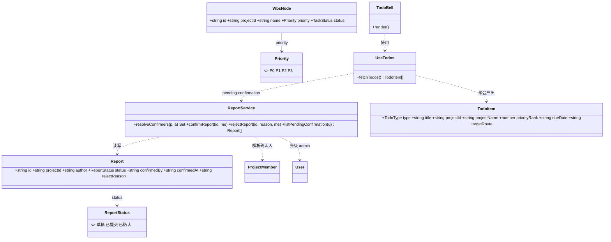
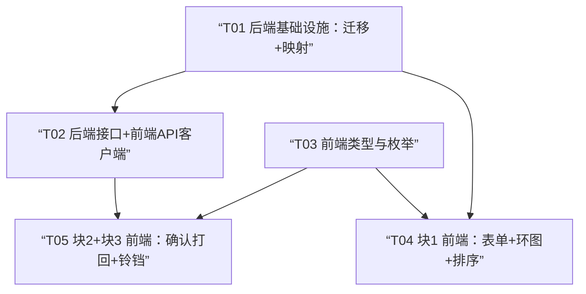

# B14 架构设计 + 任务分解

> 架构师：高见远（Gao）｜主理人：齐活林｜基于 `docs/B14-PRD.md`（忽略其 §0.2 误报）
> 技术栈：Vite + React + TS + MUI + Tailwind + `@mui/x-charts` v7；后端 Node(Express) + better-sqlite3
> 配套图：类图 `B14-class-diagram.mermaid`、时序图 `B14-sequence-diagram.mermaid`

---

## 0. 关键事实对齐（以主理人实测 schema 为准）

PRD §0.2 中「表名 `reports` / 列 `author` / `projects` 无 `pm`」为 PM 子代理探查错误，**本设计一律以主理人 better-sqlite3 实测结论为准**：

| 项 | 实测真值 | 设计采纳 |
|---|---|---|
| 周报表 | 真实表名 **`work_reports`**（列 `author_open_id` + `author_name` + `status`…）；遗留 `reports` 表是扁平旧 schema（author/done/plan…），**B14 周报闭环只动 `work_reports`** | 后端全部读写走 `work_reports`；确认/打回三新列加在 `work_reports` |
| `projects.pm` | **确有该列**，但数据脏（`P-1003` 存 `"dev_徐文斌"` 非 openId），不可信 | **确认人权威源 = `project_members`（`project_role='pm'`）**，绝不读 `projects.pm` |
| `project_members` | 含 `project_role` 列（`pm/tl/...`），存合法 openId，结构化可靠 | 确认人解析、升级路径均基于此表 |
| 状态机 | 现状 `已提交=12 / 草稿=1` | 扩展为 `草稿 → 已提交 → 已确认` |

---

## 1. 实现方案（Implementation Approach）

### 1.1 难点与框架选型
- **难点 1**：优先级是 `wbs_nodes` 的结构化新维度，需前后端全链路贯通（建/改/读/统计/排序）。→ 走 **迁移加列 + mapper 映射 + 前端表单/统计**，零新表、零新框架。
- **难点 2**：周报「上级确认」需解析**确认人集合**，且要规避 `projects.pm` 脏数据、约束「作者≠确认人」、作者即 PM 时升级到 TL/admin、多人 PM 取并集。→ 确认人解析算法**服务端实现**（`report.service`），前端只渲染「我是否可确认」。
- **难点 3**：待办中心要聚合 6 类异构数据源。→ 沿用 B13「零后端新增」原则，**纯前端并发聚合**（块3 不新增任何后端接口）。
- **框架/库**：复用现有 React/MUI/`@mui/x-charts`(v7 已装，环图参考 `ProgressDonut`)/dayjs；**无新增第三方依赖**。
- **架构模式**：后端保持「路由 → service（纯数据层，零 Express 依赖）→ better-sqlite3」既有分层；前端保持「类型契约 + api 客户端 + 页面/组件 + 聚合工具(hooks/utils)」分层。

### 1.2 三块后端改动定位
- **块1**：必要 schema 加列（`wbs_nodes.priority`）+ 读写映射同步。**不新增接口、不新增表**。
- **块2**：必要 schema 加列（`work_reports.confirmed_by/confirmed_at/reject_reason`）+ 确认/打回服务方法 + **1 个服务端「待确认周报」查询接口**（确认人解析必须在服务端，因依赖 `project_members`，故该接口为块2 必需、不属块3）。**不接 `reviews`/B10 审批流，不新增确认人表**。
- **块3**：**纯前端聚合，零后端新增**。

### 1.3 确认人解析算法（服务端，权威）
```
resolveConfirmers(db, projectId, authorOpenId) -> Set<openId>:
  P = SELECT user_open_id FROM project_members
      WHERE project_id = ? AND project_role = 'pm'        // 结构化可靠角色源
  if authorOpenId ∈ P  OR  P 为空:
      // 作者即 pm（或项目无 pm）→ 升级到 tl 或 admin 兜底
      TL = SELECT user_open_id FROM project_members
           WHERE project_id = ? AND project_role = 'tl'
      AD = SELECT open_id FROM users WHERE global_role = 'admin'
      return union(TL, AD)
  else:
      return P                                                    // 多人 pm 取并集（任一可确认）
```
约束：确认/打回接口先校验 `me.open_id ∈ resolveConfirmers(projectId, report.author)`，否则 `E_FORBIDDEN`；天然保证「作者不能确认自己」。

---

## 2. 文件清单（相对路径）

### 新增
- `server/dal/migrations.js` —— 新增 `migrationV7`（加列 + 注册）
- `web/src/types/todo.ts` —— `TodoItem` / `TodoType` / `TodoGroup` 聚合类型
- `web/src/hooks/useTodos.ts` —— 六源并发聚合 hook
- `web/src/components/common/TodoBell.tsx` —— 铃铛 + 下拉 + 徽标

### 修改
**后端**
- `server/lib/mappers.js` —— `toApiWbsNode` 补 `priority`
- `server/services/wbs.service.js` —— `createNode`/`updateNode` 读写 `priority`（INSERT/UPDATE + payload 解析）
- `server/services/report.service.js` —— `rowToApiReport` 补 3 字段；新增 `resolveConfirmers` / `confirmReport` / `rejectReport` / `listPendingConfirmation`
- `server/routes/reports.routes.js` —— 新增 `POST .../reports/:id/confirm`、`POST .../reports/:id/reject`、`GET /api/reports/pending-confirmation`

**前端类型/契约**
- `web/src/types/wbs.ts` —— 新增 `Priority` 类型、`WbsNode.priority`
- `web/src/types/report.ts` —— `ReportStatus` 增 `已确认`；`Report` 增 `confirmedBy/confirmedAt/rejectReason`
- `web/src/config/enums.ts` —— 新增 `PRIORITY_OPTIONS`、`PRIORITY_RANK`（排序权重）
- `web/src/api/contract.ts` —— `Api` 接口增 `confirmReport`/`rejectReport`/`listPendingConfirmation`
- `web/src/api/http.ts` —— 实现上述 3 方法

**前端页面/组件**
- `web/src/pages/projects/WbsPage.tsx` —— `NodeForm`/`EMPTY_FORM` 加 `priority`（默认 P2）；FormDialog 加优先级选择控件；创建/编辑 payload 带 `priority`
- `web/src/utils/dashboardAgg.ts` —— 新增 `aggregatePriorityDistribution`
- `web/src/pages/WorkbenchPage.tsx` —— 插「优先级分布」环图（复用 `ProgressDonut`）；逾期清单按 `priority` 排序
- `web/src/components/dashboard/OverdueTaskDrawer.tsx` —— 逾期/临期明细按 `priority` 升序（P0 置顶），行内 `Chip` 显色标
- `web/src/pages/projects/ReportsPage.tsx` —— `已提交` 且当前用户为确认人时显「确认/打回」按钮 + 弹窗（打回原因必填）；详情显 `confirmedBy/confirmedAt/rejectReason`
- `web/src/components/layout/Topbar.tsx` —— 右侧挂 `<TodoBell />`

*(P1 可选：独立「我的待办」页 `web/src/pages/TodosPage.tsx`、看板按优先级分组筛选 `BoardPage.tsx`；本设计不列入 P0 任务)*

---

## 3. 数据结构与接口（Mermaid classDiagram）

> 完整类图见 `B14-class-diagram.mermaid`，核心如下：



**关键 TS 契约**
```ts
// web/src/types/wbs.ts
export type Priority = 'P0' | 'P1' | 'P2' | 'P3';
export interface WbsNode { /* ...既有... */ priority: Priority; }

// web/src/types/report.ts
export type ReportStatus = '草稿' | '已提交' | '已确认';
export interface Report {
  /* ...既有... */
  status: ReportStatus;
  confirmedBy: string | null;   // openId
  confirmedAt: string | null;   // ISO
  rejectReason: string | null;
}

// web/src/types/todo.ts
export type TodoType = 'APPROVAL' | 'REPORT_CONFIRM' | 'REPORT_FILL' | 'OVERDUE' | 'ASSIGNED' | 'BLOCKED';
export interface TodoItem {
  type: TodoType; title: string; projectId: string; projectName: string;
  priorityRank: number;   // P0=0 … P3=3；非任务类给 -1（置底）
  dueDate: string | null; targetRoute: string; payload: Record<string, unknown>;
}
```

---

## 4. 程序调用时序（Mermaid sequenceDiagram）

> 完整时序见 `B14-sequence-diagram.mermaid`，要点：
> - **时序一**：提交(`已提交`) → `GET /api/reports/pending-confirmation`（服务端逐条 `resolveConfirmers` 过滤出「当前用户可确认」的周报）→ 确认/打回（`rejectReason` 必填，写回 `草稿`）。
> - **时序二**：`TodoBell` 打开 → `useTodos` 并发拉 `approvals` / `dashboard/overview.reportMissing` / `workbench.myTasks` / `wbs`(阻塞+逾期) / `reports/pending-confirmation` → 归一为 `TodoItem[]` 分组渲染，徽标显总数，点条目 `navigate(targetRoute)`。

---

## 5. 待明确事项（已逐项拍板，仅留可选项）

| # | 事项 | 结论 |
|---|---|---|
| 1 | `priority` 默认值 | **P2**（迁移 `DEFAULT 'P2'`，存量行统一回填 P2）|
| 2 | 打回原因是否必填 | **必填**（确认/打回接口校验非空，否则 `E_VALIDATION`）|
| 3 | 块3 纯前端 vs 新接口 | **纯前端聚合**（零后端新增）；块2 的「待确认周报」查询因需服务端解析确认人，单列接口，不属块3 |
| 4 | 铃铛落点 | `Topbar.tsx` 右侧（用户头像旁），与现有主题切换并列 |
| 5 | 多人 PM | **取并集**（任一可确认即可）|
| 6 | 周报读写路由落点 | 现行即 `work_reports` + `/api/projects/:pid/reports`，块2 在其上扩展 |
| 7 | 优先级环图优先级 | 纳入 B14 范围（WorkbenchPage 环图，P0）|
| 8 | 「待确认周报」查询实现 | 新增 `GET /api/reports/pending-confirmation`，服务端复用 `resolveConfirmers` |
| 9 | 通知触达（P2-1） | **本期不做**（留接口位，后续接通知通道）|
| 10 | 独立「我的待办」页（P1-3）/ 看板按优先级分组（P1-2） | **可选，不列入 P0 任务**，架构已预留 `TodoItem`/`PRIORITY_RANK` |

---

## 6. 依赖包（Required Packages）

**无新增依赖**，全部复用既有：

- `react` / `react-dom` / `react-router-dom` —— UI 与路由
- `@mui/material` / `@mui/icons-material` / `@mui/x-charts@^7.12.0` —— 组件与环图（`ProgressDonut` 同源）
- `dayjs`（含 `isoWeek` 插件）—— 日期口径统一 `utils/date.ts`
- 后端 `better-sqlite3` / `express` —— 既有

---

## 7. 任务分解（有序依赖，P0/P1）

> 规则：≤5 任务、每任务 ≥3 文件、首任务为基础设施、依赖尽量扁平（最大深度 2）。

### T01 — 后端基础设施：schema 迁移 + 核心映射（P0）
- **源文件**：`server/dal/migrations.js`、`server/lib/mappers.js`、`server/services/report.service.js`、`server/services/wbs.service.js`
- **依赖**：无（首项）
- **内容**：
  1. `migrations.js` 新增 `migrationV7`：`ALTER wbs_nodes ADD COLUMN priority TEXT NOT NULL DEFAULT 'P2'`；`ALTER work_reports ADD COLUMN confirmed_by TEXT` / `confirmed_at TEXT` / `reject_reason TEXT`（均默认 NULL）；注册进 `MIGRATIONS`（v7）。
  2. `mappers.toApiWbsNode` 补 `priority: toStr(row.priority, 'P2')`。
  3. `report.service.rowToApiReport` 补 `confirmedBy/confirmedAt/rejectReason`；新增 `resolveConfirmers` / `confirmReport` / `rejectReport` / `listPendingConfirmation`（算法见 §1.3）。
  4. `wbs.service` 的 `createNode`/`updateNode`：INSERT/UPDATE 带 `priority`，payload 解析（缺省 P2）。

### T02 — 后端接口 + 前端 API 客户端（P0）
- **源文件**：`server/routes/reports.routes.js`、`web/src/api/contract.ts`、`web/src/api/http.ts`
- **依赖**：T01
- **内容**：
  1. `reports.routes.js` 新增：`POST /api/projects/:projectId/reports/:id/confirm`（查权限→置 `已确认`+写 `confirmed_by/confirmed_at`）、`POST /api/projects/:projectId/reports/:id/reject`（校验 `rejectReason` 非空→置 `草稿`+写 `reject_reason`）、`GET /api/reports/pending-confirmation`（调 `listPendingConfirmation`，`requireAuth` 注入 `req.user.open_id`）。注意挂载顺序：须位于 `stubs.routes` 之前，且 `/pending-confirmation` 为静态段不与 `:id` 冲突。
  2. `contract.ts` 的 `Api` 增 `confirmReport(projectId,id)` / `rejectReport(projectId,id,reason)` / `listPendingConfirmation()`。
  3. `http.ts` 实现三方法（`post`/`get`）。

### T03 — 前端类型与枚举契约（P0）
- **源文件**：`web/src/types/wbs.ts`、`web/src/types/report.ts`、`web/src/types/todo.ts`、`web/src/config/enums.ts`
- **依赖**：无
- **内容**：`wbs.ts` 加 `Priority`+`priority`；`report.ts` 扩 `ReportStatus`/`Report` 三字段；新建 `todo.ts`（`TodoItem`/`TodoType`/`TodoGroup`）；`enums.ts` 加 `PRIORITY_OPTIONS`（值/标签/色标：P0 红 P1 橙 P2 蓝 P3 灰）与 `PRIORITY_RANK`（`{P0:0,P1:1,P2:2,P3:3}`）。

### T04 — 块1 前端：表单 + 筛选 + 环图 + 排序（P0/P1）
- **源文件**：`web/src/pages/projects/WbsPage.tsx`、`web/src/utils/dashboardAgg.ts`、`web/src/pages/WorkbenchPage.tsx`、`web/src/components/dashboard/OverdueTaskDrawer.tsx`
- **依赖**：T01、T03
- **内容**：
  1. `WbsPage.tsx`：`NodeForm`/`EMPTY_FORM` 加 `priority`（默认 `P2`）；FormDialog 加 `TextField(select)` 优先级控件；创建/编辑 payload 带 `priority`。
  2. `dashboardAgg.ts` 新增 `aggregatePriorityDistribution(nodes)`（按 P0–P3 计数）。
  3. `WorkbenchPage.tsx`：复用 `ProgressDonut` 插「优先级分布」环图（数据来自 `myTasks` 经 `aggregatePriorityDistribution`）；逾期清单按 `priorityRank` 升序。
  4. `OverdueTaskDrawer.tsx`：逾期/临期明细按 `priorityRank` 升序（P0 置顶），行内 `Chip` 显色标。

### T05 — 块2+块3 前端：周报确认/打回 + 待办铃铛（P0）
- **源文件**：`web/src/pages/projects/ReportsPage.tsx`、`web/src/hooks/useTodos.ts`、`web/src/components/common/TodoBell.tsx`、`web/src/components/layout/Topbar.tsx`
- **依赖**：T02、T03
- **内容**：
  1. `ReportsPage.tsx`：列表/详情中，当 `status==='已提交'` 且当前用户 ∈ 该周报确认人集合（前端用 `GET /pending-confirmation` 已返回的可确认集合判定，或本地按 `project_members`+权限粗判后由服务端最终校验）时显「确认/打回」按钮；打回弹窗 `TextField` 原因（必填校验）；详情显 `confirmedBy/confirmedAt/rejectReason`。
  2. `useTodos.ts`：并发拉六源 → 归一 `TodoItem[]` → 按 `type` 分组、`priorityRank` 排序，输出 `{total, groups}`。
  3. `TodoBell.tsx`：铃铛 `IconButton` + `Badge` 总数 + `Menu` 下拉按组渲染，点条目 `navigate(targetRoute)`。
  4. `Topbar.tsx`：右侧挂 `<TodoBell />`。

---

## 8. 共享约定（Shared Knowledge）

- **API 响应包裹**：全部后端经 `lib/envelope.js#ok(data, msg)` 返回 `{code, data, message}`，前端 `api/client` 已解包，service 层无需关心。
- **优先级枚举单一真源**：`web/src/config/enums.ts` 的 `PRIORITY_OPTIONS` / `PRIORITY_RANK`；TS 类型 `Priority` 在 `web/src/types/wbs.ts`；后端无独立枚举常量（自由文本列，由迁移 DEFAULT 与前端取值约束保证一致）。
- **状态枚举**：`ReportStatus` 取值（`草稿/已提交/已确认`）前后端文案一致；状态机 `草稿→已提交→已确认` 仅由后端 `confirmReport/rejectReport` 驱动，前端不得直改。
- **日期口径**：一切逾期/临期判定走 `web/src/utils/date.ts`（`isOverdue`/`isDueSoon`/`diffDays`），**禁止手写 `new Date()` 比较**；服务端 `lib/dates.js` 对应函数逐字一致。
- **确认人解析**：唯一实现位于 `server/services/report.service.js#resolveConfirmers`，前端不重复实现；「我能否确认」以前端调用 `GET /api/reports/pending-confirmation` 的结果为准（服务端已过滤）。
- **零后端新增原则（块3）**：待办中心纯前端聚合，绝不新增 `/api/todos` 等汇总接口；六源均复用既有端点。
- **权限**：后端 `req.user.open_id` 为当前用户；确认/打回先 `resolveConfirmers` 校验，作者天然被排除。
- **UI 资产复用**：环图参考 `ProgressDonut`；逾期下探/排序复用 `OverdueTaskDrawer`、`dashboardAgg`；铃铛复用 `Badge`/`Menu`。

---

## 9. 任务依赖图（Mermaid graph）


