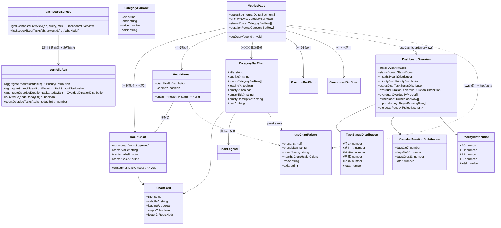
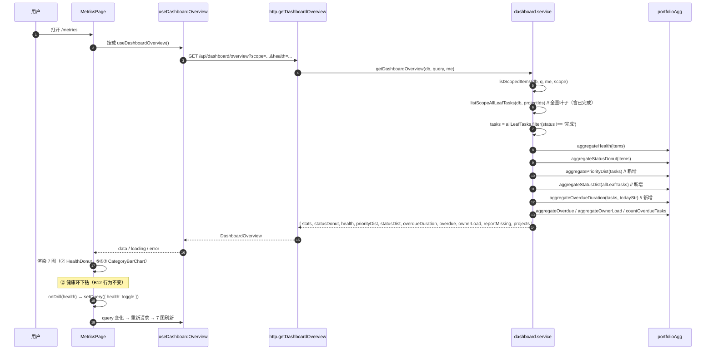

# B17 全局总览可视化优化 — 架构设计（施工图）

> 文档类型：架构设计（施工图）
> 作者：架构（高见远）｜主理人：齐活林
> 项目盘址：`C:/Users/xuwen/WorkBuddy/AstrBytes/pm-app/`
> 对应 PRD：`docs/B17-PRD.md`（PM 许清楚）
> 技术栈：前端 Vite + React + TS + MUI + Tailwind + `@mui/x-charts` v7；后端 Node(Express) + better-sqlite3
> 批次定位：**B15/B16 之后首次含小后端增量**；零 schema 变更 / 零新依赖 / 零新路由 / 零新接口
> 生成日期：2026-08-18

---

## 0. 变更清单（全量，9 改/建 + 4 只读核对）

| # | 文件 | 类型 | 改动点（一句话） |
|---|---|---|---|
| 1 | `server/lib/portfolioAgg.js` | 改 | 新增并导出 3 个纯函数：`aggregatePriorityDist` / `aggregateStatusDist` / `aggregateOverdueDuration`（内联白名单，保持零框架依赖） |
| 2 | `server/services/dashboard.service.js` | 改 | 新增 `listScopeAllLeafTasks`（全量叶子，含已完成，与现有函数共享私有拉取逻辑，零额外 SQL）；`getDashboardOverview` 用 `allLeafTasks.filter(在办)` 替换 `listScopeLeafTasks` 调用，追加计算 `priorityDist` / `statusDist` / `overdueDuration` 并加入返回体 |
| 3 | `web/src/types/dashboard.ts` | 改 | 新增 `TaskStatusDistribution` / `OverdueDurationDistribution` 两个接口；`DashboardOverview` 追加 3 字段 |
| 4 | `web/src/components/dashboard/CategoryBarChart.tsx` | 新建 | 通用横向条形图（掩码多 series 逐档着色），供优先级 / 状态 / 逾期时长 3 图复用 |
| 5 | `web/src/components/dashboard/HealthDonut.tsx` | 新建 | 健康分布环形图薄封装（复用 `DonutChart`，中心值 = red+yellow） |
| 6 | `web/src/components/dashboard/index.ts` | 改 | barrel 追加导出 `CategoryBarChart` / `HealthDonut` 及类型 |
| 7 | `web/src/utils/dashboardAgg.ts` | 改 | 新增前端纯函数 `aggregateStatusDist` / `aggregateOverdueDuration`（与后端逐字一致），供 mock 双写与 QA 断言 |
| 8 | `web/src/api/mock/index.ts` | 改 | `getDashboardOverview`（L2574）保留全量叶子数组、计算并返回 3 字段（复用 dashboardAgg 纯函数） |
| 9 | `web/src/pages/MetricsPage.tsx` | 改 | 图表区 4→7 图、栅格加 `xl:repeat(3,1fr)`、`HealthDistBar` → `HealthDonut`、追加 3 张 `CategoryBarChart` |
| 10 | `server/config/enums.js` | 只读核对 | `TASK_STATUSES` 五档取值（待办/进行中/待评审/完成/阻塞），聚合按此序 |
| 11 | `server/lib/dates.js` | 只读核对 | `diffDays(a,b)=b-a` / `today()`，聚合层唯一日期来源 |
| 12 | `web/src/config/enums.ts` | 只读核对 | `TASK_STATUSES` / `PRIORITIES` / `PRIORITY_OPTIONS` / `normalizePriority`（脏值兜底 P2） |
| 13 | `web/src/utils/date.ts` | 只读核对 | `today()` / `diffDays` / `isOverdue`（dayjs，与后端逐字一致） |

只读红线（**不改**）：`HealthDistBar.tsx`（工作台 `WorkbenchPage` L206 仍用）、`DonutChart.tsx` / `ChartCard.tsx` / `ChartLegend` / `CHART_BODY_HEIGHT` / `OverdueBarChart.tsx` / `OwnerLoadBarChart.tsx`、B12 筛选栏 / 明细表 / `OwnerLoadDrawer` / `OverdueTaskDrawer`、`web/src/api/http.ts#getDashboardOverview`（仅类型扩展，调用不动）。

---

## 1. 后端设计

### 1.1 `server/lib/portfolioAgg.js` — 3 个新纯函数（施工签名 + 实现要点）

> 约束延续 SK-B12：零框架依赖，仅 `require('./dates')` + `require('../config/enums')`；**不 require `wbs.service.js`**（其依赖 errors/rbac，会破坏纯净性），优先级白名单在聚合层**内联**（与 `wbs.service.js#PRIORITIES` / `DEFAULT_PRIORITY` 同值、语义同 `normalizePriority` 但脏值兜底 P2 而非抛错——因本函数输入是已入库的 API 形态节点，脏值按「读时兜底」处理）。

#### 函数 1：`aggregatePriorityDist(tasks)`

```js
/** 优先级白名单（内联镜像 wbs.service.PRIORITIES，保持零框架依赖） */
const PRIORITIES = ['P0', 'P1', 'P2', 'P3'];
/** 优先级兜底（内联镜像 wbs.service.DEFAULT_PRIORITY） */
const DEFAULT_PRIORITY = 'P2';

/**
 * 任务优先级分布（B17 · P0-2）。
 * 入参 = 在办叶子任务（由调用方筛好，含已完成则口径不符）。
 * 返回 { P0, P1, P2, P3, total }；total = 四档之和 = 入参任务数。
 * 脏值（null / '' / 'P9' / 小写 p0）一律记 P2；空数组 → 全零（不返回 NaN）。
 * @param {Array<object>} tasks WbsNode[]
 * @returns {{P0: number, P1: number, P2: number, P3: number, total: number}}
 */
function aggregatePriorityDist(tasks) {
  const dist = { P0: 0, P1: 0, P2: 0, P3: 0, total: 0 };
  asArray(tasks).forEach(function (n) {
    const raw = String((n && n.priority) || '').trim().toUpperCase();
    const p = PRIORITIES.indexOf(raw) >= 0 ? raw : DEFAULT_PRIORITY;
    dist[p] += 1;
    dist.total += 1;
  });
  return dist;
}
```

实现要点：
- 白名单判定用 `PRIORITIES.indexOf(raw) >= 0`（字符串比较，与 `normalizePriority` 的 `.trim().toUpperCase()` 归一一致）。
- 双保险说明：`mappers.toApiWbsNode` 已把 `row.priority` 兜底为 `'P2'`（`toStr(row.priority, 'P2')`），实际流入的节点 priority 恒合法；聚合层再兜底一次是为了让 QA 可直接对**裸对象数组**断言（无需经 mapper）。

#### 函数 2：`aggregateStatusDist(allLeafTasks)`

```js
/**
 * 任务状态分布（B17 · P0-3）。
 * 入参 = **全量叶子任务（含已完成）**；档序恒按 `enums.TASK_STATUSES`
 * （待办 / 进行中 / 待评审 / 完成 / 阻塞）。
 * 返回 { 待办, 进行中, 待评审, 完成, 阻塞, total }。
 * 脏状态（枚举外取值）**不计入任何一档**（策略同 aggregateHealth 的非法健康度），
 * 因此 total 可能略小于入参叶子数——副标题口径为「共 N 个任务（含已完成）」= total。
 * @param {Array<object>} allLeafTasks WbsNode[]（含已完成叶子）
 * @returns {{待办: number, 进行中: number, 待评审: number, 完成: number, 阻塞: number, total: number}}
 */
function aggregateStatusDist(allLeafTasks) {
  const dist = { 待办: 0, 进行中: 0, 待评审: 0, 完成: 0, 阻塞: 0, total: 0 };
  asArray(allLeafTasks).forEach(function (n) {
    const s = String((n && n.status) || '');
    if (enums.TASK_STATUSES.indexOf(s) < 0) return; // 脏状态不计入
    dist[s] += 1;
    dist.total += 1;
  });
  return dist;
}
```

实现要点：
- 档序 = `enums.TASK_STATUSES` 索引序（与前端 `web/src/config/enums.ts#TASK_STATUSES` 逐字一致；**不是**看板列序 `BOARD_COLUMNS`，本图按任务状态枚举）。
- 计数用中文键直接落在返回对象上（与 `aggregateHealth` 的 `dist[h]` 同款），前端类型 `TaskStatusDistribution` 同键名。

#### 函数 3：`aggregateOverdueDuration(tasks, todayStr)`

```js
/**
 * 逾期时长分段（B17 · P0-4）。
 * 入参 = 在办叶子任务；仅 `isOverdue` 者（diffDays(today, dueDate) < 0，空 dueDate 恒 false）。
 * 天数 days = diffDays(dueDate, today)（恒 ≥1 的正数）；分段 1–7 / 8–30 / ≥31。
 * 返回 { days1to7, days8to30, daysOver30, total }；total = 三段之和 = countOverdueTasks（同入参同 today 下逐字相等，QA 可断言）。
 * @param {Array<object>} tasks WbsNode[]（在办叶子任务）
 * @param {string} [todayStr] 今天 `YYYY-MM-DD`；缺省取 dates.today()
 * @returns {{days1to7: number, days8to30: number, daysOver30: number, total: number}}
 */
function aggregateOverdueDuration(tasks, todayStr) {
  const t = todayStr || dates.today();
  const dist = { days1to7: 0, days8to30: 0, daysOver30: 0, total: 0 };
  asArray(tasks).forEach(function (n) {
    if (!isOverdue(n, t)) return;
    const due = String((n && n.dueDate) || '');
    const days = dates.diffDays(due, t); // diffDays(a,b) = b - a；逾期时 dueDate < today → days ≥ 1
    if (days <= 7) dist.days1to7 += 1;
    else if (days <= 30) dist.days8to30 += 1;
    else dist.daysOver30 += 1;
    dist.total += 1;
  });
  return dist;
}
```

实现要点：
- 逾期判定**复用**模块内既有 `isOverdue(node, t)`（内部实现 = `dates.diffDays(t, due) < 0`），禁止重写日期逻辑。
- 分段边界：`days === 7` → 1–7 档；`days === 8` / `days === 30` → 8–30 档；`days === 31` → >30 档；与 PRD「1 ≤ days ≤ 7 / 8 ≤ days ≤ 30 / days ≥ 31」逐字一致。
- `total` 与 `countOverdueTasks(tasks, t)` 同入参同 today 恒等（QA 断言点）。

#### module.exports 追加

```js
module.exports = {
  // ...既有导出保持不动
  aggregatePriorityDist,
  aggregateStatusDist,
  aggregateOverdueDuration,
};
```

### 1.2 `server/services/dashboard.service.js` — 改动点（3 处）

**改动 1：新增全量叶子取数函数（零额外 SQL）。**

现有 `listScopeLeafTasks`（L196）只在本文件内被 `getDashboardOverview` 调用（已核实无其它 service 引用），但为最小回归面，**不改其行为**，改为提取私有拉取 + 新增姐妹函数：

```js
/**
 * 范围内项目的「全部叶子任务」（含已完成）。
 * 与 listScopeLeafTasks 共享私有拉取，唯一差异 = 不过滤 status==='完成'。
 * @param {import('better-sqlite3').Database} db
 * @param {Array<string>} projectIds
 * @returns {Array<object>} WbsNode[]（含 ownerName，含已完成叶子）
 */
function listScopeAllLeafTasks(db, projectIds) {
  // 实现 = 把 listScopeLeafTasks 的「判叶子」改为不过滤完成：
  //   wbs.leafNodesOf(byProject[pid]).forEach(function (n) { out.push(n); });
  // 与 listScopeLeafTasks 共享私有 helper：
  //   collectScopeLeafTasks(db, projectIds, /* includeDone */ true)
}
```

施工建议：把现有 `listScopeLeafTasks` 的 SQL 拉取 + 分组 + 判叶子抽成私有函数 `collectScopeLeafTasks(db, projectIds, includeDone)`，两个公开函数分别以 `false` / `true` 调用；`listScopeLeafTasks` 行为逐字不变（回归零风险）。

**改动 2：`getDashboardOverview` 内改一处取数 + 追加 3 个聚合（L316 附近）。**

```js
// 改前：const tasks = listScopeLeafTasks(db, projectIds);
const allLeafTasks = listScopeAllLeafTasks(db, projectIds); // 全量叶子（含已完成）· 同一批 wbs_nodes SELECT，零额外 SQL
const tasks = allLeafTasks.filter(function (n) { return n.status !== '完成'; }); // 在办叶子（既有口径逐字不变）

// 既有聚合全部继续用 tasks（行为零变化）：
//   aggregateOverdue(items, tasks, todayStr)
//   aggregateOwnerLoad(tasks, todayStr, nameById)
//   countOverdueTasks(tasks, todayStr)

// 追加（放在 overdueTasks 之后）：
const priorityDist = agg.aggregatePriorityDist(tasks);           // 在办叶子
const statusDist = agg.aggregateStatusDist(allLeafTasks);        // 全量叶子（含已完成）
const overdueDuration = agg.aggregateOverdueDuration(tasks, todayStr); // 在办叶子
```

**改动 3：返回体追加 3 字段（L353 的 return 对象）。**

```js
return {
  scope: scope,
  generatedAt: dates.nowIso(),
  stats: { /* 不动 */ },
  statusDonut: statusDonut,
  health: health,
  priorityDist: priorityDist,        // 新增
  statusDist: statusDist,            // 新增
  overdueDuration: overdueDuration,  // 新增
  overdue: overdue,
  ownerLoad: ownerLoad,
  reportMissing: reportMissing,
  projects: paged(...),
};
```

字段名固定为 `priorityDist` / `statusDist` / `overdueDuration`（前后端 + mock 三处同键）。

---

## 2. 前端设计

### 2.1 `web/src/types/dashboard.ts` — 新增 2 接口 + 扩展 1 接口

放在 B12 区块（`DashboardOverview` 上方）：

```ts
/**
 * 任务状态分布（B17 · P0-3 · 横向条形）
 * 档序恒按 TASK_STATUSES（待办 / 进行中 / 待评审 / 完成 / 阻塞）；
 * 后端聚合输入为「全量叶子任务（含已完成）」，脏状态不计入，
 * 故 total 可能略小于范围内叶子数（副标题「共 N 个任务（含已完成）」取 total）。
 */
export interface TaskStatusDistribution {
  待办: number;
  进行中: number;
  待评审: number;
  完成: number;
  阻塞: number;
  /** 五档之和 */
  total: number;
}

/**
 * 逾期时长分段（B17 · P0-4 · 横向条形）
 * 仅在办叶子任务中 isOverdue 者，days = diffDays(dueDate, today)；
 * 分段 1–7 / 8–30 / ≥31。total = 三段之和 = 顶部「逾期任务」卡数值。
 */
export interface OverdueDurationDistribution {
  days1to7: number;
  days8to30: number;
  daysOver30: number;
  /** 三段之和（可断言 = stats.overdueTasks） */
  total: number;
}
```

`DashboardOverview` 追加（插在 `health` 与 `overdue` 之间，保持既有字段顺序）：

```ts
export interface DashboardOverview {
  scope: DashboardScope;
  generatedAt: string;
  stats: OverviewStats;
  statusDonut: StatusDonut;
  health: HealthDistribution;
  /** B17：在办叶子任务按 P0–P3 计数（脏值兜底 P2；分母与 B14 工作台一致） */
  priorityDist: PriorityDistribution;
  /** B17：全量叶子任务（含已完成）按任务状态五档计数 */
  statusDist: TaskStatusDistribution;
  /** B17：在办叶子任务中已逾期者按 1–7 / 8–30 / >30 天分段 */
  overdueDuration: OverdueDurationDistribution;
  overdue: OverdueByProject[];
  ownerLoad: OwnerLoadRow[];
  reportMissing: ReportMissingRow[];
  projects: Paged<ProjectListItem>;
}
```

`PriorityDistribution` 复用既有接口（B14，`P0/P1/P2/P3/total`），无需改动。

### 2.2 `web/src/components/dashboard/CategoryBarChart.tsx` — 新建（通用横向条形）

```tsx
/** 单档（调用方已定 label / 颜色，组件不感知业务） */
export interface CategoryBarRow {
  /** 唯一标识（React key / series 索引对齐） */
  key: string;
  /** y 轴刻度 + 图例文案（如「P0 最高」「待办」「逾期 1–7 天」） */
  label: string;
  value: number;
  /** 真 hex（调用方经 useChartPalette 取色；半透明用 hexAlpha 预乘） */
  color: string;
}

export interface CategoryBarChartProps {
  title: string;
  subtitle?: string;
  rows: CategoryBarRow[];
  loading?: boolean;
  /** 空态；不传时按 sum(rows[].value) === 0 自动判定（与 DonutChart 一致） */
  empty?: boolean;
  emptyTitle?: string;
  emptyDescription?: string;
  /** tooltip / 图例单位（默认「个」） */
  unit?: string;
}
```

实现要点（施工标准）：
- 外壳：`ChartCard`（title / subtitle / loading / empty / emptyTitle / emptyDescription）+ `footer={<ChartLegend items={...} />}`；**无下钻回调**（P0-5 只展示）。
- 数据流：`const total = rows.reduce((s, r) => s + r.value, 0);` → 空态判定；`pct = (v) => (total ? Math.round((v / total) * 100) : 0);`。
- **掩码多 series 模式**（PRD P0-5 拍板）：`BarSeriesType.data` 为 `(number|null)[]` 且单 series 只有单一 `color`，故每档一个 series、`data` 仅对应档位索引有值、其余 `null`：

```tsx
<BarChart
  dataset={rows.map((r) => ({ category: r.label }))}
  layout="horizontal"
  height={CHART_BODY_HEIGHT}
  margin={{ top: 8, right: 16, bottom: 24, left: 76 }}
  grid={{ vertical: true }}
  slotProps={{ legend: { hidden: true } }}
  yAxis={[{ scaleType: 'band', dataKey: 'category', tickLabelStyle: { fill: palette.axis, fontSize: 11 } }]}
  xAxis={[{ min: 0, tickMinStep: 1, tickLabelStyle: { fill: palette.axis, fontSize: 11 } }]}
  series={rows.map((r, i) => ({
    data: rows.map((_, j) => (j === i ? r.value : null)), // 掩码：仅第 i 档有值
    label: r.label,
    color: r.color,
    valueFormatter: (v) => (v == null ? '' : `${v} ${unit} · ${pct(v)}%`), // tooltip「N 个 · P%」
  }))}
  borderRadius={3}
/>
```

- footer 图例：`rows.map((r) => ({ color: r.color, label: r.label, value: r.value }))` —— 0 值档也显示（`ChartLegend` 默认行为），无 `onClick`。
- 类目间距沿用 x-charts v7 默认值（**不显式传** `categoryGap` / `barGap`，会触发 band 轴多余属性检查——参考 `OverdueBarChart.tsx` L102 注释）。
- `margin.left = 76` 固定（覆盖「逾期 1–7 天」≈ 9 字符的标签宽度）。
- 空态 / 加载：`ChartCard` 分支处理，空态不画坐标轴（既有 SK-B11-6 行为，组件零额外代码）。
- 顶部 import 禁令注释沿用既有图表层模板：**禁止** import `tokens` / `alphaOf` / `colorOf`；颜色全部由调用方传入真 hex（组件内只调 `useChartPalette()` 取 `palette.axis`）。

### 2.3 `web/src/components/dashboard/HealthDonut.tsx` — 新建（健康环薄封装）

```tsx
export interface HealthDonutProps {
  /** aggregateHealth() 的结果 */
  dist: HealthDistribution;
  loading?: boolean;
  /** 下钻回调：点击环段 / 图例时触发，参数为被点击健康档（B12 行为不变） */
  onDrill?: (health: Health) => void;
}
```

实现要点：
- 内部把 `HealthDistribution` 映射为 `DonutSegment[]`（`DonutChart` 数据源）：

```tsx
const segments: DonutSegment[] = [
  { id: 'green',  label: '正常', value: dist.green,  color: palette.health.green },
  { id: 'yellow', label: '预警', value: dist.yellow, color: palette.health.yellow },
  { id: 'red',    label: '风险', value: dist.red,    color: palette.health.red },
];
```

- 中心值（主理人拍板 #2）：`centerValue = String(dist.red + dist.yellow)`、`centerLabel = '需关注项目'`；中心色三态：`red > 0 → palette.health.red`；`red === 0 && yellow > 0 → palette.health.yellow`；全绿 → `palette.brandStrong`。
- 副标题（P1-2）：`dist.total > 0 ? `${dist.total} 个在办项目` : ''`（沿用 `HealthDistBar` 文案，与中心「需关注项目」数值区分口径）。
- 空态（总览口径，P0-1）：`empty={dist.total === 0}`、`emptyTitle="当前范围暂无在办项目"`、`emptyDescription="切换范围或调整筛选条件试试"`。
- 下钻透传：`onSegmentClick={onDrill ? (seg) => onDrill(seg.id as Health) : undefined}`（`DonutChart` 环体 + 图例点击均触发，0 值段进图例不进环体，均保留）。
- 其余 props（loading / unit='个' / showLegend）走 `DonutChart` 默认值；**不新增任何自有 state**（纯薄封装）。

### 2.4 `web/src/components/dashboard/index.ts` — barrel 追加

```ts
export { CategoryBarChart } from './CategoryBarChart';
export type { CategoryBarChartProps, CategoryBarRow } from './CategoryBarChart';
export { HealthDonut } from './HealthDonut';
export type { HealthDonutProps } from './HealthDonut';
```

### 2.5 `web/src/utils/dashboardAgg.ts` — 新增 2 个前端纯函数（与后端逐字一致）

```ts
/**
 * 任务状态分布聚合（B17 · 与后端 portfolioAgg.aggregateStatusDist 逐字一致）。
 * 入参 = 全量叶子任务（含已完成）；档序按 TASK_STATUSES；脏状态不计入。
 */
export function aggregateStatusDist(nodes: WbsNode[]): TaskStatusDistribution {
  const list = Array.isArray(nodes) ? nodes : [];
  const counts: Record<TaskStatus, number> = { 待办: 0, 进行中: 0, 待评审: 0, 完成: 0, 阻塞: 0 };
  list.forEach((n) => {
    const s = n?.status;
    if (!s || !(s in counts)) return; // 脏状态不计入
    counts[s] += 1;
  });
  return { ...counts, total: TASK_STATUSES.reduce((sum, s) => sum + counts[s], 0) };
}

/**
 * 逾期时长分段聚合（B17 · 与后端 portfolioAgg.aggregateOverdueDuration 逐字一致）。
 * 入参 = 在办叶子任务；逾期判定复用 utils/date#isOverdue（dayjs isBefore today，空 dueDate 恒 false）；
 * days = diffDays(dueDate, today())；分段 1–7 / 8–30 / ≥31。
 */
export function aggregateOverdueDuration(
  nodes: WbsNode[],
  todayStr: string = today(),
): OverdueDurationDistribution {
  const list = Array.isArray(nodes) ? nodes : [];
  const dist = { days1to7: 0, days8to30: 0, daysOver30: 0, total: 0 };
  list.forEach((n) => {
    if (!n?.dueDate || !isOverdue(n.dueDate)) return;
    const days = diffDays(n.dueDate, todayStr);
    if (days <= 7) dist.days1to7 += 1;
    else if (days <= 30) dist.days8to30 += 1;
    else dist.daysOver30 += 1;
    dist.total += 1;
  });
  return dist;
}
```

说明：
- `aggregatePriorityDist` 的**前端等价物已存在**：`aggregatePriorityDistribution`（B14，内部 `normalizePriority` 脏值兜底 P2），直接复用，不新增第三个函数。
- 文件顶部 type import 追加 `TaskStatusDistribution` / `OverdueDurationDistribution`；常量 import 追加 `TASK_STATUSES`（`@/config/enums`）；`isOverdue` 从 `@/utils/date` 引入。
- 文件头部「零 React 依赖」注释维持（本批两个函数仍为纯函数，可被 QA 脚本直接 import 断言）。

### 2.6 `web/src/api/mock/index.ts` — `getDashboardOverview` 双写同步（L2574）

**改动 1：import 追加。**

```ts
import { aggregateHealth, aggregateOverdue, aggregatePriorityDistribution, aggregateStatusDist, aggregateOverdueDuration } from '@/utils/dashboardAgg';
```

**改动 2：第 3 步保留全量叶子（L2631 附近）。**

```ts
// 改前：
// const tasks = leafNodesOf(db.wbsNodes.filter((n) => scopeIds.has(n.projectId)))
//   .filter((n) => n.status !== '完成')
//   .map((n) => ({ ...n, projectName: projectNameById.get(n.projectId) ?? '' }));

const allLeafTasks = leafNodesOf(db.wbsNodes.filter((n) => scopeIds.has(n.projectId)))
  .map((n) => ({ ...n, projectName: projectNameById.get(n.projectId) ?? '' })); // 全量叶子（含已完成）
const tasks = allLeafTasks.filter((n) => n.status !== '完成'); // 在办（既有口径逐字不变）
```

**改动 3：第 4 步追加 3 个聚合（`overdueTasks` 之后）。**

```ts
const priorityDist = aggregatePriorityDistribution(tasks);      // 在办叶子（复用 B14 纯函数）
const statusDist = aggregateStatusDist(allLeafTasks);           // 全量叶子（含已完成）
const overdueDuration = aggregateOverdueDuration(tasks);        // 在办叶子中已逾期者分段
```

**改动 4：返回体（L2752）追加 3 字段**（`health` 之后）：`priorityDist` / `statusDist` / `overdueDuration`。

口径对齐说明：mock 与后端共用「`isOverdue` = 逾期、在办 = 非完成」同源判定（前端 dayjs / 后端 dates 逐字一致），`overdueDuration.total === stats.overdueTasks` 在 mock 内同样成立。

### 2.7 `web/src/pages/MetricsPage.tsx` — 图表区 4→7 图（P0-6）

**改动 1：import。**

```ts
// 移除：HealthDistBar（从 @/components/dashboard 的 import 列表删除）
// 追加：
import { CategoryBarChart, DonutChart, HealthDonut, OverdueBarChart, OwnerLoadBarChart, ... } from '@/components/dashboard';
import type { CategoryBarRow } from '@/components/dashboard';
import { PRIORITIES, PRIORITY_OPTIONS, TASK_STATUSES, PROJECT_TYPE_SHORT, PROJECT_TYPES, HEALTH_LABEL } from '@/config/enums';
import { useChartPalette, hexAlpha } from '@/theme/chartPalette';
```

**改动 2：图表区栅格。**

```tsx
gridTemplateColumns: { xs: '1fr', md: 'repeat(2, 1fr)', xl: 'repeat(3, 1fr)' },
```

**改动 3：图表区 7 图（顺序严格：状态环 → 健康环 → 逾期柱 → 负荷柱 → 优先级 → 状态 → 逾期时长）。**

```tsx
// ① 项目状态分布（不动）
<DonutChart ... />  // 原样保留

// ② 项目健康度分布（替换 HealthDistBar → HealthDonut；props 等价）
<HealthDonut
  dist={data?.health ?? { green: 0, yellow: 0, red: 0, total: 0 }}
  loading={loading}
  onDrill={(h) => setQuery({ health: query.health === h ? '' : h })}
/>

// ③ 逾期 / 临期任务（不动）
<OverdueBarChart rows={data?.overdue ?? []} loading={loading} onDrill={openOverdue} />

// ④ 负责人负荷（不动）
<OwnerLoadBarChart rows={data?.ownerLoad ?? []} loading={loading} onDrill={openOwner} />

// ⑤ 任务优先级分布（新增，无下钻）
<CategoryBarChart
  title="任务优先级分布"
  subtitle={`共 ${data?.priorityDist.total ?? 0} 个未完成任务`}
  rows={priorityRows}
  loading={loading}
  emptyTitle="暂无进行中的任务"
  emptyDescription="没有需要按优先级排期的任务"
/>

// ⑥ 任务状态分布（新增，无下钻）
<CategoryBarChart
  title="任务状态分布"
  subtitle={`共 ${data?.statusDist.total ?? 0} 个任务（含已完成）`}
  rows={statusRows}
  loading={loading}
  emptyTitle="当前范围暂无任务"
/>

// ⑦ 逾期时长分段（新增，无下钻）
<CategoryBarChart
  title="逾期时长分段"
  subtitle={`共 ${data?.overdueDuration.total ?? 0} 个逾期任务`}
  rows={durationRows}
  loading={loading}
  emptyTitle="太好了，没有逾期任务 🎉"
  emptyDescription="所有任务都在计划节奏内"
/>
```

**改动 4：rows 构造（组件函数体内，紧邻 `statusSegments` 之后；新增局部取色）。**

```tsx
const palette = useChartPalette();

/* 优先级 4 档：P0 红 / P1 黄 / P2 品牌蓝 / P3 灰（同 B14 工作台优先级环） */
const priorityRows: CategoryBarRow[] = PRIORITIES.map((p) => ({
  key: p,
  label: PRIORITY_OPTIONS.find((o) => o.value === p)?.label ?? p, // 'P0 最高' 等
  value: data?.priorityDist[p] ?? 0,
  color:
    p === 'P0' ? palette.health.red :
    p === 'P1' ? palette.health.yellow :
    p === 'P2' ? palette.brandMain :
    palette.track,
}));

/* 状态 5 档：待办灰 / 进行中品牌蓝 / 待评审黄 / 阻塞红 / 完成绿（主理人拍板 #4） */
const statusRows: CategoryBarRow[] = TASK_STATUSES.map((s) => ({
  key: s,
  label: s,
  value: data?.statusDist[s] ?? 0,
  color:
    s === '待办' ? palette.track :
    s === '进行中' ? palette.brand[1] :
    s === '待评审' ? palette.health.yellow :
    s === '阻塞' ? palette.health.red :
    palette.health.green, // 完成
}));

/* 逾期时长 3 段：红系递进（浅 → 中 → 深） */
const durationRows: CategoryBarRow[] = [
  { key: 'days1to7',    label: '逾期 1–7 天',  value: data?.overdueDuration.days1to7 ?? 0,    color: hexAlpha(palette.health.red, 0.5) },
  { key: 'days8to30',   label: '逾期 8–30 天', value: data?.overdueDuration.days8to30 ?? 0,   color: hexAlpha(palette.health.red, 0.75) },
  { key: 'daysOver30',  label: '逾期 >30 天',  value: data?.overdueDuration.daysOver30 ?? 0,  color: palette.health.red },
];
```

- 空态说明：`CategoryBarChart` 未传 `empty`，自动按 `total === 0` 判空；`loading` 时 `data` 为 undefined → rows 全 0 → `empty=true`，但 `loading=true` 时 `ChartCard` 优先渲染骨架，二者不冲突。
- **原 4 图 props 逐字不动**：① DonutChart 的 `statusSegments` / `centerValue` / `onSegmentClick`；③ `openOverdue`；④ `openOwner`；筛选栏 / 明细表 / 两抽屉代码零改动。

---

## 3. 类图



---

## 4. 程序调用流



---

## 5. 验收要点（供 QA 断言，不新增脚本文件）

- 后端纯函数（直接 `require('server/lib/portfolioAgg.js')` 断言）：脏优先级（`'P9'` / `''` / `'p0'`）记 P2；脏状态不计入且 `total` 随之下调；逾期分段边界 `days=7 / 8 / 30 / 31`；`aggregateOverdueDuration(...).total === countOverdueTasks(...)`（同入参同 today）。
- overview 返回体恰新增 3 字段（`git diff` 白名单 = 本设计第 0 节 9 个文件，无 schema / 依赖 / 路由 / 接口变更）。
- 页面：`xs 1 列 / md 2 列 / xl 3 列`；7 图顺序 状态环 → 健康环 → 逾期柱 → 负荷柱 → 优先级 → 状态 → 逾期时长；新 3 图 tooltip 显示「N 个 · P%」、无点击下钻；空态文案各自区分。
- 健康环中心 = red+yellow（中心色三态）、副标题「{total} 个在办项目」；点环段 / 图例可切换健康筛选，再点取消。
- mock 模式（无后端）7 图均有数据，不出现 undefined 空图；`overdueDuration.total === stats.overdueTasks`。
- 回归：工作台 `/workbench` 的 `HealthDistBar` 渲染与交互不变；原 4 图、筛选栏、明细表、两抽屉行为不变。

---

## 6. 待确认 / 假设（Anything UNCLEAR）

- 已按主理人拍板执行：状态分布**含已完成**（后端保留全量叶子数组，零额外 SQL）；健康环中心值 = **red + yellow**；优先级分布分母 = **在办叶子任务**；状态 5 档配色按拍板 #4；7 图顺序按拍板 #5。
- `statusDist.total` 语义为「五档之和」，若范围存在脏状态会略小于叶子总数（脏状态极少，正常数据下相等）；副标题口径已用「共 N 个任务（含已完成）」规避误解。
- 优先级图例 label 取 `PRIORITY_OPTIONS[].label`（「P0 最高」等），`PRIORITY_OPTIONS` 为前端唯一真源（后端不存 label，仅存取值）。
- 新 3 图无下钻 / 无抽屉 / 无筛选联动（P2 backlog 已列入，本期不做）。
- 健康环空态文案与工作台 `HealthDistBar` 不同（总览口径「当前范围暂无在办项目」），属 PRD 明确要求，非回归。
