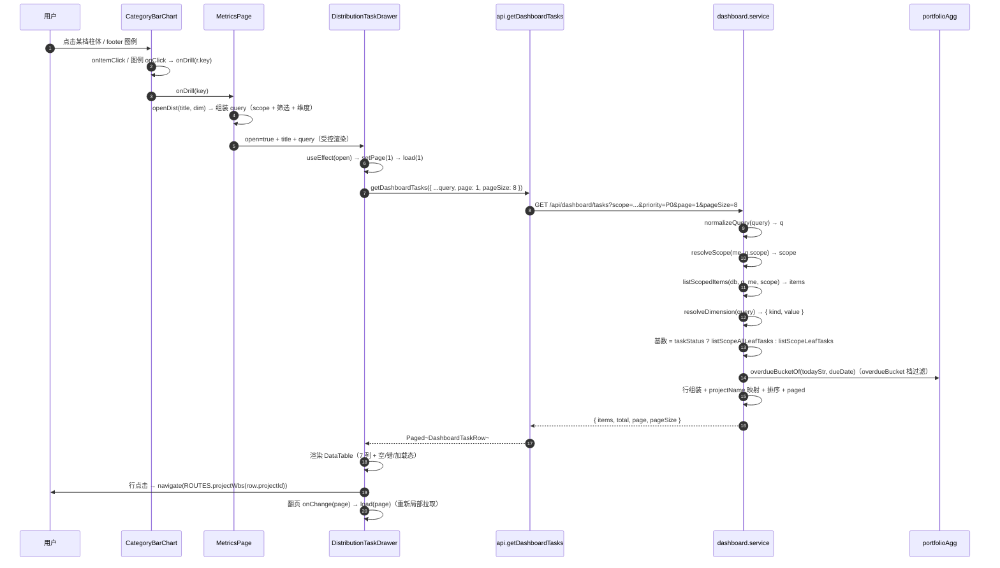

# B18 总览分布图点档下钻任务明细抽屉 — 架构设计（施工图）

> 文档类型：架构设计（施工图）
> 作者：架构（高见远）｜主理人：齐活林
> 项目盘址：`C:/Users/xuwen/WorkBuddy/AstrBytes/pm-app/`
> 对应 PRD：`docs/B18-PRD.md`（PM 许清楚）
> 技术栈：前端 Vite + React + TS + MUI + Tailwind + `@mui/x-charts` v7；后端 Node(Express) + better-sqlite3（真实 DB）
> 批次定位：**B17 之后首次新增 1 个后端接口**；零 schema 变更 / 零新依赖 / 零新路由文件 / 不新增其它接口
> 生成日期：2026-08-18

---

## 0. 变更清单（全量，12 改/建 + 13 只读核对）

| # | 文件 | 类型 | 改动点（一句话） |
|---|---|---|---|
| 1 | `server/lib/portfolioAgg.js` | 改 | 抽纯函数 `overdueBucketOf(todayStr, dueDate)`（`aggregateOverdueDuration` 重构为复用，行为不变）；导出 `PRIORITIES` / `DEFAULT_PRIORITY` / `overdueBucketOf` |
| 2 | `server/services/dashboard.service.js` | 改 | 新增 `OVERDUE_BUCKETS` 常量、`normalizePriorityValue`、`resolveDimension(query)`、`getDashboardTasks(db, query, me)`（复用 `normalizeQuery` / `resolveScope` / `listScopedItems` / `listScopeLeafTasks` / `listScopeAllLeafTasks`）；导出新增项 |
| 3 | `server/routes/dashboard.routes.js` | 改 | 同一 router 挂 `GET /dashboard/tasks`：`requireAuth` + `asyncHandler`，无角色守卫，返回 `ok(getDashboardTasks(...))` |
| 4 | `web/src/types/dashboard.ts` | 改 | 新增 `OverdueBucket` / `DashboardTasksQuery` / `DashboardTaskRow` 三个类型 |
| 5 | `web/src/api/contract.ts` | 改 | `ApiClient` 接口新增 `getDashboardTasks(query): Promise<Paged<DashboardTaskRow>>`（Mock / HTTP 签名一致） |
| 6 | `web/src/api/http.ts` | 改 | `HttpApiClient` 实现 `getDashboardTasks`（`GET /dashboard/tasks${qs(query)}`） |
| 7 | `web/src/api/mock/index.ts` | 改 | 新增 `getDashboardTasks` 双写（scope 解析 + 项目过滤 + `leafNodesOf` 判叶子 + 维度过滤 + 分页，复用 `dashboardAgg` 口径） |
| 8 | `web/src/utils/dashboardAgg.ts` | 改 | 新增前端纯函数 `overdueBucketOf(dueDate, todayStr?)`（镜像服务端，供 mock 过滤与 QA 断言） |
| 9 | `web/src/components/dashboard/CategoryBarChart.tsx` | 改 | props 新增可选 `onDrill?: (key: string) => void`：柱体 `onItemClick` + 图例 `onClick` 透传；不传 = 原行为（不可点） |
| 10 | `web/src/components/dashboard/DistributionTaskDrawer.tsx` | 新建 | 分布图下钻抽屉：props `{open,title,query,onClose}`，局部拉取 + 7 列 DataTable + 分页 + 行点击跳 WBS |
| 11 | `web/src/components/dashboard/index.ts` | 改 | barrel 追加导出 `DistributionTaskDrawer` 及类型 |
| 12 | `web/src/pages/MetricsPage.tsx` | 改 | ⑤⑥⑦ 三张 `CategoryBarChart` 接 `onDrill` → `openDist` 组装 query → 渲染 `DistributionTaskDrawer` |
| 13 | `server/config/enums.js` | 只读核对 | `TASK_STATUSES` 五档（待办/进行中/待评审/完成/阻塞）——任务状态维度白名单源 |
| 14 | `server/lib/dates.js` | 只读核对 | `today()` / `diffDays(a,b)=b-a`，逾期与分段唯一日期来源 |
| 15 | `server/lib/mappers.js` | 只读核对 | `toApiWbsNode` 已含 `id/projectId/wbsCode/name/priority/status/dueDate/progress/ownerName`（不含 `projectName`，需 service 补） |
| 16 | `server/lib/envelope.js` | 只读核对 | `ok` / `paged` / `asyncHandler` 三个工具签名 |
| 17 | `server/config/permissions.js` | 只读核对 | `'dashboard:global'` → admin/pmo/management，`canDo` 判定 all/mine |
| 18 | `server/routes/index.routes.js` | 只读核对 | `dashboard.routes` 已挂到根 router（`router.use(dashboardRoutes)`），新接口零注册改动 |
| 19 | `web/src/config/enums.ts` | 只读核对 | `PRIORITIES` / `PRIORITY_OPTIONS` / `normalizePriority`（脏值兜底 P2）/ `priorityRankOf` |
| 20 | `web/src/utils/date.ts` | 只读核对 | `today()` / `isOverdue` / `diffDays` / `fmtDate`（dayjs，与后端逐字一致） |
| 21 | `web/src/types/wbs.ts` | 只读核对 | `Priority` / `TaskStatus` 字面量类型 |
| 22 | `web/src/config/routes.ts` | 只读核对 | `ROUTES.projectWbs(id)` 已存在 |
| 23 | `web/src/hooks/useDashboardOverview.ts` | 只读核对 | 返回 `query`（受控筛选）与有效 `scope`（服务端降级后），`openDist` 取数来源 |
| 24 | `web/src/components/dashboard/ChartCard.tsx` | 只读核对 | `ChartLegendItem.onClick?` 已支持，`ChartLegend` 渲染 pointer + hover |
| 25 | `web/src/components/dashboard/MyTasksDrawer.tsx` / `OverdueTaskDrawer.tsx` | 只读核对 | 抽屉骨架（420px / 92vw / 关闭 IconButton / PAGE_SIZE=8）与局部拉取模式参考 |

复用红线（**不改**）：B17 三张分布图的数据 / 样式 / 空态（`MetricsPage` L229-265 的 `priorityRows` / `statusRows` / `durationRows` 构造不动，仅追加 `onDrill`）、健康环 / 状态环筛选、项目明细表、`OwnerLoadDrawer` / `OverdueTaskDrawer` / `MyTasksDrawer` 既有交互、`normalizeQuery`（保持 overview 零回归）、`web/src/api/http.ts#getDashboardOverview` 与 `mock/index.ts#getDashboardOverview`（内部逻辑不动，只新增姐妹方法）。

---

## 1. 后端设计

### 1.1 `server/lib/portfolioAgg.js` — 抽 `overdueBucketOf` 纯函数（行为不变）

**目标**：把 `aggregateOverdueDuration` 内联的分段逻辑（B17）抽成可复用的纯函数，让「聚合」与「tasks 接口按档过滤」共用同一处实现，杜绝分段漂移。

新增函数（放在 `aggregateOverdueDuration` 上方）：

```js
/**
 * 逾期时长档位（B17 · aggregateOverdueDuration 分段口径的纯函数化）。
 * 入参 = 今天与截止日；返回该任务所属档位；未逾期（含今天到期）/ 无 dueDate / 非法日期 → null。
 * days = diffDays(dueDate, today)（diffDays(a,b) = b - a）；
 * 逾期（dueDate < today）时 days ≥ 1；分段 1–7 / 8–30 / ≥31。
 * @param {string} todayStr `YYYY-MM-DD`
 * @param {string|null|undefined} dueDate `YYYY-MM-DD`
 * @returns {'1to7'|'8to30'|'over30'|null}
 */
function overdueBucketOf(todayStr, dueDate) {
  const due = String(dueDate === null || dueDate === undefined ? '' : dueDate);
  if (!due) return null;
  const days = dates.diffDays(due, todayStr); // diffDays(a,b) = b - a
  if (days < 1) return null;                  // 未逾期（含今天到期 / dueDate > today）
  if (days <= 7) return '1to7';
  if (days <= 30) return '8to30';
  return 'over30';
}
```

- `days < 1 → null` 与既有 `isOverdue`（`diffDays(today, due) < 0`，即 due < today）逐字等价：due === today 时 `days = 0`，due > today 时 `days < 0`，均非逾期；非法日期 `diffDays` 返回 0 → null。QA 可直接对裸日期断言。

重构 `aggregateOverdueDuration`（返回结构 / 计数逐字不变，B17 回归零风险）：

```js
function aggregateOverdueDuration(tasks, todayStr) {
  const t = todayStr || dates.today();
  const dist = { days1to7: 0, days8to30: 0, daysOver30: 0, total: 0 };
  asArray(tasks).forEach(function (n) {
    const bucket = overdueBucketOf(t, n && n.dueDate);
    if (!bucket) return;
    if (bucket === '1to7') dist.days1to7 += 1;
    else if (bucket === '8to30') dist.days8to30 += 1;
    else dist.daysOver30 += 1;
    dist.total += 1;
  });
  return dist;
}
```

module.exports 追加（既有导出保持不动）：

```js
module.exports = {
  // ...既有导出
  PRIORITIES,          // ['P0','P1','P2','P3']（供 service 归一入参，与 aggregatePriorityDist 同源）
  DEFAULT_PRIORITY,    // 'P2'
  overdueBucketOf,
};
```

### 1.2 `server/services/dashboard.service.js` — 新增 `getDashboardTasks`（核心）

**新增常量**（放 `MANAGED_STATUSES` 附近）：

```js
/** B18：逾期档位白名单（与 portfolioAgg.overdueBucketOf 返回值逐字一致） */
const OVERDUE_BUCKETS = ['1to7', '8to30', 'over30'];
```

**新增内部工具**（放 `resolveScope` 附近）：

```js
/**
 * 优先级归一（P0-P3 白名单，脏值兜底 P2）。
 * 与 portfolioAgg.aggregatePriorityDist / wbs.service 优先级口径逐字一致（PRD P0-3）。
 * @param {*} raw
 * @returns {string}
 */
function normalizePriorityValue(raw) {
  const v = String(raw === null || raw === undefined ? '' : raw).trim().toUpperCase();
  return agg.PRIORITIES.indexOf(v) >= 0 ? v : agg.DEFAULT_PRIORITY;
}

/**
 * 解析 B18 维度过滤参数（三选一互斥 · PRD P0-6）。
 * 顺序：taskStatus → overdueBucket → priority，只取第一个**合法**维度生效，其余忽略。
 * - taskStatus：白名单 enums.TASK_STATUSES；非法 → 视为未传，继续看下一维度。
 * - overdueBucket：白名单 OVERDUE_BUCKETS；非法 → 视为未传，继续看下一维度。
 * - priority：P0-P3 白名单，**非法值（P9 / 空串 / 小写）兜底归一为 P2**（等价传 P2，
 *   与 aggregatePriorityDist 脏值兜底一致）；未传（undefined/null）→ 不按优先级过滤。
 * 注意：本函数读**原始 query**（normalizeQuery 不保留这三个字段），normalizeQuery 零改动。
 * @param {object} query 原始 req.query
 * @returns {{kind: 'taskStatus'|'overdueBucket'|'priority'|'none', value: string}}
 */
function resolveDimension(query) {
  const raw = query && typeof query === 'object' ? query : {};
  if (enums.TASK_STATUSES.indexOf(raw.taskStatus) >= 0) {
    return { kind: 'taskStatus', value: String(raw.taskStatus) };
  }
  if (OVERDUE_BUCKETS.indexOf(raw.overdueBucket) >= 0) {
    return { kind: 'overdueBucket', value: String(raw.overdueBucket) };
  }
  if (raw.priority !== undefined && raw.priority !== null) {
    return { kind: 'priority', value: normalizePriorityValue(raw.priority) };
  }
  return { kind: 'none', value: '' };
}
```

**新增主函数**（放在 `getDashboardOverview` 之后）：

```js
/**
 * B18：分布图点档下钻任务明细（GET /api/dashboard/tasks）。
 *
 * 与 getDashboardOverview 同源同口径：
 *  - normalizeQuery / resolveScope / listScopedItems 全部复用（scope / 筛选 / 决策 ⑥ / 权限降级逐字一致；
 *    q.sort 忽略，本接口排序固定）；
 *  - 行字段 = toApiWbsNode 派生 + projectName 映射补齐（缺失回落 UNNAMED_PROJECT）。
 *
 * 基数规则（PRD P0-6）：
 *  - taskStatus 命中 → 范围内**全量叶子（含已完成）**（listScopeAllLeafTasks）——「完成」档可出数；
 *  - 否则 → 范围内**在办叶子**（listScopeLeafTasks），再按 priority / overdueBucket 过滤；
 *  - 均未传维度 → 返回范围内全部在办叶子任务分页。
 *
 * @param {import('better-sqlite3').Database} db
 * @param {object} query req.query（DashboardTasksQuery）
 * @param {object} me users 行（requireAuth 挂载）
 * @returns {{items: Array<object>, total: number, page: number, pageSize: number}}
 */
function getDashboardTasks(db, query, me) {
  const q = normalizeQuery(query);
  const scope = resolveScope(me, q.scope);
  const todayStr = dates.today();

  const items = listScopedItems(db, q, me, scope);  // ProjectListItem[]（含 name）
  const projectIds = items.map(function (p) { return String(p.id); });

  const dim = resolveDimension(query);              // { kind, value }

  /* 基数：taskStatus → 全量叶子（含已完成）；否则 → 在办叶子 */
  const base = dim.kind === 'taskStatus'
    ? listScopeAllLeafTasks(db, projectIds)
    : listScopeLeafTasks(db, projectIds);

  /* projectId → projectName（范围内项目名，缺失回落未命名项目） */
  const nameById = {};
  items.forEach(function (p) { nameById[String(p.id)] = String(p.name || '') || agg.UNNAMED_PROJECT; });

  const rows = base
    .filter(function (n) {
      if (dim.kind === 'taskStatus') return n.status === dim.value;
      if (dim.kind === 'priority') return normalizePriorityValue(n.priority) === dim.value;
      if (dim.kind === 'overdueBucket') return agg.overdueBucketOf(todayStr, n.dueDate) === dim.value;
      return true;
    })
    .map(function (n) {
      return {
        id: n.id,
        projectId: n.projectId,
        projectName: nameById[String(n.projectId)] || agg.UNNAMED_PROJECT,
        wbsCode: n.wbsCode,
        name: n.name,
        priority: normalizePriorityValue(n.priority),
        status: n.status,
        dueDate: n.dueDate,
        progress: n.progress,
        ownerName: n.ownerName || '',
      };
    })
    .sort(function (a, b) {
      /* 排序固定（PRD P0-8）：优先级 P0→P3 → 截止日升序（空 dueDate 恒最后）→ 名称升序 */
      const RANK = { P0: 0, P1: 1, P2: 2, P3: 3 };
      const ra = RANK[a.priority] !== undefined ? RANK[a.priority] : 2; // 防御：脏值按 P2
      const rb = RANK[b.priority] !== undefined ? RANK[b.priority] : 2;
      if (ra !== rb) return ra - rb;
      const da = String(a.dueDate || '');
      const dbv = String(b.dueDate || '');
      if (!da !== !dbv) return da ? -1 : 1;        // 无截止日恒最后
      if (da !== dbv) return da < dbv ? -1 : 1;
      return agg.compareText(a.name, b.name);
    });

  const start = (q.page - 1) * q.pageSize;
  return paged(rows.slice(start, start + q.pageSize), rows.length, q.page, q.pageSize);
}
```

实现要点：
- `normalizeQuery` 已归一 `page≥1`、`pageSize 1..200 默认 20`、`onlyMine`、`scope/type/status/health/keyword`（`status` 仍只认在管三态 = 项目状态过滤，与任务级 `taskStatus` 维度是两个概念）；`sort` 在本接口被忽略。
- 行字段顺序与 PRD P0-7 完全一致；`ownerName` 空串留给前端渲染兜底（`'未分配'`）。
- 稳定性：排序三段 tie-break 全确定性，同数据翻页不跳行不重复。
- 口径守恒（QA 可断言，同一 scope/筛选/同一时刻）：`priority=Px total = priorityDist[Px]`；`taskStatus=S total = statusDist[S]`；`overdueBucket=B total = overdueDuration.days*`；三桶 total 之和 = `stats.overdueTasks`。三条等式成立的原因：行过滤与 `aggregatePriorityDist` / `aggregateStatusDist` / `aggregateOverdueDuration` 使用**同一基数 + 同一归一/分段函数**（priority 共用 `normalizePriorityValue` 语义、taskStatus 白名单同 `enums.TASK_STATUSES`、overdueBucket 共用 `overdueBucketOf`）。

module.exports 追加：

```js
module.exports = {
  // ...既有导出
  OVERDUE_BUCKETS,
  resolveDimension,
  getDashboardTasks,
};
```

### 1.3 `server/routes/dashboard.routes.js` — 挂新接口

在既有 `GET /dashboard/overview` 之后、`module.exports` 之前追加：

```js
router.get(
  '/dashboard/tasks',
  requireAuth,
  asyncHandler(async function getDashboardTasks(req, res) {
    res.json(ok(dashboardService.getDashboardTasks(db, req.query, req.user)));
  }),
);
```

- 鉴权模式与 overview 完全一致：只用 `requireAuth`，**不加角色守卫**；「能不能看公司全量」由 `resolveScope` 内部按 `dashboard:global` 判定，无权限者静默降级 `scope=mine`（不抛 403）。
- 零新路由文件（挂在既有 `dashboard.routes.js`，`index.routes.js` 已 `router.use(dashboardRoutes)`，零改动）。

---

## 2. 前端设计

### 2.1 `web/src/types/dashboard.ts` — 新增 3 个类型

放在文件尾部（B13 区块之后）：

```ts
/* ==========================================================================
 * B18 · 分布图点档下钻任务明细抽屉
 * 点击优先级 / 状态 / 逾期时长分布图某档 → 右侧抽屉展示该档任务明细。
 * 对应后端接口 `GET /api/dashboard/tasks`（本批唯一新接口）。
 * ========================================================================== */

/** 逾期档位字面量（与服务端 portfolioAgg.overdueBucketOf 返回一致） */
export type OverdueBucket = '1to7' | '8to30' | 'over30';

/**
 * 任务明细抽屉查询入参：总览筛选子集 + 维度参数（三选一互斥）+ 分页。
 * 不含 overview 的 timeRange / sort（服务端忽略）；page/pageSize 由抽屉内部追加。
 */
export interface DashboardTasksQuery {
  scope?: DashboardScope;
  type?: ProjectType | '';
  status?: ProjectStatus | '';
  health?: Health | '';
  keyword?: string;
  onlyMine?: boolean;
  /** 维度：优先级（P0-P3；脏值由服务端兜底 P2） */
  priority?: Priority;
  /** 维度：任务状态（五档；命中时基数含已完成） */
  taskStatus?: TaskStatus;
  /** 维度：逾期档位（1to7 / 8to30 / over30） */
  overdueBucket?: OverdueBucket;
  page?: number;
  pageSize?: number;
}

/** 任务明细抽屉表格行（服务端返回字段，与 PRD P0-7 逐字一致） */
export interface DashboardTaskRow {
  id: string;
  projectId: string;
  projectName: string;
  wbsCode: string;
  name: string;
  priority: Priority;
  status: TaskStatus;
  dueDate: string;
  progress: number;
  ownerName: string;
}
```

- 文件头部已有 `import type { Priority, TaskStatus } from '@/types/wbs';`（L11），无需新增 import。

### 2.2 `web/src/api/contract.ts` — 接口契约

- import 追加：`DashboardTasksQuery, DashboardTaskRow` 并入 `@/types/dashboard` 的导入列表。
- `ApiClient` 接口内、`getDashboardOverview` 之后追加：

```ts
  /**
   * B18：分布图点档下钻任务明细（`GET /api/dashboard/tasks`）。
   * 与 overview 同 scope/过滤口径；维度参数三选一互斥（taskStatus → overdueBucket → priority）。
   */
  getDashboardTasks(query: DashboardTasksQuery): Promise<Paged<DashboardTaskRow>>;
```

### 2.3 `web/src/api/http.ts` — HTTP 实现

`HttpApiClient` 内、`getDashboardOverview` 之后追加：

```ts
  getDashboardTasks(query: DashboardTasksQuery): Promise<Paged<DashboardTaskRow>> {
    /* qs 跳过 undefined / null / ''，未选中的维度参数不污染 URL；语义与服务端一致 */
    return get<Paged<DashboardTaskRow>>(`/dashboard/tasks${qs(query as Record<string, unknown>)}`);
  }
```

### 2.4 `web/src/utils/dashboardAgg.ts` — 新增 `overdueBucketOf`（前端镜像）

文件尾部（`aggregateOverdueDuration` 之后）追加，镜像服务端 `portfolioAgg.overdueBucketOf`：

```ts
/**
 * 逾期档位（B18 · 镜像 server/lib/portfolioAgg.js#overdueBucketOf）。
 * 入参 = 截止日（+ 可选 todayStr）；未逾期（含今天到期）/ 无 dueDate → null。
 * days = diffDays(dueDate, todayStr)；分段 1–7 / 8–30 / ≥31。
 * 供 mock 按档过滤与 QA 断言，杜绝前后端分段漂移。
 */
export function overdueBucketOf(
  dueDate: string | null | undefined,
  todayStr: string = today(),
): OverdueBucket | null {
  if (!dueDate) return null;
  const days = diffDays(dueDate, todayStr);
  if (days < 1) return null;
  if (days <= 7) return '1to7';
  if (days <= 30) return '8to30';
  return 'over30';
}
```

- type import 追加 `OverdueBucket`（`@/types/dashboard`）。
- 保持文件「零 React 依赖」纯函数约束（仅依赖 `utils/date` / `config/enums` / `types`）。

### 2.5 `web/src/components/dashboard/CategoryBarChart.tsx` — 加 `onDrill`

**props 追加**（`CategoryBarChartProps` 尾部）：

```ts
  /**
   * 点击某档柱体或 footer 图例触发，参数 = 该档 key（如 'P0' / '进行中' / '8to30'）。
   * 0 值档也可点（图例点击，打开空态抽屉）；**不传则不可点（原行为）**。
   */
  onDrill?: (key: string) => void;
```

**实现改动 3 处**（组件函数体内）：
1. 绘图区 Box：`sx={{ width: '100%', height: CHART_BODY_HEIGHT, cursor: onDrill ? 'pointer' : 'default' }}`（参照 `OwnerLoadBarChart` L93）。
2. `BarChart` 追加 `onItemClick`（参照 `OwnerLoadBarChart` L101-108）：

```tsx
onItemClick={
  onDrill
    ? (_event, identifier) => {
        const r = list[identifier.dataIndex];
        if (r) onDrill(r.key);
      }
    : undefined
}
```

3. footer `ChartLegend` items 透传 `onClick`（`ChartLegendItem` 已支持，0 值档也渲染可点）：

```tsx
<ChartLegend
  items={list.map((r) => ({
    color: r.color,
    label: r.label,
    value: r.value,
    onClick: onDrill ? () => onDrill(r.key) : undefined,
  }))}
/>
```

- 缺省行为红线：`onDrill` 未传时 `cursor: 'default'`、`onItemClick: undefined`、图例 `onClick: undefined` —— 与 B17 逐字一致。
- 顶部 import 禁令注释（禁止 `tokens` / `alphaOf` / `colorOf`）保持不动。

### 2.6 `web/src/components/dashboard/DistributionTaskDrawer.tsx` — 新建

**Props 最终签名**：

```tsx
export interface DistributionTaskDrawerProps {
  /** 是否打开 */
  open: boolean;
  /** 头部标题（如「P0 任务明细」「进行中任务明细」「逾期 8–30 天任务明细」） */
  title: string;
  /** 维度参数 + 总览筛选上下文（不含 page/pageSize，由抽屉内部追加） */
  query: DashboardTasksQuery;
  /** 关闭抽屉（遮罩 / × / ESC） */
  onClose: () => void;
}
```

**State / 数据流**（局部拉取模式，同 `OverdueTaskDrawer`；不写全局 store，关闭即丢弃）：

```tsx
const PAGE_SIZE = 8;                       // 沿用抽屉惯例（MyTasksDrawer / OverdueTaskDrawer 同值）
const [rows, setRows] = useState<DashboardTaskRow[]>([]);
const [total, setTotal] = useState(0);
const [page, setPage] = useState(1);
const [loading, setLoading] = useState(false);
const [error, setError] = useState<string | null>(null);

const load = useCallback(async (pageToLoad: number): Promise<void> => {
  setLoading(true);
  setError(null);
  try {
    const res = await api.getDashboardTasks({ ...query, page: pageToLoad, pageSize: PAGE_SIZE });
    setRows(res.items);
    setTotal(res.total);
  } catch (e) {
    setError(e instanceof Error ? e.message : '加载失败，请重试');
  } finally {
    setLoading(false);
  }
}, [query]);

/* 打开时复位到第 1 页并拉取；query 变化（重新点档位）也重新拉取 */
useEffect(() => {
  if (!open) return;
  setPage(1);
  void load(1);
}, [open, query, load]);
```

**UI 结构**（骨架复用 `MyTasksDrawer` / `OverdueTaskDrawer`）：
- `<Drawer anchor="right" open={open} onClose={onClose}>` → 内容区 `Box` `sx={{ width: 420, maxWidth: '92vw', p: 2.5, display: 'flex', flexDirection: 'column', height: '100%' }}`。
- 头部：`title`（`subtitle1` noWrap）+ 副标题（`caption`，`共 {total} 个任务`，P1-3 可选追加 `第 {1+(page-1)*PAGE_SIZE}-{Math.min(page*PAGE_SIZE,total)} / 共 {total} 条`）+ 关闭 `IconButton`（CloseIcon，`aria-label="关闭"`）。
- 表格区 `<Box sx={{ flex: 1, minHeight: 0, overflowX: 'auto' }}>`：`error` 时渲染 `<ErrorState error={error} onRetry={() => void load(page)} />`；否则 `<DataTable<DashboardTaskRow> ... />`。

**列定义（7 列，顺序 = 优先级 / 任务 / 项目名 / 负责人 / 截止日 / 状态 / 进度）**：

```tsx
const columns = useMemo<Array<Column<DashboardTaskRow>>>(() => [
  { key: 'priority', label: '优先级', width: 62,
    render: (r) => <PriorityChip priority={normalizePriority(r.priority)} /> },
  { key: 'name', label: '任务',
    render: (r) => (
      <Typography sx={{ fontSize: 13, fontWeight: 600 }} noWrap>
        {r.wbsCode ? `${r.wbsCode} ` : ''}{r.name}
      </Typography>
    ) },
  { key: 'projectName', label: '项目名', width: 110, hideOnMobile: true,
    render: (r) => (
      <Typography sx={{ fontSize: 13 }} color="text.secondary" noWrap>
        {r.projectName || UNNAMED_PROJECT}
      </Typography>
    ) },
  { key: 'ownerName', label: '负责人', width: 66,
    render: (r) => (
      <Typography sx={{ fontSize: 13 }} color="text.secondary" noWrap>
        {r.ownerName || '未分配'}
      </Typography>
    ) },
  { key: 'dueDate', label: '截止日', width: 96,
    render: (r) => (
      <Typography
        sx={{ fontSize: 13, color: isOverdue(r.dueDate) ? 'error.main' : 'text.secondary' }}
        noWrap
      >
        {fmtDate(r.dueDate)}
        {isOverdue(r.dueDate) ? ' · 已逾期' : ''}
      </Typography>
    ) },
  { key: 'status', label: '状态', width: 70,
    render: (r) => <StatusChip status={r.status} /> },
  { key: 'progress', label: '进度', width: 88,
    render: (r) => <ProgressBar value={r.progress} tone={isOverdue(r.dueDate) ? 'danger' : 'brand'} /> },
], []);
```

**DataTable 关键 props**：
- `rows={rows}`、`rowKey={(r) => r.id}`、`loading={loading}`、`dense`。
- 空态（P1-1 正向文案）：`emptyTitle={overdueBucket 维度 ? '太好了，没有该档逾期任务 🎉' : '当前范围暂无该档任务'}`、`emptyDescription="试试调整总览筛选或切换范围"`（判定 `query.overdueBucket` 是否存在即可，可选微调）。
- 行点击：`onRowClick={(row) => navigate(ROUTES.projectWbs(row.projectId))}`。
- 分页（服务端分页）：`total > PAGE_SIZE` 时启用：

```tsx
pagination={
  total > PAGE_SIZE
    ? { page, pageSize: PAGE_SIZE, total, onChange: (p: number) => { setPage(p); void load(p); } }
    : undefined
}
```

**import 清单**：`useCallback/useEffect/useState/useMemo`、`useNavigate`、MUI `Box/Drawer/IconButton/Stack/Typography`、`CloseIcon`、`DataTable/PriorityChip/ProgressBar/StatusChip/ErrorState`（`@/components/common`）、`Column` 类型、`api`（`@/api/client`）、`ROUTES`、`normalizePriority`（`@/config/enums`）、`UNNAMED_PROJECT`（`@/utils/dashboardAgg`）、`fmtDate/isOverdue`（`@/utils/date`）、`DashboardTaskRow/DashboardTasksQuery`（`@/types/dashboard`）。

### 2.7 `web/src/components/dashboard/index.ts` — barrel 追加

```ts
export { DistributionTaskDrawer } from './DistributionTaskDrawer';
export type { DistributionTaskDrawerProps } from './DistributionTaskDrawer';
```

### 2.8 `web/src/pages/MetricsPage.tsx` — 3 图接线

**改动 1：import 追加。**

```tsx
import { ..., DistributionTaskDrawer, CategoryBarChart, ... } from '@/components/dashboard';
// type import 追加：
import type { DashboardTasksQuery, OverdueBucket } from '@/types/dashboard';
import type { Priority, TaskStatus } from '@/types/wbs';   // 若尚未导入
```

**改动 2：抽屉 state + openDist（组件函数体内，紧邻 `ovDrawer` state 之后）。**

```tsx
/* B18：分布图点档下钻抽屉（受控组件，query 存 state 保证身份稳定） */
const [distDrawer, setDistDrawer] = useState<{
  open: boolean;
  title: string;
  query: DashboardTasksQuery;
}>({ open: false, title: '', query: {} });

const openDist = (
  title: string,
  dim: Partial<Pick<DashboardTasksQuery, 'priority' | 'taskStatus' | 'overdueBucket'>>,
): void => {
  const base: DashboardTasksQuery = {
    scope,                              // 有效 scope（服务端降级后）
    type: query.type ?? '',
    status: query.status ?? '',
    health: query.health ?? '',
    keyword: query.keyword ?? '',
    onlyMine: query.onlyMine ?? false,
  };
  setDistDrawer({ open: true, title, query: { ...base, ...dim } });
};
```

**改动 3：逾期时长 key 映射表（模块级常量，放 `rateTone` 附近）。**

```tsx
/** B18：逾期时长图 key（days1to7/days8to30/daysOver30）→ 接口档位 / 抽屉标题 */
const DURATION_KEY_TO_BUCKET: Record<string, OverdueBucket> = {
  days1to7: '1to7',
  days8to30: '8to30',
  daysOver30: 'over30',
};
const DURATION_TITLE: Record<string, string> = {
  days1to7: '逾期 1–7 天任务明细',
  days8to30: '逾期 8–30 天任务明细',
  daysOver30: '逾期 >30 天任务明细',
};
```

**改动 4：⑤⑥⑦ 三张图追加 `onDrill`（其余 props / rows 构造逐字不动）。**

```tsx
// ⑤ 任务优先级分布
<CategoryBarChart
  title="任务优先级分布"
  subtitle={`共 ${data?.priorityDist.total ?? 0} 个未完成任务`}
  rows={priorityRows}
  loading={loading}
  emptyTitle="暂无进行中的任务"
  emptyDescription="没有需要按优先级排期的任务"
  onDrill={(key) => openDist(`${key} 任务明细`, { priority: key as Priority })}
/>

// ⑥ 任务状态分布
<CategoryBarChart
  title="任务状态分布"
  subtitle={`共 ${data?.statusDist.total ?? 0} 个任务（含已完成）`}
  rows={statusRows}
  loading={loading}
  emptyTitle="当前范围暂无任务"
  onDrill={(key) => openDist(`${key}任务明细`, { taskStatus: key as TaskStatus })}
/>

// ⑦ 逾期时长分段
<CategoryBarChart
  title="逾期时长分段"
  subtitle={`共 ${data?.overdueDuration.total ?? 0} 个逾期任务`}
  rows={durationRows}
  loading={loading}
  emptyTitle="太好了，没有逾期任务 🎉"
  emptyDescription="所有任务都在计划节奏内"
  onDrill={(key) => openDist(DURATION_TITLE[key] ?? `${key} 任务明细`, { overdueBucket: DURATION_KEY_TO_BUCKET[key] })}
/>
```

**改动 5：渲染抽屉（放在既有两个抽屉之后）。**

```tsx
<DistributionTaskDrawer
  open={distDrawer.open}
  title={distDrawer.title}
  query={distDrawer.query}
  onClose={() => setDistDrawer((s) => ({ ...s, open: false }))}
/>
```

- 标题格式严格按 PRD：优先级「`{key} 任务明细`」（如「P0 任务明细」）、状态「`{key}任务明细`」（如「进行中任务明细」）、逾期时长取 `DURATION_TITLE`（「逾期 8–30 天任务明细」）。
- P1-2 行为天然满足：`openDist` 在总览 `loading` 时也可调用（`query` 始终是最近一次受控上下文），点档位立即开抽屉并局部拉取。
- 原 4 图（①状态环 / ②健康环 / ③逾期柱 / ④负荷柱）props 逐字不动。

### 2.9 `web/src/api/mock/index.ts` — `getDashboardTasks` 双写

**改动 1：import 追加。**

```ts
// @/types/dashboard 导入列表追加：
import type { ..., DashboardTasksQuery, DashboardTaskRow, OverdueBucket } from '@/types/dashboard';
// @/utils/dashboardAgg 导入追加：
import { ..., overdueBucketOf } from '@/utils/dashboardAgg';
// @/config/enums 导入追加：
import { ..., TASK_STATUSES } from '@/config/enums';
```

**改动 2：新增方法（放在 `getDashboardOverview` 之后）。**

```ts
  /**
   * B18：分布图点档下钻任务明细（对应 `GET /api/dashboard/tasks`）。
   * 与服务端 getDashboardTasks 逐字对齐：
   *  - 步骤 1-2（范围 + 项目过滤）与上方 getDashboardOverview 同口径（mock 手工双写惯例，逐字拷贝）；
   *  - 维度三选一互斥（taskStatus → overdueBucket → priority），优先级脏值兜底 P2；
   *  - taskStatus 命中基数 = 全量叶子（含已完成），否则 = 在办叶子；
   *  - 行 = WbsNode 字段 + projectName 映射；排序 优先级 → 截止日 → 名称；分页返回 { items, total, page, pageSize }。
   */
  async getDashboardTasks(query: DashboardTasksQuery): Promise<Paged<DashboardTaskRow>> {
    await delay(200);
    const db = getDb();
    const me = currentUser(db);

    /* 1. 范围解析（与服务端 resolveScope 同口径） */
    const canSeeAll = canDo(me.globalRole, 'dashboard:global');
    const scope: DashboardScope = canSeeAll ? (query.scope === 'mine' ? 'mine' : 'all') : 'mine';

    const page = Math.max(1, Number(query.page) || 1);
    const pageSize = Math.min(DASHBOARD_MAX_PAGE_SIZE, Math.max(1, Number(query.pageSize) || DASHBOARD_PAGE_SIZE));

    /* 2. 项目范围（决策 ⑥ 三态基线 + scope + 过滤，与 getDashboardOverview 步骤 1-2 逐字一致） */
    const statusFilter =
      query.status && DASHBOARD_MANAGED_STATUSES.includes(query.status) ? query.status : '';
    const myProjectIds = new Set(
      db.members.filter((m) => m.userOpenId === me.openId).map((m) => m.projectId),
    );
    const myPmProjectIds = new Set(
      db.members
        .filter((m) => m.userOpenId === me.openId && m.projectRole === 'pm')
        .map((m) => m.projectId),
    );
    let items = db.projects
      .filter((p) =>
        statusFilter ? p.status === statusFilter : DASHBOARD_MANAGED_STATUSES.includes(p.status),
      )
      .filter((p) => {
        if (scope === 'all') return true;
        return query.onlyMine ? myPmProjectIds.has(p.id) : myProjectIds.has(p.id);
      })
      .map((p) => toListItem(db, p));
    if (query.type) items = items.filter((r) => r.type === query.type);
    if (query.health) items = items.filter((r) => r.health === query.health);
    if (query.keyword) {
      const k = query.keyword.trim().toLowerCase();
      if (k) {
        items = items.filter(
          (r) =>
            r.name.toLowerCase().includes(k) ||
            r.code.toLowerCase().includes(k) ||
            r.customer.toLowerCase().includes(k),
        );
      }
    }

    /* 3. 维度解析（三选一互斥；priority 脏值兜底 P2 —— normalizePriority('')→P2 与服务端一致） */
    const dim: { kind: 'taskStatus' | 'overdueBucket' | 'priority' | 'none'; value: string } = {
      kind: 'none',
      value: '',
    };
    if (query.taskStatus && TASK_STATUSES.includes(query.taskStatus)) {
      dim.kind = 'taskStatus';
      dim.value = query.taskStatus;
    } else if (query.overdueBucket && (query.overdueBucket === '1to7' || query.overdueBucket === '8to30' || query.overdueBucket === 'over30')) {
      dim.kind = 'overdueBucket';
      dim.value = query.overdueBucket;
    } else if (query.priority !== undefined && query.priority !== null) {
      dim.kind = 'priority';
      dim.value = normalizePriority(query.priority);
    }

    /* 4. 叶子任务基数 + 维度过滤 + 行组装（projectName 映射补齐） */
    const scopeIds = new Set(items.map((p) => p.id));
    const projectNameById = new Map(db.projects.map((p) => [p.id, p.name]));
    const userNameById = new Map(db.users.map((u) => [u.openId, u.name]));
    const allLeafTasks = leafNodesOf(db.wbsNodes.filter((n) => scopeIds.has(n.projectId)));
    const base = dim.kind === 'taskStatus'
      ? allLeafTasks
      : allLeafTasks.filter((n) => n.status !== '完成');

    const rows: DashboardTaskRow[] = base
      .filter((n) => {
        if (dim.kind === 'taskStatus') return n.status === dim.value;
        if (dim.kind === 'priority') return normalizePriority(n.priority) === dim.value;
        if (dim.kind === 'overdueBucket') return overdueBucketOf(n.dueDate) === dim.value;
        return true;
      })
      .map((n) => ({
        id: n.id,
        projectId: n.projectId,
        projectName: projectNameById.get(n.projectId) ?? DASHBOARD_UNNAMED_PROJECT,
        wbsCode: n.wbsCode,
        name: n.name,
        priority: normalizePriority(n.priority),
        status: n.status,
        dueDate: n.dueDate,
        progress: Number(n.progress) || 0,
        ownerName: n.ownerName ?? userNameById.get(n.owner ?? '') ?? '',
      }))
      .sort((a, b) => {
        const RANK: Record<string, number> = { P0: 0, P1: 1, P2: 2, P3: 3 };
        const ra = RANK[a.priority] ?? 2;
        const rb = RANK[b.priority] ?? 2;
        if (ra !== rb) return ra - rb;
        const da = a.dueDate || '';
        const dbv = b.dueDate || '';
        if (!da !== !dbv) return da ? -1 : 1;
        if (da !== dbv) return da < dbv ? -1 : 1;
        return a.name.localeCompare(b.name, 'zh-CN');
      });

    /* 5. 分页返回（与服务端 envelope.paged 同构） */
    return deepClone({
      items: rows.slice((page - 1) * pageSize, page * pageSize),
      total: rows.length,
      page,
      pageSize,
    });
  }
```

- 口径对齐说明：mock 与后端共用「isOverdue / 分段 / 优先级归一 / 在办 = 非完成」同源判定（前端 dayjs / 后端 dates 逐字一致），因此三条 QA 断言等式在 mock 内同样成立。
- `TASK_STATUSES` / `normalizePriority` / `DASHBOARD_UNNAMED_PROJECT` / `DASHBOARD_MAX_PAGE_SIZE` / `DASHBOARD_PAGE_SIZE` 均为 mock 既有常量或新增 import；`overdueBucketOf` 为 `dashboardAgg` 新增纯函数。

---

## 3. 口径与 RBAC 说明（QA 断言依据）

**RBAC（与 overview 完全一致）**
- 路由层：`requireAuth` 即可，不加角色守卫；未登录 → 401。
- 数据范围：`resolveScope(me, q.scope)` 内部按 `canDo(role, 'dashboard:global')` 判定（admin/pmo/management 可 all/mine 切换；其余角色强制 `mine`，传 `all` 也不抛 403）。
- `mine` 内再用 `onlyMine` 细分「我参与的（false）/ 我负责的 PM（true）」，与服务端 `listScopedItems` 的 EXISTS 子查询同源。

**口径（与 overview / B17 三图逐字一致）**
- 日期：`server/lib/dates`（`today()` / `diffDays(a,b)=b-a`）与 `web/src/utils/date`（dayjs）逐字一致；逾期 = `diffDays(today, dueDate) < 0`（空 dueDate 恒 false）。
- 优先级：P0-P3 白名单；入参脏值（P9 / 空串 / 小写）兜底归一为 P2（等价传 P2）；行匹配 `normalizePriority(node.priority) === 归一后参数`；排序权重 P0→P3。
- 任务状态：白名单 `enums.TASK_STATUSES`（待办/进行中/待评审/完成/阻塞）；非法入参 → 视为未传（不过滤）；命中时基数 = 全量叶子（含已完成）。
- 逾期档位：白名单 `1to7 / 8to30 / over30`；分段由 `portfolioAgg.overdueBucketOf`（前端镜像 `dashboardAgg.overdueBucketOf`）单一实现，与 `aggregateOverdueDuration` 共用，杜绝漂移。
- 项目状态入参 `status`（在管三态，决策 ⑥）是**项目级**过滤，与任务级 `taskStatus` 维度是两个独立参数；`normalizeQuery` 对 `status` 的处理零改动。

**QA 断言等式（同一 scope / 同一筛选 / 同一时刻，经 `GET /api/dashboard/tasks` 与 `GET /api/dashboard/overview` 各自独立计算）**
1. `priority=Px` 的 `total` = overview `priorityDist[Px]`（P0/P1/P2/P3 各档；`priority=P9` 等价 `priority=P2`）。
2. `taskStatus=S` 的 `total` = overview `statusDist[S]`（S ∈ 五档；`taskStatus=完成` 能出数）。
3. `overdueBucket=B` 的 `total` = overview `overdueDuration.days*`（`1to7→days1to7`、`8to30→days8to30`、`over30→daysOver30`）。
4. 三个 `overdueBucket` 的 `total` 之和 = overview `stats.overdueTasks`（= `countOverdueTasks`）。
5. 非法 `taskStatus` / `overdueBucket` 入参 → 不过滤（返回范围内全部在办叶子分页）；非法 `priority` → 等价 P2。
6. 返回体 `{ items, total, page, pageSize }`；每行含 `id/projectId/projectName/wbsCode/name/priority/status/dueDate/progress/ownerName`；`projectName` 缺失回落「未命名项目」；`page≥1`、`pageSize 1..200 默认 20`。

---

## 4. 复用红线（工程师实现时逐条自查）

1. B17 三张分布图的数据 / 样式 / 空态不动：`MetricsPage` 中 `priorityRows` / `statusRows` / `durationRows` 构造、`CategoryBarChart` 的 title/subtitle/rows/loading/emptyTitle/emptyDescription 全部保留，仅追加 `onDrill`。
2. `CategoryBarChart` 不传 `onDrill` 时 = 原行为（不可点）；`ChartCard` / `ChartLegend` / `CHART_BODY_HEIGHT` 零改动。
3. 健康环 / 状态环筛选（`onSegmentClick` / `HealthDonut onDrill`）、逾期柱 / 负荷柱抽屉、项目明细表、筛选栏行为全部不变。
4. 既有抽屉（`OwnerLoadDrawer` / `OverdueTaskDrawer` / `MyTasksDrawer`）与 `web/src/api/http.ts#getDashboardOverview` / `mock/index.ts#getDashboardOverview` 内部逻辑零改动（只新增姐妹方法）。
5. `normalizeQuery` 零改动（overview 回归零风险）；维度参数在 `getDashboardTasks` 内从原始 `query` 读取。
6. 零 schema 变更、零新依赖、零新路由文件、后端仅涉及 `dashboard.routes.js` / `dashboard.service.js` / `portfolioAgg.js` 三个文件（`git diff` 白名单）。

---

## 5. 类图

```mermaid
classDiagram
    class MetricsPage {
        +scope: DashboardScope
        +query: DashboardOverviewQuery
        +priorityRows: CategoryBarRow[]
        +statusRows: CategoryBarRow[]
        +durationRows: CategoryBarRow[]
        +distDrawer: { open, title, query }
        +openDist(title, dim): void
    }
    class DistributionTaskDrawer {
        +open: boolean
        +title: string
        +query: DashboardTasksQuery
        +onClose: () => void
        +rows: DashboardTaskRow[]
        +total: number
        +page: number
        +loading: boolean
        +error: string | null
        +load(page): Promise~void~
    }
    class CategoryBarChart {
        +title: string
        +subtitle?: string
        +rows: CategoryBarRow[]
        +loading?: boolean
        +empty?: boolean
        +emptyTitle?: string
        +emptyDescription?: string
        +onDrill?: (key: string) => void
    }
    class CategoryBarRow {
        +key: string
        +label: string
        +value: number
        +color: string
    }
    class ChartLegend {
        +items: ChartLegendItem[]
    }
    class DashboardTasksQuery {
        +scope?: DashboardScope
        +type?: ProjectType | ''
        +status?: ProjectStatus | ''
        +health?: Health | ''
        +keyword?: string
        +onlyMine?: boolean
        +priority?: Priority
        +taskStatus?: TaskStatus
        +overdueBucket?: OverdueBucket
        +page?: number
        +pageSize?: number
    }
    class DashboardTaskRow {
        +id: string
        +projectId: string
        +projectName: string
        +wbsCode: string
        +name: string
        +priority: Priority
        +status: TaskStatus
        +dueDate: string
        +progress: number
        +ownerName: string
    }
    class HttpApiClient {
        +getDashboardTasks(query): Promise~Paged~DashboardTaskRow~~
    }
    class MockClient {
        +getDashboardTasks(query): Promise~Paged~DashboardTaskRow~~
    }
    class dashboardService {
        +getDashboardTasks(db, query, me): Paged~DashboardTaskRow~
        +resolveDimension(query): { kind, value }
        +normalizeQuery(query): object
        +resolveScope(me, requested): 'all' | 'mine'
        +listScopedItems(db, q, me, scope): ProjectListItem[]
    }
    class portfolioAgg {
        +overdueBucketOf(todayStr, dueDate): OverdueBucket | null
        +aggregateOverdueDuration(tasks, todayStr): OverdueDurationDistribution
        +PRIORITIES: string[]
        +DEFAULT_PRIORITY: string
    }
    class dashboardAgg {
        +overdueBucketOf(dueDate, todayStr?): OverdueBucket | null
        +aggregateOverdueDuration(nodes, todayStr?): OverdueDurationDistribution
    }
    class envelope {
        +paged(items, total, page, pageSize): Paged
    }
    class mappers {
        +toApiWbsNode(row, nameOf): WbsNode
    }

    MetricsPage --> CategoryBarChart : ⑤⑥⑦ onDrill(key)
    MetricsPage --> DistributionTaskDrawer : 渲染 {open,title,query}
    CategoryBarChart --> ChartLegend : 图例 onClick 透传
    DistributionTaskDrawer --> HttpApiClient : api.getDashboardTasks
    DistributionTaskDrawer ..> DashboardTasksQuery : 入参
    DistributionTaskDrawer ..> DashboardTaskRow : 行
    HttpApiClient --> dashboardService : GET /api/dashboard/tasks
    MockClient ..> dashboardAgg : 过滤口径
    dashboardService --> portfolioAgg : resolveDimension / overdueBucketOf
    dashboardService --> envelope : paged
    dashboardService --> mappers : toApiWbsNode
```

---

## 6. 程序调用流



---

## 7. 验收要点（供 QA 断言，不新增脚本文件）

- 后端纯函数（直接 `require('server/lib/portfolioAgg.js')` 断言）：`overdueBucketOf(today, 'today-7d') === '1to7'`、`'today-8d' === '8to30'`、`'today-30d' === '8to30'`、`'today-31d' === 'over30'`、`today` / 未来日期 / 空串 → null；`aggregateOverdueDuration(...).total === countOverdueTasks(...)`（同入参同 today，B17 回归）。
- 新接口 `GET /api/dashboard/tasks`：未登录 401；非特权角色传 `scope=all` 被强制降级 `mine` 不抛 403；非法过滤值不抛错、按「不过滤 / 兜底」处理。
- 维度断言：`priority=Px total === priorityDist[Px]`；`taskStatus=S total === statusDist[S]`（`taskStatus=完成` 可出数）；`overdueBucket=B total === overdueDuration.days*`；三桶之和 = `stats.overdueTasks`；`priority=P9` / `priority=` 等价 `priority=P2`。
- 返回体：`{ items, total, page, pageSize }`（默认 page=1、pageSize=20、上限 200）；行含 10 字段且 `projectName` 为真实项目名（缺失回落「未命名项目」）；排序 优先级 P0→P3 → 截止日升序（空 dueDate 恒最后）→ 名称升序，翻页不跳行。
- 页面：⑤⑥⑦ 三图柱体与图例可点（hover pointer），点击开抽屉；标题「P0 任务明细」/「进行中任务明细」/「逾期 8–30 天任务明细」等；query 携带维度 + 当前总览筛选上下文（scope/type/status/health/keyword/onlyMine）。
- 抽屉：右滑 420px/92vw、关闭 IconButton（遮罩/×/ESC）、打开局部拉取、关闭即丢弃、翻页重新拉取、7 列齐全、行点击跳 `ROUTES.projectWbs(row.projectId)`、加载/空/错（可重试）态齐全、副标题 `共 N 个任务` 与表格总数一致。
- mock 模式（默认 `VITE_USE_MOCK=true`）下抽屉有数据，且三条口径断言等式在 mock 内成立。
- 回归：健康环/状态环筛选、逾期柱/负荷柱抽屉、明细表、筛选栏、既有三抽屉行为不变；B17 三图数据/样式/空态不变（仅新增可点）；`git diff` 后端仅 `dashboard.routes.js` / `dashboard.service.js` / `portfolioAgg.js`。

---

## 8. 待确认 / 假设（Anything UNCLEAR）

- 已按主理人拍板执行：抽屉 `PAGE_SIZE=8`（前端常量，后端默认仍 20）；`priority` 脏值兜底 P2（与聚合一致）；抽屉不加「涉及 N 个项目」统计（P2-3 backlog）。
- `priority` 入参语义假设：**缺省（未传）→ 不过滤**；**显式传脏值（含空串）→ 等价传 P2**（PRD P0-3 明示）。前端 `qs()` 会跳过 `''`，因此空串场景仅服务端防御性处理，正常 UI 不会发出。
- `taskStatus` / `overdueBucket` 非法入参 → 视为未传（不过滤），与 `priority` 的「脏值兜底」语义不同（PRD 明示，QA 可分别断言）。
- 服务端 `getDashboardTasks` 复用 `listScopedItems`（含 `loadListContext` 聚合，比纯项目行稍重）；抽屉属低频交互，可接受；若后续高频化可在 P2 换用轻量取数。
- mock 的 `progress` 字段为 WBS 加权口径（B11 起既有差异），与服务端里程碑达成率不同属**已知 Mock/真后端差异**，本批不纠偏；口径断言（total 等式）不受影响。
- 抽屉空态文案：默认「当前范围暂无该档任务 / 试试调整总览筛选或切换范围」；逾期档可选正向文案「太好了，没有该档逾期任务 🎉」（P1-1，不强制）。
