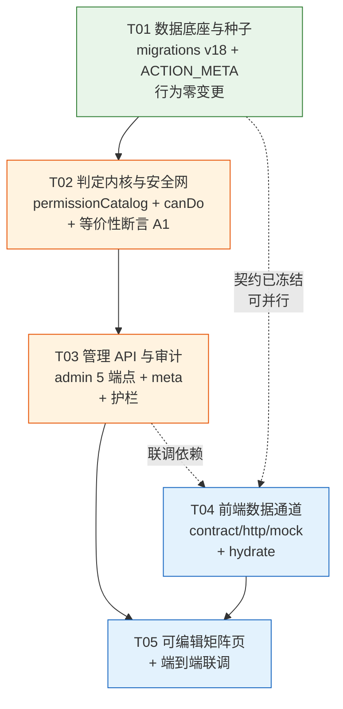

# B19 架构设计 · 权限矩阵可配置化（真·RBAC）

> 架构师：高见远　|　批次：B19　|　状态：**待主理人 / 用户签字**
> 前置事实核查：已逐文件读源码验证，见 §0

---

## 0. 执行摘要与**前提更正**（务必先读）

任务书中有一条关键前提与代码实际情况不符，直接决定了本次改造的规模与风险等级。**必须先纠正，否则会按错误规模立项、白做大量工作。**

### 0.1 前提更正

| # | 任务书原述 | 代码实测结论 | 证据 |
|---|-----------|-------------|------|
| 1 | 后端 `server/` 完全不引用 `PERMISSIONS` / `canDo`，grep 零命中 | ❌ **不成立**。后端存在 `server/config/permissions.js`，内含与前端**逐字同构**的 `PERMISSIONS` 常量 + 完整 `canDo()` 实现 + `ACTION_KEY` 别名表 | `server/config/permissions.js:23-124` |
| 2 | 真正的权限判定是逐接口硬编码，散落各 route handler | ⚠️ **部分成立**。已有统一断言 `assertCan(db, req, action, projectId)`（`server/middleware/rbac.js:95`），内部调用 `canDo`；**全仓已有 33 个 `assertCan` 调用点**，覆盖 wbs / gate / milestone / board / change / member / document / report / review / project-flow。硬编码只剩「资源归属类」判定（见 §4.3） | `grep assertCan` → 33 hits |
| 3 | 需要分阶段试点改造 50 个接口 | ❌ **不需要**。角色类判定已全部收口到 `canDo` 这一个函数。**只要换掉 `canDo` 的数据源，33 个调用点全部自动变为可配置，业务代码零改动** | 同上 |

### 0.2 结论：这是一次「换数据源」，不是「重写鉴权」

```
现状：canDo() ──读──> PERMISSIONS（JS 字面量常量，编译期写死）
改后：canDo() ──读──> permissionCatalog（进程内缓存）──载入──> permission_rules 表
                  └──降级──> DEFAULT_PERMISSIONS（原常量保留为兜底 + 重置基线）
```

带来的直接收益与风险变化：

- **改动面收敛**：后端核心改动仅 `server/config/permissions.js` 一个函数体 + 一个新增缓存服务，**不碰任何 route handler、不碰任何 service 的鉴权调用**。
- **回归风险大幅下降**：任务书担心的「改了配置但后端没拦/误拦」，其根因是"50 处各自为政"。实际只有一处判定逻辑，用一个**等价性断言脚本**即可 100% 覆盖验证（§9.2）。
- **`assertCan` 保持同步函数签名不变**是硬约束：33 个调用点均为同步调用，若改成 async 将引发全链路改造。因此**必须用进程内缓存**（与既有 `roleCatalog.js` 完全同构），不得在 `canDo` 内查 DB。

### 0.3 但发现一个既存隐患（需产品决策）

前后端 `PERMISSIONS` 声称同构，但**后端部分接口的实际强制比矩阵更严**，导致矩阵与真实行为已经不一致：

| action | 矩阵声明（前后端常量） | 后端实际强制 | 后果 |
|--------|---------------------|-------------|------|
| `project:edit` | `admin, pmo, pm` | **仅 项目负责人(pm字段) / 创建人 / admin**（`project.service.js:88-92`，**不走 `assertCan`**） | `pmo` 在前端看得到"编辑"按钮，点下去必然 403 |
| `report:write`（编辑既有日志） | 8 个角色 | **仅作者本人 / admin**（`report.service.js:878-883`） | 同上，越权提示 |

这不是本次引入的，但**矩阵一旦变成"可配置且承诺真实生效"，用户会理所当然认为勾上就生效**——上述两处会成为"配了不生效"的投诉来源。处理方案见 §4.3，需用户在 §11-Q3 决策。

### 0.4 另一个发现：15 个角色里有 6 个当前是「零权限」

实测统计当前 `PERMISSIONS` 的授权分布（每角色被授予的 action 数）：

| 角色 | admin | pmo | pm | tl | qa | cm | po | member | management | **cto** | **cpo** | **dev** | **ops** | **ued** | **sale** |
|------|-------|-----|----|----|----|----|----|--------|-----------|---------|---------|---------|---------|---------|----------|
| 授权数 | 28 | 22 | 21 | 11 | 6 | 4 | 4 | 3 | 2 | **0** | **0** | **0** | **0** | **0** | **0** |

**6 个角色（cto / cpo / dev / ops / ued / sale）当前一条权限都没有**——矩阵页上是 6 个完全空白的列。其中最刺眼的是 `dev`（研发工程师，project scope）：它**连 `task:status`（更新任务状态）都没有**，而 `member`（普通成员）有。也就是说今天把人设为"研发工程师"，他在看板上动不了任何卡片。

这个发现有两重意义：

1. **强化了本需求的价值**：这正是"只读矩阵"最大的痛点——发现了配置不合理却只能改代码发版。本方案上线后，管理员勾一下即可修复，无需工程师介入。
2. **给验收提供了绝佳的试点素材**：给 `dev` 勾上 `task:status` → dev 用户立刻能拖卡片。这是一个**零风险（纯增权，不会拦住任何现有用户）、效果立即可见**的验收用例，建议纳入 §4.2 试点清单。

---

## 1. 实现方案概述

### 1.1 设计目标

1. 管理员在矩阵页勾选 → **前后端同一份配置真实生效**，无需重启。
2. 服务端仍是唯一安全边界；前端只做显隐。
3. `scope` 语义（global 跨项目 / project 仅项目内）不变，仍由 `roles` 表决定。
4. `admin` 恒具备全部权限，且**该短路必须早于任何 DB / 缓存读取**，确保配置写坏也不锁死后台。
5. 零新增运行时依赖（不引入 Redis 等）。

### 1.2 三层结构

```
┌─ 数据层 ──────────────────────────────────────────────┐
│ permission_rules   (action, role_key, granted)  授权事实 │
│ permission_actions (action, label, group, builtin) 展示元数据│
└──────────────────────────────────────────────────────┘
                          │ refreshPermissionCatalog(db)
                          ▼
┌─ 缓存层 ───────────────────────────────────────────────┐
│ server/services/permissionCatalog.js                  │
│   module-level Map<action, Set<role_key>>              │
│   启动预热 (db.js) + 写后刷新 (admin.routes.js)          │
│   与既有 roleCatalog.js 完全同构（同一套心智模型）        │
└──────────────────────────────────────────────────────┘
                          │ 同步读，零 DB 依赖
                          ▼
┌─ 判定层（签名不变）────────────────────────────────────┐
│ canDo(globalRoles, action, projectRoles) : boolean      │
│   ① admin 短路  ② 缓存未就绪→降级 DEFAULT_PERMISSIONS   │
│   ③ 命中 global 角色(scope=global)  ④ 命中 project 角色  │
└──────────────────────────────────────────────────────┘
                          ▲
              assertCan() ─┘  33 个既有调用点，零改动
```

### 1.3 为什么这样分（不另起炉灶）

| 决策 | 理由 |
|------|------|
| 复用 `canDo` 而非新写权限服务 | 33 个调用点已收口，新写服务等于制造第二套真相源，反而引入不一致风险 |
| 缓存服务独立成 `permissionCatalog.js`，不塞进 `permissions.js` | 与 `roleCatalog.js` 对称：`config/*` 放规则与判定，`services/*` 放带状态的缓存。工程师一眼知道放哪 |
| 保留 `DEFAULT_PERMISSIONS` 常量（原 `PERMISSIONS` 改名） | 三个用途：① 缓存未就绪时的降级兜底 ② "恢复默认"的基线 ③ 迁移种子的唯一数据源。**删掉它就失去了所有安全网** |
| 进程内 Map 缓存 | 用户自部署单进程；`canDo` 必须同步；SQLite 本地读虽快但 33 处高频调用不宜每次查表 |
| `permission_actions` 落库但**不开放自定义新增** | 见 §5.2，防"幽灵权限" |

---

## 2. 数据库 Schema

### 2.1 迁移版本

现有最新迁移为 **v17**（`connect-v17-union-id`）。本次新增 **v18**：`connect-v18-permission-rules`，注册进 `MIGRATIONS` 数组。

遵循既有范式（参照 `migrationV15` 建 `roles` 表的写法）：
- 全部 `CREATE TABLE IF NOT EXISTS` + `CREATE INDEX IF NOT EXISTS`
- 种子用 `INSERT OR IGNORE`，**老库升级自动补齐，绝不覆盖用户已有改动**
- `run()` 已统一开事务，迁移函数内**不要**自行 `BEGIN`

### 2.2 `permission_rules`（授权事实）

```sql
CREATE TABLE IF NOT EXISTS permission_rules (
  action     TEXT NOT NULL,                  -- 权限点 key，如 'wbs:edit'
  role_key   TEXT NOT NULL,                  -- 角色 key，对应 roles.role_key
  granted    INTEGER NOT NULL DEFAULT 1,     -- 1=授予 0=显式收回
  updated_at TEXT NOT NULL,
  updated_by TEXT,                           -- 操作人 open_id，审计用
  PRIMARY KEY (action, role_key)
);
CREATE INDEX IF NOT EXISTS idx_perm_rules_action ON permission_rules(action);
```

**语义**：`granted=1` 才算授予；`granted=0` **或整行不存在** → 未授予。

为什么保留 `granted` 列而不用"有行即授予"：
- UPSERT 幂等（`ON CONFLICT(action, role_key) DO UPDATE`），前端可直接提交全量矩阵，无需 diff 出 DELETE
- 可区分"从未配置"与"明确收回"，配合 `updated_by/updated_at` 形成可追溯审计
- 未来若要做"继承 + 覆盖"（如角色组），`granted=0` 是必需的显式否决位

### 2.3 `permission_actions`（展示元数据）

把当前写死在 `AdminPermissionsPage.tsx` 的 `PERM_GROUPS` 下沉入库：

```sql
CREATE TABLE IF NOT EXISTS permission_actions (
  action      TEXT PRIMARY KEY,              -- 'wbs:edit'
  label       TEXT NOT NULL,                 -- 'WBS 编辑'
  group_key   TEXT NOT NULL DEFAULT 'other', -- 'wbs'
  group_label TEXT NOT NULL DEFAULT '其他',   -- 'WBS / 看板 / 任务'
  description TEXT NOT NULL DEFAULT '',
  order_no    INTEGER NOT NULL DEFAULT 0,
  enabled     INTEGER NOT NULL DEFAULT 1,
  builtin     INTEGER NOT NULL DEFAULT 1     -- 1=代码内置，不可删除/改key
);
CREATE INDEX IF NOT EXISTS idx_perm_actions_group ON permission_actions(group_key, order_no);
```

`builtin=1` 的含义：**该 action 字面量被代码里的 `assertCan` 引用**，删除即制造漏洞或误拦。因此 UI 层只允许改 `label / group / order_no / description`（纯展示），禁止删除与改 key。

### 2.4 `roles` 表是否需要迁移

**不需要。** `roles` 表已有 `role_key/name/scope/enabled/description/order_no`，满足矩阵列头与 scope 判定的全部需要。**不加外键约束** `permission_rules.role_key → roles.role_key`：
- 删除角色时若级联删规则，会静默丢配置；若阻止删除，又与既有 `DELETE /admin/roles` 的引用检查逻辑冲突
- 改为**软处理**：`refreshPermissionCatalog` 载入时对不存在 / 已停用的角色直接忽略（孤儿规则留在表里不生效，角色恢复即自动复活）

### 2.5 初始种子（**保证初始状态与现状 100% 一致**）

种子的唯一数据源 = `server/config/permissions.js` 的 `DEFAULT_PERMISSIONS`，**不手写 SQL 常量**，避免二次抄录出错。

迁移 v18 伪逻辑：

```
DEFAULT_PERMISSIONS = { 'project:create': { roles:['admin','pmo','pm'] }, ... }  // 28 个 action
ACTION_META         = { 'project:create': { label:'新建项目', groupKey:'project',
                                            groupLabel:'项目', orderNo:1 }, ... }

for (action, meta) of ACTION_META:
    INSERT OR IGNORE INTO permission_actions
      (action, label, group_key, group_label, description, order_no, enabled, builtin)
    VALUES (action, meta.label, meta.groupKey, meta.groupLabel, '', meta.orderNo, 1, 1)

for (action, rule) of DEFAULT_PERMISSIONS:
    for roleKey of rule.roles:
        INSERT OR IGNORE INTO permission_rules
          (action, role_key, granted, updated_at, updated_by)
        VALUES (action, roleKey, 1, now, 'system:migration-v18')
```

要点：
- `ACTION_META` 是**新增常量**，内容 = 把 `AdminPermissionsPage.tsx` 的 `PERM_GROUPS` 原样搬进 `server/config/permissions.js`（含 5 个分组、28 条 label）。搬完前端页面不再写死分组，改为读接口。
- 只写 `granted=1` 的行；未授予的组合**不落行**（28 action × 15 role = 420 组合，初始种子仅 **101 行**有效授权，稀疏存储）
- `INSERT OR IGNORE` 保证：老库二次升级不覆盖管理员改动；空库首次迁移得到与今天完全一致的授权集

---

## 3. 后端 `canDo` 服务设计

### 3.1 新增 `server/services/permissionCatalog.js`

与 `roleCatalog.js` 严格同构（同样的注释风格、同样的 module-level 缓存、同样的 refresh 时机）。

| 函数 | 签名 | 说明 |
|------|------|------|
| `refreshPermissionCatalog(db)` | `(db) => Map<string, Set<string>>` | 从 `permission_rules` 载入 `granted=1` 的行，聚合成 `Map<action, Set<role_key>>`；同时载入 `permission_actions` 供管理 API 用。启动预热 + 写后刷新 |
| `isLoaded()` | `() => boolean` | 缓存是否已就绪（区分"未加载"与"加载后为空"） |
| `getActionRoles(action)` | `(string) => Set<string> \| undefined` | 取某 action 的授权角色集合 |
| `hasRule(action)` | `(string) => boolean` | 该 action 是否在配置中存在（用于降级判断） |
| `getActionMeta()` | `() => Array<ActionMeta>` | 展示元数据，按 group_key/order_no 升序 |
| `snapshot()` | `() => Record<string, string[]>` | 导出完整矩阵（供 `GET /api/meta/permissions` 与等价性测试） |

**降级设计（关键安全网）**：`isLoaded()` 为 `false`，或缓存内**一条规则都没有**（表被清空 / 迁移未跑 / 载入异常）时，`canDo` 回落到 `DEFAULT_PERMISSIONS`。这样最坏情况是"退回今天的行为"，而不是"全员除 admin 全部 403"。

### 3.2 改造后的 `canDo`（**签名与返回值完全不变**）

```
canDo(globalRoles, action, projectRoles) -> boolean

① 空值防御：globalRoles 空 → false
② admin 短路：任一全局职位为 'admin' → true
   ★ 必须在读缓存之前，配置写坏也不锁死后台
③ 解析 action：key = ACTION_KEY[action] || action   （保留引擎别名兼容）
④ 取规则：
     若 permissionCatalog 就绪且非空 → roles = getActionRoles(key)
     否则（降级）                    → roles = DEFAULT_PERMISSIONS[key]?.roles
   规则不存在 → false（维持现状：未知 action 一律拒绝）
⑤ 跨项目效力：globalRoles 中存在 r，满足 roleCatalog.isGlobalRole(r) && roles.has(r) → true
⑥ 项目内效力：projectRoles 中存在 r，满足 roles.has(r) → true
⑦ 否则 false
```

与现状的行为差异**仅在 ④ 的数据来源**；①②③⑤⑥⑦ 逐字保留现有实现（含 `ACTION_KEY` 别名、`isGlobalRole` 判定、项目角色不校验 scope 的既有语义——`rbac.js:projectRolesOf` 取自 `project_members`，天然是项目内）。

> ⚠️ 给工程师的铁律：**不要"顺手优化" ⑤⑥ 的判定逻辑**。前端 `canDo` 的 ⑥ 多了一层 `isProjectRole(r)` 过滤，后端没有——这是既有的两端细微差异。本次改造**只换数据源，不改判定语义**，否则等价性测试无法定位问题。两端语义统一另开单。

### 3.3 缓存失效时机

| 触发点 | 动作 |
|--------|------|
| 服务启动（`db.js`，迁移+种子之后） | `refreshPermissionCatalog(db)` 预热，紧跟现有 `refreshRoleCatalog(db)` 之后一行 |
| `PUT /api/admin/permissions`（保存矩阵） | 事务提交后 `refreshPermissionCatalog(db)` |
| `POST /api/admin/permissions/reset`（恢复默认） | 同上 |
| `PUT /api/admin/permission-actions/:action`（改展示元数据） | 同上（元数据也在缓存里） |
| 角色增删改（既有 `roles` CRUD） | **已有** `refreshRoleCatalog(db)`，无需改动；scope 变更自动影响 ⑤ 的判定 |

单进程部署，无跨进程失效问题。若未来上多进程/PM2 cluster，需改为"版本号轮询"或"重启生效"——已在 §10 风险登记。

---

## 4. 接口改造策略（安全、可回退）

### 4.1 核心判断：本批次**不需要**逐接口迁移

因为 33 个角色类判定已全部走 `assertCan → canDo`，换数据源即全量生效。**本批次对 route/service 层的改动为零。**

已被 `canDo` 覆盖（换数据源后即刻可配置，无需任何代码改动）：

| 模块 | 文件 | action | 调用点数 |
|------|------|--------|---------|
| WBS | `services/wbs.service.js` | `wbs:edit` ×3, `wbs:delete` | 4 |
| 质量门 / 里程碑 | `services/gate.service.js` | `gate:item:check`, `gate:decide`, `milestone:edit` ×6 | 8 |
| 里程碑 | `services/milestone.service.js` | `milestone:create`, `milestone:edit`, `milestone:delete` | 3 |
| 看板 | `services/board.service.js` | `task:status`, `board:config` | 2 |
| 变更 | `services/change.service.js` | `change:create`, `change:submit` ×2 | 3 |
| 成员 | `services/member.service.js` | `project:member:assign` ×2 | 2 |
| 文档 | `routes/documents.routes.js` | `document:upload` ×2, `milestone:edit`, `document:delete` | 4 |
| 周报 | `routes/reports.routes.js` | `report.write`（别名）×2 | 2 |
| 评审 | `routes/reviews.routes.js` | `review:start` | 1 |
| 项目流转 | `services/project-flow.service.js` | `project:transition` | 1 |
| **合计** | | | **33** |

### 4.2 "试点"重新定义：从"挑接口改代码"改为"挑 action 验证配置生效"

既然代码不用改，试点的正确形态是**验收动作**而非改造动作。建议选这 4 个 action 做端到端验收（低风险、易观察、覆盖三种效力路径）：

| 试点 action | 为什么选它 | 验收方法 |
|------------|-----------|---------|
| **`task:status` × `dev`**（推荐首选） | **纯增权、零风险**：不会拦住任何现有用户，只会解锁今天被误锁的 `dev`（§0.4）。效果肉眼可见，最适合给用户演示"配置真的生效了" | 给 `dev` 勾上 `task:status` → dev 用户立刻可拖看板卡片；取消 → 恢复 403 |
| `board:config`（看板配置） | 纯项目内角色路径；影响面小、可逆；不涉归档校验（D11 特例） | 取消 `tl` 勾选 → tl 用户改看板列应 403；勾回 → 恢复 |
| `document:delete`（附件删除） | 项目内 + 破坏性动作，最能体现"配置真实生效" | 给 `qa` 勾上 → qa 可删；取消 → 403 |
| `dashboard:global`（全局仪表盘） | 唯一纯 `scope=global` 路径，验证跨项目效力 | 取消 `management` → 该角色看不到公司全量 |
| `gate:decide`（质量门决议） | 高价值业务闸门，验证多角色并集 | 增删 `tl` 观察决议按钮与接口 |

**不建议**把 `admin:user:role` / `admin:audit:view` / `admin:template` 纳入试点：它们守的是后台自身入口，且实际由路由级 `requireGlobalRole('admin')` 中间件把关（见 §4.4），误配风险最高、收益最低。

### 4.3 与「资源归属类」判定的共存策略

真正未走 `canDo` 的是这几处，它们判的是**归属（ABAC）而非角色（RBAC）**：

| 位置 | 现行规则 | 处理建议 |
|------|---------|---------|
| `project.service.js:88-92` `updateProjectBasic` | `admin` OR 项目负责人(`p.pm`) OR 创建人(`p.created_by`) | **本批次保持原样** |
| `report.service.js:878-883` 编辑日志 | `admin` OR 作者本人 | **本批次保持原样** |
| `report.service.js:1050/1113` 确认/打回周报 | 必须是指定确认人 | **永久保持**（真源是 approvals 链，非角色） |
| `review.service.js:680` 撤回评审 | 仅发起人 | **永久保持** |
| 项目删除 | 由 `requireGlobalRole` / legacy 路由把关 | 见 §4.4 |

**推荐的共存模型（本批次只定义，不实施）**：

> 角色权限决定"这类人**有资格**做这件事"；归属决定"这个人对**这条数据**有特殊通道"。二者是 **OR** 关系，绝不能是 AND（AND 会让今天能操作的 owner 突然被拦，属于回归）。

未来若要迁移，引入 `assertCanOrOwner(db, req, action, projectId, ownerOpenIds[])`：
```
通过条件 = canDo(action)  OR  me.open_id ∈ ownerOpenIds
```

**⚠️ 但这会造成权限扩张，必须用户明确同意后才做：**
以 `project:edit` 为例，矩阵默认授予 `admin, pmo, pm`。改成 `canDo OR owner` 后，**任意 `pmo` 将可编辑任意项目**（今天不行，只有该项目负责人可以）。这是**语义变更**，不是重构。

因此建议：**本批次把这 5 处显式登记为"归属类判定，暂不纳入矩阵"**，并在矩阵页对 `project:edit`、`report:write` 两行加一个 ⓘ 提示（如"该权限另受资源归属约束：仅项目负责人/创建人可编辑"），**先消除"配了不生效"的困惑**，再由用户决定是否放开（§11-Q3）。

### 4.4 路由级 `requireGlobalRole('admin')` 不动

`server/routes/admin.routes.js` 的 20 个端点用 `requireGlobalRole('admin')` 中间件把关，与 `canDo` 是**双保险**。本批次**一律不动**，理由：
- 这是"进得了后台"的最后一道闸，若改为读配置，配错即**永久锁死后台**（连改回来的入口都进不去），是唯一真正不可回滚的故障
- 保留它 = 无论矩阵怎么配，admin 永远能进后台改回来

`admin:*` 三个 action 因此在本批次退化为"仅前端菜单显隐 + 非 admin 角色的辅助授权"，矩阵页需对这三行标注说明。

### 4.5 可回退性

| 回退层级 | 手段 | 影响 |
|---------|------|------|
| L1 配置回退 | 后台点「恢复默认」 | 秒级，回到 v18 种子状态（= 今日行为） |
| L2 API 回退 | `POST /api/admin/permissions/reset` | 同上，可脚本化 |
| L3 代码回退 | 环境变量 `RBAC_CONFIG_SOURCE=constant` 强制 `canDo` 走 `DEFAULT_PERMISSIONS`，忽略 DB | 无需回滚代码即恢复旧行为，**建议实现，成本极低（一个 if）** |
| L4 版本回退 | git revert 特性分支 | 表结构留存无害（无人读） |

L3 是本设计的"逃生舱"，强烈建议实现。

---

## 5. 前端改造

### 5.1 `AdminPermissionsPage` 只读 → 可编辑

| 项 | 现状 | 改后 |
|----|------|------|
| 行数据源 | 页面内写死 `PERM_GROUPS` 常量 | `GET /api/admin/permission-actions`（含 label/分组/排序） |
| 单元格数据源 | 前端 `PERMISSIONS` 常量 | `GET /api/admin/permissions`（矩阵快照） |
| 交互 | 只读 ✔/— | `Checkbox` toggle，本地 dirty 态 |
| 保存 | 无 | 顶部「保存」按钮 → `PUT /api/admin/permissions`，仅提交变更项 |
| 其他 | 无 | 「恢复默认」按钮（二次确认）、「放弃修改」、未保存离开拦截 |

交互细节要求：
- **`admin` 列整列禁用并强制显示 ✔**，`title` 提示"系统管理员恒具备全部权限，不可取消"——从 UI 层面消灭"把 admin 权限取消掉"这个操作
- 保存前做**空授权提醒**：若某 action 授权角色为空（仅 admin 可用），弹提示确认而非静默保存
- 保存后 toast + 重新 hydrate 前端权限镜像（§5.3），让当前页按钮显隐立即跟随
- 表格已用 `stickyHeader` + `maxHeight: 72vh`，28 行 × 15 列规模无需虚拟滚动
- **6 个角色当前整列为空**（§0.4），可考虑在列头对零授权角色加一个淡色角标（如"未配置"），帮助管理员快速发现需要补配的角色——低成本高感知，建议实现

### 5.2 权限点（行）是否可管理 —— **推荐：落库，但本阶段不开放自定义新增/删除**

用户倾向"可管理"。我的建议是**分层放开**：

| 能力 | 本阶段 | 理由 |
|------|--------|------|
| 改 label（中文名） | ✅ 开放 | 纯展示，零风险 |
| 改分组 / 排序 | ✅ 开放 | 纯展示，零风险 |
| 改描述 | ✅ 开放 | 纯展示 |
| 勾选角色授权 | ✅ 开放（核心目标） | 本次要做的事 |
| **新增自定义 action** | ❌ 暂不开放 | 见下 |
| **删除 action** | ❌ 暂不开放 | 见下 |

**为什么坚决不在本阶段开放"新增/删除 action"：**

一个 action 的**语义完全来自代码**——只有 `assertCan(db, req, 'wbs:edit', pid)` 这句字面量存在，`wbs:edit` 才有效力。

- **新增**：管理员在 UI 造一个 `budget:approve` 并勾给某角色 → 没有任何代码检查它 → 产生**"幽灵权限"**：管理员以为配了管控，实际零效力。这比"不能自定义"危险得多，是典型的安全假象。
- **删除**：删掉 `wbs:edit` → `canDo` 走到 ④ 规则不存在 → 返回 `false` → **全员（除 admin）WBS 编辑功能静默失效**，且从 UI 上看不出原因。

**未来安全放开的前置机制（本次可顺手埋下）**：迁移/启动时做 **code ↔ DB 对账**：
- 以代码 `ALL_ACTIONS` 为准，DB 缺失的自动补种子（保证新版本新增 action 自动出现在矩阵页）
- DB 中存在但代码 `ALL_ACTIONS` 里没有的，标记 `orphan`，矩阵页标灰 + 角标「未被任何接口引用」

有了这套对账，未来开放自定义 action 才是安全的（用户能立刻看出自己造的 action 无人引用）。**本次实现对账逻辑（成本低、收益高），但不开放新增/删除入口。**

### 5.3 前端 `canDo` 镜像：保留同步签名，改为运行时注入

**不改 `canDo(globalRoles, action, projectRoles)` 签名**（大量组件同步调用），只把它读的数据从"编译期常量"改成"运行时可覆盖的模块级变量"：

```
web/src/config/permissions.ts
  let RUNTIME_PERMISSIONS: Record<string, PermRule> | null = null;
  export const DEFAULT_PERMISSIONS = { ... }        // 原 PERMISSIONS 改名，保留作兜底
  export function hydratePermissions(matrix)        // 登录/启动后注入后端配置
  export function resetPermissions()                // 登出时清空
  export function canDo(...)                        // 读 RUNTIME_PERMISSIONS ?? DEFAULT_PERMISSIONS
```

- 注入时机：登录成功后 / 应用 bootstrap 时调 `GET /api/meta/permissions`，拿到矩阵快照后 `hydratePermissions()`
- 拉取失败 → 静默用 `DEFAULT_PERMISSIONS`，只影响按钮显隐，**不影响安全**（后端仍强制）
- mock 模式无后端 → 天然走 `DEFAULT_PERMISSIONS`，现有 mock 行为零变化
- `PERMISSIONS` 具名导出如有他处引用，保留为 `DEFAULT_PERMISSIONS` 的别名导出，避免破坏引用

**定位不变**：文件头那句"⚠ 只用于按钮显隐，永远不能作为安全边界"**必须保留并加强**——现在它读的是后端配置，更容易让人误以为可信。

---

## 6. 文件清单

### 6.1 后端

| 文件 | 动作 | 说明 |
|------|------|------|
| `server/dal/migrations.js` | 改 | 新增 `migrationV18` + 注册进 `MIGRATIONS`；建两表 + 种子 + code↔DB 对账 |
| `server/config/permissions.js` | 改 | `PERMISSIONS` → `DEFAULT_PERMISSIONS`（保留别名导出）；新增 `ACTION_META`（从前端 `PERM_GROUPS` 下沉）；`canDo` 改读缓存 + 降级 + `RBAC_CONFIG_SOURCE` 逃生舱 |
| `server/services/permissionCatalog.js` | **新增** | 进程内缓存，与 `roleCatalog.js` 同构 |
| `db.js` | 改 | 预热 `refreshPermissionCatalog(db)`（紧跟 `refreshRoleCatalog` 之后） |
| `server/routes/admin.routes.js` | 改 | 新增 5 个端点（§7.1）+ 审计接入 |
| `server/routes/meta.routes.js` | 改 | 新增 `GET /api/meta/permissions`（前端 hydrate 用） |

### 6.2 前端

| 文件 | 动作 | 说明 |
|------|------|------|
| `web/src/api/contract.ts` | 改 | 新增 5 个方法签名 + `PermissionMatrix`/`PermissionAction` 类型 |
| `web/src/api/http.ts` | 改 | 真实实现 |
| `web/src/api/mock/index.ts` | 改 | mock 实现（读写内存副本，保证 mock 模式可用） |
| `web/src/config/permissions.ts` | 改 | `hydratePermissions` / `resetPermissions` / `canDo` 读运行时 |
| `web/src/pages/admin/AdminPermissionsPage.tsx` | 改 | 只读 → 可编辑矩阵；移除写死 `PERM_GROUPS`（改读接口） |
| `web/src/stores/*`（认证/bootstrap 所在 store） | 改 | 登录后 hydrate、登出时 reset |

### 6.3 文档 / 校验

| 文件 | 动作 |
|------|------|
| `scripts/qa_b19_verify.cjs` | **新增** 等价性 + 端到端断言（§9.2） |
| `docs/B19-架构设计.md` | 本文件 |
| `docs/B19-class-diagram.mermaid` / `B19-sequence-diagram.mermaid` | 新增 |
| `docs/permissions-matrix.md` | 改 · 补充"矩阵现已可配置 + 归属类例外说明" |
| `docs/schema.sql` | 改 · 补两张表 DDL |

**对现有可用功能的影响评估**：业务 route/service **零改动**；风险集中在 `canDo` 一个函数体 + 迁移种子正确性，两者均被 §9.2 等价性测试全覆盖。

---

## 7. 共享约定

### 7.1 API 契约（全部 `requireAuth` + `requireGlobalRole('admin')`，除 meta）

统一响应包 `{code, data, message}`（沿用 `server/lib/envelope.js` 的 `ok()`）。

| 方法 | 路径 | 请求 | 响应 `data` |
|------|------|------|------------|
| GET | `/api/admin/permissions` | — | `{ matrix: { [action]: string[] }, updatedAt }` |
| PUT | `/api/admin/permissions` | `{ changes: [{ action, roleKey, granted }] }` | 同 GET（回写后快照） |
| POST | `/api/admin/permissions/reset` | — | 同 GET |
| GET | `/api/admin/permission-actions` | — | `PermissionAction[]`（含 `groupKey/groupLabel/label/orderNo/builtin/orphan`） |
| PUT | `/api/admin/permission-actions/:action` | `{ label?, groupKey?, groupLabel?, description?, orderNo?, enabled? }` | `PermissionAction` |
| GET | `/api/meta/permissions` | — | `{ matrix: { [action]: string[] } }` 仅 `requireAuth`，供前端 hydrate |

**`PUT /api/admin/permissions` 采用增量 `changes` 而非全量矩阵**：避免并发覆盖（两个管理员同时编辑时全量提交会互相踩），且请求体小。服务端在**单事务**内 UPSERT 全部 changes，再刷缓存。

### 7.2 校验与守卫（写接口）

| 规则 | 行为 |
|------|------|
| `action` 不在 `permission_actions` 中 | `E_VALIDATION`「权限点不存在」 |
| `roleKey` 不在 `roles` 中 | `E_VALIDATION`「职位不存在」 |
| `roleKey === 'admin'` 且 `granted === false` | `E_VALIDATION`「系统管理员权限不可取消」← **防锁死护栏** |
| `changes` 为空数组 | `E_VALIDATION`「没有可更新的项」 |
| 非 admin 调用 | `E_FORBIDDEN`（中间件层） |

### 7.3 错误码

复用 `server/lib/errors.js` 既有码，**不新增**：`E_VALIDATION` / `E_FORBIDDEN` / `E_UNAUTHORIZED` / `E_NOT_FOUND`。

### 7.4 审计

矩阵变更属高危配置操作，必须留痕。复用 `server/lib/audit.js`：
- `permission.rule.update`：`{ action, roleKey, from, to }`，逐条记录
- `permission.reset`：`{ changedCount }`
- `permission.action.update`：`{ action, fields }`

### 7.5 命名与风格约定

- 后端 SQL 层 `snake_case`，API 出参 `camelCase`（沿用 `toApiRole` 式 mapper，本次加 `toApiPermissionAction`）
- 缓存服务命名、注释风格、`refreshXxx` 语义**严格对齐 `roleCatalog.js`**
- 迁移函数命名 `migrationV18`，注册名 `connect-v18-permission-rules`
- 时间戳统一 ISO 8601（`nowIso()`）

---

## 8. 依赖包

**无需新增任何依赖。**

现有 `better-sqlite3@^11.3.0` / `express@^4.19.2` / `multer` 足够；前端 MUI 的 `Checkbox` / `Button` / `Dialog` 已在用。符合"不引入需额外服务的依赖（如 Redis）"的约束——进程内 Map 缓存即可。

---

## 9. 风险分析与回滚

### 9.1 风险登记

| # | 风险 | 等级 | 概率 | 防护 |
|---|------|------|------|------|
| R1 | **配置写错导致全员进不去后台** | 🔴 高 | 低 | ① `canDo` 中 admin 短路早于任何缓存读 ② 后台路由保留 `requireGlobalRole('admin')` 双保险（§4.4）③ 写接口拒绝取消 admin 授权 ④ UI 上 admin 列禁用 ⑤ 「恢复默认」按钮 ⑥ `RBAC_CONFIG_SOURCE=constant` 逃生舱 |
| R2 | 迁移种子与现状不一致 → 静默权限漂移 | 🔴 高 | 中 | 种子唯一源 = `DEFAULT_PERMISSIONS`（不手抄）；`qa_b19_verify` 对 28×15=420 组合做**逐一等价性断言** |
| R3 | 表为空/迁移未跑 → 非 admin 全部 403 | 🔴 高 | 低 | 缓存空即降级 `DEFAULT_PERMISSIONS`（§3.1），最坏退回今日行为 |
| R4 | 管理员删角色留下孤儿规则 | 🟡 中 | 中 | 载入时忽略不存在/停用角色；不建外键，避免级联删配置 |
| R5 | 前端 hydrate 失败 → 按钮显隐与后端不一致 | 🟢 低 | 中 | 仅影响体验；后端仍强制。降级用 `DEFAULT_PERMISSIONS` |
| R6 | 多进程部署时缓存不同步 | 🟡 中 | 低 | 当前单进程。文档标注：若上 cluster 需改版本号轮询或重启生效 |
| R7 | 用户误以为"勾上 `project:edit` 即可编辑任意项目" | 🟡 中 | **高** | 归属类判定保持不变（§4.3）+ 矩阵页对该行加 ⓘ 约束说明 |
| R8 | 并发编辑互相覆盖 | 🟢 低 | 低 | 增量 `changes` 提交而非全量（§7.1） |
| R9 | 未来新增 action 忘了进矩阵 | 🟡 中 | 中 | 启动时 code↔DB 对账自动补种子（§5.2） |

### 9.2 验收脚本 `scripts/qa_b19_verify.cjs`（**质量闸门，必须过**）

| 断言 | 内容 |
|------|------|
| A1 **等价性（最关键）** | 对 `ALL_ACTIONS`(28) × 全部角色(15) = 420 组合，比较「DB 配置驱动的 `canDo`」与「`DEFAULT_PERMISSIONS` 驱动的 `canDo`」，**必须逐一相等**。证明迁移零漂移 |
| A2 双端一致 | 后端 `ALL_ACTIONS` 与 `permission_actions` 表的 action 集合完全相等（对账无孤儿、无缺失） |
| A3 admin 恒真 | 对 28 个 action，`canDo(['admin'], a, [])` 恒 `true`；**清空 `permission_rules` 后仍恒 `true`** |
| A4 降级 | 清空 `permission_rules` → `canDo` 结果与 `DEFAULT_PERMISSIONS` 一致（降级生效） |
| A5 配置生效 | 撤销 `board:config` 的 `tl` → `canDo([], 'board:config', ['tl'])` 为 `false`；恢复后为 `true` |
| A6 scope 语义 | `dashboard:global` 授予某 `scope=project` 角色时，跨项目仍不生效；改该角色 scope 为 global 后生效 |
| A7 护栏 | `PUT` 尝试取消 admin 授权 → 返回 `E_VALIDATION` |
| A8 幂等 | 迁移 v18 重复执行不改变数据（模拟老库二次升级） |
| A9 缓存失效 | 保存后**不重启**，`canDo` 立即反映新配置 |

### 9.3 回滚方案

见 §4.5 四级回退。**核心保证：任何配置错误都可由 admin 通过后台「恢复默认」自救，无需登服务器改库。** 最坏情况（连后台都进不去，理论上被 §4.4 双保险排除）可用 `RBAC_CONFIG_SOURCE=constant` 重启，立即退回今日行为。

---

## 10. 任务分解

### 10.1 任务列表

| ID | 任务 | 源文件 | 依赖 | 优先级 |
|----|------|--------|------|--------|
| **T01** | **数据底座与种子** — 迁移 v18 建 `permission_rules` + `permission_actions`；`ACTION_META` 常量从前端 `PERM_GROUPS` 下沉；`PERMISSIONS`→`DEFAULT_PERMISSIONS`（保留别名）；种子从常量生成；code↔DB 对账；补 schema 文档。**本任务不改任何判定逻辑，跑完行为与今天完全一致** | `server/dal/migrations.js`、`server/config/permissions.js`、`docs/schema.sql` | — | P0 |
| **T02** | **判定内核与安全网** — 新增 `permissionCatalog.js` 缓存服务（同构 `roleCatalog.js`）；`canDo` 改读缓存 + admin 前置短路 + 空缓存降级 + `RBAC_CONFIG_SOURCE` 逃生舱；`db.js` 启动预热；`qa_b19_verify.cjs` 落地 A1/A3/A4/A6/A8 断言 | `server/services/permissionCatalog.js`(新)、`server/config/permissions.js`、`db.js`、`scripts/qa_b19_verify.cjs`(新) | T01 | P0 |
| **T03** | **管理 API 与审计** — `admin.routes.js` 新增 5 端点（list/save/reset/actions-list/actions-update）+ 校验护栏（拒绝取消 admin）+ 写后刷缓存 + 审计埋点；`meta.routes.js` 新增 `GET /api/meta/permissions`；补 A5/A7/A9 断言 | `server/routes/admin.routes.js`、`server/routes/meta.routes.js`、`server/lib/audit.js`、`scripts/qa_b19_verify.cjs` | T02 | P0 |
| **T04** | **前端数据通道** — `contract.ts` 加类型与 5 个方法签名；`http.ts` 真实实现；`mock/index.ts` mock 实现；`config/permissions.ts` 加 `hydratePermissions`/`resetPermissions` 并让 `canDo` 读运行时（保留常量兜底）；登录后 hydrate / 登出 reset | `web/src/api/contract.ts`、`web/src/api/http.ts`、`web/src/api/mock/index.ts`、`web/src/config/permissions.ts`、认证 store | T01（契约已在 §7.1 冻结，可与 T03 并行开发，联调需 T03 就绪） | P1 |
| **T05** | **可编辑矩阵页与联调** — `AdminPermissionsPage` 改可编辑网格（toggle / dirty 态 / 保存 / 恢复默认 / 离开拦截 / admin 列禁用 / 空授权提醒 / 归属类 ⓘ 提示）；行列改读接口、移除写死 `PERM_GROUPS`；端到端联调；更新 `permissions-matrix.md` | `web/src/pages/admin/AdminPermissionsPage.tsx`、`docs/permissions-matrix.md` | T03, T04 | P1 |

### 10.2 依赖图



**关键节奏建议**：T01 与 T02 之间设一个**验收卡点**——T02 完成、A1 等价性断言 420/420 通过后再往下做。这是整个改造唯一的高风险点，过了这关后面都是常规增删。

---

## 11. 待明确事项（**需用户签字**）

| # | 问题 | 我的推荐 | 影响 |
|---|------|---------|------|
| **Q1** | 权限点（action）是否允许自定义新增/删除？ | **本阶段不开放**，仅开放改中文名/分组/排序。理由见 §5.2：自定义 action 无代码引用 → 幽灵权限；删除内置 action → 功能静默失效。同时实现 code↔DB 对账，为将来安全放开铺路 | 决定 T01/T05 范围 |
| **Q2** | 是否需要「恢复默认」按钮？ | **强烈需要**，这是 R1（锁死后台）的核心自救手段，成本很低 | T03/T05 |
| **Q3** | `project:edit` / `report:write` 等**归属类**判定，本次是否放开为"角色也可"？（如让任意 `pmo` 能编辑任意项目） | **本次不放开**，只在 UI 加 ⓘ 约束说明。这是**语义扩权**而非重构，应独立评估。若用户确实想要，建议单开批次并逐个确认 | 若放开 → 需新增 `assertCanOrOwner` 并逐接口改造，工作量与风险显著上升 |
| **Q4** | 试点范围认可吗？ | 代码层**无需试点**（33 处已收口）；建议按 §4.2 做**端到端验收**，首选 `task:status`×`dev`（纯增权零风险，§0.4），再加 `board:config` / `document:delete` / `dashboard:global` / `gate:decide`。`admin:*` 三项不纳入 | 验收清单 |
| **Q8** | 6 个零权限角色（cto/cpo/dev/ops/ued/sale，§0.4）是否要在本次**顺手补默认授权**？ | **建议不在迁移里补**——迁移必须严格等于现状（否则 A1 等价性断言失去意义、且属未经确认的扩权）。上线后由管理员在 UI 自行配置，这正是本功能的价值体现 | 若要补，需单独产品决策并调整 A1 断言基线 |
| **Q5** | 后台入口的 `requireGlobalRole('admin')` 是否保留？ | **保留**（§4.4）。这是唯一不可回滚故障的防线。代价：`admin:*` 三个 action 在矩阵里对 admin 之外的角色实际不生效，需 UI 标注 | 若要求"完全由矩阵驱动"，R1 从"低概率"变为"可预期"，需用户明确接受锁死风险 |
| **Q6** | 是否实现 `RBAC_CONFIG_SOURCE=constant` 逃生舱？ | **建议实现**，一个 if 的成本，换一条兜底退路 | T02 |
| **Q7** | 权限点是否需要"停用"（`enabled=0`）语义？若停用，`canDo` 该返回什么？ | 建议：`enabled=0` **仅隐藏矩阵行（不再可配）**，判定仍按现有规则走，**不影响 `canDo`**。避免"停用一个 action 就关掉一个功能"的歧义 | T01/T03 |

---

## 12. 类图与时序图

详见：
- `docs/B19-class-diagram.mermaid`
- `docs/B19-sequence-diagram.mermaid`
