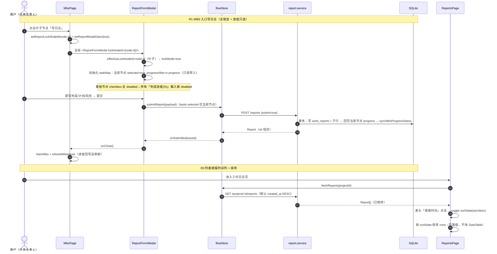
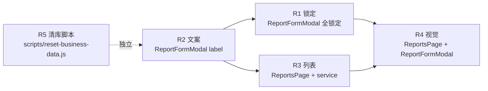

# 工作日志（B5）· 增量架构设计与任务分解

> 作者：高见远（架构师）　|　基线：B4 已交付（`pm-app/` 真实代码，schema v3）
> 输入：`docs/B5-增量PRD.md`（5 条需求，R1/R5 已确认，Q1~Q5 均有推荐）
> 性质：**增量设计，最小变更**——只列需要改的文件与改动点，不重写架构。
> 本文档是**工程师唯一施工依据**；与 `B5-增量PRD.md`、历史文档冲突时，**以本文为准**（本文已对照真实代码逐行校准）。

---

## 〇、现状定位（对照真实代码，B4 基线）

| 关注点 | 现状（已核对） |
|---|---|
| 周报列表页 | `web/src/pages/projects/ReportsPage.tsx`：`DataTable` 渲染，列 = 周次/状态/填报人/完成摘要/关联任务/风险项/**提交时间**/操作；详情弹窗 `FormDialog`；`ReportFormModal` 双入口（新建 + 编辑 + 旧链接 prefill）；`submittedAt` 用 `fmtDate`（仅日期，无时分） |
| 周报表单弹窗 | `web/src/components/report/ReportFormModal.tsx`：已有 `lockNodeId` / `effectiveLockNodeId`（指向非叶子自动降级）/ `locked`（当前节点）；checkbox `disabled={readOnly || locked || hasChildren}`（**当前节点已禁、其他任务仍可勾选**）；进度 `<TextField label="完%">`（`:321`）`disabled={readOnly || hasChildren}`（**锁定节点进度仍可编辑**）；锁 tooltip「…可继续勾选其他任务」（`:303`）、区域 caption「…可继续勾选其他任务」（`:390`） |
| WBS 入口 | `web/src/pages/projects/WbsPage.tsx`：叶子节点「写日志」→ `setReportLockNodeId(node.id)` + 页内开 `ReportFormModal`（`lockNodeId=当前节点`）；父节点行按钮已禁用（disabledReason 已有）；提交后 `fetchWbs + refreshMilestones` |
| 后端读 | `server/routes/reports.routes.js#listReports`：`GET /projects/:projectId/reports`，**无排序参数**；`server/services/report.service.js#listReports` 默认 `ORDER BY week DESC, created_at DESC`；`rowToApiReport` 已含 `createdAt` |
| 后端写 | `report.service.js`：`toProgress` 归一 [0,100]；`resolveTaskRefs` 已有跨项目 `E_VALIDATION`（B4 N5 修复）；`submit=true` 才回写进度/快照/审计 |
| 迁移 | `server/dal/migrations.js`：`MIGRATIONS` v1/v2/v3，当前 v3；`tableExists` 已导出（R5 脚本可复用） |
| 主题 | `web/src/theme/tokens.ts`：`brandScale`（`#6DA8AE` 展示 / `#2E7D87` 交互）、`alphaOf`、`tokens.brand.primary` 已齐备；`themeContext.tsx#DEFAULT_THEME_MODE='light'` |
| 时间工具 | `web/src/utils/date.ts`：**`fmtDateTime` 已存在**（`YYYY-MM-DD HH:mm`，空值 `—`），R3 直接复用，无需新增 |
| 共享表格 | `web/src/components/common/DataTable.tsx`：`Column` **无 `sortable` 属性**（表头纯 label）→ R3 建议页面级排序，不改共享组件 |
| 数据流 | `web/src/stores/flowStore.ts`：`reports` 存于 flowStore；`fetchReports` → `api.listReports(projectId)`（无 query） |
| 当前 pm.db | 实际表：`projects(100) milestones(246) wbs_nodes(457) board_configs(57) quality_gates(63) gate_checklist_items(133) project_members(200) approvals(1) audit_logs(1139) work_reports(5) work_report_tasks(45) work_report_risks(0) reports(3) report_tasks(3) tasks(3) users(11) lifecycle_templates(3) schema_migrations(3)`；**无** `project_stages / reviews / review_steps / changes / risks / documents`（schema.sql 有定义但当前库未建）→ R5 脚本必须做 `sqlite_master` 存在性守卫 |

> ⚠️ **结论**：B5 五项均为**小改**，不需要新增迁移、不需要新增表、不需要改共享 DataTable/主题基础设施；核心改动集中在 `ReportFormModal.tsx` 与 `ReportsPage.tsx`，外加一个独立运维脚本。

---

## 一、增量设计（Part A）

### 1. 实现思路与关键决策

#### 决策 D-B5-1（R1）：前端锁定即可，后端本期不加强制校验

- **建议**：**本期前端锁定 + 服务端维持现状（宽松）**，与 PRD Q3 推荐一致（"本期否"）。
- 理由：正常路径全部由前端 UI 约束（其他任务 checkbox 禁用、进度只读），前端锁定已杜绝误操作；后端强校验属于**防绕过加固**（P1 可选），本期引入会新增 API 契约字段（`lockNodeId`）与校验逻辑，违反"最小变更"。
- **P1 可选方案（预留，本期不做）**：`POST /projects/:projectId/reports` body 增加可选 `lockNodeId`；服务端在 `createReport` 中对 `selected ⊆ {lockNodeId}` 做校验，不满足抛 `E_VALIDATION`；编辑态不校验（编辑仍允许原样回传）。
- `resolveTaskRefs` 的跨项目校验（B4 N5）**保持不变**，不因 R1 改动。

#### 决策 D-B5-2（R3）：前端页面级排序 + 后端默认排序改 `created_at DESC`，不加 query 参数

- **建议**：双管齐下——① 后端 `listReports` 默认 `ORDER BY created_at DESC`（一行改动，语义=填报时间倒序，与 PRD §3.3 推荐一致）；② 前端 `ReportsPage` 内做**页面级排序状态**（默认 填报时间 desc，点击表头在 asc/desc 间切换 + 箭头），**不改共享 `DataTable`**（其 `Column` 无 sortable）。
- 理由：数据量小（当前 5 条，无分页需求），前端排序即可满足交互；后端改默认排序仅一行，保证"默认倒序"在任何消费方（含未来直连 API）都成立；**不新增 `sortBy/sortOrder` query 参数**——api-contract.md §0.4 虽有通用排序约定，但本端点无分页、无多列排序诉求，加参数属契约膨胀，留待将来有真实需求再按通用约定扩展。

#### 决策 D-B5-3（R5）：`scripts/reset-business-data.js` 独立运维脚本

- 安全策略：**备份 → 单事务（方案 A：FK OFF→DELETE→FK check 空→FK ON）→ 自动断言 → 可回滚（还原备份）**，与 PRD §3.5 一致。
- 表清单以 **PRD 清空顺序**为基准 + **`sqlite_master` 存在性守卫**（当前库无 `reviews/review_steps/changes/risks/documents/project_stages`，但 schema.sql 曾定义，脚本须兼容未来库）。
- 保留集：`users`（11 演示账号）、`lifecycle_templates`（3）、`schema_migrations`。
- 复用 `server/dal/migrations.js` 导出的 `tableExists`（避免重写内省逻辑）；复用 `config.js#DB_PATH`（与 db.js / backfill 脚本同口径）。
- 备份文件命名：`pm.db.bak-YYYYMMDD`（`sqlite3 .backup` 语义；better-sqlite3 用 `db.backup()` API 或文件复制，脚本内实现二选一，推荐 `db.backup()`）。
- 脚本退出码：0 = 全绿；非 0 = 失败（打印断言明细）。

### 2. 文件清单（增量，只列要改/新增的文件）

| 文件（相对 `pm-app/`） | 动作 | 一句话改动 |
|---|---|---|
| `web/src/components/report/ReportFormModal.tsx` | **改** | R1 全锁定逻辑 + R2 label「完成进度(%)」+ R4 视觉（锁定行 tint、禁用灰显、caption/tooltip 文案） |
| `web/src/pages/projects/ReportsPage.tsx` | **改** | R3 新增「填报时间」列 + 页面级排序状态 + R4 列表/详情视觉走查 |
| `web/src/pages/projects/WbsPage.tsx` | **复核（不改逻辑）** | 确认「写日志」入口传 `reportLockNodeId` 不变；父节点禁用与提交回调无需改（R1 全锁定由 ReportFormModal 承担） |
| `server/services/report.service.js` | **改** | R3 一行：`listReports` 默认排序改 `ORDER BY created_at DESC`（原 `week DESC, created_at DESC`） |
| `scripts/reset-business-data.js` | **新增** | R5 安全清库脚本：备份 → 单事务按依赖序清空业务表 → `foreign_key_check` 校验 → 断言保留集 |
| `web/src/types/report.ts` | **复核（不改）** | R2 一致性核查：`progressBefore/progressAfter` 0~100 语义确认，无第二套文案 |
| `web/src/stores/flowStore.ts` / `web/src/api/http.ts` | **复核（不改）** | R3 数据流确认：`fetchReports` 无 query、返回全量，前端排序即可 |
| `web/src/utils/date.ts` | **复核（不改）** | `fmtDateTime` 已存在（`YYYY-MM-DD HH:mm`），R3/R4 直接复用 |
| `web/src/theme/tokens.ts` | **复核（不改）** | R4 复用 `alphaOf(brand.primary, 0.05~0.06)`、`tokens.border.subtle`、`brandScale` |
| `server/dal/migrations.js` | **复核（不改）** | R5 脚本复用其导出的 `tableExists` |

> 明确不改：`DataTable.tsx`、`themeContext.tsx`、`reports.routes.js`、`db.js`、`migrations.js`（不加 v4）。

### 3. 数据 / 接口变更

| 项 | 变更 | 说明 |
|---|---|---|
| `GET /projects/:projectId/reports` | **默认排序变化**（无结构变更）：`ORDER BY created_at DESC`（原 `week DESC, created_at DESC`） | 响应体不变（`createdAt` 字段已有）；**不加 query 参数** |
| `Report` 出参 | 无新增字段 | `createdAt`（填报时间）、`submittedAt`（提交时间）均已存在，前端列表直接使用 |
| `ReportFormModal` props | 无新 props | 沿用 `lockNodeId`；语义强化为"全锁定 + 进度只读"（由组件内部实现） |
| WBS 入口 → 弹窗契约 | 无变化 | `WbsPage` 传 `lockNodeId=当前叶子节点`；`ReportsPage` 旧链接 `prefillNodeId → lockNodeId` 行为一致 |
| `POST /projects/:projectId/reports` | **无变更**（本期） | P1 可选：body 增可选 `lockNodeId` + `selected ⊆ {lockNodeId}` 强校验（本期不做，见 D-B5-1） |
| 数据库 schema | **无变更** | 不加迁移、不加表；R5 仅清理数据 |

### 4. 类图（增量 · Mermaid）

```mermaid
classDiagram
    class ReportFormModal {
        +open: boolean
        +projectId: string
        +editingReport: Report | null
        +lockNodeId: string | null
        +keepOpenOnSubmit: boolean
        -taskMap: Record<string, TaskProgress>
        -effectiveLockNodeId: string | null
        -lockDowngraded: boolean
        -lockMode: boolean  // R1: effectiveLockNodeId 非空（新建态）
        +onSubmitted(report: Report): void
        +onClose(): void
        -renderTaskTree(list: WbsTreeNode[], depth: number): JSX.Element[]
        -buildNewTaskRefs(): ReportTaskRef[]
        -assemble(values: FormValues): ReportPayload
        -doSave(values: FormValues, submit: boolean): Promise~void~
    }
    class ReportsPage {
        -reports: Report[]
        -prefillLockNodeId: string | null
        -sortState: { key: string; order: 'asc' | 'desc' }  // R3
        +openCreateWithPrefill(nodeId: string): void
        +openDetail(r: Report): void
        +openEditReport(r: Report): void
        -toggleSort(): void  // R3
    }
    class WbsPage {
        -reportLockNodeId: string | null
        -reportModalOpen: boolean
        +openReportModal(nodeId: string): void
    }
    class reportSvc {
        +listReports(db, projectId): Report[]  // R3: ORDER BY created_at DESC
        +createReport(db, payload, me, submit): Report
        +updateReport(db, id, payload, me): Report
    }
    ReportFormModal --> ReportFormModal : lockNodeId 非空 → lockMode
    ReportFormModal --> WbsPage : onSubmitted → fetchWbs + refreshMilestones
    ReportsPage --> ReportFormModal : lockNodeId={prefillLockNodeId}
    WbsPage --> ReportFormModal : lockNodeId={reportLockNodeId}
    reportSvc ..> ReportsPage : GET /reports（默认 created_at DESC）
```

### 5. 程序调用流（增量 · Mermaid）



### 6. 待明确事项（沿用 PRD Q1~Q5 推荐，无阻塞）

| ID | 问题 | 本设计采用 | 备注 |
|---|---|---|---|
| Q1 | 填报时间与提交时间并存 or 替换 | **并存**（填报时间=createdAt，提交时间=submittedAt） | 详情/列表两列均保留；`fmtDateTime` |
| Q2 | 旧链接是否应用全锁定 | **是**（共享 ReportFormModal，行为一致，不分支） | `prefillLockNodeId → lockNodeId` 已复用 |
| Q3 | 后端强校验 | **本期否**，P1 可选（见 D-B5-1） | 前端锁定即可 |
| Q4 | 视觉走查范围 | 仅 ReportsPage 列表 + 详情/编辑弹窗 | 不改全站主题 |
| Q5 | 清理后是否重建演示数据 | **否**（仅清空，保留 users + 模板） | 项目列表为空、模板可新建 |

---

## 二、任务分解（Part B）

> 共 **5 个任务**，按实现顺序 T01→T05（用户指定顺序）。T02/T03 依赖 T01（同文件或数据口径），T04 依赖 T02+T03，T05 独立（运维，不依赖前端改动）。
> 所有路径相对 `pm-app/`。

### 【T01】R2 文案：进度字段「完%」→「完成进度(%)」　`P0`

**依赖**：无（首个任务）
**目的**：前后端口径统一，消除「完%」残留。

| 文件 | 动作 |
|------|------|
| `web/src/components/report/ReportFormModal.tsx` | **改**：`:321` `<TextField label="完%">` → `label="完成进度(%)"`；`:270`/`:324` 注释中「完%」字样同步替换；全文件 grep 无「完%」 |
| `web/src/types/report.ts` | **复核**：`ReportTaskRow.progressBefore/progressAfter` 注释确认 0~100 整数语义；详情 Chip `before% → after%` 保留 |
| `server/services/report.service.js` | **复核**：`toProgress` 归一 [0,100] 与前端一致；不引入第二套文案（如「进度/%」混用） |

**验收**：新建/编辑弹窗 label =「完成进度(%)」；`grep -rn "完%" web/src` 无残留（除注释更新后也无）；前后端 `progress_before/progress_after` 语义一致。

---

### 【T02】R1 锁定：WBS 入口写日志「仅关联当前任务 + 进度只读」　`P0`

**依赖**：T01（同文件 `ReportFormModal.tsx`，先改文案再改逻辑，避免冲突）
**目的**：`lockNodeId` 非空（WBS/旧链接入口）时任务树全锁定、进度只读带入。

| 文件 | 动作 |
|------|------|
| `web/src/components/report/ReportFormModal.tsx` | **改**（核心）：
1. 派生 `lockMode = !editingReport && effectiveLockNodeId !== null`（新建态 + 锁定入口）；
2. checkbox `disabled` 增加 `lockMode`（`disabled={readOnly || lockMode || hasChildren}`）——**其他节点也不可勾选**；当前节点保持 `checked + disabled`（`t.selected || locked` 逻辑不变）；
3. 进度 `<TextField disabled>` 增加 `lockMode`（`disabled={readOnly || lockMode || hasChildren}`）——**全部进度输入只读**；当前节点值由 `taskMap` 初始化即 `n.progress`（已如此，确认不因 lockMode 覆盖）；
4. 锁 tooltip（`:303`）→ `由「写日志」进入，仅可关联当前任务`；区域 caption（`:390`）→ `由「写日志」进入，仅关联当前任务；进度由系统带入，不可修改`；删除「可继续勾选其他任务」字样；
5. 保持：非叶子降级（`effectiveLockNodeId=null` + `LOCK_DOWNGRADED_TIP` caption）、编辑态只读逻辑（`readOnly`）不回归、`buildNewTaskRefs` 不因 lockMode 改变 selected/progressAfter 语义 |
| `web/src/pages/projects/WbsPage.tsx` | **复核**：入口传 `reportLockNodeId` 不变；父节点「写日志」禁用不回归；提交回调 `fetchWbs + refreshMilestones` 不回归 |
| `web/src/pages/projects/ReportsPage.tsx` | **复核**：旧链接 `openCreateWithPrefill` 传 `prefillLockNodeId` 不变，行为与 WBS 入口一致（全锁定） |

**验收**：WBS 叶子「写日志」→ 弹窗任务树仅当前节点可关联（checked+disabled），其余节点 checkbox 全 disabled；当前节点「完成进度(%)」disabled 且值=WBS 当前进度；提交后该节点进度按带入值回写，WBS/里程碑联动不回归；编辑已有日志行为不回归；旧链接指向非叶子仍降级；无「可继续勾选其他任务」残留。

---

### 【T03】R3 列表：新增「填报时间」列 + 排序（默认倒序）　`P0`

**依赖**：T01（数据口径「完成进度」核查在前；T03 与 T02 无文件冲突，可并行）
**目的**：列表可快速定位最新填报；填报时间/提交时间并存。

| 文件 | 动作 |
|------|------|
| `web/src/pages/projects/ReportsPage.tsx` | **改**：
1. 新增列 `{ key: 'createdAt', label: '填报时间', width: 150, render: (r) => <Typography variant="caption" color="text.secondary" title={r.createdAt}>{fmtDateTime(r.createdAt)}</Typography> }`（复用 `utils/date.ts#fmtDateTime`，空值自动 `—`，`title` 展示完整时间）；
2. 页面级排序状态 `sortState = { key: 'createdAt', order: 'desc' }`（默认填报时间倒序）；点击「填报时间」表头在 asc/desc 切换并显示箭头（用 `TableSortLabel` 或 `TextField`/按钮实现均可，**不改共享 DataTable**）；渲染前对 `rows` 按 `sortState` 排序；
3. 导入 `fmtDateTime`（现有 `fmtDate` 保留给提交时间列，或统一改 `fmtDateTime` 展示 `YYYY-MM-DD HH:mm`） |
| `server/services/report.service.js` | **改**：`listReports` SQL 一行——`ORDER BY created_at DESC`（原 `week DESC, created_at DESC`），保证 API 默认倒序 |
| `web/src/stores/flowStore.ts` / `web/src/api/http.ts` | **复核**：`fetchReports`/`listReports` 无 query 参数（不加 sortBy/sortOrder）；全量返回后前端排序即可 |

**验收**：列表新增「填报时间」列（`YYYY-MM-DD HH:mm`，空值 `—`）；默认按填报时间倒序；点击表头可在升/降间切换且有箭头；草稿（submittedAt=null）正常展示与排序；「提交时间」列不回归。

---

### 【T04】R4 视觉走查：列表 + 详情/编辑弹窗（浅色 + 品牌青）　`P1`

**依赖**：T02 + T03（视觉落在已改动的组件上，避免返工）
**目的**：统一浅色品牌视觉，信息层级清楚。

| 文件 | 动作 |
|------|------|
| `web/src/pages/projects/ReportsPage.tsx` | **改**：
1. 列表：表头浅灰底/字号统一/`nowrap`；行 hover 浅青（`alphaOf(tokens.brand.primary, 0.06)`）；「关联任务」「风险项」Chip `height: 20` 统一；时间列统一 `fmtDateTime`；空态/加载态沿用 `EmptyState`/`LoadingState`（不新增）；
2. 详情弹窗：顶部 meta 行 = 状态 Chip + 填报人 + 填报时间 + 提交时间（caption 次要色）；四段标题用 `REPORT_SECTION_TITLE` + 品牌青装饰（左侧竖条/圆点）；正文 `pre-wrap`、间距统一；关联任务行 = 节点名 + 进度 Chip（`before% → after%`）；风险行 = 描述 + 责任人 + 截止日 Chip |
| `web/src/components/report/ReportFormModal.tsx` | **改**：
1. 各 section 间距统一（Stack spacing 2）；任务关联区容器沿用 `tokens.border.subtle` + 圆角 1.5 + 最大高 320 滚动（已有，复核）；
2. 锁定节点行：`checked+disabled` + 锁图标 + 品牌青 tint 背景（`alphaOf(tokens.brand.primary, 0.05)`）；
3. 「完成进度(%)」输入框禁用态灰显（R2 联动）；
4. 风险行卡片样式统一（`p 1 / border subtle / radius 1.5`，已有，复核） |
| `web/src/theme/tokens.ts` | **复核**：`alphaOf`、`brandScale`、`tokens.border.subtle` 均已有，直接引用，不加新 token |

**验收**：列表/详情/编辑弹窗均为浅色，无深色覆写；主按钮/链接用 `#2E7D87`，`#6DA8AE` 仅装饰；表头/间距/时间格式统一；空态/加载态存在且友好；锁定节点行有品牌 tint + 锁图标。

---

### 【T05】R5 运维：安全清理测试数据脚本 `scripts/reset-business-data.js`　`P0`

**依赖**：无（独立运维任务，不依赖 T01~T04，可随时并行；安排在最后交付验收）
**目的**：一键清空全部业务数据，保留演示账号与模板，安全可回滚。

| 文件 | 动作 |
|------|------|
| `scripts/reset-business-data.js` | **新增**（参照 `scripts/backfill-wbs-skeleton.js` 风格：`openDb` 不跑迁移/种子、复用 `config.js#DB_PATH`、库不存在即报错退出） |
| `server/dal/migrations.js` | **复核（复用）**：`require` 其导出的 `tableExists` 做存在性守卫，不修改 |
| `config.js` | **复核（复用）**：`DB_PATH` 读取路径与 db.js/backfill 同口径 |

**脚本行为（与 PRD §3.5 一致）**：

1. **备份**：`db.pragma('wal_checkpoint(TRUNCATE)')` → `db.backup('./pm.db.bak-YYYYMMDD')`（better-sqlite3 `backup()` API）；备份文件存在性断言。
2. **清空**：`PRAGMA foreign_keys=OFF` → **单事务**内按依赖序 DELETE → 事务末 `PRAGMA foreign_key_check` 必须返回空 → 恢复 `foreign_keys=ON`。
3. **删除顺序**（子→父；每表 `tableExists` 守卫）：
   `approvals` → `review_steps`→`reviews`（若存在）→ `audit_logs` → `work_report_tasks`→`work_report_risks`→`work_reports` → `report_tasks`→`reports`→`tasks` → `board_configs` → `gate_checklist_items`→`quality_gates` → `changes`（若存在）→ `project_members` → `risks`、`documents`（若存在）→ `wbs_nodes` → `milestones`、`project_stages`（若存在）→ `projects`
4. **保留集**：`users`（11）、`lifecycle_templates`（3）、`schema_migrations`（≥3）——**不清**。
5. **断言（脚本自动校验，失败退出码非 0）**：`users=11`、`lifecycle_templates=3`、`schema_migrations≥3`、所有业务表 `COUNT(*)=0`、`PRAGMA foreign_key_check` 为空、备份文件存在。
6. **收尾**：可选 `VACUUM`；打印各表清理行数与保留集计数。
7. **回滚**：还原 `pm.db.bak-YYYYMMDD` 即可（文档注明，脚本不自动删备份）。

> ⚠️ 脚本是**运维工具**，不进路由、不进迁移；用法 `node scripts/reset-business-data.js`（可 `DB_PATH=` 覆盖）。

**验收**：执行前生成备份；清理后 users=11 / lifecycle_templates=3 / schema_migrations 保留 / 全部业务表=0 / `foreign_key_check` 空；应用可启动、11 个演示账号可登录、项目列表为空、模板仍可新建项目；回滚=还原备份。

---

## 三、共享约定（沿用 + 新增）

**沿用既有（不重述）**：信封 `{code:0, data, message}`；出参 camelCase / 库内 snake_case；`E_*` 错误码（`E_VALIDATION` 等）；RBAC 守卫次序 `requireAuth → assertCan('report.write')`；审计写在事务外；`toProgress` 归一 [0,100]；浅色全局默认主题。

**新增约定（B5）**：

1. **时间口径**：填报时间 = `createdAt`、提交时间 = `submittedAt`，二者**并存**；展示统一 `fmtDateTime`（`YYYY-MM-DD HH:mm`），空值 `—`，`title` 属性放完整时间。
2. **进度文案唯一口径**：进度字段唯一文案为「完成进度(%)」，对应 `progressBefore/progressAfter`（0~100 整数）；全项目禁止「完%」或「进度/%」混用；详情 Chip `before% → after%` 保留。
3. **lockNodeId 语义**：非空 = 全锁定（仅当前节点可关联 + 全部进度只读）；编辑态不受影响；指向非叶子自动降级为不锁定并给 caption 提示。
4. **视觉约束**：面板/弹窗一律浅色 token（`bg.card`/`bg.elevated`），禁止深色覆写；交互色 `#2E7D87`（主按钮/链接），`#6DA8AE` 仅装饰；锁定行 tint = `alphaOf(tokens.brand.primary, 0.05)`、行 hover = `alphaOf(..., 0.06)`。
5. **运维脚本规范**：`scripts/` 下破坏性脚本必须「备份 → 单事务 → `foreign_key_check` 校验 → 自动断言 → 可回滚」；复用 `config.js#DB_PATH` 与 `migrations.tableExists` 守卫；不进路由、不进迁移。

---

## 四、任务依赖图



| 任务 | 依赖 | 优先级 | 主要文件 |
|---|---|---|---|
| T01 R2 文案 | — | P0 | ReportFormModal.tsx（改）+ types/report.ts、report.service.js（复核） |
| T02 R1 锁定 | T01 | P0 | ReportFormModal.tsx（改）+ WbsPage.tsx、ReportsPage.tsx（复核） |
| T03 R3 列表 | T01 | P0 | ReportsPage.tsx、report.service.js（改）+ flowStore/http.ts（复核） |
| T04 R4 视觉 | T02+T03 | P1 | ReportsPage.tsx、ReportFormModal.tsx（改）+ tokens.ts（复核） |
| T05 R5 清库 | —（独立） | P0 | scripts/reset-business-data.js（新增）+ migrations.js、config.js（复用） |

---

## 五、验收口径（对照 PRD §4，简表）

| ID | 关键验收 |
|---|---|
| R1 | 仅当前节点可关联（checked+disabled）、其余节点 disabled；进度只读带入=节点当前进度；提交回写与联动不回归；无「可继续勾选」残留；编辑态/非叶子降级不回归 |
| R2 | label=「完成进度(%)」；grep 无「完%」；前后端 0~100 语义一致 |
| R3 | 「填报时间」列（`fmtDateTime`、空值 `—`）；默认倒序；表头切换升降序+箭头；草稿正常；「提交时间」列不回归 |
| R4 | 全浅色无深色覆写；`#2E7D87` 交互/`#6DA8AE` 装饰；表头/间距/时间统一；空态/加载态友好；锁定行 tint+锁图标 |
| R5 | 备份生成；users=11/模板=3/迁移保留/业务表=0/fk_check 空；应用可启动、账号可登录、模板可新建；回滚=还原备份 |
