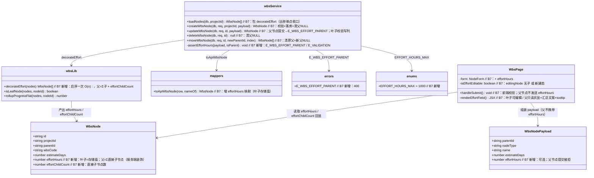
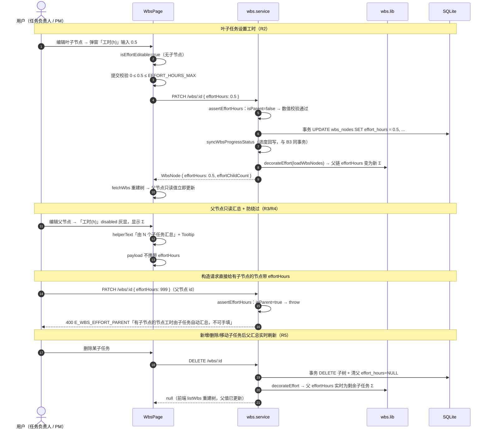
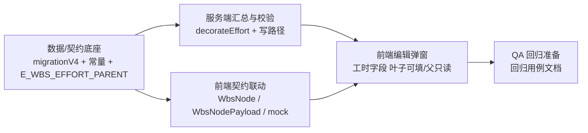

# 工时设置（B7）· 增量架构设计与任务分解

> 作者：高见远（架构师）　|　基线：B6 已交付（`pm-app/` 真实代码，schema v3）
> 输入：`docs/B7-增量PRD.md`（R1~R7，方案 A「强制汇总」已确认；Q1~Q5 均有推荐）
> 性质：**增量设计，最小变更**——只列需要改的文件与改动点，不重写架构。
> 本文档是**工程师唯一施工依据**；与 `B7-增量PRD.md`、历史文档冲突时，**以本文为准**（本文已对照真实代码逐行校准）。
> ⚠️ 纯文档产出：**不写代码、不碰数据库**。

---

## 〇、现状定位（对照真实代码，B6 基线）

| 关注点 | 现状（已核对） |
|---|---|
| 迁移 | `server/dal/migrations.js`：`MIGRATIONS` v1/v2/v3，当前 v3；已有 `tableExists` / `columnsOf` / `hasColumn` 内省工具并导出；v1 已有 `hasColumn` 守卫追加列的范式（`tasks.name`）→ **v4 直接复用** |
| WBS 行→API | `server/lib/mappers.js#toApiWbsNode`：显式字段映射（19 字段），`estimateDays`/`actualDays` 均 `toNum(row.xxx, 0)`；**无 effort_hours** |
| WBS 纯算法 | `server/lib/wbs.js`：`isLeafNode`（SK-4 叶子=无子节点）、`rollupProgressFlat`（子树叶子加权）、`sortByWbsCode` 均已具备 → effort 汇总可同构实现 |
| WBS 服务 | `server/services/wbs.service.js`：`loadNodes` = 薄转发 `milestoneService.loadWbsNodes`；写操作 4 个（create/update/delete/move）均在**同一事务**内，且统一在末尾 `syncWbsProgressStatus → refreshMilestoneStatuses`（引擎收尾次序恒定）；`updateWbsNode` 已有 `children = nodes.filter(...)`（R-4 类型锁处可复用） |
| 里程碑读 | `server/services/milestone.service.js#loadWbsNodes`：全量 SELECT + `sortByWbsCode`，**多个调用方**（里程碑统计/健康度等）→ effort 装饰应放在 wbs.service 的 `loadNodes`，**不动** milestone.service（避免把无关字段扩散到里程碑/周报统计） |
| 建项骨架 | `server/services/project.service.js#createProject`：per-milestone 骨架 INSERT 列清单**不含** effort_hours → 落库默认 NULL，天然符合「父节点不存值」；**无需改 INSERT**（复核即可） |
| 路由 | `server/routes/wbs.routes.js`：`GET /projects/:id/wbs`（listWbs）、`POST`（create，返回单节点）、`PATCH /wbs/:id`（update，返回单节点）、`DELETE`、`POST /wbs/:id/move`（返回**全项目节点数组** · D13）→ 出参自动带新字段，**路由不改** |
| 错误码 | `server/lib/errors.js`：`ErrorCode` 常量表 + `CODE_HTTP`（E_WBS_* 系列均 400）+ `ERROR_MESSAGE_ZH`；前端 `web/src/types/api.ts` 同构维护一份 → **新增 E_WBS_EFFORT_PARENT 需两端同步** |
| 前端类型 | `web/src/types/wbs.ts#WbsNode`（19 字段，无 effort）；`web/src/api/contract.ts#WbsNodePayload`（无 effortHours）→ **两端契约需同步** |
| 前端页面 | `web/src/pages/projects/WbsPage.tsx`：`NodeForm`/`EMPTY_FORM`（含 estimateDays）；`openEdit`/`openCreate`/`changeParent`/`handleSubmit` 组装 payload；弹窗 `FormDialog`；已有「有子节点 → 类型 disabled」范式（`editingNode.children.length > 0`）与 Tooltip+span 包裹 disabled 按钮范式（`canAddChild`）→ **工时字段直接复用这两套范式** |
| 前端常量 | `web/src/config/enums.ts`：`GRANULARITY_LIMIT`/`DEFAULT_WBS_RULES` 前后端各一份的既有模式 → **EFFORT_HOURS_MAX 照此双份** |
| 数据流 | `web/src/stores/wbsStore.ts`：create/update/delete/move 后统一 `api.listWbs` 重建树 → 出参新字段自动流入 `WbsNode[]`，store **无需改** |
| 当前 pm.db | `wbs_nodes(457)` / `projects(100)` → 平均每项目约 4.6 节点、树深 ≤4 层；单项目全量读 + O(n) 内存汇总**量级极小** |

> ⚠️ **结论**：B7 为**小改**。后端核心 = migrationV4（1 列）+ `decorateEffort` 读时算（O(n)）+ 4 个写操作各加几行校验/清 NULL；前端核心 = WbsPage 弹窗加 1 字段 + 2 个类型文件加字段 + 错误码/常量双份。不新增表、不加缓存列、不改路由、不改 milestone.service、不改 store。

---

## 一、增量设计（Part A）

### 1. 实现思路与关键决策

#### 决策 D-B7-1（R1/R5）：汇总放**后端读时算**，不落缓存列

**推荐：读时算 + `decorateEffort` 统一装饰，不引入 `effort_total` 缓存列。**

权衡分析：

| 维度 | 读时算（推荐） | 写时缓存列（effort_total） |
|---|---|---|
| 一致性 | 展示值永远由树结构实时推出，**天然一致**，无脏态可能 | 需在 create/update/delete/move 每条写路径同步 UPDATE 父链，漏一处即「存了值但没算」脏态 |
| 同事务要求（R5） | 叶子值本身在写事务内落库，父汇总为读时派生 → **同事务要求自动满足**，无需额外写放大 | 每次写要额外 UPDATE 祖先链（多行写放大），事务更长 |
| 写路径改动 | create/update/delete/move 仅加「校验 + 父清 NULL」，无汇总写 | 每条写路径都要算 Σ 并批量 UPDATE，改动面更大 |
| 读性能 | 单项目全量 O(n) 一次后序（当前 457 节点 / 100 项目 ≈ 4.6 节点每项目），可忽略 | 读 O(1)，但写放大 |
| 扩展点 | `effort_hours` 列已足够支撑 P1 R6（加权进度）与 R7（列表展示）；未来节点量级上万再评估缓存列 | — |

**结论**：现有树规模极小（每项目几十节点、树深 ≤4），读时算 O(n) 成本可忽略；且与 B3 进度汇总「`syncWbsProgressStatus` 读全量后内存回写」同一范式，**最小变更**。本期不落缓存列。

实现要点：
- `server/lib/wbs.js` 新增纯函数 `decorateEffort(nodes)`：输入 API 形态数组，**一次后序**（子先于父）为每个节点计算：
  - `effortChildCount` = 直接子节点数（PRD 文案「由 N 个子任务汇总」的 N）；
  - `effortHours` = 叶子取存储值（`toNum(row.effort_hours, 0)`，存量 NULL→0）；父 = Σ 直接子节点 `effortHours`（子若是父，其值已是递归汇总，天然自底向上）。
  - 返回新数组（不改入参），幂等可重复调用。
- `wbs.service.loadNodes` 改为 `return decorateEffort(milestoneService.loadWbsNodes(db, projectId))` —— **所有** wbs 读接口（listWbs、create/update/delete 返回值、move 返回的全量数组、syncWbsProgressStatus 内部读取）自动带 `effortHours` + `effortChildCount`，单点收口。
- **不动** `milestone.service.loadWbsNodes`：其调用方（里程碑统计/周报/健康度）不需要 effort 字段，避免无关扩散。

#### 决策 D-B7-2（R4）：新增独立错误码 `E_WBS_EFFORT_PARENT`（HTTP 400）

**推荐新增**（不复用 E_VALIDATION）。理由：
1. 与既有 `E_WBS_LEAF_INCOMPLETE` / `E_WBS_TYPE_LOCKED` / `E_WBS_ESTIMATE_OVERFLOW` 系列一致，语义自明；
2. 验收 B7-R4 ① 明确「返回 4xx 业务错误（如 E_WBS_EFFORT_PARENT）」——独立码可直接断言；
3. 前端可给针对性文案（区别于泛化「参数校验失败」）。

定义（三处同步）：
- `server/lib/errors.js`：`ErrorCode.E_WBS_EFFORT_PARENT`、`CODE_HTTP[...] = 400`、`ERROR_MESSAGE_ZH[...] = '有子节点的节点工时由子任务自动汇总，不可手填'`；
- `web/src/types/api.ts`：`ErrorCode` 常量 + `ERROR_MESSAGE_ZH` 同步；
- 使用处（`wbs.service.js#createWbsNode/updateWbsNode`）：`throw new AppError(ErrorCode.E_WBS_EFFORT_PARENT, '有子节点的节点工时由子任务自动汇总，不可手填', { nodeId, childCount })`。

#### 决策 D-B7-3（R1/R2）：叶子落 0、父节点清 NULL 的写路径纪律

- **叶子**：`effort_hours` 存实际值；payload 缺省按 **0 落库**（显式 0，与 `estimate_days NOT NULL DEFAULT 0` 一致，SQL `SUM` 直接可用）。
- **父节点**：DB 列**恒 NULL**。写路径保证「成为父即清 NULL」：
  - `createWbsNode`：新节点无子（存 0/实际值）；若 `parentId` 存在 → `UPDATE wbs_nodes SET effort_hours = NULL WHERE id = ? AND effort_hours IS NOT NULL`（父此前若是叶子存过 0，立即清）；
  - `updateWbsNode`：有子节点且 payload 带 `effortHours` → 抛 `E_WBS_EFFORT_PARENT`（不写列）；叶子 → 校验后写列；
  - `moveWbsNode`：清**原父与新父**两处 `effort_hours = NULL`（同一 UPDATE `IN (?, ?)`）；
  - `deleteWbsNode`：清被删子树根的父（`node.parentId`）`effort_hours = NULL`（防历史脏数据残留，一行成本）。
- 展示/统计口径一律走 `decorateEffort` 的 Σ（父列 NULL 或残留 0 均不影响展示，因为父值被装饰覆盖）。

#### 决策 D-B7-4（R2/Q4）：上限常量双份 + 前后端双重校验

- 常量：`server/config/enums.js` 与 `web/src/config/enums.ts` 各加 `EFFORT_HOURS_MAX = 1000`（沿用 `GRANULARITY_LIMIT` 前后端双份既有模式）。
- 后端（`wbs.service.js`）：payload 带 `effortHours` 时——父节点先判 `E_WBS_EFFORT_PARENT`；叶子校验 `Number.isFinite(v) && v >= 0 && v <= EFFORT_HOURS_MAX`，非法抛 `E_VALIDATION`（400，message 带边界）。
- 前端（`WbsPage.tsx#handleSubmit`）：叶子提交前同规则校验，非法 `toast.warning` 并 return（不调接口）；父节点**不发送**该字段。

#### 决策 D-B7-5（R3/Q2）：前端禁用/隐藏策略

- **编辑弹窗**（本期唯一 UI 落点）：
  - 叶子（`editingNode.children.length === 0`，新建态恒叶子）：`TextField type=number min=0 step=0.5 max=1000`，label「工时(h)」可编辑；空值按 0；失焦/提交校验。
  - 父节点：同位置 `TextField disabled` + 灰显，值 = 服务端 `effortHours`（Σ 直接子节点），helperText「由 N 个子任务汇总」（N=`effortChildCount`），外层 `Tooltip` 完整文案「由 N 个子任务汇总：子任务工时之和，不可手填」（disabled 控件需 span 包裹触发 Tooltip，复用 WbsPage 现有 `canAddChild` 范式）；提交 payload **不带** `effortHours`。
- **树行/看板展示**（Q2，P1 默认不做）：不加列；`decorateEffort` 出参已就绪，未来 R7 零后端改动。

### 2. 文件清单（增量，只列要改/新增的文件）

| 文件（相对 `pm-app/`） | 动作 | 一句话改动 |
|---|---|---|
| `server/dal/migrations.js` | **改** | 新增 `migrationV4`（`ALTER TABLE wbs_nodes ADD COLUMN effort_hours REAL`，`hasColumn` 幂等守卫）+ 注册 `MIGRATIONS` v4 |
| `server/config/enums.js` | **改** | 新增 `EFFORT_HOURS_MAX = 1000`（WBS 常量区）+ module.exports 导出 |
| `server/lib/errors.js` | **改** | 新增 `E_WBS_EFFORT_PARENT`：ErrorCode + CODE_HTTP(400) + ERROR_MESSAGE_ZH |
| `server/lib/wbs.js` | **改** | 新增纯函数 `decorateEffort(nodes)`（后序一次 O(n)：effortHours 汇总 + effortChildCount）+ 导出 |
| `server/lib/mappers.js` | **改** | `toApiWbsNode` 增 `effortHours: toNum(row.effort_hours, 0)`（叶子存储值；父值由 decorate 覆盖） |
| `server/services/wbs.service.js` | **改**（核心） | `loadNodes` 包 `decorateEffort`（出参带 effortHours/effortChildCount）；create/update 增 `assertEffortHours` 校验 + 落库/抛错；create/move/delete 按 D-B7-3 清父 NULL |
| `server/services/project.service.js` | **复核（不改）** | 骨架 INSERT 列清单不含 effort_hours → 落库默认 NULL，符合父节点语义；确认无需改动 |
| `server/routes/wbs.routes.js` | **复核（不改）** | 出参字段自动透传（listWbs / 单节点 / move 全量数组）；路由零改动 |
| `web/src/types/wbs.ts` | **改** | `WbsNode` 增 `effortHours: number` + `effortChildCount: number` |
| `web/src/api/contract.ts` | **改** | `WbsNodePayload` 增可选 `effortHours?: number` |
| `web/src/types/api.ts` | **改** | ErrorCode 增 `E_WBS_EFFORT_PARENT` + ERROR_MESSAGE_ZH（与后端逐字一致） |
| `web/src/config/enums.ts` | **改** | 新增 `EFFORT_HOURS_MAX = 1000` |
| `web/src/pages/projects/WbsPage.tsx` | **改**（核心前端） | `NodeForm`/`EMPTY_FORM`/`openEdit`/`openCreate`/`changeParent` 增 effortHours；弹窗新增「工时(h)」字段（叶子可编辑/父只读灰显+「由 N 个子任务汇总」+tooltip）；`handleSubmit` 前端校验 + payload 组装（父不发送） |
| `web/src/api/mock/index.ts` | **复核/同步** | 若 `api/client` 仍指向 mock：create/updateWbsNode 同步 `effortHours` 透传；已切 http 则仅确认类型 |
| `web/src/stores/wbsStore.ts` | **复核（不改）** | create/update/delete/move 后统一 `listWbs` 重建树 → 新字段自动流入，无需改动 |
| `web/src/utils/wbs.ts` | **复核（不改）** | `rollupProgress` 仍以 `estimateDays` 加权（R6 本期不做）；不因 effortHours 变化 |

> 明确不改：`milestone.service.js`（loadWbsNodes 不加 effort）、`wbs.routes.js`、`project.service.js`、`wbsStore.ts`、`utils/wbs.ts`、`theme/tokens.ts`、`DataTable.tsx`。

### 3. 数据 / 接口变更

| 项 | 变更 | 说明 |
|---|---|---|
| `wbs_nodes`（migrationV4） | `ALTER TABLE wbs_nodes ADD COLUMN effort_hours REAL`（可空，默认 NULL） | 幂等：`hasColumn` 守卫 + `schema_migrations` 记录 v4；存量行不回填（NULL → 展示按 0） |
| `GET /projects/:projectId/wbs` 出参 `WbsNode[]` | 每节点新增 `effortHours: number`、`effortChildCount: number` | 叶子=存储值（NULL→0）；父=Σ直接子节点（服务端 `decorateEffort` 计算）；`effortChildCount`=直接子节点数 |
| `POST /projects/:projectId/wbs` | 请求体 `WbsNodePayload` 增可选 `effortHours?: number` | 新节点恒叶子：校验数值（≥0、≤1000、Number.isFinite）后落库，缺省按 0；父节点（parentId 指向者）清 NULL |
| `PATCH /wbs/:id` | 请求体增可选 `effortHours?: number` | 节点有子节点 → 抛 `E_WBS_EFFORT_PARENT`(400)；叶子 → 校验后写列；缺省不改 |
| `DELETE /wbs/:id` / `POST /wbs/:id/move` | 无请求体变更；响应不变 | 写路径按 D-B7-3 清父 NULL；move 返回的全量数组已带 effort 字段（D13） |
| 错误码 | 新增 `E_WBS_EFFORT_PARENT`（HTTP 400） | 后端 errors.js + 前端 types/api.ts 双份 |
| 常量 | 新增 `EFFORT_HOURS_MAX = 1000` | server/config/enums.js + web/src/config/enums.ts 双份 |

### 4. 类图（增量 · Mermaid）

### 5. 程序调用流（增量 · Mermaid）

### 6. 待明确事项（沿用 PRD Q1~Q5 推荐，无阻塞）

| ID | 问题 | 本设计采用 | 备注 |
|---|---|---|---|
| Q1 | 父节点进度工时加权（R6） | **本期不做**（P1 后续） | `effort_hours` 列已足够支撑，未来仅改 `syncWbsProgressStatus` 权重口径 + 前端 `weightedProgress` |
| Q2 | 树行/看板展示工时（R7） | **本期不做**（P1 后续） | 出参已带 `effortHours`，未来加列零后端改动 |
| Q3 | 存量树 effort_hours | **全按 0 起步不回填** | migrationV4 后存量叶子 NULL → 展示按 0；不从 estimate_days 推算 |
| Q4 | 工时上限 | **默认 1000(h)**，前后端常量 `EFFORT_HOURS_MAX` | 超限抛 `E_VALIDATION` |
| Q5 | effort_hours 与 estimate_days 关系 | **并存、语义独立** | estimateDays（人日估算）不动；effortHours（登记工时）新字段 |
| 补充 | 父节点 DB 列是否清 NULL | **写路径清**（D-B7-3） | 防「存了值但没算」脏态，成本极低 |

---

## 二、任务分解（Part B）

> 共 **5 个任务**，按实现顺序 T01→T05。T02/T03/T04 依赖 T01（数据/契约底座）；T04 依赖 T02+T03；T05 依赖 T04（回归覆盖新功能）。
> 所有路径相对 `pm-app/`。

### 【T01】数据与契约底座：migrationV4 + 工时上限常量 + E_WBS_EFFORT_PARENT　`P0`

**依赖**：无（首个任务）
**目的**：列先建好、常量与错误码先定义，后续任务直接引用。

| 文件 | 动作 |
|------|------|
| `server/dal/migrations.js` | **改**：新增 `function migrationV4(db, now)`——`if (!tableExists(db,'wbs_nodes')) return; if (!hasColumn(db,'wbs_nodes','effort_hours')) db.exec('ALTER TABLE wbs_nodes ADD COLUMN effort_hours REAL');`（可空默认 NULL，幂等）；注册 `MIGRATIONS`：`{ version: 4, name: 'connect-v4-wbs-effort-hours', up: migrationV4 }` |
| `server/config/enums.js` | **改**：WBS/看板常量区新增 `const EFFORT_HOURS_MAX = 1000;`（注释：工时上限小时，与 web 端一致）+ module.exports 增加 |
| `server/lib/errors.js` | **改**：`ErrorCode` 增 `E_WBS_EFFORT_PARENT: 'E_WBS_EFFORT_PARENT'`；`CODE_HTTP` 增 `[ErrorCode.E_WBS_EFFORT_PARENT]: 400`；`ERROR_MESSAGE_ZH` 增 `'有子节点的节点工时由子任务自动汇总，不可手填'` |
| `web/src/types/api.ts` | **改**：`ErrorCode` 常量增 `E_WBS_EFFORT_PARENT`；`ERROR_MESSAGE_ZH` 增同文案（与后端逐字一致） |
| `web/src/config/enums.ts` | **改**：新增 `export const EFFORT_HOURS_MAX = 1000;`（WBS 常量区，注释同上） |

**验收**：启动应用自动应用 v4（`schema_migrations` 有 v4，`wbs_nodes` 存在 `effort_hours` 列）；重复启动不报错；`E_WBS_EFFORT_PARENT` 两端错误码/文案一致；`EFFORT_HOURS_MAX` 两端 = 1000。

---

### 【T02】服务端工时汇总与写路径校验（出参 + 强制）　`P0`

**依赖**：T01（列/常量/错误码已就绪）
**目的**：读时算汇总（R5 出参）+ 叶子可填/父禁填强制校验（R2/R4）+ 父节点清 NULL 纪律（R1）。

| 文件 | 动作 |
|------|------|
| `server/lib/wbs.js` | **改**：新增纯函数 `decorateEffort(nodes)`——构建 byId + children 索引，**后序**遍历：`effortChildCount = children.length`；无子 → `effortHours = Number(n.effortHours) || 0`（叶子存储值）；有子 → `effortHours = Σ children.effortHours`（子为父时其值已是汇总，天然递归）。返回新数组（不改入参，幂等）。module.exports 增加 |
| `server/lib/mappers.js` | **改**：`toApiWbsNode` 返回对象增 `effortHours: toNum(row.effort_hours, 0)`（叶子原始值；父的最终值由 decorate 覆盖）；`effortChildCount` 不在此处（需全量上下文） |
| `server/services/wbs.service.js` | **改**（核心）：
1. `loadNodes`：`return decorateEffort(milestoneService.loadWbsNodes(db, projectId));`（出参单点收口，listWbs / 各写操作返回值 / move 全量数组全部自动带新字段）；
2. 新增私有 `assertEffortHours(p, isParent)`：`p.effortHours === undefined` 直接返回；`isParent` → `throw new AppError(ErrorCode.E_WBS_EFFORT_PARENT, '有子节点的节点工时由子任务自动汇总，不可手填', { nodeId, childCount })`；否则 `const v = Number(p.effortHours)`，`!Number.isFinite(v) || v < 0 || v > enums.EFFORT_HOURS_MAX` → `throw new AppError(ErrorCode.E_VALIDATION, '工时须为 0~1000 的数字（可含 0.5 小数）', { fields: { effortHours: '非法取值' } })`；
3. `createWbsNode`：叶子完整性校验后调 `assertEffortHours(p, false)`（新节点恒叶子）；INSERT 列清单增 `effort_hours`，值 `Number(p.effortHours) || 0`；若 `parentId` 存在 → `UPDATE wbs_nodes SET effort_hours = NULL WHERE id = ? AND effort_hours IS NOT NULL`（清父）；
4. `updateWbsNode`：在 R-4 类型锁已取 `children` 处，`p.effortHours !== undefined` 时调 `assertEffortHours(p, children.length > 0)`；叶子则 `sets.push('effort_hours = ?')` + diff 项 `{ field: 'effortHours', label: '工时(h)', before, after }`；
5. `moveWbsNode`：改父落库后，`UPDATE wbs_nodes SET effort_hours = NULL WHERE id IN (?, ?) AND effort_hours IS NOT NULL`（原父 + 新父）；
6. `deleteWbsNode`：删子树后，`UPDATE wbs_nodes SET effort_hours = NULL WHERE id = ? AND effort_hours IS NOT NULL`（被删根的原父，防历史脏数据） |
| `server/services/project.service.js` | **复核（不改）**：骨架 INSERT 列清单无 effort_hours → 落库 NULL，符合父节点语义；确认 createProject 不回归 |
| `server/routes/wbs.routes.js` | **复核（不改）**：出参透传确认；路由零改动 |

**验收**：`GET /wbs` 每节点带 `effortHours`（父=Σ直接子节点，叶=存储值或 0）与 `effortChildCount`；叶子 PATCH `effortHours` 成功且父链 Σ 实时变化；有子节点 PATCH `effortHours` → 400 `E_WBS_EFFORT_PARENT` 不落库；数值 <0 / >1000 / 非数字 → 400 `E_VALIDATION`；新建子节点后父列清 NULL（`SELECT effort_hours` 为 NULL）；move 后原父/新父列清 NULL；create/update/delete/move 返回值带新字段且与 listWbs 一致。

---

### 【T03】前端契约与类型联动（WbsNode / WbsNodePayload / mock）　`P0`

**依赖**：T02（出参字段口径已定）
**目的**：类型与接口契约先行，T04 弹窗可编译可用。

| 文件 | 动作 |
|------|------|
| `web/src/types/wbs.ts` | **改**：`WbsNode` 增 `effortHours: number;`（注释：叶子=存储值，父=Σ直接子节点，服务端计算）与 `effortChildCount: number;`（注释：直接子节点数，「由 N 个子任务汇总」的 N） |
| `web/src/api/contract.ts` | **改**：`WbsNodePayload` 增 `effortHours?: number;`（注释：仅叶子可填；父节点提交会被后端拒绝） |
| `web/src/api/mock/index.ts` | **复核/同步**：若 `api/client` 仍指向 mock，`createWbsNode`/`updateWbsNode` 透传/校验 `effortHours` 并与后端口径一致；已切真实后端则仅确认类型 |
| `web/src/api/http.ts`（或 `client.ts`） | **复核（不改）**：`WbsNodePayload` 透传确认（泛型已覆盖） |

**验收**：`tsc` 通过；`WbsNode`/`WbsNodePayload` 含新字段；若 mock 在用，mock 建/改节点带 effortHours 不报类型错。

---

### 【T04】前端编辑弹窗：工时字段（叶子可填 / 父只读汇总）　`P0`

**依赖**：T02 + T03（服务端口径 + 前端类型）
**目的**：R2/R3 交互落地——叶子可编辑 + 校验，父节点只读灰显 + 「由 N 个子任务汇总」。

| 文件 | 动作 |
|------|------|
| `web/src/pages/projects/WbsPage.tsx` | **改**（核心）：
1. `interface NodeForm` 增 `effortHours: number;`；`EMPTY_FORM` 增 `effortHours: 0`；
2. `openEdit`：`effortHours: node.effortHours`（服务端值：叶=存储，父=Σ）；`openCreate`：`effortHours: 0`（新节点恒叶子）；`changeParent` 保持 `effortHours`（不因换父清值）；
3. 派生 `isEffortEditable = editingNode ? editingNode.children.length === 0 : true`（新建恒叶子可填；有子节点只读）；
4. `FormDialog` 中「工时估算（人日）」附近新增「工时(h)」字段：可编辑时 `<TextField type="number" min=0 step=0.5 max={EFFORT_HOURS_MAX} ...>`；父节点时 `<Tooltip title="由 N 个子任务汇总：子任务工时之和，不可手填" arrow><TextField disabled value={editingNode.effortHours} helperText={`由 ${editingNode.effortChildCount} 个子任务汇总`} .../></Tooltip>`（复用现有 disabled+Tooltip+span 范式）；
5. `handleSubmit`：`isEffortEditable` 时校验 `Number.isFinite && 0 ≤ v ≤ EFFORT_HOURS_MAX`，非法 `toast.warning` 并 return；payload 组装 `...(isEffortEditable ? { effortHours: Number(form.effortHours) || 0 } : {})`（**父节点不发送**）；
6. 导入 `EFFORT_HOURS_MAX` from `@/config/enums` |
| `web/src/stores/wbsStore.ts` | **复核（不改）**：`createNode`/`updateNode` 透传 payload 泛型已覆盖；写后统一 `listWbs` 重建树 → 父汇总实时刷新 |
| `web/src/utils/wbs.ts` | **复核（不改）**：`rollupProgress` 仍 `estimateDays` 加权（R6 本期不做）；不因 effortHours 变化 |

**验收**：叶子编辑弹窗出现「工时(h)」输入（min 0 / step 0.5 / 上限 1000），填 0.5/整数/0 保存成功并回显；填负数/超上限/非数字前端提示且不发请求；父节点弹窗「工时(h)」disabled 灰显，值=Σ直接子节点，显示「由 N 个子任务汇总」+ tooltip 完整文案；父节点保存后 payload 无 `effortHours`（可抓包/日志确认）；新增/删除/移动子任务后父节点汇总文案与值实时更新；estimateDays（人日）字段与行为不回归。

---

### 【T05】QA 回归准备　`P0`

**依赖**：T04（新功能已落地）
**目的**：产出回归用例矩阵与手工验收步骤，覆盖 R1~R5 验收要点 + 既有 WBS/里程碑回归。

| 文件 | 动作 |
|------|------|
| `docs/qa_regression_report_b7.md` | **新增**：B7 回归报告模板——按 PRD §4 验收要点逐条列用例（R1 迁移幂等/列类型/父 NULL；R2 叶子输入边界；R3 父只读文案；R4 防绕过 4xx；R5 实时重算与同事务），每条含步骤/预期/通过栏；附「既有回归清单」：WBS 增删改移、进度汇总（B3）、里程碑状态、周报（B5）、看板拖拽、建项骨架（B4） |
| `docs/B7-增量PRD.md` | **复核（不改）**：验收口径逐条对应 |
| `docs/B5-任务分解.md` / `docs/wbs_incremental_arch.md` | **复核（不改）**：既有回归面基线（进度加权/叶子完整性等不被破坏） |

**验收**：回归文档覆盖 R1~R5 全部验收要点 + 6 条既有回归项；每条有明确步骤与预期；QA 可按文档逐条执行并回填结果。

---

## 三、共享约定（沿用 + 新增）

**沿用既有（不重述）**：信封 `{code:0, data, message}`；出参 camelCase / 库内 snake_case；`E_*` 错误码双份（server/errors.js ↔ web/types/api.ts）；RBAC 守卫次序 `assertWritable → assertCan → 业务校验`；写操作事务内引擎收尾次序 `syncWbsProgressStatus → refreshMilestoneStatuses`（不可换）；叶子口径 SK-4（叶子=无子节点，非 nodeType）；排序一律 `compareWbsCode`；审计写在事务内；常量前后端双份（`GRANULARITY_LIMIT` 模式）。

**新增约定（B7）**：

1. **工时唯一口径**：`effortHours` = 叶子存储值（0 ≤ v ≤ 1000，允许 0.5 小数），父 = Σ**直接子节点** `effortHours`（递归）；展示一律取服务端 `decorateEffort` 装饰值，**前端禁止自行求和**。
2. **effortChildCount** = 直接子节点数（「由 N 个子任务汇总」的 N），服务端计算，前端只读引用。
3. **父节点 DB 列恒 NULL**：任何使节点获得子节点的写操作（create 子节点 / move 到某节点下）必须清父 `effort_hours = NULL`；delete 子树后清其原父（防历史脏数据）。
4. **E_WBS_EFFORT_PARENT** = 400 业务错误：有子节点的节点提交 `effortHours` → 抛此码；数值非法（<0 / >1000 / 非数字）→ `E_VALIDATION`。前后端文案逐字一致：「有子节点的节点工时由子任务自动汇总，不可手填」。
5. **工时上限常量**：`EFFORT_HOURS_MAX = 1000`，前后端各一份（server/config/enums.js ↔ web/src/config/enums.ts），语义一致；前端弹窗 min=0 / step=0.5 / max=1000。
6. **读时算不落缓存列**：本期不引入 `effort_total`；`decorateEffort` 在 `wbs.service.loadNodes` 单点装饰（O(n) 后序）；未来节点量级上万再评估缓存列 + 写时重算。
7. **前端禁用策略**：叶子可编辑；父节点 `disabled` 灰显 + helperText「由 N 个子任务汇总」+ Tooltip「由 N 个子任务汇总：子任务工时之和，不可手填」；提交 payload 父节点不携带 `effortHours`（即使构造携带，后端也拒绝）。

---

## 四、任务依赖图

| 任务 | 依赖 | 优先级 | 主要文件 |
|---|---|---|---|
| T01 数据/契约底座 | — | P0 | migrations.js、server/config/enums.js、server/lib/errors.js、web/src/types/api.ts、web/src/config/enums.ts（改） |
| T02 服务端汇总与校验 | T01 | P0 | server/lib/wbs.js、server/lib/mappers.js、server/services/wbs.service.js（改）+ project.service.js、wbs.routes.js（复核） |
| T03 前端契约联动 | T02 | P0 | web/src/types/wbs.ts、web/src/api/contract.ts、web/src/api/mock/index.ts（改/复核）+ http.ts（复核） |
| T04 前端编辑弹窗 | T02+T03 | P0 | web/src/pages/projects/WbsPage.tsx（改）+ wbsStore.ts、utils/wbs.ts（复核） |
| T05 QA 回归准备 | T04 | P0 | docs/qa_regression_report_b7.md（新增）+ PRD/B5 文档（复核） |

---

## 五、验收口径（对照 PRD §4，简表）

| ID | 关键验收 |
|---|---|
| R1 | 迁移 v4 后 `wbs_nodes.effort_hours`（REAL 可空）存在；重复启动幂等；父节点列保持 NULL、叶子存实际值/0 |
| R2 | 叶子弹窗「工时(h)」（min 0 / step 0.5 / 上限 1000）可填 0.5/整数/0 并回显；负数/超上限/非数字前后端均拒（`E_VALIDATION`） |
| R3 | 父节点弹窗「工时(h)」只读灰显 = Σ直接子节点；显示「由 N 个子任务汇总」+ tooltip；前端不发送该字段 |
| R4 | 直接调后端给有子节点提交 `effortHours` → 400 `E_WBS_EFFORT_PARENT` 不落库；叶子正常 |
| R5 | 改叶子工时/增删/移动子任务 → 父链 Σ 实时变化（同事务）；出参含 `effortHours` + `effortChildCount` 且前端展示一致 |
| R6/R7 | 本期不做（P1 后续）；`effort_hours` 列与出参已预留扩展点 |
