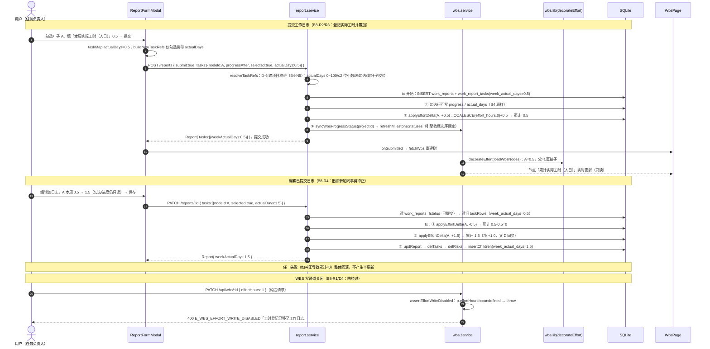
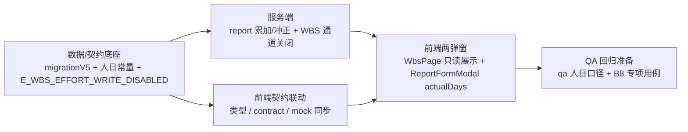

# 工时登记时机与单位修正（B8）· 增量架构设计与任务分解

> 作者：高见远（架构师）　|　基线：B7 已交付（`wbs_nodes.effort_hours(h)` 列 + WBS 弹窗「工时(h)」输入 + 父节点 Σ 只读 + `E_WBS_EFFORT_PARENT` + `decorateEffort`）；B5 已交付工作日志（`ReportFormModal` + `work_reports`/`work_report_tasks`）
> 输入：`docs/B8-增量PRD.md`（R1~R7 + Q1~Q5 均有推荐）
> 性质：**增量设计，对 B7 的语义重构（工时登记时机 + 单位），最小变更**——只列需要改的文件与改动点。
> 本文档是**工程师唯一施工依据**；与 `B8-增量PRD.md`、历史文档冲突时，**以本文为准**（已对照真实代码逐行校准）。
> ⚠️ 纯文档产出：**不写代码、不碰数据库**（本文只给 DDL/伪代码级说明，供工程师落地）。

---

## 〇、现状定位（对照真实代码，B7 基线）

| 关注点 | 现状（已核对） |
|---|---|
| 迁移 | `server/dal/migrations.js`：v1~v4，当前 v4；`migrationV4` 已建 `wbs_nodes.effort_hours REAL`（可空默认 NULL）；`work_report_tasks` 现列 = `id/report_id/node_id/node_code/node_name/progress_before/progress_after/selected`，**无 week_actual_days**；`hasColumn` 幂等守卫范式成熟 |
| WBS 写通道 | `server/services/wbs.service.js`：`assertEffortHours`（父→E_WBS_EFFORT_PARENT / 叶→0~1000 校验）；`createWbsNode` INSERT 带 `effort_hours`（`Number(p.effortHours)||0`）+ 清父 NULL；`updateWbsNode` B7 块（L434~450）写列 + diff「工时(h)」；`move/delete` 清父 NULL |
| WBS 读 | `server/lib/wbs.js#decorateEffort`：叶=存储值、父=Σ直接子 + `effortChildCount`（**B8 无需改算法**）；`server/lib/mappers.js#toApiWbsNode` 已映射 `effortHours: toNum(row.effort_hours, 0)` |
| 周报服务 | `server/services/report.service.js`：`resolveTaskRefs`（D-6 跨项目校验 B4-N5、返回 estimateDays）、`createReport(db,payload,me,submit)`（submit=true 才：进度回写 + 快照 + `syncWbsProgressStatus→refreshMilestoneStatuses` + 事务外审计）、`updateReport`（只改正文+子行整体重建，**不写进度/状态/快照**）、`insertChildren`/`taskRowToApi` 均无实际工时字段；**无 deleteReport** |
| 周报路由 | `server/routes/reports.routes.js`：GET 列表 / GET :week / POST（submit 区分）/ PATCH :id；**无 DELETE**（`legacy.routes.js` 的 DELETE 是旧版扁平 reports 表，与新嵌套表无关，本期不动） |
| 前端契约 | `web/src/types/wbs.ts#WbsNode`（effortHours 注释小时）、`web/src/types/report.ts#ReportTaskRow/ReportTaskRef`（无实际工时）、`web/src/api/contract.ts#WbsNodePayload`（effortHours?）、`ReportPayload.tasks`（nodeId/progressAfter/selected） |
| 前端页面 | `web/src/pages/projects/WbsPage.tsx`：`NodeForm.effortHours` + `isEffortEditable` + 弹窗「工时(h)」字段（L614~643）+ handleSubmit 携带；`web/src/components/report/ReportFormModal.tsx`：`taskMap{progressAfter,selected}`、`buildNewTaskRefs`/`assemble`、`renderTaskTree` 行内进度输入（无 actualDays） |
| 常量/错误码 | `server/config/enums.js` + `web/src/config/enums.ts`：`EFFORT_HOURS_MAX = 1000`（B7）；`server/lib/errors.js` + `web/src/types/api.ts`：`E_WBS_EFFORT_PARENT` 双份 |
| Mock | `web/src/api/mock/index.ts`：镜像 B7（decorateEffort / assertEffortHours / create·update 写 effortHours / upsertReport·updateReport 无 actualDays）；`USE_MOCK` 默认 true → **mock 必须同步，否则演示态与后端语义分叉** |
| 当前 pm.db | 已清空无存量业务数据（B8 PRD Q4）→ **无需单位换算/回填** |
| 既有 QA | `scripts/qa_b7_verify.mjs`：75 条小时口径断言（R1 列 / R2 弹窗边界 / R3 父 Σ / R4 防绕过 / R5 实时重算+回滚）；`docs/qa_regression_report_b7.md` 已存在 |

> ⚠️ **结论**：B8 是「语义重构 + 通道转移」，后端核心 = migrationV5（1 列）+ report.service（累加/冲正）+ wbs.service（**删** B7 写逻辑 + 关通道）；前端核心 = ReportFormModal 行内 actualDays + WbsPage 移除输入改只读。**`decorateEffort` 算法零改动**（读时 Σ 语义天然复用），路由零改动。

---

## 一、增量设计（Part A）

### 1. 关键决策

#### 决策 D-B8-1（Q1）：**保留 `effort_hours` 列名与 `effortHours` 出参名，语义改为「累计实际工时（人日）」**；绝不 RENAME 到 `actual_days`（B3 已占用=estimate×进度折算值）

权衡：

| 维度 | 方案 A：保留列名（推荐） | 方案 B：RENAME `cum_actual_days` |
|---|---|---|
| DDL 面 | migrationV5 **零 wbs_nodes DDL**（仅 work_report_tasks 加 1 列） | 需 `ALTER TABLE wbs_nodes RENAME COLUMN effort_hours TO cum_actual_days`（SQLite 支持，但多一次结构性迁移） |
| 代码面 | mappers/lib/service/前端类型字段名不动，仅注释/语义变 | mappers、decorateEffort 输入、QA 列断言全部改字段名，回归面大 |
| QA 面 | 列断言仅改「语义注释」，字段名不变 | `qa_b7_verify.mjs` R1 列断言 + R5-5 出参字段名全部改 |
| 语义清晰度 | 名字带 hours 有历史歧义（用注释+共享约定消除） | 更好，但与「基于现有代码最小变更」冲突 |
| 用户建议的 `actual_days` | **不可用**（B3 进度折算值，冲突） | 不可用（同上） |

**结论**：方案 A。歧义由注释与共享约定 §新增-1 消除；未来若确需语义化列名，另起 P2 专项（SQLite RENAME COLUMN 支持），本期不欠功能债。

**migrationV5 具体 DDL**（`server/dal/migrations.js` 新增，幂等范式同 v4）：

```sql
-- ① work_report_tasks 新增本周实际人日列（B8-R3）
ALTER TABLE work_report_tasks ADD COLUMN week_actual_days REAL NOT NULL DEFAULT 0;
-- ② wbs_nodes 无 DDL：effort_hours 语义改为「累计实际工时（人日）」，列类型/可空/默认均沿用 v4
-- ③ 存量处置：pm.db 已清空，无需数据回填/换算（Q4 仅作规则预留）
```

注册：`{ version: 5, name: 'connect-v5-report-week-actual-days', up: migrationV5 }`。

#### 决策 D-B8-2（Q2）：**本期不新增日志删除入口**；「删除扣减」作规则预留

- 现状无 `deleteReport` 接口/入口（`contract.ts` 仅有 save/submit/update；`legacy.routes.js` 的 DELETE 是旧扁平表，无关）。
- 本期 R4 可验收范围为：**编辑冲正（旧扣新加）+ 草稿不累加**；删除扣减的 SQL/顺序与冲正完全同构（见 D-B8-4 的 `applyEffortDelta` 负 delta 分支），未来删除能力落地时直接复用，无需改累加引擎。
- `docs/B8-增量PRD.md` Q2 推荐采纳。

#### 决策 D-B8-3（Q3）：**单次上限 `WEEK_ACTUAL_DAYS_MAX = 100`（人日/次）+ 累计上限 `EFFORT_DAYS_CUM_MAX = 10000`（人日）**，替换 B7 的 `EFFORT_HOURS_MAX = 1000(h)`

- 常量**改名**而非沿用：`EFFORT_HOURS_MAX` 字面带 hours，与 B8 人日语义冲突，继续使用会放大歧义；且 B8 后其唯一使用点（wbs.service 校验、WbsPage 输入）均被删除，改名零额外文件（仅 2 个 enums + 使用点，全部已在改动清单内）。
- 前后端双份（沿用 `GRANULARITY_LIMIT` 模式）：`server/config/enums.js` ↔ `web/src/config/enums.ts`。
- 校验点：单次上限在 `resolveTaskRefs`（report.service）；累计上限在 `applyEffortDelta`（防溢出 + 防负数）。

#### 决策 D-B8-4（R3/R4）：**累加与冲正全部收敛到 report.service 私有函数 `applyEffortDelta(db, nodeId, delta, ts)`**，在日志事务内调用

- **位置**：`report.service.js` 内部私有（不导出、不加到 wbs.service——B8 后 WBS 域与工时彻底解耦，未来 deleteReport 同属 report 域可复用）。
- **行为**：
  1. `delta === 0` → 直接返回（不写库、不碰 updated_at）；
  2. `SELECT effort_hours FROM wbs_nodes WHERE id = ?`；节点不存在 → 静默返回（节点已删，其累计随行消亡，冲正无意义）；
  3. `next = (Number(row.effort_hours) || 0) + delta`（`COALESCE` 语义，兼容历史 NULL）；
  4. `next < 0 || next > EFFORT_DAYS_CUM_MAX` → `throw E_VALIDATION`（message 含人日口径；冲正扣过头/溢出均整体回滚）；
  5. `UPDATE wbs_nodes SET effort_hours = ?, updated_at = ? WHERE id = ?`。
- **submit（createReport）时序**（B8 增量，插入点见下方调用流）：
  ```
  tx {
    insReport → insertChildren(带 week_actual_days)
    if (isSubmit) {
      ① applied.forEach → updNodeProgress(progress/actual_days 回写)   // B4 原样
      ② applied.forEach → applyEffortDelta(nodeId, +actualDays)        // ★ B8 累加（0 为 no-op）
      ③ syncWbsProgressStatus → refreshMilestoneStatuses               // 引擎收尾次序恒定，不可换
    }
  }
  ```
  > ⚠️ ①与②次序无关（不同列），②放在①之后、③之前，**引擎收尾次序不破坏**；B4-N5 的 project_id 真源校验在 `resolveTaskRefs`（跨项目引用仍 E_VALIDATION）；B5 lockMode 是前端语义，服务端不感知，无冲突。
- **编辑冲正（updateReport）时序**：
  ```
  row = SELECT * FROM work_reports WHERE id = ?            // status 是冲正开关
  wasSubmitted = row.status === '已提交'
  oldTaskRows = SELECT * FROM work_report_tasks WHERE report_id = ?   // 在 delTasks 之前读出
  taskRefs = resolveTaskRefs(...)                           // 新值校验（含 actualDays 规则）
  tx {
    if (wasSubmitted) {
      oldTaskRows.forEach(t => applyEffortDelta(nodeId, -(week_actual_days||0)))   // ① 旧值全扣
      taskRefs.filter(selected).forEach(t => applyEffortDelta(nodeId, +actualDays)) // ② 新值全加
    }
    updReport → delTasks → delRisks → insertChildren        // 正文/子行重建（B4 原样）
  }
  ```
  > 净效果 = 每节点 `new - old`；同一事务，任一失败整体回滚；草稿（wasSubmitted=false）不扣不加；编辑周次/正文/风险不影响累计（①②只按任务行算）。
- **防绕过**（R5，`resolveTaskRefs` 内）：`actualDays` 缺失视为 0；携带时校验 `Number.isFinite && 0 ≤ v ≤ WEEK_ACTUAL_DAYS_MAX && Math.round(v*100)/100 === v`（≤2 位小数），非法 → E_VALIDATION；**未勾选携带 actualDays → E_VALIDATION（拒绝）**；**非叶子携带 actualDays → E_VALIDATION（拒绝，防构造请求把累计写到父节点上被 Σ 隐藏）**。save 与 submit 同样执行（结构性非法，草稿也不该产生）。

#### 决策 D-B8-5（Q5/R1）：**WBS 写通道彻底关闭**——`effort_hours` 唯一写入方 = 日志 submit/已提交日志编辑

- `wbs.service.js`：
  - **删除** `assertEffortHours`（连同 create/update 调用点）；
  - `createWbsNode`：INSERT 列清单**去掉 `effort_hours`**（新节点落库 NULL → decorateEffort 展示 0；`COALESCE` 累加兼容）；删除「清父 NULL」UPDATE（B7 D-B7-3 移除，见破坏点 D9/D10）；
  - `updateWbsNode`：删除 B7 工时块（L434~450）；新增**前置守卫** `if (p.effortHours !== undefined) throw E_WBS_EFFORT_WRITE_DISABLED`；
  - `createWbsNode` 同步加同一守卫（任意 WBS 写携带 effortHours → 400，防绕过 D4）；
  - `moveWbsNode`/`deleteWbsNode`：删除「清父/清新父/清原父 NULL」UPDATE（WBS 写路径不再触碰 effort_hours）。
- **错误码**：新增 `E_WBS_EFFORT_WRITE_DISABLED`（400，message「工时登记已移至工作日志，WBS 不再支持填写工时」），**server/errors.js ↔ web/types/api.ts 双份同步**；`E_WBS_EFFORT_PARENT` **保留定义不删除**（稳定契约 + 旧客户端/旧 QA 兼容），但**不再被任何业务路径抛出**。
- `lib/wbs.js#decorateEffort` / `lib/mappers.js#toApiWbsNode`：**算法零改动**（叶=存储累计值、父=Σ直接子、effortChildCount 不变），仅更新注释语义（人日）。

#### 决策 D-B8-6（R1 前端）：WbsPage 移除输入 + 只读展示

- `NodeForm` 删除 `effortHours`；`EMPTY_FORM`/`openEdit`/`openCreate`/`changeParent` 同步清理；`isEffortEditable` 派生删除；`handleSubmit` 删除 B7 校验块与 payload 携带（**payload 不再含 effortHours**）；删除 `EFFORT_HOURS_MAX` import。
- 弹窗在原「工时(h)」位置改为**只读展示行**「累计实际工时（人日）」（`Typography` 文本行，不进 form state）：
  - 编辑态：值 = `editingNode.effortHours`（服务端装饰值）；父节点 helperText「由 N 个子任务汇总（只读，由工作日志累计）」；叶子「由工作日志累计（只读）」；
  - 新建态：显示「0（提交工作日志后累计）」。
- 树行/看板不加列（R7 本期不做）。

#### 决策 D-B8-7（R2 前端）：ReportFormModal 行内「本周实际工时（人日）」交互矩阵

| 场景 | checkbox | 完成进度(%) | 本周实际工时（人日） |
|---|---|---|---|
| 新建 · 叶子 · 勾选 | 可编辑 | 可编辑 | **可编辑**（min 0 / step 0.5 / max 100） |
| 新建 · 叶子 · 未勾选 | 可编辑 | 可编辑 | disabled 灰显（值保留但不提交） |
| 新建 · 父节点 | disabled + Tooltip（B5） | disabled | disabled（恒） |
| lockMode · 锁定叶子 | checked + disabled + 锁图标 | 可编辑（B5） | **可编辑** |
| lockMode · 其他节点 | disabled | disabled | disabled |
| 编辑态（已提交）· 勾选叶子 | disabled（B5 只读） | disabled（B5 只读） | **可编辑（冲正入口，回显原值）** |
| 编辑态 · 未勾选叶子 | disabled | disabled | disabled |
| 编辑态 · 父节点 | disabled | disabled | disabled |

- `taskMap` 增 `actualDays`；编辑态初始化 `actualDays: t.weekActualDays ?? 0`；新建态 `0`。
- `buildNewTaskRefs`：`actualDays: isParent || !selected ? undefined : (taskMap[n.id]?.actualDays ?? 0)`（**仅勾选行携带**，父/未勾选 undefined）。
- `assemble` 编辑分支：`actualDays: taskMap[t.nodeId]?.actualDays ?? t.weekActualDays ?? 0`（用可编辑的新值，非原行值）。
- 编辑态区域 caption 改为：「编辑已提交日志：勾选与进度只读，本周实际工时可修改（保存后自动冲正累计）」；新建态追加「仅勾选任务可登记实际工时」。
- 提交/编辑时对 actualDays 做前端校验（0~100、≤2 位小数），非法 toast 并 return（不调接口）；存草稿允许任意值（同进度语义）。

### 2. 文件清单（增量，只列要改/新增的文件）

| 文件（相对 `pm-app/`） | 动作 | 一句话改动 |
|---|---|---|
| `server/dal/migrations.js` | **改** | 新增 `migrationV5`（`work_report_tasks` 加 `week_actual_days REAL NOT NULL DEFAULT 0`，`hasColumn` 幂等守卫）+ 注册 v5 `connect-v5-report-week-actual-days` |
| `server/config/enums.js` | **改** | 删除 `EFFORT_HOURS_MAX`；新增 `WEEK_ACTUAL_DAYS_MAX = 100`（单次·人日）、`EFFORT_DAYS_CUM_MAX = 10000`（累计·人日）；导出 |
| `server/lib/errors.js` | **改** | 新增 `E_WBS_EFFORT_WRITE_DISABLED`（ErrorCode + CODE_HTTP 400 + ERROR_MESSAGE_ZH）；`E_WBS_EFFORT_PARENT` 保留 |
| `server/services/report.service.js` | **改**（核心） | `resolveTaskRefs` 增 actualDays 校验（0~100/≤2 位小数/未勾选拒绝/非叶子拒绝）+ 返回 `actualDays`、`isLeaf`；`insertChildren` 增 week_actual_days；`taskRowToApi` 增 `weekActualDays`；`createReport` submit 时 `applied.forEach → applyEffortDelta(+actualDays)`；`updateReport` 已提交日志先扣旧后加新（同事务）；新增私有 `applyEffortDelta`（累计上限/负数校验） |
| `server/services/wbs.service.js` | **改**（核心） | 删除 `assertEffortHours` 与全部调用；`createWbsNode` INSERT 去 effort_hours + 去清父 NULL；`updateWbsNode` 删 B7 块 + 前置 `assertEffortWriteDisabled`（携带 effortHours → `E_WBS_EFFORT_WRITE_DISABLED`）；`move/delete` 去清父 NULL |
| `server/lib/wbs.js` | **改**（仅注释） | `decorateEffort` 算法不动；注释改为「effortHours=累计实际工时（人日），叶=日志累加、父=Σ直接子」 |
| `server/lib/mappers.js` | **改**（仅注释） | `toApiWbsNode.effortHours` 映射不动；注释语义改人日 |
| `server/routes/reports.routes.js` | **复核（不改）** | 无 DELETE（Q2 采纳）；POST/PATCH 透传 actualDays 自动生效 |
| `server/routes/wbs.routes.js` | **复核（不改）** | 出参透传；守卫在 service 层，路由零改动 |
| `web/src/types/wbs.ts` | **改** | `WbsNode.effortHours` 注释改「累计实际工时（人日）」（字段名不变） |
| `web/src/types/report.ts` | **改** | `ReportTaskRow` 增 `weekActualDays: number`；`ReportTaskRef = Pick<...> & { actualDays?: number }` |
| `web/src/api/contract.ts` | **改** | `WbsNodePayload` **删** `effortHours?`；`ReportPayload.tasks` 增 `actualDays?: number` |
| `web/src/types/api.ts` | **改** | ErrorCode 增 `E_WBS_EFFORT_WRITE_DISABLED` + ERROR_MESSAGE_ZH（与后端逐字一致）；`E_WBS_EFFORT_PARENT` 保留 |
| `web/src/config/enums.ts` | **改** | 删除 `EFFORT_HOURS_MAX`；新增 `WEEK_ACTUAL_DAYS_MAX = 100`、`EFFORT_DAYS_CUM_MAX = 10000` |
| `web/src/pages/projects/WbsPage.tsx` | **改**（核心前端） | 移除 effortHours 表单字段/输入/校验/payload；弹窗加只读「累计实际工时（人日）」展示行；清理 `isEffortEditable` 与 `EFFORT_HOURS_MAX` import |
| `web/src/components/report/ReportFormModal.tsx` | **改**（核心前端） | `TaskProgress`/`taskMap` 增 actualDays；`renderTaskTree` 行内加「本周实际工时（人日）」输入（交互矩阵 D-B8-7）；`buildNewTaskRefs`/`assemble` 携带 actualDays（仅勾选）；编辑态 caption 更新；前端校验 |
| `web/src/api/mock/index.ts` | **改**（同步） | 镜像后端：create/updateWbsNode 去 effortHours 写 + 加 E_WBS_EFFORT_WRITE_DISABLED 守卫；upsertReport/updateReport 增 weekActualDays + 累加/冲正 |
| `web/src/api/mock/fixtures/reports.ts` | **改** | `ReportTaskRow` 构造补 `weekActualDays`（类型必填，示例值 0/随机） |
| `web/src/api/mock/fixtures/wbs.ts` | **改**（可选） | 示例节点 `effortHours` 语义注释更新（字段保留） |
| `web/src/stores/flowStore.ts` | **复核（不改）** | payload 透传泛型已覆盖 |
| `web/src/api/http.ts` | **复核（不改）** | payload 透传 |
| `scripts/qa_b7_verify.mjs` | **改**（→ B8 口径） | 75 条小时口径断言更新为人日口径（受影响类别见 §6），建议重命名 `qa_b8_verify.mjs` |
| `docs/qa_regression_report_b8.md` | **新增** | B8 回归报告模板（R1~R5 验收要点 + B8 专项用例清单 + 既有回归面） |

> 明确不改：`project.service.js`（骨架 INSERT 无 effort_hours，天然 NULL，符合新语义）、`milestone.service.js`、`board.service.js`、`utils/wbs.ts`（进度加权仍 estimateDays，R6 不做）、`utils/reportAgg.ts`（selected 口径不变）、`wbsStore.ts`、`theme/tokens.ts`。

### 3. 数据 / 接口变更

| 项 | 变更 | 说明 |
|---|---|---|
| `work_report_tasks`（migrationV5） | `ALTER TABLE work_report_tasks ADD COLUMN week_actual_days REAL NOT NULL DEFAULT 0` | 本周实际工时（人日）；幂等 `hasColumn` 守卫；v5 记录 `connect-v5-report-week-actual-days` |
| `wbs_nodes.effort_hours` | **无 DDL**，语义改为「累计实际工时（人日）」 | 叶子 = 历次已提交日志 actualDays 累加；父恒 NULL（WBS 写路径不再触碰）；`COALESCE` 兼容历史 NULL |
| `POST/PATCH /projects/:projectId/reports` 请求体 | `ReportPayload.tasks[]` 增可选 `actualDays?: number` | 本周实际人日；仅勾选叶子行携带；未勾选/父节点携带 → 400 E_VALIDATION |
| `Report` 出参 `ReportTaskRow` | 增 `weekActualDays: number` | 回显该日志行本周实际人日（编辑态回填源） |
| `WbsNode` 出参 | `effortHours` 字段名/算法不变，语义=累计实际人日 | 叶=日志累加存储值；父=Σ直接子（decorateEffort）；`effortChildCount` 不变 |
| `WbsNodePayload` | **删** `effortHours?: number` | WBS 创建/编辑不再接受该字段；携带 → 400 `E_WBS_EFFORT_WRITE_DISABLED` |
| 错误码 | 新增 `E_WBS_EFFORT_WRITE_DISABLED`（400） | 双份（server/errors.js ↔ web/types/api.ts）；`E_WBS_EFFORT_PARENT` 保留不再抛出 |
| 常量 | 删 `EFFORT_HOURS_MAX`；增 `WEEK_ACTUAL_DAYS_MAX=100`、`EFFORT_DAYS_CUM_MAX=10000` | 双份（server/config/enums.js ↔ web/src/config/enums.ts） |

### 4. 类图（增量 · Mermaid）

```mermaid
classDiagram
    class ReportTaskRow {
        +string reportId
        +string nodeId
        +number progressAfter
        +boolean selected
        +number weekActualDays  // B8 新增：本周实际人日（出参）
    }
    class ReportTaskRef {
        +string nodeId
        +number progressAfter
        +boolean selected
        +number actualDays  // B8 新增：本周实际人日（入参，仅勾选携带）
    }
    class ReportPayload {
        +tasks: ReportTaskRef[]  // B8：增 actualDays?
    }
    class WbsNode {
        +number effortHours  // B8 语义：累计实际工时（人日）；叶=日志累加、父=Σ直接子
        +number effortChildCount
    }
    class WbsNodePayload {
        -effortHours  // B8：删除；WBS 写携带 → E_WBS_EFFORT_WRITE_DISABLED
    }
    class reportService {
        +createReport(db, payload, me, submit) Report  // B8：submit 累加 applyEffortDelta(+actualDays)
        +updateReport(db, id, payload, me) Report      // B8：已提交先扣旧后加新（同事务）
        -resolveTaskRefs(db, rawTasks, projectId) Ref[] // B8：actualDays 校验 + 未勾选/非叶子拒绝
        -applyEffortDelta(db, nodeId, delta, ts) void   // B8 新增：0≤累计≤EFFORT_DAYS_CUM_MAX
        -insertChildren(db, reportId, taskRefs, riskRefs) void  // B8：写 week_actual_days
        -taskRowToApi(row) ReportTaskRow                // B8：映射 weekActualDays
    }
    class wbsService {
        +loadNodes(db, projectId) WbsNode[]  // decorateEffort 不变
        +createWbsNode(...) WbsNode          // B8：去 effort_hours 写 + assertEffortWriteDisabled
        +updateWbsNode(...) WbsNode          // B8：删 B7 块 + assertEffortWriteDisabled
        -assertEffortWriteDisabled(p) void   // B8 新增：p.effortHours!==undefined → E_WBS_EFFORT_WRITE_DISABLED
        -assertEffortHours(...) void         // B8：删除
    }
    class enums {
        +WEEK_ACTUAL_DAYS_MAX = 100   // B8：单次登记上限（人日）
        +EFFORT_DAYS_CUM_MAX = 10000  // B8：累计上限（人日）
        -EFFORT_HOURS_MAX             // B8：删除（1000h）
    }
    class errors {
        +E_WBS_EFFORT_WRITE_DISABLED  // B8 新增：400
        +E_WBS_EFFORT_PARENT          // 保留，不再抛出
    }
    class ReportFormModal {
        -taskMap: Record~id, {progressAfter, selected, actualDays}~  // B8：+ actualDays
        +renderTaskTree() JSX  // B8：行内「本周实际工时（人日）」输入（交互矩阵）
        -buildNewTaskRefs() ReportTaskRef[]  // B8：仅勾选携带 actualDays
    }
    class WbsPage {
        -form: NodeForm  // B8：- effortHours
        +handleSubmit() void  // B8：payload 无 effortHours
        -renderEffortReadonly() JSX  // B8：只读「累计实际工时（人日）」
    }
    reportService --> reportService : applyEffortDelta
    reportService --> enums : WEEK_ACTUAL_DAYS_MAX / EFFORT_DAYS_CUM_MAX
    wbsService --> errors : E_WBS_EFFORT_WRITE_DISABLED
    reportService --> wbsService : syncWbsProgressStatus（引擎收尾次序不变）
    ReportFormModal --> ReportPayload : tasks[].actualDays（仅勾选）
    WbsPage --> WbsNode : effortHours 只读展示
```

### 5. 程序调用流（增量 · Mermaid）



### 6. 待明确事项（沿用 PRD Q1~Q5 推荐，无阻塞）

| ID | 问题 | 本设计采用 | 备注 |
|---|---|---|---|
| Q1 | `effort_hours` 列是否 RENAME | **方案 A：保留列名/字段名，语义改人日**（D-B8-1） | 绝不 RENAME 到 `actual_days`（B3 占用）；未来语义化 RENAME 可另起 P2 |
| Q2 | 日志删除能力缺失 | **本期不新增删除入口**；删除扣减 = 规则预留（复用 applyEffortDelta 负 delta） | 未来加 deleteReport 时在事务内对每行 `applyEffortDelta(-week_actual_days)` |
| Q3 | 单次/累计上限 | 单次 `100` 人日、累计 `10000` 人日（可配常量） | 超限 E_VALIDATION |
| Q4 | 存量 effort_hours（小时）换算 | pm.db 已清空**无需换算**；未来环境默认 0 起步不回填（或 8h=1 人日，产品再定） | 若未来需要，追加迁移脚本 |
| Q5 | 编辑态放开是否破坏 B5 只读口径 | **仅放开「本周实际工时」**，勾选/进度维持只读（D-B8-7） | QA 断言加例外 |
| 补充 | 叶子成为父节点后自身累计值 | 存储值保留但不展示（父展示=Σ子，decorateEffort 口径不变）；恢复叶子时值重现 | 不采用「父=自身+Σ子」（破坏 B7 Σ 语义）；不采用 B7 清 NULL（会销毁已登记真实数据） |
| 补充 | 累计上限 10000 对超长期项目 | 可配常量，后续按需调 | — |
| 补充 | 日志详情弹窗展示每行本周实际工时 | **本期不做**（P2 可选，出参已带 weekActualDays，未来零后端改动） | — |
| 补充 | 审计 summary 是否记录登记人日 | 本期保持现状（可选项，工程师可顺手在 summary 追加「登记 M 人日」） | — |

---

## 二、任务分解（Part B）

> 共 **5 个任务**，按实现顺序 T01→T05。T02/T03 依赖 T01（数据/契约底座）；T04 依赖 T02+T03；T05 依赖 T04。
> 所有路径相对 `pm-app/`。

### 【T01】数据与契约底座：migrationV5 + 人日常量 + E_WBS_EFFORT_WRITE_DISABLED　`P0`

**依赖**：无（首个任务）
**目的**：列先建好、常量与错误码先定义，后续任务直接引用。

| 文件 | 动作 |
|------|------|
| `server/dal/migrations.js` | **改**：新增 `function migrationV5(db, now)`——`if (!tableExists(db,'work_report_tasks')) return; if (!hasColumn(db,'work_report_tasks','week_actual_days')) db.exec('ALTER TABLE work_report_tasks ADD COLUMN week_actual_days REAL NOT NULL DEFAULT 0');`（幂等）；注册 `{ version: 5, name: 'connect-v5-report-week-actual-days', up: migrationV5 }`；`wbs_nodes.effort_hours` 零 DDL（语义变更注释） |
| `server/config/enums.js` | **改**：删 `EFFORT_HOURS_MAX`；增 `const WEEK_ACTUAL_DAYS_MAX = 100;`（注释：单次登记上限·人日）与 `const EFFORT_DAYS_CUM_MAX = 10000;`（注释：累计上限·人日）+ module.exports |
| `server/lib/errors.js` | **改**：ErrorCode 增 `E_WBS_EFFORT_WRITE_DISABLED`；CODE_HTTP 400；ERROR_MESSAGE_ZH「工时登记已移至工作日志，WBS 不再支持填写工时」；`E_WBS_EFFORT_PARENT` 保留 |
| `web/src/types/api.ts` | **改**：ErrorCode 增 `E_WBS_EFFORT_WRITE_DISABLED` + ERROR_MESSAGE_ZH 同文案；`E_WBS_EFFORT_PARENT` 保留 |
| `web/src/config/enums.ts` | **改**：删 `EFFORT_HOURS_MAX`；增 `export const WEEK_ACTUAL_DAYS_MAX = 100;`、`export const EFFORT_DAYS_CUM_MAX = 10000;` |

**验收**：启动自动应用 v5（schema_migrations 有 v5，`work_report_tasks.week_actual_days REAL NOT NULL DEFAULT 0`），重复启动幂等；`E_WBS_EFFORT_WRITE_DISABLED` 两端错误码/文案一致；人日常量两端 = 100 / 10000；`EFFORT_HOURS_MAX` 全仓无残留引用。

---

### 【T02】服务端：日志累加/冲正 + WBS 写通道关闭　`P0`

**依赖**：T01（常量/错误码就绪）
**目的**：R3/R4 服务端原子累加与冲正（含防绕过），R1/D4 WBS 写通道关闭。

| 文件 | 动作 |
|------|------|
| `server/services/report.service.js` | **改**（核心）：
1. `resolveTaskRefs`：返回对象增 `actualDays`（归一化 0）与 `isLeaf`（`SELECT COUNT(*) FROM wbs_nodes WHERE parent_id = ?`）；新增校验——`ref.actualDays !== undefined` 时 `Number.isFinite && 0 ≤ v ≤ WEEK_ACTUAL_DAYS_MAX && Math.round(v*100)/100 === v`，非法 → `E_VALIDATION`（message 含「人日」）；`!ref.selected && ref.actualDays !== undefined` → `E_VALIDATION`（未勾选不可携带）；`!isLeaf && ref.actualDays !== undefined` → `E_VALIDATION`（父节点不可登记）；
2. `insertChildren`：INSERT 列增 `week_actual_days`，值 `t.actualDays`；
3. `taskRowToApi`：增 `weekActualDays: Number(row.week_actual_days) || 0`；
4. 新增私有 `applyEffortDelta(db, nodeId, delta, ts)`：delta===0 返回；节点不存在静默返回；`next=COALESCE(effort_hours,0)+delta`；`next<0 || next>EFFORT_DAYS_CUM_MAX` → `E_VALIDATION`；UPDATE `effort_hours=? , updated_at=?`；
5. `createReport`：`if (isSubmit)` 块内、进度回写循环之后、`syncWbsProgressStatus` 之前，`applied.forEach(t => applyEffortDelta(db, t.nodeId, t.actualDays, ts))`（草稿不累加）；
6. `updateReport`：`wasSubmitted = row.status === '已提交'`；事务**前**读 `oldTaskRows`；事务内——`if (wasSubmitted)` 先 `oldTaskRows.forEach(t => applyEffortDelta(t.node_id, -(week_actual_days||0)))` 再 `taskRefs.filter(selected).forEach(t => applyEffortDelta(t.nodeId, t.actualDays))`；随后原 updReport/del/insert 次序不变 |
| `server/services/wbs.service.js` | **改**（核心）：
1. 删 `assertEffortHours`；新增 `assertEffortWriteDisabled(p)`：`p.effortHours !== undefined` → `throw new AppError(ErrorCode.E_WBS_EFFORT_WRITE_DISABLED, '工时登记已移至工作日志，WBS 不再支持填写工时', {})`；
2. `createWbsNode`：开头（父解析后）调 `assertEffortWriteDisabled(p)`；INSERT 列清单删 `effort_hours`（及对应占位/参数）；删「清父 NULL」UPDATE；
3. `updateWbsNode`：删 L434~450 B7 工时块；开头（requireNodeRow 后）调 `assertEffortWriteDisabled(p)`；
4. `moveWbsNode`：删原父/新父清 NULL UPDATE；`deleteWbsNode`：删清父 NULL UPDATE |
| `server/lib/wbs.js` | **改**（仅注释）：`decorateEffort` 注释改「累计实际工时（人日）：叶=日志累加、父=Σ直接子」 |
| `server/lib/mappers.js` | **改**（仅注释）：`toApiWbsNode.effortHours` 注释改人日语义 |
| `server/routes/reports.routes.js` / `server/routes/wbs.routes.js` | **复核（不改）**：路由透传确认 |

**验收**：提交日志（勾选 A 填 0.5、B 填 2）→ DB A.effort_hours=0.5、B=2、父节点出参 Σ=2.5；存草稿 → 累计不变；未勾选携带 actualDays → 400 E_VALIDATION；父节点携带 actualDays → 400 E_VALIDATION；actualDays 负数/101/100.001 → 400 E_VALIDATION；编辑已提交日志 A 0.5→1.5 → A 累计 +1.0 且父 Σ 同步；A 改 0 → 累计 -0.5；冲正致累计 <0 → 400 E_VALIDATION 整体回滚（无半更新）；编辑草稿不冲正；WBS create/update 携带 effortHours → 400 E_WBS_EFFORT_WRITE_DISABLED 不落库；WBS 增删改移后 effort_hours 不被触碰（新节点 NULL、有日志叶子值不变）。

---

### 【T03】前端契约与类型联动（WbsNode / ReportTaskRow / ReportTaskRef / contract / mock）　`P0`

**依赖**：T01（错误码/常量类型已就绪）
**目的**：类型与接口契约先行，T04 弹窗可编译可用；mock 同步避免演示态分叉。

| 文件 | 动作 |
|------|------|
| `web/src/types/wbs.ts` | **改**：`WbsNode.effortHours` 注释改「累计实际工时（人日）：叶=历次日志累加、父=Σ直接子（服务端计算，只读）」；`effortChildCount` 注释不变 |
| `web/src/types/report.ts` | **改**：`ReportTaskRow` 增 `weekActualDays: number;`（本周实际人日）；`ReportTaskRef = Pick<ReportTaskRow, 'nodeId' \| 'progressAfter' \| 'selected'> & { actualDays?: number }`（注释：仅勾选叶子携带） |
| `web/src/api/contract.ts` | **改**：`WbsNodePayload` 删 `effortHours?`；`ReportPayload.tasks` 类型改 `Array<{ nodeId: string; progressAfter: number; selected: boolean; actualDays?: number }>` |
| `web/src/api/mock/index.ts` | **改**（同步）：`assertEffortHours` → `assertEffortWriteDisabled`（create/update 携带 effortHours → E_WBS_EFFORT_WRITE_DISABLED）；create/update 去 effortHours 写与清 NULL；`upsertReport`：task 映射增 `weekActualDays: t.actualDays ?? 0`，submit 时 `node.effortHours = (node.effortHours ?? 0) + (t.actualDays ?? 0)`（仅勾选）；`updateReport`：读旧行先扣后加（与后端同构） |
| `web/src/api/mock/fixtures/reports.ts` | **改**：`ReportTaskRow` 构造补 `weekActualDays`（0 或示例值） |
| `web/src/api/mock/fixtures/wbs.ts` | **改**（可选）：`effortHours` 注释语义更新 |
| `web/src/api/http.ts` / `web/src/stores/flowStore.ts` | **复核（不改）**：payload 透传 |

**验收**：`tsc` 通过；`ReportTaskRow` 含 weekActualDays、`ReportTaskRef` 含 actualDays?、`WbsNodePayload` 无 effortHours；mock 建/改节点携带 effortHours 报 E_WBS_EFFORT_WRITE_DISABLED；mock 提交日志累加/编辑冲正与后端口径一致。

---

### 【T04】前端两弹窗交互：WbsPage 移除输入+只读展示 / ReportFormModal 行内 actualDays　`P0`

**依赖**：T02 + T03（服务端口径 + 前端类型）
**目的**：R1/R2 交互落地（含 B5 lockMode/编辑态矩阵）。

| 文件 | 动作 |
|------|------|
| `web/src/pages/projects/WbsPage.tsx` | **改**（核心）：
1. `NodeForm` 删 `effortHours`；`EMPTY_FORM` 删；`openEdit`/`openCreate`/`changeParent` 清理对应赋值；
2. 删 `isEffortEditable` 派生；`handleSubmit` 删 B7 校验块与 `...(isEffortEditable ? { effortHours } : {})`；删 `EFFORT_HOURS_MAX` import；
3. `FormDialog` 原「工时(h)」位置改为只读展示行（`Typography`，不进 form state）：编辑态值=`editingNode.effortHours`，父节点 helperText「由 N 个子任务汇总（只读，由工作日志累计）」/叶子「由工作日志累计（只读）」；新建态「0（提交工作日志后累计）」 |
| `web/src/components/report/ReportFormModal.tsx` | **改**（核心）：
1. `interface TaskProgress` 增 `actualDays: number`；
2. 初始化：编辑态 `actualDays: t.weekActualDays ?? 0`；新建态 `actualDays: 0`；
3. `buildNewTaskRefs`：`actualDays: isParent || !selected ? undefined : (taskMap[n.id]?.actualDays ?? 0)`；
4. `assemble` 编辑分支：`actualDays: taskMap[t.nodeId]?.actualDays ?? t.weekActualDays ?? 0`；
5. `renderTaskTree` 每行「完成进度(%)」旁新增 `TextField`「本周实际工时（人日）」`type=number min=0 step=0.5 max={WEEK_ACTUAL_DAYS_MAX}`；`disabled = hasChildren || !t.selected || (lockMode && effectiveLockNodeId !== n.id)`（D-B8-7 矩阵：编辑态勾选行可编辑=冲正入口，未勾选/父/非锁定 disabled）；提交/编辑时前端校验 0~100、≤2 位小数，非法 toast 并 return；
6. 编辑态区域 caption 改「编辑已提交日志：勾选与进度只读，本周实际工时可修改（保存后自动冲正累计）」；新建态追加「仅勾选任务可登记实际工时」；import `WEEK_ACTUAL_DAYS_MAX` from `@/config/enums` |
| `web/src/stores/wbsStore.ts` / `web/src/utils/wbs.ts` / `web/src/utils/reportAgg.ts` | **复核（不改）**：payload 泛型/selected 口径无变化 |

**验收**：WbsPage 弹窗**无**「工时(h)」输入（源码核对+界面反验）；展示「累计实际工时（人日）」只读：叶子=累计、父=Σ+「由 N 个子任务汇总」；新建态显示 0 占位；创建/编辑 payload 无 effortHours。ReportFormModal 行内「本周实际工时（人日）」：新建勾选行可填（0/0.5/整数）、未勾选 disabled 灰显、父节点恒禁用、lockMode 仅锁定行可填；编辑态勾选行该输入可编辑并回显原值，勾选/进度仍只读；负数/超 100/三位小数前端提示且不发请求；存草稿不校验不累加。

---

### 【T05】QA 回归准备：qa_b7_verify.mjs 人日口径 + B8 专项用例清单　`P0`

**依赖**：T04（新功能已落地）
**目的**：把 B7 的 75 条小时口径断言更新为人日口径，并补充日志累加/冲正专项用例。

| 文件 | 动作 |
|------|------|
| `scripts/qa_b7_verify.mjs` | **改**（建议重命名 `qa_b8_verify.mjs` 并在头部注明 B8 人日口径）。受影响断言类别（B8 PRD D1~D8）：
- **R1 列断言**：schema_migrations 增查 v5 `connect-v5-report-week-actual-days`；`wbs_nodes.effort_hours` 仍 REAL（语义人日）；**新增** `work_report_tasks.week_actual_days REAL NOT NULL DEFAULT 0`；
- **R2 弹窗/边界（D1/D2/D5）**：删除「PATCH effortHours=0.5/40/0/1001」类用例；改为「**任何** WBS 写 effortHours → 400 `E_WBS_EFFORT_WRITE_DISABLED`」（叶与父同判，D4 扩展）；边界值移至日志通道：`actualDays` 负数 / 101 / 100.001 / 'abc' → 400 E_VALIDATION；
- **R3 父 Σ 口径（D3/D7）**：父 Σ 断言保留（decorateEffort 不变），但**数据来源改日志**：先建叶 → 提交日志（A 0.5、B 2）→ GET /wbs 父 Σ=2.5、叶=0.5/2；
- **R4 防绕过（D4）**：原「PATCH 父节点 effortHours=999 → E_WBS_EFFORT_PARENT」改为「PATCH 任意节点 effortHours → E_WBS_EFFORT_WRITE_DISABLED」；「改名+effortHours 被拒且 name 不变（事务回滚）」用例保留；`E_WBS_EFFORT_PARENT` 不再出现于任何断言；
- **R5 实时重算/回滚**：重算用例改由「提交多周日志 → 父 Σ 递增」驱动；回滚用例改为「冲正致累计 <0 → E_VALIDATION 且无半更新」；
- **父 NULL 纪律（D9/D10）**：删除「create/move/delete 后父列 NULL」断言（B8 不再清），改为「WBS 写操作不触碰 effort_hours：新节点列 NULL、有日志叶子值不变」；
- **新增专项**：草稿不累加；编辑冲正（0.5→1.5 净 +1.0、改 0 净 -0.5、父 Σ 同步）；未勾选携带 actualDays → E_VALIDATION；父节点携带 actualDays → E_VALIDATION；累计上限（10000）溢出 → E_VALIDATION |
| `docs/qa_regression_report_b8.md` | **新增**：按 B8 PRD §4 验收要点逐条列用例（R1~R5），每条含步骤/预期/通过栏；附「B8 专项用例清单」（日志累加/冲正/防绕过/上限）；附「既有回归清单」：WBS 增删改移、进度汇总（B3）、里程碑状态、周报正文/风险（B5）、看板拖拽、建项骨架（B4） |
| `docs/B8-增量PRD.md` | **复核（不改）**：验收口径逐条对应 |
| `docs/B7-任务分解.md` | **复核（不改）**：B7 旧口径归档参照（脚本可对照差异改） |

**验收**：`qa_b8_verify.mjs`（或更新后 qa_b7_verify.mjs）全绿且计数与人日口径一致；回归文档覆盖 B8-R1~R5 全部验收要点 + B8 专项清单 + 既有回归项；QA 可按文档逐条执行并回填结果。

---

## 三、共享约定（沿用 + 新增）

**沿用既有（不重述）**：信封 `{code:0, data, message}`；出参 camelCase / 库内 snake_case；`E_*` 错误码双份（server/errors.js ↔ web/types/api.ts）；RBAC 守卫次序 `assertWritable → assertCan → 业务校验`；写操作事务内引擎收尾次序 `syncWbsProgressStatus → refreshMilestoneStatuses`（不可换）；叶子口径 SK-4（叶子=无子节点）；排序一律 `compareWbsCode`；审计写在事务内（report 审计在事务外吞异常，lib/audit.js 铁律不变）；常量前后端双份（`GRANULARITY_LIMIT` 模式）；report.service 的 D-6 跨项目校验（B4-N5）以库内 project_id 为真源。

**新增约定（B8）**：

1. **工时唯一口径**：`effort_hours` / `effortHours` 恒指「累计实际工时（人日）」，**禁止再按小时理解**；叶子 = 历次已提交日志 actualDays 累加，父 = Σ 直接子节点（decorateEffort 读时算）；唯一写入方 = 工作日志 submit / 已提交日志编辑（report.service），**WBS API 携带 effortHours → 400 E_WBS_EFFORT_WRITE_DISABLED**。
2. **week_actual_days** = 该日志行本周实际人日（0 ≤ v ≤ 100、≤2 位小数、NOT NULL DEFAULT 0）；草稿行也落库但**不累计**。
3. **累加/冲正原子性**：一切累计变更在日志事务内经 `applyEffortDelta` 完成——`0 ≤ 新累计 ≤ EFFORT_DAYS_CUM_MAX`，节点不存在静默跳过，非法抛 E_VALIDATION 整体回滚；编辑已提交日志 = 先扣旧后加新（净 delta）；编辑草稿/正文/周次/风险不触累计。
4. **WBS 写路径不触碰 effort_hours**（取代 B7「写路径清 NULL」纪律）：create/update/move/delete 均不读不写该列；新节点落库 NULL（展示 0）；叶子积累后成为父 → 自身存储值保留但展示走 Σ 子（恢复叶子时值重现）；历史 NULL 由 `COALESCE` 兼容。
5. **防绕过**：未勾选行携带 `actualDays`、非叶子节点携带 `actualDays` → 400 E_VALIDATION（save 与 submit 同判）。
6. **常量**：`WEEK_ACTUAL_DAYS_MAX = 100`（单次）、`EFFORT_DAYS_CUM_MAX = 10000`（累计），前后端各一份；`EFFORT_HOURS_MAX` 全仓删除。
7. **错误码**：`E_WBS_EFFORT_WRITE_DISABLED`（400）双份；`E_WBS_EFFORT_PARENT` 保留定义、不再抛出（兼容旧客户端/旧 QA）。
8. **编辑态例外**：B5「编辑已提交日志任务区只读」的唯一例外 = 「本周实际工时（人日）」输入放开（冲正入口），勾选与「完成进度(%)」维持只读。

---

## 四、任务依赖图



| 任务 | 依赖 | 优先级 | 主要文件 |
|---|---|---|---|
| T01 数据/契约底座 | — | P0 | migrations.js、server/config/enums.js、server/lib/errors.js、web/src/types/api.ts、web/src/config/enums.ts（改） |
| T02 服务端累加/冲正 + WBS 通道关闭 | T01 | P0 | server/services/report.service.js、server/services/wbs.service.js（改）+ server/lib/wbs.js、server/lib/mappers.js（注释）+ 路由（复核） |
| T03 前端契约联动 | T01 | P0 | web/src/types/wbs.ts、web/src/types/report.ts、web/src/api/contract.ts、web/src/api/mock/index.ts、web/src/api/mock/fixtures/reports.ts（改）+ http.ts、flowStore.ts（复核） |
| T04 前端两弹窗交互 | T02+T03 | P0 | web/src/pages/projects/WbsPage.tsx、web/src/components/report/ReportFormModal.tsx（改）+ stores/utils（复核） |
| T05 QA 回归准备 | T04 | P0 | scripts/qa_b7_verify.mjs（→qa_b8_verify.mjs，改）+ docs/qa_regression_report_b8.md（新增）+ PRD/B7 文档（复核） |

---

## 五、验收口径（对照 B8 PRD §4，简表）

| ID | 关键验收 |
|---|---|
| R1 | WbsPage 弹窗无「工时(h)」输入；「累计实际工时（人日）」只读（叶=累计、父=Σ+N 子汇总文案）；payload 无 effortHours；构造 WBS 写携带 effortHours → 400 E_WBS_EFFORT_WRITE_DISABLED |
| R2 | 日志行内「本周实际工时（人日）」输入：勾选可填（0/0.5/≤100）、未勾选 disabled、父恒禁用；编辑态勾选行可编辑回显原值；非法值前端提示 + 后端 E_VALIDATION |
| R3 | migrationV5 幂等；`work_report_tasks.week_actual_days REAL NOT NULL DEFAULT 0`；提交日志 → 叶累计 +、父 Σ 同步；草稿不累加；无存量换算 |
| R4 | 编辑已提交日志 0.5→1.5 → 净 +1.0、改 0 → 净 -0.5、父 Σ 同步；失败整体回滚；编辑正文/周次/风险不影响累计；删除扣减规则预留（本期无入口） |
| R5 | actualDays 0~100/≤2 位小数校验；未勾选/父节点携带 actualDays → 400 E_VALIDATION；累计 0≤v≤10000（负数/溢出 → E_VALIDATION）；父节点读时 Σ 与 effortChildCount 一致 |
| R6/R7 | 本期不做（进度加权仍 estimateDays；WBS 列表/看板不加累计工时列） |
