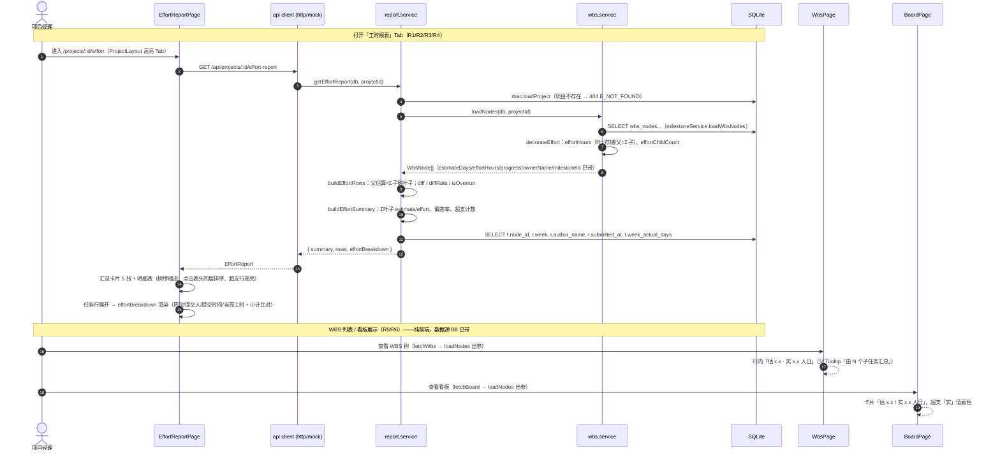
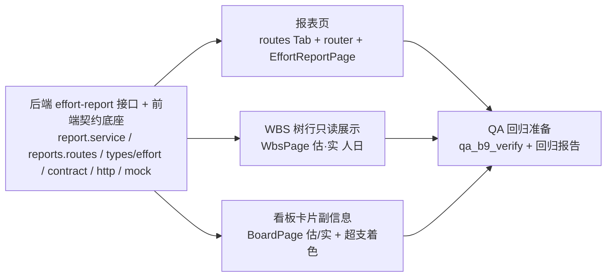

# 工时统计报表 + 列表/看板展示累计工时（B9）· 增量架构设计与任务分解

> 作者：高见远（架构师）　|　基线：B8 已交付（`wbs_nodes.effort_hours` 语义=累计实际工时（人日）、工作日志 submit 累加/编辑冲正、`decorateEffort` 出参 `effortHours`+`effortChildCount`、`work_report_tasks.week_actual_days`）
> 输入：`docs/B9-增量PRD.md`（R1~R8，用户已确认 **A（工时统计报表）+ C（任务列表/看板展示累计工时）**；R7 导出 CSV / R8 跨项目报表 = P1 本期不做）
> 性质：**增量设计，对 B8 的读侧展示扩展，最小变更**——只列需要改的文件与改动点，不写代码、不碰数据库。
> 本文档是**工程师唯一施工依据**；与 `B9-增量PRD.md`、历史文档冲突时，**以本文为准**（已对照真实代码逐行校准）。

---

## 〇、现状定位（对照真实代码，B8 基线）

| 关注点 | 现状（已核对） |
|---|---|
| 工时数据源 | `wbs_nodes.effort_hours`（B8 语义=累计实际人日）；叶子=历次**已提交**日志 `week_actual_days` 累加（`report.service#applyEffortDelta`），父=Σ 直接子（读时 `decorateEffort`）；`work_report_tasks.week_actual_days` 已存在（migrationV5） |
| WBS 出参 | `server/lib/wbs.js#decorateEffort`（叶=存储累计、父=Σ直接子递归 + `effortChildCount`）；`server/lib/mappers.js#toApiWbsNode` 已映射 `estimateDays`（L432 `toNum(row.estimate_days,0)`）、`effortHours`、`effortChildCount`、`ownerName`、`progress`、`status`、`milestoneId`——**R5/R6 所需字段全部已在出参，前端零聚合零后端改动** |
| 周报服务 | `server/services/report.service.js`：`listReports/getReport/createReport/updateReport`；已 `require('./wbs.service')`（引擎收尾用）与 `require('./milestone.service')`；私有 `loadChildren`/`taskRowToApi`；`rowToApiReport` 出参含 `week/submittedAt/authorName/tasks[]`（`weekActualDays`） |
| 周报路由 | `server/routes/reports.routes.js`：GET 列表 / GET :week / POST / PATCH；读路径仅 `requireAuth`（无项目角色守卫，与工作台口径一致）；`index.routes.js` 中 `reportsRoutes` 先于 `stubsRoutes` 挂载 |
| 看板 | `server/services/board.service.js`：`getBoard` → `rbac.loadProject` + `wbsService.loadNodes`（**effortHours/estimateDays 已带入卡片**）；前端 `BoardPage.tsx#CardBody` 现有 `fmtDays(card.estimateDays)` |
| 前端契约 | `web/src/types/wbs.ts#WbsNode` 已含 `estimateDays/effortHours/effortChildCount`；`web/src/api/contract.ts#ApiClient` 无 effort 报表方法；`http.ts`/`mock/index.ts` 双实现签名一致；`VITE_USE_MOCK` 默认 true → **mock 必须同步** |
| 路由/Tab | `web/src/config/routes.ts#PROJECT_TABS`（10 个 Tab，`ProjectLayout` 按 `pathname.split('/')[3]` 定位 activeSeg，Tab value=segment）+ `web/src/router/index.tsx`（`/projects/:id` 下注册各 segment 路由）——**加 Tab = 改 2 处 + 新增页面** |
| 页面样式参考 | `ReportsPage.tsx` 的 `TableSortLabel` 排序交互 + `SectionTitle`（品牌青左侧竖条）；`DataTable` 为通用表（**无树缩进/展开能力**，报表页不复用，自建表） |
| 常量/错误码 | `EFFORT_DAYS_CUM_MAX=10000`、`WEEK_ACTUAL_DAYS_MAX=100` 已双份存在（B8）——**B9 无新增常量/错误码/迁移** |
| 既有 QA | `scripts/qa_b8_verify.mjs` + `docs/qa_regression_report_b8.md` 已存在；`scripts/` 有 `qa_b5/qa_b7/qa_b8` 系列范式 |

> ⚠️ **结论**：B9 是**纯读侧扩展**——后端只加 1 个只读聚合接口（`report.service` 内新增 1 个导出函数 + 路由 1 行），前端加 1 个页面 + 2 处只读展示；**无迁移、无新错误码、无新常量、无写通道改动**。`decorateEffort`/`loadNodes`/`applyEffortDelta` 全部零改动。

---

## 一、增量设计（Part A）

### 1. 关键决策

#### 决策 D-B9-1（接口设计）：新增 `GET /api/projects/:projectId/effort-report`；聚合函数放 `report.service.js#getEffortReport`（不新建 service）

- **路由**：挂在 `server/routes/reports.routes.js`（工时=周报域，路由文件最小增量）。`index.routes.js` 已保证 reports 先于 stubs，**零改动自动生效**。
- **聚合位置评估**：`report.service.js` 新增 `getEffortReport(db, projectId)` 导出函数，**不新建 `effort.service.js`**。理由：
  1. report.service 已 `require('./wbs.service')`（`loadNodes` 可用，无新增依赖/循环）；
  2. 数据源 = `work_reports` + `work_report_tasks`（report 域），只有 1 个只读函数，新建 service 属过度设计；
  3. B8 已确立「工时唯一写入方=report.service」的域边界，读侧统计同域收敛，心智一致。
- **聚合方式**：**行/汇总复用 `wbsService.loadNodes`（decorateEffort 出参）+ JS 计算，仅「实际工时构成」走一条 join SQL**——不写复杂聚合 SQL 重建树，最小变更、口径与 WBS 出参天然一致。

#### 决策 D-B9-2（偏差率/超支口径，采纳 PRD Q4）：行偏差率 = 实际/估算 − 1；估算 0 → `null`（前端显示「—」、排序置底）；汇总偏差率 = Σ实际/Σ估算 − 1；超支判定 = 实际 > 估算（估算 0 且实际 > 0 也计超支）

- 服务端统一计算 `diff`、`diffRate`、`isOverrun`，前端只展示（US5「前端不各自算账」）。
- `diffRate` 用 `null` 表达「估算为 0 不可比」（不用 `Infinity`/`NaN`，避免 JSON 序列化问题）。
- 超支与偏差率**可并存但独立**：`estimateDays=0, effortHours=1.5` → `diffRate=null`、`isOverrun=true`。

#### 决策 D-B9-3（里程碑行，PRD Q2/R2）：明细行 = **WBS 树全节点**（父=容器汇总行、叶=任务行），「里程碑」作行内 badge（服务端带 `milestoneCode/milestoneName`）；**不做独立里程碑分组头**

- 理由：WBS 树天然表达「任务→子任务→里程碑归属」（节点 `milestoneId` 已挂）；独立分组头会把同一任务渲染两处（分组头下 + 树中），排序/展开逻辑复杂化，且与 WBS 页心智不一致。
- 父行「估算」= Σ 子树叶子估算（**仅报表比较用，读时算、不落库**，与 effortHours 的 Σ 对称）；「实际」= `effortHours`（decorateEffort 已递归=子树 Σ）；差值/偏差率按这两个 Σ 计算。

#### 决策 D-B9-4（排序）：**前端排序**，同层级内比较（不跨层混排），默认树序（`compareWbsCode`）

- 数据量小（单项目 WBS 节点通常 < 几百），后端不接 `orderBy`，避免契约膨胀。
- 实现：对树**递归**按激活列排序（每个兄弟组内部排序），再 flatten 渲染；切换列/升降序时重排兄弟组，父子层级恒保持。
- 排序列：估算 / 实际 / 差值 / 偏差率 / 进度；`diffRate=null` 的行恒排组内末尾。

#### 决策 D-B9-5（R5/R6 数据源）：`estimateDays` 已在出参（`mappers.js#toApiWbsNode` L432），`effortHours/effortChildCount` B8 已带；看板 `board.service` 复用 `loadNodes` → **R5/R6 纯前端只读展示，零后端改动**

- WBS 树行：现有「估算」列是叶子条件渲染（`{isLeaf && fmtDays(node.estimateDays)}`）→ 改为**全节点**「估 x.x · 实 x.x 人日」单行小字；父节点附 Tooltip「实为 Σ N 个子任务（工作日志累计）」（`effortChildCount`）。
- 看板卡片：`CardBody` 现有 `fmtDays(card.estimateDays)` → 改为「估 x.x / 实 x.x 人日」，超支（`effortHours > estimateDays`）时「实」值用 `tokens.status.danger` 着色。
- **前端零聚合**：不写任何 Σ 逻辑，只用出参字段。

#### 决策 D-B9-6（Tab 路由）：照现有模式加第 11 个 Tab

- `web/src/config/routes.ts`：`PROJECT_TABS` 增 `{ key: 'effort', label: '工时报表', segment: 'effort' }`（放在「工作日志」之后）；`ROUTES` 增 `projectEffort: (id) => /projects/${id}/effort`。
- `web/src/router/index.tsx`：`/projects/:id` 下增 `<Route path="effort" element={<EffortReportPage />} />`（ProjectLayout 自动高亮 activeSeg、深链刷新可用）。
- 权限：沿用项目内 Tab 可见性（读路径 `requireAuth` 即可，与 ReportsPage/WbsPage 读路径一致）。

#### 决策 D-B9-7（报表页实现）：页面本地 state + `api.getEffortReport`；自建 MUI Table（不复用 `DataTable`，因其无树缩进/行展开）；汇总卡片沿用品牌青

- 数据流：`useEffect([id]) → api.getEffortReport(id)`，无 store（单页只读，一次请求）。
- 明细表结构：flatten 树（pre-order）+ `depth` 缩进；父行展开/折叠（默认全展开）；叶行展开「实际工时构成」区块（默认折叠）。
- 汇总卡片 5 张：估算总和 / 实际总和 / 差值（负绿正红）/ 偏差率（— 兜底）/ 超支任务数（>0 高亮）。
- 展开区（R4）：周次 / 提交人 / 提交时间 / 当周实际工时 + 小计（与 `effortHours` 比对，|差|>0.01 显示「数据异常」警示——PRD R4-②）；空则「暂无周报贡献」。

---

### 2. 文件清单（增量，只列要改/新增的文件）

| 文件（相对 `pm-app/`） | 动作 | 一句话改动 |
|---|---|---|
| `server/services/report.service.js` | **改**（核心后端） | 新增导出 `getEffortReport(db, projectId)`：`loadNodes` 取全节点 → 私有 `buildEffortRows`（父估算=Σ子树叶子、diff/diffRate/isOverrun）+ `buildEffortSummary`（Σ叶子、偏差率、超支计数）+ `buildEffortBreakdown`（1 条 join SQL 按 nodeId 分组，仅已提交 & week_actual_days>0） |
| `server/routes/reports.routes.js` | **改** | 新增 `GET /projects/:projectId/effort-report`：`requireAuth` + `rbac.loadProject`（404 兜底，与 WBS 读路径一致）+ `asyncHandler` → `res.json(ok(reportSvc.getEffortReport(db, projectId)))` |
| `server/routes/index.routes.js` | **复核（不改）** | reports 先于 stubs 挂载，新路径自动生效 |
| `server/services/wbs.service.js` / `server/lib/wbs.js` / `server/lib/mappers.js` | **复核（不改）** | `loadNodes`/`decorateEffort`/`toApiWbsNode` 复用，字段已齐 |
| `web/src/types/effort.ts` | **新增** | `EffortReport` / `EffortSummary` / `EffortReportRow` / `EffortBreakdownItem` 类型定义 |
| `web/src/api/contract.ts` | **改** | `ApiClient` 增 `getEffortReport(projectId: string): Promise<EffortReport>` |
| `web/src/api/http.ts` | **改** | `HttpApiClient` 实现 `getEffortReport` → `GET /projects/${projectId}/effort-report` |
| `web/src/api/mock/index.ts` | **改**（同步） | `MockApiClient` 实现 `getEffortReport`：复用现有 `decorateEffort` + `db.reports`（status='已提交'、tasks.weekActualDays>0）聚合，口径与后端一致 |
| `web/src/config/routes.ts` | **改** | `PROJECT_TABS` 增 `{key:'effort', label:'工时报表', segment:'effort'}`；`ROUTES` 增 `projectEffort` |
| `web/src/router/index.tsx` | **改** | `/projects/:id` 下注册 `effort` → `EffortReportPage` |
| `web/src/pages/projects/EffortReportPage.tsx` | **新增** | 报表页：PageHeader + 汇总卡片区（5 张）+ 明细表（树序/排序/超支高亮/行展开构成） |
| `web/src/pages/projects/ReportsPage.tsx` | **复核（不改）** | `TableSortLabel`/`SectionTitle` 样式范式参考 |
| `web/src/pages/projects/WbsPage.tsx` | **改**（R5） | 树行「估 x.x · 实 x.x 人日」只读（替换叶子估算列，全节点渲染；父节点 Tooltip「由 N 个子任务汇总」） |
| `web/src/pages/projects/BoardPage.tsx` | **改**（R6） | `CardBody` 副信息「估 x.x / 实 x.x 人日」+ 超支时「实」值 `tokens.status.danger` 着色 |
| `web/src/theme/tokens.ts` | **复核（不改）** | `tokens.status.danger/success` 已满足超支/结余着色 |
| `scripts/qa_b9_verify.mjs` | **新增** | effort-report 接口 + R1~R6 断言（见 T05） |
| `docs/qa_regression_report_b9.md` | **新增** | B9 回归报告模板（R1~R6 验收要点 + 专项用例 + 既有回归面） |
| `docs/B9-增量PRD.md` | **复核（不改）** | 验收口径逐条对应 |

> 明确不改：`server/services/board.service.js`（卡片字段已带）、`server/dal/migrations.js`（无 DDL）、`server/config/enums.js`、`server/lib/errors.js`、`web/src/config/enums.ts`、`web/src/types/wbs.ts`、`web/src/stores/*`（页面本地 state，不加 store）、`web/src/components/common/DataTable.tsx`（报表页自建表）。

---

### 3. 数据 / 接口变更

#### 新接口 `GET /api/projects/:projectId/effort-report`（只读，信封 `{code:0, data, message}`）

```ts
interface EffortReport {
  projectId: string;
  summary: EffortSummary;
  /** 全节点扁平（compareWbsCode 树序，父在前），行含父/叶两种 */
  rows: EffortReportRow[];
  /** nodeId → 已提交周报贡献行（周倒序）；无贡献的节点不出现 key */
  effortBreakdown: Record<string, EffortBreakdownItem[]>;
}

interface EffortSummary {
  /** Σ 全部叶子 estimateDays（SK-4：叶子=无子节点） */
  estimateTotal: number;
  /** Σ 全部叶子 effortHours */
  actualTotal: number;
  /** actualTotal - estimateTotal */
  diff: number;
  /** Σ实际/Σ估算 - 1；estimateTotal===0 → null（前端「—」） */
  diffRate: number | null;
  /** 叶子中 actual > estimate 的计数（估算 0 且实际>0 也计） */
  overrunCount: number;
  /** 叶子任务数 */
  leafCount: number;
  /** 父（容器/里程碑）节点数 */
  parentCount: number;
}

interface EffortReportRow {
  id: string;
  parentId: string | null;
  wbsCode: string;
  level: number;
  nodeType: WbsNodeType;
  name: string;
  owner: string;
  ownerName: string;
  /** 叶=自身估算；父=Σ 子树叶子估算（仅报表比较用，读时算不落库） */
  estimateDays: number;
  /** 叶=累计存储；父=Σ 直接子（decorateEffort 已递归 = 子树 Σ） */
  effortHours: number;
  /** 直接子节点数 */
  effortChildCount: number;
  /** 行差值 = effortHours - estimateDays */
  diff: number;
  /** 行偏差率 = effortHours/estimateDays - 1；estimateDays===0 → null */
  diffRate: number | null;
  /** effortHours > estimateDays */
  isOverrun: boolean;
  progress: number;
  status: string;
  /** 无子节点 */
  isLeaf: boolean;
  /** 绑定里程碑（服务端一次查表带出，前端零状态） */
  milestoneId: string | null;
  milestoneCode: string;
  milestoneName: string;
}

interface EffortBreakdownItem {
  /** '2026-W33' */
  week: string;
  /** work_reports.author_name */
  reporterName: string;
  /** work_reports.submitted_at（ISO） */
  submittedAt: string | null;
  /** 当周实际工时（人日） */
  weekActualDays: number;
}
```

#### 实际工时构成 SQL 口径（`buildEffortBreakdown`，伪代码级）

```sql
SELECT t.node_id                                   AS nodeId,
       r.week                                      AS week,
       r.author_name                               AS reporterName,
       r.submitted_at                              AS submittedAt,
       t.week_actual_days                          AS weekActualDays
  FROM work_report_tasks t
  JOIN work_reports r ON r.id = t.report_id
 WHERE r.project_id = @projectId
   AND r.status = '已提交'      -- 仅已提交（草稿不累计不展示，PRD R4-④）
   AND t.selected = 1          -- 防脏数据（B8 已保证未勾选行 week_actual_days=0，双保险）
   AND t.week_actual_days > 0  -- 0 贡献行不展示
 ORDER BY r.week DESC, r.submitted_at ASC
```

JS 侧按 `nodeId` 分组为 `Record<string, EffortBreakdownItem[]>`；行/汇总的 `estimateDays` 父级 Σ 用纯 JS 递归（与 `decorateEffort` 同构，**不写 SQL**）。

---

### 4. 类图（增量 · Mermaid）

```mermaid
classDiagram
    class EffortReport {
        +string projectId
        +EffortSummary summary
        +EffortReportRow[] rows
        +Record~string, EffortBreakdownItem[]~ effortBreakdown
    }
    class EffortSummary {
        +number estimateTotal
        +number actualTotal
        +number diff
        +number diffRate  // null 当估算总和=0
        +number overrunCount
        +number leafCount
        +number parentCount
    }
    class EffortReportRow {
        +string id
        +string wbsCode
        +string name
        +string nodeType
        +string ownerName
        +number estimateDays  // 父=Σ子树叶子（读时算）
        +number effortHours   // 叶=累计存储 / 父=Σ直接子（decorateEffort）
        +number diff
        +number diffRate      // null 当估算=0
        +boolean isOverrun
        +number progress
        +boolean isLeaf
        +string milestoneCode
        +string milestoneName
    }
    class EffortBreakdownItem {
        +string week
        +string reporterName
        +string submittedAt
        +number weekActualDays
    }
    class reportService {
        +getEffortReport(db, projectId) EffortReport
        -buildEffortRows(nodes) EffortReportRow[]
        -buildEffortSummary(nodes) EffortSummary
        -buildEffortBreakdown(db, projectId) Record~string, EffortBreakdownItem[]~
    }
    class reportsRoutes {
        +GET /projects/:projectId/effort-report
    }
    class EffortReportPage {
        -report: EffortReport
        -sortState: {key, order}
        -expandedIds: Set~string~
        -breakdownIds: Set~string~
        +renderSummaryCards() JSX
        +renderTable() JSX
        +renderBreakdown(nodeId) JSX
    }
    class WbsPage {
        +renderNode(node) JSX  // R5：估 x.x · 实 x.x 人日
    }
    class BoardPage {
        +CardBody(card) JSX    // R6：估 x.x / 实 x.x 人日
    }
    reportsRoutes --> reportService : getEffortReport
    reportService --> reportService : loadNodes（wbsService 注入）
    EffortReportPage --> reportsRoutes : api.getEffortReport
    WbsPage --> WbsNode : effortHours/estimateDays 只读
    BoardPage --> WbsNode : effortHours/estimateDays 只读
```

---

### 5. 程序调用流（增量 · Mermaid）



---

### 6. 待明确事项（沿用 PRD Q1~Q5 推荐 + 实现补充，均不阻塞）

| ID | 问题 | 本设计采用 | 备注 |
|---|---|---|---|
| Q1 | 报表入口 | 项目详情 Tab「工时报表」`/projects/:id/effort`（D-B9-6） | 与 WBS/看板同级 |
| Q2 | 报表范围 | 单项目 | 跨项目全局报表（R8）P1 不做 |
| Q3 | C 展示位置 | WBS 行 + 看板卡片**都加**（D-B9-5） | 成本极低、覆盖两场景 |
| Q4 | 偏差率口径 | 实际/估算 − 1；估算 0 → null「—」；汇总=Σ实际/Σ估算 − 1（D-B9-2） | 超支=实际>估算（估 0 且实>0 计） |
| Q5 | CSV 导出 | 本期不做（R7 P1），页面不渲染导出按钮 | 预留注释位 |
| 补充1 | 父节点行「估算」 | 用 Σ 子树叶子估算（D-B9-3） | 与 effortHours Σ 对称，差值/偏差率才有意义 |
| 补充2 | WBS 行父节点「估」 | 显示节点存储 `estimateDays`（骨架可能 0 → 显示 0.0） | 如需「—」可后续微调，不阻塞 |
| 补充3 | 行展开默认态 | 父节点默认展开（沿用 WBS 页）、叶 breakdown 默认折叠 | 数据量小不分页 |
| 补充4 | 里程碑列数据源 | 服务端带 `milestoneCode/milestoneName`（一次查表） | 前端零状态、零额外请求 |
| 补充5 | 报表数据刷新 | 页面挂载时拉取；提交日志后回到报表页即重新挂载刷新 | 不订阅跨页事件 |
| 补充6 | 明细表小计校验 | 前端累加 breakdown 与 `effortHours` 比对，|差|>0.01 显示「数据异常」警示 | PRD R4-② |

---

## 二、任务分解（Part B）

> 共 **5 个任务**，按实现顺序 T01→T05。T02/T03/T04 均**只依赖 T01**（接口+契约底座）；T05 依赖全部功能落地。
> 所有路径相对 `pm-app/`。

### 【T01】后端 effort-report 统计接口 + 前端契约底座　`P0`

**依赖**：无（首个任务）
**目的**：R2/R3/R4 的服务端聚合接口 + 前端类型/契约/mock 同步，后续页面直接消费。

| 文件 | 动作 |
|------|------|
| `server/services/report.service.js` | **改**（核心）：
1. 新增导出 `getEffortReport(db, projectId)`：
   - `const nodes = wbsService.loadNodes(db, projectId);`（无节点 → 返回空 summary/rows/breakdown，不抛错）；
   - `const childrenMap`（parentId → 直接子数组）→ 叶子判定 `isLeaf = !childrenMap.get(id)?.length`；
   - 私有 `estimateOf(nodeId)` 递归：叶=自身 `estimateDays`、父=Σ 子（**只读计算，不写库**，与 decorateEffort 同构，加递归深度守卫 ≤64）；
   - `buildEffortRows`：每行输出 `{id,parentId,wbsCode,level,nodeType,name,owner,ownerName,estimateDays(父=Σ),effortHours,effortChildCount,diff,effortHours-estimateDays,diffRate(isEstimate>0? effortHours/estimateDays-1 : null),isOverrun(effortHours>estimateDays),progress,status,isLeaf,milestoneId,milestoneCode,milestoneName}`；里程碑一次 `SELECT id,code,name FROM milestones WHERE project_id=?` 建 map；
   - `buildEffortSummary`：`estimateTotal=Σ叶子estimateDays`、`actualTotal=Σ叶子effortHours`、`diff=actualTotal-estimateTotal`、`diffRate=estimateTotal>0? actualTotal/estimateTotal-1:null`、`overrunCount=叶子.filter(effortHours>estimateDays).length`、`leafCount/parentCount`；
   - `buildEffortBreakdown`：按 §3 SQL 执行（`status='已提交' AND selected=1 AND week_actual_days>0`，周倒序），JS 按 `nodeId` 分组 → `Record<string, EffortBreakdownItem[]>`；
   - 数值保留原始浮点（前端统一 `toFixed(1)` 展示）；返回 `{projectId, summary, rows, effortBreakdown}` |
| `server/routes/reports.routes.js` | **改**：读区新增 `GET /projects/:projectId/effort-report`——`requireAuth` → `rbac.loadProject(db, req.params.projectId)`（404 兜底）→ `res.json(ok(reportSvc.getEffortReport(db, req.params.projectId)))`（asyncHandler 包裹） |
| `web/src/types/effort.ts` | **新增**：`EffortReport/EffortSummary/EffortReportRow/EffortBreakdownItem`（字段与 §3 逐字对齐；`WbsNodeType` 从 `@/types/wbs` 引入；`diffRate: number \| null`） |
| `web/src/api/contract.ts` | **改**：`ApiClient` 增 `getEffortReport(projectId: string): Promise<EffortReport>;`（import `@/types/effort`） |
| `web/src/api/http.ts` | **改**：`HttpApiClient` 实现 `getEffortReport` → `get<EffortReport>(`/projects/${projectId}/effort-report`)` |
| `web/src/api/mock/index.ts` | **改**（同步）：`MockApiClient` 实现 `getEffortReport(projectId)`：
- `const nodes = decorateEffort(db.wbsNodes.filter(n => n.projectId === projectId));`（复用文件内现有 `decorateEffort`，L105~132）；
- 行/汇总计算与后端同构（childrenMap/estimateOf/diff/diffRate/isOverrun/Σ叶子）；
- breakdown：`db.reports.filter(r => r.projectId===projectId && r.status==='已提交')` → 遍历 `r.tasks`（`weekActualDays>0`）按 `nodeId` 分组 `{week, reporterName:r.authorName, submittedAt:r.submittedAt, weekActualDays}`，周倒序 |
| `server/routes/index.routes.js` / `server/services/wbs.service.js` / `server/lib/wbs.js` / `server/lib/mappers.js` | **复核（不改）**：路由挂载次序、`loadNodes`/`decorateEffort`/`toApiWbsNode` 出参字段确认 |

**验收**：`GET /api/projects/:id/effort-report` 返回 `{summary,rows,effortBreakdown}` 与 WBS 出参口径一致（叶 estimateDays/effortHours 逐一相等、父 effortHours=Σ直接子、effortChildCount 正确）；父行 estimateDays=Σ子树叶子；diff/diffRate/isOverrun 数学正确（估算 0 → diffRate null 且 isOverrun 独立判定）；summary Σ叶子口径正确、偏差率估算总和 0 → null、超支计数正确；breakdown 仅含已提交 & week_actual_days>0 行、周倒序；草稿日志不在 breakdown 且不参与 Σ；无节点项目返回空结构不崩；项目不存在 → 404；mock 与后端输出一致。

---

### 【T02】报表页：路由/Tab 注册 + EffortReportPage　`P0`

**依赖**：T01（接口+契约就绪）
**目的**：R1/R2/R3/R4 页面落地。

| 文件 | 动作 |
|------|------|
| `web/src/config/routes.ts` | **改**：`ROUTES` 增 `projectEffort: (id: string) => \`/projects/${id}/effort\``；`PROJECT_TABS` 在 `reports` 之后增 `{ key: 'effort', label: '工时报表', segment: 'effort' }` |
| `web/src/router/index.tsx` | **改**：import `EffortReportPage`；`/projects/:id` 下增 `<Route path="effort" element={<EffortReportPage />} />` |
| `web/src/pages/projects/EffortReportPage.tsx` | **新增**（核心）：
1. **取数**：`useParams().id`；`useEffect([id])` → `api.getEffortReport(id)`（loading/error/空态）；
2. **汇总卡片区**：`SectionCard` 内一行 5 张卡片（`Stack`+`Box`）——估算总和/实际总和/差值/偏差率/超支任务数；差值 `diff>0`→`tokens.status.danger`、`diff<0`→`tokens.status.success`；偏差率 `null`→「—」；超支数 `>0`→danger 高亮；沿用品牌青装饰（`tokens.brand.accent` 左侧竖条，参考 ReportsPage `SectionTitle`）；
3. **明细表**（自建 MUI `Table`，不复用 DataTable）：flatten 树 pre-order + `depth` 缩进（`paddingLeft = 12 + depth*18`）；列 = 节点（wbsCode+name）/里程碑（`milestoneCode` badge）/负责人/估算人日/累计实际工时/差值/偏差率/进度/展开；
   - **排序**：`TableSortLabel`（估算/实际/差值/偏差率/进度），对树**递归**按激活列同层排序后 flatten；`diffRate=null` 组内末尾（D-B9-4）；
   - **超支高亮**：`isOverrun` 行 `bgcolor: alphaOf(tokens.status.danger, 0.06)` + 差值/偏差率着色 + 「超支」Chip；
   - **父行展开**：`expandedIds`（默认全展开），折叠隐藏后代行；`effortChildCount` 行尾「Σ N」；
   - **叶行展开构成**（R4）：`breakdownIds` → 行下展开区小表——周次/提交人/提交时间（`fmtDateTime`）/当周实际工时；底部小计=Σ `weekActualDays`，与 `effortHours` 比对（|差|>0.01 → 警示文案）；空 → 「暂无周报贡献」；
4. **空态**：无任务 → `EmptyState`「暂无任务」；有任务但全 0 → 正常渲染 |
| `web/src/pages/projects/ReportsPage.tsx` | **复核（不改）**：`TableSortLabel` 排序交互、`SectionTitle` 样式范式对照 |

**验收**：Tab 出现「工时报表」，路由深链刷新不白屏、未登录被拦截；汇总卡片 5 项数值与接口一致、超支>0 高亮；明细表树序缩进、父行折叠展开正确；表头排序同层不乱序、diffRate null 置底；超支行高亮 + Chip；任务行展开构成正确、小计与 effortHours 一致、空明细显示「暂无周报贡献」；无任务项目显示空态不崩。

---

### 【T03】WBS 树行累计工时只读展示（R5）　`P0`

**依赖**：T01（契约/出参字段确认；实际不消费 T02）
**目的**：WBS 列表行内「估 x.x · 实 x.x 人日」只读，前端零聚合。

| 文件 | 动作 |
|------|------|
| `web/src/pages/projects/WbsPage.tsx` | **改**（核心）：`renderNode` 标签区——把现有**叶子条件**估算列（L398~402 `{isLeaf && <Typography>{fmtDays(node.estimateDays)}</Typography>}`）替换为**全节点**只读 caption：
```tsx
<Tooltip
  title={isLeaf ? '估算 vs 累计实际工时（人日）' : `实为 Σ ${node.effortChildCount} 个子任务（由工作日志累计）`}
  arrow
>
  <Typography variant="caption" sx={{ color: 'text.secondary', width: 116, flexShrink: 0, textAlign: 'right' }}>
    估 {fmtDays(node.estimateDays)} · 实 {fmtDays(node.effortHours)}
  </Typography>
</Tooltip>
```
（`fmtDays` 已有，L49 import 保留；字段直接用 `node.estimateDays/node.effortHours/node.effortChildCount`，**不写任何求和**） |
| `web/src/types/wbs.ts` | **复核（不改）**：`WbsNode.effortHours/estimateDays/effortChildCount` 已定义 |
| `web/src/utils/format.ts` | **复核（不改）**：`fmtDays` 已满足「x.x 人日」展示 |
| `web/src/stores/wbsStore.ts` | **复核（不改）**：`fetchWbs` → `listWbs` 出参已带字段 |

**验收**：WBS 树行每行显示「估 x.x · 实 x.x 人日」；叶子实=自身累计、父实=Σ直接子（与 B8 弹窗口径一致）；父节点悬停 Tooltip「由 N 个子任务汇总」；新增/删除/移动节点后值即时正确（服务端 decorateEffort 保证）；不改变树行其他交互（编辑/写日志/展开折叠不受影响）。

---

### 【T04】看板卡片副信息累计工时展示（R6）　`P0`

**依赖**：T01（出参字段确认；实际不消费 T02/T03）
**目的**：看板卡片「估 x.x / 实 x.x 人日」+ 超支着色。

| 文件 | 动作 |
|------|------|
| `web/src/pages/projects/BoardPage.tsx` | **改**（核心）：`CardBody`（L68~76）副信息区——现有 `{fmtDays(card.estimateDays)}` 替换为：
```tsx
<Stack direction="row" spacing={0.5} alignItems="center" sx={{ flexShrink: 0 }}>
  <Typography variant="caption" color="text.secondary">
    估 {fmtDays(card.estimateDays)}
  </Typography>
  <Typography variant="caption" sx={{ color: card.effortHours > card.estimateDays ? tokens.status.danger : 'text.secondary' }}>
    实 {fmtDays(card.effortHours)}
  </Typography>
</Stack>
```
（`fmtDays`/`tokens` 已 import；超支判定=实际>估算，估算 0 且实际>0 同样着色；父节点卡片若在看板中出现，`effortHours` 已是 Σ 值，直接展示） |
| `web/src/theme/tokens.ts` | **复核（不改）**：`tokens.status.danger` 可用 |
| `web/src/types/wbs.ts` | **复核（不改）**：看板卡片类型 `WbsNode` 已含字段 |
| `web/src/utils/format.ts` | **复核（不改）**：`fmtDays` 复用 |

**验收**：卡片副信息显示「估 x.x / 实 x.x 人日」；超支卡片「实」值红色、非超支保持次要色；拖拽/移动后值随服务端出参正确；卡片其余信息（进度条/负责人）不变。

---

### 【T05】QA 回归准备：qa_b9_verify.mjs + 回归报告模板　`P0`

**依赖**：T02 + T03 + T04（新功能全部落地）
**目的**：B9 接口/页面专项用例 + 既有回归面固化，QA 可逐条执行回填。

| 文件 | 动作 |
|------|------|
| `scripts/qa_b9_verify.mjs` | **新增**（沿用 `qa_b8_verify.mjs` 范式，HTTP 断言）：
- **接口层（R2/R3/R4）**：造项目+WBS（父 1 / 子 1.1、1.2）+ 提交 2 周日志（A 0.5、B 2.0 + 1 条草稿）→ `GET /projects/:id/effort-report` 断言：summary（estimateTotal=Σ叶、actualTotal、diff、diffRate、overrunCount 正确）、rows（父 effortHours=Σ、父 estimateDays=Σ子树、叶字段与 WBS 出参一致、diff/diffRate/isOverrun 数学正确、估算 0 行 diffRate=null 且 isOverrun 独立）、breakdown（仅已提交 3 条、周倒序、草稿不出现、字段 week/reporterName/submittedAt/weekActualDays）；
- **边界**：估算 0 且实际>0 → diffRate null + isOverrun true + summary.overrunCount 计入；估算总和 0 → summary.diffRate null；无节点项目 → 空结构不崩；项目不存在 → 404；**回归**：WBS 增删改移后 effort-report 与 listWbs 口径一致（叶值相等、父 Σ 相等）；
- **前端契约**（可选 `qa_b8_frontend_contract.mjs` 模式）：`getEffortReport` mock 输出与 HTTP 同构；TS 类型编译通过 |
| `docs/qa_regression_report_b9.md` | **新增**：按 B9 PRD §4 验收要点逐条列用例（R1~R6，R7/R8 标注本期不做），每条含步骤/预期/通过栏；附「B9 专项用例清单」（接口聚合口径/偏差率边界/超支判定/breakdown 过滤/排序同层/展开构成小计校验）；附「既有回归清单」：B8 日志累加/冲正、WBS 增删改移、看板拖拽、周报 CRUD、里程碑状态 |
| `docs/B9-增量PRD.md` | **复核（不改）**：验收口径逐条对应 |
| `docs/B8-任务分解.md` | **复核（不改）**：既有口径/脚本范式参照 |

**验收**：`node scripts/qa_b9_verify.mjs` 全绿且计数与文档一致；回归报告覆盖 B9-R1~R6 全部验收要点 + 专项清单 + 既有回归项；QA 可按文档逐条执行并回填结果。

---

## 三、共享约定（沿用 + 新增）

**沿用既有（不重述）**：信封 `{code:0, data, message}`；出参 camelCase / 库内 snake_case；`E_*` 错误码双份；RBAC 守卫次序 `assertWritable → assertCan → 业务校验`；读路径 `requireAuth`（reports 列表口径）+ 查实体 `rbac.loadProject`（404 兜底，WBS 读路径口径）；引擎收尾次序 `syncWbsProgressStatus → refreshMilestoneStatuses`（不可换）；叶子口径 SK-4（叶子=无子节点）；排序一律 `compareWbsCode`；常量/错误码前后端双份；mock 与后端同构（`VITE_USE_MOCK` 默认 true）。

**新增约定（B9）**：

1. **报表汇总口径 = Σ 叶子**（SK-4）：估算总和/实际总和/差值/偏差率/超支计数一律只算叶子；父节点行的 Σ 仅用于**行级比较展示**，不参与汇总。
2. **偏差率** = 实际/估算 − 1；估算为 0 → `null`（前端「—」、排序置底）；汇总偏差率 = Σ实际/Σ估算 − 1，估算总和为 0 → `null`。**超支判定独立于偏差率**：`actual > estimate` 即超支（估 0 且实 > 0 也计）。
3. **父节点行估算 = Σ 子树叶子估算**（读时算、不落库、与 decorateEffort 同构）；父节点实际 = `effortHours`（服务端已递归 Σ，前端禁自行求和）。
4. **实际工时构成（effortBreakdown）**：仅 `work_reports.status='已提交'` 且 `week_actual_days > 0` 的行；草稿不累计不展示；周倒序；前端可对明细求和并与 `effortHours` 比对（|差|>0.01 视为数据异常提示，不阻断）。
5. **前端零聚合**：WBS 行/看板卡片只用出参 `effortHours`/`estimateDays`/`effortChildCount`；报表差值/偏差率/汇总全部服务端算好，前端只排序/展开/格式化。
6. **排序约定**：前端排序、同层级内比较（递归重排兄弟组）、默认树序 `compareWbsCode`；`diffRate=null` 恒置组内末尾。
7. **只读接口纪律**：`effort-report` 不写库、无审计、无分页（数据量小）；与既有 `GET /projects/:id/reports` 同级可见性。
8. **展示格式化**：人日统一 1 位小数（`fmtDays`/`toFixed(1)`）；超支着色用 `tokens.status.danger`、结余用 `tokens.status.success`（不新增色值）。

---

## 四、任务依赖图



| 任务 | 依赖 | 优先级 | 主要文件 |
|---|---|---|---|
| T01 后端统计接口 + 契约底座 | — | P0 | report.service.js、reports.routes.js（改）+ types/effort.ts（新增）+ contract.ts、http.ts、mock/index.ts（改）+ index.routes.js / wbs.service.js / lib（复核） |
| T02 报表页 | T01 | P0 | routes.ts、router/index.tsx（改）+ EffortReportPage.tsx（新增）+ ReportsPage.tsx（复核） |
| T03 WBS 树行展示 | T01 | P0 | WbsPage.tsx（改）+ types/wbs.ts、utils/format.ts、wbsStore.ts（复核） |
| T04 看板卡片展示 | T01 | P0 | BoardPage.tsx（改）+ theme/tokens.ts、types/wbs.ts、utils/format.ts（复核） |
| T05 QA 回归准备 | T02+T03+T04 | P0 | scripts/qa_b9_verify.mjs（新增）+ docs/qa_regression_report_b9.md（新增）+ B9-增量PRD.md / B8-任务分解.md（复核） |

---

## 五、验收口径（对照 B9 PRD §4，简表）

| ID | 关键验收 |
|---|---|
| R1 | Tab「工时报表」+ 路由 `/projects/:id/effort` 深链直达不白屏；未登录拦截；页面含汇总卡片区 + 明细表格区 |
| R2 | 明细表列出全部任务（叶）与容器（父）节点，缩进正确；列齐：节点/里程碑/负责人/估算/实际/差值/偏差率/进度，数值与 WBS 出参一致；表头可排序（估算/实际/差值/偏差率/进度，同层不乱序）；超支行高亮 + 标识 |
| R3 | 汇总卡片：估算总和=Σ叶子 estimateDays、实际总和=Σ叶子 effortHours、差值=实际−估算、偏差率口径正确（估算 0 →「—」）；超支计数=实际>估算 的叶子数（估 0 且实>0 计） |
| R4 | 任务行可展开：周次/提交人/提交时间/当周实际工时，仅已提交；明细小计=该任务 effortHours（不一致警示）；草稿不计入；无明细显示「暂无周报贡献」 |
| R5 | WBS 树行显示「估 x.x · 实 x.x 人日」只读；叶=自身累计、父=Σ子（与 B8 弹窗口径一致）；父节点 Tooltip「由 N 个子任务汇总」；数据来自出参、前端零聚合 |
| R6 | 看板卡片副信息「估 x.x / 实 x.x 人日」；超支（实>估）时「实」值着色；父节点卡片（若有）显示 Σ 值 |
| R7/R8 | 本期不做（无导出按钮、无全局报表入口） |
