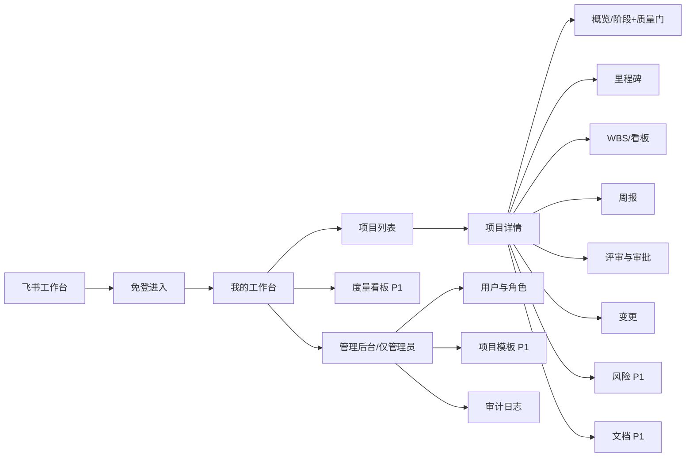

# 太空字节项目管理系统 · 重构 PRD v1.0

| 项 | 内容 |
|---|---|
| 文档版本 | v1.0（待用户确认） |
| 撰写人 | 许清楚（产品经理） |
| 日期 | 2026-02 |
| Language | 中文 |
| Project Name | `astrbytes_pm_system` |
| 制度依据 | 《太空数据中心项目管理制度 V1.0》 |
| 重构起点 | 现有 `pm-app`（Node/Express + SQLite + 原生 HTML 单页 + 飞书免登） |
| 技术栈 | **待确认**（见第五章 Q1）：① 沿用原生 HTML/JS ② 升级 Vite + React + MUI + Tailwind |
| 交付顺序 | PRD 确认 → 架构设计 → 研发（静态 HTML 原型起步）→ QA |

> **原始需求复述**：现有 pm-app 只覆盖了"项目/里程碑/任务/周报/审批/用户"六个基础模块，与公司《太空数据中心项目管理制度 V1.0》要求的**项目分类差异化流程、质量门、WBS、风险登记册、度量指标、文档基线、V 模型/ICD** 等核心机制严重不匹配。需要以制度为真理来源重新设计功能并重构系统；系统最终嵌入飞书，对接飞书用户并做权限控制。

---

## 一、产品目标

**把《太空数据中心项目管理制度 V1.0》从"一份 Word 文档"变成"一个跑得起来、绕不过去的系统"。**

面向太空字节全体项目干系人（PM / PMO / PO / TL / QA / CM / 管理层 / 普通成员），提供一个内嵌于飞书的项目管理工作台：按 A（交付型）/ B（产品型）/ C（基建型）三类项目自动匹配差异化生命周期与质量门，用系统强约束替代人工自觉——阶段不过门不能推进、里程碑日期不能偷偷提前、周报必须按模板填、评审必须留痕、度量指标自动算。

三个正交目标：

| # | 目标 | 衡量方式 |
|---|---|---|
| G1 | **制度可执行**：制度中的流程、门控、模板 100% 在系统中有对应载体 | 制度章节 → 系统功能映射覆盖率 100%（见需求池"制度章节"列） |
| G2 | **过程可追溯**：所有关键动作（评审、变更、门控、基线）留痕可审计 | 评审覆盖率 100%、文档完整率 100% 可由系统自动统计 |
| G3 | **状态可度量**：管理层无需催报即可看到真实项目健康度 | 5 项核心指标（里程碑达成率/需求变更率/缺陷逃逸率/评审覆盖率/文档完整率）自动生成 |

---

## 二、用户故事

### 2.1 PM（项目经理）
1. 作为 PM，我希望**新建项目时系统按合同额/是否含硬件/是否有客户验收自动建议 A/B/C 分类**，以便我不用背制度判断规则，也不会分错类导致流程用错。
2. 作为 PM，我希望**项目建好后系统自动生成对应类型的阶段、质量门、里程碑骨架和文档清单**，以便我 5 分钟完成项目初始化而不是照抄制度手搓一遍。
3. 作为 PM，我希望**里程碑日期只能延后不能提前，且延后必须走变更申请**，以便进度基线不被随意粉饰。
4. 作为 PM，我希望**在一个页面同时看到 WBS 拆解、看板进度和本周风险**，以便每周例会前 10 分钟准备完毕。
5. 作为 PM，我希望**周报按制度模板结构化填写并能一键拉取本周任务进度**，以便周报既规范又不用手抄。

### 2.2 TL（技术负责人）
1. 作为 TL，我希望**在待办中集中看到需要我审批/技术评审的事项**，以便不漏审、不被微信群里催。
2. 作为 TL，我希望**技术评审由我决议并留痕（含评审意见和结论）**，以便责任清晰、后续追溯有依据。
3. 作为 TL，我希望**看到 WBS 工作包的工时估算与实际投入偏差**，以便及时发现估算失真的模块。
4. 作为 TL，我希望**软硬件项目能登记 ICD 接口控制文档并标记四个接口对齐点状态**，以便硬件联调不再靠口头对齐。

### 2.3 PMO
1. 作为 PMO，我希望**看到全公司项目的 5 项核心度量指标及未达标预警**，以便按月出治理报告。
2. 作为 PMO，我希望**审计任一项目的质量门通过记录与评审留痕**，以便合规检查时随时可取证。
3. 作为 PMO，我希望**统一维护项目模板（阶段/质量门检查项/文档清单）**，以便制度升级时全公司一次生效。
4. 作为 PMO，我希望**看到哪些项目周报缺报、哪些文档缺失**，以便精准催办而不是全员群发。

### 2.4 QA（质量负责人）
1. 作为 QA，我希望**在质量门上勾选检查项并给出通过/不通过结论**，以便质量把关有明确落点。
2. 作为 QA，我希望**登记缺陷并区分"测试阶段发现"与"交付后逃逸"**，以便缺陷逃逸率能自动计算。
3. 作为 QA，我希望**看到评审覆盖率（应评审 vs 已评审）**，以便发现跳过评审的项目。
4. 作为 QA，我希望**按 V 模型看到需求/设计与对应测试层级的映射关系**，以便验证测试无遗漏。

### 2.5 管理层
1. 作为管理层，我希望**在一个驾驶舱看到全部在研项目的健康度红黄绿灯**，以便 30 秒掌握全局。
2. 作为管理层，我希望**只在正式评审（立项/需求/设计/验收）节点被拉进来审批**，以便不被日常事务淹没。
3. 作为管理层，我希望**看到高风险项（风险值≥15）汇总清单**，以便优先介入。
4. 作为管理层，我希望**在飞书移动端就能完成审批**，以便出差期间不卡流程。

### 2.6 普通成员
1. 作为普通成员，我希望**登录后直接看到"我的任务"和本周待办**，以便不用翻项目找活儿。
2. 作为普通成员，我希望**在看板上拖动卡片更新任务状态**，以便更新进度只花 3 秒。
3. 作为普通成员，我希望**周报中我负责的任务进度自动带出**，以便少写重复内容。
4. 作为普通成员，我希望**通过飞书直接打开系统免登录**，以便不再记一套账号密码。

---

## 三、需求池

> **状态标记**：`【复用】`=现有 pm-app 已具备，重构中沿用/小改；`【增强】`=已有雏形但需按制度改造；`【新增】`=全新功能。

### 3.1 P0（一期必做 · 17 条）

| 编号 | 功能名 | 制度章节 | 说明 | 验收标准 | 状态 |
|---|---|---|---|---|---|
| P0-01 | 项目分类与自动判定 | 项目分类（A/B/C） | 新建项目时填写合同额/是否含硬件交付/是否有客户验收要求/是否自研迭代/是否基建施工，系统按规则自动建议类型，PM 可覆盖但须填理由 | 输入"合同额 150万" → 建议 A 类；输入"自研产品迭代" → 建议 B 类；覆盖建议时理由必填且留痕 | 【增强】 |
| P0-02 | 差异化生命周期引擎 | 项目生命周期 | 按类型加载阶段序列：A=立项/需求/设计/开发实施/集成测试/验收交付；B=Sprint 循环（计划/开发/评审/演示/回顾）；C=立项/方案设计/采购施工/调试验收/运维移交 | 三类项目详情页各自展示正确阶段条；阶段只能顺序推进，不可跳阶 | 【新增】 |
| P0-03 | 质量门（QG）门控 | 质量门 QG1~QG6 | 每个阶段末设质量门，含检查项清单、责任角色、通过/不通过结论、意见留痕；**未通过不得进入下一阶段（系统硬拦截）** | A 类展示 QG1~QG6；未过门时"进入下一阶段"按钮禁用并提示原因；门控记录含审批人/时间/结论/意见 | 【新增】 |
| P0-04 | 项目档案与角色配置 | 组织架构与角色 | 项目基础信息（编号/名称/类型/客户/合同额/背景/目标）+ 项目级角色任命：PM(1)、TL(1)、PO(B类必填)、QA、CM、PMO | B 类项目未指定 PO 时不允许提交立项；每个项目 PM/TL 有且仅有 1 人 | 【增强】 |
| P0-05 | 里程碑管理 + 单向约束 | 里程碑管理 | 里程碑 CRUD；**日期只能延后不能提前**；延后须提交变更申请并经审批；A 类提供 M1~M7 推荐模板 | 尝试把 due 从 3/20 改成 3/10 → 被拒绝并提示；改成 3/30 → 进入变更审批流；审批通过后基线更新且保留原始基线值 | 【增强】 |
| P0-06 | WBS 树与工作包 | WBS 分解 | 任务从扁平列表升级为**层级 WBS 树**（项目→阶段→工作包→任务），自动生成工作包编码（如 1.2.3）；粒度校验：A 类 3-5 人日、B 类 1-2 人日超限告警；每个工作包必须可估算/可分配/可跟踪 | 可创建 3 层以上 WBS；编码自动连续；工时估算 8 人日的 A 类工作包触发"建议拆分"提示；每个叶子节点必须有负责人和估算 | 【增强】 |
| P0-07 | 看板视图 + WIP 限制 | 看板管理 | 四列：待办 / 进行中 / 待评审 / 完成；卡片显示负责人、工时估算、截止日、逾期标红；进行中列可配置 WIP 上限，超限阻止拖入并提示 | 拖拽可改状态并即时落库；WIP=3 时拖入第 4 张卡被拦截；逾期卡片红色高亮 | 【增强】 |
| P0-08 | 结构化周报 | 周报模板（精简） | 严格四段：①本周完成（对照计划，自动带出关联任务及进度）②下周计划 ③风险与问题（**每条必须有 owner 和 due date**）④需要协调的资源；保留进度快照 | 风险条目缺 owner 或 due 无法提交；提交后本周任务进度被冻结为快照；支持按周查看历史 | 【增强】 |
| P0-09 | 评审分级与审批引擎 | 审批与评审 | 三类评审：**正式评审**（立项/需求/设计/验收 → 管理层+PMO+TL+客户代表，**一票否决**）、**技术评审**（TL 决议）、**代码评审**（≥1人 Approve）；沿用现有串行审批链引擎，按项目类型配置模板；全程留痕 | 正式评审任一参与方否决 → 整体驳回并回到修改态；技术评审仅 TL 可决议；审批记录含谁/何时/结论/意见 | 【增强】 |
| P0-10 | 角色体系与 RBAC | 组织架构与角色 | 全局角色（admin/management/pmo/pm/tl/qa/cm/po/member）+ **项目级角色**（同一人在 A 项目是 PM、在 B 项目是成员）；权限判定服务端强制；矩阵式管理支持一人多项目多角色 | 用户 X 在项目 A 为 PM 可编辑 A，在项目 B 为 member 不可编辑 B；前端按钮显隐与服务端判定一致；直接调 API 绕过前端同样被拒 | 【增强】 |
| P0-11 | 飞书 H5 免登与身份绑定 | — | 飞书内 `tt.requestAuthCode` 取 code → 后端换身份 → 签发会话令牌；首次登录自动入库并绑定 open_id；保留无凭证时的开发登录模式 | 飞书工作台点击应用 → 无需输入任何凭证直接进入且身份正确；本地开发可用开发登录 | 【复用】 |
| P0-12 | 用户管理后台 | 组织架构与角色 | 管理员为飞书用户分配全局角色；守卫：不能改自己角色、不能降级最后一名管理员；新增按角色查看成员清单 | 管理员可改他人角色并即时生效于审批链；改自己角色被拒；系统始终至少 1 名管理员 | 【复用】 |
| P0-13 | 我的工作台（首页） | — | 登录后默认页：我负责的项目、我的待办任务（按 due 排序）、待我审批事项、本周周报待填提醒 | 待办数与实际一致；点击任一条目直达对应详情；无待办时展示空状态引导 | 【增强】 |
| P0-14 | 变更控制 | 变更控制 | 小变更（<3 人日）PM 审批即可；**基线变更走 CCB**（PM+TL+PO+客户代表）；变更单含：变更内容/影响分析/工作量估算/审批结论；变更计入"需求变更率" | 提交 2 人日变更 → 仅需 PM 批；提交需求基线变更 → 自动拉起 CCB 四方审批；所有变更可按项目列出 | 【新增】 |
| P0-15 | 全实体操作审计 | 配置管理 | 项目/里程碑/WBS/质量门/变更/评审的创建、修改、删除、状态流转全部写审计日志（操作人/时间/前后值） | 任一实体详情页可查看"变更历史"时间线；删除操作可追溯到人 | 【增强】 |
| P0-16 | 飞书内嵌与响应式适配 | — | 页面在飞书 PC 客户端与移动端 H5 均可正常使用；移动端优先保证：查看项目、审批、更新任务状态、填周报 | 375px 宽度下无横向滚动；审批按钮可点；表格降级为卡片式布局 | 【新增】 |
| P0-17 | 项目状态机与结项 | 项目生命周期 | 状态：草稿→审批中→已批准→进行中→（挂起）→已结项/已终止；结项需所有质量门通过 + 文档完整 + 无未关闭高风险 | 存在未过质量门时点击"结项"被拦截并列出阻塞项；结项后项目转为只读归档 | 【增强】 |

### 3.2 P1（二期 · 11 条）

| 编号 | 功能名 | 制度章节 | 说明 | 验收标准 | 状态 |
|---|---|---|---|---|---|
| P1-01 | 风险登记册 | 风险管理 | 字段：编号/描述/类别/概率(1-5)/影响(1-5)/风险值(概率×影响)/应对策略/责任人/状态/复审日期；风险值≥15 自动标为高风险 | 录入概率4×影响5 → 风险值20且标红；可按项目/全公司筛选；周报风险条目可一键升级为登记册条目 | 【新增】 |
| P1-02 | 度量指标看板 | 度量指标 | 5 项自动计算：里程碑达成率(≥90%)、需求变更率(≤20%)、缺陷逃逸率(≤10%)、评审覆盖率(100%)、文档完整率(100%)；支持项目级与公司级、按月趋势 | 指标数值可点击下钻到明细数据源；未达标项红色告警；数据口径在页面上有说明 | 【新增】 |
| P1-03 | 文档清单与基线管理 | 文档体系/配置管理 | 按项目类型加载文档清单模板；每份文档记录状态（未开始/编写中/已评审/已基线化）；支持需求基线/设计基线/产品基线冻结与版本对比 | A 类项目自动带出对应文档清单；基线冻结后文档变更须走变更控制；文档完整率由此计算 | 【新增】 |
| P1-04 | 缺陷/问题管理 | 度量指标 | 缺陷登记：标题/严重级别/发现阶段/所属模块/责任人/状态；区分"测试阶段发现"与"交付后逃逸" | 缺陷逃逸率 = 交付后缺陷 / 总缺陷，可自动算出；缺陷可关联 WBS 工作包 | 【新增】 |
| P1-05 | B 类 Sprint 管理 | B 类流程 | Epic→Feature→Story→Task 四层拆解；2 周 Sprint（计划/开发/评审/演示/回顾）；Sprint Backlog、燃尽图、发布前质量门 | B 类项目可创建 Sprint 并归集 Story；燃尽图按日更新；Sprint 回顾结论可记录 | 【新增】 |
| P1-06 | 甘特图 / 时间线 | 里程碑/WBS | 里程碑 + WBS 工作包的时间线视图，展示依赖关系与关键路径 | 可切换"看板/甘特"视图；关键路径任务高亮；逾期任务标红 | 【新增】 |
| P1-07 | 飞书消息卡片通知 | — | 待审批、里程碑临期(T-3)、周报未填(周五)、高风险新增 → 推送飞书消息卡片，卡片内可直接审批 | 触发条件命中即收到卡片；卡片按钮点击后系统状态同步变更 | 【新增】 |
| P1-08 | 项目模板中心 | 制度全篇 | PMO 维护 A/B/C 三套模板：阶段序列、质量门检查项、里程碑骨架、文档清单、WBS 骨架；新建项目一键套用 | 修改模板后新建项目生效（存量项目不受影响）；模板可导出/导入 | 【新增】 |
| P1-09 | 附件与文档库 | 配置管理 | 文件上传（评审材料、设计文档、验收报告），按项目/阶段归档，支持版本号 | 单文件≤50MB；可按阶段筛选；删除需权限且留痕 | 【新增】 |
| P1-10 | 数据导出 | — | 周报、度量报表、项目档案、风险登记册导出 Excel/PDF | 导出内容与页面一致；PDF 含公司抬头与生成时间 | 【新增】 |
| P1-11 | 周报汇总与催办 | 周报模板 | 按周自动汇总全项目周报生成"公司周报"；未提交自动催办 | 每周一自动生成上周汇总；缺报名单准确 | 【增强】 |

### 3.3 P2（三期 · 7 条）

| 编号 | 功能名 | 制度章节 | 说明 | 验收标准 | 状态 |
|---|---|---|---|---|---|
| P2-01 | V 模型测试映射 | 软硬件协同 V 模型 | 需求↔验收测试、系统设计↔系统测试、子系统↔集成测试、模块/硬件↔单元测试、编码↔联调，建立双向可追溯矩阵 | 任一需求可查到覆盖它的测试项；未覆盖需求列表可输出 | 【新增】 |
| P2-02 | ICD 接口控制文档管理 | 软硬件协同 | ICD 作为软硬件契约登记：接口清单、版本、冻结状态；四个对齐点门控（接口定义/接口冻结/桩模块联调/实物联调门） | ICD 冻结后修改须走变更；四个对齐点未过不得进入下一联调阶段 | 【新增】 |
| P2-03 | 工时与人员负荷 | WBS/资源 | 实际工时填报 vs 估算对比；人员跨项目负荷热力图 | 可查看某人本月被分配的总人日；超载(>100%)告警 | 【新增】 |
| P2-04 | 结项复盘与经验库 | 项目生命周期 | 结项时填写复盘（做得好/待改进/经验教训），沉淀为可检索知识库 | 结项流程强制包含复盘；经验库可按类型/关键词检索 | 【新增】 |
| P2-05 | 管理层驾驶舱 / 组合视图 | 度量指标 | 全部在研项目健康度红黄绿灯矩阵、资源分布、里程碑全景 | 一屏展示≥20 个项目状态；健康度算法规则可见 | 【新增】 |
| P2-06 | Git 集成 | 配置管理 | 分支策略（main/develop/feature/hotfix）合规检查、提交规范 `[类型]描述` 校验、代码评审覆盖率统计 | 非法分支名/提交信息可被识别并列出；代码评审覆盖率可统计 | 【新增】 |
| P2-07 | 通知中心与订阅 | — | 站内通知中心 + 用户自定义订阅（哪些事件推飞书、哪些只站内） | 用户可关闭非关键通知；通知已读/未读状态正确 | 【新增】 |

### 3.4 制度覆盖对照（自检）

| 制度核心机制 | 对应需求 | 一期是否覆盖 |
|---|---|---|
| 三类项目差异化 | P0-01 / P0-02 / P1-08 | ✅ |
| 生命周期 + 质量门 | P0-02 / P0-03 / P0-17 | ✅ |
| 里程碑（只升不降） | P0-05 | ✅ |
| WBS / 任务看板 | P0-06 / P0-07 | ✅ |
| 周报模板 | P0-08 / P1-11 | ✅ |
| 审批与评审分级 | P0-09 | ✅ |
| 角色与 RBAC | P0-10 / P0-12 | ✅ |
| 变更控制 / CCB | P0-14 | ✅ |
| 风险管理 | P1-01 | ⏳ 二期 |
| 度量指标（5项） | P1-02 / P1-04 | ⏳ 二期 |
| 文档 / 基线管理 | P1-03 / P1-09 | ⏳ 二期 |
| V 模型 / ICD | P2-01 / P2-02 | ⏳ 三期 |
| 飞书对接与权限 | P0-11 / P0-16 / P1-07 | ✅（深度接入见 P1-07） |

---

## 四、UI 设计稿

### 4.1 信息架构



**全局框架**：左侧固定导航（宽 200px，移动端折叠为底部 Tab）+ 顶部面包屑与用户区 + 右侧内容区。沿用现有**深空暗色主题**（背景 `#0B1020`，卡片 `#141A2E`，主色 `#3B82F6`，警示 `#F59E0B`，危险 `#EF4444`，成功 `#10B981`）。

### 4.2 登录态

```
┌────────────────────────────────────────────┐
│                                            │
│            ✦  太空字节项目管理             │
│         AstrBytes Project Workbench        │
│                                            │
│   [ 飞书内自动免登中… ●●● ]                │
│                                            │
│   ── 开发环境额外显示 ──                    │
│   姓名 [___________]  角色 [ 管理员 ▾ ]     │
│   [        开 发 登 录         ]            │
└────────────────────────────────────────────┘
```

### 4.3 我的工作台（首页）

```
┌─ 太空字节 PM ──────────────────── 徐文斌 · 管理员 ▾ ┐
│ ▣ 工作台   ┌──────────────────────────────────────┐│
│ ▤ 项目     │ 我的待办                              ││
│ ◈ 度量     │ ┌──────────┬──────────┬────────────┐ ││
│ ⚙ 管理     │ │待我审批 3│ 逾期任务2│ 周报未填 1 │ ││
│            │ └──────────┴──────────┴────────────┘ ││
│            │                                       ││
│            │ 我负责的项目 (4)                      ││
│            │ ┌───────────────────────────────────┐ ││
│            │ │ [A类] 星舰数据中心一期     ●进行中│ ││
│            │ │ 阶段: 开发实施 ▸ QG4 待检         │ ││
│            │ │ 进度 ▓▓▓▓▓▓░░░░ 62%  里程碑 3/7  │ ││
│            │ │ ⚠ 高风险 1   📅 下个里程碑 03-20  │ ││
│            │ └───────────────────────────────────┘ ││
│            │ ┌───────────────────────────────────┐ ││
│            │ │ [B类] 星链调度平台 v2.3    ●Sprint7│ ││
│            │ └───────────────────────────────────┘ ││
│            │                                       ││
│            │ 待我审批                              ││
│            │ • [立项评审] 遥测分析系统  正式评审   ││
│            │   发起人 李工 · 2天前   [通过][驳回]  ││
│            │ • [里程碑变更] 星舰一期 M3 延后5天    ││
│            └──────────────────────────────────────┘│
└─────────────────────────────────────────────────────┘
```

### 4.4 项目列表

```
项目列表                            [ + 新建项目 ]
┌────────────────────────────────────────────────────┐
│ 类型[全部▾] 状态[进行中▾] 负责人[全部▾] 🔍[      ] │
├──────┬────────────┬──────┬────────┬──────┬────────┤
│ 编号 │ 项目名称   │ 类型 │ 当前阶段│ 健康 │ PM     │
├──────┼────────────┼──────┼────────┼──────┼────────┤
│P-0012│星舰数据中心│ A类  │开发实施 │ 🟡   │ 徐文斌 │
│      │  一期      │      │QG4 待检 │      │        │
│P-0015│星链调度v2.3│ B类  │Sprint 7 │ 🟢   │ 李明   │
│P-0018│机房扩容工程│ C类  │采购施工 │ 🔴   │ 王强   │
└──────┴────────────┴──────┴────────┴──────┴────────┘
健康度：🟢正常 🟡有风险(里程碑临期/门未过) 🔴逾期或高风险
```

**新建项目弹窗（含分类判定）**

```
┌ 新建项目 ────────────────────────────────┐
│ 项目名称 [_______________________]        │
│ 客户/来源[_______________________]        │
│ 合同额   [______] 万元                    │
│ ☑ 涉及硬件交付   ☑ 客户有验收要求         │
│ ☐ 自研产品迭代   ☐ 基础设施施工/部署       │
│ ──────────────────────────────────────── │
│ 💡 系统建议：**A 类（交付型）**            │
│    依据：合同额>100万 且 涉及硬件交付      │
│ 项目类型 [ A类（交付型） ▾ ]              │
│ （若与建议不符，覆盖理由必填）             │
│ ──────────────────────────────────────── │
│ 项目角色  PM[徐文斌▾] TL[__▾] QA[__▾]     │
│           PO[__▾](B类必填) CM[__▾]        │
│ ☑ 按 A 类模板生成阶段/质量门/里程碑/文档   │
│                     [取消]  [创建为草稿]  │
└───────────────────────────────────────────┘
```

### 4.5 项目详情 · 概览（阶段 + 质量门）

```
星舰数据中心一期  [A类·交付型]  状态:进行中  PM:徐文斌
[概览][里程碑][WBS/看板][周报][评审审批][变更][风险][文档]
────────────────────────────────────────────────────────
生命周期
 ①立项 ──② 需求 ──③ 设计 ──④开发实施──⑤集成测试──⑥验收交付
  ✔QG1     ✔QG2     ✔QG3      ◉QG4      ○QG5      ○QG6
  已过     已过      已过      待检查     未开始     未开始
                               ▲ 当前

┌ QG4 · 开发实施质量门 ───────────────────────────────┐
│ 检查项（责任角色）                          状态     │
│ ☑ 代码评审覆盖率 100%（TL）                 已确认   │
│ ☑ 单元测试通过率 ≥90%（QA）                 已确认   │
│ ☐ 接口文档(ICD)已冻结（TL）                 待确认   │
│ ☐ 开发阶段文档齐套（CM）                    待确认   │
│ ────────────────────────────────────────────────── │
│ 结论 ( )通过  ( )有条件通过  ( )不通过               │
│ 意见 [__________________________________]           │
│              [提交门控结论]（QA/TL/PMO 可操作）      │
│ ⛔ 门未通过，"进入集成测试"按钮已锁定                │
└──────────────────────────────────────────────────────┘

┌ 关键信息 ──────────┬ 本周动态 ─────────────────────┐
│ 合同额  380 万      │ • 03-14 QG3 通过（PMO 张）    │
│ 客户    XX 航天     │ • 03-15 M3 变更申请待 CCB     │
│ 计划完工 2026-08-30 │ • 03-16 新增高风险 R-007      │
└─────────────────────┴───────────────────────────────┘
```

### 4.6 项目详情 · 里程碑

```
里程碑（日期只能延后，延后须走变更）        [ + 新建 ]
┌────┬──────────────┬──────────┬──────────┬──────────┐
│ ID │ 名称         │ 基线日期 │ 当前日期 │ 状态     │
├────┼──────────────┼──────────┼──────────┼──────────┤
│ M1 │ 项目启动     │ 01-10    │ 01-10    │ ✔已达成  │
│ M2 │ 需求基线冻结 │ 02-05    │ 02-12    │ ✔已达成  │
│    │              │          │ (+7 变更#3)         │
│ M3 │ 设计评审通过 │ 03-20    │ 03-20    │ ◉进行中  │
│ M4 │ 首件调试完成 │ 05-15    │ 05-15    │ ○未开始  │
└────┴──────────────┴──────────┴──────────┴──────────┘
✎ 编辑 M3 时若填入早于 03-20 的日期：
   ⛔ "里程碑日期不可提前。如需调整请提交变更申请。"
   若填入晚于 03-20 ：→ 自动跳转「变更申请」表单
```

### 4.7 项目详情 · WBS / 看板（双视图）

```
[ WBS 树 ] [ 看板 ] [ 甘特(P1) ]           WIP 限制: 进行中 ≤ 5

── WBS 树视图 ──
1  星舰数据中心一期
├ 1.1 需求阶段                       负责人  估算  进度
│  ├ 1.1.1 客户需求调研              李明   3人日  100%
│  └ 1.1.2 需求规格说明书编写        李明   5人日  100%
├ 1.2 设计阶段
│  ├ 1.2.1 系统架构设计              王强   5人日   80%
│  └ 1.2.2 硬件接口 ICD 定义         王强   8人日   40% ⚠粒度超限
└ 1.3 开发实施                                    (建议拆分为≤5人日)

── 看板视图 ──
┌ 待办 (6) ────┬ 进行中 (4/5) ─┬ 待评审 (2) ──┬ 完成 (12) ──┐
│┌────────────┐│┌────────────┐│┌───────────┐│┌───────────┐│
││1.3.2 采集   │││1.2.1 架构   │││1.2.2 ICD  │││1.1.1 调研 ││
││模块开发     │││设计         │││定义       │││           ││
││👤张三 5人日 │││👤王强 5人日 │││👤王强     │││👤李明     ││
││📅03-25      │││📅03-18 ⏰逾期│││📅03-16    │││✔          ││
│└────────────┘│└────────────┘│└───────────┘│└───────────┘│
└──────────────┴──────────────┴─────────────┴─────────────┘
拖入"进行中"第 6 张时：⛔ "WIP 已达上限 5，请先完成在办任务"
```

### 4.8 项目详情 · 周报

```
周报 · 2026 第 11 周 (03-09 ~ 03-15)      [ 保存草稿 ][ 提交 ]
┌──────────────────────────────────────────────────────┐
│ ① 本周完成（对照计划）                                │
│   本周关联任务（自动带出，可勾选）：                   │
│   ☑ 1.2.1 系统架构设计   进度 60% → 80%               │
│   ☑ 1.1.2 需求规格说明书 进度 90% → 100% ✔            │
│   补充说明 [_________________________________]        │
│                                                       │
│ ② 下周计划                                            │
│   [1. 完成 ICD 接口定义并冻结                     ]   │
│   [2. 启动采集模块开发                            ]   │
│                                                       │
│ ③ 风险与问题（每条必须有责任人和截止日）               │
│   ┌────────────────┬──────────┬──────────┬────────┐  │
│   │ 描述           │ 责任人   │ 截止日   │ 操作   │  │
│   ├────────────────┼──────────┼──────────┼────────┤  │
│   │硬件样机延期到货│ 王强 ▾   │ 03-25    │[登记为 │  │
│   │                │          │          │ 风险]  │  │
│   └────────────────┴──────────┴──────────┴────────┘  │
│   [ + 添加一条 ]   ⛔ 缺责任人或截止日无法提交         │
│                                                       │
│ ④ 需要协调的资源                                      │
│   [需要采购部加急处理 XX 板卡订单                  ]  │
└──────────────────────────────────────────────────────┘
```

### 4.9 项目详情 · 评审与审批

```
评审与审批
┌ 当前进行中 ─────────────────────────────────────────┐
│ 【正式评审】设计评审  一票否决制                     │
│ 发起人 徐文斌 · 03-15 提交                           │
│   PMO 张   ✔通过 03-15 "文档齐套"                    │
│   TL  王强 ◉待审                                     │
│   管理层   ○待审                                     │
│   客户代表 ○待审                                     │
│   ⚠ 任一方否决 → 整体驳回                            │
└──────────────────────────────────────────────────────┘
┌ 历史记录 ───────────────────────────────────────────┐
│ 03-02 【技术评审】架构方案   TL 王强 ✔通过           │
│ 02-20 【正式评审】需求评审   四方 ✔全票通过          │
│ 02-10 【代码评审】PR#128     李明 ✔Approve           │
└──────────────────────────────────────────────────────┘
评审类型说明：正式评审=管理层+PMO+TL+客户，一票否决
              技术评审=TL 决议 ｜ 代码评审=≥1人 Approve
```

### 4.10 变更控制

```
变更申请 #CR-003                        [ 提交审批 ]
┌──────────────────────────────────────────────────┐
│ 变更类型  ( )里程碑日期 (•)需求基线 ( )范围/其他  │
│ 变更内容  [新增遥测数据回放功能               ]   │
│ 影响分析  [影响设计文档与集成测试用例         ]   │
│ 工作量估算[ 6 ] 人日                              │
│ ──────────────────────────────────────────────── │
│ 🔎 系统判定：工作量 6 人日 ≥ 3 且涉及需求基线      │
│    → 需走 **CCB 审批**：PM → TL → PO → 客户代表   │
│    （若 <3 人日且不涉基线 → 仅 PM 审批）          │
└──────────────────────────────────────────────────┘

变更清单
┌──────┬────────────┬────────┬────────┬──────────┐
│ 编号 │ 内容       │ 工作量 │ 路径   │ 状态     │
├──────┼────────────┼────────┼────────┼──────────┤
│CR-001│M2 延后7天  │ —      │ CCB    │ ✔已批准  │
│CR-002│UI 文案调整 │ 1人日  │ PM批   │ ✔已批准  │
│CR-003│遥测回放功能│ 6人日  │ CCB    │ ◉审批中  │
└──────┴────────────┴────────┴────────┴──────────┘
```

### 4.11 风险管理（P1）

```
风险登记册                                [ + 登记风险 ]
┌──────┬──────────────┬────┬──┬──┬────┬────────┬──────┐
│ 编号 │ 描述         │类别│概│影│风险│应对    │责任人│
│      │              │    │率│响│值  │策略    │/状态 │
├──────┼──────────────┼────┼──┼──┼────┼────────┼──────┤
│R-007 │硬件样机延期  │供应│ 4│ 5│🔴20│提前备货│王强  │
│      │              │    │  │  │    │双供应商│跟踪中│
│R-005 │客户需求不明确│需求│ 3│ 4│🟡12│周度澄清│徐文斌│
│R-002 │核心人员离职  │资源│ 2│ 4│🟢 8│知识备份│李明  │
└──────┴──────────────┴────┴──┴──┴────┴────────┴──────┘
风险矩阵（概率×影响 1-5 分制）
影响 5│ 5 10 15 🔴20 🔴25       🔴 高风险 ≥15（需管理层介入）
     4│ 4  8 12 🟡16 🟡20       🟡 中风险 8~14
     3│ 3  6  9  12  15         🟢 低风险 <8
     2│ 2  4  6   8  10
     1│ 1  2  3   4   5
      └─────────────────
        1  2  3  4  5  概率
```

### 4.12 度量看板（P1）

```
度量看板   范围[全公司▾]  周期[2026-03▾]
┌───────────────┬───────────────┬───────────────┐
│ 里程碑达成率  │ 需求变更率    │ 缺陷逃逸率    │
│    87%  🔴    │    14%  🟢    │    6%   🟢    │
│  目标 ≥90%    │  目标 ≤20%    │  目标 ≤10%    │
│  ▁▃▅▆▅▄ 趋势  │  ▂▃▂▁▂▃      │  ▃▂▂▁▁▁      │
├───────────────┼───────────────┴───────────────┤
│ 评审覆盖率    │ 文档完整率                    │
│    100% 🟢    │    92%  🔴（目标 100%）        │
└───────────────┴───────────────────────────────┘
未达标明细（点击下钻）
• 里程碑达成率：P-0018 机房扩容 M2/M3 逾期 → 查看
• 文档完整率：P-0012 缺《集成测试报告》《ICD v1.2》→ 查看
```

### 4.13 管理后台

```
管理后台（仅管理员/PMO）
[用户与角色] [项目模板 P1] [审计日志]

用户与角色
┌────────┬──────────────┬──────────────┬────────┐
│ 姓名   │ 飞书 open_id │ 全局角色     │ 操作   │
├────────┼──────────────┼──────────────┼────────┤
│ 徐文斌 │ ou_a1b2…     │ 管理员 ▾     │[保存]  │
│ 王强   │ ou_c3d4…     │ 技术负责人 ▾ │[保存]  │
│ 张敏   │ ou_e5f6…     │ PMO ▾        │[保存]  │
└────────┴──────────────┴──────────────┴────────┘
守卫：① 不能修改自己的角色  ② 不能降级最后一名管理员
提示：项目级角色在各项目详情页单独任命（一人可多项目多角色）
```

### 4.14 移动端 / 飞书内嵌（375px）

```
┌─────────────────┐   要点：
│ ☰ 星舰一期   👤 │   1. 表格 → 卡片流
├─────────────────┤   2. 看板 → 单列 + 状态 Tab 横滑
│ [A类] 开发实施   │   3. 主操作固定底部
│ QG4 待检 ⚠      │   4. 移动端优先四件事：
│ ▓▓▓▓▓░░ 62%     │      看项目 / 审批 / 改任务状态 / 填周报
├─────────────────┤   5. WBS 树折叠为两级
│ 我的任务 (3)     │
│ ┌─────────────┐ │
│ │1.2.1 架构设计│ │
│ │📅03-18 ⏰逾期│ │
│ │[开始][完成]  │ │
│ └─────────────┘ │
├─────────────────┤
│ ▣工作台 ▤项目   │
│ ◈度量  ⚙我的    │
└─────────────────┘
```

---

## 五、待确认问题（需用户拍板）

| # | 问题 | 选项与影响 | 产品建议 |
|---|---|---|---|
| **Q1** | **技术栈**：保持原生 HTML/JS 还是升级 React+Vite+MUI+Tailwind？ | **A. 原生 HTML/JS**：复用现有 `public/index.html`，零迁移成本，但本次新增 WBS 树、看板拖拽、甘特、度量图表等复杂交互后单文件会迅速失控，长期维护成本高。<br>**B. React+Vite+MUI+Tailwind**（团队 SOP 默认）：组件化、状态管理清晰、图表/拖拽有成熟生态、移动端适配容易，但需要重写前端（后端 API 可基本沿用）。 | **建议 B**。本次功能量约为现有系统的 3-4 倍，且要长期演进；后端 Express+SQLite 保留，只重写前端，风险可控。但需用户确认是否接受"前端从零重写"的工期。 |
| **Q2** | **一期范围**：P0 是否就锁定为"项目分类+生命周期/质量门+里程碑+WBS看板+周报+评审审批+变更+角色权限+飞书登录+响应式"这 17 条？风险/度量/文档基线放 P1，V模型/ICD 放 P2？ | 若一期塞入全部功能，工期不可控且首版难以验证；若一期过窄（只做现有六模块美化），则无法体现制度落地价值。 | **建议维持当前划分**。P0 已覆盖制度中"强约束"部分（门控/单向里程碑/变更/评审），是制度能否落地的关键；风险与度量依赖 P0 产生的数据，天然应在二期。请用户确认是否有必须提前的项（如"度量看板"若管理层刚性要求，可将 P1-02 提到 P0）。 |
| **Q3** | **飞书接入深度**：仅 H5 免登+身份（现状），还是要用飞书 JSAPI/开放能力（通讯录同步、审批中心对接、消息卡片推送）？ | **A. 仅免登**：改动小，用户需主动打开系统才能看到待办。<br>**B. 免登 + 消息卡片 + 通讯录同步**：待办直达飞书、卡片内审批、组织架构自动同步，体验大幅提升，但需申请更多权限（`contact:department`、`im:message`、`card`），并做飞书事件订阅与回调服务。<br>**C. 再对接飞书审批中心**：与飞书原生审批打通，工作量最大。 | **建议 B（P1 实施）**。一期先保证免登与权限正确；P1-07 消息卡片是提升采纳率的关键杠杆。C 类对接收益有限，暂不建议。 |
| **Q4** | **移动端优先级**：飞书内嵌以移动端为主还是桌面端为主？ | **A. 桌面优先**：WBS/甘特/度量等重信息页面体验好，移动端只做只读+审批。<br>**B. 移动优先**：全部功能都要适配 375px，设计与工期成本增加约 30%。 | **建议 A（桌面优先 + 移动端做"四件事"）**：查看项目、审批、更新任务状态、填周报。理由：WBS 树与度量图表在手机上本就不适合深度操作；但审批和状态更新是高频移动场景，必须适配。请用户确认这四件事是否够。 |
| **Q5** | **数据与 schema**：沿用现有 SQLite 并做迁移，还是重新设计 schema（甚至换 Postgres）？ | **A. 沿用 SQLite + 增量迁移**：保留现有 7 张表与已有数据，新增 wbs/quality_gates/changes/risks/documents/metrics/audit_logs 等表。成本低，但现有 `tasks` 表是扁平结构，改成 WBS 树需要加 `parent_id`/`wbs_code`/`level`，历史数据需回填。<br>**B. 重新设计 schema + 数据迁移脚本**：结构更干净，但需写迁移脚本。<br>**C. 换 Postgres**：并发与后续 BI 更好，但需要额外运维（Render 免费计划 SQLite 数据不持久，本就是隐患）。 | **建议 B + 保留 SQLite（预留 Postgres 切换）**：现有生产数据量极小（基本为演示数据），重新设计 schema 的代价远低于长期背着扁平 tasks 表。同时把 `db.js` 抽象为数据访问层，未来换 Postgres 只改一处。**请用户明确：现有 `pm.db` 里是否已有需要保留的真实业务数据？** |
| **Q6** | **质量门检查项由谁定义、是否可项目级自定义？** | A. PMO 统一维护模板，项目不可改（强制一致）；B. 模板为默认值，PM 可增删项目专属检查项（灵活但可能被弱化）。 | **建议 B 但加约束**：模板项不可删除，仅允许"追加"项目专属检查项。 |
| **Q7** | **客户代表如何参与评审/CCB？** | 制度要求正式评审与 CCB 含"客户代表"，但客户通常不在公司飞书组织内。A. 由 PM 代客户线下签字后在系统代录（附上传扫描件）；B. 开放外部账号（需额外认证体系与安全评估）。 | **建议 A（一期）**：PM 代录 + 强制上传客户确认凭证，成本最低且满足留痕要求。 |
| **Q8** | **上线与迁移节奏**：新系统是"另起域名并行试运行一段时间"还是"直接替换现有 pm-app"？ | 并行试运行需双份数据维护；直接替换风险集中在切换当天。 | **建议**：一期完成后先在 1 个 A 类 + 1 个 B 类真实项目上试点 2 周，验证通过再全员切换。 |

---

## 六、下一步

1. 用户确认本 PRD（重点是第五章 Q1~Q5 五个拍板项）。
2. PRD 确认后转交架构师，产出系统设计（数据模型 / API / 模块划分 / 前端页面路由）。
3. 研发按"静态 HTML 原型 → 接后端 API"两步走，先让用户看到界面再做联调。
4. QA 依据本 PRD 的"验收标准"列编写测试用例。

> 附：本 PRD 中所有验收标准均为可测语句，QA 可直接转为用例；需求编号 `P0-xx / P1-xx / P2-xx` 建议在后续设计、代码提交、测试用例中全程引用，以保证可追溯（对应制度"文档完整率"与"需求可追溯"要求）。
