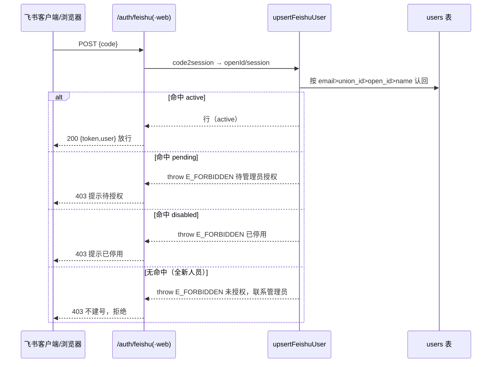

# pm-app 认证 / 授权完善技术方案

> 范围：两个需求 ① 登录后自助改密码；② 飞书（含工作台免登）授权闸门
> 本文档为**方案阶段**，仅给出设计、数据模型、接口与改动文件清单、风险与决策点，不含实现代码。
> 所有结论均基于已核实的源码事实（行号见正文），非凭空假设。

---

## 一、需求①方案：登录后自助改密码

### 1.1 现有能力盘点（后端已具备）

- `POST /api/auth/change-password`（`server/routes/auth.routes.js` L202–242）逻辑**已完整可用**：
  - `requireAuth` 鉴权；`newPassword >= 6` 校验；
  - 若 `password_hash` 存在则**必须校验旧密码**（否则允许直接设置，兼容飞书-only 用户首次设密）；
  - 更新 `password_hash` 并置 `must_change_pwd = 0`；返回 `{code:0, data:null, message:'密码已更新'}`。
- 前端 `ChangePasswordPage.tsx`（`/change-password`）已存在且可工作：表单「原密码 / 新密码 / 确认新密码」，成功後 `navigate(ROUTES.login)`。
- `authStore.changePassword(oldPassword,newPassword)`（`web/src/stores/authStore.ts` L116–118）已对接 `api.changePassword`（`web/src/api/http.ts` L163–165 → `POST /auth/change-password`）。
- 后端 `login` 已返回 `mustChangePwd` 字段，前端首次登录强制跳 `/change-password`（LoginPage `handlePasswordLogin` L131–136）。

**结论：后端接口与 store 层零新增。缺口 100% 在前端"登录态入口"。**

### 1.2 前端缺口与改动

- **缺口**：顶栏用户菜单（`web/src/components/layout/Topbar.tsx` L136–158）目前只有「复位演示数据」(仅 Mock) 与「退出登录」，**没有"修改密码"入口**。`must_change_pwd` 用户首次被强制跳 `/change-password`，但普通登录用户无处主动改密。
- **入口方案（推荐）**：在 `Topbar` 用户下拉菜单中，**「退出登录」之上新增「修改密码」项** → 跳转 `/change-password` 复用现有页（不新建组件）。
  - 登录态判断：`useAuthStore((s)=>s.user)` 非空即已登录，菜单项对所有已登录用户显示。
  - 纯飞书用户（无 `password_hash`）也可点：后端 `change-password` 对空 `password_hash` 不校验旧密码，等于"设置密码"，语义成立；UI 上「原密码」留空即可。
- **`ChangePasswordPage` 小改进（可选但推荐）**：当前成功後强制回 `/login`（因首次改密场景）。自助改密场景语义应为"留在系统内"。建议支持 `?forced=1` 查询参数：
  - `forced=1`（首次强制）：成功後 `navigate(ROUTES.login, {replace:true})`（保持现状）；
  - 无 `forced`（自助）：成功後 `navigate(-1)`（返回上一页）+ toast「密码已更新」。
  - 由 `Topbar` 入口以 `navigate('/change-password')`（无 forced）进入；LoginPage 的首次跳转保持 `navigate('/change-password', {replace:true})` 即可（无 forced，但此时尚未进主页，回退即登录页，可接受；如需严格可加 forced=1）。

### 1.3 改动文件清单（前端为主）

| 文件 | 改动点 |
|---|---|
| `web/src/components/layout/Topbar.tsx` | 用户菜单新增「修改密码」MenuItem（图标 `LockResetIcon`），调用 `navigate(ROUTES.changePassword)`；置于「退出登录」之上 |
| `web/src/config/routes.ts` | `ROUTES` 增加 `changePassword: '/change-password'`（当前用字面量，统一为常量） |
| `web/src/pages/ChangePasswordPage.tsx` | 读取 `?forced` 参数决定成功後跳转（`/login` 或 `navigate(-1)`）；其余复用 |
| `web/src/types/project.ts` | （如 TS 联合需要）`User`/`UpdateUserPayload` 的 `status` 联合补充 `'pending'`（见需求②，本需求不强制但同批改） |

### 1.4 是否需新增接口

**不需要**。`POST /api/auth/change-password` 已满足自助改密与首次改密两种场景，前端仅补入口。

---

## 二、需求②方案：飞书登录授权闸门（核心）

### 2.1 数据模型变更

#### 2.1.1 `users.status` 语义扩展（推荐：扩展枚举，不新增字段）

现状：`users.status` 为 `TEXT NOT NULL DEFAULT 'active'`，业务仅用 `'active'` / `'disabled'`（`mappers.js` `toApiUser` L202 透传；`auth.routes.js` / `middleware/auth.js` 仅判 `'disabled'`）。

**推荐方案**：在现有枚举上新增第三态 `'pending'`（待授权），三态含义：

| 值 | 含义 | 能否通过任一渠道登录 |
|---|---|---|
| `active` | 已启用 / 已授权 | ✅ |
| `pending` | 账号已预建，待管理员授权启用 | ❌（飞书/密码均拒） |
| `disabled` | 已停用 | ❌ |

**理由（vs 新增 `authorized` 字段）**：
- 鉴权口径收敛为单一真相源：`status === 'active'` 即"可登录"。`requireAuth`、`/auth/login`、`upsertFeishuUser` 全部以 `status` 为闸门，新增布尔字段会让"active 但未 authorized"等组合态增加判定分支，反而更复杂。
- 迁移成本更低：`status` 是 `TEXT` 列，直接写 `'pending'` 即可，**无需 ALTER 表结构**（见 2.1.3）。
- `pending` 是账号生命周期的自然第三态，语义清晰。

**取舍提示**：若坚持"status 只表达启停、授权另算"，可加 `authorized INTEGER NOT NULL DEFAULT 0` + `authorized_by`/`authorized_at` 留痕列；但登录判定需同时查 `status==='active' AND authorized=1`，改动点更多。本方案不推荐。

#### 2.1.2 是否需要预授权名单表 `authorized_emails`（推荐：不建表）

- **不新建表**。授权 = "该 email 对应的 `users` 账号存在且 `status='active'`"。管理员"预授权"即**预建账号并置 `pending`，随后点「授权」翻为 `active`**。
- 飞书登录按 email 命中已存在的（pending/active）账号即视为"已登记"，命中 `active` 放行、命中 `pending` 拒（提示待授权）。无账号则拒（提示联系管理员）。
- 批量预授权：管理员在「新增用户」弹窗**批量**创建多个 `pending` 账号（或后续加 `PATCH /admin/users/authorize-batch`），无需独立名单表，避免"账号表 + 白名单表"双源不一致。
- 若未来确需"无需提前建账号、仅靠邮箱白名单自动放行"，再引入 `authorized_emails(email UNIQUE, ...)` 亦不迟；但本期推荐不引入。

#### 2.1.3 迁移脚本草案（schema v23）

`users.status` 为 TEXT，无需改列定义。v23 仅做**防御性 backfill + 可选索引**：

```js
// server/dal/migrations.js —— migrationV23
function migrationV23(db, now) {
  // 1) 防御：任何非三态合法值的脏数据一律归正为 active（生产中当前全为 active/disabled，本步为安全网）
  db.exec(
    "UPDATE users SET status = 'active' WHERE status NOT IN ('active', 'disabled', 'pending')"
  );
  // 2) 飞书登录按 email 认回的高频路径加索引（小库可省，推荐加）
  db.exec('CREATE INDEX IF NOT EXISTS idx_users_email ON users(email)');
  // 3) 不新增 authorized_emails 表（按 2.1.2 决策）
  console.log('[migrations] v23 扩展 users.status 枚举（active/disabled/pending），加 email 索引');
}
// 注册进 MIGRATIONS：{ version: 23, name: 'connect-v23-auth-gate', up: migrationV23 }
```

- **seed 不受影响**：`ensureSystemAdmin`（`server/dal/seed.js` L100–119）固定创建 `status='active'` 的系统管理员；`initializePasswords` 仅补密码。`DEMO_ACCOUNTS=[]`（L29，已清空）。**首个系统管理员恒为 active，不会锁死。**
- **生产存量**：现有真实账号均为 `active`（迁移 v1 默认 active，seed active），无 `pending` 历史数据 → backfill 为空操作，零回归。

### 2.2 授权语义与流程（关键决策）

#### 2.2.1 飞书登录判定流程（改造 `upsertFeishuUser`，`auth.routes.js` L82–153）

`/auth/feishu`（JSSDK 免登）与 `/auth/feishu/web`（Web OAuth）**共用** `upsertFeishuUser`，改造后流程：

1. **认回账号**（沿用现有优先级 `email > union_id > open_id > name(唯一)`）：
   - 命中且 `status === 'active'` → 写回 open_id/union_id/email/name，签发 token，放行。
   - 命中且 `status === 'disabled'` → `E_FORBIDDEN`「该账号已停用」（已有）。
   - **命中且 `status === 'pending'` → 新增 `E_FORBIDDEN`「该账号已预授权，正等待管理员启用，请稍后或联系管理员」**。
2. **无命中（全新人员）** → **删除原"自动 INSERT 建号即 active"分支（L117–134）**，改为 `E_FORBIDDEN`「您尚未被授权使用本系统，请联系管理员开通（邮箱：<feishuEmail>）」**拒绝，不建号**。
3. `newRole = cfg.DEFAULT_NEW_USER_ROLE` 等自动建号相关变量随之废弃（仅 `upsertFeishuUser` 内使用，可删除）。



#### 2.2.2 授权操作放哪（管理端）

在 `AdminUsersPage`（用户管理）完成，复用 `PATCH /admin/users/:openId`：

- **预建账号**：「新增用户」弹窗新增「初始状态」选择器（`启用 active` / `待授权 pending`，默认 `active` 保持兼容）。管理员为待入职员工填 email+姓名、选 `pending` 预建。
- **列表授权操作**（替换现状单一切换 Switch，L159–169 `toggleStatus`）：按状态给出动作
  - `pending` → 「授权」(→active) / 「删除」
  - `active` → 「停用」(→disabled) / 「设为待授权」(→pending，可撤回授权)
  - `disabled` → 「启用」(→active)
- 状态列建议改渲染为**彩色 Chip**（active=绿 / pending=橙 / disabled=灰）+ 行内动作按钮，比三态 Switch 更清晰。
- **不引入"员工申请 → 管理员审批"流**（推荐，见决策点 4）：管理员主动预授权/批量导入即可，保持简单。

#### 2.2.3 授权匹配键

**推荐 email**（决策点 1）：飞书 OAuth 已在 `LoginPage` Web OAuth scope 申请 `contact:user.email:readonly`（L173），`upsertFeishuUser` 也已通过 `getUserProfile` 拉邮箱（L108–115）。管理员预建时填员工企业邮箱最易操作，飞书登录按 email 命中即认回。
- 兜底：现有 `union_id` / `open_id` / `name(唯一)` 认回链保留，用于已存在但未填 email 的存量账号。
- 风险与缓解见第三节。

#### 2.2.4 一致性（密码登录口径）

**推荐 `/auth/login` 也要求 `status === 'active'` 才放行**（`pending`/`disabled` 均拒，决策点 5）。
- 现状 `login`（L178–180）只拦 `disabled`；改为 `if (row.status !== 'active')` 抛 `E_FORBIDDEN`「该账号待管理员授权，暂不可登录」/「该账号已停用」。
- 这样飞书与密码两条渠道闸门口径一致，避免出现"飞书被拒、但用密码却能进"的漏洞。
- 配套：`middleware/auth.js` `requireAuth`（L65–73）将 `if (user.status === 'disabled')` 改为 `if (user.status !== 'active')` → `pending` 也 403（纵深防御；pending 本不会拿到 token）。

### 2.3 接口变更

| 端点 | 变更 |
|---|---|
| `POST /api/auth/feishu` | `upsertFeishuUser` 无命中→`E_FORBIDDEN`（不建号）；命中 pending→`E_FORBIDDEN`（待授权）。其余不变 |
| `POST /api/auth/feishu/web` | 同上（共用 `upsertFeishuUser`） |
| `POST /api/auth/login` | 拦截由 `disabled` 扩为 `≠ active`（拒 pending/disabled），消息区分 |
| `PATCH /api/admin/users/:openId` | `status` 白名单由 `{active,disabled}` 扩为 `{active,disabled,pending}`；新增 `E_SELF_ROLE` 守卫（不能把**自己**设为 pending/disabled，防锁死）；新增"末位 admin"守卫（最后一个 admin 不能被设为非 active） |
| `POST /api/admin/users` | 新增可选 `status` 入参（`active`/`pending`，默认 `active`，校验白名单）；写入 `users.status` |
| `POST /api/admin/users/authorize-batch`（可选增强） | 批量 `{openIds:[]}` → 全部置 `active`（跳过末位 admin/自己）。**首版可不做，用逐行「授权」即可** |
| `POST /api/auth/change-password` | 不变（需求①复用） |
| `POST /api/auth/devlogin` | **不变**（按要求保持待删状态；仍只拦 disabled，pending 的本地/dev 账号仍可 devlogin——属测试环境，可接受） |

错误码：复用 `E_FORBIDDEN`（`ErrorCode`）。前端依据 `ApiError.message` 展示友好文案（后端消息已含"联系管理员"提示）。如需前端精确区分，可新增 `E_NOT_AUTHORIZED`，但纯靠 message 已够，推荐不新增码。

### 2.4 前端改动

| 文件 | 改动点 |
|---|---|
| `web/src/pages/LoginPage.tsx` | `handleFeishuLogin`（L144–159）与 `loginByFeishuWeb`（L161–175）的 catch：`ApiError.code === 'E_FORBIDDEN'` 时**仅展示后端 message**（"未授权/待授权，联系管理员"），不再追加"请改用邮箱密码登录"（未授权者对密码登录同样不可达）；其余错误保持原提示 |
| `web/src/pages/admin/AdminUsersPage.tsx` | ①状态列由 Switch 改 Chip+行内动作（授权/停用/启用/设为待授权）；②「新增用户」弹窗加「初始状态」选择器（active/pending）；③详情弹窗状态文案支持 pending；④新增 `authorizeUser(u)`（→active）等调用 `api.updateUser(u.openId,{status})` |
| `web/src/types/project.ts` | `User.status` 联合扩为 `'active' \| 'disabled' \| 'pending'`；`UpdateUserPayload.status` 加 `'pending'`；`CreateUserPayload` 加可选 `status?: 'active' \| 'pending'`（否则 TS 编译失败） |
| `web/src/components/layout/Topbar.tsx` | （需求①）新增「修改密码」入口 |
| `web/src/config/routes.ts` | 新增 `changePassword` 常量（需求①） |

### 2.5 改动文件清单（后端 + 前端）

**后端**
1. `server/routes/auth.routes.js` — `upsertFeishuUser`（删自动建号分支 L117–134、加 pending 检查 L135–150）；`POST /auth/login` 拦截扩为 `≠ active`（L178–180）。
2. `server/middleware/auth.js` — `requireAuth` 判定由 `disabled` 改为 `≠ active`（L65–73）。
3. `server/routes/admin.routes.js` — `updateUser` status 白名单扩三态 + `E_SELF_ROLE`/末位 admin 守卫（L152–164）；`createUser` 接收并校验 `status`（L311–415）。
4. `server/dal/migrations.js` — 新增 `migrationV23`（backfill + `idx_users_email`），注册进 `MIGRATIONS`（L1515–1538）。

**前端**
5. `web/src/types/project.ts` — `User`/`UpdateUserPayload`/`CreateUserPayload` 的 `status` 联合。
6. `web/src/pages/admin/AdminUsersPage.tsx` — 状态列/新增弹窗/详情/授权动作。
7. `web/src/pages/LoginPage.tsx` — 飞书失败友好提示。
8. `web/src/components/layout/Topbar.tsx` — 「修改密码」入口（需求①）。
9. `web/src/config/routes.ts` — `changePassword` 常量（需求①）。
10. `web/src/pages/ChangePasswordPage.tsx` — `?forced` 跳转区分（需求①，可选）。

---

## 三、对现有功能的影响与风险评估

### 3.1 会变的行为（可控）
- **飞书免登/Web OAuth**：不再"未授权即自动建号 active"，改为未授权明确拒绝；已存在 `active` 账号行为不变。
- **`/auth/login`**：`pending` 用户被拒（此前仅拦 `disabled`）。
- **`requireAuth`**：`pending` 也 403（纵深防御；正常无 pending token）。
- **AdminUsersPage**：新增 pending 展示与授权/停用/设为待授权动作；新增用户可选初始状态。
- **Topbar**：新增「修改密码」菜单项。
- **`User` 类型**：`status` 联合新增 `'pending'`（前后端类型同步）。

### 3.2 绝不改动（明确边界）
- `POST /api/auth/devlogin`（按要求保持待删；仅本地/测试，仍只拦 disabled）。
- RBAC 权限判定：`canDo` / `permission_rules` / `resolveGlobalRoles` / 项目内角色与权限矩阵；本次不碰权限语义。
- `user_roles`（多职位）、`roles` 职位目录、审计 `audit_logs` 写入逻辑。
- 周报 / 评审 / 变更 / 里程碑 / WBS / 文档等业务流与接口。
- `toApiUser` 映射本身（status 已透传，pending 自然过）。

### 3.3 风险点
1. **历史非 active 账号**：现状真实账号全为 `active`（v1 默认、seed active），无 `pending` 历史数据；v23 backfill 兜底任何脏值 → 零回归。仍需上线前 `SELECT DISTINCT status FROM users` 确认生产无异常值。
2. **飞书邮箱权限未开通导致认回失败**：若应用未开 `contact:user.email:readonly`，`feishuEmail` 为空，`upsertFeishuUser` 退按 `union_id`/`open_id`/`name` 认回；全新人员仍会因"无命中"被拒。缓解：①确认飞书应用已开通邮箱权限；②管理员预建时可手填 `union_id`/`open_id`（AdminUsersPage 编辑弹窗已支持 L674–702），保证认回。
3. **管理员首次获得授权（bootstrap 锁死）**：`ensureSystemAdmin` 在 seed 中固定创建 `local_Umt9vacpr00ab` 且 `status='active'`；`ADMIN_OPEN_IDS` 配置项会提升为 admin。首个系统管理员恒 active，不会因新闸门锁死。
4. **末位 admin 被设为 pending/disabled → 锁死**：`admin.routes.js` 现有 `E_LAST_ADMIN` 守卫（L121–126）目前只在改 `global_role` 时触发；需**扩展**到 `status` 变更：目标为末位 admin 且要置为非 active 时抛 `E_LAST_ADMIN`。
5. **自己把自己设为 pending → 锁死**：`E_SELF_ROLE` 守卫（L118–120/139–141）目前只拦自己改角色/停用；需**扩展**到"自己→pending"与"自己→disabled"均拦截。
6. **预建 pending 账号的密码**：若管理员意图让用户"密码登录"，应在授权后对其"重置密码"（`reset-password`，置默认密码 + `must_change_pwd=1`）；纯飞书用户无需密码。本方案不强制预建时写密码。

---

## 四、实现顺序（最小化、按依赖）

1. **数据模型 / 迁移**：`migrationV23`（backfill + email 索引）注册进 `MIGRATIONS`；`types/project.ts` 的 `status` 联合扩 `'pending'`。（无破坏性，先落地）
2. **后端登录判定改造**：
   - `upsertFeishuUser` 删自动建号分支 + 加 pending 检查；
   - `POST /auth/login` 拦截扩为 `≠ active`；
   - `middleware/auth.js` `requireAuth` 改 `≠ active`。
3. **管理端授权操作**：
   - `admin.routes.js` `updateUser` status 白名单扩三态 + `E_SELF_ROLE`/末位 admin 守卫；
   - `createUser` 支持 `status`(active/pending)；
   - （可选）`authorize-batch`。
4. **前端提示与入口**：
   - `AdminUsersPage` 状态列/新增弹窗/授权动作；
   - `LoginPage` 飞书失败友好提示；
   - `Topbar`「修改密码」+ `routes.ts` 常量 + `ChangePasswordPage ?forced`。
5. **回归验证**：按第六节逐项验证（含未授权被拒、pending 被拒、active 放行、登录后改密、devlogin 与业务流不受影响）。

> 依赖关系：第 2 步依赖第 1 步的类型/字段就位；第 3 步独立（仅后端）；第 4 步依赖第 1、3 步的 API 字段；第 5 步最后。

---

## 五、待用户确认的决策点（均给推荐默认值）

| # | 决策点 | 推荐默认值 | 备选 |
|---|---|---|---|
| 1 | **授权匹配键** | **email**（飞书 OAuth 邮箱，管理员预建填企业邮箱） | 工号 `employee_id` / `union_id`（更稳但管理员不易获取） |
| 2 | **pending 态实现** | **扩展 `users.status` 枚举**（active/disabled/pending） | 新增 `authorized` 0/1 + `authorized_by`/`authorized_at` 字段 |
| 3 | **是否引入预授权名单表 `authorized_emails`** | **否**（用"预建 pending 账号→授权"替代，避免双源） | 是（独立白名单表，邮箱命中即自动放行/建号） |
| 4 | **是否引入"员工申请→管理员审批"流** | **否**（管理员主动预授权/批量导入即可） | 是（需新增申请/审批接口与页面，复杂度高） |
| 5 | **密码登录是否也要求 `active`（pending/disabled 均拒）** | **是**（与飞书单一闸门口径一致） | 否（密码登录仅拦 disabled，pending 仍可密码进——不推荐，留漏洞） |
| 6 | **管理员预授权粒度** | **单账号预建 + 逐行授权**（批量导入作后续增强） | 直接上批量导入/批量授权接口 |
| 7 | **`requireAuth` 是否对 pending 也 403** | **是**（纵深防御，统一闸门） | 否（仅依赖登录时不发卡，中间件不改） |

> 建议用户在确认前重点看 #2、#3、#5（涉及数据模型与一致性口径）。

---

## 六、验证 / 验收标准

### 6.1 需求②（飞书授权闸门）
- [ ] **未授权（无账号）飞书登录**：返回 `E_FORBIDDEN`，提示"联系管理员"，**数据库不新增 users 行**（对比改造前会静默建号）。
- [ ] **pending 飞书登录**：返回 `E_FORBIDDEN`「待管理员授权」；管理员在 AdminUsersPage 点「授权」→ `status=active` 后，再次飞书登录**成功发卡**。
- [ ] **disabled 飞书登录**：返回 `E_FORBIDDEN`「已停用」（行为不变）。
- [ ] **active 飞书登录**：正常发卡放行（存量已授权用户无回归）。
- [ ] **AdminUsersPage**：pending 账号状态显橙 Chip，有「授权」动作；active 有「停用」；disabled 有「启用」；「新增用户」可选初始状态 pending。
- [ ] **末位 admin / 自己** 不能被设为 pending/disabled（守卫生效，返回 `E_LAST_ADMIN`/`E_SELF_ROLE`）。
- [ ] **密码登录一致性**：pending 账号用密码登录亦被拒（`≠ active` 拦截）。

### 6.2 需求①（登录后自助改密码）
- [ ] 已登录用户点顶栏「修改密码」→ 进入 `/change-password` → 输原密码+新密码(≥6)+确认 → 成功，密码生效，下次登录用新密码。
- [ ] 后端 `change-password` 旧密码校验生效（错原密码返回校验失败）；纯飞书用户原密码留空可设新密码。
- [ ] `must_change_pwd` 用户首次登录仍被强制跳 `/change-password`。

### 6.3 不回归（边界）
- [ ] `POST /api/auth/devlogin` 行为不变（仅本地/测试，仍只拦 disabled）。
- [ ] RBAC 判权、项目内权限、周报/评审/变更等业务流无变化（自动化/手测冒烟通过）。
- [ ] 现有 `active` 真实用户飞书/密码登录均无感（生产存量零影响）。
- [ ] `devlogin`、`user_roles`、`permission_rules`、审计逻辑未被触碰（代码评审确认）。
