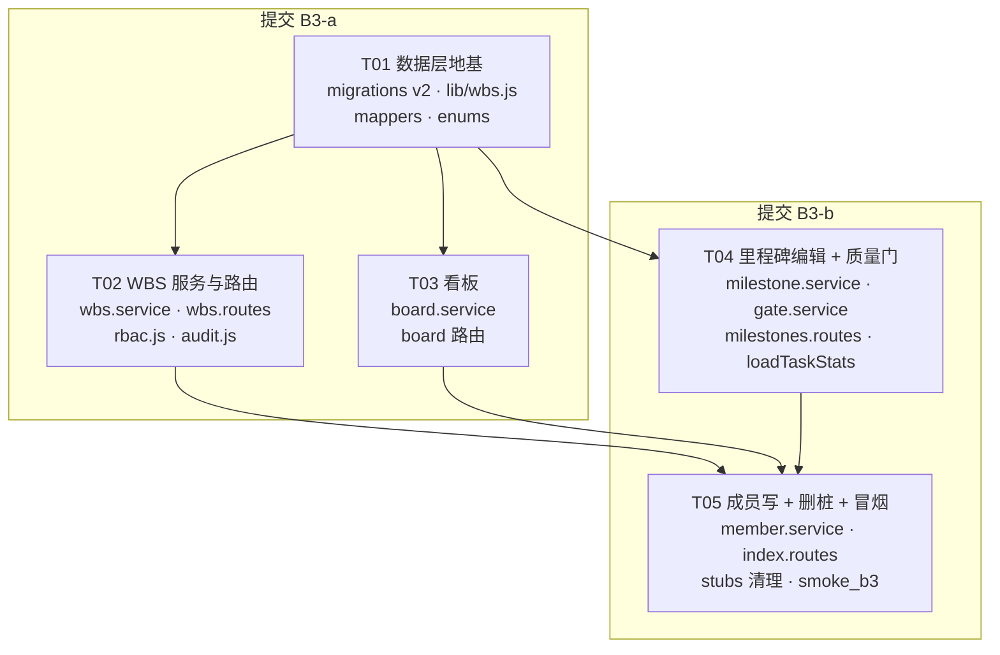

# Connect v1 · 批次 B3 架构校准与任务分解

> 作者：高见远（架构师）　|　基线：当前 `pm-app/` 真实代码（schema v1，B1 已上线，B2 stub 未删）
> 目标：把「WBS 树 / 看板 / 里程碑编辑 / 质量门 / 成员写」从 `stubs.routes.js` 的降级桩换成真实现，落 SQLite。
> 本文档是**工程师唯一施工依据**。设计文档 `connect-设计方案.md` §B3（937–969 行）与本文冲突时，**以本文为准**（本文已对照真实代码校准）。

---

## 一、B3 范围确认

### 1.1 本批次实现（IN）

| # | 能力 | 涉及端点 | 当前状态 |
|---|------|----------|----------|
| 1 | **WBS 树** | `GET/POST /projects/:projectId/wbs`、`PATCH/DELETE /wbs/:id`、`POST /wbs/:id/move` | 桩（GET 返空数组，写 501） |
| 2 | **看板** | `GET /projects/:projectId/board`、`POST /wbs/:nodeId/move-status`、`PATCH /projects/:projectId/board-config` | 桩（GET 返空四列，写 501） |
| 3 | **里程碑编辑** | `POST /projects/:projectId/milestones`、`PATCH/DELETE /milestones/:id` | 桩（写 501）；**读**已在 B1 实现于 `projects.routes.js` |
| 4 | **质量门** | `PATCH /gate-items/:itemId`、`POST /projects/:projectId/gates/:gateId/decide` | 桩（写 501）；**读**已随 `listMilestones` 返回 |
| 5 | **成员写** | `POST /projects/:projectId/members`、`DELETE /projects/:projectId/members/:memberId` | 桩（写 501）；**读**已在 B1 实现 |
| 6 | **项目内 RBAC 守卫** | 中间件 `requireProjectRole` / service 层 `assertCan` | **不存在**，B3 必须补（见 §4.5） |
| 7 | **里程碑 taskStats 真值化** | `project.service.js#loadTaskStats` | 当前 `return {}`（`TODO(批次3)`），B3 接真实 wbs_nodes |

### 1.2 明确不做（OUT，留 B4）

周报（`reports`）、评审（`reviews` / `my-approvals` / 决策链）、变更单（`changes` / `E_MS_NEED_CHANGE` 抛出的 `changeDraft` 落地）、审计日志读接口（`GET /audit`）、项目状态流转（`POST /projects/:id/transition`、结项 `close-check`）、风险 / 文档、`PATCH /projects/:id`（B1 已显式 501，B3 不动）。

> ⚠️ **B3 与 B4 的接缝**：`PATCH /milestones/:id` 延后改期会抛 `E_MS_NEED_CHANGE` 并在 `data` 里带 `changeDraft`。B3 只负责**抛这个错 + 组装 draft 载荷**，不负责创建变更单。前端 Mock 侧行为一致（`mock/index.ts#updateMilestone`），所以切真后端不会退化。
>
> ⚠️ **审计写**：B3 所有写操作都要**写审计行**（口径同 Mock `audit()`），但 `GET /audit` 仍走 B2 的空 Paged 桩。审计表如缺，本批次一并建（见 T01）。

---

## 二、逐文件任务清单

> 总计 **5 个任务**，分 2 个提交（B3-a / B3-b）。所有路径相对 `pm-app/`。
> 依赖关系见 §六 依赖图。T02 / T03 / T04 均只依赖 T01，可并行；T05 收口。

---

### 提交 B3-a：数据层 + WBS + 看板

#### 【T01】数据层地基：迁移 v2 + WBS 纯函数库 + 映射器扩展　`P0`

**依赖**：无（B3 第一块砖）

| 文件 | 动作 |
|------|------|
| `server/dal/migrations.js` | 修改 |
| `server/lib/wbs.js` | **新增** |
| `server/lib/mappers.js` | 修改 |
| `server/config/enums.js` | 修改（仅补 2 个常量） |

##### T01-1　`server/dal/migrations.js`（修改）

新增 `migrationV2(db, now)`，并在 `MIGRATIONS` 数组**追加**（禁止改动 v1）：

```js
const MIGRATIONS = [
  { version: 1, name: 'connect-v1-baseline', up: migrationV1 },
  { version: 2, name: 'connect-v2-wbs-board', up: migrationV2 },   // ← 新增
];
```

建 3 张表（全部 `CREATE TABLE IF NOT EXISTS`，不重建既有表 ⇒ 本迁移不触发 SQLite 12 步流程）：

```sql
-- ① WBS 节点
CREATE TABLE IF NOT EXISTS wbs_nodes (
  id            TEXT PRIMARY KEY,
  project_id    TEXT NOT NULL REFERENCES projects(id)   ON DELETE CASCADE,
  parent_id     TEXT          REFERENCES wbs_nodes(id)  ON DELETE CASCADE,
  wbs_code      TEXT NOT NULL,
  level         INTEGER NOT NULL DEFAULT 1,
  node_type     TEXT NOT NULL DEFAULT 'task',       -- enums.WBS_NODE_TYPES
  name          TEXT NOT NULL,
  description   TEXT NOT NULL DEFAULT '',
  owner         TEXT,                                -- users.open_id；ownerName 派生不落库
  estimate_days REAL NOT NULL DEFAULT 0,
  actual_days   REAL NOT NULL DEFAULT 0,
  start_date    TEXT,
  due_date      TEXT,
  status        TEXT NOT NULL DEFAULT '待办',        -- enums.TASK_STATUSES
  progress      INTEGER NOT NULL DEFAULT 0,
  board_order   INTEGER NOT NULL DEFAULT 0,
  is_critical   INTEGER NOT NULL DEFAULT 0,
  milestone_id  TEXT          REFERENCES milestones(id) ON DELETE SET NULL,
  created_by    TEXT,
  created_at    TEXT NOT NULL,
  updated_at    TEXT NOT NULL
);
CREATE INDEX IF NOT EXISTS idx_wbs_nodes_project   ON wbs_nodes(project_id);
CREATE INDEX IF NOT EXISTS idx_wbs_nodes_parent    ON wbs_nodes(parent_id);
CREATE INDEX IF NOT EXISTS idx_wbs_nodes_milestone ON wbs_nodes(milestone_id);
CREATE INDEX IF NOT EXISTS idx_wbs_nodes_board     ON wbs_nodes(project_id, status, board_order);

-- ② 看板配置（一项目一行）
CREATE TABLE IF NOT EXISTS board_configs (
  project_id  TEXT PRIMARY KEY REFERENCES projects(id) ON DELETE CASCADE,
  columns     TEXT NOT NULL,   -- JSON string[]，缺省 enums.BOARD_COLUMNS
  wip_limits  TEXT NOT NULL,   -- JSON Record<string, number>，缺省 {"进行中": DEFAULT_WIP_LIMIT}
  updated_at  TEXT NOT NULL
);

-- ③ 审计日志（B3 只写，B4 才读）
CREATE TABLE IF NOT EXISTS audit_logs (
  id           TEXT PRIMARY KEY,
  project_id   TEXT,
  entity_type  TEXT NOT NULL,   -- 'project' | 'milestone' | 'gate' | 'wbs_node' | 'member'
  entity_id    TEXT NOT NULL,
  action       TEXT NOT NULL,   -- 'create' | 'update' | 'delete' | 'status_change' | 'decide'
  summary      TEXT NOT NULL,
  diff         TEXT,            -- JSON AuditDiffEntry[]，可为 null
  actor_open_id TEXT,
  actor_name   TEXT,
  created_at   TEXT NOT NULL
);
CREATE INDEX IF NOT EXISTS idx_audit_project ON audit_logs(project_id, created_at);
```

遗留 `tasks` → `wbs_nodes` 数据迁移（**仅当 `tasks` 有行时执行**；新装库为空表，走空循环）：

- 保持 `id` 原样（不加前缀），以便 `report_tasks.task_id` 在 B4 周报接线时仍可对上；
- `parent_id = NULL`、`level = 1`、`node_type = 'task'`；
- `wbs_code = COALESCE(NULLIF(tasks.code,''), 项目内自增序号)`；同项目内如有重复 code，按 `created_at` 排序后强制重排为 `1..n`；
- `estimate_days = normalizeAmount(tasks.est)`（复用文件内已有的 `normalizeAmount` 数字提取逻辑，`est` 是 TEXT）；
- `status` 映射表（源值不在表内 → 一律落 `'待办'`）：

  | 遗留值 | 新值 |
  |---|---|
  | `待开始` / `未开始` / 空 | `待办` |
  | `进行中` | `进行中` |
  | `待评审` / `评审中` | `待评审` |
  | `已完成` / `完成` | `完成` |
  | `阻塞` / `已阻塞` | `阻塞` |

- `milestone_id = tasks.ms_id`（先校验该 id 在 `milestones` 里存在，不存在置 `NULL`，避免 FK 报错）；
- `is_critical = tasks.crit`、`progress = tasks.progress`、`board_order` 按项目内 `rowid` 顺序 0..n-1；
- `created_at = tasks.created_at`、`updated_at = tasks.created_at`、`created_by = NULL`。
- **不删 `tasks` 表**（D-9：legacy 路由仍在用），只是单向复制。

> ⚠️ `run()` 已统一处理事务与 `PRAGMA foreign_keys` 开关，`migrationV2` 内**不要**自己 `BEGIN`。
> ⚠️ `migrationV2` 必须幂等：全部 DDL 用 `IF NOT EXISTS`；数据迁移前先 `SELECT COUNT(*) FROM wbs_nodes` 判空，非空直接跳过。

**验收**：
```bash
rm -f data/app.db && node server.js      # 观察日志出现 [migrations] applied v2 connect-v2-wbs-board
node -e "const d=require('better-sqlite3')('data/app.db');console.log(d.prepare('SELECT version,name FROM schema_migrations').all())"
node server.js                            # 二次启动不得重复 applied
```

##### T01-2　`server/lib/wbs.js`（新增）

**纯函数**，零 I/O、零 `require('../dal')`。逐字移植自前端，**函数名与参数顺序必须与源一致**，便于日后 diff：

| 函数 | 来源 | 关键点 |
|---|---|---|
| `compareWbsCode(a, b)` | `web/src/utils/wbs.ts:45` | 分段数字比较，`1.2.10 > 1.2.9` |
| `indexChildren(nodes)`（内部） | `utils/wbs.ts:68` | `parentId ?? '__root__'` 作 key |
| `parentIdSet(nodes)` | `utils/wbs.ts:109` | 真叶子判定统一入口 |
| `leafNodesOf(nodes)` | `utils/wbs.ts:83` | **SK-4：叶子 = 无子节点，不是 `nodeType==='task'`** |
| `isLeafNode(nodes, nodeId)` | `utils/wbs.ts:92` | |
| `weightedProgress(leaves)` | `utils/wbs.ts:100` | `Σ((estimateDays\|\|1)×progress/100) / Σ(estimateDays\|\|1)`，`Math.round` |
| `rollupProgressFlat(nodes, nodeId)` | `utils/wbs.ts:295` | 子树真叶子加权；叶子自身返回自身 progress |
| `milestoneTaskDetail(nodes, milestoneId)` | `utils/wbs.ts:149` | **口径 Y / SK-M4**：`{milestoneId===msId 的锚点}` ∪ `{锚点子树真叶子}`，Map 按 id 去重，按 `compareWbsCode` 排序；返回 `{nodes, rollupIds, leaves}`。`rollupIds` 服务端返回时转数组（JSON 无 Set） |
| `milestoneTaskStats(nodes, milestoneId)` | `utils/wbs.ts:195` | `total/done` 用**全集**，`progress` 只用 **leaves** 加权 |
| `nextChildCode(parentCode, siblingCodes)` | `utils/wbs.ts:225` | 只看**直接子段**（含 `.` 的尾段跳过）；根层 `parentCode=null` |
| `allowedChildTypes(parent, rules)` | `mock/rules.ts:409` | `targetLevel = parent ? parent.level+1 : 1`；超 `maxDepth` 返 `[]` |
| `subtreeRelativeDepth(nodes, nodeId)` | `mock/rules.ts:420` | 自身 0，最深后代 n；`guard > 64` 兜底防环 |
| `validateWbsPlacement(input, rules)` | `mock/rules.ts:467` | **W-1 深度必须先于 W-2 类型**（否则超深会误报 `E_WBS_PARENT_TYPE`）；返回 `{code, message, data}` 或 `null` |
| `validateWbsDeadline({dueDate, parent, milestone})` | `mock/rules.ts:525` | `diffDays(上限, dueDate) > 0` 即越界（**参数顺序易写反**）；先判父任务再判里程碑 |
| `validateWbsEstimate({estimateDays, startDate, dueDate})` | `mock/rules.ts:563` | `available = diffDays(startDate,dueDate)`；`available<=0` 放行 |
| `syncNodeStatusFromProgress(status, progress)` | `mock/rules.ts:596` | **R4-P0-3 唯一实现**：`>=100→完成`；`===0 且∈{进行中,完成}→待办`；`0<p<100 且∈{待办,完成}→进行中`；`待评审/阻塞` 除规则 1 外不被覆盖 |
| `checkWip(nodes, config, targetStatus, movingNodeId)` | `mock/rules.ts:173` | `limit<=0` 放行；`current` 只数**真叶子**且排除自己；`current+1 > limit` 返 `{limit,current}` |
| `isDescendant(nodes, nodeId, targetId)` | `mock/rules.ts` 无，取 `utils/wbs.ts:313` 的扁平版 | 移动防环，服务端改写成扁平版（沿 `parentId` 上溯 targetId 是否命中 nodeId），`guard>64` 兜底 |
| `renameSubtreePlan(nodes, rootId, newCode)` | `mock/index.ts:2167 renameSubtree` | **改为纯函数**：返回 `Array<{id, wbsCode, level}>` 的重排计划，由 service 批量 UPDATE。子节点按 `compareWbsCode` 排序后依次 `${newCode}.${i+1}`，`level = code.split('.').length` |
| `WBS_NODE_TYPE_LABEL` | `mock/rules.ts` 引用 | `{task:'任务', subtask:'子任务'}`，错误文案要用 |

`resolveWbsRules(template)` **已在 `server/lib/rules.js:189`**，不要重复实现，`wbs.js` 从 `./rules` 引入或由 service 传入。

**验收**（本地 node REPL 断言，不需要起服务）：
```bash
node -e "
const w=require('./server/lib/wbs');
console.assert(w.compareWbsCode('1.2.10','1.2.9')>0,'自然序');
console.assert(w.nextChildCode('1',['1.1','1.2','1.2.1'])==='1.3','nextChildCode 跳过孙节点');
console.assert(w.nextChildCode(null,['1','2'])==='3','根层');
console.assert(w.syncNodeStatusFromProgress('阻塞',100)==='完成','强规则');
console.assert(w.syncNodeStatusFromProgress('待评审',50)==='待评审','人工态不覆盖');
console.assert(w.weightedProgress([{estimateDays:0,progress:100},{estimateDays:1,progress:0}])===50,'零工时权重回落 1');
console.log('wbs.js OK');
"
```

##### T01-3　`server/lib/mappers.js`（修改）

新增 3 个映射函数（风格对齐已有 `toApiMember` / `toApiMilestone`）：

- `toApiWbsNode(row, nameOf)` → 输出严格等于 `web/src/types/wbs.ts#WbsNode` 全部 19 个字段。
  - `parentId`：空串一律 `toNull` 成 `null`；
  - `ownerName`：`nameOf(row.owner)`，查不到用 `''`（**不用 `REMOVED_USER_NAME`**，因为前端 `nodeWarnings` 用 `!node.owner` 判空，名字是纯展示）；
  - `estimateDays` / `actualDays`：`toNum(_, 0)`；`progress` / `boardOrder` / `level`：`toInt`；`isCritical`：`toBool`；
  - `milestoneId`：`toNull`；`description`：`toStr(_, '')`。
- `toApiBoardConfig(row)` → `{projectId, columns: parseJson(row.columns, BOARD_COLUMNS), wipLimits: parseJson(row.wip_limits, {}), updatedAt}`。
- `toApiBoardView(projectId, columnsArr, config)` → `{projectId, columns: BoardColumn[], config}`，其中 `BoardColumn = {status, cards: WbsNode[], wipLimit}`。

`FIELD_EXCEPTIONS` 复核：`wbs_nodes.board_order → boardOrder` 已登记；**新增登记** `wbs_nodes.wbs_code → wbsCode`、`wbs_nodes.node_type → nodeType`、`wbs_nodes.is_critical → isCritical`（若现有自动 snake→camel 转换已覆盖，则只需在注释里标注 "regular"，不必新增例外项——例外表只登记**不能靠通用规则推出**的）。

##### T01-4　`server/config/enums.js`（修改）

仅追加 2 项（其余 B3 需要的枚举**全都已存在**，不要重复加）：

```js
/** 遗留 tasks.status → 新契约 TaskStatus（迁移 v2 用） */
const LEGACY_TASK_STATUS_MAP = Object.freeze({ ... });   // 见 T01-1 映射表
/** WBS 节点类型中文名（错误文案用） */
const WBS_NODE_TYPE_LABEL = Object.freeze({ task: '任务', subtask: '子任务' });
```

---

#### 【T02】WBS 服务与路由　`P0`

**依赖**：T01

| 文件 | 动作 |
|------|------|
| `server/services/wbs.service.js` | **新增** |
| `server/routes/wbs.routes.js` | **新增** |
| `server/middleware/rbac.js` | **新增**（项目内角色守卫，T02/T04/T05 共用） |
| `server/lib/audit.js` | **新增**（写审计的单一入口） |

##### T02-1　`server/middleware/rbac.js`（新增，B3 全批次共用）

服务端权限判定，语义与前端 `web/src/config/permissions.ts#canDo` **逐条对齐**（前端只管按钮显隐，服务端才是安全边界）。

```js
// PERMISSIONS 表：从 web/src/config/permissions.ts 原样搬到 server/config/permissions.js
// canDo(globalRole, action, projectRoles):
//   1) !globalRole            → false
//   2) globalRole === 'admin' → true（超级管理员短路）
//   3) rule.global 命中       → true
//   4) projectRoles 与 rule.project 有交集 → true
```

导出：
- `projectRolesOf(db, projectId, openId)` → `string[]`（查 `project_members`，一人可多角色）；
- `assertCan(db, req, action, projectId)` → 命中返回 `req.user`，否则 `throw new AppError(ErrorCode.E_FORBIDDEN)`（403）。**做成 service 层调用的函数，不做成 Express 中间件**——因为 `PATCH /wbs/:id`、`PATCH /gate-items/:itemId` 的 projectId 要先查库才知道，中间件拿不到；
- `assertWritable(db, projectId)` → 项目 `status ∈ PROJECT_ARCHIVED_STATUSES`（`已结项`/`已终止`）时 `throw AppError(E_PROJECT_ARCHIVED)`。对齐 `mock/index.ts:144 assertWritable`。

B3 用到的 action key（与 `mock/index.ts:114 ACTION_KEY` 一一对应）：

| Mock 别名 | permissions action | 用在 |
|---|---|---|
| `member.manage` | `project:member:assign` | 成员增删（T05） |
| `milestone.edit` | `milestone:edit` | `PATCH /milestones/:id`（T04） |
| — | `milestone:create` | `POST /projects/:id/milestones`（T04） |
| — | `milestone:delete` | `DELETE /milestones/:id`（T04） |
| `gate.check` | `gate:item:check` | `PATCH /gate-items/:itemId`（T04） |
| `gate.decide` | `gate:decide` | `POST /.../gates/:gateId/decide`（T04） |
| `wbs.edit` | `wbs:edit` | WBS 增改移（T02） |
| — | `wbs:delete` | `DELETE /wbs/:id`（T02） |
| `task.move` | `task:status` | `POST /wbs/:nodeId/move-status`（T03） |
| `board.config` | `board:config` | `PATCH /projects/:id/board-config`（T03） |

> ⚠️ **调用次序恒定为**：`requireAuth`（路由级中间件）→ 查实体拿 `projectId` → `assertWritable(db, projectId)` → `assertCan(db, req, action, projectId)` → 业务校验。
> 依据：`mock/index.ts` 每个写方法都是 `assertWritable` 在前、`assertCan` 在后（如 `createWbsNode` L1179-1180、`moveTask` L1467-1468）。**唯一例外**：`updateBoardConfig`（L1508）Mock 里没调 `assertWritable`——真后端**保持一致，也不调**，否则已结项项目改 WIP 会出现真假引擎行为不一致。

##### T02-2　`server/lib/audit.js`（新增）

`writeAudit(db, actor, entityType, entityId, action, projectId, summary, diff)` → 写一行 `audit_logs`，`id = genId('AL')`，`diff` 为 `null` 或 `JSON.stringify(AuditDiffEntry[])`，`actor_name` 取 `actor.name`。对齐 `mock/index.ts:176 audit()`。**永不抛错**（审计失败不能回滚业务；用 try/catch 吞掉并 `console.warn`）。

##### T02-3　`server/services/wbs.service.js`（新增）

导出 5 个方法，**全部在 `db.transaction()` 内执行**：

**(1) `listWbs(db, projectId)`** ← 桩 `GET /projects/:projectId/wbs`
- 查全项目节点，按 `compareWbsCode(wbsCode)` **自然序**（不能用 SQL `ORDER BY wbs_code`，会把 `1.10` 排到 `1.2` 前）；
- 返回 `WbsNode[]`（`data` 直接是数组，不包 `{list,total}`）。

**(2) `createWbsNode(db, req, projectId, payload)`** ← 严格照抄 `mock/index.ts:1176` 的**校验顺序**，顺序错了错误码就不对：

1. `assertWritable` → `assertCan('wbs:edit')`
2. 解析 `parent`：`payload.parentId` 有值但查不到 → `E_NOT_FOUND`；`parent.projectId !== projectId` → `E_VALIDATION`（`data:{parentId}`）
3. `rules = resolveWbsRules(templateOf(projectId))`；`validateWbsPlacement({nodeType, parent}, rules)` → 命中即抛（**fail-fast，先于叶子完整性**）
4. `!payload.owner || !payload.estimateDays` → `E_WBS_LEAF_INCOMPLETE`（新建必为叶子）
5. `milestoneId = payload.milestoneId !== undefined ? payload.milestoneId : (parent?.milestoneId ?? null)`（未传**继承父节点**）；`assertSameProjectMilestone` → 里程碑不属于本项目 → `E_VALIDATION`
6. `wbsCode = nextChildCode(parent?.wbsCode ?? null, 同父兄弟 code[])`
7. `effectiveDue = payload.dueDate ?? addDays(today(), 7)`；`validateWbsDeadline({dueDate: effectiveDue, parent, milestone})` → `E_WBS_DEADLINE_OVERFLOW`
8. `validateWbsEstimate({estimateDays, startDate: payload.startDate ?? today(), dueDate: effectiveDue})` → `E_WBS_ESTIMATE_OVERFLOW`
9. INSERT：`id=genId('W')`、`level=wbsCode.split('.').length`、`boardOrder=本项目现有节点数`、`isCritical=0`、`actualDays=0`、`status=payload.status ?? '待办'`、`progress=payload.progress ?? 0`、`createdBy=req.user.openId`
10. `writeAudit(... 'create' ... '新增 WBS 节点「{code} {name}」')`
11. **`syncWbsProgressStatus(db, projectId)`** → **`refreshMilestoneStatuses(db, projectId)`**（顺序不可换）
12. 返回**该节点**（`WbsNode`，非数组）

**(3) `updateWbsNode(db, req, id, payload)`** ← `mock/index.ts:1263`
- `E_WBS_TYPE_LOCKED`：有子节点时改 `nodeType`（`data:{nodeId, childCount}`）；无子节点改类型须对**其父**重跑 `validateWbsPlacement`
- 字段逐个 diff（`name/description/owner/estimateDays/startDate/dueDate/status/progress/milestoneId/isCritical`），只对**实际变化**的字段记 `AuditDiffEntry`
- 改 `dueDate` / `milestoneId` / `startDate` / `estimateDays` 任一 → 重跑 `validateWbsDeadline` + `validateWbsEstimate`
- **SK-13**：若该节点当前是**真叶子**且改后 `owner` 或 `estimateDays` 为空 → `E_WBS_LEAF_INCOMPLETE`（非叶子不校验，因为汇总节点允许零工时）
- `updatedAt = nowIso()` → `syncWbsProgressStatus` → `refreshMilestoneStatuses`
- 返回该节点

**(4) `deleteWbsNode(db, req, id)`** ← `mock/index.ts:1371`
- **迭代**（非递归）收集整棵子树 id 集合，一次性 `DELETE FROM wbs_nodes WHERE id IN (...)`；不要依赖 FK 级联（`PRAGMA foreign_keys` 状态不保证，且级联不产生审计）
- 写一条审计（summary 含被删节点数）
- `syncWbsProgressStatus` → `refreshMilestoneStatuses`
- 返回 `null`（`ok(null)`）

**(5) `moveWbsNode(db, req, id, newParentId)`** ← `mock/index.ts:1399`
1. `newParentId === id` 或 `isDescendant(nodes, id, newParentId)` → `E_WBS_CYCLE`
2. `depth = subtreeRelativeDepth(nodes, id)`；`validateWbsPlacement({nodeType: node.nodeType, parent: newParent, subtreeDepth: depth}, rules)` → `E_WBS_DEPTH` / `E_WBS_PARENT_TYPE`
3. `newCode = nextChildCode(newParent?.wbsCode ?? null, 新父下兄弟 code[])`
4. `renameSubtreePlan(nodes, id, newCode)` → 批量 UPDATE `wbs_code` + `level`
5. `parent_id = newParentId`、`updatedAt`
6. 审计 `'移动节点「{name}」至 {newCode}'` → `syncWbsProgressStatus`
7. **返回全项目节点数组**（按 `compareWbsCode` 排序）——注意与 (2)(3) 返回单节点不同，这是前端契约（`mock/index.ts:1448` 返回列表）

**(6) 内部引擎 `syncWbsProgressStatus(db, projectId)`** ← `mock/index.ts:318`（R4-P0-3 单点收口）
- 取全项目节点 → 对每个节点 `next = rollupProgressFlat(nodes, n.id)`、`nextStatus = syncNodeStatusFromProgress(n.status, next)`
- **仅当** `progress` 或 `status` 实际变化才 UPDATE，且同时写 `actualDays = round(estimateDays * next / 100, 1)` 与 `updatedAt`
- **不写审计**（派生噪音）

##### T02-4　`server/routes/wbs.routes.js`（新增）

```
GET    /projects/:projectId/wbs        requireAuth  → listWbs
POST   /projects/:projectId/wbs        requireAuth  → createWbsNode      201? → 用 200 + ok(node)（与 B1 建项一致）
PATCH  /wbs/:id                        requireAuth  → updateWbsNode
DELETE /wbs/:id                        requireAuth  → deleteWbsNode      → ok(null)
POST   /wbs/:id/move                   requireAuth  → moveWbsNode        body: {parentId}
POST   /wbs/:nodeId/move-status        requireAuth  → board.service.moveTask   ← T03 提供，路由挂这里
```

全部用 `asyncHandler` 包裹，返回 `ok(data)`。`POST /wbs/:nodeId/move-status` 的 handler 在本文件声明但实现委托 `board.service`，**放在 `POST /wbs/:id/move` 之后**（静态段 `move-status` 与 `:id/move` 不冲突，但保持文件内可读顺序）。

**验收**：
```bash
# 起服务后（token 用 devlogin 拿）
curl -s -XPOST :3000/api/projects/$PID/wbs -H "$AUTH" -d '{"parentId":null,"nodeType":"subtask","name":"x","owner":"ou_liming03","estimateDays":1}' | jq .code
# 期望 "E_WBS_PARENT_TYPE"（根层只能挂 task）
curl -s -XPOST :3000/api/projects/$PID/wbs -H "$AUTH" -d '{"parentId":null,"nodeType":"task","name":"x"}' | jq .code
# 期望 "E_WBS_LEAF_INCOMPLETE"
```

---

#### 【T03】看板服务与配置　`P0`

**依赖**：T01（可与 T02 并行开发，合并时 `wbs.routes.js` 会有一处冲突点：`move-status` 路由）

| 文件 | 动作 |
|------|------|
| `server/services/board.service.js` | **新增** |
| `server/routes/wbs.routes.js` | 修改（挂 `move-status`；由 T02 建文件） |
| `server/routes/projects.routes.js` | 修改（挂 `GET /projects/:id/board`、`PATCH /projects/:id/board-config`） |

> **路由归属决策**：`/projects/:id/board*` 两条**挂在 `projects.routes.js`**（与 `/projects/:id/members`、`/projects/:id/milestones` 同域，避免 `wbs.routes.js` 也去抢 `/projects/:id/*` 前缀导致排查困难）。`/wbs/*` 全部在 `wbs.routes.js`。

##### T03-1　`server/services/board.service.js`（新增）

**(1) `getBoard(db, projectId)`** ← `mock/index.ts:452 buildBoard`
- `config = board_configs[projectId]`，**不存在则惰性建行并落库**：`columns = BOARD_COLUMNS`、`wipLimits = {'进行中': DEFAULT_WIP_LIMIT}`（Mock L454-462 同款惰性创建）
- **Q-3 / SK-4**：卡片 = `leafNodesOf(全项目节点)`，**不是** `nodeType==='task'`
- 每列 `cards` 按 `boardOrder` 升序；`wipLimit = config.wipLimits[status] ?? 0`
- 返回 `BoardView{projectId, columns, config}`

**(2) `moveTask(db, req, nodeId, status, order)`** ← `mock/index.ts:1463`
1. 节点不存在 → `E_NOT_FOUND`
2. `assertWritable` → `assertCan('task:status')`
3. **仅当 `node.status !== status`** 才跑 `checkWip(全项目节点, config, status, nodeId)`；命中 → `E_WIP_EXCEEDED`，`message = "「{status}」列 WIP 已达上限 {limit}，请先完成在办任务"`，`data = {limit, current}`
4. `status = status`、`boardOrder = order`；`status==='完成'` → `progress=100`；`status==='待办' && progress===100` → `progress=0`
5. `actualDays = round(estimateDays * progress / 100, 1)`、`updatedAt`
6. `syncWbsProgressStatus(projectId)` → `refreshMilestoneStatuses(projectId)`（**R4-P1-1 缺口修复，不可省**）
7. 状态真的变了才写审计（`'status_change'` + diff）
8. **返回整个 `BoardView`**（不是单节点）

**(3) `updateBoardConfig(db, req, projectId, wipLimits)`** ← `mock/index.ts:1505`
- `assertCan('board:config')`（**不调 `assertWritable`**，见 T02-1 例外说明）
- UPSERT `board_configs`；`columns` 保持原值（无则 `BOARD_COLUMNS`）
- 审计 `entityType='project'`、`action='update'`、summary 含 `JSON.stringify(wipLimits)`
- 返回 `BoardConfig`（**不是 BoardView**）

##### T03-2　路由

```
GET   /projects/:projectId/board          requireAuth → getBoard
PATCH /projects/:projectId/board-config   requireAuth → updateBoardConfig   body: {wipLimits}
POST  /wbs/:nodeId/move-status            requireAuth → moveTask            body: {status, order}
```

**验收**：
```bash
curl -s ":3000/api/projects/$PID/board" -H "$AUTH" | jq '.data.columns | length'          # 4
curl -s ":3000/api/projects/$PID/board" -H "$AUTH" | jq '.data.config.wipLimits."进行中"'   # 5
# 建 6 个叶子后连续拖第 6 个进「进行中」
curl -s -XPOST ":3000/api/wbs/$NID/move-status" -H "$AUTH" -d '{"status":"进行中","order":0}' | jq .code   # "E_WIP_EXCEEDED"
```

---

### 提交 B3-b：里程碑 + 质量门 + 成员写 + 删桩

#### 【T04】里程碑编辑 + 质量门　`P0`

**依赖**：T01（`milestoneTaskStats` 口径 Y）

| 文件 | 动作 |
|------|------|
| `server/services/milestone.service.js` | **新增** |
| `server/services/gate.service.js` | **新增** |
| `server/routes/milestones.routes.js` | **新增** |
| `server/services/project.service.js` | 修改（`loadTaskStats` 接真值 + 抽出 `refreshMilestoneStatuses` 供复用） |

##### T04-1　`server/services/milestone.service.js`（新增）

**(0) `refreshMilestoneStatuses(db, projectId)`** ← `mock/index.ts:287`（**SK-2 唯一写入口**，T02/T03/T04 全都调它）
- 读全项目里程碑 + 全项目 wbs_nodes；
- `statsByMs[msId] = milestoneTaskStats(nodes, msId)`（口径 Y）；
- `applyMilestoneStatuses(list, project.planStart, today(), statsByMs)`（**已在 `server/lib/rules.js:121`**，直接用）；
- **`status` / `done` 是派生值，绝不 UPDATE 回 `milestones` 表**（决策见 `migrations.js:307` 注释）；
- 同时 `computeHealth(list, gates)` 回写 `projects.health`（Mock L305 同款）。
- ⚠️ 本函数**只做"计算 + 回写 health"**，不写里程碑行。真正落库的自愈只有 `renumberMilestones` 的 `code` 反写（已在 `project.service.js#listMilestones` 里）。

**(1) `createMilestone(db, req, projectId, payload)`** ← `mock/index.ts:970`
- `assertWritable` → `assertCan('milestone:create')`
- `payload = {name, target?, date}`（`contract.ts#MilestoneCreatePayload`）；`name` 空 → `E_VALIDATION`（`data.fields`）；`date` 非法 → `E_VALIDATION`
- `code = 'M' + (maxSeq + 1)`，`maxSeq = max(parseInt(code.replace(/^\D+/,''), 10))`，无碑时为 0
- `required = 0`、`baseline_date = planned_date = payload.date`、`done_at = null`、override 三元组全 `null`
- **不建质量门**（K-1：门只在建项向导显式提交时实例化）
- `renumberMilestones` 落库自愈 → `refreshMilestoneStatuses`
- 审计 `'create'`
- 返回 `MilestoneWithGate`（含 `gate:null`、`gateItems:[]`、`taskStats`），与 `listMilestones` 单项同形

**(2) `updateMilestone(db, req, id, payload)`** ← `mock/index.ts:1064`（**B3 最复杂的一个**）

`payload = {name?, target?, currentDate?, achieved?, statusOverride?}`

按此顺序处理：
1. `assertWritable` → `assertCan('milestone:edit')`
2. **`currentDate` 改期（P0-05 / SK-7 单向规则）**
   - `milestoneDelayNeedsChange(ms, toDate)` ⇔ `diffDays(ms.currentDate, toDate) > 0`
   - **延后** → HTTP 409，`throw new AppError(ErrorCode.E_MS_NEED_CHANGE, '里程碑日期延后须走变更申请', { changeDraft })`
     `changeDraft` 形状**必须逐字等于** `web/src/types/change.ts#ChangeDraft`（`mock/index.ts:1074-1083`）：
     ```js
     { projectId: ms.projectId,
       changeType: 'milestone_date',
       title: `${ms.code} ${ms.name} 里程碑日期调整`,
       targetType: 'milestone',
       targetId: ms.id,
       payload: { fromDate: ms.currentDate, toDate: payload.currentDate } }
     ```
     （前端 `MilestonesPage.tsx:146/194` 直接读 `e.data.changeDraft`，缺字段会静默降级到 `buildFallbackDraft`）
   - **提前 / 同日** → 直接写 `planned_date = toDate`，并 **`clearOverride()`**（override 三元组 + `override_base_date` 全置 null）
   - ⚠️ 触发条件是 `payload.currentDate && payload.currentDate !== ms.currentDate`（**同日直接跳过整个分支**，不清 override）
3. **`achieved`（C-G4）**
   - `true` → `done_at = today()`、`done_by = actor.openId`、`clearOverride()`
   - `false` → `done_at = null`、`done_by = null`、`clearOverride()`
   - ⚠️ **不卡质量门**：Mock L1064 段注释明确"不再卡门，允许直接标记"。**不要**在此抛 `E_GATE_NOT_PASSED`（那是 B4 的项目结项校验用的）
4. **`statusOverride`（SK-2 三元组）**
   - 值必须 ∈ `MILESTONE_OVERRIDES = ['未开始','进行中','已逾期']`（**不含"已达成"** —— 达成只能靠 `doneAt`），否则 `E_VALIDATION`
   - 写 `status_override`、`override_by = actor.openId`、`override_at = nowIso()`、**`override_base_date = 当前 planned_date`（基线快照）**
   - `statusOverride === null` → `clearOverride()`
5. `name` / `target` 常规 diff 写入
6. `renumberMilestones`（改期会改排序 ⇒ code 必须重排，P0-M1/M2）→ `refreshMilestoneStatuses`
7. 审计（diff 逐字段）
8. 返回 `MilestoneWithGate`

**(3) `deleteMilestone(db, req, id)`** ← `mock/index.ts:1027`
- `assertWritable` → `assertCan('milestone:delete')`
- 级联删 `quality_gates`（该碑的）+ `gate_checklist_items`
- **WBS 节点 `milestone_id` 置 `NULL`，不删任务**（SK-12）—— 显式 `UPDATE wbs_nodes SET milestone_id=NULL WHERE milestone_id=?`，不依赖 FK `ON DELETE SET NULL`
- 删里程碑行 → `renumberMilestones`（剩余碑重排 M1..Mn）→ `refreshMilestoneStatuses`
- 返回 `null`

##### T04-2　`server/services/gate.service.js`（新增）

**(1) `toggleGateItem(db, req, itemId, checked)`** ← `mock/index.ts:900`
- 由 `gate_checklist_items` → `quality_gates` 反查 `projectId`
- `assertWritable` → `assertCan('gate:item:check')`
- 写 `checked`（0/1）、`checked_by = actor.openId`（取消勾选时置 `null`）、`checked_at = nowIso()`/`null`
- 审计 → 返回**该门的完整 `QualityGate` + `gateItems`**（前端勾完要立刻看到 `ready` 变化）

**(2) `decideGate(db, req, projectId, gateId, {conclusion, comment})`** ← `mock/index.ts:919`
1. `assertWritable` → `assertCan('gate:decide')`
2. `conclusion` 必须 ∈ 门结论枚举，否则 `E_VALIDATION`
3. **`conclusion !== '不通过'` 时**跑 `gateReady(items)`；`!ready` → `E_GATE_ITEM_INCOMPLETE`，`data = { unchecked: [{id, content}] }`
   （"不通过"允许在没勾齐时直接下结论——这是 Mock 的明确分支，别漏）
4. 写 `status`、`conclusion`、`comment`、`decided_by`、`decided_at = today()`
5. **`GATE_PASSED_STATUSES = ['已通过','有条件通过']` 含该结论 → `achieveMilestoneByGate()`**：
   - `mock/index.ts:429`：**仅当 `ms.done_at` 为空**才写 `done_at = today()`、`done_by = actor.openId`、`clearOverride()`（幂等，重复决策不改日期）
   - 写一条 `'status_change'` 审计
   - 调 `refreshMilestoneStatuses(projectId)`
6. 返回该 `QualityGate`（含 items）

`gateReady(items)` ← `mock/rules.ts:155`，纯函数，放 `server/lib/rules.js`（该文件已是纯函数库）。

##### T04-3　`server/routes/milestones.routes.js`（新增）

```
POST   /projects/:projectId/milestones            requireAuth → createMilestone
PATCH  /milestones/:id                            requireAuth → updateMilestone
DELETE /milestones/:id                            requireAuth → deleteMilestone
PATCH  /gate-items/:itemId                        requireAuth → toggleGateItem     body: {checked}
POST   /projects/:projectId/gates/:gateId/decide  requireAuth → decideGate         body: {conclusion, comment}
```

> `GET /projects/:projectId/milestones` **留在 `projects.routes.js`**（B1 已实现，不搬家，避免读写分家引发回归）。

##### T04-4　`server/services/project.service.js`（修改）

- `loadTaskStats(db, projectId, milestoneIds)`：删掉 `return {}` 和 `TODO(批次3)`，改为读 `wbs_nodes` → 对每个 msId 调 `wbs.milestoneTaskStats(nodes, msId)`。无节点时返回 `emptyTaskStats()`（`rules.js:139` 已有）。
- 把 `listMilestones` 里现有的「`renumberMilestones` + `applyMilestoneStatuses` + `loadGates`」抽成 `milestone.service.refreshMilestoneStatuses` 的**读路径复用**，避免两份实现漂移。
  - 最小改法：`project.service.listMilestones` 内部改调 `require('./milestone.service').listMilestonesWithGate(db, projectId)`，`project.service` 只保留薄转发。**注意循环依赖**：`milestone.service` 不要反向 require `project.service`，需要的项目行自己查。

**验收**：
```bash
# 延后改期 → 409
curl -s -XPATCH ":3000/api/milestones/$MID" -H "$AUTH" -d '{"currentDate":"2099-01-01"}' -o /dev/null -w '%{http_code}\n'   # 409
curl -s -XPATCH ":3000/api/milestones/$MID" -H "$AUTH" -d '{"currentDate":"2099-01-01"}' | jq '.code, .data.changeDraft.toDate'
# 提前改期 → 成功 + code 重排
curl -s -XPATCH ":3000/api/milestones/$MID" -H "$AUTH" -d '{"currentDate":"2025-01-01"}' | jq .code
curl -s ":3000/api/projects/$PID/milestones" -H "$AUTH" | jq '[.data[].code] | join(",")'   # 恒为 M1,M2,...Mn
# 未勾齐出结论 → E_GATE_ITEM_INCOMPLETE
curl -s -XPOST ":3000/api/projects/$PID/gates/$GID/decide" -H "$AUTH" -d '{"conclusion":"已通过","comment":""}' | jq '.code, (.data.unchecked|length)'
# 勾齐后通过 → 里程碑自动达成
curl -s ":3000/api/projects/$PID/milestones" -H "$AUTH" | jq '.data[] | select(.id=="'$MID'") | {status, done, doneAt}'
```

---

#### 【T05】成员写 + 删桩 + 冒烟脚本　`P0`

**依赖**：T02（rbac.js / audit.js）、T03、T04（删桩前真路由必须全在）

| 文件 | 动作 |
|------|------|
| `server/services/member.service.js` | **新增** |
| `server/routes/projects.routes.js` | 修改（补成员写 2 条） |
| `server/routes/index.routes.js` | 修改（挂 `wbs.routes` / `milestones.routes`） |
| `server/routes/stubs.routes.js` | 修改（**删除 12 条 B3 桩**） |
| `scripts/smoke_b3.mjs` | **新增** |
| `scripts/smoke_connect.mjs` | 修改（⑪ 段桩断言失效，必须同步） |

##### T05-1　`server/services/member.service.js`（新增）

**(1) `addMember(db, req, projectId, {userOpenId, role})`** ← `mock/index.ts:859`
- `assertWritable` → `assertCan('project:member:assign')`
- 用户不存在 → `E_NOT_FOUND`
- **`role ∈ {'pm','tl'}` 且项目内已有同角色成员 → `E_ROLE_CARDINALITY`**（`data:{role, existing: {userOpenId, userName}}`）。复用 `project.service.assertMemberCardinality` 的判定口径，但**这里是单条增量判定**，不是建项时的全量判定，需单独实现一个 `assertRoleUnique(db, projectId, role)`
- 重复 `(projectId, userOpenId, role)` → UNIQUE 冲突，先查后插并返回 `E_VALIDATION('该成员已有此角色')`，别让 SQLITE_CONSTRAINT 冒到 500
- INSERT `project_members`（`id=genId('MB')`、`assigned_by=actor.openId`、`assigned_at=nowIso()`）
- 审计 `entityType='member'`、`action='create'`
- 返回 `ProjectMember`（含派生 `userName`）

**(2) `removeMember(db, req, projectId, memberId)`** ← `mock/index.ts:883`
- `assertWritable` → `assertCan('project:member:assign')`
- 成员不存在或 `project_id` 不匹配 → `E_NOT_FOUND`
- **被删角色 ∈ {'pm','tl'} → `E_ROLE_CARDINALITY`**（`message: 'PM / TL 是必备角色，不能移除，请先指派新的负责人'`）
- DELETE → 审计 → 返回 `null`

> ⚠️ B 类项目的 PO 必填（`E_PROJECT_PO_REQUIRED`）**只在建项时校验**，Mock 的 `removeMember` 没有拦 PO。真后端保持一致，别自作主张加。

##### T05-2　`server/routes/projects.routes.js`（修改）

在 `listMembers` 之后追加（**不要动 `/projects/classify` 必须早于 `/projects/:id` 的既有顺序**）：
```
POST   /projects/:projectId/members              requireAuth → addMember
DELETE /projects/:projectId/members/:memberId    requireAuth → removeMember
GET    /projects/:projectId/board                requireAuth → board.getBoard          （T03）
PATCH  /projects/:projectId/board-config         requireAuth → board.updateBoardConfig （T03）
```

##### T05-3　`server/routes/index.routes.js`（修改）

```js
router.use(authRoutes);
router.use(metaRoutes);
router.use(projectsRoutes);
router.use(wbsRoutes);          // ← 新增（B3）
router.use(milestonesRoutes);   // ← 新增（B3）
router.use(adminRoutes);
router.use(workbenchRoutes);
router.use(stubsRoutes);        // 桩必须仍在最后（兜 B4 未实现项）
router.use(legacyRoutes);
router.use(apiNotFound);
```
同步更新文件头注释里的编号列表（1..9）。

##### T05-4　`server/routes/stubs.routes.js`（修改）— 删除以下 **12 条**

| # | 桩路由 | 由谁接管 |
|---|--------|----------|
| 1 | `POST /projects/:projectId/members` | T05 |
| 2 | `DELETE /projects/:projectId/members/:memberId` | T05 |
| 3 | `POST /projects/:projectId/milestones` | T04 |
| 4 | `PATCH /milestones/:id` | T04 |
| 5 | `DELETE /milestones/:id` | T04 |
| 6 | `PATCH /gate-items/:itemId` | T04 |
| 7 | `POST /projects/:projectId/gates/:gateId/decide` | T04 |
| 8 | `GET /projects/:projectId/wbs` | T02 |
| 9 | `POST /projects/:projectId/wbs` | T02 |
| 10 | `PATCH /wbs/:id` / `DELETE /wbs/:id` | T02 |
| 11 | `POST /wbs/:id/move` / `POST /wbs/:nodeId/move-status` | T02 / T03 |
| 12 | `GET /projects/:projectId/board` / `PATCH /projects/:projectId/board-config` | T03 |

即：**所有带 `TODO(批次3)` 注释的行全部删干净**。删完 `grep -n "批次3" server/routes/stubs.routes.js` 必须**零命中**。

##### T05-5　`scripts/smoke_connect.mjs`（修改）

⑪ 段「降级桩」的这 4 条断言在 B3 后**语义变了**，必须改，否则 B1 冒烟会误报红：

| 行 | 现断言 | B3 后应改为 |
|---|---|---|
| 340 | `stub wbs → data 是数组` | 保留（真路由也是数组），但标签改成 `wbs list` |
| 354-356 | `stub board → 四列 / config.wipLimits 存在` | 保留断言、改标签；**新增** `config.wipLimits['进行中'] === 5` |
| 361-362 | `POST /wbs → E_NOT_IMPLEMENTED 501` | **改为**：缺 owner/estimateDays 的 POST → `E_WBS_LEAF_INCOMPLETE` 400 |
| — | — | **新增**：`PATCH /projects/:id`（B1 的 501）仍作为「未实现写操作」样本 |

##### T05-6　`scripts/smoke_b3.mjs`（新增）

复用 `smoke_connect.mjs` 的断言工具（`assert` / `okData` / `expectError` / `findSnakeCaseKeys`），覆盖 §五 DoD 的全部断言。`package.json` 加脚本：
```json
"smoke": "node scripts/smoke_connect.mjs",
"smoke:b3": "node scripts/smoke_b3.mjs"
```

---

## 三、设计文档 vs 当前代码 · 偏差清单

| # | 设计文档 §B3 的说法 | 当前代码实况 | 处理建议 |
|---|---|---|---|
| D1 | B3-a 列 `server/lib/wbs.js`「新增 wbs_code / 重排 / 层级校验」 | ✅ 文件不存在，需新增。但设计**低估了范围**：还需 `checkWip`、`milestoneTaskStats`（口径 Y）、`weightedProgress`、`rollupProgressFlat`、`syncNodeStatusFromProgress`、`isDescendant`——共 18 个纯函数 | **采纳扩大范围**，见 T01-2 全表。这些函数在 `web/src/utils/wbs.ts` + `mock/rules.ts` 已定型，逐字移植，不重新设计 |
| D2 | B3-b 列 `server/routes/milestones.routes.js`（新增） | ✅ 确认不存在，与设计一致 | 保持「新增」。但**读接口 `GET /projects/:id/milestones` 已在 `projects.routes.js`**，**不要**搬过来 |
| D3 | 迁移新增 `wbs_nodes` / `board_configs` | ✅ 当前 `MIGRATIONS` 只有 v1，两表都无 | 新增 **v2**（`connect-v2-wbs-board`）。**额外**：还缺 `audit_logs` 表——Mock 每个写操作都 `audit()`，真后端不建表就只能丢审计。**建议一并放 v2**（见 T01-1 ③），B4 读接口直接可用 |
| D4 | 未提 RBAC | ❌ `server/middleware/auth.js` 只有 `requireAuth` / `requireGlobalRole`，**没有项目内角色判定**；`web/src/config/permissions.ts` 的 `canDo` 从未移植 | **B3 必须补**（T02-1）。做成 `server/config/permissions.js` + `server/middleware/rbac.js` 的 `assertCan(db, req, action, projectId)` **函数**（非 Express 中间件），因为 `PATCH /wbs/:id` 等路由的 projectId 要先查库 |
| D5 | 未提 `loadTaskStats` | ❌ `project.service.js#loadTaskStats` 硬编码 `return {}`（`TODO(批次3)`） | T04-4 接真值。这条不做的话，B3 上线后里程碑时间轴的关联任务数**恒为 0**，看起来像 WBS 没生效 |
| D6 | 未提 mappers | ❌ 缺 `toApiWbsNode` / `toApiBoardConfig` / `toApiBoardView` | T01-3 补。`FIELD_EXCEPTIONS` 已有 `board_order → boardOrder`，说明设计时预留过 |
| D7 | 未提路由挂载顺序 | `index.routes.js` 当前 auth→meta→projects→admin→workbench→**stubs**→legacy | 新路由必须插在 **stubs 之前**（T05-3）。stubs 保留在原位兜 B4 |
| D8 | 未提冒烟脚本 | `scripts/smoke_connect.mjs` ⑪ 段有 4 条**断言 B3 桩存在**的用例（L340/354/361） | **删桩会让 B1 冒烟变红**。T05-5 必须同步改，否则 CI 误报 |
| D9 | 未提错误码 | ✅ `server/lib/errors.js` 的 `ErrorCode` **B3 所需 15 个码全部齐备**，HTTP 映射也配好了（WBS 类 400、`E_MS_NEED_CHANGE`/`E_WIP_EXCEEDED` 409） | **不需要新增错误码**。工程师照抄常量名即可，别自己造新码 |
| D10 | 未提 tasks 表去留 | `tasks` 表被 legacy 路由（D-9）与 `report_tasks` 引用；`seed.js` **不种 tasks 数据** | v2 只做**单向复制**到 `wbs_nodes`，**不删 `tasks`**。新装库该迁移是空跑 |
| D11 | 未提 `updateBoardConfig` 的只读拦截 | Mock `updateBoardConfig`（L1508）**没有** `assertWritable`，而其余写方法都有 | 真后端**照抄 Mock**（不加 `assertWritable`）。这是行为一致性优先于"看起来更严谨"的取舍；若要改，得 Mock / 真后端同改，不在 B3 范围 |
| D12 | 未提 `achieved` 与质量门的关系 | Mock `updateMilestone` 的 `achieved` 分支**注释明确写着「不再卡门」** | 真后端不要在 `PATCH /milestones/:id` 抛 `E_GATE_NOT_PASSED`。该码留给 B4 的项目结项校验（`close-check`） |
| D13 | 未提 `POST /wbs/:id/move` 的返回形状 | Mock 返回**整个项目节点数组**（L1448），而 create/update 返回单节点 | 照抄。工程师容易顺手统一成单节点，会让前端树刷新失效 |

---

## 四、共享约定（Shared Knowledge）

### 4.1 响应信封

- 成功恒 `{code: 0（数字）, data, message}`，用 `envelope.ok(data)`；
- 失败恒 `{code: 'E_xxx'（字符串）, data, message}`，**只抛 `AppError`**，由 `errorMiddleware` 转信封；
- **列表接口 `data` 直接是数组**，禁止 `{list, total}`。分页只有 `listProjects` / `listAudit`；
- 路由 handler 一律 `asyncHandler(...)` 包裹。

### 4.2 字段命名：DB 列名 ↔ API 字段名

**通用规则**：snake_case → camelCase 自动转换。**例外表**（`mappers.js#FIELD_EXCEPTIONS`）：

| 表 | DB 列 | API 字段 | 依据 |
|---|---|---|---|
| `milestones` | `planned_date` | **`currentDate`** | D-10（`current` 是 SQLite 保留字风险，且前端语义是"当前计划日期"） |
| `users` | `global_role` | `globalRole` | 已有 |
| `wbs_nodes` | `board_order` | `boardOrder` | 已有 |

**派生字段（不落库）**：
- `milestones.status` / `milestones.done` → `rules.deriveMilestoneStatus` 推导（SK-2）
- `milestones.delayDays` → `diffDays(baseline_date, planned_date)`，在 `toApiMilestone` 里算，**不加 `delay_days` 列**
- `wbs_nodes.ownerName` / `project_members.userName` → `makeNameLookup(db)` 查 `users`
- `milestones.taskStats` → `wbs.milestoneTaskStats`（口径 Y）
- `projects.health` → `rules.computeHealth`（**这个是回写落库的**，见 `refreshMilestoneStatuses`）

**响应体禁止出现下划线字段**（`smoke_connect.mjs#findSnakeCaseKeys` 会全量递归扫）。

### 4.3 wbs_code 生成与重排规则

- **新建**：`nextChildCode(parent?.wbsCode ?? null, 同父兄弟的 wbsCode[])`
  - 根层 → `'1'`、`'2'`…；子层 → `'1.1'`、`'1.2'`…
  - 只看**直接子段**：兄弟列表里含 `.` 的尾段（孙节点混入）直接跳过
  - **不复用空洞**：删掉 `1.2` 后新建仍是 `1.3`（`max+1` 语义）
- **移动**：目标父下取 `nextChildCode` 得 `newCode`，然后 `renameSubtreePlan` 把整棵子树按 `compareWbsCode` 排序后重排为 `newCode.1`、`newCode.2`…
- **排序**：一律 `compareWbsCode`（分段数字比较）。**禁止** SQL `ORDER BY wbs_code`（字典序会把 `1.10` 排到 `1.2` 前）
- `level = wbsCode.split('.').length`，每次改 code 必须同步改 level

### 4.4 里程碑派生状态与编号（SK-2 / P0-M1 / P0-M2）

- **唯一真值三元组**：`done_at` + `(status_override, override_by, override_at, override_base_date)` + `planned_date`
- `status` / `done` **永不落库**，读路径统一 `rules.applyMilestoneStatuses(list, planStart, today(), statsByMs)`
- `code` 是**派生但落库自愈**的：`rules.renumberMilestones(sortMilestones(list))` 按 `compareMilestones`（`currentDate` → `createdAt` → `id` numeric localeCompare）反写 `M1..Mn`，幂等
- **override 失效条件**：`isOverrideValid(ms)` —— `override_base_date !== planned_date` 时覆盖自动作废。因此**任何改期都必须 `clearOverride()`**
- `MILESTONE_OVERRIDES = ['未开始','进行中','已逾期']`，**不含"已达成"**（达成只能靠 `done_at`）

### 4.5 RBAC 约定

- **调用次序恒定**：`requireAuth` → 查实体拿 `projectId` → `assertWritable(db, projectId)` → `assertCan(db, req, action, projectId)` → 业务校验
- `canDo` 逻辑（照抄 `web/src/config/permissions.ts:60`）：`admin` 短路放行 → `rule.global` 命中 → `projectRoles ∩ rule.project` 非空
- `assertWritable`：项目 `status ∈ ['已结项','已终止']` → `E_PROJECT_ARCHIVED`（403）
- **唯一例外**：`updateBoardConfig` 不调 `assertWritable`（与 Mock 一致，见 D11）
- 服务端权限表 `server/config/permissions.js` 必须与 `web/src/config/permissions.ts` **逐条一致**；两边任一改动都要同改（在两个文件头互相写 `@sync-with` 注释）

### 4.6 引擎调用顺序（R4-P0-3 / R4-P1-1）

任何改动 WBS 结构或进度的写操作，收尾**固定两步、顺序不可换**：

```
syncWbsProgressStatus(db, projectId)      // ① 自底向上回写 progress + 收敛 status
refreshMilestoneStatuses(db, projectId)   // ② 重算 taskStats / 里程碑状态 / 项目 health
```

触发点：`createWbsNode` / `updateWbsNode` / `deleteWbsNode` / `moveWbsNode` / `moveTask`。
里程碑侧写操作（create/update/delete milestone、decideGate）只需 ②。

### 4.7 事务与错误

- 每个写方法整体包在 `db.transaction(fn)()` 里；抛 `AppError` 会自动回滚
- 审计写失败**不回滚业务**（`audit.js` 内部 try/catch）
- 错误码常量**只从 `server/lib/errors.js#ErrorCode` 取**，不写字面量字符串
- `E_VALIDATION` 的 `data` 必须是 `{fields: [{field, message}]}` 结构化数组（B1 冒烟 L259 已在断言）

### 4.8 日期

- 全部走 `server/lib/dates.js`（与前端 dayjs UTC 零点解析逐字一致）
- `diffDays(a, b) = b - a`（天）。**"晚于上限"= `diffDays(上限, 待检日) > 0`**，参数顺序历史上写反过两次
- 日期字段格式恒为 `YYYY-MM-DD`；时间戳字段恒为 `nowIso()`（ISO 8601 UTC）

---

## 五、B3 完成定义（DoD）

### 5.1 硬性门槛

1. `grep -rn "TODO(批次3)" server/` **零命中**
2. `grep -rn "E_NOT_IMPLEMENTED" server/routes/stubs.routes.js` 只剩 B4 项（周报/评审/变更/流转/结项）
3. `rm -f data/app.db && node server.js` → 日志出现 `applied v2`；二次启动无重复
4. `node scripts/smoke_connect.mjs` 全绿（⑪ 段已按 T05-5 更新）
5. `node scripts/smoke_b3.mjs` 全绿
6. 响应体全量扫描无 snake_case 字段（`findSnakeCaseKeys` 复用）

### 5.2 `smoke_b3.mjs` 必测断言清单

**WBS**
- `POST /wbs`（根层 `nodeType:'subtask'`）→ `E_WBS_PARENT_TYPE` 400
- `POST /wbs`（缺 owner）→ `E_WBS_LEAF_INCOMPLETE` 400
- 连挂 4 层后第 5 层 → `E_WBS_DEPTH` 400，`data.maxDepth === 4`
- `dueDate` 晚于父任务 → `E_WBS_DEADLINE_OVERFLOW` 400
- `dueDate` 晚于所属里程碑 `currentDate` → `E_WBS_DEADLINE_OVERFLOW` 400
- `estimateDays: 30` + 区间 5 天 → `E_WBS_ESTIMATE_OVERFLOW` 400，`data.available === 5`
- `POST /wbs/:id/move` 移到自己后代下 → `E_WBS_CYCLE` 400
- 把 3 层子树移到第 3 层 → `E_WBS_DEPTH`（验证 `subtreeRelativeDepth` 生效）
- 有子节点的节点改 `nodeType` → `E_WBS_TYPE_LOCKED` 400
- `GET /wbs` 返回顺序：构造 `1.2` / `1.10` 后断言 `1.2` 在 `1.10` **之前**
- 建 `1.1`/`1.2`/`1.3` 后删 `1.2`，再建 → 新节点 code 为 `1.4`（不复用空洞）
- 删父节点 → 整棵子树消失（`GET /wbs` 条数对得上）
- 移动 `1.2` 到 `2` 下 → 其子树 code 全部变为 `2.x.y`，`level` 同步

**看板**
- `GET /board` → 4 列、`config.wipLimits['进行中'] === 5`
- 卡片只含**真叶子**：给某叶子加一个子节点后，该节点从看板消失、子节点出现（验证 SK-4）
- 第 6 张卡拖进「进行中」→ `E_WIP_EXCEEDED` 409，`data.limit === 5`
- 拖到「完成」→ 该卡 `progress === 100`；其父节点 `progress` 按加权上升（验证 `rollupProgressFlat`）
- 拖到「进行中」但 `progress` 已是 100 → 引擎收敛回「完成」（验证 `syncNodeStatusFromProgress` 强规则）
- `PATCH /board-config` 改 WIP → `GET /board` 立刻反映

**里程碑**
- `POST /milestones` → 新碑 `code` 为 `M{n+1}`，`required === false`，`gate === null`
- 建碑后 `GET /projects/:id/milestones` 的 `code` 序列恒为 `M1..Mn` 且按 `currentDate` 升序
- `PATCH` 延后 → HTTP **409** + `E_MS_NEED_CHANGE` + `data.changeDraft.{fromDate,toDate}` 齐全
- `PATCH` 提前 → 200，且 `code` 重排、`statusOverride` 被清空
- `PATCH {statusOverride:'已达成'}` → `E_VALIDATION`（枚举不含）
- `PATCH {statusOverride:'已逾期'}` → `status === '已逾期'`；随后 `PATCH {currentDate: 更早}` → override 失效，`status` 回归派生值
- `PATCH {achieved:true}` → `doneAt` 非空、`status === '已达成'`、`done === true`（且**不报** `E_GATE_NOT_PASSED`）
- `DELETE /milestones/:id` → 关联 WBS 节点仍在，但 `milestoneId === null`；剩余碑 code 重排为 `M1..Mn-1`

**质量门**
- `PATCH /gate-items/:itemId {checked:true}` → 返回的门 items 中该项 `checked === true`、`checkedBy` 非空
- 未勾齐 `POST /gates/:id/decide {conclusion:'已通过'}` → `E_GATE_ITEM_INCOMPLETE` + `data.unchecked` 非空数组
- 未勾齐但 `conclusion:'不通过'` → **成功**（验证例外分支）
- 勾齐后 `'已通过'` → 门 `status='已通过'`，**其里程碑 `doneAt` 自动写入、`status === '已达成'`**
- 重复决策 → `doneAt` **不变**（幂等）
- `'有条件通过'` 同样触发达成（`GATE_PASSED_STATUSES`）

**成员写**
- `POST /members {role:'pm'}`（已有 pm）→ `E_ROLE_CARDINALITY` 400
- `POST /members {role:'member'}` → 200，`GET /members` 条数 +1，`userName` 非空
- `DELETE /members/:id`（目标是 tl）→ `E_ROLE_CARDINALITY` 400
- `DELETE /members/:id`（目标是普通 member）→ 200，条数 -1

**RBAC / 只读**
- 用 `ou_xxx`（globalRole=`member`，非项目 pm/tl）登录 → `POST /wbs` 返回 `E_FORBIDDEN` 403
- 同一账号 `POST /wbs/:id/move-status` → **成功**（`task:status` 对全角色开放）
- 项目置为「已结项」后任意 WBS 写 → `E_PROJECT_ARCHIVED` 403

**联动**
- 建 3 个挂 M2 的叶子并各拖到「完成」→ `GET /milestones` 中 M2 的 `taskStats.total === 3`、`done === 3`、`progress === 100`
- 口径 Y 验证：给某个**直接绑定 M2 的骨架 task** 拆两个子任务 → M2 的 `taskStats.total === 3`（骨架自身 + 2 子），`progress` 只按 2 个叶子加权

### 5.3 双引擎一致性验收（最终门槛）

按下列**同一操作序列**分别在 `VITE_USE_MOCK=true` 与 `VITE_USE_MOCK=false` 下手工走一遍，页面表现（数字、状态徽标、报错文案、按钮禁用态）必须**逐项一致**：

```
1. 进入项目 → WBS 页 → 根层新建任务 T1（owner=李明, 估算 3 人日, 起止 7 天）
2. T1 下新建子任务 T1.1（估算 2 人日）→ 观察 T1 变成汇总节点、进度变 0%
3. 在 T1.1 下再试建子任务 → 「新建」入口应禁用（子任务下不能挂）
4. 根层再建 T2，把 T1 拖到 T2 下 → 编码变 2.1 / 2.1.1，层级徽标同步
5. 看板页 → 把 T1.1 拖到「完成」→ T1 进度变 100%，状态变「完成」
6. 反复拖 6 张卡进「进行中」→ 第 6 张弹「WIP 已达上限 5」
7. 里程碑页 → M2 关联任务数应为 (骨架 + 叶子) 全集，点开钻取弹窗条目数 === 列表数字
8. M2 改期延后 → 弹「需走变更单」；改期提前 → 成功且编号可能重排
9. M2 手工置「已逾期」→ 徽标变化；再改期 → 覆盖自动作废
10. 质量门未勾齐点「已通过」→ 弹未完成项清单；勾齐后通过 → M2 自动打勾「已达成」
11. 成员页 → 加第二个 PM → 报「PM 只能有一名」；删 TL → 报「必备角色不能移除」
12. 刷新页面 → 上述所有状态**持久**（真后端）/ 存 localStorage（Mock）
```

---

## 六、任务依赖图



**并行建议**：T01 完成后，T02 / T03 / T04 可三人并行。T02 产出的 `rbac.js` + `audit.js` 是 T03/T04 的隐式依赖 —— 建议**由 T01 的人先把这两个文件的骨架（函数签名 + 空实现）提交**，避免三路各写一份。

---

## 七、待明确事项（需主理人 / PM 拍板）

| # | 事项 | 我的默认方案 | 风险 |
|---|---|---|---|
| Q1 | **`audit_logs` 表是否放在 B3** | 放 v2 一起建（T01-1 ③）。理由：Mock 每个写操作都产审计，B3 不建表就得在服务层散落 `// TODO 审计`，B4 再回来改一遍所有写方法，返工成本高 | 若判定 B4 再做，则 B3 的 `audit.js` 退化成 no-op stub，服务层调用点保留 |
| Q2 | **`server/config/permissions.js` 与前端表的同步机制** | 手工双写 + 文件头 `@sync-with` 注释 + 在 `smoke_b3.mjs` 加一条断言（比对 action key 集合是否一致，通过新增 `GET /api/meta/permissions` 只读端点暴露服务端表） | 长期会漂移。彻底方案是抽 `shared/permissions.json` 双端引用，但要改前端构建配置，超出 B3 范围 |
| Q3 | **`POST /wbs` 的 `E_WBS_LEAF_INCOMPLETE` 是否太严** | 照抄 Mock（必须有 owner + estimateDays）。前端表单已是必填 | 若 PM 希望"先建骨架后补人"，需 Mock / 真后端同改，属需求变更不属 B3 |
| Q4 | **`updateBoardConfig` 允许在已结项项目上操作**（D11） | 照抄 Mock 保持一致 | 语义上偏松。若要收紧，Mock 与真后端同改，我建议**留到 B4 统一评审只读边界** |
| Q5 | **旧 `tasks` 表迁移后是否双写** | 单向复制，之后 `tasks` **冻结**（legacy 路由继续读它，但不再有新数据写入） | legacy 页面看到的任务会与新 WBS 分叉。建议 B4 随 legacy 路由一并下线；B3 只需在 `legacy.routes.js` 头部注释里标注这一点 |
| Q6 | **`GET /projects/:id/wbs` 是否要支持 `?milestoneId=` 过滤** | B3 不做，返回全量由前端 `buildTree`（Mock 也是全量） | 项目节点上千时首屏会慢。当前规模（演示数据 < 100 节点）无压力 |
| Q7 | ~~`changeDraft` 字段形状~~ | **已核实关闭**：形状见 T04-1(2)，与 `web/src/types/change.ts#ChangeDraft` 完全对齐 | — |
| Q8 | **`milestones.delayDays` 是否落库** | **不落库**，由 `mappers.toApiMilestone` 用 `diffDays(baseline_date, planned_date)` 派生（`mappers.js` 已 require `diffDays`，Mock L1087 也是即时算）。工程师**不要**在 v2 里加 `delay_days` 列 | 若误加列会出现双真源，改期时忘记同步就错 |
