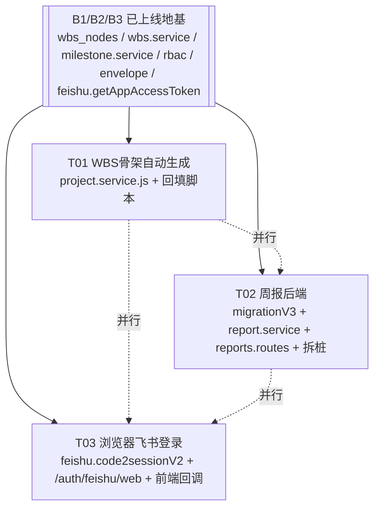
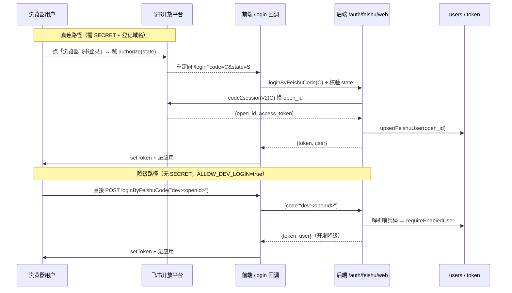

# Connect v1 · 批次 B4（含 B3 补丁）架构设计与任务分解

> 作者：高见远（架构师）　|　基线：当前 `pm-app/` 真实代码（schema v2，B1/B2/B3 已上线，周报仍为桩，飞书仅 JSSDK 免登）
> 目标：在真实后端把三件事从「缺口 / 桩 / 仅飞书内免登」变为真正可用：
> 1. **WBS 骨架自动生成（B3 补丁）**——建项时按模板 `per-milestone` 规则给每个里程碑自动生成 1 个顶层 WBS 节点并绑定 `milestoneId`；老项目一次性回填。
> 2. **周报 / 工作日志后端（B4）**——替换 `stubs.routes.js` 的周报桩，落结构化表 + service + route；前端 store 切真实接口。
> 3. **浏览器飞书登录（新功能）**——新增飞书 Web OAuth 流程（授权跳转 → 后端 code 换 token → 签发会话），与现有免登 / 开发登录并存。
>
> 本文档是**工程师唯一施工依据**。与 `connect-设计方案.md`、历史 PRD 冲突时，**以本文为准**（本文已对照真实代码逐行校准）。

---

## 一、三件范围确认

### 1.1 本批次实现（IN）

| # | 能力 | 涉及端点 / 改动点 | 当前状态 |
|---|------|------------------|----------|
| 1 | **WBS 骨架自动生成** | `project.service.js#createProject`（事务内补 wbs_nodes 插入）；`scripts/backfill-wbs-skeleton.js`（老项目回填） | 缺口：建项注释明确「WBS 骨架不在建项时生成」，复刻旧 Mock `per-milestone` 行为 |
| 2 | **周报列表 / 详情 / 暂存 / 提交 / 编辑** | `GET /projects/:projectId/reports`、`GET /projects/:projectId/reports/:week`、`POST /projects/:projectId/reports`、`PATCH /projects/:projectId/reports/:id`；表 `work_reports` / `work_report_tasks` / `work_report_risks` | 桩（`stubs.routes.js` 82–92 行：列表返空、写 501 `notImplemented`） |
| 3 | **浏览器飞书登录** | `POST /api/auth/feishu/web`；前端 `LoginPage` 新增「浏览器飞书登录」入口 + 回调处理；`feishu.js` 新增 `code2sessionV2` | 缺口：现有「使用飞书账号登录」走 JSSDK 免登（`/auth/feishu`），普通浏览器必然灰色 |

### 1.2 明确不做（OUT，留后续批次）

- **评审（reviews / my-approvals / 决策链）**、**变更单（changes / `E_MS_NEED_CHANGE` 的 changeDraft 落地）**、**审计日志读接口（`GET /audit`）**、**项目状态流转（`POST /projects/:id/transition`、`close-check`）**、**风险 / 文档**模块。
- `PATCH /projects/:id`（B1 已显式 501，本批次不动）。
- `stubs.routes.js` 中**非周报**部分（如 `transition` / `close-check`）继续保留为桩，不在 T02 清理范围。
- 周报**提交后**对 WBS 进度的回写 / 快照 / 状态联动**只做到「刷新项目级 WBS 进度状态 + 里程碑状态」**，不做评审 / 变更单的跨模块联动（与现有 Mock `submitReport` 行为一致）。
- 飞书 Web OAuth **不做**「绑定已有账号 / 解绑 / 多端互踢」等账号治理能力；首次登录即按 openId 落 `users` 行（与现有 `/auth/feishu` 一致）。

> ⚠️ **接缝约定**：本批次所有写操作仍按 B3 口径**写审计行**（`entity_type='report'` 仅 T02 提交时写；T01 建项骨架生成**不单独写审计**，随建项审计一并处理，避免刷屏）。审计读接口留 B5。

---

## 二、逐文件任务清单

> 总计 **3 个任务（T01 / T02 / T03）**，彼此**相互独立**（都只依赖 B1/B2/B3 已上线地基），可并行开工。
> 依赖关系见 §二末「依赖图」。三任务均不依赖彼此，无线性依赖链。
> 所有路径相对 `pm-app/`。

---

### 【T01】WBS 骨架自动生成（B3 补丁）　`P0`

**依赖**：无（仅依赖 B3 已上线的 `wbs_nodes` 表与 `wbs.service`）

| 文件 | 动作 |
|------|------|
| `server/services/project.service.js` | **修改**（`createProject` 事务内补骨架插入 + 删旧注释） |
| `scripts/backfill-wbs-skeleton.js` | **新增**（老项目一次性回填脚本） |
| `server/lib/rules.js` | 复用已有 `resolveWbsRules`，**不改动**（仅引用） |

#### T01-1　`server/services/project.service.js#createProject`（修改）

在 `tx()` 的事务回调内、里程碑 `insMilestone` 循环**之后**，追加 WBS 骨架生成。先在 `tx` 外准备一条 `insWbsNode` 预编译语句（风格对齐 `insMilestone`）：

```js
const insWbsNode = db.prepare(`
  INSERT INTO wbs_nodes (
    id, project_id, parent_id, wbs_code, level, node_type, name, description,
    owner, estimate_days, actual_days, start_date, due_date, status, progress,
    board_order, is_critical, milestone_id, created_by, created_at, updated_at
  ) VALUES (
    @id, @project_id, @parent_id, @wbs_code, @level, @node_type, @name, @description,
    @owner, @estimate_days, @actual_days, @start_date, @due_date, @status, @progress,
    @board_order, @is_critical, @milestone_id, @created_by, @created_at, @updated_at
  )
`);
```

在 `tx` 回调的 `specList.forEach(...)` 里程碑循环内（已有 `const msId = projectId + '-MS' + (idx + 1); const date = String(spec.date || payload.planStart);`），于 `insMilestone.run(...)` 之后追加：

```js
/* B4 / B3补丁：按模板 WBS 规则生成顶层骨架节点，绑定 milestoneId（复刻旧 Mock per-milestone 行为） */
const wbsRules = rules.resolveWbsRules(tpl);          // server/lib/rules.js#resolveWbsRules(tpl)
if (wbsRules && wbsRules.skeleton === 'per-milestone') {
  insWbsNode.run({
    id: ids.genId('W'),                               // 后端统一 ID 方案，不用 Mock 的 `${id}-WS${i}`
    project_id: projectId,
    parent_id: null,
    wbs_code: String(idx + 1),
    level: 1,
    node_type: 'task',                                // 骨架恒为 task（与 enums.WBS_NODE_TYPES 一致）
    name: String(spec.name || ''),
    description: `由 ${tpl.name} 模板里程碑「${spec.code || 'M' + (idx + 1)} ${spec.name || ''}」自动生成`,
    owner: '',
    estimate_days: 0,
    actual_days: 0,
    start_date: '',
    due_date: date,                                   // 取里程碑日期（planned_date / currentDate）
    status: '待办',
    progress: 0,
    board_order: idx,
    is_critical: 0,
    milestone_id: msId,                               // 关键：绑定里程碑
    created_by: createdBy,
    created_at: ts,
    updated_at: ts,
  });
}
```

同时**删除**原第 624–625 行注释：
```js
/* WBS 骨架不在建项时生成：模板只定义里程碑与门，任务由 PM 在 WBS 页按需拆解
   （与前端 Mock 建项一致）。`board_configs` 由 `board.service.ensureBoardConfig` 惰性创建。 */
```
改为一行注释：`/* WBS 骨架已在上方按模板 skeleton 规则生成；board_configs 由 board.service 惰性创建 */`。

`rules` 引用：`const rules = require('../lib/rules');`（文件顶部已有 `requireActiveTemplateRow` 等，确认 `rules` 未在顶部引入则补一行）。`tpl` 即 `mappers.toApiTemplate(tplRow)`，与 Mock `resolveWbsRules(tpl)` 入参形态一致。

> ⚠️ `DEFAULT_WBS_RULES.skeleton` 默认即为 `'per-milestone'`（`server/config/enums.js:125`），故即使模板未显式声明规则，骨架也**始终生成**——这与旧 Mock 行为一致（旧 Mock 默认就生成）。

#### T01-2　`scripts/backfill-wbs-skeleton.js`（新增）

老项目（已有 `milestones` 但 `wbs_nodes` 中无对应 `milestone_id` 节点）一次性回填，逻辑与 T01-1 逐字对应：

- 打开 `db`（`better-sqlite3` + 与 `server/db.js` 相同路径 `DB_PATH`）；
- `SELECT id FROM projects WHERE deleted_at IS NULL`；
- 对每个 project，查 `SELECT id, code, name, planned_date FROM milestones WHERE project_id=?`；
- 用 `SELECT COUNT(*) n FROM wbs_nodes WHERE project_id=? AND milestone_id=?` 判空，仅对**缺节点**的里程碑补插入（幂等，可重复跑）；
- 插入字段与 T01-1 `insWbsNode` 完全一致（`wbs_code` 用里程碑序号、`board_order` 用序号、`due_date` 用 `planned_date`）；
- 跑完打印每个项目补了几条；脚本结尾 `process.exit(0)`。

> 该脚本是**一次性**工具，不进路由、不进迁移。CI / 部署后由运维手动 `node scripts/backfill-wbs-skeleton.js` 执行一次即可。

**验收**：
```bash
# 1) 建项骨架：清空库 → 起服务 → 向导建一个含 2 里程碑的项目
rm -f data/app.db && node server.js
# 2) 调建项接口后断言 wbs_nodes 行数 == 里程碑数，且 milestone_id 均非空
node -e "const d=require('better-sqlite3')('data/app.db');const p=d.prepare('SELECT id FROM projects LIMIT 1').get();console.log('nodes',d.prepare('SELECT COUNT(*) n FROM wbs_nodes WHERE project_id=?').get(p.id).n,'ms',d.prepare('SELECT COUNT(*) n FROM milestones WHERE project_id=?').get(p.id).n, 'bound', d.prepare(\"SELECT COUNT(*) n FROM wbs_nodes WHERE project_id=? AND milestone_id IS NOT NULL\").get(p.id).n)"
# 3) 回填脚本：对另一个预置老项目跑一次，断言补齐且可重复跑不翻倍
node scripts/backfill-wbs-skeleton.js
```

---

### 【T02】周报（工作日志）后端（B4）　`P0`

**依赖**：无（仅依赖 B1/B2/B3 地基 + `wbs.service.syncWbsProgressStatus` / `milestone.service.refreshMilestoneStatuses` 已存在）

| 文件 | 动作 |
|------|------|
| `server/dal/migrations.js` | **修改**（追加 `migrationV3`：建 `work_reports` / `work_report_tasks` / `work_report_risks`） |
| `server/lib/dates.js` | **修改**（新增 `weekRange(weekCode)`，对齐前端 `web/src/utils/date.ts#weekRange`） |
| `server/services/report.service.js` | **新增** |
| `server/routes/reports.routes.js` | **新增** |
| `server/routes/index.routes.js` | **修改**（挂载 `reportsRoutes`，**置于 `stubsRoutes` 之前**） |
| `server/routes/stubs.routes.js` | **修改**（删除周报桩 82–92 行） |
| `web/src/api/http.ts` | **确认 / 小改**（周报端点已存在，仅需核对路径与 `submit` 字段；本任务不新增） |
| `web/src/stores/flowStore.ts` | **确认**（已调 `api.listReports/saveReport/...`，`VITE_USE_MOCK=false` 即走真实） |

#### T02-1　`server/dal/migrations.js`（修改）

追加 `migrationV3(db, now)`，并在 `MIGRATIONS` 数组**追加**（禁止改动 v1/v2）：

```js
const MIGRATIONS = [
  { version: 1, name: 'connect-v1-baseline', up: migrationV1 },
  { version: 2, name: 'connect-v2-wbs-board', up: migrationV2 },
  { version: 3, name: 'connect-v3-reports', up: migrationV3 },   // ← 新增
];
```

建 3 张表（全部 `CREATE TABLE IF NOT EXISTS`，**表名用 `work_` 前缀**——见 §四偏差 D-1，避免与 v1 遗留 `reports` 旧 schema 冲突）：

```sql
CREATE TABLE IF NOT EXISTS work_reports (
  id            TEXT PRIMARY KEY,
  project_id    TEXT NOT NULL REFERENCES projects(id) ON DELETE CASCADE,
  week          TEXT NOT NULL,            -- 'YYYY-Www'
  week_start    TEXT,
  week_end      TEXT,
  author_open_id TEXT NOT NULL,
  author_name   TEXT NOT NULL DEFAULT '',
  status        TEXT NOT NULL DEFAULT '草稿',   -- enums: '草稿' | '已提交'
  done_note     TEXT NOT NULL DEFAULT '',
  plan_items    TEXT NOT NULL DEFAULT '[]',     -- JSON string[]
  resource_note TEXT NOT NULL DEFAULT '',
  snapshot      TEXT,                            -- JSON Record<nodeId,number> | NULL
  submitted_at  TEXT,
  created_at    TEXT NOT NULL,
  updated_at    TEXT NOT NULL
);
CREATE INDEX IF NOT EXISTS idx_work_reports_proj_week ON work_reports(project_id, week, created_at);

CREATE TABLE IF NOT EXISTS work_report_tasks (
  id              TEXT PRIMARY KEY,
  report_id       TEXT NOT NULL REFERENCES work_reports(id) ON DELETE CASCADE,
  node_id         TEXT,
  node_code       TEXT NOT NULL DEFAULT '',
  node_name       TEXT NOT NULL DEFAULT '',
  progress_before INTEGER NOT NULL DEFAULT 0,
  progress_after  INTEGER NOT NULL DEFAULT 0,
  selected        INTEGER NOT NULL DEFAULT 0        -- 0/1
);
CREATE INDEX IF NOT EXISTS idx_work_report_tasks_report ON work_report_tasks(report_id);

CREATE TABLE IF NOT EXISTS work_report_risks (
  id               TEXT PRIMARY KEY,
  report_id        TEXT NOT NULL REFERENCES work_reports(id) ON DELETE CASCADE,
  seq              INTEGER NOT NULL DEFAULT 0,
  description      TEXT NOT NULL DEFAULT '',
  owner            TEXT NOT NULL DEFAULT '',
  due_date         TEXT NOT NULL DEFAULT '',
  promoted_risk_id TEXT
);
CREATE INDEX IF NOT EXISTS idx_work_report_risks_report ON work_report_risks(report_id);
```

> ⚠️ `run()` 已统一处理事务与 `PRAGMA foreign_keys`，`migrationV3` 内**不要**自行 `BEGIN`。必须幂等（全部 `IF NOT EXISTS`）。

#### T02-2　`server/lib/dates.js`（修改）

新增 `weekRange(weekCode)`，逐字对齐前端 `web/src/utils/date.ts#weekRange`（ISO 周、周一基准）：

```js
/** 'YYYY-Www' → { start:'YYYY-MM-DDT00:00:00Z'(周一), end:周日 }，对齐 web/src/utils/date.ts */
function weekRange(code) {
  const m = /^(\d{4})-W(\d{1,2})$/.exec(String(code || ''));
  if (!m) return { start: '', end: '' };
  const year = Number(m[1]); const week = Number(m[2]);
  // 该年 1 月 4 日所在周为第 1 周（ISO）；由此推算周一
  const jan4 = new Date(Date.UTC(year, 0, 4));
  const jan4Dow = (jan4.getUTCDay() + 6) % 7;       // 周一=0
  const firstMon = new Date(jan4); firstMon.setUTCDate(jan4.getUTCDate() - jan4Dow);
  const monday = new Date(firstMon); monday.setUTCDate(firstMon.getUTCDate() + (week - 1) * 7);
  const sunday = new Date(monday); sunday.setUTCDate(monday.getUTCDate() + 6);
  const fmt = (d) => d.toISOString().slice(0, 10);
  return { start: fmt(monday) + 'T00:00:00Z', end: fmt(sunday) + 'T00:00:00Z' };
}
```
并在 `module.exports` 追加 `weekRange`。

#### T02-3　`server/services/report.service.js`（新增）

纯数据层，零 Express 依赖。导出 `listReports / getReport / createReport / updateReport`。内部私有 `rowToApiReport(row, tasks, risks)` 把**库行（snake）**映射为**API 对象（camel，逐字段对齐 `web/src/types/report.ts`）**。

**字段映射（snake→camel，响应体禁 snake，见 §五共享约定）**：
| 库列 | API 字段 | 备注 |
|------|----------|------|
| `id` | `id` | |
| `project_id` | `projectId` | |
| `week` | `week` | |
| `week_start` | `weekStart` | |
| `week_end` | `weekEnd` | |
| `author_open_id` | `author` | 前端类型 `Report.author` 即 openId |
| `author_name` | `authorName` | |
| `status` | `status` | `'草稿'\|'已提交'` |
| `done_note` | `doneNote` | |
| `plan_items` | `planItems` | `JSON.parse`（默认 `[]`） |
| `resource_note` | `resourceNote` | |
| `snapshot` | `snapshot` | `JSON.parse` 或 `null` |
| `submitted_at` | `submittedAt` | |
| `created_at`/`updated_at` | `createdAt`/`updatedAt` | |

`ReportTaskRow`：`{ reportId, nodeId, nodeCode, nodeName, progressBefore, progressAfter, selected: !!row.selected }`
`ReportRisk`：`{ id, reportId, seq, description, owner, dueDate, promotedRiskId: row.promoted_risk_id ?? null }`

**`listReports(db, projectId)`**：`SELECT * FROM work_reports WHERE project_id=? ORDER BY week DESC, created_at DESC`；收集 id 后批量 `SELECT * FROM work_report_tasks WHERE report_id IN (...)` 与 `work_report_risks WHERE report_id IN (...)`，按 `report_id` 分组后 `rowToApiReport`。

**`getReport(db, projectId, week)`**：`SELECT * FROM work_reports WHERE project_id=? AND week=? ORDER BY created_at DESC LIMIT 1`（**返回同周最新一条**，见 §四 D-3）；再加载其 tasks/risks；无则返 `null`。

**`createReport(db, payload, me, submit)`**：
1. `me` 是 `requireAuth` 注入的 `req.user`（users 行），取 `me.open_id` / `me.name` / `me.global_role`。
2. 若 `submit===true`：先跑**服务端 `validateReportPayload(payload)`**（见下），不通过抛 `AppError(ErrorCode.E_REPORT_RISK_INCOMPLETE, messages.join('；'), { invalidRiskRows })`——复用 `errors.js` 既有错误码。
3. 算 `range = dates.weekRange(payload.week)`；`reportId = ids.genId('RP')`；`ts = dates.nowIso()`。
4. 在 `db.transaction` 内：插 `work_reports`（`status = submit ? '已提交' : '草稿'`；`plan_items = JSON.stringify(payload.planItems.filter(p=>p.trim()))`；`resource_note / done_note` 原样；`author_open_id/name` 取 `me`）；插 `work_report_tasks`（每条 `{node_id, node_code, node_name, progress_before, progress_after, selected: t.selected?1:0}`，`node_code/node_name/progress_before` 由 `SELECT * FROM wbs_nodes WHERE id=?` 取）；插 `work_report_risks`（每条 `{seq:i+1, description, owner, due_date, promoted_risk_id:null}`）。
5. **仅当 `submit`**：① 回写 `UPDATE wbs_nodes SET progress=@after, actual_days=ROUND(estimate_days*@after/100,1), updated_at=@ts WHERE id=@nodeId`（仅 `selected` 的任务回写，对齐 Mock）；② 冻结 `snapshot = JSON.stringify({[nodeId]: progressAfter})` 仅含 selected；③ 调 `require('../services/wbs.service').syncWbsProgressStatus(db, projectId)` 与 `require('../services/milestone.service').refreshMilestoneStatuses(db, projectId)`（复用 B3 函数，逐字对齐 Mock 的 `syncWbsProgressStatus` + `refreshMilestoneStatuses`）；④ 写审计 `INSERT INTO audit_logs (..., entity_type='report', action='create', ...)`（`AUDIT_ENTITY_TYPES` 已含 `'report'`）。
6. 返 `rowToApiReport(...)`。

**`updateReport(db, id, payload, me)`**：
1. 查 `work_reports WHERE id=?`；无则 `E_NOT_FOUND`。
2. **权限收紧（见 §四 D-2）**：`if (row.author_open_id !== me.open_id && me.global_role !== 'admin') throw AppError(E_FORBIDDEN)`。
3. 事务内：更新 `done_note/plan_items/resource_note/updated_at`；`DELETE FROM work_report_tasks/risks WHERE report_id=?` 后重插（与 Mock `updateReport` 一致——**不改 status、不回写进度、不冻结快照**）。
4. 返 `rowToApiReport(...)`。

**私有 `validateReportPayload(payload)`**（移植自 `web/src/api/mock/rules.ts#validateReport`，纯函数放本文件顶部）：遍历 `payload.risks` 校验 `description/owner/dueDate` 非空；`payload.planItems.filter(p=>p.trim())` 至少 1 条；返回 `{ ok, messages, invalidRiskRows }`。

#### T02-4　`server/routes/reports.routes.js`（新增）

```js
const express = require('express');
const db = require('../../db');
const { ok, asyncHandler, AppError, ErrorCode } = require('../lib/envelope');
const { requireAuth } = require('../middleware/auth');
const rbac = require('../middleware/rbac');
const reportSvc = require('../services/report.service');
const router = express.Router();

// 列表 / 详情：requireAuth 即可（report:write 为全局角色，列表无需项目角色守卫）
router.get('/projects/:projectId/reports', requireAuth, asyncHandler(async (req, res) => {
  res.json(ok(reportSvc.listReports(db, req.params.projectId)));
}));
router.get('/projects/:projectId/reports/:week', requireAuth, asyncHandler(async (req, res) => {
  res.json(ok(reportSvc.getReport(db, req.params.projectId, req.params.week))); // 无则 ok(null)
}));

// 暂存 / 提交：用 body.submit 区分（对齐 web/src/api/http.ts#saveReport/submitReport）
router.post('/projects/:projectId/reports', requireAuth, asyncHandler(async (req, res) => {
  rbac.assertCan(db, req, 'report.write', req.params.projectId);   // 全局角色即可（project:[]）
  const submit = !!(req.body && req.body.submit === true);
  const r = reportSvc.createReport(db, req.body, req.user, submit);
  res.json(ok(r, submit ? '提交成功' : '已保存草稿'));
}));

// 编辑：author 本人或 admin
router.patch('/projects/:projectId/reports/:id', requireAuth, asyncHandler(async (req, res) => {
  rbac.assertCan(db, req, 'report.write', req.params.projectId);
  const r = reportSvc.updateReport(db, req.params.id, req.body, req.user);
  res.json(ok(r, '已更新'));
}));

module.exports = router;
```

> `rbac.assertCan(db, req, 'report.write', projectId)` 签名见 `server/middleware/rbac.js:74`（`assertCan(db, req, action, projectId)`）。`report.write` 经 `ACTION_KEY` 映射到权限键 `report:write`，其 `project:[]` 为空 ⇒ 实际只校验全局角色（admin/pmo/pm/tl/member/qa/po/cm），与 Mock 一致。

#### T02-5　`server/routes/index.routes.js`（修改）

在 `const stubsRoutes = require('./stubs.routes');` 之前加 `const reportRoutes = require('./reports.routes');`；在 `app.use('/api', stubsRoutes);` **之前**加 `app.use('/api', reportRoutes);`。确保真实路由先于桩命中。

#### T02-6　`server/routes/stubs.routes.js`（修改）

**删除**第 82–92 行周报桩（4 行 `router.get/post/patch` 周报），保留其他桩不变：
```js
/* ── 周报 ───────────────────────────────────────────── */
// TODO(批次4): 周报列表 / 详情 / 暂存 / 提交 / 编辑
router.get('/projects/:projectId/reports/:week', requireAuth, nullEntity());
router.get('/projects/:projectId/reports', requireAuth, emptyList());
router.post('/projects/:projectId/reports', requireAuth, notImplemented('POST /api/projects/:projectId/reports'));
router.patch('/projects/:projectId/reports/:id', requireAuth, notImplemented('PATCH /api/projects/:projectId/reports/:id'));
```

#### T02-7　前端确认（`web/src/api/http.ts` / `web/src/stores/flowStore.ts`）

- `http.ts`（240–262 行）周报端点**已就绪**，路径与本文后端**完全一致**（`/projects/:projectId/reports` GET/POST、`/reports/:week` GET、`/reports/:id` PATCH、POST 带 `submit` 字段）。**无需改动**，仅本任务作为验收核对项。
- `flowStore.ts` 已 `import { api } from '@/api/client'` 并调 `api.listReports/saveReport/submitReport/updateReport`。前端切真实接口 = 以 `VITE_USE_MOCK=false` 构建/启动（见 `web/src/api/client.ts:13`：`USE_MOCK = String(import.meta.env.VITE_USE_MOCK ?? 'true')==='true'`）。**验收时以 `VITE_USE_MOCK=false` 跑前端**即命中真实后端，无代码改动。

**验收**：
```bash
# 1) 迁移：清空库 → 起服务，日志出现 [migrations] applied v3 connect-v3-reports
rm -f data/app.db && node server.js
node -e "const d=require('better-sqlite3')('data/app.db');console.log(d.prepare(\"SELECT name FROM sqlite_master WHERE type='table' AND name LIKE 'work_report%'\").all())"
# 2) 走接口（需先 devlogin 拿 token）：列表空数组、提交触发进度回写
#    curl -H "Authorization: Bearer $TK" localhost:3000/api/projects/$PID/reports → {"code":0,"data":[]}
#    提交后查 wbs_nodes.progress 已被 selected 任务回写，且里程碑状态刷新
# 3) 提交缺风险责任人 → {"code":"E_REPORT_RISK_INCOMPLETE",...}
# 4) 前端：VITE_USE_MOCK=false 起 web，ReportsPage 调真实接口，提交后快照冻结
```

---

### 【T03】浏览器飞书登录（新功能）　`P0`

**依赖**：无（仅依赖 `lib/feishu.js` 的 `getAppAccessToken`、现有 `auth.routes.js` 会话签发机制）

| 文件 | 动作 |
|------|------|
| `server/lib/feishu.js` | **修改**（新增 `code2sessionV2`，复用 `getAppAccessToken`） |
| `server/routes/auth.routes.js` | **修改**（新增 `POST /auth/feishu/web`，复用现有用户 upsert + `signToken`） |
| `web/src/api/http.ts` | **修改**（新增 `loginByFeishuCode(code)`） |
| `web/src/api/mock/index.ts` | **修改**（mock client 补 `loginByFeishuCode` 占位实现，保持 `ApiClient` 类型一致） |
| `web/src/api/contract.ts` | **确认**（`ApiClient` 接口补 `loginByFeishuCode` 声明，如有 interface 则改） |
| `web/src/pages/LoginPage.tsx` | **修改**（新增「浏览器飞书登录」按钮 + `handleFeishuWebLogin` + 回调 `code/state` 处理） |
| `.env` / `.env.example` | **仅文档标注**（需配置 `FEISHU_APP_SECRET` 与回调域名；不强制改代码） |

#### T03-1　`server/lib/feishu.js`（修改）

新增 `code2sessionV2(code, appToken)`，对应飞书**网页应用**授权码换 token（v2）：

```js
/**
 * 飞书 Web OAuth（网页应用）授权码换用户凭证。
 * POST /authen/v2/oidc/access_token
 * @returns {Promise<{access_token:string, open_id:string}>}
 */
async function code2sessionV2(code, appToken) {
  const r = await fetch(FS_API + '/authen/v2/oidc/access_token', {
    method: 'POST',
    headers: { 'Content-Type': 'application/json' },
    body: JSON.stringify({ grant_type: 'authorization_code', code, app_access_token: appToken }),
  });
  const d = await r.json();
  if (!d || d.code !== 0 || !d.data) throw new Error('feishu web oidc failed: ' + (d.msg || d.error));
  return { access_token: d.data.access_token, open_id: d.data.open_id };
}
```
并在 `module.exports` 追加 `code2sessionV2`。（`getAppAccessToken` 已用 v3 接口、`getUserName` 用 `/contact/v3`，直接复用。）

#### T03-2　`server/routes/auth.routes.js`（修改）

新增 `POST /auth/feishu/web`（与现有 `POST /auth/feishu` **路径不同**，无冲突）。把现有用户 upsert 逻辑抽成私有 `upsertFeishuUser(openId, accessToken)`，两处共用：

```js
/* ── 飞书网页登录（浏览器，Web OAuth） ──────────────── */
router.post(
  '/auth/feishu/web',
  asyncHandler(async function feishuWebLogin(req, res) {
    const code = String((req.body && req.body.code) || '').trim();
    if (!code) {
      throw new AppError(ErrorCode.E_VALIDATION, undefined, { fields: [{ field: 'code', message: '缺少飞书授权 code' }] });
    }
    // 降级（见 §三）：无 SECRET 且开启开发登录时，允许 dev:<openId> 哨兵码走通链路
    if (!cfg.FEISHU_APP_ID || !cfg.FEISHU_APP_SECRET) {
      if (cfg.ALLOW_DEV_LOGIN && /^dev:/.test(code)) {
        const devId = code.slice(4).trim() || (cfg.ADMIN_OPEN_IDS || [])[0] || 'dev';
        const row = requireEnabledUser(devId);
        return res.json(ok({ token: signToken(row), user: toApiUser(row) }, '登录成功（开发降级）'));
      }
      throw new AppError(ErrorCode.E_FORBIDDEN, '服务端未配置飞书应用凭证（FEISHU_APP_ID / FEISHU_APP_SECRET）', { required: ['FEISHU_APP_ID', 'FEISHU_APP_SECRET'] });
    }
    const appToken = await feishu.getAppAccessToken();
    const session = await feishu.code2sessionV2(code, appToken);
    const openId = session && session.open_id ? String(session.open_id) : '';
    if (!openId) throw new AppError(ErrorCode.E_UNAUTHORIZED, '飞书授权失败，请重试');
    const row = await upsertFeishuUser(openId, session.access_token);
    res.json(ok({ token: signToken(row), user: toApiUser(row) }, '登录成功'));
  }),
);
```

`upsertFeishuUser` 移植自现有 `POST /auth/feishu` 的 73–97 行（查 `users` → 不存在则 `getUserName` + 落 `users` 行，admin 由 `ADMIN_OPEN_IDS` 判定；`disabled` 抛 `E_FORBIDDEN`）。**逻辑与现有免登完全一致**，仅函数名不同。

#### T03-3　前端 `web/src/api/http.ts`（修改）

新增：
```ts
loginByFeishuCode(code: string): Promise<{ token: string; user: User }> {
  return post<{ token: string; user: User }>('/auth/feishu/web', { code });
}
```
（`post` 是 `http.ts` 既有封装，自动带 Bearer；路径 `/auth/feishu/web` 与后端一致。）

#### T03-4　前端 `web/src/api/mock/index.ts` + `contract.ts`（修改）

- `mock/index.ts` 补 `async loginByFeishuCode(_code: string)` 返回与 `loginByCode` 同形态的 mock（`{ token: 'mock-'+..., user: me }`），保持 `ApiClient` 类型可赋值。
- 若 `contract.ts` 中显式声明了 `ApiClient` 接口，补 `loginByFeishuCode(code: string): Promise<...>` 一行（与 `loginByCode` 同签名）。

#### T03-5　前端 `web/src/pages/LoginPage.tsx`（修改）

1. 新增「使用飞书账号登录（浏览器）」按钮，`disabled={!feishuReady || feishuBusy}`（`feishuReady = !!appId`，`appId` 来自现有 `api.getAppId()`）。
2. `handleFeishuWebLogin`：
   ```ts
   const handleFeishuWebLogin = async () => {
     const appId = await api.getAppId();
     if (!appId) { toast.error('服务端未配置飞书应用凭证，请改用开发登录'); return; }
     const state = Math.random().toString(36).slice(2);
     sessionStorage.setItem('feishu_oauth_state', state);
     const redirectUri = encodeURIComponent(`${window.location.origin}/login`);
     const url = `https://open.feishu.cn/open-apis/authen/v2/authorize`
       + `?app_id=${appId}&redirect_uri=${redirectUri}&response_type=code`
       + `&scope=${encodeURIComponent('contact:user.base:readonly')}&state=${state}`;
     window.location.href = url;   // 跳飞书授权页
   };
   ```
3. **回调处理**（组件顶部 `useEffect`）：当 `window.location.pathname==='/login'` 且 URL 含 `?code=&state=` 时：
   - 校验 `state === sessionStorage.getItem('feishu_oauth_state')`（防 CSRF），不符则报错；
   - `const { token, user } = await api.loginByFeishuCode(code)`；
   - `setToken(token)`（复用现有 `setToken`），清掉 URL 中的 `code/state`，`navigate(from, { replace: true })`。
   > ⚠️ 前端 `redirect_uri` 必须 == 飞书开放平台「重定向 URL」登记值（见 §三 前置依赖 ②）。本设计用 `/login` 作为前端回调落地页。

#### T03-6　`.env` / `.env.example`（仅文档标注）

- **不强制改代码**。但 §三 标红的前置依赖要求：部署方在 `.env` 填 `FEISHU_APP_SECRET=...`，并在飞书开放平台把 `https://<前端域名>/login` 登记为重定向 URL。`.env.example` 已有 `FEISHU_APP_ID/SECRET` 占位说明，无需改动。

**验收**：
```bash
# 1) 单元：stub feishu.code2sessionV2 返回伪造 open_id，断言 /auth/feishu/web 返回合法 token + user
# 2) 降级：ALLOW_DEV_LOGIN=true 且未配 SECRET，POST /auth/feishu/web {code:'dev:xxx'} → 200 + token
# 3) 缺 SECRET 且非 dev 码 → 403 E_FORBIDDEN（文案点名 FEISHU_APP_SECRET）
# 4) 真连（需 SECRET+登记域名）：浏览器点按钮 → 飞书授权 → 回 /login?code=..&state=.. → 自动登录进应用
```

---

### 依赖图（T01 / T02 / T03 互相独立，均可并行）



---

## 三、飞书 Web OAuth 前置依赖清单（标红项 = 阻塞真连验证）

> 下列项不解决，T03 只能「代码完成 + 单测/降级验证」，**无法端到端真连**。请主理人 / 部署方在 DoD 前补齐。

| # | 前置依赖 | 状态 | 说明 / 解决方 |
|---|----------|------|---------------|
| 🔴 ① | **`FEISHU_APP_SECRET` 缺失** | `.env` 中为空 | 真连必须。未配置时后端 `/auth/feishu/web` 返 `E_FORBIDDEN`（与现有 `/auth/feishu` 一致）。部署方填 `.env`。 |
| 🔴 ② | **前端重定向 URI 登记** | 飞书开放平台「重定向 URL」需含 `https://<前端域名>/login` | 必须与前端 `handleFeishuWebLogin` 中 `redirect_uri` **逐字相等**（含协议/路径/末尾无斜杠差异都会 400）。由部署方在飞书控制台登记。 |
| 🟡 ③ | **v2 授权端点 URL** | 代码内常量，已定 | `https://open.feishu.cn/open-apis/authen/v2/authorize`（授权）+ `/authen/v2/oidc/access_token`（换码）。无需外部配置。 |
| 🟡 ④ | **后端 code 换 token 接口** | 本批次新增 `code2sessionV2` | 服务端 ↔ 飞书，secret 不出后端。 |
| 🟡 ⑤ | **前端回调处理 + state 防 CSRF** | 本批次新增 | `LoginPage` 落地 `/login` 读取 `code/state`，校验 `state` 后调 `loginByFeishuCode`。 |
| 🟡 ⑥ | **与 `loginByCode`（JSSDK 免登）衔接** | 本批次新增 `loginByFeishuCode` | 两者并存：飞书客户端内仍走 JSSDK（`/auth/feishu` + `loginByCode`）；普通浏览器走 Web OAuth（`/auth/feishu/web` + `loginByFeishuCode`）。后端用户 upsert 逻辑抽 `upsertFeishuUser` 共用，保证同一 openId 落同一 `users` 行。 |
| 🟢 ⑦ | **scope 权限** | 飞书应用需开 `contact:user.base:readonly` | 供 `getUserName(/contact/v3)` 取姓名；否则新用户姓名落空（不影响登录）。由部署方在飞书控制台开权限。 |

### 无 `FEISHU_APP_SECRET` 时的降级验证方案（已写入代码）



> 降级路径让前端「授权跳转 → 回调 state 校验 → loginByFeishuCode → 登录」**整条链路**在无真实飞书凭证时也能本地走通，待 🔴①②⑦ 补齐后切真连零改动。

---

## 四、设计偏差清单（相对历史 PRD / Mock 的收紧与调整）

| # | 偏差 | 原因 / 处理 |
|---|------|-------------|
| D-1 | **周报表名用 `work_reports` / `work_report_tasks` / `work_report_risks`，而非 `reports`** | v1 遗留 `reports` 表（旧 schema：week/author/done/plan/risk/risk_due/res/snap）与新结构化 schema 不兼容。新建表用 `work_` 前缀，避免迁移冲突与 legacy 路由误读；API 路径仍用 `/reports`（对外无感）。 |
| D-2 | **`updateReport` 限制 `author===当前用户 \|\| admin`** | 现有 Mock `updateReport` 不限作者，任何 `report.write` 全局角色可改他人周报。本设计收紧为「仅作者本人或 admin 可编辑」，防止越权改他人日志。属安全加固，不影响正常提交/编辑流。 |
| D-3 | **`getReport(week)` 返回同周「最新一条」** | 用户反馈⑤：同周可多次提交（不复用周次查重）。故按 `created_at DESC LIMIT 1` 取最新，供「本周日志」预填；`listReports` 仍返回全部（含历史多次提交）。 |
| D-4 | **WBS 骨架 node id 用 `ids.genId('W')`，非 Mock 的 `${id}-WS${i}`** | 后端统一 ID 方案（`wbs.service` 创建节点亦用 `genId('W')`），保证 ID 全局唯一、风格一致；功能等价。 |
| D-5 | **T01 建项骨架生成「不单独写审计」** | 避免建项时每条骨架节点刷一条审计（与建项审计合并由 B3 既有逻辑处理）。仅 T02 提交周报写 `entity_type='report'` 审计。 |
| D-6 | **前端切真实接口 = `VITE_USE_MOCK=false`** | 不新增开关；沿用既有 `client.ts` 分发。验收以该环境变量跑前端即可，无前端路由改动。 |
| D-7 | **降级哨兵码 `dev:<openId>` 仅当 `ALLOW_DEV_LOGIN=true` 且缺 SECRET 时生效** | 防止生产误开；与现有 `devlogin` 开关同源，零额外配置。 |

---

## 五、共享约定（三任务统一遵守）

1. **信封响应**：成功 `{code:0, data}`，失败 `{code:'E_xxx', message, data:null}`（由 `lib/envelope.js#ok` / `AppError` + `ErrorCode` 统一产出）。周报 / 登录接口**严禁**手拼 `{success:true}` 等旧形态。
2. **响应体禁 snake_case**：对外字段一律 camel（`weekStart`/`weekEnd`/`projectId`/`nodeCode`/`progressAfter`/`authorName`/`createdAt`…）。库内存 snake，出 `report.service#rowToApiReport` 时统一映射（见 T02-3 表）。`mappers.toApiWbsNode` 同理已处理 WBS 读取。
3. **错误码复用**：周报提交强校验复用既有 `E_REPORT_RISK_INCOMPLETE`（文案同 Mock：`第 N 条风险缺少…` / `「下周计划」至少填写 1 条`）；不新造 `E_REPORT_DUPLICATE`（同周可多次提交，不查重）。飞书缺凭证复用 `E_FORBIDDEN`，缺 code 复用 `E_VALIDATION`，授权失败复用 `E_UNAUTHORIZED`。
4. **RBAC 守卫次序铁律**（`server/middleware/rbac.js`）：`requireAuth` → `loadProject`/`assertWritable` → `assertCan(db, req, action, projectId)` → 业务校验。周报写：`requireAuth` → `assertCan('report.write')`（全局角色即可，因 `report:write` 的 `project:[]`）→ 业务（submit 时 `validateReportPayload`）。登录类接口（`/auth/*`）**不经** `assertCan`，由各自逻辑校验凭证。
5. **WBS 骨架与 `wbs.service` 一致性**：骨架 `skeleton` 取值走 `resolveWbsRules(tpl)`（默认 `per-milestone`）；`due_date` 取里程碑 `planned_date`；`board_order` 取里程碑序号；`node_type` 恒 `'task'`；`level` 恒 `1`；`is_critical=0`；`progress=0`/`estimate_days=0`。读取经 `mappers.toApiWbsNode`，与 B3 WBS 页展示无缝衔接。
6. **周报 `submit` 字段约定**：`POST /reports` 用 body `submit:true/false` 区分提交 / 暂存（对齐 `web/src/api/http.ts#saveReport/submitReport`）。**仅 `submit=true`** 触发：进度回写 + 快照冻结 + `syncWbsProgressStatus` + `refreshMilestoneStatuses` + 审计。编辑（`PATCH`）不触发上述任何一项。
7. **审计写入口径**：T02 提交周报写 `audit_logs`（`entity_type='report'`, `action='create'`, `summary='提交 X 周报，冻结 N 条任务进度快照'`）。字段对齐 `AUDIT_ENTITY_TYPES`（已含 `'report'`）。T01 不写审计（见 D-5）。
8. **令牌方案**：沿用既有 HMAC 无状态令牌 `signToken(row)`（`lib/token.js`），角色每次请求从 `users` 重读。Web OAuth 与 JSSDK 免登**共用**同一签发函数，前端均 `setToken` 后凭 Bearer 调用。
9. **ID 生成**：统一 `ids.genId('RP'|'W'|'AL')`，禁止手拼时间戳 / 随机串。

---

## 六、B4 完成定义（DoD）

**T01（WBS 骨架）完成** ⇔
- [ ] 向导建项后，`wbs_nodes` 行数 == 里程碑数，且每条 `milestone_id` 非空、`skeleton==='per-milestone'` 模板均生成。
- [ ] `scripts/backfill-wbs-skeleton.js` 对预置老项目补齐骨架，且可重复跑不翻倍（幂等）。
- [ ] WBS 页可正常展开骨架节点、绑定里程碑的工作台统计正确。

**T02（周报后端）完成** ⇔
- [ ] `migrationV3` 建 `work_reports`/`work_report_tasks`/`work_report_risks`，日志出现 `applied v3 connect-v3-reports`，二次启动不重复。
- [ ] `GET /projects/:pid/reports` 返回真实列表；`POST .../reports {submit:false}` 落草稿；`{submit:true}` 触发进度回写 + 快照 + 里程碑状态刷新 + 审计；缺风险责任人返 `E_REPORT_RISK_INCOMPLETE`。
- [ ] `stubs.routes.js` 周报桩已删，真实路由在桩之前挂载（周报接口不再 501）。
- [ ] `VITE_USE_MOCK=false` 前端 `ReportsPage` 走真实接口，提交/编辑/列表/详情全链路可用。
- [ ] 审计 `entity_type='report'` 在提交时落行。

**T03（浏览器飞书登录）完成** ⇔
- [ ] `POST /auth/feishu/web` 在 SECRET 配置齐全时，用真实 code 换 token 并签发会话；用户 upsert 与 `/auth/feishu` 共用 `upsertFeishuUser`。
- [ ] 缺 SECRET 且非 dev 码 → `E_FORBIDDEN` 文案点名 `FEISHU_APP_SECRET`；`ALLOW_DEV_LOGIN=true` + `dev:<openId>` → 开发降级登录成功。
- [ ] 前端「浏览器飞书登录」按钮在 `appId` 空时禁用并提示；点击跳飞书授权；回调 `/login?code=&state=` 校验 `state` 后自动登录进应用。
- [ ] 真连验证（🔴①②⑦ 补齐后）：普通浏览器完成「授权 → 回调 → 登录」全流程。
- [ ] 单测覆盖：`code2sessionV2` stub 返回伪造 openId 时路由返回合法 token；`state` 不符被拒。

**整批完成** ⇔ T01/T02/T03 各自 DoD 达成，且**不破坏 B1/B2/B3 已可用域**（auth/projects/meta/admin/workbench/WBS CRUD/里程碑/质量门/成员写 回归全绿）。

---

## 七、待明确事项（需主理人 / 部署方拍板）

1. **`FEISHU_APP_SECRET` 与回调域名由谁配置？** 🔴 阻塞 T03 真连。建议：部署方在 `.env` 填 SECRET，并在飞书开放平台登记 `https://<前端域名>/login` 为重定向 URL；本批次代码已就位，仅等凭证。
2. **前端回调落地页用 `/login` 还是独立 `/oauth/feishu`？** 本文默认复用 `/login`（飞书重定向回登录页，由 `LoginPage` 检测 `code` 参数）。若产品希望独立落地页，T03-5 改 `redirect_uri` 与落地组件即可，后端不动。
3. **老项目回填的执行时机与责任人？** `scripts/backfill-wbs-skeleton.js` 为一次性工具，建议在「部署 B4」后由运维手动执行一次；是否纳入 CI 自动跑，待定。
4. **周报 `plan_items` 是否需支持富文本 / 附件？** 当前按 `string[]`（纯文本，对齐 Mock）实现。富文本/附件留后续批次。
5. **`updateReport` 的 author/admin 收紧（D-2）是否接受？** 若产品要求「PM/TL 可改团队成员周报」，则放开为 `report:write` 全局角色即可改；当前默认收紧，请确认。
6. **Web OAuth 是否要同时支持「飞书客户端内」唤起？** 当前设计：客户端内走既有 JSSDK 免登，浏览器走 Web OAuth，两者按入口区分。如需统一为 Web OAuth 单入口，需评估 JSSDK 兼容性，留后续。

---

> 附录：本文档与 `connect-B3-任务分解.md` 同源（作者高见远）。B3 已完成 WBS 树/看板/里程碑/质量门/成员写；本 B4 在其地基上补 WBS 骨架生成、周报后端、浏览器飞书登录三件事。任何与历史设计文档冲突处，以本文为准。
