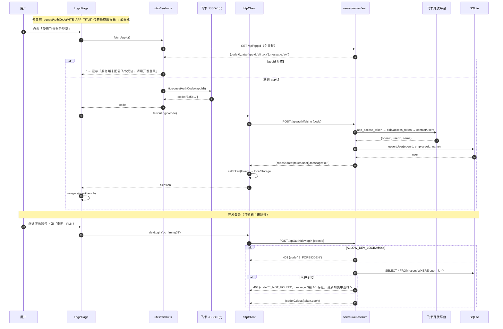
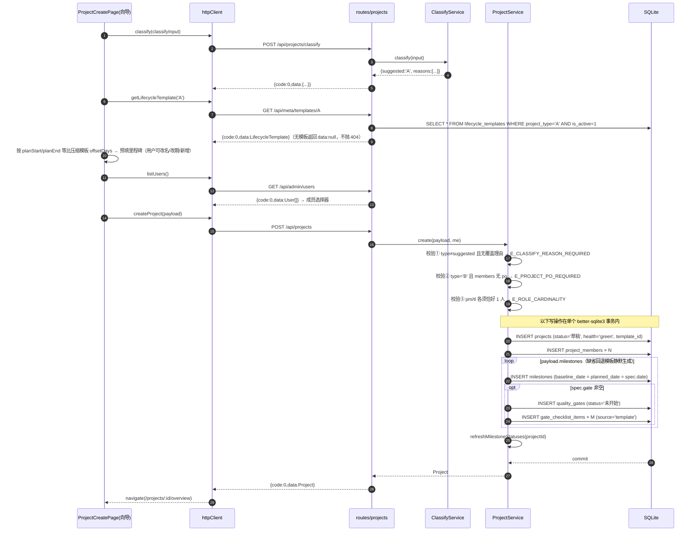
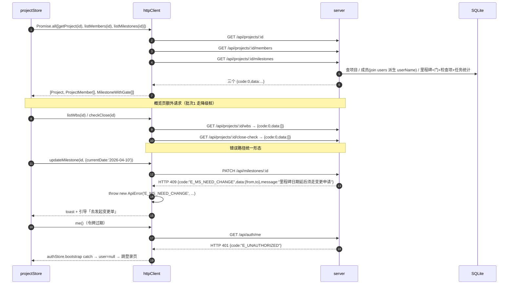
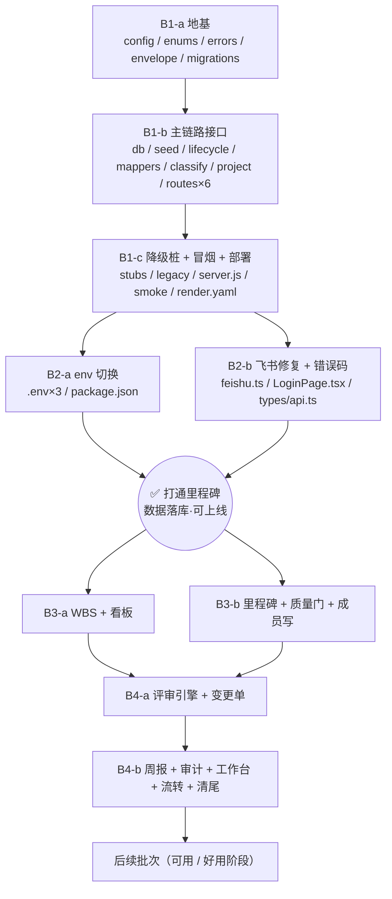

# 前后端打通 · 增量设计方案（Connect v1）

> 太空字节项目管理系统 · pm-app
> 阶段目标：**「打通」** —— 把前端从内存 Mock 切到真实后端，数据真正落库、可上线、刷新与重启不丢。
> 范围：产品经理清单「建议推进顺序」**第 1 步（打通）**。不做第 2 步（可用）/ 第 3 步（好用）。
> 版本：v1.0 · 架构师 高见远 · 基于对现有代码的逐文件核实

---

## 0. 一页纸结论

| 问题 | 结论 |
|---|---|
| 契约以谁为准？ | **以前端 `web/src/api/contract.ts` + `http.ts` 为唯一基准，后端向前端对齐**。`docs/api-contract.md`（v1.0，含"阶段"实体、PUT、plannedDate）已与现状分叉，**降级为历史参考，不作为实现依据** |
| 前端要改多少？ | **`http.ts` / `contract.ts` / 所有页面零改动**。只改 3 类东西：env 开关、飞书 appId bug、错误码字典补一行 |
| 后端要改多少？ | 大改。现有 `server.js`（26KB 单文件、裸 JSON、PUT、扁平路由、7 张表）按新契约重构为 `server/` 分层，实体从 7 张表扩到 16 张 |
| 业务规则从哪来？ | **前端 Mock 引擎（`web/src/api/mock/index.ts` + `rules.ts`，约 2100 行）= 产品规格与验收基准**。后端照其行为实现，切换后行为一致 |
| 什么时候算"打通了"？ | 批次 2 完成时：`VITE_USE_MOCK=false` 下跑通「开发登录 → 工作台 → 新建项目向导 → 项目列表 → 项目详情」，**关闭浏览器重开、重启服务、重新部署，数据都还在** |
| 最大风险 | ① Render `plan:free` 不支持挂 disk，不升级 = 数据仍然丢（待主理人确认）；② 后端一次性重构量大，靠"降级桩接口"把风险切成 4 批 |

---

## 1. 现状核实（逐文件读过，非推测）

### 1.1 前端：接后端的骨架已就绪

| 文件 | 事实 |
|---|---|
| `web/src/api/client.ts` | `USE_MOCK = String(env.VITE_USE_MOCK ?? 'true') === 'true'`；`api = USE_MOCK ? mockClient : httpClient`。**双轨开关健在** |
| `web/src/api/contract.ts` | `ApiClient` 接口，**48 个方法**，覆盖 15 类实体 |
| `web/src/api/http.ts` | 真实 HTTP 实现，48 个方法全部实现完毕；`BASE = VITE_API_BASE \|\| '/api'`；统一 `{code,data,message}` 解包；`code!==0` 抛 `ApiError`；带 `Authorization: Bearer` 与 `X-Request-Id` |
| `web/src/types/api.ts` | `ApiEnvelope` / `Paged` / **33 个错误码** + 中文映射 + `ApiError` |
| `web/src/api/mock/` | 内存引擎 84KB + 规则 25KB，承载全部业务规则（分类判定、模板实例化、门控、单向日期、WBS 层级、WIP、四段周报、评审三模式、CCB 路由…） |
| `web/vite.config.ts` | dev 已配 `/api → http://localhost:3000` 代理 → **联调不需要 CORS** |
| `web/.env.production` | `VITE_USE_MOCK=true` ← **生产包也在跑 mock，关标签页数据清空** |
| `web/.env.development` | `VITE_USE_MOCK=true` |
| `web/src/pages/LoginPage.tsx:77` | `requestAuthCode(import.meta.env.VITE_APP_TITLE ?? 'cli_demo_appid')` ← **传的是应用标题「太空字节项目管理」，不是 AppID。飞书免登必然失败** |

### 1.2 后端：真实但契约对不上

| 文件 | 事实 |
|---|---|
| `server.js`（26KB） | Express + 飞书登录 + HMAC 无状态令牌 + 基础 RBAC；**25 个接口**；全部返回**裸 JSON**；更新一律 `PUT`；路由扁平（`/api/milestones?projectId=`）；错误只有 `{error: '...'}` |
| `db.js` | better-sqlite3，**7 张表**：users / projects / milestones / tasks / reports / report_tasks / approvals；DDL 内联 + 两处手写 PRAGMA 探测迁移 |
| `config.js` | `SESSION_SECRET` 默认值 `'dev-only-change-me'` ← **可伪造任意角色令牌**；`ROLES` 只有 7 个（缺 `cm`/`po`）；`APPROVAL_TEMPLATES` key 是 `'A类（交付类）'` 中文 |
| `render.yaml` | `plan: free` + `DB_PATH=./pm.db`，disk 段被注释 ← **每次重部署清库** |
| `server.js:178` | `GET /api/appid` 已存在且返回真实 AppID，**前端从未调用过** |

### 1.3 契约差距矩阵（打通必须消除）

| 维度 | 前端（基准） | 后端（现状） | 处置 |
|---|---|---|---|
| 响应体 | `{code:0,data,message}` | 裸对象 / 裸数组 | 后端全量包信封 |
| 错误 | `code:"E_XXX"` + 结构化 `data` | `{error:"中文"}` + HTTP status | 后端引入错误码字典 |
| 更新方法 | `PATCH` | `PUT` | 后端统一 `PATCH`，`PUT` 废弃 |
| 认证路径 | `/api/auth/{devlogin,feishu,me,logout}` | `/api/{login,devlogin,me}`，无 logout | 后端迁移 + 旧路径薄别名（批次 4 删） |
| devlogin 入参 | `{openId}`（10 个演示账号） | `{name, role}`，`open_id='dev_'+name` | 后端改按 `openId`，并**种子化 10 个演示用户** |
| 列表 | `Paged<T>{items,total,page,pageSize}`（仅 projects/audit），其余裸数组 | 全量裸数组、无分页 | 见 §3.1 精确约定 |
| 字段命名 | camelCase | snake_case 直吐 DB 行 | 后端加映射层 |
| 布尔 / JSON | `true/false`、真数组对象 | `0/1`、JSON 字符串 | 映射层转换 |
| 项目类型 | `'A' \| 'B' \| 'C'` | `'A类（交付类）'` | 统一 `A/B/C`，中文只作 label |
| 全局角色 | 9 个（含 `cm`/`po`） | 7 个 | 后端补齐；并区分全局角色 / 项目角色两层 |
| 实体 | 15 类 | 7 张表 | 分批补齐（批次 1/3/4） |

---

## 2. 关键架构决策

| # | 决策 | 理由 |
|---|---|---|
| **D-1** | **契约基准 = 前端 `contract.ts` + `http.ts`；后端单向对齐** | 前端 48 个方法 × 60+ 处调用已稳定并通过 5 轮 QA；后端 25 个 handler 改动面小。反向改前端等于把已验证的 UI 全量回归一遍 |
| **D-2** | **Mock 引擎 = 后端行为的验收基准**（黄金参照） | 业务规则唯一完整实现处。后端每实现一条规则，用同一组输入与 Mock 比对输出 |
| **D-3** | **后端拆成 `server/` 分层，但只拆到"够用"**：`lib` / `dal` / `services` / `routes` 四层，不引 ORM、不引 DI、不做 Repository 全家桶 | `docs/架构设计-重构v1.md` 原方案 19 个 Repository + 20 个 Service 对"打通"是过度设计。四层足以隔离契约、SQL、业务规则 |
| **D-4** | **降级桩接口（stub）先行**：批次 1 一次性注册全部 48 个路由，未实现的返回空数据或 `E_NOT_IMPLEMENTED` | 让"切到真后端"这一步在批次 2 就能完成，首屏不会 404 白屏；后续批次逐个把桩换成真实现，风险按批次收敛 |
| **D-5** | **引入版本化迁移**（`schema_migrations` 表 + 有序迁移数组），废弃手写 PRAGMA 探测 | 本阶段要加 9 张表 + 改 3 张表，手写探测必然失控 |
| **D-6** | **保留 SQLite / better-sqlite3，不换 Postgres** | 数据量小、同步 API 简单、事务好写；持久化问题用 Render disk 解决即可。换库属于"好用"阶段议题 |
| **D-7** | **`SESSION_SECRET` 缺失或等于默认值 → 进程直接退出（exit 1）** | 无状态 HMAC 令牌，密钥泄露 = 任何人可签发 admin 令牌。这是上线阻断项 |
| **D-8** | **`/api/auth/devlogin` 由独立开关 `ALLOW_DEV_LOGIN` 控制**，不再只看 `FEISHU_APP_ID` 是否为空 | `render.yaml` 默认 `FEISHU_APP_ID=""` → 线上默认开放任意人登录且首个用户自动 admin。打通期需要 devlogin，但必须是**显式**开启，且上线前可一键关闭 |
| **D-9** | **旧路由不立即删除，标记 `@deprecated` 并在指定批次移除** | `devcheck.js` / `test_runner.js` / `verifydb.js` 依赖旧路径；一次性删会让本地校验脚本全红，掩盖真实回归 |
| **D-10** | **DB 列名避开 SQLite 关键字**：里程碑「当前计划日期」DB 用 `planned_date`，API 输出 `currentDate` | `current_date` 是 SQLite 关键字（`CURRENT_DATE`），裸用会踩坑。**API 字段名以前端 `Milestone.currentDate` 为准，不改前端** |

---

## 3. 契约对齐方案（工程师照此实现，不要再自行发挥）

### 3.1 响应信封（1.2）

```jsonc
// 成功 · 单对象
{ "code": 0, "data": { /* 业务对象 */ }, "message": "ok" }

// 成功 · 普通列表（大多数 list 接口）—— data 就是数组
{ "code": 0, "data": [ /* ... */ ], "message": "ok" }

// 成功 · 分页列表（仅 listProjects / listAudit 两处）
{ "code": 0, "data": { "items": [], "total": 0, "page": 1, "pageSize": 20 }, "message": "ok" }

// 成功 · 无返回体（删除等）
{ "code": 0, "data": null, "message": "ok" }

// 失败（HTTP 状态码同步设置，见 §3.6）
{ "code": "E_GATE_NOT_PASSED", "data": { "blockers": ["QG3 未出结论"] }, "message": "质量门未通过，里程碑不能标记达成" }
```

**硬规则**

1. `code` 成功恒为**数字 `0`**，失败恒为**字符串 `E_` 码**。前端判定是 `payload.code !== 0`，返回字符串 `"0"` 会被判为失败。
2. **只有 `listProjects` 与 `listAudit` 用 `Paged`**，其余 list 接口 `data` 直接是数组 —— 这一点与 `docs/api-contract.md` §0.1「禁止裸数组」**相反**，以 `http.ts` 的 TS 返回类型为准（`listMembers(): Promise<ProjectMember[]>`）。照旧文档做会导致前端拿到 `{items:[]}` 后 `.map` 崩溃。
3. `message` 用中文短句；前端优先用本地 `ERROR_MESSAGE_ZH[code]`，`message` 是兜底。
4. **错误响应也必须是信封**，且 HTTP 状态码同步设置（前端两者都看）。

**实现位置**：`server/lib/envelope.js`
```js
ok(data, message = 'ok')      // → { code: 0, data, message }
fail(code, message, data)     // → { code, data: data ?? null, message }
paged(items, total, page, pageSize)
class AppError extends Error { constructor(code, message, data) }
asyncHandler(fn)              // 包住 async 路由，异常转交错误中间件
errorMiddleware(err, req, res, next)  // AppError → 对应 HTTP + 信封；未知错误 → 500 E_INTERNAL
```

### 3.2 HTTP 方法（1.3）

| 语义 | 方法 | 说明 |
|---|---|---|
| 查询 | `GET` | |
| 创建 / 动作 | `POST` | 动作型（submit / approve / decide / move / transition）一律 POST |
| **局部更新** | **`PATCH`** | **全系统禁用 `PUT`**。传什么字段改什么字段，未传的保持原值 |
| 删除 | `DELETE` | |

### 3.3 路由命名（1.4）

**统一规则（一句话）**：
> **「按项目查 / 建 → 嵌套在 `/api/projects/:projectId/` 下；对已知 id 的单实体做改 / 删 / 动作 → 顶层扁平 `/api/<resource>/:id`」**

前缀恒为 `/api`（前端 `VITE_API_BASE=/api`）。

**⚠️ 路由注册顺序**：Express 按注册顺序匹配，以下必须**先**注册静态段，**后**注册 `:id`：
- `POST /api/projects/classify` 必须早于 `GET /api/projects/:id`
- `GET /api/reviews/my-approvals` 必须早于 `GET /api/reviews/:id`
- `POST /api/changes/route` 必须早于 `GET /api/changes/:id`

### 3.4 全量路由映射表（48 个方法 → 后端接口）

图例：**批次**列标注该接口在哪一批变成真实现；批次 1 全部先注册（真实现或降级桩）。

#### 认证与元数据

| 前端方法 | 方法 + 路径 | 返回 `data` | 批次 | 后端现状 |
|---|---|---|---|---|
| `devLogin(openId)` | `POST /api/auth/devlogin` `{openId}` | `Session` | 1 | ♻️ 改造（旧 `/api/devlogin` 收 `{name,role}`） |
| `feishuLogin(code)` | `POST /api/auth/feishu` `{code}` | `Session` | 1 | ♻️ 迁移自 `/api/login` |
| `me()` | `GET /api/auth/me` | `User` | 1 | ♻️ 迁移自 `/api/me`（注意：返回 **`User`**，不是 `{user}`） |
| `logout()` | `POST /api/auth/logout` | `null` | 1 | 🆕（无状态令牌，返回 ok 即可） |
| — | `GET /api/appid` | `{appId}` | 1 | ♻️ 已有，**改为信封格式**；免鉴权 |
| `getMeta()` | `GET /api/meta` | `MetaData` | 1 | 🆕 取代 `/api/approval-config` |
| `getLifecycleTemplate(type)` | `GET /api/meta/templates/:type` | `LifecycleTemplate \| null` | 1 | 🆕 **建项向导必需**，缺失返回 `null` 不抛 404 |

#### 项目

| 前端方法 | 方法 + 路径 | 返回 | 批次 |
|---|---|---|---|
| `classify(input)` | `POST /api/projects/classify` | `ClassifyResult` | 1 |
| `listProjects(query)` | `GET /api/projects?keyword&type&status&health&pm&onlyMine&page&pageSize` | `Paged<ProjectListItem>` | 1 |
| `getProject(id)` | `GET /api/projects/:id` | `Project` | 1 |
| `createProject(payload)` | `POST /api/projects` | `Project` | 1 |
| `updateProject(id,p)` | `PATCH /api/projects/:id` | `Project` | 1 |
| `transitionProject(id,to,c)` | `POST /api/projects/:id/transition` | `Project` | 4 |
| `checkClose(id)` | `GET /api/projects/:id/close-check` | `CloseBlocker[]` | 4（批次 1 桩：`[]`） |

#### 成员 / 里程碑 / 质量门

| 前端方法 | 方法 + 路径 | 返回 | 批次 |
|---|---|---|---|
| `listMembers(pid)` | `GET /api/projects/:pid/members` | `ProjectMember[]` | 1 |
| `addMember(pid,openId,role)` | `POST /api/projects/:pid/members` | `ProjectMember` | 3 |
| `removeMember(pid,mid)` | `DELETE /api/projects/:pid/members/:memberId` | `null` | 3 |
| `listMilestones(pid)` | `GET /api/projects/:pid/milestones` | `MilestoneWithGate[]` | 1（读）|
| `createMilestone(pid,p)` | `POST /api/projects/:pid/milestones` | `MilestoneWithGate` | 3 |
| `updateMilestone(id,p)` | `PATCH /api/milestones/:id` | `MilestoneWithGate` | 3 |
| `deleteMilestone(id)` | `DELETE /api/milestones/:id` | `null` | 3 |
| `toggleGateItem(itemId,ck)` | `PATCH /api/gate-items/:itemId` `{checked}` | `MilestoneWithGate[]` | 3 |
| `decideGate(pid,payload)` | `POST /api/projects/:pid/gates/:gateId/decide` | `MilestoneWithGate[]` | 3 |

#### WBS / 看板

| 前端方法 | 方法 + 路径 | 返回 | 批次 |
|---|---|---|---|
| `listWbs(pid)` | `GET /api/projects/:pid/wbs` | `WbsNode[]`（**扁平数组**，树由前端 `utils/wbs.ts` 组装） | 3（桩：`[]`） |
| `createWbsNode(pid,p)` | `POST /api/projects/:pid/wbs` | `WbsNode` | 3 |
| `updateWbsNode(id,p)` | `PATCH /api/wbs/:id` | `WbsNode` | 3 |
| `deleteWbsNode(id)` | `DELETE /api/wbs/:id` | `null` | 3 |
| `moveWbsNode(id,parent,idx)` | `POST /api/wbs/:id/move` `{newParentId,index}` | `WbsNode[]` | 3 |
| `getBoard(pid)` | `GET /api/projects/:pid/board` | `BoardView` | 3（桩：四空列 + 默认 WIP） |
| `moveTask(nodeId,status,order)` | `POST /api/wbs/:nodeId/move-status` `{status,order}` | `BoardView` | 3 |
| `updateBoardConfig(pid,wip)` | `PATCH /api/projects/:pid/board-config` `{wipLimits}` | `BoardConfig` | 3 |

#### 周报 / 评审 / 变更 / 审计 / 工作台 / 管理后台

| 前端方法 | 方法 + 路径 | 返回 | 批次 |
|---|---|---|---|
| `listReports(pid)` | `GET /api/projects/:pid/reports` | `Report[]` | 4（桩：`[]`） |
| `getReport(pid,week)` | `GET /api/projects/:pid/reports/:week` | `Report \| null` | 4 |
| `saveReport(p)` | `POST /api/projects/:pid/reports` `{...p, submit:false}` | `Report` | 4 |
| `submitReport(p)` | `POST /api/projects/:pid/reports` `{...p, submit:true}` | `Report` | 4 |
| `updateReport(id,p)` | `PATCH /api/projects/:pid/reports/:id` | `Report` | 4 |
| `listReviews(pid?)` | `GET /api/reviews?projectId=` | `Review[]` | 4（桩：`[]`） |
| `listMyApprovals()` | `GET /api/reviews/my-approvals` | `Review[]` | 4（桩：`[]`） |
| `getReview(id)` | `GET /api/reviews/:id` | `Review` | 4 |
| `createReview(p)` | `POST /api/reviews` | `Review` | 4 |
| `approveReview(id,p)` | `POST /api/reviews/:id/approve` | `Review` | 4 |
| `rejectReview(id,p)` | `POST /api/reviews/:id/reject` | `Review` | 4 |
| `withdrawReview(id,p)` | `POST /api/reviews/:id/withdraw` | `Review` | 4 |
| `routeChange(input)` | `POST /api/changes/route` | `RouteResult` | 4 |
| `listChanges(pid)` | `GET /api/projects/:pid/changes` | `Change[]` | 4（桩：`[]`） |
| `getChange(id)` | `GET /api/changes/:id` | `Change` | 4 |
| `createChange(p)` | `POST /api/projects/:pid/changes` | `Change` | 4 |
| `submitChange(id)` | `POST /api/changes/:id/submit` | `Change` | 4 |
| `applyChange(id)` | `POST /api/changes/:id/apply` | `Change` | 4 |
| `listAudit(query)` | `GET /api/audit?projectId&entityType&action&actor&from&to&page&pageSize` | `Paged<AuditLog>` | 4（桩：空 Paged） |
| `getWorkbench()` | `GET /api/workbench` | `WorkbenchData` | 1 降级 / 4 完整 |
| `listUsers()` | `GET /api/admin/users` | `User[]` | **1（必须真实，建项向导选成员用）** |
| `updateUserRole(openId,r)` | `PATCH /api/admin/users/:openId` `{globalRole}` | `User` | 4 |
| `listTemplates()` | `GET /api/admin/templates` | `LifecycleTemplate[]` | 1 |
| `resetDemoData()` | `POST /api/admin/reset-demo` | `null` | 桩：403 `E_FORBIDDEN`「真实后端不支持复位演示数据」 |
| `listRisks(pid)` | `GET /api/projects/:pid/risks` | `Risk[]` | 后续（桩：`[]`） |
| `listDocuments(pid)` | `GET /api/projects/:pid/documents` | `ProjectDocument[]` | 后续（桩：`[]`） |

#### 旧路由处置

| 旧路由 | 处置 | 移除批次 |
|---|---|---|
| `POST /api/login` | 薄别名 → `/api/auth/feishu` | 4 |
| `POST /api/devlogin` | **直接改造**（入参语义冲突，不做别名） | 1 |
| `GET /api/me` | 薄别名 → `/api/auth/me`（注意旧的返回 `{user}`，别名保持旧形态给旧脚本） | 4 |
| `GET /api/users`、`PUT /api/users/:id/role` | 迁 `/api/admin/users` | 4 |
| `GET /api/approval-config` | 由 `/api/meta` 取代 | 4 |
| `GET/POST /api/milestones`、`PUT/DELETE /api/milestones/:id` | 迁嵌套式（`PUT` → `PATCH`） | 3 |
| `GET/POST /api/tasks`、`PUT/DELETE /api/tasks/:id` | `tasks` 表 → `wbs_nodes`，路由迁 `/api/wbs` | 3 |
| `GET/POST /api/reports`、`PUT/DELETE /api/reports/:id` | 迁嵌套式 | 4 |
| `/api/projects/:id/{submit,approve,reject,approval}` | 迁 `reviews` 引擎 | 4 |
| `GET /api/dashboard` | 保留（无前端消费，不冲突） | — |
| `DELETE /api/projects/:id` | 保留（前端契约无此方法，不冲突） | — |

### 3.5 认证与会话（1.5）

**`Session` 形态**（`types/workbench.ts`）：
```jsonc
{ "token": "<payload>.<hmac>", "user": { /* 完整 User 对象 */ } }
```

**`User` 形态**（`types/project.ts`，**后端必须补齐全部字段**，缺字段会导致前端 `GLOBAL_ROLE_LABEL[user.globalRole]` 取到 undefined）：
```ts
{ id: number; openId: string; employeeId: string; name: string; email: string;
  dept: string; avatarUrl: string; globalRole: GlobalRole;
  status: 'active' | 'disabled'; createdAt: string; updatedAt: string }
```
> 注意字段名是 **`globalRole`** 不是 `role`；DB 列 `users.role` 需重命名为 `global_role`。

**令牌**：沿用现有 HMAC 无状态方案（payload base64url + HMAC-SHA256，7 天有效）。
「会话可撤销 / 令牌角色不刷新」（清单 4.3 / 4.4）**不在打通范围**，列后续批次。

**devlogin 语义变更**：
- 入参 `{openId}`，在 `users` 表按 `open_id` 查用户；查不到 → `404 E_NOT_FOUND`「用户不存在，请从列表中选择」（与 Mock 行为一致）
- 用户 `status === 'disabled'` → `403 E_FORBIDDEN`「该账号已停用」
- 因此**批次 1 必须把 `web/src/config/demoAccounts.ts` 的 10 个演示账号种子化到 `users` 表**（含各自 `globalRole`），否则登录页任何账号都点不进去
- 开关：`ALLOW_DEV_LOGIN`（默认 = `FEISHU_APP_ID` 为空时 `true`）；关闭时返回 `403 E_FORBIDDEN`

### 3.6 错误码字典与 HTTP 映射（1.8）

后端新建 `server/lib/errors.js`，**逐条镜像** `web/src/types/api.ts` 的 `ErrorCode`（33 个），并新增 2 个后端专用码。
前端 `types/api.ts` 需补 `E_NOT_IMPLEMENTED`（批次 2 的前端改动之一）。

| HTTP | 语义 | 错误码 |
|---|---|---|
| **400** | 参数 / 业务校验失败 | `E_VALIDATION` `E_CLASSIFY_REASON_REQUIRED` `E_PROJECT_PO_REQUIRED` `E_ROLE_CARDINALITY` `E_GATE_ITEM_INCOMPLETE` `E_WBS_LEAF_INCOMPLETE` `E_WBS_CYCLE` `E_WBS_PARENT_TYPE` `E_WBS_DEPTH` `E_WBS_TYPE_LOCKED` `E_WBS_DEADLINE_OVERFLOW` `E_WBS_ESTIMATE_OVERFLOW` `E_REPORT_RISK_INCOMPLETE` `E_PROXY_EVIDENCE_REQUIRED` `E_CHANGE_ROUTE` `E_MS_REQUIRED_LOCKED` |
| **401** | 未登录 / 过期 | `E_UNAUTHORIZED` |
| **403** | 已登录但被拒 | `E_FORBIDDEN` `E_GATE_NOT_PASSED` `E_NOT_APPROVER` `E_SELF_ROLE` `E_LAST_ADMIN` `E_PROJECT_ARCHIVED` |
| **404** | 资源不存在 | `E_NOT_FOUND` |
| **409** | 状态冲突（可换路径重试） | `E_MS_NEED_CHANGE` `E_WIP_EXCEEDED` `E_REPORT_DUPLICATE` `E_CLOSE_BLOCKED` `E_REVIEW_CLOSED` |
| **501** | 尚未实现（降级桩） | `E_NOT_IMPLEMENTED` 🆕 |
| **500** | 服务端异常 | `E_INTERNAL` 🆕 |

> `E_NETWORK` 是前端本地码（fetch 失败时抛），后端不返回。

**结构化 `data` 约定**（前端据此渲染，别只给 message）：
```jsonc
// 参数校验
{ "code":"E_VALIDATION", "data": { "fields":[{"field":"name","message":"项目名称不能为空"}] }, "message":"参数校验失败" }
// 权限拒绝
{ "code":"E_FORBIDDEN", "data": { "required":"project.create", "yourGlobalRole":"member" }, "message":"无操作权限" }
// 里程碑延后
{ "code":"E_MS_NEED_CHANGE", "data": { "milestoneId":"M...", "from":"2026-03-20", "to":"2026-04-10" }, "message":"里程碑日期延后须走变更申请" }
```

### 3.7 枚举常量表（1.6 / 1.7）

**单一真源**：后端 `server/config/enums.js`；前端已有 `web/src/config/enums.ts`。两边**值必须逐字相同**，中文 label 只放前端。

| 枚举 | 值（**存储值 = API 值**） | 后端现状 | 处置 |
|---|---|---|---|
| `ProjectType` | `A` \| `B` \| `C` | `'A类（交付类）'` 等中文 | **迁移**：`APPROVAL_TEMPLATES` key 改 `A/B/C`；DB 存量 `projects.type` 中文值做 UPDATE 映射 |
| `GlobalRole` | `admin` `management` `pmo` `pm` `tl` `qa` `cm` `po` `member` | 缺 `cm` `po` | 补齐 2 个 |
| `ProjectRole` | `pm` `tl` `po` `qa` `cm` `pmo` `member` | 无此概念 | 新增（`project_members.project_role`） |
| `ProjectStatus` | `草稿` `审批中` `已批准` `进行中` `挂起` `已结项` `已终止` `已驳回` | 部分（默认 `'进行中'`） | 对齐；`projects.status` 默认改 `'草稿'` |
| `Health` | `green` `yellow` `red` | 无 | 新增列，默认 `green` |
| `TaskStatus` | `待办` `进行中` `待评审` `完成` `阻塞` | `'待开始'` / `'完成'` | **迁移**：`待开始 → 待办` |
| `WbsNodeType` | `task` `subtask` | 无 | 新增 |
| `GateStatus` | `未开始` `待检查` `已通过` `有条件通过` `不通过` | 无 | 新增 |
| `MilestoneStatus` | `未开始` `进行中` `已达成` `已逾期` | `done` 0/1 | **派生值**，由服务端统一刷新，禁止业务代码直写 |
| `ReviewType` / `ReviewMode` / `ChangeType` / `ChangeRoute` … | 见 `web/src/types/{review,change}.ts` | 无 | 批次 4 |

**项目类型中文 label（仅展示，后端不存）**：`A → A 类（交付型）`、`B → B 类（产品型）`、`C → C 类（基建型）`。

**审批模板 key 改造**（`config.js`）：
```js
APPROVAL_TEMPLATES = { A: ['pmo','tl','management'], B: ['pm','tl'], C: ['pmo','tl','management'], _default: ['pm','tl'] }
```

### 3.8 字段命名与类型转换

| 项 | 约定 | 实现位置 |
|---|---|---|
| 命名 | DB `snake_case` ↔ API `camelCase`，前端永远见不到下划线 | `server/lib/mappers.js` 逐实体显式映射函数（**不要**写通用自动转换，字段有例外，见 D-10） |
| 布尔 | DB `INTEGER 0/1` → API `true/false` | 同上 |
| JSON | DB `TEXT` → API 真数组 / 真对象（`goal: string[]`、`classifyInput: {}`、`wipLimits: {}`） | 同上 |
| 金额 | `contractAmount` **number，单位万元** | DB `REAL`（旧 `amount TEXT` 迁移） |
| 纯日期 | `"2026-03-20"` | TEXT |
| 时间戳 | ISO 8601 `"2026-03-20T14:32:10.000Z"` | TEXT |
| 空值 | 用 `null` 不用 `""` / `0` | |
| 派生显示字段 | `owner` 必带 `ownerName`；`pm` 必带 `pmName`；人已移除时返回 `"(已移除)"` 而非 `null` | mappers 里 join users |
| **例外表** | DB `planned_date` → API `currentDate`；DB `global_role` → API `globalRole`；DB `board_order` → API `boardOrder` | mappers 显式列出 |

### 3.9 批次 1 降级桩清单（切到真后端后首屏不炸的保证）

集中放 `server/routes/stubs.routes.js`，每个桩带 `// TODO(批次N)` 注释，实现后从此文件删除。

| 接口 | 桩行为 |
|---|---|
| `GET /projects/:id/wbs` | `[]` |
| `GET /projects/:id/board` | `{projectId, columns:[待办,进行中,待评审,完成 各空], config:{wipLimits:{},columns:[...]}}` |
| `GET /projects/:id/reports` `/reviews` `/changes` `/risks` `/documents` `/close-check` | `[]` |
| `GET /reviews` `/reviews/my-approvals` | `[]` |
| `GET /audit` | `{items:[],total:0,page:1,pageSize:20}` |
| `POST /admin/reset-demo` | `403 E_FORBIDDEN`「真实后端不支持复位演示数据」 |
| 上述域的**所有写接口** | `501 E_NOT_IMPLEMENTED`「该功能尚未上线」 |
| `GET /workbench` | 降级：`stats` 真实（我的逾期任务先记 0）、`myProjects` 真实、`myTasks/myApprovals/reportReminders` 为 `[]` |

---

## 4. 目标文件结构（后端）

```
pm-app/
├── server.js                       ♻️ 瘦身为装配入口：加载配置 → 跑迁移 → 挂中间件/路由 → 错误兜底 → listen
├── config.js                       ♻️ 密钥硬校验、ALLOW_DEV_LOGIN、枚举与审批模板 key 改 A/B/C
├── db.js                           ♻️ 只负责连接（WAL / foreign_keys）+ 调用迁移，DDL 移出
├── render.yaml                     ♻️ plan + disk 持久化 + 新增环境变量
├── server/
│   ├── config/
│   │   ├── enums.js                🆕 全部枚举常量（与 web/src/config/enums.ts 逐字对齐）
│   │   └── lifecycle.js            🆕 A/B/C 三套生命周期模板定义（移植自 web/src/api/mock/fixtures/templates.ts）
│   ├── lib/
│   │   ├── envelope.js             🆕 ok / fail / paged / asyncHandler / errorMiddleware
│   │   ├── errors.js               🆕 AppError + ERROR_CODES + HTTP 状态映射
│   │   ├── mappers.js              🆕 row ↔ API 映射（含派生 xxxName）
│   │   ├── ids.js                  🆕 前缀 ID 生成（P/M/W/G/GI/R/RV/CR/AL）
│   │   ├── token.js                ♻️ signToken / verifyToken（从 server.js 迁入）
│   │   └── feishu.js               ♻️ getAppAccessToken / code2session / getUserName（迁入）
│   ├── middleware/
│   │   └── auth.js                 ♻️ Bearer → req.user（迁入）
│   ├── dal/
│   │   ├── migrations.js           🆕 有序迁移数组 + schema_migrations 版本表
│   │   └── seed.js                 🆕 10 个演示用户 + 3 套生命周期模板入库（幂等）
│   ├── services/
│   │   ├── classify.service.js     🆕 A/B/C 判定（移植 mock/rules.ts）
│   │   ├── project.service.js      🆕 建项事务：校验 → 落项目 → 成员 → 里程碑 → 门 → 检查项
│   │   ├── milestone.service.js    🆕 批次3：单向日期约束 / 状态派生 / 达成
│   │   ├── gate.service.js         🆕 批次3：勾选 / 结论 / 硬拦截
│   │   ├── wbs.service.js          🆕 批次3：树 CRUD / wbs_code 重排 / 层级校验 / 移动
│   │   ├── board.service.js        🆕 批次3：四列聚合 + WIP
│   │   ├── review.service.js       🆕 批次4：serial / parallel_veto / single 三模式
│   │   ├── change.service.js       🆕 批次4：CCB 路由判定 + 应用
│   │   ├── report.service.js       🆕 批次4：四段校验 + 快照冻结
│   │   ├── audit.service.js        🆕 批次4：写日志 + 查询
│   │   └── workbench.service.js    🆕 批次1 降级 / 批次4 完整
│   └── routes/
│       ├── index.js                🆕 汇总挂载（含注册顺序保证）
│       ├── auth.routes.js          🆕 /api/auth/* + /api/appid
│       ├── meta.routes.js          🆕 /api/meta、/api/meta/templates/:type
│       ├── projects.routes.js      🆕 项目 + 成员 + 里程碑读
│       ├── milestones.routes.js    🆕 批次3
│       ├── wbs.routes.js           🆕 批次3
│       ├── reviews.routes.js       🆕 批次4
│       ├── changes.routes.js       🆕 批次4
│       ├── reports.routes.js       🆕 批次4
│       ├── audit.routes.js         🆕 批次4
│       ├── admin.routes.js         🆕 /api/admin/*
│       ├── workbench.routes.js     🆕 /api/workbench
│       ├── stubs.routes.js         🆕 降级桩集中处（随批次逐步清空并最终删除）
│       └── legacy.routes.js        🆕 旧路径薄别名（@deprecated，批次4 整体删除）
└── scripts/
    └── smoke_connect.mjs           🆕 联调冒烟：一条命令跑完主链路并断言信封
```

> 前端目录**不新增文件**，只改 7 个已有文件（见批次 2）。

---

## 5. 数据模型增量

### 5.1 表清单与批次归属

| 表 | 状态 | 批次 | 关键点 |
|---|---|---|---|
| `schema_migrations` | 🆕 | 1 | `version INTEGER PK, applied_at TEXT` |
| `users` | ♻️ 改 | 1 | `role → global_role` 重命名；新增 `email` `dept` `avatar_url` `status`(默认 `active`) `updated_at` |
| `lifecycle_templates` | 🆕 | 1 | `id, project_type, version, name, definition TEXT(JSON), is_active, created_at` |
| `projects` | ♻️ 大改 | 1 | 新增 `plan_start` `plan_end` `health` `classify_input`(JSON) `classify_suggested` `classify_override_reason` `template_id` `actual_end` `contract_amount REAL` `deleted_at`；`type` 中文 → `A/B/C`；`goal` 由 `{text,progress,target}` → `string[]`；旧 `amount TEXT` 数据迁到 `contract_amount`；`status` 默认改 `'草稿'` |
| `project_members` | 🆕 | 1 | `id, project_id, user_open_id, project_role, assigned_by, assigned_at`；唯一索引 `(project_id,user_open_id,project_role)` |
| `milestones` | ♻️ 重建 | 1 | 新增 `code` `target` `required` `baseline_date` **`planned_date`** `done_at` `done_by` `status_override` `override_by` `override_at` `override_base_date` `last_change_id` `updated_at`；`done` 由存储字段改为**派生**（`done_at != null`） |
| `quality_gates` | 🆕 | 1 | `id, project_id, milestone_id, code, name, owner_role, status, conclusion, comment, decided_by, decided_at, created_at`；唯一索引 `(project_id, milestone_id)`（一碑最多一门 · C-G1） |
| `gate_checklist_items` | 🆕 | 1 | `id, gate_id, seq, content, owner_role, checked, checked_by, checked_at, source` |
| `wbs_nodes` | 🆕（取代 `tasks`） | 3 | `id, project_id, parent_id, wbs_code, level, node_type, name, description, owner, estimate_days, actual_days, start_date, due_date, status, progress, board_order, is_critical, milestone_id, created_by, created_at, updated_at`；旧 `tasks` 数据迁移为 `level=1, node_type='task', parent_id=null`，`status: 待开始→待办` |
| `board_configs` | 🆕 | 3 | `project_id PK, columns TEXT(JSON), wip_limits TEXT(JSON), updated_at` |
| `reviews` / `review_steps` | 🆕 | 4 | 支持 `ref_type`/`ref_id` 挂任意对象 + 三种模式 + 审批人快照 |
| `changes` | 🆕 | 4 | 含 `route`（pm / ccb）与 `payload` |
| `audit_logs` | 🆕 | 4 | `actor, entity_type, entity_id, action, diff(JSON), project_id, request_id, created_at` |
| `reports` | ♻️ 改 | 4 | 对齐 `Report` 契约（四段 + `tasks` 快照 + `risks`）；补 `(project_id, week)` 唯一约束 |
| `report_risks` | 🆕 | 4 | |
| `report_tasks` | ♻️ | 4 | 增 `progress_after` `selected` |
| `approvals` | ♻️ | 4 | 保留，`reviews` 上线后作为历史留痕或并入 `review_steps` |
| `risks` / `documents` | 🆕 | 后续 | 打通阶段桩返回 `[]` |

### 5.2 迁移策略

1. `server/dal/migrations.js` 导出 `[{version:1, up(db){...}}, {version:2, ...}]`，`db.js` 启动时按 `schema_migrations` 已应用的最大版本顺序执行，**单事务**。
2. 存量数据（本地 `pm.db`、线上 free 盘）**没有保留价值**，但迁移脚本仍写好值映射（type 中文→A/B/C、status 待开始→待办、amount→contract_amount），保证 dev 库能就地升。
3. 提供 `npm run db:reset`（删库重建 + 跑迁移 + seed），联调期常用。
4. `seed.js` **幂等**：按 `open_id` / 模板 `id` upsert，重启不重复插入。

---

## 6. 类图

```mermaid
classDiagram
    class Envelope {
        +ok(data, message) Response
        +fail(code, message, data) Response
        +paged(items, total, page, pageSize) Object
        +asyncHandler(fn) Function
        +errorMiddleware(err, req, res, next) void
    }
    class AppError {
        +String code
        +String message
        +Object data
        +Number httpStatus
    }
    class Mappers {
        +toApiUser(row) User
        +toApiProject(row) Project
        +toApiProjectListItem(row, agg) ProjectListItem
        +toApiMember(row) ProjectMember
        +toApiMilestoneWithGate(row, gate, items, stats) MilestoneWithGate
        +toApiWbsNode(row) WbsNode
    }
    class Migrator {
        +migrations Array
        +run(db) void
        +currentVersion(db) Number
    }
    class Seeder {
        +seedDemoUsers(db) void
        +seedLifecycleTemplates(db) void
    }
    class AuthService {
        +devLogin(openId) Session
        +feishuLogin(code) Session
        +upsertUser(openId, employeeId, name) User
        +signToken(user) String
        +verifyToken(token) Payload
    }
    class ClassifyService {
        +classify(input) ClassifyResult
    }
    class ProjectService {
        +list(query, me) Paged
        +get(id) Project
        +create(payload, me) Project
        +update(id, payload, me) Project
        -instantiateTemplate(project, specs) void
        -validateMembers(members, type) void
    }
    class MilestoneService {
        +listWithGate(projectId) MilestoneWithGate[]
        +create(projectId, payload, me) MilestoneWithGate
        +update(id, payload, me) MilestoneWithGate
        +refreshStatuses(projectId) void
    }
    class GateService {
        +toggleItem(itemId, checked, me) MilestoneWithGate[]
        +decide(projectId, payload, me) MilestoneWithGate[]
    }
    class WbsService {
        +list(projectId) WbsNode[]
        +create(projectId, payload, me) WbsNode
        +update(id, payload, me) WbsNode
        +move(id, newParentId, index) WbsNode[]
        -renumber(projectId) void
        -validateHierarchy(node, rules) void
    }
    class WorkbenchService {
        +build(me) WorkbenchData
    }
    class Routes {
        +auth
        +meta
        +projects
        +milestones
        +wbs
        +admin
        +workbench
        +stubs
        +legacy
    }

    Routes ..> Envelope : 统一出参
    Routes ..> AuthService
    Routes ..> ProjectService
    Routes ..> MilestoneService
    Routes ..> GateService
    Routes ..> WbsService
    Routes ..> WorkbenchService
    Routes ..> ClassifyService
    Envelope ..> AppError : 捕获并转换
    ProjectService ..> Mappers
    MilestoneService ..> Mappers
    WbsService ..> Mappers
    ProjectService --> MilestoneService : 建项时实例化
    MilestoneService --> GateService : 门状态联动
    Migrator <.. Seeder : 迁移后执行

    class User {
        +Number id
        +String openId
        +String name
        +GlobalRole globalRole
        +String status
    }
    class Project {
        +String id
        +String code
        +ProjectType type
        +ProjectStatus status
        +Health health
        +String[] goal
        +Number contractAmount
        +String templateId
    }
    class ProjectMember {
        +String id
        +String userOpenId
        +ProjectRole projectRole
    }
    class Milestone {
        +String id
        +String code
        +Boolean required
        +String baselineDate
        +String currentDate
        +MilestoneStatus status
        +String doneAt
    }
    class QualityGate {
        +String id
        +String milestoneId
        +GateStatus status
        +String conclusion
    }
    class GateChecklistItem {
        +String id
        +Number seq
        +Boolean checked
    }
    class WbsNode {
        +String id
        +String parentId
        +String wbsCode
        +Number level
        +WbsNodeType nodeType
        +TaskStatus status
        +String milestoneId
    }
    class LifecycleTemplate {
        +String id
        +ProjectType projectType
        +Object definition
        +Boolean isActive
    }

    Project "1" --> "*" ProjectMember
    Project "1" --> "*" Milestone
    Project "1" --> "*" WbsNode
    Project "1" --> "1" LifecycleTemplate : templateId
    Milestone "1" --> "0..1" QualityGate : 一碑最多一门
    QualityGate "1" --> "*" GateChecklistItem
    WbsNode "0..1" --> "0..1" Milestone : milestoneId
    WbsNode "1" --> "*" WbsNode : parentId
    User "1" --> "*" ProjectMember : userOpenId
```



---

## 7. 时序图

### 7.1 飞书免登（修复 6.1 后）+ 开发登录



### 7.2 新建项目（建项主链路，含模板实例化事务）



### 7.3 项目详情加载 + 错误路径



---

## 8. 共享知识 / 团队约定

> 工程师照抄这一节即可，不必回看上文。

### 8.1 "这个东西放哪"速查

| 东西 | 位置 |
|---|---|
| 响应信封封装函数 `ok/fail/paged` | `server/lib/envelope.js` |
| 错误码枚举 + `AppError` + HTTP 映射 | `server/lib/errors.js`（前端对应 `web/src/types/api.ts`，**两边同名同值**） |
| 状态 / 角色 / 类型枚举常量 | 后端 `server/config/enums.js`；前端 `web/src/config/enums.ts`（**值逐字相同，中文 label 只放前端**） |
| 生命周期模板定义（A/B/C） | 后端 `server/config/lifecycle.js` → 启动 seed 进 `lifecycle_templates` 表；前端 mock 版在 `web/src/api/mock/fixtures/templates.ts`（迁移源） |
| DB ↔ API 字段映射 | `server/lib/mappers.js` |
| HTTP client 封装 | 前端 `web/src/api/http.ts`（**不要改**）；新增接口先改 `contract.ts` 再两侧实现 |
| TS 类型定义 | `web/src/types/*.ts`（**唯一真源**，后端按此出参） |
| ID 生成 | `server/lib/ids.js`：`P`项目 `M`里程碑 `G`门 `GI`检查项 `W`WBS `R`周报 `RV`评审 `CR`变更 `AL`审计 |
| 业务规则参照实现 | `web/src/api/mock/index.ts` + `web/src/api/mock/rules.ts` |

### 8.2 加一个新接口的标准动作

1. 在 `web/src/api/contract.ts` 确认方法签名（**通常已存在，不要新增**）
2. 后端在对应 `server/routes/*.routes.js` 注册路由，业务逻辑落在 `server/services/*.service.js`
3. 路由层只做：取参 → 调 service → `res.json(ok(data))`；**不写 SQL、不写业务判断**
4. 校验失败 `throw new AppError('E_XXX', '中文', {结构化上下文})`，由 `errorMiddleware` 统一出参
5. 从 `stubs.routes.js` 删掉对应桩
6. 用 `web/src/api/mock/index.ts` 里同名方法比对行为，不一致以 Mock 为准

### 8.3 禁止事项

- ❌ 返回裸对象 / 裸数组（除非在 `data` 里面）
- ❌ 用 `PUT`
- ❌ 直接把 `db.prepare(...).get()` 的行对象丢给前端（snake_case + 0/1 + JSON 字符串）
- ❌ 在业务代码里写 `if (projectType === 'B')` —— 差异走模板 `definition.wbsRules` / `APPROVAL_TEMPLATES`
- ❌ 直接给 `milestone.status` / `milestone.done` 赋值 —— 派生值，只能由 `refreshMilestoneStatuses()` 写
- ❌ 改 `web/src/api/http.ts`、`contract.ts` 或任何页面组件来"迁就"后端
- ❌ SQLite 列名用 `current_date` / `order` / `references` 等关键字

### 8.4 联调启动方式

```bash
# 终端 1：后端（.env 需含 SESSION_SECRET，否则进程直接退出）
cd pm-app && node server.js            # http://localhost:3000

# 终端 2：前端（走 vite proxy /api → :3000，无 CORS 问题）
cd pm-app/web && npm run dev           # http://localhost:5173  VITE_USE_MOCK=false

# 无后端时的纯 mock 演示
cd pm-app/web && npm run dev:mock      # 使用 .env.mock，VITE_USE_MOCK=true

# 生产形态自测（Express 托管 web/dist）
cd pm-app/web && rm -rf dist && npm run build && cd .. && node server.js   # http://localhost:3000
```
> ⚠️ `vite.config.ts` 里 `emptyOutDir:false`，构建**不会**自动清空 `web/dist`，验证生产形态前必须手动删。

---

## 9. 任务分批

### 批次总览

| 批次 | 名称 | 文件数 | 依赖 | 关键产出 |
|---|---|---|---|---|
| **B1** | 后端契约地基 + 主链路接口 | 12（10 新 / 2 改）+ 2 运维 | — | 后端能按新契约响应主链路 |
| **B2** | 切真后端 + 飞书免登修复 + 持久化部署 | 7 前端 + 1 运维 | B1 | **✅ 打通里程碑：数据真正落库** |
| **B3** | 核心实体：成员写 / 里程碑 + 质量门 / WBS / 看板 | 10 | B1 | 项目内执行域可用 |
| **B4** | 协作与流程域：评审 / 变更 / 周报 / 审计 / 工作台 / 流转 | 12 | B1（B3 部分） | 全部降级桩清零 |

> 说明：批次 1/3/4 文件数超过「2–5 个」，因为后端是从"裸 JSON 单文件"起步、必须成套建立地基才能验证。已在每批内给出 **2–3 次可独立推送的提交切分**，每次提交仍是 3–5 个文件、可单独 review。

---

### 批次 B1 · 后端契约地基 + 主链路接口

**目标**：后端具备信封 / 错误码 / 迁移 / 枚举 / 映射五件套，并把「登录 → 工作台 → 建项 → 项目列表 → 项目详情」主链路接口按新契约实现完毕；其余接口以降级桩注册，不返回 404。

**覆盖清单条目**：1.2 / 1.3 / 1.4 / 1.5 / 1.6 / 1.7 / 1.8 / 2.1（成员表+读）/ 2.7（模板入库）/ 2.8（工作台降级）/ 9.1 / 10.1 / 4.6（devlogin 隔离，顺带）

#### 提交 B1-a · 地基（5 文件）

| 文件 | 类型 | 要点 |
|---|---|---|
| `config.js` | 修改 | ① `SESSION_SECRET` 缺失或 == `'dev-only-change-me'` → `console.error` 指引 + `process.exit(1)`；② 新增 `ALLOW_DEV_LOGIN`（默认 `!FEISHU_APP_ID`）；③ `ROLES` 补 `cm`/`po`；④ `APPROVAL_TEMPLATES` key 改 `A`/`B`/`C` |
| `server/config/enums.js` | 新增 | 全部枚举，逐字对齐 `web/src/config/enums.ts` |
| `server/lib/errors.js` | 新增 | 33 个前端码 + `E_NOT_IMPLEMENTED` + `E_INTERNAL`；`AppError`；`CODE_HTTP` 映射表（§3.6） |
| `server/lib/envelope.js` | 新增 | `ok/fail/paged/asyncHandler/errorMiddleware` |
| `server/dal/migrations.js` | 新增 | `schema_migrations` + 迁移 v1（users 改造 / projects 改造 / project_members / lifecycle_templates / milestones 重建 / quality_gates / gate_checklist_items）+ 存量值映射 |

**验收点**
- `SESSION_SECRET` 未设 → `node server.js` 退出码 1 且打印 `openssl rand -base64 32` 指引
- `node -e "require('./db')"` 跑完迁移，`sqlite3 pm.db ".tables"` 出现全部新表
- 重复启动不重复迁移（`schema_migrations` 只增不重）
- `npm run db:reset` 可重建

#### 提交 B1-b · 主链路接口（7 文件）

| 文件 | 类型 | 要点 |
|---|---|---|
| `db.js` | 修改 | 只保留连接 + WAL + foreign_keys + 调用 `migrations.run()` + `seed()`；DDL 全部移出 |
| `server/dal/seed.js` | 新增 | 幂等种子：`demoAccounts.ts` 的 10 个演示用户（含 globalRole/dept/employeeId）+ A/B/C 三套模板 |
| `server/config/lifecycle.js` | 新增 | 从 `web/src/api/mock/fixtures/templates.ts` 移植 A/B/C 模板 JSON（里程碑骨架 + 门 + 检查项 + wbsRules + docs） |
| `server/lib/mappers.js` | 新增 | `toApiUser/Project/ProjectListItem/Member/MilestoneWithGate`；派生 `pmName/ownerName`（人已移除 → `"(已移除)"`） |
| `server/services/classify.service.js` | 新增 | 移植 `mock/rules.ts` 的 `classifyProject` |
| `server/services/project.service.js` | 新增 | 建项事务（§7.2）+ 列表筛选分页 + 三条校验 |
| `server/routes/{index,auth,meta,projects,admin,workbench}.routes.js` | 新增 | 6 个路由文件（注册顺序见 §3.3） |

> 本提交实际文件数 11（含 6 个 routes）。如需再切细：`auth+meta+index` 一提交、`projects+admin+workbench` 一提交。

**验收点**（用 curl 或 B1-c 的冒烟脚本）
- `POST /api/auth/devlogin {"openId":"ou_liming03"}` → `{code:0,data:{token,user}}`，`user.globalRole === 'pm'`
- 不带 token 请求 `/api/auth/me` → HTTP 401 + `{code:"E_UNAUTHORIZED"}`
- `GET /api/meta/templates/A` → `data.definition.milestones.length > 0`
- `POST /api/projects/classify` 三类输入各返回正确 `suggested`（与 mock 一致）
- `POST /api/projects` 建 A 类项目 → 事务落 1 项目 + N 成员 + N 里程碑 + M 门 + K 检查项；缺 PM/TL → 400 `E_ROLE_CARDINALITY`；B 类无 PO → 400 `E_PROJECT_PO_REQUIRED`
- `GET /api/projects?page=1&pageSize=20` → `data.{items,total,page,pageSize}`
- `GET /api/projects/:id/milestones` → 每项含 `gate`(可为 null) / `gateItems` / `taskStats`
- 全部响应 **无 snake_case 字段、无 `0/1` 布尔、无 JSON 字符串**

#### 提交 B1-c · 降级桩 + 冒烟 + 部署（4 文件）

| 文件 | 类型 | 要点 |
|---|---|---|
| `server/routes/stubs.routes.js` | 新增 | §3.9 全部桩，每条带 `// TODO(批次N)` |
| `server/routes/legacy.routes.js` | 新增 | 旧路径薄别名 + `@deprecated` 注释 + 启动时打印一次弃用警告 |
| `server.js` | 修改 | 瘦身为装配入口：`express.json` → `routes/index` → `errorMiddleware` → 静态托管 `web/dist` → SPA fallback（`/api/*` 未命中返回信封化 404）→ listen |
| `scripts/smoke_connect.mjs` | 新增 | 一条命令跑主链路并断言信封 / 错误码 / 字段命名 |
| `render.yaml` | 修改 | `plan: starter`；`disk: {name: pm-data, mountPath: /data, sizeGB: 1}`；`DB_PATH=/data/pm.db`；新增 `ALLOW_DEV_LOGIN=true`（注明上线前置 false）；`SESSION_SECRET generateValue:true` 保留 |

**验收点**
- `node scripts/smoke_connect.mjs` 全绿
- 前端未实现域的 GET 全部返回 `{code:0,data:[]}`，写操作返回 501 `E_NOT_IMPLEMENTED`
- `GET /api/xxx-not-exist` 返回信封化 404 而非 HTML

#### **B1 完成定义（DoD）**
> 本地设 `SESSION_SECRET` 后 `node server.js` 正常启动；`node scripts/smoke_connect.mjs` 全绿：devlogin → me → meta → classify → createProject → listProjects → getProject → listMembers → listMilestones → workbench，**全部 `code:0`、无 500、无 snake_case 字段**；未授权返回 401、越权返回 403、校验失败返回对应 `E_` 码；重启服务后数据仍在。

---

### 批次 B2 · 切真后端 + 飞书免登修复 + 持久化上线

**目标**：**这一批完成 = "打通"达成**。前端切到真实后端，飞书免登拿到真 AppID，Render 数据不再丢。

**覆盖清单条目**：1.1 / 6.1 / 10.1（验证）

#### 提交 B2-a · env 与 mock 切换（4 文件）

| 文件 | 类型 | 要点 |
|---|---|---|
| `web/.env.production` | 修改 | `VITE_USE_MOCK=true` → **`false`** |
| `web/.env.development` | 修改 | `VITE_USE_MOCK=true` → **`false`**（联调默认真后端，vite proxy 已配） |
| `web/.env.mock` | 新增 | `VITE_USE_MOCK=true` + `VITE_API_BASE=/api` + `VITE_APP_TITLE=太空字节项目管理`（无后端演示专用） |
| `web/package.json` | 修改 | `"dev:mock": "vite --mode mock"`（当前是 `--mode development`，与 `dev` 完全等价，无意义） |

**验收点**：`npm run dev` 控制台无「S1 静态原型（Mock 模式）」提示条；`npm run dev:mock` 仍能纯前端跑通。

#### 提交 B2-b · 飞书 appId 修复 + 错误码补齐（3 文件）

| 文件 | 类型 | 要点 |
|---|---|---|
| `web/src/utils/feishu.ts` | 修改 | 新增 `fetchAppId(): Promise<string>`：`GET ${VITE_API_BASE}/appid` → 解析信封 `data.appId`；异常 / 空值返回 `''`；结果内存缓存一次 |
| `web/src/pages/LoginPage.tsx` | 修改 | 第 77 行 `requestAuthCode(import.meta.env.VITE_APP_TITLE ?? 'cli_demo_appid')` → `const appId = await fetchAppId(); if (!appId) throw new Error('服务端未配置飞书凭证，请使用开发登录'); const code = await requestAuthCode(appId);` |
| `web/src/types/api.ts` | 修改 | `ErrorCode` 增 `E_NOT_IMPLEMENTED` + `E_INTERNAL`；`ERROR_MESSAGE_ZH` 增「该功能尚未上线，敬请期待」「服务异常，请稍后重试」 |

**验收点**
- 非飞书环境：按钮 disabled + 文案正确，不再出现"用应用标题当 appId"的请求
- 服务端未配飞书凭证时点击 → 明确提示走开发登录，不是 `JSON.stringify(err)` 乱码
- 已实现域的 501 响应在页面上显示为中文「该功能尚未上线」

#### **B2 完成定义（DoD）**
> 1. `cd web && rm -rf dist && npm run build`（`tsc --noEmit` 零报错）→ `cd .. && node server.js`
> 2. 浏览器打开 `http://localhost:3000`，**开发登录选「李明 · PM」** → 工作台加载成功，无 500
> 3. 新建项目向导：分类判定 → 模板带出里程碑 → 选成员（PM/TL/PO 齐）→ 提交成功
> 4. 项目列表出现新项目；进项目详情，概览 / 里程碑 tab 正常渲染（里程碑与门来自数据库）
> 5. **F5 刷新数据在；关闭标签页重开数据在；`Ctrl+C` 重启 `node server.js` 数据仍在** ← 与 mock 的本质区别
> 6. 浏览器控制台无 404；除降级桩外无 5xx
> 7. Render 部署后重新 Deploy 一次，**已建项目仍在**（依赖 disk 生效，见 §11 待确认项）

---

### 批次 B3 · 核心实体：成员写 / 里程碑 + 质量门 / WBS / 看板

**目标**：把项目内"执行域"从降级桩换成真实现。业务规则**逐条对照 Mock 引擎**。

**覆盖清单条目**：2.1（写）/ 2.2 / 2.3 / 2.9

#### 提交 B3-a · WBS 树 + 看板（5 文件）

| 文件 | 类型 | 要点 |
|---|---|---|
| `server/dal/migrations.js` | 修改 | 迁移 v2：新建 `wbs_nodes` / `board_configs`；旧 `tasks` 数据迁入（`level=1, node_type='task', parent_id=null`，`待开始→待办`）；保留 `tasks` 表一版后删 |
| `server/lib/wbs.js` | 新增 | `wbs_code` 生成 / 子树重排 / 层级校验纯函数（移植 `web/src/utils/wbs.ts` 的服务端等价逻辑） |
| `server/services/wbs.service.js` | 新增 | CRUD + `move`；规则：`E_WBS_PARENT_TYPE` / `E_WBS_DEPTH`(maxDepth 来自模板 `wbsRules`) / `E_WBS_CYCLE` / `E_WBS_TYPE_LOCKED` / `E_WBS_LEAF_INCOMPLETE` / `E_WBS_DEADLINE_OVERFLOW` / `E_WBS_ESTIMATE_OVERFLOW` |
| `server/services/board.service.js` | 新增 | 四列聚合 + `E_WIP_EXCEEDED`(409) + `boardOrder` 重排 |
| `server/routes/wbs.routes.js` | 新增 | `/api/projects/:id/wbs`、`/api/wbs/:id`、`/api/wbs/:id/move`、`/api/wbs/:id/move-status`、`/api/projects/:id/board`、`/api/projects/:id/board-config` |

**验收点**：4 层建树 / 第 5 层被 `E_WBS_DEPTH` 拦；subtask 下挂节点被 `E_WBS_PARENT_TYPE` 拦；移动到自己子树被 `E_WBS_CYCLE` 拦；移动后 `wbsCode` 全树重排正确；WIP 满时拖入返回 409 且前端弹可操作提示；同一组用例在 mock 与真后端结果一致。

#### 提交 B3-b · 里程碑 / 质量门 / 成员写（5 文件）

| 文件 | 类型 | 要点 |
|---|---|---|
| `server/services/milestone.service.js` | 新增 | 单向日期（提前直接改 / 延后 409 `E_MS_NEED_CHANGE`）；改期清空 override 三元组（SK-7）；`refreshMilestoneStatuses` 唯一写入 `status`/`done`；`achieved=true` 且门未过 → `E_GATE_NOT_PASSED`（C-G4）；`taskStats` 口径 Y（加权 estimateDays） |
| `server/services/gate.service.js` | 新增 | 勾选检查项；出结论前有未勾项 → `E_GATE_ITEM_INCOMPLETE`；结论「已通过/有条件通过」→ 自动写里程碑 `doneAt` |
| `server/routes/milestones.routes.js` | 新增 | `POST /api/projects/:id/milestones`、`PATCH/DELETE /api/milestones/:id`、`PATCH /api/gate-items/:itemId`、`POST /api/projects/:id/gates/:gateId/decide` |
| `server/routes/projects.routes.js` | 修改 | 补成员写：`POST /api/projects/:id/members`（`E_ROLE_CARDINALITY`：PM/TL 各恰好 1）、`DELETE .../members/:memberId` |
| `server/routes/stubs.routes.js` | 修改 | 删除 wbs / board / milestones / gates / members 相关桩 |

**验收点**：里程碑延后 409、提前 200；门全勾后可出结论、未勾拦截；门通过后里程碑自动达成、`done` 派生正确；删除里程碑级联删门与检查项、关联 WBS 节点 `milestoneId` 置 null（SK-12）；成员基数校验生效。

#### **B3 完成定义（DoD）**
> 在真后端下，WBS 页可增删改移（含 4 层与所有拦截）、看板可拖拽且 WIP 超限被拦、里程碑页可改期 / 达成 / 覆盖状态、概览页质量门可勾选并出结论、成员可任命与移除；**同一组操作序列在 `VITE_USE_MOCK=true` 与 `false` 下页面表现一致**（差异逐条记录为待办，不允许静默）。

---

### 批次 B4 · 协作与流程域：评审 / 变更 / 周报 / 审计 / 工作台 / 状态流转

**目标**：清空所有降级桩，删除全部旧路由。

**覆盖清单条目**：2.4 / 2.5 / 2.6 / 2.8（完整）/ 2.10 / 3.1 / 3.2 / 3.3 / 3.4 / 周报契约对齐

#### 提交 B4-a · 评审引擎 + 变更单（5 文件）

| 文件 | 类型 | 要点 |
|---|---|---|
| `server/dal/migrations.js` | 修改 | 迁移 v3：`reviews` / `review_steps` / `changes` |
| `server/services/review.service.js` | 新增 | 三模式：`serial`（串行逐级）、`parallel_veto`（并行会签、任一否决即驳回）、`single`（单人决议）；`refType/refId` 挂 project / milestone / change / document；下单时**固化审批人快照**（3.5 顺带，成本低）；`withdraw` |
| `server/services/change.service.js` | 新增 | 路由判定：里程碑延期 / 需求基线 / `effortDays >= 3` → `ccb`，否则 `pm`；`submit` 拉起对应评审链；`apply` 落实变更（写 `milestones.last_change_id` 并解锁延期） |
| `server/routes/reviews.routes.js` | 新增 | 注意 `my-approvals` 注册在 `:id` 之前 |
| `server/routes/changes.routes.js` | 新增 | `POST /api/changes/route` 注册在 `GET /api/changes/:id` 之前 |

#### 提交 B4-b · 周报 + 审计 + 工作台 + 流转 + 清尾（7 文件）

| 文件 | 类型 | 要点 |
|---|---|---|
| `server/dal/migrations.js` | 修改 | 迁移 v4：`reports` 改造（四段 + `(project_id,week)` 唯一）、`report_risks`、`report_tasks` 增列、`audit_logs` |
| `server/services/report.service.js` | 新增 | 四段校验 + 风险条目完整性 `E_REPORT_RISK_INCOMPLETE` + 本周重复 409 `E_REPORT_DUPLICATE` + 提交时快照冻结 |
| `server/services/audit.service.js` | 新增 | 统一写日志（actor/entityType/entityId/action/diff/projectId/requestId）+ 分页查询 |
| `server/services/workbench.service.js` | 修改 | 真实聚合：`pendingApprovals` / `overdueTasks` / `missingReports` + `myProjects` / `myTasks` / `myApprovals` / `reportReminders` |
| `server/routes/{reports,audit}.routes.js` | 新增 | |
| `server/routes/projects.routes.js` | 修改 | `POST /:id/transition`（状态机校验）+ `GET /:id/close-check`（结项预检 `CloseBlocker[]`） |
| `server/routes/{stubs,legacy}.routes.js` | 删除 | 桩清零、旧路由整体下线；同步更新 `devcheck.js` / `test_runner.js` / `verifydb.js` 或标记归档 |

#### **B4 完成定义（DoD）**
> `stubs.routes.js` 与 `legacy.routes.js` 文件被删除且服务正常启动；全站 10 个项目 tab + 工作台 + 审批中心 + 管理后台在真后端下均无 501 / 无空白；评审三模式各跑通一例（含并行一票否决）；变更单命中 CCB 路由并在批准后真正改掉里程碑日期；审计页能查到上述所有操作；工作台数字分人正确（换账号数字变化）。

---

## 10. 任务依赖图



---

## 11. 待主理人确认

| # | 事项 | 影响 | 建议 |
|---|---|---|---|
| **C-1** | **Render 是否升级到 `starter`（约 $7/月）** | 免费计划**不支持挂 disk**。不升级 = 每次重部署清库 = "数据持久化"这一打通目标无法达成 | 升级。备选（不推荐）：改用 Render 免费 Postgres（90 天到期）→ 需替换 better-sqlite3，工作量翻倍 |
| **C-2** | `.env.development` 是否也改 `false` | 改 = 本地默认联调真后端（需先起后端）；不改 = 本地仍跑 mock，容易出现"本地好好的、线上全错" | 建议改 `false`，纯前端演示走新增的 `npm run dev:mock` |
| **C-3** | 存量 `pm.db` 数据是否需要保留 | 若需保留，迁移脚本要处理中文 type / `待开始` 状态 / `amount TEXT` 等历史值 | 建议丢弃重建（当前只有冒烟测试造的数据）；迁移脚本仍写好映射以防万一 |
| **C-4** | `docs/api-contract.md`（89KB，v1.0）如何处置 | 它与 `contract.ts` 已分叉（有"阶段"实体、PUT、`plannedDate`），继续放着会误导工程师 | 在文件头加醒目「⚠️ 已归档，实现请以 `web/src/api/contract.ts` 为准」，或移入 `docs/archive/`（本设计未改动它） |
| **C-5** | 打通上线后 `ALLOW_DEV_LOGIN` 何时置 `false` | 开着 = 任何人可选任意演示账号登录（含 admin）。属于公网暴露面 | 打通验收期开着；对外演示前置 `false` + 配飞书凭证 + 填 `ADMIN_OPEN_IDS` |
| **C-6** | 「首个登录用户自动成为 admin」是否保留 | 公网部署下是接管入口（清单 4.5） | 打通期保留（方便），配 `ADMIN_OPEN_IDS` 后自动失效；正式对外前改为白名单唯一入口 |

---

## 12. 后续批次建议（本阶段不细化）

对应产品经理清单的**第 2 步（可用）/ 第 3 步（好用）**，此处只登记不展开：

- **权限**：4.1 服务端项目级角色判权（24 个 action × 双层角色）、4.2 权限矩阵单一真源、4.3 会话可撤销、4.4 令牌角色刷新、4.7 用户停用
- **审批流增强**：3.5 审批人快照（B4 已顺带）、3.6 撤回（B4 已含）、3.7 加签 / 转签 / 代批、3.8 驳回到指定步骤、3.9 SLA 与催办
- **数据与查询**：2.11 风险登记册、2.12 文档清单、2.14 全量列表分页与筛选、2.15 周报按周唯一（B4 已含约束）、2.16 度量看板
- **飞书深度集成**：7.x 通讯录同步、消息卡片催办、审批中心互通
- **工程化**：1.9 契约单一真源（TS 类型 / OpenAPI 生成）、1.10 一键联调脚本（B1-c 已有雏形）、1.11 mock 与真后端双跑契约测试、8.x 单测与 CI
- **可观测性**：10.x 结构化日志、请求追踪、错误告警、健康检查细化

---

*文档结束 · 有任何与实际代码不符之处，以代码为准并回报架构师修订*
