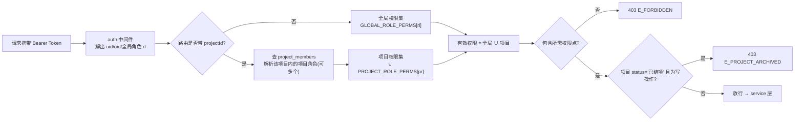

# 权限矩阵明细 · v1.0

> 配套文档：`docs/架构设计-重构v1.md`（3.4 业务规则 / 7.3 鉴权约定）
> 落地位置：`server/config/permissions.js`（单一真源）+ `server/middleware/rbac.js`（执行）+ `GET /api/meta` 下发给前端 `PermissionGate`
> PRD 需求：**P0-10 角色体系与权限控制**

---

## 一、权限模型总览



### 三条铁律

| # | 规则 | 说明 |
|---|---|---|
| **铁律 1** | **项目级角色不进 Token** | Token payload 只有全局角色 `rl`。项目角色每请求查 `project_members` 解析 → 任命/撤职**即时生效**，无需重新登录 |
| **铁律 2** | **前端 `PermissionGate` 只控显隐** | 永远不是安全边界。任何写操作服务端必须用 `requirePerm()` 再判一次 |
| **铁律 3** | **有效权限 = 全局角色权限 ∪ 项目角色权限（并集，不做交集/覆盖）** | 例：某人全局是 `member`，但在 P-0012 里是 `pm` → 他在 P-0012 内拥有 pm 全部权限，在其它项目仍是 member |

### 数据可见性（与操作权限正交）

| 范围 | 判定 | 适用角色 |
|---|---|---|
| `ALL` | 所有项目可读 | `admin` / `management` / `pmo` |
| `MEMBER` | 仅自己是 `project_members` 成员的项目可读 | 其余全局角色 |

> 实现：`rbac.service.scopeFilter(user)` 返回 SQL 片段，Repository 列表查询统一注入。**不要在路由里手写过滤。**

---

## 二、角色定义

### 2.1 全局角色（`users.global_role`，9 种）

| 角色 | 中文 | 定位 | 数据范围 |
|---|---|---|---|
| `admin` | 系统管理员 | 系统配置、用户与角色管理；拥有 `*` | ALL |
| `management` | 管理层 | 立项终审、全局看板、只读全量 | ALL |
| `pmo` | PMO | 制度守门人：模板、门规则、审计、跨项目稽核 | ALL |
| `pm` | 项目经理（全局身份） | 有资格被任命为项目 PM；可创建项目 | MEMBER |
| `tl` | 技术负责人 | 有资格被任命为项目 TL | MEMBER |
| `qa` | 质量/测试 | 有资格担任门控 owner | MEMBER |
| `cm` | 配置管理员 | 基线、版本、配置项（一期弱化） | MEMBER |
| `po` | 产品负责人 | B 类项目必需角色 | MEMBER |
| `member` | 普通成员 | 执行任务、写周报 | MEMBER |

### 2.2 项目角色（`project_members.project_role`，7 种）

| 角色 | 基数约束 | 核心职责 |
|---|---|---|
| `pm` | **有且仅有 1 人**（`E_ROLE_CARDINALITY`） | 计划、里程碑、WBS、变更、周报、客户代表代录 |
| `tl` | **有且仅有 1 人** | 技术评审决议、WBS 技术拆解、看板 WIP |
| `po` | 0..1（**B 类必填**，`E_PROJECT_PO_REQUIRED`） | 需求基线、CCB 一票 |
| `qa` | 0..n | 质量门检查项勾选与门控结论 |
| `cm` | 0..n | 配置项与基线（一期只读） |
| `pmo` | 0..n | 项目内稽核（通常由全局 pmo 覆盖，一般不单独任命） |
| `member` | 0..n | 任务执行、状态流转、周报填写 |

> `customer_rep`（客户代表）**不是**项目角色、**不建用户**（O13）。它只作为 `review_steps.role` 出现，由项目 `pm` 代录（`action='proxy_approve'`，`comment` 或 `evidence_url` 必填）。

---

## 三、权限点清单（37 个）

> 命名规范：`<domain>:<action>[:<sub>]`，全小写，冒号分隔。**新增权限点必须同时更新本表与 `permissions.js`。**

| 域 | 权限点 | 说明 | 关联 API |
|---|---|---|---|
| meta | `meta:read` | 读枚举/模板/权限矩阵 | `GET /api/meta` |
| user | `user:read` | 读用户列表 | `GET /api/users` |
| user | `user:role:assign` | 分配全局角色 | `PUT /api/users/:id/role` |
| project | `project:create` | 新建项目 | `POST /api/projects` |
| project | `project:read` | 读项目详情（受数据范围约束） | `GET /api/projects/:id` |
| project | `project:update` | 编辑项目基础信息 | `PUT /api/projects/:id` |
| project | `project:delete` | 删除（软删）项目 | `DELETE /api/projects/:id` |
| project | `project:transition` | 状态机流转（挂起/恢复/终止） | `POST /api/projects/:id/transition` |
| project | `project:close` | 结项 | `POST /api/projects/:id/close` |
| project | `project:member:assign` | 任命项目角色 | `PUT /api/projects/:id/members` |
| stage | `stage:read` | 读阶段与门状态 | `GET /api/projects/:id/stages` |
| stage | `stage:advance` | 推进到下一阶段 | `POST /api/projects/:id/advance` |
| gate | `gate:read` | 读门与检查项 | `GET /api/gates/:id` |
| gate | `gate:item:check` | 勾选/取消检查项 | `PUT /api/gates/:id/items/:itemId` |
| gate | `gate:item:add` | 追加项目专属检查项 | `POST /api/gates/:id/items` |
| gate | `gate:decide` | 出具门控结论 | `POST /api/gates/:id/decide` |
| milestone | `milestone:read` | 读里程碑 | `GET /api/milestones` |
| milestone | `milestone:create` | 新建里程碑（写 baseline） | `POST /api/milestones` |
| milestone | `milestone:update` | 编辑里程碑（非日期字段） | `PUT /api/milestones/:id` |
| milestone | `milestone:delete` | 删除里程碑 | `DELETE /api/milestones/:id` |
| wbs | `wbs:read` | 读 WBS 树 | `GET /api/wbs` |
| wbs | `wbs:edit` | 增改节点 / 移动 | `POST/PUT /api/wbs`、`/move` |
| wbs | `wbs:delete` | 删除节点（含级联确认） | `DELETE /api/wbs/:id` |
| board | `board:read` | 读看板 | `GET /api/board` |
| board | `task:status` | 拖拽改任务状态 | `POST /api/board/move` |
| board | `board:config` | 设置列与 WIP 上限 | `PUT /api/board/config` |
| report | `report:read` | 读周报 | `GET /api/reports` |
| report | `report:write` | 写/改自己的周报草稿 | `POST/PUT /api/reports` |
| report | `report:submit` | 提交周报 | `POST /api/reports/:id/submit` |
| review | `review:read` | 读评审 | `GET /api/reviews` |
| review | `review:start` | 发起评审 | `POST /api/reviews` |
| review | `review:decide` | 通过/否决（还需匹配步骤角色） | `POST /api/reviews/:id/decide` |
| review | `review:withdraw` | 撤回评审 | `POST /api/reviews/:id/withdraw` |
| review | `review:proxy` | 客户代表代录 | `POST /api/reviews/:id/decide` |
| change | `change:create` | 新建变更单 | `POST /api/changes` |
| change | `change:submit` | 提交变更审批 | `POST /api/changes/:id/submit` |
| audit | `audit:read` | 读单实体变更历史 | `GET /api/audit` |
| audit | `audit:read:all` | 全局审计查询 | `GET /api/audit/logs` |

---

## 四、全局角色 × 权限矩阵

> `✅` = 拥有；`—` = 无；`R` = 仅读；`*` = 通配（admin）
> 全局 `pm/tl/qa/cm/po/member` 的项目内操作权限**主要由项目角色赋予**，此表只给「不依赖项目身份」的能力。

| 权限点 | admin | management | pmo | pm | tl | qa | cm | po | member |
|---|:--:|:--:|:--:|:--:|:--:|:--:|:--:|:--:|:--:|
| `meta:read` | ✅ | ✅ | ✅ | ✅ | ✅ | ✅ | ✅ | ✅ | ✅ |
| `user:read` | ✅ | ✅ | ✅ | ✅ | ✅ | ✅ | ✅ | ✅ | ✅ |
| `user:role:assign` | ✅ | — | — | — | — | — | — | — | — |
| `project:create` | ✅ | ✅ | ✅ | ✅ | — | — | — | ✅ | — |
| `project:read` | ✅ | ✅ | ✅ | R | R | R | R | R | R |
| `project:update` | ✅ | — | ✅ | — | — | — | — | — | — |
| `project:delete` | ✅ | — | — | — | — | — | — | — | — |
| `project:transition` | ✅ | ✅ | ✅ | — | — | — | — | — | — |
| `project:close` | ✅ | ✅ | ✅ | — | — | — | — | — | — |
| `project:member:assign` | ✅ | — | ✅ | — | — | — | — | — | — |
| `stage:read` | ✅ | ✅ | ✅ | R | R | R | R | R | R |
| `stage:advance` | ✅ | — | ✅ | — | — | — | — | — | — |
| `gate:read` | ✅ | ✅ | ✅ | R | R | R | R | R | R |
| `gate:item:check` | ✅ | — | ✅ | — | — | — | — | — | — |
| `gate:item:add` | ✅ | — | ✅ | — | — | — | — | — | — |
| `gate:decide` | ✅ | — | ✅ | — | — | — | — | — | — |
| `milestone:*` | ✅ | — | ✅（读+审） | — | — | — | — | — | — |
| `wbs:read` / `board:read` / `report:read` / `review:read` | ✅ | ✅ | ✅ | R | R | R | R | R | R |
| `wbs:edit` / `wbs:delete` | ✅ | — | — | — | — | — | — | — | — |
| `task:status` | ✅ | — | — | — | — | — | — | — | — |
| `board:config` | ✅ | — | — | — | — | — | — | — | — |
| `report:write` / `report:submit` | ✅ | — | — | — | — | — | — | — | — |
| `review:start` | ✅ | — | ✅ | — | — | — | — | — | — |
| `review:decide` | ✅ | ✅ | ✅ | — | — | — | — | — | — |
| `review:proxy` | ✅ | — | — | — | — | — | — | — | — |
| `change:create` / `change:submit` | ✅ | — | — | — | — | — | — | — | — |
| `audit:read` | ✅ | ✅ | ✅ | ✅ | ✅ | ✅ | ✅ | ✅ | ✅ |
| `audit:read:all` | ✅ | ✅ | ✅ | — | — | — | — | — | — |

> **注**：`review:decide` 拿到并不等于能点通过 —— 服务层还要求 `review_steps` 中存在一条 `status='current'` 且 `role` 与调用者匹配（或 `assignee_open_id` 命中）的步骤，否则 `E_NOT_APPROVER`。`management` 的 `review:decide` 用于立项终审步骤。

---

## 五、项目角色 × 权限矩阵（**项目内生效**）

| 权限点 | 项目 pm | 项目 tl | 项目 po | 项目 qa | 项目 cm | 项目 pmo | 项目 member |
|---|:--:|:--:|:--:|:--:|:--:|:--:|:--:|
| `project:read` | ✅ | ✅ | ✅ | ✅ | ✅ | ✅ | ✅ |
| `project:update` | ✅ | — | — | — | — | ✅ | — |
| `project:transition` | ✅（挂起/恢复申请） | — | — | — | — | ✅ | — |
| `project:close` | ✅（发起结项评审） | — | — | — | — | ✅ | — |
| `project:member:assign` | ✅ | — | — | — | — | ✅ | — |
| `stage:read` | ✅ | ✅ | ✅ | ✅ | ✅ | ✅ | ✅ |
| `stage:advance` | ✅ | — | — | — | — | ✅ | — |
| `gate:read` | ✅ | ✅ | ✅ | ✅ | ✅ | ✅ | ✅ |
| `gate:item:check` | — | ✅ | — | ✅ | — | ✅ | — |
| `gate:item:add` | ✅ | ✅ | — | ✅ | — | ✅ | — |
| `gate:decide` | — | ✅ | — | ✅ | — | ✅ | — |
| `milestone:create` | ✅ | — | — | — | — | — | — |
| `milestone:update` | ✅ | — | — | — | — | — | — |
| `milestone:delete` | ✅ | — | — | — | — | — | — |
| `wbs:read` | ✅ | ✅ | ✅ | ✅ | ✅ | ✅ | ✅ |
| `wbs:edit` | ✅ | ✅ | — | — | — | — | — |
| `wbs:delete` | ✅ | ✅ | — | — | — | — | — |
| `board:read` | ✅ | ✅ | ✅ | ✅ | ✅ | ✅ | ✅ |
| `task:status` | ✅ | ✅ | — | — | — | — | ✅（仅 owner 是自己的节点） |
| `board:config` | ✅ | ✅ | — | — | — | — | — |
| `report:read` | ✅ | ✅ | ✅ | ✅ | ✅ | ✅ | ✅ |
| `report:write` | ✅ | ✅ | ✅ | ✅ | ✅ | — | ✅ |
| `report:submit` | ✅ | ✅ | ✅ | ✅ | ✅ | — | ✅（仅自己作者的） |
| `review:start` | ✅ | ✅ | ✅ | ✅ | — | ✅ | — |
| `review:decide` | ✅ | ✅ | ✅ | ✅ | ✅ | ✅ | — |
| `review:withdraw` | ✅（仅自己发起的） | ✅（仅自己发起的） | ✅（同左） | ✅（同左） | — | ✅ | — |
| `review:proxy` | ✅ | — | — | — | — | — | — |
| `change:create` | ✅ | ✅ | ✅ | — | — | — | — |
| `change:submit` | ✅ | — | — | — | — | — | — |
| `audit:read` | ✅ | ✅ | ✅ | ✅ | ✅ | ✅ | ✅ |

### 附加「所有权」判定（权限点之外的二次校验）

| 操作 | 附加条件 | 违反错误码 |
|---|---|---|
| `task:status`（项目 member） | `wbs_nodes.owner = 当前用户` | `E_FORBIDDEN` |
| `report:write` / `report:submit` | `reports.author = 当前用户`（pm/pmo 可读全部但不可代写） | `E_FORBIDDEN` |
| `review:withdraw` | `reviews.initiator = 当前用户` 或 admin | `E_FORBIDDEN` |
| `review:decide` | 存在 `status='current'` 且 role/assignee 命中的步骤 | `E_NOT_APPROVER` |
| `review:proxy` | 步骤 `role='customer_rep'` 且调用者是项目 pm，且 `comment` 或 `evidence_url` 非空 | `E_PROXY_EVIDENCE_REQUIRED` |
| `user:role:assign` | 目标 ≠ 自己；且不得降级最后一名 admin | `E_SELF_ROLE` / `E_LAST_ADMIN` |
| **任何写操作** | 项目 `status ∉ {已结项, 已终止}` | `E_PROJECT_ARCHIVED` |
| `milestone:update` 改 `planned_date` | 只能走变更单 | `E_MS_NO_ADVANCE` / `E_MS_NEED_CHANGE` |

---

## 六、`server/config/permissions.js` 结构示意（**非实现代码，仅结构**）

```js
// @prd P0-10  权限矩阵单一真源
module.exports = {
  // 1) 权限点常量（供路由 requirePerm 引用，杜绝字符串硬编码）
  P: { PROJECT_CREATE: 'project:create', STAGE_ADVANCE: 'stage:advance', /* ...37 个 */ },

  // 2) 数据可见范围
  DATA_SCOPE: { admin: 'ALL', management: 'ALL', pmo: 'ALL', /* 其余 */ default: 'MEMBER' },

  // 3) 全局角色 → 权限集（'*' 通配）
  GLOBAL_ROLE_PERMS: {
    admin:      ['*'],
    management: ['meta:read','user:read','project:create','project:read', /* ... */],
    pmo:        [/* ... */],
    pm:         ['meta:read','user:read','project:create','project:read','audit:read', /* 只读族 */],
    tl: [/*…*/], qa: [/*…*/], cm: [/*…*/], po: [/*…*/], member: [/*…*/],
  },

  // 4) 项目角色 → 权限集（仅在该项目内叠加）
  PROJECT_ROLE_PERMS: {
    pm: [/* 见第五章 pm 列 */], tl: [/*…*/], po: [/*…*/],
    qa: [/*…*/], cm: [/*…*/], pmo: [/*…*/], member: [/*…*/],
  },

  // 5) 所有权二次校验器（key = 权限点，值 = (ctx) => boolean）
  OWNERSHIP_GUARDS: {
    'task:status':   ctx => ctx.isProjectRole(['pm','tl']) || ctx.node.owner === ctx.user.openId,
    'report:submit': ctx => ctx.report.author === ctx.user.openId,
    'review:proxy':  ctx => ctx.isProjectRole(['pm']) && (ctx.body.comment || ctx.body.evidenceUrl),
    // ...
  },
};
```

`server/middleware/rbac.js` 只暴露两个中间件：

| 中间件 | 用法 | 行为 |
|---|---|---|
| `requirePerm('stage:advance')` | 路由上挂载 | 解析全局+项目权限 → 检查 → 结项只读拦截 → 跑 `OWNERSHIP_GUARDS` |
| `attachScope()` | 列表类路由 | 把 `req.scope = {type:'ALL'\|'MEMBER', openId}` 注入，Repository 据此加 WHERE |

---

## 七、前端消费方式

```
GET /api/meta  →  data.permissions = ['project:create','wbs:edit', ...]   // 当前用户的全局权限
GET /api/projects/:id  →  data.myProjectRoles = ['pm']
                          data.myPermissions  = [...全局 ∪ 项目, 已合并]
```

- 前端 `usePermission()` 从 store 读 `myPermissions`，`<PermissionGate perm="wbs:edit">` 控制按钮显隐。
- **禁止**在前端复刻权限计算逻辑；只消费服务端下发的字符串数组。
- 静态原型阶段（`VITE_USE_MOCK=true`）：`api/mock/handlers.ts` 提供角色切换器（右上角调试面板），可一键模拟 admin / pm / tl / qa / member 视角，方便走查显隐差异。

---

## 八、验收用例（T36 人工走查 + 后端 vitest 最小集）

| # | 场景 | 期望 |
|---|---|---|
| A1 | 全局 member、项目 pm，调 `POST /api/projects/:id/advance` | 通过（项目角色生效） |
| A2 | 同上用户，对**另一个**项目调 advance | 403 `E_FORBIDDEN`（项目角色不跨项目） |
| A3 | admin 刚把某人任命为 pm，该人**不重新登录**立即操作 | 通过（角色不进 token） |
| A4 | 项目 member 拖拽**别人**负责的任务 | 403（OWNERSHIP_GUARDS） |
| A5 | 项目已结项，pm 改里程碑 | 403 `E_PROJECT_ARCHIVED` |
| A6 | 非当前步骤审批人点通过 | 403 `E_NOT_APPROVER` |
| A7 | pm 代录客户代表但不填凭证与意见 | 400 `E_PROXY_EVIDENCE_REQUIRED` |
| A8 | 前端隐藏按钮，用 curl 直接打接口 | 403（前端非安全边界） |
| A9 | admin 降级自己 / 降级最后一名 admin | 403 `E_SELF_ROLE` / `E_LAST_ADMIN` |
| A10 | 全局 member 请求 `GET /api/projects` | 只返回自己参与的项目（DATA_SCOPE=MEMBER） |
