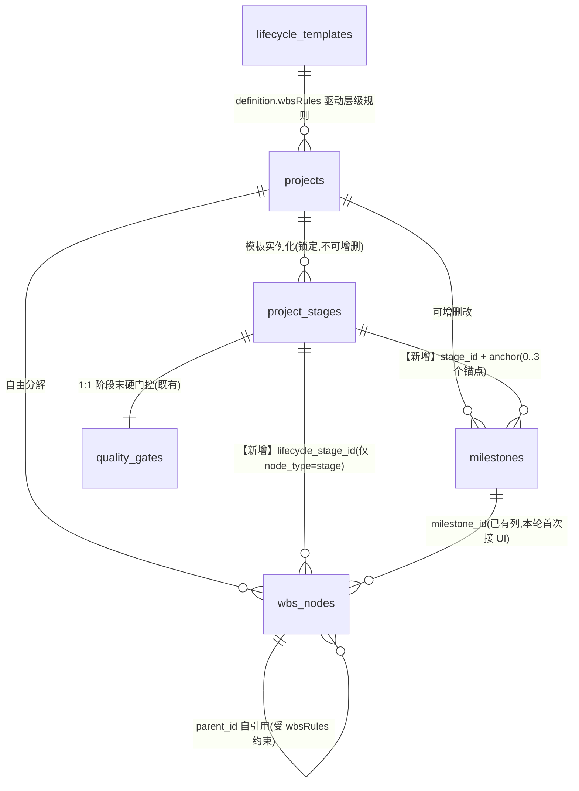
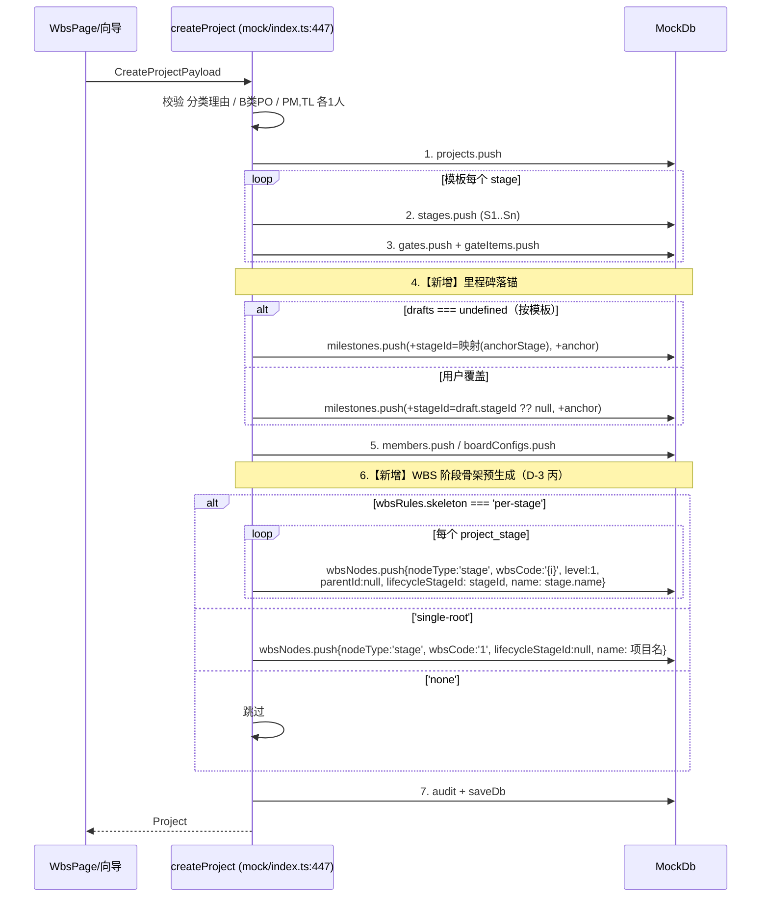
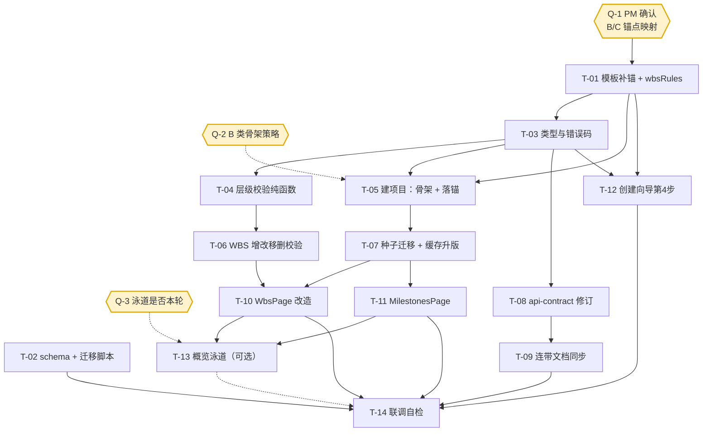

# WBS / 阶段 / 里程碑 关系重构 —— 增量架构设计与任务分解

| 项 | 内容 |
|---|---|
| 文档类型 | 增量架构设计 + 有序任务分解（不含实现代码） |
| 作者 | 高见远（架构师） |
| 版本 | v1.0 |
| 上游输入 | `docs/wbs_redesign_prd.md`（许清楚，v1.0） |
| 决策基线 | D-1=方案B / D-2=三类一致强制 / D-3=丙预生成骨架 / D-4=文案改「工作分区」 / D-5=`E_STAGE_SEQUENCE` 本轮不实现 |
| 落点 | **本轮 = `web/src/api/mock/`（当前实际引擎）+ `docs/`（契约文档）**；真实后端 S2 未启动，DAL 复用本设计 |
| 状态 | 见文末 `IS_PASS` |

---

## 0. 设计前置：对 PRD 的 3 项事实修正（必须先读）

我已逐条复核 PRD 引用的代码位，**PRD 的绝大部分结论成立**，但有 **3 处与真实代码不符**，且其中 1 处会直接导致迁移方案失效。设计已按修正后的事实展开。

### 修正 ①（阻断级）：`docs/lifecycle/*.json` **不是运行时模板**，两套模板已经分叉

PRD §8.1 断言「A/B/C 三套模板的 code 与现存里程碑 code 完全对齐，**回填覆盖率 100%**」。该结论**仅对 `docs/lifecycle/*.json` 成立，对运行时数据不成立**。

运行时模板的唯一来源是 `web/src/api/mock/fixtures/templates.ts`（`createSeedDb()` → `db.templates`），它与 `docs/lifecycle/*.json` 是**两套内容不同的模板**：

| 类 | `docs/lifecycle/*.json`（架构师草拟版，带 `anchorStage`） | `fixtures/templates.ts`（**运行时真实生效**） | 是否对齐 |
|---|---|---|---|
| A | 6 阶段 / 7 里程碑；S4「开发与首件调试」 | 6 阶段 / 7 里程碑；S4「开发实施」 | **code 对齐、语义对齐**，阶段名有差异 |
| B | **4 阶段** / **6 里程碑**（M1迭代启动…M6迭代复盘结项） | **5 阶段**（S1 Sprint计划/S2 开发/S3 评审/S4 演示/S5 回顾）/ **3 里程碑**（M1 Sprint启动 / M2 特性冻结 / M3 版本发布） | ❌ **完全不对齐** |
| C | 5 阶段 / **6 里程碑** | 5 阶段 / **5 里程碑**（M1项目启动/M2方案定稿/M3设备到货/M4施工完成/M5验收移交） | ❌ **数量与语义均不对齐** |

> **后果**：若按 PRD §8.1「用 `milestone.code` 匹配模板 `anchorStage`」直接回填，**B 类与 C 类会被静默写入错误的 `stage_id`**（例如运行时 B 类 `M3=版本发布` 会被 JSON 的 `M3=提测 → anchorStage:S3` 绑到「评审」阶段）。这是一次**无报错的数据污染**，比不回填更危险。

**设计应对**：本轮**不做模板归一**（那是独立的模板治理项，会改变现有 5 个种子项目的阶段数/门数/里程碑数，风险外溢）。改为 **在运行时模板 `fixtures/templates.ts` 上就地补锚**（见 §2.4 映射表），A 类照抄 JSON，**B/C 类映射需 PM/PMO 确认**（已列入 §7 待明确事项 Q-1）。

### 修正 ②：`LifecycleTemplate` 的 TS 类型根本没有 `anchorStage` / `granularity` / `wbsRules` 的位置

`web/src/types/project.ts:118-122` 的类型定义是：

```ts
definition: {
  stages: Array<{ code; name; gate: {...} }>;
  milestones: Array<{ code: string; name: string; offsetDays: number }>;  // ← 只有 3 个字段
  docs: string[];
}
```

- 没有 `anchorStage` / `anchor` → 补锚必须**先扩类型**，否则 TS 编译不过。
- **没有 `granularity`**：PRD §4.2 称「`wbsRules` 与现有 `granularity` 字段同构」——`granularity` 只存在于 `docs/lifecycle/*.json`，**运行时是硬编码常量** `config/enums.ts:146 GRANULARITY_LIMIT = { A:5, B:2, C:5 }`。
  > 即：`wbsRules` 将是**运行时第一个真正由模板驱动的规则字段**，不存在可照搬的先例。设计上仍按「模板驱动 + 常量兜底」实现（§2.5），并把 `granularity` 一并模板化列为**下轮**可选项。

### 修正 ③：里程碑方向规则的 **mock 代码零改动**，要改的是枚举 + 文档

PRD §6 把 C-1~C-4 并列为「4 处修改」，容易被读成「mock 也要改」。实测：

| 位置 | 现状 | 是否需改 |
|---|---|---|
| `api/mock/rules.ts:158 milestoneDelayNeedsChange` | `diffDays(currentDate, toDate) > 0` —— 仅延后返回 true | ✅ **已是目标行为，不改** |
| `api/mock/index.ts:812-830` | 提前直接改 + 审计「日期提前」；延后抛 `E_MS_NEED_CHANGE` | ✅ **已是目标行为，不改** |
| `pages/projects/MilestonesPage.tsx:231` | 已渲染 `提前 ${-m.delayDays} 天` | ✅ **已支持负值，不改** |
| `types/api.ts:33,65` `E_MS_NO_ADVANCE` | 死码 | ❌ 删 |
| `docs/api-contract.md` `:95 :317 :1155 :1256 :1280 :2065` | 与实现相反 | ❌ 改 |
| `docs/schema.sql:188` `CHECK (planned_date >= baseline_date)` | 物理拒绝提前 | ❌ 删 |
| `docs/schema.sql:179` `delay_days` 注释「永远 >= 0」 | 失真 | ❌ 改 |

> **结论**：方向规则本轮是一次**「文档向实现对齐」**的修订，不是行为变更。风险极低，可与主线并行。
> 注：PRD 引用的 `schema.sql:189/:180` 实际行号为 **:188 / :179**（差 1 行）。

### 其余复核结论（与 PRD 一致，确认属实）

| PRD 断言 | 复核结果 |
|---|---|
| `anchorStage` 在 `web/src` 零命中 | ✅ 属实 |
| `E_WBS_PARENT_TYPE` 在 `web/src` 零命中（连枚举都没有） | ✅ 属实，仅 `docs/api-contract.md:1375,1434,2072` 有 |
| `E_STAGE_SEQUENCE` 有文案无逻辑 | ✅ 属实（`types/api.ts:32,64`，mock 零命中） |
| `milestoneId` 恒 `null` | ✅ 属实（仅 3 处命中，全为 `null`） |
| `createProject` 事务**不建任何 WBS 节点** | ✅ 属实（`mock/index.ts:447-620` 无 `wbsNodes.push`），契约 `:616` 承诺落空 |
| `createWbsNode` 零层级校验 | ✅ 属实（`mock/index.ts:879-924` 仅有 `E_WBS_LEAF_INCOMPLETE`） |
| `moveWbsNode` 仅防环不校验类型 | ✅ 属实（`mock/index.ts:997-1030` 仅 `E_WBS_CYCLE`） |

### 补充发现：存量种子数据仅 1 处违规（对迁移是好消息）

按 D-2 新规则扫描 `fixtures/wbs.ts` 全部 5 个种子项目 43 个节点：

| 项目 | 节点数 | 最大深度 | 违规 |
|---|---|---|---|
| P0012 | 20 | 4 | **1 处**：`1.3.1「数据接入模块」package` 挂在 `1.3 package` 下 → 违反「package→task」 |
| P0015 | 8 | 3 | 0 |
| P0018 | 11 | 3 | 0 |
| P0021 | 1 | 1 | 0 |
| P0009 | 3 | 2 | 0 |

> 5 个根节点**全部是 `stage` 类型**（天然符合「根下只能 stage/package」），最大深度 4 → **`maxDepth=4` 对存量安全**。仅需修正 P0012 的 1 个节点。

---

## 1. 变更范围界定

### 1.1 一句话范围

> 把「生命周期阶段（区间）→ 里程碑（点）→ WBS（活）」三座孤岛，通过 **2 个新外键 + 1 组模板驱动规则 + 1 个建项目预生成步骤** 连成一棵树；同时让契约文档回归与实现一致。

### 1.2 受影响清单（按落点分类）

| # | 文件 | 落点 | 变更类型 | 说明 |
|---|---|---|---|---|
| F-01 | `docs/schema.sql` | `docs/` | 改 | `milestones` +2 列、`wbs_nodes` +1 列、删 CHECK、改 `delay_days` 注释、`lifecycle_templates.definition` 注释补 `wbsRules` |
| F-02 | `docs/schema.sql`（新增迁移节） | `docs/` | 增 | SQLite 重建表迁移脚本片段（§5.3） |
| F-03 | `docs/api-contract.md` | `docs/` | 改 | §4.3`:616` 事务描述、§5 标注 `E_STAGE_SEQUENCE` 未实现、§7 方向规则全量改写、§8 WBS 校验、错误码表 |
| F-04 | `docs/permissions-matrix.md` | `docs/` | 改 | `:211` 删 `E_MS_NO_ADVANCE` |
| F-05 | `docs/架构设计-重构v1.md` | `docs/` | 改 | D5 决策项 `:32 :789 :939 :940 :1114 :1338` |
| F-06 | `docs/lifecycle/{A,B,C}*.json` | `docs/` | 改 | `definition` 补 `wbsRules`（保持与运行时同构，不改其阶段/里程碑内容） |
| F-07 | `web/src/types/api.ts` | mock | 改 | 删 `E_MS_NO_ADVANCE`×2；增 4 个错误码×2 |
| F-08 | `web/src/types/project.ts` | mock | 改 | `LifecycleTemplate.definition` 扩型；`Milestone` +`stageId`/`anchor`；`MilestoneDraft` +`stageId`/`anchor` |
| F-09 | `web/src/types/wbs.ts` | mock | 改 | `WbsNode` +`lifecycleStageId` |
| F-10 | `web/src/config/enums.ts` | mock | 改 | `WBS_NODE_TYPE_LABEL.stage: '阶段'→'工作分区'`；新增 `DEFAULT_WBS_RULES`、`MILESTONE_ANCHOR_LABEL` |
| F-11 | `web/src/api/contract.ts` | mock | 改 | `WbsNodePayload` +`lifecycleStageId`/`milestoneId`；`MilestoneUpdatePayload` +`stageId`/`anchor` |
| F-12 | `web/src/api/mock/rules.ts` | mock | 增 | `resolveWbsRules()`、`validateWbsPlacement()`（页面与引擎共用） |
| F-13 | `web/src/api/mock/fixtures/templates.ts` | mock | 改 | 三类模板补 `anchorStage`/`anchor`/`wbsRules` |
| F-14 | `web/src/api/mock/fixtures/projects.ts` | mock | 改 | `:316` 里程碑构造补 `stageId`/`anchor`（自动继承模板锚点） |
| F-15 | `web/src/api/mock/fixtures/wbs.ts` | mock | 改 | 节点补 `lifecycleStageId`；修正 P0012 `1.3.1` 违规 |
| F-16 | `web/src/api/mock/db.ts` | mock | 改 | `STORAGE_KEY: 'pm_mock_db_v2' → 'pm_mock_db_v3'`（= mock 的「迁移」动作） |
| F-17 | `web/src/api/mock/index.ts` | mock | 改 | `createProject` 预生成骨架 + 里程碑锚点落库；`createWbsNode`/`moveWbsNode`/`updateWbsNode`/`deleteWbsNode` 接入校验 |
| F-18 | `web/src/pages/projects/WbsPage.tsx` | mock | 改 | 骨架化空态、两个新选择器、前端预校验、文案改名 |
| F-19 | `web/src/pages/projects/MilestonesPage.tsx` | mock | 改 | 新增「所属阶段」列 |
| F-20 | `web/src/pages/projects/ProjectCreatePage.tsx` | mock | 改 | 第 4 步每条里程碑加 `stageId`/`anchor` 选择 |
| F-21 | `web/src/pages/projects/ProjectOverviewPage.tsx` | mock | 改 | **可选**：阶段泳道 |
| F-22 | `web/src/stores/wbsStore.ts` | mock | 改 | 透传新字段（若 payload 类型变动波及） |

### 1.3 明确不在本轮范围

| 项 | 原因 |
|---|---|
| `E_STAGE_SEQUENCE` 阶段顺序锁实装 | D-5 已定：本轮仅在契约标注「未实现」 |
| 删除 `project_stages` / 改 `quality_gates` | D-1 选 B，不删表 |
| 运行时模板与 `docs/lifecycle/*.json` 归一 | 独立模板治理项，会改变种子项目阶段/门/里程碑数量（见 §0 修正①、§7 Q-1） |
| `granularity` 模板化 | 现为硬编码常量，与本轮目标无耦合，列入下轮 |
| 真实后端 DAL / Repository | S2 未启动，本设计即其输入 |
| WBS 拖拽移动 UI | `moveWbsNode` 引擎已存在但 `WbsPage` 无拖拽入口；本轮只补引擎侧校验，不新增 UI |

---

## 2. 数据模型变更

### 2.1 目标关系图



**语义锚定（可直接用于 UI 引导文案）**：
> **阶段**是项目走到哪一步（有始有终、走完要过质量门）；**里程碑**是必须在某天交出的成果（对客承诺、延期走变更）；**工作分区/工作包/任务**是为了达成它们要干的活。一个阶段可以有 0~3 个里程碑。

### 2.2 `milestones` 加列

```sql
-- docs/schema.sql · 表 8 milestones
ALTER TABLE milestones ADD COLUMN stage_id TEXT
  REFERENCES project_stages(id);                    -- NULL = 未归属阶段（用户手建里程碑）
ALTER TABLE milestones ADD COLUMN anchor   TEXT
  CHECK (anchor IN ('start','mid','end'));          -- NULL 允许；与 stage_id 同生同灭
```

| 列 | 类型 | 可空 | 语义 | 来源 |
|---|---|---|---|---|
| `stage_id` | TEXT FK→`project_stages(id)` | ✅ NULL | 里程碑锚定的生命周期阶段 | 模板 `anchorStage` 实例化；用户可改 |
| `anchor` | TEXT CHECK(start/mid/end) | ✅ NULL | 锚在阶段的**起 / 中 / 末** | 模板 `anchor` |

- **不加 NOT NULL**：宽松期（§5.4 T1）内允许 NULL，UI 黄色提示补选。
- **不建 UNIQUE**：N:1 是客观事实（A 类 S6 挂 M6+M7）。
- 建议加索引：`CREATE INDEX idx_ms_stage ON milestones(stage_id);`
- ⚠️ **命名映射**：DB 列 `planned_date` ↔ TS 字段 `Milestone.currentDate`。本轮不统一命名（改名会波及全量前端），但契约文档需显式标注该映射，避免 S2 落库时踩坑。

### 2.3 `wbs_nodes` 加列

```sql
-- docs/schema.sql · 表 9 wbs_nodes
ALTER TABLE wbs_nodes ADD COLUMN lifecycle_stage_id TEXT
  REFERENCES project_stages(id);                    -- 仅 node_type='stage' 时有值，其余恒 NULL
```

| 列 | 约束 | 说明 |
|---|---|---|
| `lifecycle_stage_id` | FK→`project_stages(id)`，NULL 允许 | **仅 `node_type='stage'` 可有值**。SQLite 无法用表级 CHECK 优雅表达「依赖另一列取值」的条件非空，故**该约束由服务层（本轮 = mock 引擎 `validateWbsPlacement`）强制**，DB 层只做外键完整性 |
| `milestone_id` | 既有列，**结构零变更** | 存量恒 `null`；本轮首次在 UI 接通（PRD I-1） |

> 建议索引：`CREATE INDEX idx_wbs_lc_stage ON wbs_nodes(lifecycle_stage_id);`

### 2.4 运行时模板补锚映射表（关键交付物）

针对 **`fixtures/templates.ts`（运行时真实模板）** 逐条补 `anchorStage` + `anchor`。A 类与 `docs/lifecycle/A-delivery.json` 完全一致，可直接采纳；**B/C 类为本设计新拟，需 PM/PMO 确认（Q-1）**。

**A 类（6 阶段 / 7 里程碑）—— 直接采纳，无争议**

| 里程碑 | 名称 | `anchorStage` | `anchor` | 依据 |
|---|---|---|---|---|
| M1 | 项目启动 | S1 立项 | end | 与 JSON 一致 |
| M2 | 需求基线冻结 | S2 需求 | end | 与 JSON 一致 |
| M3 | 设计评审通过 | S3 设计 | end | 与 JSON 一致 |
| M4 | 首件调试完成 | S4 开发实施 | end | 与 JSON 一致 |
| M5 | 集成测试通过 | S5 集成测试 | end | 与 JSON 一致 |
| M6 | 客户验收通过 | S6 验收交付 | mid | 与 JSON 一致 |
| M7 | 项目结项 | S6 验收交付 | end | 与 JSON 一致 |

**B 类（5 阶段 / 3 里程碑）—— ⚠️ 新拟，待确认**

| 里程碑 | 名称 | 建议 `anchorStage` | `anchor` | 理由 | 无里程碑的阶段 |
|---|---|---|---|---|---|
| M1 | Sprint 启动 | S1 Sprint 计划 | start | Kickoff 在计划阶段起点 | S3 评审、S5 回顾**无里程碑**（合法，N:1 允许 0） |
| M2 | 特性冻结 | S2 开发 | end | 开发结束 = 特性冻结 | 同上 |
| M3 | 版本发布 | S4 演示 | end | S4 门为「发布门 QB4」 | 同上 |

**C 类（5 阶段 / 5 里程碑）—— ⚠️ 新拟，M5 存在两解，待确认**

| 里程碑 | 名称 | 建议 `anchorStage` | `anchor` | 理由 |
|---|---|---|---|---|
| M1 | 项目启动 | S1 立项 | end | 立项评审通过 |
| M2 | 方案定稿 | S2 方案设计 | end | QC2 方案评审门 |
| M3 | 设备到货 | S3 采购施工 | mid | 到货在采购施工中段 |
| M4 | 施工完成 | S3 采购施工 | end | 施工结束 |
| M5 | 验收移交 | **S5 运维移交 / end**（备选：S4 调试验收 / end） | end | 「验收移交」跨 S4/S5 语义，取终态归 S5；**待 PM 拍板** |

> 采纳后 C 类 S4「调试验收」将成为**零里程碑阶段**——这**正是方案 B 相对方案 A 的核心价值**（该阶段仍持有 QC4 质量门，不会因无里程碑而丢门）。

### 2.5 `lifecycle_templates.definition` 新增 `wbsRules`

**结构定义**

```jsonc
"wbsRules": {
  "maxDepth": 4,                    // 含根的最大层级数
  "allowRootTask": false,           // 根下是否允许直接建 task
  "requireStageBinding": true,      // node_type='stage' 是否必须绑 lifecycle_stage_id
  "skeleton": "per-stage",          // 建项目预生成策略：per-stage | single-root | none
  "childTypes": {                   // 父类型 → 允许的子类型白名单
    "root":    ["stage", "package"],
    "stage":   ["package", "task"],
    "package": ["task"],
    "task":    []                   // 空数组 = 必为叶子
  }
}
```

**三类取值（D-2：层级规则一致强制，仅绑定与骨架策略有别）**

| 字段 | A | B | C | 说明 |
|---|---|---|---|---|
| `maxDepth` | 4 | 4 | 4 | **一致**。存量最大深度=4，安全 |
| `allowRootTask` | false | false | false | **一致**（D-2 推翻 PRD §4.2 的 B 类豁免） |
| `childTypes` | 同上 | 同上 | 同上 | **一致**，三类完全相同 |
| `requireStageBinding` | **true** | **false** | **true** | B 类 WBS 分区常按用户故事分组，允许 unbound |
| `skeleton` | `per-stage`（生成 5~6 个） | **待定**（Q-2） | `per-stage`（生成 5 个） | 见 §3.1 |

**实现约定（避免三份模板抄三遍相同规则）**

- 在 `config/enums.ts` 定义 `DEFAULT_WBS_RULES` 常量，承载三类**完全相同**的部分（`maxDepth`/`allowRootTask`/`childTypes`）。
- 模板 `definition.wbsRules` 只显式声明**差异项**，运行期由 `resolveWbsRules(template)` 做 `{...DEFAULT_WBS_RULES, ...template.definition.wbsRules}` 合并。
- **存量模板缺 `wbsRules` 时自动回落到 `DEFAULT_WBS_RULES`** → 向后兼容，不会因字段缺失崩溃。
- ✅ 这样既满足「规则集中、不散 `if(type==='B')`」，又不产生三份重复配置。

### 2.6 错误码增删

| 错误码 | 动作 | HTTP | `data` 载荷 | 触发点 |
|---|---|---|---|---|
| `E_MS_NO_ADVANCE` | **删除** | — | — | 死码，与目标方向相反 |
| `E_WBS_PARENT_TYPE` | **新增（契约已定义，本轮实装）** | 400 | `{parentNodeType, childNodeType, allowed:[]}` | 子类型不在父类型白名单 |
| `E_WBS_DEPTH` | 新增 | 400 | `{depth, maxDepth}` | 超过 `maxDepth` |
| `E_WBS_STAGE_UNBOUND` | 新增 | 400 | `{nodeType:'stage'}` | `requireStageBinding=true` 且 stage 未绑阶段 |
| `E_WBS_TYPE_LOCKED` | 新增 | 400 | `{nodeId, childCount}` | 已有子节点的节点变更 `nodeType` |
| `E_VALIDATION`（复用） | — | 400 | `{reason:'stage_not_empty'}` | 删除**非空**的已绑定骨架 stage |

> 中文映射同步写入 `ERROR_MESSAGE_ZH`。**不新造错误码范式**，全部沿用 `{code, data, message}` 包络。

---

## 3. 接口变更

### 3.1 `POST /api/projects`（建项目事务）—— 新增预生成骨架步骤

**事务步骤（改后）**



**要点**

| 项 | 规格 |
|---|---|
| `anchorStage` → `stage_id` 映射 | 模板 `anchorStage` 是 **stage code（S1/S2…）**，实例化后 stage id 为 `` `${projectId}-${code}` ``（`mock/index.ts:495` 现行规则）→ 直接拼接即可，**无需查表** |
| 骨架节点 `wbsCode` | 根级顺序号 `'1'..'n'`，`level=1`，与 `nextChildCode` 生成规则兼容 |
| 骨架节点字段 | `nodeType:'stage'`、`owner:''`、`estimateDays:0`、`status:'待办'`、`progress:0`、`milestoneId:null` |
| 骨架可删 | 仅当**其下无子节点**时允许删除（否则 `E_VALIDATION{reason:'stage_not_empty'}`） |
| 契约同步 | `api-contract.md:616` 改为：「项目 + 阶段 + 门 + 检查项 + **里程碑（含 `stage_id`/`anchor` 锚定）** + 看板配置 + **WBS 阶段骨架节点** + 角色任命」 |

### 3.2 `POST /wbs/nodes`（`createWbsNode`）—— 实装层级校验

**校验顺序（fail-fast，全部前置于写入）**

| 序 | 规则 | 错误码 | 判定 |
|---|---|---|---|
| 1 | R-2 父子类型合法 | `E_WBS_PARENT_TYPE` | `nodeType ∈ rules.childTypes[parent?.nodeType ?? 'root']` |
| 2 | R-1 深度上限 | `E_WBS_DEPTH` | `(parent?.level ?? 0) + 1 <= rules.maxDepth` |
| 3 | R-6 stage 绑定 | `E_WBS_STAGE_UNBOUND` | `nodeType==='stage' && rules.requireStageBinding && !lifecycleStageId` |
| 4 | R-5 叶子完整性 | `E_WBS_LEAF_INCOMPLETE` | **既有逻辑，位置后移到 1~3 之后**（先报结构错更符合直觉） |

> R-2 已隐含「task 必为叶」（`childTypes.task = []`），无需单独规则。

**Payload 扩展**

```ts
interface WbsNodePayload {
  // …既有字段
  lifecycleStageId?: string | null;  // 仅 nodeType='stage' 有意义
  milestoneId?: string | null;       // 【新增】补 I-1：task/package 可挂里程碑
}
```

- `milestoneId` 写入前校验：所引用里程碑须**属于同一 `projectId`**，否则 `E_VALIDATION`。
- `lifecycleStageId` 写入前校验：所引用阶段须**属于同一 `projectId`**，否则 `E_VALIDATION`。
- ⚠️ `createWbsNode` 现将 `milestoneId` **硬编码为 `null`**（`mock/index.ts:915`），需改为读 payload。

### 3.3 `PUT /wbs/nodes/:id/move`（`moveWbsNode`）—— 同规则校验

在既有 `E_WBS_CYCLE` 检查**之后**、写入 `parentId` **之前**追加：

| 序 | 规则 | 错误码 | 备注 |
|---|---|---|---|
| 1 | 环检测 | `E_WBS_CYCLE` | 既有，保留 |
| 2 | 目标父子类型合法 | `E_WBS_PARENT_TYPE` | `data:{targetParentId, parentNodeType}`（契约 `:1434` 已定义此形态） |
| 3 | **移动后整棵子树**深度不超限 | `E_WBS_DEPTH` | 需算子树最大相对深度 + 新父 level |
| 4 | 被移动节点为 `stage` 时不得移入非根 | `E_WBS_PARENT_TYPE` | `stage` 仅在 `childTypes.root` 中 → 由规则 2 天然覆盖 |

> 规则 3 是 move 独有（create 只新增 1 层），**必须显式实现**，否则可把深树整体搬到深处绕过限制。

### 3.4 `PUT /wbs/nodes/:id`（`updateWbsNode`）—— 类型锁

| 规则 | 错误码 | 判定 |
|---|---|---|
| R-4 已有子节点的节点不可改 `nodeType` | `E_WBS_TYPE_LOCKED` | `payload.nodeType !== node.nodeType && 存在 children` |
| 改类型后仍须满足父子白名单 | `E_WBS_PARENT_TYPE` | 无子节点时允许改，但要对其**父**重新校验 |
| `lifecycleStageId` / `milestoneId` 可改 | — | 同项目归属校验；`nodeType!=='stage'` 时 `lifecycleStageId` 强制置 `null` |

> ⚠️ 当前 `WbsNodePayload` 的 `nodeType` 是必填，`updateWbsNode` 收 `Partial<>`，实际 UI 编辑态会带上原类型——需保证「同值不触发锁」。

### 3.5 `DELETE /wbs/nodes/:id`

| 规则 | 错误码 |
|---|---|
| 已绑定 `lifecycleStageId` 的 stage 节点，**其下有子节点时禁止删除** | `E_VALIDATION{reason:'stage_not_empty'}` |
| 其余维持既有级联删除 | — |

### 3.6 里程碑改期 —— 契约向实现对齐（mock 零改动）

**目标判定（改后契约表述）**

| 输入 | 判定 | 响应 |
|---|---|---|
| `currentDate` **早于**当前值（提前） | 直接生效 | `200` + 审计「里程碑 Mx 日期提前」，`delay_days` **可为负** |
| `currentDate` **晚于**当前值（延后） | 拒绝 | `400 E_MS_NEED_CHANGE` + `data.changeDraft` 预填变更单 |
| `currentDate` 相同 | 忽略 | `200`，不记审计 |
| `baseline_date` | **任何路径不可写** | 维持既有 |

**`MilestoneUpdatePayload` 扩展**

```ts
interface MilestoneUpdatePayload {
  // …既有字段
  stageId?: string | null;                     // 【新增】补选/改选归属阶段
  anchor?: 'start' | 'mid' | 'end' | null;     // 【新增】
}
```
- `stageId`/`anchor` 变更**不触发**日期方向规则，走普通审计（与 `target` 同类处理）。
- `stageId` 须属同一项目。

### 3.7 GET 类接口返回体扩展

| 接口 | 变更 |
|---|---|
| `GET /wbs/nodes`（`listWbs`） | 每节点返回 `lifecycleStageId`、`milestoneId`（结构化透传，无需新接口） |
| `GET /milestones`（`listMilestones`） | 每条返回 `stageId`、`anchor` |
| `GET /stages`（`stagesWithGate`） | **不变**（阶段侧不反向内联里程碑，避免循环依赖；前端按 `stageId` 自行 group） |

> **反规范化克制**：不在 WBS 树内联阶段名/里程碑名。前端已同时持有 `projectStore.stages` 与 `milestones`，本地 join 即可，避免契约「唯一允许反规范化=项目列表内联 pm/tl」这条既有约定被破坏。

---

## 4. 前端变更

### 4.1 `WbsPage.tsx`（改动最大）

| # | 变更 | 现状 | 目标 |
|---|---|---|---|
| U-1 | **文案改名（D-4）** | `enums.ts:140 stage:'阶段'`；`WbsPage:220` Alert「阶段 → 工作包 → 任务」 | `stage:'工作分区'`；Alert 改「**工作分区 → 工作包 → 任务**」并补一句「工作分区可绑定到生命周期阶段」。**`WbsNodeType` 枚举值 `'stage'` 不动** |
| U-2 | **空态骨架化（D-3 丙）** | `:237` EmptyState「点击右上角『新建根节点』开始分解」 | 新项目已有骨架 → 空态基本消失。保留 EmptyState 作兜底，文案改为「该项目暂无工作分区，可点击『新建工作分区』补建」；`:229` 按钮文案「新建根节点」→「**新建工作分区**」 |
| U-3 | **归属阶段选择器** | 无 | 表单新增「归属生命周期阶段」`Select`，数据源 `useProjectStore().stages`；**仅 `nodeType==='stage'` 时显示**；A/C 必填、B 选填（读 `wbsRules.requireStageBinding`） |
| U-4 | **关联里程碑选择器**（补 I-1） | 无（`milestoneId` 恒 null） | 表单新增「关联里程碑」`Select`，数据源里程碑列表；**仅 `package`/`task` 显示**；始终选填。选项文案 `M3 设计评审通过（2026-03-14）` |
| U-5 | **层级前端预校验** | 无 | 复用 `rules.ts` 的 `validateWbsPlacement`：① 依据已选「上级节点」**动态过滤「节点类型」下拉选项**（不合法类型不出现）② 提交前拦截 + 中文提示 ③ 深度超限时禁用「＋」按钮并 Tooltip 说明 |
| U-6 | **未绑定告警** | 无 | 存量 `stage` 节点 `lifecycleStageId===null` → 节点行显示黄色 `WarningAmberIcon` + Tooltip「未绑定生命周期阶段，点击编辑补选」（复用既有 `warnings` 机制） |
| U-7 | **绑定信息展示** | 无 | `stage` 节点行显示阶段 `Chip`（如 `S3 设计`）；`task`/`package` 挂了里程碑则显示旗标 `Chip`（如 `⚑ M3`） |
| U-8 | 空骨架删除保护 | 级联删除 | 删除已绑定且**非空**的工作分区时，`ConfirmDialog` 前置提示并由引擎拦截 |

> ⚠️ `memberOptions`（`:92-99`）的「一人多角色去重」既有实现**不要动**，新选择器同样需注意 MUI `Select` 的 `value` 唯一性。

### 4.2 `MilestonesPage.tsx`

| # | 变更 |
|---|---|
| U-9 | 表格新增「**所属阶段**」列：`stageId` → 阶段名 + `anchor` 徽标（起/中/末）；`stageId===null` 显示灰色「未归属」+ 补选入口 |
| U-10 | 改期弹窗：**明确区分方向文案**——提前显示绿色「将直接生效并记录审计」，延后显示橙色「需提交变更申请」。当前 `:129` 已算 diff，只需补文案分支 |
| U-11 | 「提前 N 天」渲染（`:231`）**已存在，无需改动** |

### 4.3 `ProjectCreatePage.tsx` 第 4 步（里程碑规划）

| # | 变更 |
|---|---|
| U-12 | `MilestoneDraft` 扩 `stageId`/`anchor`；模板预填（`:198-210`）时**一并带出锚点** |
| U-13 | 每行里程碑增加「归属阶段」+「锚点」两个下拉。阶段选项来自**所选分类的模板 stages**（此时项目未落库，无 `project_stages`，故以模板 stage **code** 为值，提交时由引擎拼 `${projectId}-${code}`） |
| U-14 | 校验（`:283`）保持宽松：阶段/锚点**非必填**，不阻断向导（与宽松期策略一致） |
| U-15 | 用户新增的里程碑（`nextMilestoneCode`）默认 `stageId=null`，提示「可稍后在里程碑页补选」 |

### 4.4 `ProjectOverviewPage.tsx`（可选增强）

| # | 变更 |
|---|---|
| U-16 | **阶段泳道**：横轴为生命周期阶段，每道内显示 ① 该阶段质量门状态 ② 锚定其上的里程碑旗标（按 `anchor` 排 start/mid/end）③ 绑定该阶段的工作分区进度 rollup |
| — | **本轮是否做 → 见 Q-3**。建议：数据链路（`stageId`/`lifecycleStageId`）本轮打通，泳道 UI 下轮做，避免本轮范围膨胀 |

---

## 5. 存量迁移

### 5.1 迁移对象总览

| 对象 | 存量状态 | 迁移策略 | 覆盖率 | 风险 |
|---|---|---|---|---|
| `milestones.stage_id`/`anchor` | 全部无该列 | 按模板 `anchorStage` 回填（§5.2） | **A 类 100%；B/C 类取决于 Q-1 确认** | 中（见 §0 修正①） |
| `wbs_nodes.lifecycle_stage_id` | 全部无该列 | **一律置 NULL**，禁止按名称模糊匹配猜测 | 0%（有意为之） | 低 |
| `wbs_nodes.milestone_id` | 已有列，全为 `null` | 无需迁移，上线后用户按需挂载 | — | 无 |
| 存量层级违规节点 | P0012 `1.3.1` 1 处 | 手工修正种子数据（package→task 或提升为 stage 下的 package） | 1/43 | 极低 |
| `CHECK (planned_date >= baseline_date)` | 存在于 `schema.sql:188` | 重建表删除（§5.3） | — | **中** |
| `delay_days` 语义 | 注释「永远 >= 0」 | 改注释，存量值均 ≥0 无需回算 | — | 无 |
| mock 会话缓存 | `sessionStorage['pm_mock_db_v2']` | **升版 `pm_mock_db_v3`** 强制重建（§5.5） | 100% | 无 |

### 5.2 `milestones.stage_id` 回填规则

```
FOR EACH milestone m:
    tpl  := 按 project(m.project_id).type 取 isActive 模板
    def  := tpl.definition.milestones 中 code == m.code 的条目
    IF def 存在 AND def.anchorStage 非空:
        m.stage_id := project_stages 中 (project_id = m.project_id AND code = def.anchorStage) 的 id
                      -- 运行时等价于字符串拼接 `${projectId}-${def.anchorStage}`
        m.anchor   := def.anchor
    ELSE:
        m.stage_id := NULL ; m.anchor := NULL      -- 用户手建里程碑，UI 提示补选
```

> 🚨 **执行前置条件**：必须先完成 **T-01（运行时模板补锚）**，且 B/C 映射经 PM 确认（Q-1）。
> 若 Q-1 未确认即执行，B/C 类将被写入**语义错误但无报错**的绑定 —— 宁可保持 NULL 让用户补选，也不要错绑。
> **兜底开关**：回填脚本支持 `--only-type=A` 参数，允许「A 类先行、B/C 待确认后补」。

### 5.3 SQLite 删 CHECK 迁移脚本片段

SQLite 不支持 `ALTER TABLE ... DROP CONSTRAINT`，必须重建表。**PG 可直接 `ALTER TABLE milestones DROP CONSTRAINT <name>;`**。

```sql
-- ============================================================
-- 迁移 M-2026xx-01：milestones 加列 + 删除「不可提前」CHECK
-- ⚠️ 执行前：1) 停写  2) PRAGMA wal_checkpoint(TRUNCATE)  3) 冷备 pm.db
-- ============================================================
PRAGMA wal_checkpoint(TRUNCATE);          -- 落盘 pm.db-wal（当前 185KB，必须先 checkpoint）
PRAGMA foreign_keys = OFF;                -- 重建期间关闭，结束后务必开回
BEGIN IMMEDIATE;

CREATE TABLE milestones_new (
  id             TEXT PRIMARY KEY,
  project_id     TEXT NOT NULL REFERENCES projects(id) ON DELETE CASCADE,
  code           TEXT NOT NULL,
  name           TEXT NOT NULL,
  baseline_date  TEXT NOT NULL,
  planned_date   TEXT NOT NULL,
  delay_days     INTEGER NOT NULL DEFAULT 0,   -- planned_date - baseline_date；【负数 = 提前】
  status         TEXT NOT NULL DEFAULT '未开始'
                 CHECK (status IN ('未开始','进行中','已达成','已逾期')),
  done           INTEGER NOT NULL DEFAULT 0 CHECK (done IN (0,1)),
  done_at        TEXT,
  last_change_id TEXT REFERENCES changes(id),
  stage_id       TEXT REFERENCES project_stages(id),           -- 【新增】
  anchor         TEXT CHECK (anchor IN ('start','mid','end')), -- 【新增】
  created_at     TEXT NOT NULL,
  updated_at     TEXT NOT NULL,
  deleted_at     TEXT
  -- 【已删除】CHECK (planned_date >= baseline_date)
);

INSERT INTO milestones_new
  (id,project_id,code,name,baseline_date,planned_date,delay_days,status,done,done_at,
   last_change_id,stage_id,anchor,created_at,updated_at,deleted_at)
SELECT
   id,project_id,code,name,baseline_date,planned_date,delay_days,status,done,done_at,
   last_change_id,NULL,NULL,created_at,updated_at,deleted_at
FROM milestones;

DROP TABLE milestones;
ALTER TABLE milestones_new RENAME TO milestones;
CREATE INDEX IF NOT EXISTS idx_ms_stage ON milestones(stage_id);

-- wbs_nodes 加列（无需重建表）
ALTER TABLE wbs_nodes ADD COLUMN lifecycle_stage_id TEXT REFERENCES project_stages(id);
CREATE INDEX IF NOT EXISTS idx_wbs_lc_stage ON wbs_nodes(lifecycle_stage_id);

COMMIT;
PRAGMA foreign_keys = ON;
PRAGMA foreign_key_check;                 -- 必须返回空
```

> 回填 `stage_id` 作为**独立后置脚本**执行（§5.2），不与结构迁移同事务，便于按类型分批与回滚。

### 5.4 宽松期与回滚窗口

| 阶段 | 策略 |
|---|---|
| **T0 迁移** | 结构变更 + A 类回填 +（Q-1 确认后）B/C 回填 + 删 CHECK |
| **T1 宽松期（2 个迭代）** | `lifecycle_stage_id` / `stage_id` / `milestone_id` 允许 NULL，**不阻塞**；仅 UI 黄色告警。**新建**节点即刻走新规则（`requireStageBinding`） |
| **T2 收紧** | 对新建强制 R-6；存量 NULL 保持只读兼容，**不批量强制** |
| **回滚** | 加列可 `DROP COLUMN`（SQLite 3.35+）；CHECK 需再次重建表 |

> 🔴 **唯一不可逆点（PRD §8.2 已指出，此处给出可执行边界）**：
> 一旦有里程碑被提前（`planned_date < baseline_date`），回滚 CHECK 会因存量违反约束而失败。
> **硬边界**：迁移脚本落库时记录 `migration_meta.first_advance_at`（首次出现 `delay_days < 0` 的时间戳）。
> **回滚窗口 = 从迁移完成到 `first_advance_at` 之间**；一旦该字段非空，回滚必须附带「把提前的里程碑 `planned_date` 拉回 `baseline_date`」的数据订正，需 PM 书面确认。

### 5.5 mock 侧「迁移」的等价动作

真实 DB 迁移在本轮**没有执行对象**（S2 未启动，`pm.db` 服务于 legacy `server.js`）。mock 侧等价动作为：

| 动作 | 落点 |
|---|---|
| 升 `STORAGE_KEY` `pm_mock_db_v2 → v3` | `api/mock/db.ts:46`。旧缓存缺新字段会导致 `undefined` 运行时错误，**必须升版**（该文件注释已有 v2 升版先例） |
| 种子里程碑自动带锚 | `fixtures/projects.ts:316` 构造时读模板 `anchorStage` → 天然 100% 覆盖，无需回填脚本 |
| 种子 WBS 节点补 `lifecycleStageId: null` | `fixtures/wbs.ts` |
| 修正 P0012 `1.3.1` 违规 | `fixtures/wbs.ts` |

---

## 6. 任务分解（核心交付）

### 6.1 任务总表（按实现顺序）

| # | 任务 | 主要文件 | 依赖 | 同步 mock | 同步契约 | 验证点 |
|---|---|---|---|---|---|---|
| **T-01** | **运行时模板补锚 + `wbsRules` 落型** | `fixtures/templates.ts`、`types/project.ts`、`config/enums.ts`（`DEFAULT_WBS_RULES`）、`docs/lifecycle/*.json` | — （**阻塞于 Q-1**） | ✅ | ✅ | `getLifecycleTemplate('A'/'B'/'C')` 每条 milestone 均有 `anchorStage`+`anchor`；`resolveWbsRules()` 对三类返回正确合并值；缺 `wbsRules` 的模板回落默认值不报错 |
| **T-02** | **schema 变更 + 迁移脚本** | `docs/schema.sql` | — | ❌ | ✅ | `milestones` 含 `stage_id`/`anchor`；`wbs_nodes` 含 `lifecycle_stage_id`；`:188` CHECK 已删；`:179` `delay_days` 注释含「负数=提前」；迁移脚本含 WAL checkpoint + `foreign_key_check` + 回滚窗口说明 |
| **T-03** | **类型与错误码扩展** | `types/api.ts`、`types/wbs.ts`、`types/project.ts`、`api/contract.ts` | T-01 | ✅ | ❌ | 删 `E_MS_NO_ADVANCE`×2 后 `tsc` 全绿（全仓零引用）；新增 4 码均有中文映射；`WbsNode.lifecycleStageId`、`Milestone.stageId/anchor`、`MilestoneDraft.stageId/anchor`、两个 Payload 扩展到位 |
| **T-04** | **层级校验纯函数** | `api/mock/rules.ts` | T-03 | ✅ | ❌ | `validateWbsPlacement()` 覆盖 R-1/R-2/R-4/R-6，返回 `{code,data}\|null`；**引擎与页面共用同一函数**；对 `childTypes.task=[]` 正确判定「task 必为叶」 |
| **T-05** | **建项目事务：骨架预生成 + 里程碑落锚** | `api/mock/index.ts`（`createProject`） | T-01, T-03 | ✅ | ✅ | 新建 A 类 → 自动生成 6 个根工作分区，`lifecycleStageId` 全绑定，`wbsCode`=1..6；里程碑 `stageId`/`anchor` 正确；`skeleton:'none'` 时不生成；用户覆盖里程碑时 `stageId` 走 draft |
| **T-06** | **WBS 增改移删校验接入** | `api/mock/index.ts`（`createWbsNode`/`moveWbsNode`/`updateWbsNode`/`deleteWbsNode`） | T-04 | ✅ | ✅ | task 下建子节点 → `E_WBS_PARENT_TYPE`；根下建 task → `E_WBS_PARENT_TYPE`；超 4 层 → `E_WBS_DEPTH`；A 类 stage 不选阶段 → `E_WBS_STAGE_UNBOUND`；B 类同操作放行；**move 子树整体超深被拦**；有子节点改类型 → `E_WBS_TYPE_LOCKED`；删非空绑定分区被拦；`milestoneId` 不再硬编码 null 且跨项目引用被拒 |
| **T-07** | **存量种子迁移 + 缓存升版** | `api/mock/db.ts`、`fixtures/wbs.ts`、`fixtures/projects.ts` | T-05 | ✅ | ❌ | `STORAGE_KEY='pm_mock_db_v3'`；5 个种子项目里程碑 100% 带 `stageId`（A 类）；WBS 节点 `lifecycleStageId` 均为 `null` 且 UI 显告警；P0012 `1.3.1` 违规已修正；**全库重扫 0 违规** |
| **T-08** | **`api-contract.md` 修订** | `docs/api-contract.md` | T-03 | ❌ | ✅ | `:616` 事务描述含骨架节点；§7 `:95 :317 :1155 :1256 :1280 :2065` 全部改为「提前直接改 / 延后走变更」并删净 `E_MS_NO_ADVANCE`；§8 `:1375 :1434` 校验规则细化；错误码表补 4 码；§5 标注 `E_STAGE_SEQUENCE`「**契约已定义，实现未落地（计划下轮）**」；补 `planned_date ↔ currentDate` 命名映射说明 |
| **T-09** | **连带文档同步** | `docs/permissions-matrix.md`、`docs/架构设计-重构v1.md` | T-08 | ❌ | ✅ | `permissions-matrix.md:211` 删 `E_MS_NO_ADVANCE`；架构 D5（`:32 :789 :939 :940 :1114 :1338`）改为「**里程碑可提前、延后须变更**」含时序图；全仓 `grep E_MS_NO_ADVANCE` **仅命中 PRD 与本设计文档的历史引用** |
| **T-10** | **WbsPage 改造** | `pages/projects/WbsPage.tsx`、`config/enums.ts`、`stores/wbsStore.ts` | T-06, T-07 | ✅ | ❌ | U-1~U-8 全部落地；类型下拉按父节点动态过滤；A 类新项目打开即见 6 个工作分区；未绑定分区显黄色告警；里程碑选择器可写入并回显；全页无「阶段」误用文案 |
| **T-11** | **MilestonesPage 改造** | `pages/projects/MilestonesPage.tsx` | T-07 | ❌ | ❌ | 新增「所属阶段」列并显示 anchor 徽标；未归属显灰色可补选；改期弹窗方向文案正确（提前绿/延后橙） |
| **T-12** | **创建向导第 4 步改造** | `pages/projects/ProjectCreatePage.tsx` | T-01, T-03 | ❌ | ❌ | 模板预填带出 `stageId`/`anchor`；每行可选阶段与锚点；留空不阻断；提交后落库正确 |
| **T-13** | **（可选）概览阶段泳道** | `pages/projects/ProjectOverviewPage.tsx` | T-10, T-11 | ❌ | ❌ | 泳道显示阶段 + 门状态 + 里程碑旗标 + 分区进度。**受 Q-3 控制，未拍板则不启动** |
| **T-14** | **联调自检与回归** | 全量 | T-01…T-12 | — | — | 见 §6.3 自检清单 |

### 6.2 依赖图



**关键路径**：`Q-1 → T-01 → T-03 → T-04 → T-06 → T-10 → T-14`

**可并行**：
- `T-02`（schema/文档）与 `T-08/T-09`（契约文档）**全程可与代码线并行**，仅在 T-08 需等 T-03 的错误码定稿。
- `T-11`、`T-12` 相互独立，可与 `T-10` 并行。

### 6.3 T-14 联调自检清单

| # | 场景 | 期望 |
|---|---|---|
| V-01 | 新建 A 类项目 | WBS 页立即呈现 6 个工作分区（S1~S6），全部已绑定，无空态 |
| V-02 | 新建 B 类项目 | 按 Q-2 结论呈现（全量 5 个 或 单根 1 个）；stage 不绑阶段可保存 |
| V-03 | 新建 C 类项目 | 5 个工作分区；S4「调试验收」零里程碑但 QC4 门仍在 |
| V-04 | 在 task 下点「＋」 | 类型下拉无任何可选项 / 按钮禁用 + Tooltip；强行调接口 → `E_WBS_PARENT_TYPE` |
| V-05 | 根下建 task | 被拒 `E_WBS_PARENT_TYPE`（**A/B/C 三类一致**） |
| V-06 | 建第 5 层节点 | `E_WBS_DEPTH{depth:5,maxDepth:4}` |
| V-07 | A 类建工作分区不选阶段 | `E_WBS_STAGE_UNBOUND`；B 类同操作放行 |
| V-08 | 把 3 层子树移到第 3 层下 | `E_WBS_DEPTH`（**子树整体判定**） |
| V-09 | 给有子节点的分区改类型为 task | `E_WBS_TYPE_LOCKED` |
| V-10 | task 挂里程碑并刷新 | `milestoneId` 持久化，节点行显示 `⚑ M3` |
| V-11 | 挂别的项目的里程碑 | `E_VALIDATION` |
| V-12 | 里程碑**提前** 5 天 | `200`，`delayDays` 变负，列表显「提前 5 天」，审计有「日期提前」 |
| V-13 | 里程碑**延后** 5 天 | `E_MS_NEED_CHANGE` + `changeDraft`，跳变更页 |
| V-14 | 里程碑页 | 每条显所属阶段 + anchor；手建里程碑显「未归属」可补选 |
| V-15 | 删除空工作分区 / 非空工作分区 | 空 → 成功；非空 → 被拦 |
| V-16 | 存量种子项目打开 WBS | 5 个根分区均显「未绑定」黄色告警，可一键补选；**无控制台报错** |
| V-17 | 全仓 grep | `E_MS_NO_ADVANCE` 仅存在于 PRD / 本设计的历史引用；`E_WBS_PARENT_TYPE` 在 mock 与 types 中均有实装 |
| V-18 | 契约一致性 | `api-contract.md` §7 与 `mock` 行为逐条对齐；`E_STAGE_SEQUENCE` 已标注「未实现」 |
| V-19 | 缓存升版 | 旧 `pm_mock_db_v2` 存在时打开应用，自动重建为 v3，无 `undefined` 报错 |
| V-20 | 全量层级重扫 | 5 个种子项目 43 节点，按 `wbsRules` 校验 **0 违规** |

---

## 7. 待明确事项

| ID | 问题 | 选项 | 我的建议 | 阻塞对象 | 紧急度 |
|---|---|---|---|---|---|
| **Q-1** | **B/C 类里程碑的锚点映射（§2.4）如何确定？** 运行时模板与 `docs/lifecycle/*.json` 已分叉，**不能按 code 直接回填**（§0 修正①） | ① 采纳我在 §2.4 拟的映射（需 PM/PMO 逐条确认）<br>② 仅 A 类回填，B/C 全置 NULL 让用户补选<br>③ 先做模板归一（工作量外溢，会改变现有项目阶段/门数量） | **①**；若 PM 短期无法确认，退 **②** 作为安全默认，绝不硬回填 | **T-01 → 全链路（关键路径起点）** | 🔴 **高（阻塞开工）** |
| **Q-2** | **B 类预生成几个根工作分区？** 用户原话「B 类**可**仅生成 1 个以迭代名命名的根 stage」 | ① `per-stage`：按 5 个阶段全量生成（与 A/C 一致）<br>② `single-root`：仅 1 个以迭代名命名<br>③ `none`：不生成 | **①**。理由：D-2 已定「三类一致强制」，骨架策略再分叉会重新制造「B 类特殊」的认知负担；且 B 类 `requireStageBinding=false` 已给足灵活性，用户可自行删空分区 | T-05（可用 `wbsRules.skeleton` 一行配置切换，**不阻塞开工**） | 🟡 中 |
| **Q-3** | **概览「阶段泳道」本轮是否做？** | ① 本轮做<br>② 数据链路本轮通、UI 下轮做 | **②**。本轮已含 2 表加列 + 4 接口校验 + 3 页面改造，泳道是**衍生可视化**而非关系重构必需项 | T-13（可选任务） | 🟢 低 |
| **Q-4** | **宽松期时长**（§5.4 T1）PRD 建议 2 个迭代 | 1 / 2 / 3 个迭代 | **2 个迭代**，且收紧（T2）只对**新建**生效、存量永久只读兼容 | T-07 之后的运营节奏 | 🟢 低 |
| **Q-5** | **运行时模板与 `docs/lifecycle/*.json` 归一何时做？** 两套模板长期并存会持续制造「文档说 A、代码做 B」的新债（本次事故根因） | ① 下轮独立立项<br>② 长期并存，文档标注 | **①**，并在 `docs/lifecycle/*.json` 头部立即加显著标注「**本文件为草拟版，非运行时生效模板；运行时以 `fixtures/templates.ts` 为准**」（此标注可并入 T-01，零成本止损） | 不阻塞本轮 | 🟡 中（治理债） |
| **Q-6** | `delay_days` 是否重命名为 `date_offset_days`（PRD C-5 备选） | ① 仅改注释<br>② 改名 | **①仅改注释**。改名波及 TS `delayDays`、`MilestonesPage`、报表聚合（`:263`），收益低于风险 | T-02 | 🟢 低 |

---

## 8. 结论

1. **PRD 的方案选型（D-1=B）与决策全部可执行**，本设计按已锁定的 D-1~D-5 展开，未作任何推翻。
2. **发现 1 项会导致数据污染的阻断问题**：运行时模板（`fixtures/templates.ts`）与 `docs/lifecycle/*.json` 已分叉，PRD「回填 100% 覆盖」的前提在 B/C 类**不成立**。设计已改为「就地补锚 + PM 确认映射」，并提供「仅 A 类回填」的安全兜底。
3. **里程碑方向规则本轮是纯文档修订**：mock 与前端**行为已正确**，只需删枚举、改契约、删 CHECK、改注释——风险远低于 PRD 的表述。
4. **存量数据对新规则几乎无损**：43 个种子节点仅 1 处违规，5 个根节点全为 `stage`，最大深度 4 —— `maxDepth=4` 与「根下只能 stage/package」可安全启用。
5. **规则载体统一**：`wbsRules` 采用「`DEFAULT_WBS_RULES` 常量兜底 + 模板差异覆盖」，既满足「不散 `if(type==='B')`」，又避免三份模板重复配置；错误码全部沿用 `{code,data,message}` 包络，**零新范式**。
6. **任务分解共 14 项**（其中 T-13 可选），关键路径 `Q-1 → T-01 → T-03 → T-04 → T-06 → T-10 → T-14`；文档线（T-02/T-08/T-09）可全程并行。

---

**IS_PASS: NO —— 存在 1 项阻塞级未决项，需 PM/PMO 拍板后方可开工：**

> 🔴 **Q-1（阻塞 T-01，即关键路径起点）**：运行时模板 `fixtures/templates.ts` 与 `docs/lifecycle/*.json` 内容已分叉（B 类 5阶段/3里程碑 vs 4阶段/6里程碑；C 类 5 vs 6 里程碑），**PRD §8.1「按 code 回填、覆盖率 100%」的前提不成立**。
> 必须先确认 §2.4 中 **B/C 两类共 8 条里程碑的 `anchorStage`/`anchor` 映射**（A 类 7 条无争议，可直接采纳）。
> **若 PM 无法即时确认，可授权退回安全默认「仅 A 类回填、B/C 置 NULL 由用户补选」，则本设计立即可开工。**

其余 Q-2~Q-6 均为**非阻塞**：Q-2 可通过 `wbsRules.skeleton` 一行配置事后切换；Q-3 对应可选任务 T-13；Q-4~Q-6 不影响任何任务启动。

> 📌 **一句话给主理人**：只要回一句「**Q-1 走安全默认（仅 A 类回填）**」或「**Q-1 采纳 §2.4 映射**」，T-01 即可开工，其余 13 个任务按 §6.2 依赖图顺次推进。
