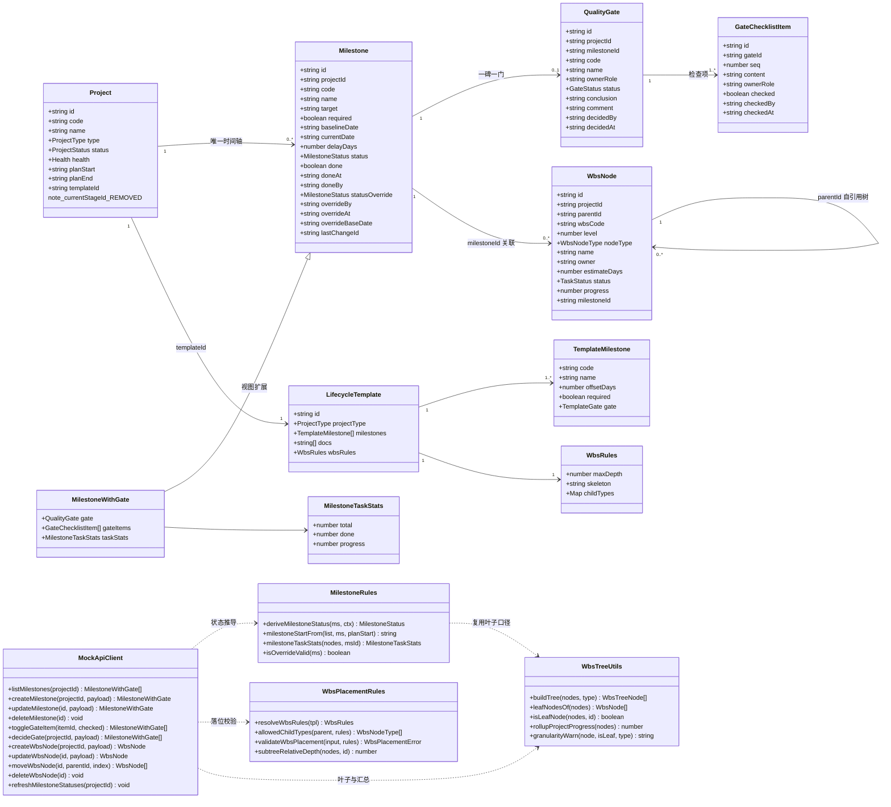
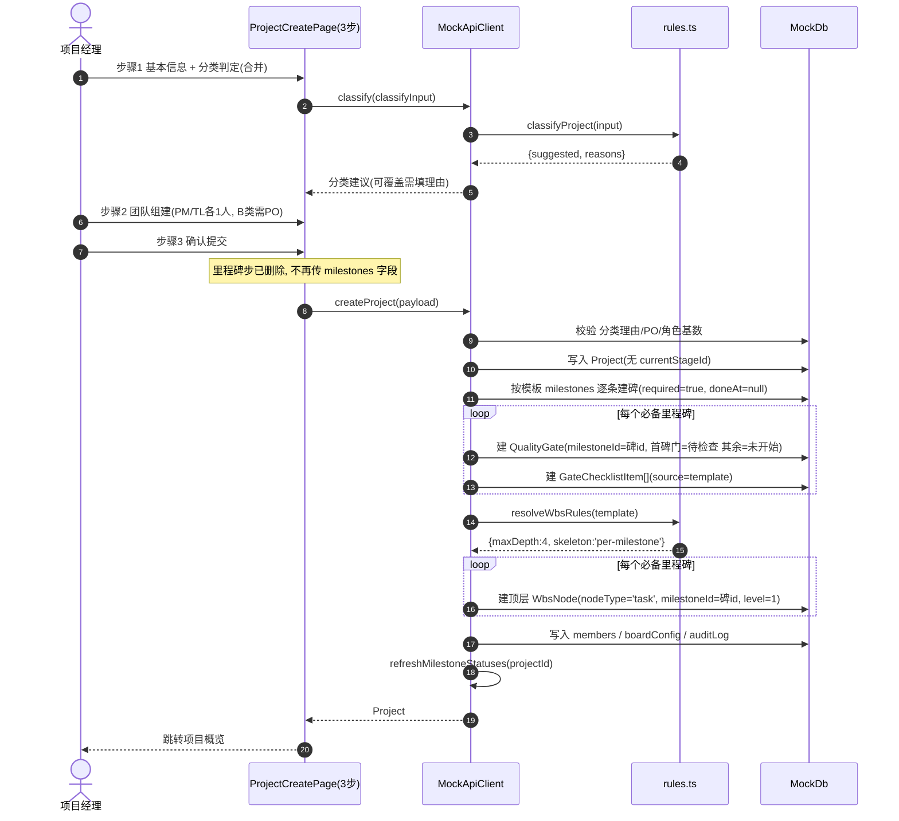
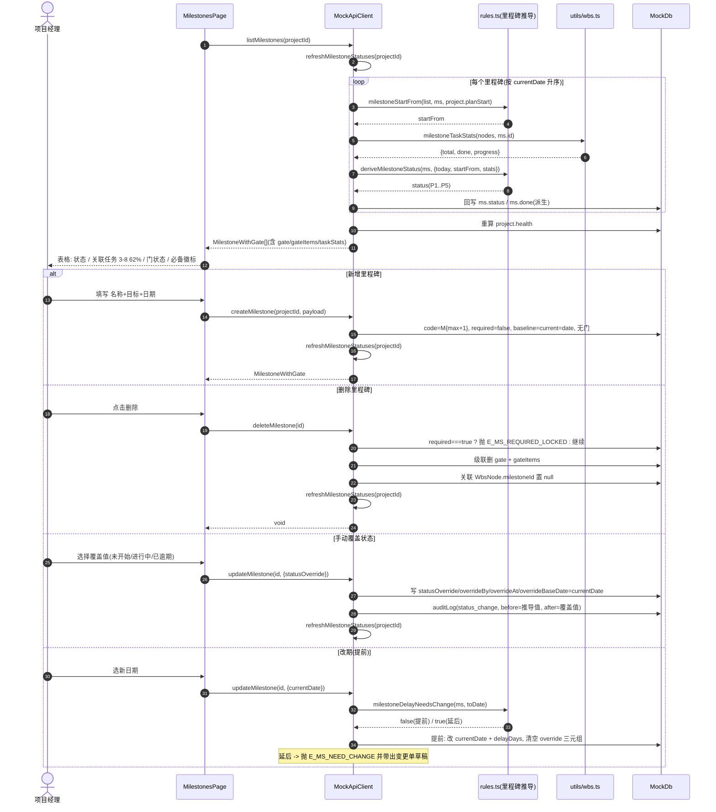
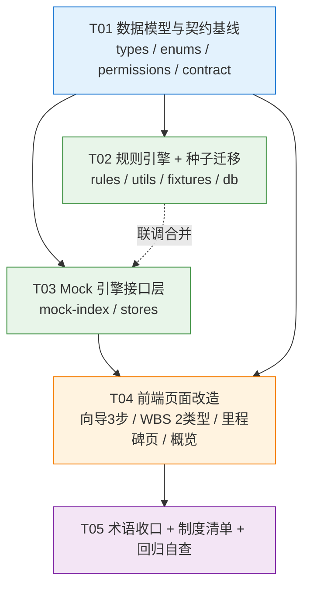

# 项目 / 里程碑 / WBS 简化重设计 —— 增量架构设计（方案一 · 极简）

| 项 | 内容 |
|---|---|
| 文档类型 | 增量架构设计 + 任务分解（不含代码） |
| 作者 | 高见远（架构师） |
| 版本 | **v1.3**（v1.1 吸收 PM 复核，U-1/U-2/U-5 定案；v1.2 新增 **§9.1 真值源分层原则** + §7.1 整表漂移实测；v1.3 收录 **R-5 定稿**、U-12 定案、新增 **§9.1.5 模板版本引用可机读**与断言 A-9） |
| 状态 | ✅ **PM 复核通过 → 可进入工程实现** |
| 上游 | `docs/wbs_simplify_prd.md`（PM 简化方案；⚠️ 该 PRD §C 推荐的是**方案二**，用户最终拍板**方案一**，本文为方案一的落地设计）· 用户拍板的 5 项决策 |
| 基线 | `docs/wbs_redesign_prd.md` / `docs/wbs_redesign_arch.md`（方案 B，本轮的「要改掉什么」） |
| 落地范围 | `pm-app/web/src/**`（前端 + Mock 引擎）+ `项目管理制度/太空数据中心项目管理制度V1.0.md` |
| 语言 | 中文 |

> ⚠️ **重要前提**：用户最终选择 **方案一（彻底去掉阶段）**，比 PM 推荐的方案二更激进。
> 本文严格按方案一设计，**不沿用**方案二「阶段保留但隐藏」的思路。

---

## 0. 决策基线回执（5 项拍板 → 架构落地口径）

| 决策 | 用户拍板 | 本架构落地口径 | 影响面 |
|---|---|---|---|
| **Q-1 阶段** | 彻底去掉 | `project_stages` 表 / `ProjectStage` / `StageWithGate` / `StageStatus` / `Project.currentStageId` / `advanceStage()` / `stage:advance` 权限 **全部删除**；质量门外键从 `stageId` 改挂 `milestoneId`（详见 §2.3） | 🔴 最大 |
| **Q-2 里程碑增删** | 自由新增 + 模板必备项锁删 | 新增 `createMilestone` / `deleteMilestone`；`Milestone.required` 标记锁删；新增错误码 `E_MS_REQUIRED_LOCKED` | 🔴 |
| **Q-3 WBS 节点** | 合并为「任务 + 子任务」2 类 | `WbsNodeType = 'task' \| 'subtask'`；删 `lifecycleStageId`；层级规则 6 条 → **2 条**；**叶子口径全仓改为「无子节点」而非「nodeType==='task'」**（详见 §2.4） | 🔴 |
| **Q-4 锚点 anchor** | 直接删除 | `Milestone.anchor` / `MilestoneAnchor` / `MILESTONE_ANCHOR_LABEL` / `MILESTONE_ANCHORS` / 模板 `anchorStage`+`anchor` / 向导 2 个下拉 / 里程碑页徽标 全删 | 🟡 |
| **状态推导** | 时间 + 完成度双输入 | `deriveMilestoneStatus()` 五级优先链 + `statusOverride` 三元组审计 + `done` 退化为派生（详见 §2.5） | 🔴 |

---

## 1. 实现方案（Implementation Approach）

### 1.1 核心技术难点

| # | 难点 | 本质 | 解法 |
|---|---|---|---|
| **N-1** | **质量门失去载体** | 门原本 1:1 挂在 `project_stages`；阶段删除后门成孤儿。PM 在 PRD §C.2 已论证「B 类 S3 评审 / S5 回顾、C 类 S4 调试验收是零里程碑阶段，门无处安放」 | **不造假里程碑，改为「重新分配检查项」**：把三类模板重排为 **一碑一门（0..1）**，门的检查项在模板层做拆分 / 合并 / 重挂，保证**检查项总数守恒**（A 19→19 / B 10→10 / C 10→10）。见 §2.3 迁移矩阵 |
| **N-2** | **状态双轨与"永远未开始"** | `status` 只有 2 个人工赋值点，且与 `done` 布尔双轨 | 状态与 `done` **全部降级为派生值**，唯一持久化真值 = `doneAt` + `statusOverride` 三元组；引入**单一写入口** `refreshMilestoneStatuses(db, projectId)`，在所有读路径（`listMilestones` / `getProject` / `listProjects` / `getWorkbench`）与相关写路径后惰性重算（Mock 无定时任务，惰性重算即"随时间自然流动"） |
| **N-3** | **叶子口径漂移** | 现全仓用 `nodeType === 'task'` 近似"叶子"（rollup / 粒度告警 / WIP / 看板卡片 / 工作台）。2 类型模型下「无子的 task」也是干活单元，旧口径会漏算 | 抽 `leafNodesOf(nodes)` / `isLeafNode(nodes, id)` 到 `utils/wbs.ts`，**7 个调用点统一改口径**（见 §2.4.3 口径迁移表）。这是本轮最容易漏改、且漏改后静默错算的地方 |
| **N-4** | **存量数据迁移** | 43 个种子 WBS 节点（5 stage + 10 package + 28 task）、5 个项目、15 条种子里程碑、26 个种子门 | Mock 侧无真实持久化：`STORAGE_KEY` v3 → **v4** 强制丢弃旧缓存；迁移落在 **fixtures 重写**（§2.6），并给出确定性映射规则，可脚本化校验 |
| **N-5** | **"项目走到第几步"指标消失** | 概览页阶段条、项目列表 `currentStageName`、管理层看板口径 | 用 **「已过 N/M 道门 · 下一站 M4 首件调试完成」** 替代；`ProjectListItem` 字段随之调整（§3.2） |

### 1.2 技术选型

**沿用现有技术栈，本轮零新增依赖**（见 §6）。理由：本轮是**删多于加的结构手术**，引入新库只会扩大回归面。

| 层 | 选型 | 本轮用法 |
|---|---|---|
| 构建 | Vite 5 + TypeScript 5.5 | 不变；`tsc --noEmit` 作为迁移完成度的**主要验收闸**（删字段后编译器会指出全部残留引用） |
| UI | React 18 + MUI 5 + Tailwind 3 | 不变；里程碑页新增「质量门」抽屉/对话框复用 `components/common/FormDialog` |
| 状态 | Zustand 4 | `projectStore` 删 `stages` 切片；`milestones` 切片类型升级为 `MilestoneWithGate[]` |
| 表单 | react-hook-form + zod | 向导 5 步 → 3 步后 `baseSchema` 不变，仅删里程碑步的校验分支 |
| 数据 | Mock 引擎（`api/mock/*`）+ sessionStorage | 契约层 `ApiClient` 不变形态，仅增删方法；`http.ts` 同步对齐签名（S1 未接后端，占位实现） |
| 架构模式 | 分层：`types` → `config` → `api/contract` → `api/mock`（rules 纯函数 + index 引擎）→ `stores` → `pages` | 不变。**规则纯函数继续由引擎与页面共用**（决策 D-2 保留），避免"前端放行、后端拒绝" |

### 1.3 三项关键架构决策

#### D-A 质量门载体：独立 `quality_gates` 表 + 外键换成 `milestoneId`（不内联 JSON）

| 方案 | 载体 | 优点 | 缺点 | 结论 |
|---|---|---|---|---|
| G-1 | `milestones` 表内联 `gateStatus` + `gateItems: JSON` | 表数量少 | ① 破坏既有 `decideGate` / `toggleGateItem` / `gateReady` / `closeBlockers` / `computeHealth` **全链路**；② JSON 数组内的检查项无稳定 id，勾选审计（`entityType='gate_item'`）无法落；③ 权限 `gate:decide` / `gate:item:check` 需重写 | ❌ |
| **G-2** | 独立 `quality_gates` 表，外键 `stageId` → **`milestoneId`** | ① 既有门链路 **100% 复用**，改动仅一个字段名；② `GateChecklistItem` 零改动；③ 权限 / 错误码 / 审计实体类型全部不动；④ 未来若要"一碑多门"只需放开唯一约束 | 概念上多一张表（本来就有） | ✅ **采纳** |

> **一句话**：阶段被删除，但**门本身是有价值的实体**，删的是它的挂载点不是它自己。换外键是本轮成本最低、回归面最小的路径。

#### D-B WBS 骨架策略：`per-stage` → `per-milestone`

阶段删除后，建项目时的 WBS 骨架预生成（`index.ts:652-682`）失去依据。三个候选：

| 候选 | 说明 | 评价 |
|---|---|---|
| `none` | 新项目 WBS 为空树 | 用户面对空白页，且「关联任务完成度」永远为 0，状态推导的一半输入失效 |
| **`per-milestone`** | 为每个**必备里程碑**生成 1 个顶层 `task`，`name` = 里程碑名，`milestoneId` 自动绑定 | ✅ **采纳**：① WBS 顶层 = 里程碑镜像，与"里程碑是唯一时间轴"的信息架构自洽；② 用户往下挂子任务即自动计入该碑的完成度（统计走**子树并集**）；③ 存量 stage 骨架节点天然一一映射过来 |
| `per-template-fixed` | 固定 3 个顶层分组 | 又造了一层用户要理解的东西，与"极简"相悖 |

#### D-C 状态推导的写入模型：**单一写入口 + 惰性重算**

- `Milestone.status` / `Milestone.done` **均为派生值**，任何业务代码 **禁止直接赋值**；
- 唯一持久化真值：`doneAt`（达成时间）+ `doneBy` + `statusOverride` 三元组（`statusOverride` / `overrideBy` / `overrideAt` / `overrideBaseDate`）；
- 唯一写入口：`refreshMilestoneStatuses(db, projectId)` —— 遍历该项目里程碑，按 §2.5 优先链算出 `status`，回写 `status` / `done`，并顺带刷新 `project.health`；
- 调用时机：**读路径**（`listMilestones` / `getProject` / `listProjects` / `getWorkbench` / `checkClose`）+ **写路径后**（`updateMilestone` / `createMilestone` / `deleteMilestone` / `decideGate` / `updateWbsNode`(progress) / `moveTask` / `applyChange`）。

---

## 2. 数据结构与接口

### 2.1 数据模型变更总览

| 实体 | 增 | 改 | 删 |
|---|---|---|---|
| **Milestone** | `required: boolean`（模板必备 → 锁删）<br>`statusOverride: MilestoneStatus \| null`<br>`overrideBy / overrideAt / overrideBaseDate: string \| null`<br>`doneBy: string \| null` | `status` → 派生（只读语义）<br>`done` → 派生 `done = (status==='已达成')` | `stageId`<br>`anchor` |
| **QualityGate** | — | `stageId: string` → **`milestoneId: string`** | — |
| **Project** | — | — | `currentStageId` |
| **ProjectListItem** | `nextMilestoneCode / nextMilestoneName: string`<br>`gatePassed / gateTotal: number` | `currentGateCode / currentGateStatus` 语义改为「下一个未达成里程碑的门」 | `currentStageName` |
| **WbsNode** | — | `nodeType: 'task' \| 'subtask'` | `lifecycleStageId` |
| **WbsRules** | — | `skeleton: 'none' \| 'per-milestone'`<br>`childTypes` 键降为 `root/task/subtask` | `allowRootTask`<br>`requireStageBinding` |
| **LifecycleTemplate.definition** | `milestones[].required: boolean`<br>`milestones[].gate?: {...}` | — | `stages[]`<br>`milestones[].anchorStage`<br>`milestones[].anchor` |
| **MockDb** | — | `gates` 外键变更 | `stages: ProjectStage[]` |
| **类型（整体删除）** | — | — | `ProjectStage` / `StageWithGate` / `StageStatus` / `MilestoneAnchor` / `MilestoneDraft` |
| **类型（新增）** | `MilestoneWithGate` / `MilestoneTaskStats` / `MilestoneCreatePayload` | — | — |

### 2.2 类图（Mermaid）



> 图中 `note_currentStageId_REMOVED` 为占位标记：`Project.currentStageId` 本轮删除。
> **已从模型中消失的实体**：`ProjectStage`、`StageWithGate`、`MilestoneAnchor`、`MilestoneDraft`、`WbsNode.lifecycleStageId`。

### 2.3 【核心】质量门归属：一碑一门

#### 2.3.1 约束定义

| 编号 | 约束 | 落地位置 |
|---|---|---|
| **C-G1** | 一个里程碑最多挂 **1 道门**（0..1）；`gates.milestoneId` 在项目内唯一 | `createMilestone` / 模板实例化 |
| **C-G2** | **模板必备里程碑恒配 1 门**；用户自建里程碑默认**无门**（本轮不开放自建门，见 U-3） | `templates.ts` + `createMilestone` |
| **C-G3** | 门结论为 `已通过` / `有条件通过` → **里程碑自动达成**（`doneAt=today` / `doneBy=决议人` / 清空 override） | `decideGate` |
| **C-G4** | 里程碑**有门且门未过** → 手动标记达成被拒，抛 `E_GATE_NOT_PASSED`（文案改写为「质量门未通过，里程碑不能标记达成」）。这就是"未过不能算达成" | `updateMilestone(achieved=true)` |
| **C-G5** | 删除里程碑 → **级联删除**其门与检查项；必备里程碑不可删 ⇒ 必备门不会成孤儿 | `deleteMilestone` |
| **C-G6** | 结项前置检查口径**不变**：门未过 + 碑未达成 均为 blocker | `closeBlockers`（仅入参来源换成 `gates.milestoneId`） |
| **C-G7** | 「某里程碑的门过了没」= `gate === null ? '无需门控' : gate.status`；概览页汇总为 `已过 N/M 道门` | `MilestoneWithGate` 视图 |

#### 2.3.2 迁移矩阵 · A 类（原 6 阶段 6 门 7 碑 → **7 碑 7 门**）

| 新门码 | 挂载里程碑 | 门名称 | ownerRole | 检查项来源 | 项数 |
|---|---|---|---|---|---|
| QG1 | M1 项目启动 | 立项质量门 | pmo | 原 QG1 全量 | 3 |
| QG2 | M2 需求基线冻结 | 需求质量门 | pmo | 原 QG2 全量 | 3 |
| QG3 | M3 设计评审通过 | 设计质量门 | tl | 原 QG3 全量 | 3 |
| QG4 | M4 首件调试完成 | 开发实施质量门 | qa | 原 QG4 全量 | 4 |
| QG5 | M5 集成测试通过 | 集成测试质量门 | qa | 原 QG5 全量 | 3 |
| QG6 | M6 客户验收通过 | 验收质量门 | pmo | 原 QG6 **拆分**：客户验收报告已签署 / 交付物清单齐套并归档 | 2 |
| **QG7**（新码） | M7 项目结项 | 结项质量门 | pmo | 原 QG6 **拆分**：结项复盘已完成 | 1 |
| | | | | **合计** | **19 = 19 ✅** |

> ⚠️ **制度对照差异（PM 复核发现，R-5 必须处理）**：制度 §7.1（L449）现文中 QG6 只列了
> 「验收报告」「文档集」**2 项**，**没有**「结项复盘」这一项 —— 也就是说 `fixtures` 里的第 3 项
> 是运行时多出来的。本轮拆分把它独立为 QG7 后，**R-5 改写制度时必须显式补上
> 「结项复盘已完成」为 QG7 的检查项，并注明其来源为原运行时 QG6 第 3 项**，
> 否则会再次出现「制度门控内容 < 实际检查项」的错位（与 R-7 是同源治理债）。

#### 2.3.3 迁移矩阵 · B 类（原 5 阶段 5 门 3 碑 → **4 碑 4 门**）

| 新门码 | 挂载里程碑 | 门名称 | ownerRole | 检查项来源 | 项数 |
|---|---|---|---|---|---|
| QB1 | M1 Sprint 启动 | 计划就绪门 | po | 原 QB1 全量 | 2 |
| QB2 | M2 特性冻结 | 开发完成门 | tl | 原 QB2 全量 | 2 |
| QB3 | M3 版本发布 | 发布门 | qa | 原 QB3 **合并** 原 QB4：回归通过率≥95% / 无 P0P1 未关闭缺陷 / Demo 已向 PO 验收 / 发布说明与回滚方案齐备 | 4 |
| QB4 | **M4 Sprint 回顾完成（新增必备碑，offsetDays=16）** | 回顾闭环门 | pmo | 原 QB5 全量 | 2 |
| | | | | **合计** | **10 = 10 ✅** |

> 🔴 **这是 PM 在 §C.2 提出的"零里程碑阶段"问题的正面解法**：
> 「Sprint 回顾完成」不是造出来的假碑 —— 它是敏捷实践中真实存在的时间点（制度 §3.2 已定义回顾环节），
> 只是上一版模板漏配了。**新增它比把回顾门塞进发布门更诚实**（备选方案见 U-1）。

#### 2.3.4 迁移矩阵 · C 类（原 5 阶段 5 门 5 碑 → **5 碑 5 门**，检查项重新分配）

| 新门码 | 挂载里程碑 | 门名称 | ownerRole | 检查项来源 | 项数 |
|---|---|---|---|---|---|
| QC1 | M1 项目启动 | 立项质量门 | pmo | 原 QC1 全量 | 2 |
| QC2 | M2 方案定稿 | 方案评审门 | tl | 原 QC2 全量 | 2 |
| QC3 | M3 设备到货 | 到货验收门 | cm | 原 QC3 拆分：设备到货验收单齐备 | 1 |
| QC4 | M4 施工完成 | 施工完成门 | pm | 原 QC3 拆分：施工进度与安全记录齐全 + 原 QC4 拆分：系统联调测试通过 | 2 |
| QC5 | M5 验收移交 | 验收移交门 | pmo | 原 QC4 拆分：验收报告已签署 + 原 QC5 全量 | 3 |
| | | | | **合计** | **10 = 10 ✅** |

> **不变量**：三类模板的**检查项内容一字不改，只改归属**。这保证制度 §7.1 的门控实质要求零损失，
> 制度侧只需改「门挂在哪儿」的表述（R-5），不需要重写检查内容。

### 2.4 WBS 数据模型：2 类型 + 2 条规则

#### 2.4.1 类型与规则定义

```
WbsNodeType = 'task' | 'subtask'
WBS_NODE_TYPE_LABEL = { task: '任务', subtask: '子任务' }

WbsRules {
  maxDepth: 4
  skeleton: 'none' | 'per-milestone'          // 默认 per-milestone
  childTypes: {
    root:    ['task'],
    task:    ['task', 'subtask'],             // 任务可多级
    subtask: []                               // 子任务必为叶
  }
}
```

#### 2.4.2 层级规则：6 条 → 2 条

| 新编号 | 规则 | 错误码 | 说明 |
|---|---|---|---|
| **W-1** | **深度上限**：`目标层级 + 被移动子树高度 ≤ maxDepth(4)` | `E_WBS_DEPTH` | 保留原实现（含 move 的子树整体判定），仅参数简化。**必须先于 W-2 判定**（原注释已说明原因，沿用） |
| **W-2** | **父子类型**：根层只能是 `task`；`task` 下可挂 `task`/`subtask`；`subtask` 下不可挂任何节点 | `E_WBS_PARENT_TYPE` | 等价于「子任务必为叶」+「禁止把子任务当父」两条口语规则 |
| （保留） | 已有子节点的节点不可改 `nodeType`（`task → subtask` 被此规则拦住） | `E_WBS_TYPE_LOCKED` | 语义不变，仅适配新类型 |
| （删除） | ~~R-6 工作分区必须绑定生命周期阶段~~ | ~~`E_WBS_STAGE_UNBOUND`~~ | 随阶段一并删除 |
| （删除） | ~~allowRootTask 收敛~~ | — | 根层唯一合法类型即 `task`，配置项失去意义 |

#### 2.4.3 🔴 叶子口径统一迁移表（最易漏改项）

| # | 调用点 | 文件:行 | 旧口径 | **新口径** |
|---|---|---|---|---|
| L-1 | 项目进度汇总 | `api/mock/rules.ts:415` | `nodeType === 'task'` | `leafNodesOf(nodes)` |
| L-2 | 粒度告警 | `api/mock/rules.ts:269` | `nodeType !== 'task'` 直接 return | 入参改为 `(node, isLeaf, type)`，仅对**真叶子**告警 |
| L-3 | WIP 检查 | `api/mock/rules.ts:179` | `nodeType === 'task'` | `isLeafNode(nodes, n.id)` |
| L-4 | 看板卡片集 | `api/mock/index.ts:355`（`buildBoard`） | `nodeType === 'task'` | `leafNodesOf(projectNodes)` |
| L-5 | 工作台「我的任务」 | `api/mock/index.ts:1841` | `nodeType === 'task'` | `leafNodesOf(...)` + `owner === me` |
| L-6 | 周报种子任务集 | `api/mock/fixtures/reports.ts:98` | `nodeType === 'task'` | `leafNodesOf(...)` |
| L-7 | 树告警 | `utils/wbs.ts:67-82` | `stage 未绑阶段` + `leaf` 混判 | 删阶段告警分支；保留缺负责人 / 缺估算 / 粒度超限（均基于真叶子） |
| L-8 | 叶子完整性强校验 | `api/mock/index.ts:1030 / 1175` | `nodeType === 'task'` 必填 owner+estimate | **仅 `nodeType === 'subtask'` 强制**；无子 `task` 降级为非阻塞告警（否则"先建父后建子"会被卡死） |

> **约定（SK-4）**：任何新增代码判断"这是不是干活单元"，一律走 `utils/wbs.ts` 的 `leafNodesOf` / `isLeafNode`，
> **禁止**再出现 `nodeType === 'task'` 这种写法。

#### 2.4.4 存量 WBS 节点映射规则（确定性、可脚本校验）

| 原 nodeType | 条件 | 新 nodeType | 种子数量 |
|---|---|---|---|
| `stage` | 全部（各项目根节点） | `task` | 5 |
| `package` | 全部（二级容器） | `task` | 10 |
| `task` | **有子节点** | `task` | 0 |
| `task` | **无子节点**（种子中全部如此） | `subtask` | 28 |
| — | `lifecycleStageId` 字段整列删除 | — | 43 |
| **合计** | | **task 15 / subtask 28** | **43 ✅** |

迁移后校验断言（建议写进 `scripts/` 自检脚本或人工核对）：
- A-1 最大层级 = 3（`1.2.3`）≤ maxDepth 4 ✅
- A-2 不存在 `subtask` 拥有子节点 ✅
- A-3 不存在根层 `subtask` ✅
- A-4 全部 `subtask` 的 `owner`/`estimateDays` 若为空 → 保留为**演示用告警样本**（种子刻意留了 `1.3.3 前端可视化开发` 无负责人、`1.2.4 精密空调安装` 无负责人），不阻塞

### 2.5 里程碑状态推导（时间 + 完成度双输入）

#### 2.5.1 优先链（自上而下，命中即定）

| 序 | 条件 | 结果 | 说明 |
|---|---|---|---|
| **P1** | `statusOverride !== null` **且** `overrideBaseDate === currentDate` | `statusOverride` | PM 手动覆盖；**改期后自动失效**（`currentDate` 一变，基线对不上 → 覆盖作废并惰性清空） |
| **P2** | `doneAt !== null` | `已达成` | 达成的唯一真值来源；写入需满足 C-G4（有门必须门过） |
| **P3** | `diffDays(today, currentDate) < 0`（即 `today > currentDate`） | `已逾期` | 原 UI 的 `isOverdue` 补丁转正为引擎逻辑 |
| **P4** | `taskStats.progress > 0` **或** `today >= startFrom` | `进行中` | 🔴 **关键**：`startFrom` = 上一里程碑的 `currentDate`，首碑取 `project.planStart`。**零任务挂载也会随时间自然进入"进行中"** |
| **P5** | 其余 | `未开始` | |

**不变量（消歧关键）**：`achieve` / `取消达成` / `改期` 三个写入动作**一律清空 override 三元组** ⇒ P1 与 P2 永不冲突，两种优先顺序等价。

#### 2.5.2 派生规则

```
done   = (status === '已达成')            // 不再是独立可写字段
status = deriveMilestoneStatus(ms, ctx)   // 不再有人工赋值点
```

#### 2.5.3 关联任务完成度 `milestoneTaskStats(nodes, milestoneId)`

- **关联集合** = `nodes.filter(n => n.milestoneId === msId)` 各节点的**子树并集**中的**真叶子**（直接 + 间接挂载均计入）
- `progress` = `Σ(estimateDays||1 × progress) / Σ(estimateDays||1)`（**直接复用 `rollupProjectProgress` 的加权算法，零新范式**）
- `total` = 叶子总数，`done` = `progress === 100` 的叶子数
- UI 呈现：里程碑页新增一列 **「关联任务 3/8 · 62%」**，让用户看得见推导依据

#### 2.5.4 `startFrom` 计算

```
list  = 同项目里程碑按 currentDate 升序（同日按 code 升序，保证确定性）
idx   = list.indexOf(ms)
startFrom = idx === 0 ? project.planStart : list[idx - 1].currentDate
```

#### 2.5.5 override 审计三元组

| 字段 | 含义 |
|---|---|
| `statusOverride` | 覆盖值，**值域恒定为三态 `未开始` / `进行中` / `已逾期`**（🔒 U-5 已定案，见下方值域收口） |
| `overrideBy` | 操作人 openId |
| `overrideAt` | 操作时间 ISO |
| `overrideBaseDate` | 覆盖时的 `currentDate` 快照，**用于"改期后失效"判定** |

同时写 `auditLogs`：`entityType='milestone'`、`action='status_change'`、`diff=[{field:'statusOverride', label:'状态覆盖', before: 原推导值, after: 覆盖值}]`。

##### 2.5.5.1 override 值域收口（🔒 U-5 定案 · PM 复核确认）

```ts
type MilestoneOverride = '未开始' | '进行中' | '已逾期';   // 恒不含「已达成」
```

**为什么「已达成」不进值域** —— 达成有且只有一条写入路径 `doneAt`，且受 C-G4 约束：

| 里程碑形态 | 标记达成的路径 | C-G4 门控 |
|---|---|---|
| **有门的碑**（模板必备碑） | 门决议为「已通过 / 有条件通过」→ 引擎自动写 `doneAt`；或 `updateMilestone(achieved=true)` | ✅ **拦截**：门未过则抛 `E_GATE_NOT_PASSED` |
| **无门的碑**（用户自建碑，U-3 本轮不配门） | `updateMilestone(achieved=true)` 直接写 `doneAt` | ⭕ **放行**：`gate === null` 时 C-G4 不适用 |

> 🔴 **边界澄清（PM 复核补充）**：无门自建碑的达成需求，由 `achieved=true` 这条**独立写入路径**满足，
> **不需要**为此把「已达成」放进 override 值域。二者职责正交：
> - `achieved` 写的是**事实**（`doneAt` 真值，会进审计、会触发后续碑 `startFrom` 前移）
> - `statusOverride` 写的是**对推导结果的临时人工修正**（会随改期自动失效）
>
> 若把「已达成」放进 override，等于给「绕过门控达成」开了后门，与制度 §1.2.3 / §7.1
> 「未通过质量门不得推进」直接冲突。**实现时请在 `updateMilestone` 入参层用类型收口，
> 而不是只在 UI 下拉里少放一个选项。**

### 2.6 存量数据迁移方案

| 对象 | 迁移动作 | 责任文件 |
|---|---|---|
| **sessionStorage 缓存** | `STORAGE_KEY: 'pm_mock_db_v3'` → **`'pm_mock_db_v4'`**，旧缓存直接丢弃重建（沿用现有升版策略，注释同步说明删了 stages / anchor / lifecycleStageId） | `api/mock/db.ts` |
| **MockDb 结构** | 删 `stages: ProjectStage[]`；`gates[].stageId` → `milestoneId` | `api/mock/db.ts` |
| **模板** | 删 `definition.stages`；`definition.milestones[]` 增 `required: true` + 内联 `gate`（按 §2.3.2~2.3.4 三张矩阵重写）；`wbsRules` 改为 `{ maxDepth: 4, skeleton: 'per-milestone' }`（三类一致，模板不再声明差异项） | `api/mock/fixtures/templates.ts` |
| **项目种子** | `ProjectSpec` 删 `currentStageSeq`，改为 `currentGateSeq`（第几道门在检）；实例化循环里删阶段生成段，改为**按里程碑生成门**；里程碑写入删 `stageId`/`anchor`，加 `required: true` / `doneAt` / `doneBy` / override 四字段初值 null | `api/mock/fixtures/projects.ts` |
| **里程碑数量** | A 类 7（不变）· **B 类 3 → 4**（新增 M4 Sprint 回顾完成）· C 类 5（不变）。`milestonesDone` 计数需复核：P0015（B 类）当前 `milestonesDone: 1` 仍有效 | `api/mock/fixtures/projects.ts` |
| **WBS 种子** | 按 §2.4.4 映射表改 `nodeType`；删 `lifecycleStageId`；**补 `milestoneId`**（见下表），让状态推导在演示数据上立刻有真实输入 | `api/mock/fixtures/wbs.ts` |
| **周报种子** | 任务集口径改 `leafNodesOf` | `api/mock/fixtures/reports.ts` |
| **fixtures 汇总** | `createSeedDb()` 删 `stages` 字段 | `api/mock/fixtures/index.ts` |

**种子 `milestoneId` 补挂建议**（挂在二级容器 `task` 上，子树叶子自动计入）：

| 项目 | 节点 | 挂载里程碑 |
|---|---|---|
| P0012（A） | 1.1 需求阶段 / 1.2 设计阶段 / 1.3 开发实施 / 1.4 数据接入模块 / 1.5 集成测试 | M2 / M3 / M4 / M4 / M5 |
| P0015（B） | 1.1 Sprint 7 / 1.2 技术债 | M2 / M3 |
| P0018（C） | 1.1 方案设计 / 1.2 采购施工 / 1.3 调试验收 | M2 / M4 / M5 |
| P0009（已结项 C） | 1.1 设备迁移 / 1.2 验收移交 | M4 / M5 |
| P0021（A 审批中） | 1 遥测分析系统（根 task） | M1 |

---

## 3. 接口契约变更（`api/contract.ts`）

### 3.1 ApiClient 方法 diff

| 动作 | 方法 | 签名 | 说明 |
|---|---|---|---|
| 🔴 删 | `listStages(projectId)` | — | 阶段消失 |
| ✏️ 改 | `listMilestones(projectId)` | `→ Promise<MilestoneWithGate[]>` | 一次带出门 + 检查项 + 关联任务统计（原 `StageWithGate` 的职责合并到此） |
| 🟢 增 | `createMilestone(projectId, payload)` | `MilestoneCreatePayload → Promise<MilestoneWithGate>` | `payload = { name, target?, date }`；`code` 服务端生成 `M{max+1}`；`required=false`；无门 |
| 🟢 增 | `deleteMilestone(id)` | `→ Promise<void>` | `required=true` → `E_MS_REQUIRED_LOCKED`；级联删门与检查项；关联 WBS 节点 `milestoneId` 置 null |
| ✏️ 改 | `updateMilestone(id, payload)` | `→ Promise<MilestoneWithGate>` | payload 见下 |
| ✏️ 改 | `toggleGateItem(itemId, checked)` | `→ Promise<MilestoneWithGate[]>` | 返回类型换壳，逻辑不变 |
| ✏️ 改 | `decideGate(projectId, payload)` | `→ Promise<MilestoneWithGate[]>` | 通过后不再 `advanceStage`，改为**里程碑自动达成**（C-G3） |
| ✏️ 改 | `createProject(payload)` | `CreateProjectPayload` 删 `milestones?` | 向导不再配碑；模板静默生成必备碑 |
| ✏️ 改 | `createWbsNode` / `updateWbsNode` | `WbsNodePayload` 删 `lifecycleStageId` | `nodeType` 取值改为 2 类 |

**`MilestoneUpdatePayload` 新形态**：

| 字段 | 类型 | 说明 |
|---|---|---|
| `name?` | string | |
| `target?` | string | 目标 / 达成标准 |
| `currentDate?` | string | 提前直接改；延后抛 `E_MS_NEED_CHANGE`（逻辑不变）；**改期后清空 override** |
| `achieved?` | boolean | **替代原 `done`**（消除双轨命名歧义）。`true` 时校验 C-G4 |
| `statusOverride?` | `MilestoneStatus \| null` | 手动覆盖；`null` = 撤销覆盖 |
| ~~`stageId` / `anchor`~~ | — | 删除 |

### 3.2 `ProjectListItem` 字段调整

| 动作 | 字段 | 新语义 |
|---|---|---|
| 🔴 删 | `currentStageName` | — |
| 🟢 增 | `nextMilestoneCode` / `nextMilestoneName` | 下一个未达成里程碑（按 `currentDate` 升序首个 `!done`） |
| 🟢 增 | `gatePassed` / `gateTotal` | 「已过 N/M 道门」 |
| ✏️ 改 | `currentGateCode` / `currentGateStatus` | 指**下一个未达成里程碑**所挂的门 |
| 保留 | `progress` / `milestoneDone` / `milestoneTotal` / `nextMilestoneDate` / `highRiskCount` | 语义不变 |

### 3.3 错误码变更（`types/api.ts`）

| 动作 | 错误码 | 中文提示 |
|---|---|---|
| 🔴 删 | `E_WBS_STAGE_UNBOUND` | — |
| 🔴 删 | `E_STAGE_SEQUENCE` | —（原本就是未实现的契约保留位） |
| 🟢 增 | `E_MS_REQUIRED_LOCKED` | 模板必备里程碑不可删除，仅可改期 |
| ✏️ 改文案 | `E_GATE_NOT_PASSED` | 「质量门未通过，无法进入下一阶段」→ **「质量门未通过，里程碑不能标记达成」** |
| 保留 | `E_WBS_DEPTH` / `E_WBS_PARENT_TYPE` / `E_WBS_TYPE_LOCKED` / `E_WBS_LEAF_INCOMPLETE` / `E_WBS_CYCLE` / `E_MS_NEED_CHANGE` / `E_GATE_ITEM_INCOMPLETE` | 文案按新术语微调（「工作分区」→「任务」） |

### 3.4 权限变更（`config/permissions.ts`）

| 动作 | 权限键 | 说明 |
|---|---|---|
| 🔴 删 | `stage:advance` | 阶段推进消失；概览页「进入下一阶段」按钮同步删除 |
| 保留 | `milestone:create` / `milestone:edit` / `milestone:delete` | **已存在，本轮直接启用**（原来只是没有对应接口） |
| 保留 | `gate:decide` / `gate:item:check` / `gate:item:add` | 语义不变，作用对象从阶段门变为里程碑门 |

---

## 4. 程序调用流程（时序图）

### 4.1 建项目（3 步向导 → 模板静默生成碑 + 门 + WBS 骨架）



### 4.2 里程碑增删改 + 状态惰性推导



### 4.3 质量门决议 → 里程碑自动达成（替代原「阶段推进」）

```mermaid
sequenceDiagram
    autonumber
    actor QA as 质量负责人
    participant Page as MilestoneGateDialog
    participant Api as MockApiClient
    participant Rules as rules.ts
    participant Db as MockDb

    QA->>Page: 打开某里程碑的质量门检查清单
    QA->>Page: 勾选检查项
    Page->>Api: toggleGateItem(itemId, true)
    Api->>Db: 写 checked/checkedBy/checkedAt + auditLog(gate_item)
    Api-->>Page: MilestoneWithGate[]

    QA->>Page: 提交门控结论
    Page->>Api: decideGate(projectId, {gateId, conclusion, comment})
    Api->>Rules: gateReady(items)
    Rules-->>Api: {ready, unchecked}
    alt 有未勾选项 且 结论不是"不通过"
        Api-->>Page: 抛 E_GATE_ITEM_INCOMPLETE(带未勾选清单)
    else 结论 已通过 / 有条件通过
        Api->>Db: gate.status=结论, decidedBy/decidedAt
        Api->>Db: 里程碑 doneAt=today, doneBy=决议人, 清空 override
        Api->>Db: auditLog(gate.decide) + auditLog(milestone.status_change)
        Api->>Api: refreshMilestoneStatuses(projectId)
        Note over Api: 该碑 -> 已达成; 后续碑因 startFrom 前移可能自动转"进行中"
        Api->>Db: 重算 project.health
        Api-->>Page: MilestoneWithGate[]
    else 结论 不通过
        Api->>Db: gate.status=不通过; 里程碑保持原推导状态
        Api-->>Page: MilestoneWithGate[]
    end

    Note over QA,Db: 手动勾"达成"路径: updateMilestone(achieved=true)<br/>若该碑有门且门未过 -> 抛 E_GATE_NOT_PASSED(C-G4)
```

---

## 5. 文件列表（相对 `pm-app/`）

### 5.1 类型 / 配置 / 契约层

| 文件 | 动作 | 要点 |
|---|---|---|
| `web/src/types/wbs.ts` | 改 | `WbsNodeType` 2 类；`WbsNode` 删 `lifecycleStageId`；`WbsRules` 删 2 字段、`skeleton` 改枚举、`childTypes` 键收敛 |
| `web/src/types/project.ts` | 改 | 删 `ProjectStage`/`StageWithGate`/`StageStatus`/`MilestoneAnchor`/`MilestoneDraft`；`Milestone` 增 5 字段删 2 字段；`QualityGate.stageId`→`milestoneId`；`Project` 删 `currentStageId`；`ProjectListItem` 调字段；`LifecycleTemplate.definition` 重构；新增 `MilestoneWithGate`/`MilestoneTaskStats` |
| `web/src/types/api.ts` | 改 | 错误码增删改（§3.3） |
| `web/src/config/enums.ts` | 改 | 删 `STAGE_STATUSES`/`MILESTONE_ANCHOR_LABEL`/`MILESTONE_ANCHORS`；`WBS_NODE_TYPE_LABEL` 改 2 项；`DEFAULT_WBS_RULES` 重写；`AUDIT_ENTITY_LABEL` 删 `stage` |
| `web/src/config/permissions.ts` | 改 | 删 `stage:advance` |
| `web/src/api/contract.ts` | 改 | `ApiClient` 方法增删改（§3.1）；`CreateProjectPayload` 删 `milestones`；`WbsNodePayload` 删 `lifecycleStageId`；`MilestoneUpdatePayload` 重写；新增 `MilestoneCreatePayload` |
| `web/src/api/http.ts` | 改 | 与 contract 同步（S1 占位实现，保证 `tsc` 通过） |

### 5.2 规则 / 引擎 / 数据层

| 文件 | 动作 | 要点 |
|---|---|---|
| `web/src/api/mock/rules.ts` | 改 | `validateWbsPlacement` 砍到 2 条；`resolveWbsRules` 去掉 2 个字段；`allowedChildTypes` 去 `allowRootTask` 分支；`granularityWarn` 改叶子口径；`checkWip` 改叶子口径；`rollupProjectProgress` 改叶子口径；`closeBlockers` 入参去 stage；**新增 `deriveMilestoneStatus` / `milestoneStartFrom` / `isOverrideValid`** |
| `web/src/utils/wbs.ts` | 改 | 删「未绑生命周期阶段」告警；**新增 `leafNodesOf` / `isLeafNode` / `milestoneTaskStats`** |
| `web/src/api/mock/db.ts` | 改 | 删 `stages`；`STORAGE_KEY` → `pm_mock_db_v4`；注释更新 |
| `web/src/api/mock/index.ts` | 改 | 删 `advanceStage`/`stagesWithGate`/`listStages`；新增 `milestonesWithGate`/`refreshMilestoneStatuses`；`createProject` 重构（碑+门+per-milestone 骨架）；`createMilestone`/`deleteMilestone` 新增；`updateMilestone` 重写；`decideGate` 改为触发达成；WBS 三接口去 stage 分支；`buildBoard`/工作台/列表聚合改叶子口径与新字段；`applyChange` 里程碑回写只改日期 |
| `web/src/api/mock/fixtures/templates.ts` | 改 | 三类模板按 §2.3 迁移矩阵重写（删 `stages`，碑内联 `gate` + `required`） |
| `web/src/api/mock/fixtures/projects.ts` | 改 | 删阶段实例化；按碑建门；里程碑字段迁移；B 类补第 4 碑 |
| `web/src/api/mock/fixtures/wbs.ts` | 改 | `NodeSpec` 类型映射（§2.4.4）；删 `lifecycleStageId`；补 `milestoneId` |
| `web/src/api/mock/fixtures/reports.ts` | 改 | 任务集改叶子口径 |
| `web/src/api/mock/fixtures/index.ts` | 改 | `createSeedDb()` 删 `stages` |

### 5.3 状态 / 页面层

| 文件 | 动作 | 要点 |
|---|---|---|
| `web/src/stores/projectStore.ts` | 改 | 删 `stages` 切片与 `refreshStages`；`milestones` 类型升级为 `MilestoneWithGate[]` |
| `web/src/stores/wbsStore.ts` | 改 | 注释术语；`createNode`/`updateNode` 入参去 `lifecycleStageId` |
| `web/src/pages/projects/ProjectCreatePage.tsx` | 改 | **5 步 → 3 步**：删「里程碑规划」整步（含 42 个控件、`tplStages`、`msTouched`、`nextMilestoneCode`、锚点下拉）；步骤 1 合并「基本信息 + 分类判定」；确认页去掉里程碑清单，改为一行提示「将按 X 类模板自动生成 N 个里程碑，创建后可在里程碑页调整」 |
| `web/src/pages/projects/WbsPage.tsx` | 改 | 类型下拉 2 项；删「归属阶段」选择器与相关列/告警；说明文案改「任务 → 子任务（最多 4 层）」；删除确认里的 stage 保护分支；里程碑关联下拉对 `task`/`subtask` 均开放 |
| `web/src/pages/projects/MilestonesPage.tsx` | 改 | 删「所属阶段」列与 anchor 徽标；**新增**：新增/删除按钮（必备项禁删 + tooltip）、状态列（自动推导 + 覆盖入口 + 覆盖徽标）、「关联任务 n/m · x%」列、质量门列（状态 chip + 打开检查清单） |
| `web/src/pages/projects/MilestoneGateDialog.tsx` | **新增** | 质量门检查清单 + 结论提交（从概览页阶段条迁移过来的能力，复用 `FormDialog`） |
| `web/src/pages/projects/ProjectOverviewPage.tsx` | 改 | 阶段条 → **「里程碑时间轴 / 质量门进度」条**：横向展示各碑（状态色 + 门图标 + 日期），标题改「质量门进度」，副标题改「已过 N/M 道门 · 下一站 Mx xxx」；删「进入下一阶段」按钮与 `stage:advance` |
| `web/src/pages/projects/ProjectListPage.tsx` | 改 | 「当前阶段」列 → 「下一里程碑 / 门进度」列 |
| `web/src/pages/WorkbenchPage.tsx` | 改 | 「我的任务」口径改叶子；阶段相关卡片改里程碑口径 |
| `web/src/pages/admin/AdminTemplatesPage.tsx` | 改 | 模板展示结构从「阶段 + 门」改为「里程碑 + 门」 |

### 5.4 文档

| 文件 | 动作 |
|---|---|
| `docs/wbs_simplify_arch.md` | **新增**（本文） |
| `docs/wbs_simplify_class-diagram.mermaid` | 新增（§2.2 抽出） |
| `docs/wbs_simplify_sequence-diagram.mermaid` | 新增（§4 抽出） |
| `../项目管理制度/太空数据中心项目管理制度V1.0.md` | 改（按 §9 修订清单，**独立评审后执行**） |

---

## 6. 依赖包

**本轮零新增、零升级、零删除依赖。** 现有相关依赖清单（供实现时确认版本）：

| 包 | 版本 | 本轮用途 |
|---|---|---|
| `react` / `react-dom` | ^18.3.1 | 页面 |
| `@mui/material` / `@mui/icons-material` | ^5.16.7 | 里程碑表格 / 门对话框 / 时间轴条 |
| `@mui/x-date-pickers` | ^7.12.0 | 新增里程碑的日期选择 |
| `@mui/x-tree-view` | ^7.12.0 | WBS 树（2 类型） |
| `@dnd-kit/core` / `@dnd-kit/sortable` | ^6.1.0 / ^8.0.0 | WBS 拖拽 + 看板 |
| `zustand` | ^4.5.4 | store |
| `react-hook-form` + `@hookform/resolvers` + `zod` | ^7.52.2 / ^3.9.0 / ^3.23.8 | 3 步向导校验 |
| `dayjs` | ^1.11.12 | 日期推导（`today` / `diffDays` / `addDays`） |
| `notistack` | ^3.0.1 | toast |
| `typescript` | ^5.5.4 | **`npm run typecheck` 是本轮迁移完整性的主验收闸** |

---

## 7. 任务分解（有序 · 5 个任务）

### 7.1 任务表

| ID | 任务 | 优先级 | 依赖 | 覆盖范围（对应交付要求） | 源文件 |
|---|---|---|---|---|---|
| **T01** | **数据模型与契约基线** | P0 | — | ① 数据模型/类型枚举迁移 · ⑤ 错误码清理（部分） | `web/src/types/wbs.ts`<br>`web/src/types/project.ts`<br>`web/src/types/api.ts`<br>`web/src/config/enums.ts`<br>`web/src/config/permissions.ts`<br>`web/src/api/contract.ts`<br>`web/src/api/http.ts` |
| **T02** | **规则引擎 + 模板/种子数据迁移** | P0 | T01 | ③ rules.ts 规则精简 · ⑥ 种子数据迁移 | `web/src/api/mock/rules.ts`<br>`web/src/utils/wbs.ts`<br>`web/src/api/mock/db.ts`<br>`web/src/api/mock/fixtures/templates.ts`<br>`web/src/api/mock/fixtures/projects.ts`<br>`web/src/api/mock/fixtures/wbs.ts`<br>`web/src/api/mock/fixtures/reports.ts`<br>`web/src/api/mock/fixtures/index.ts` |
| **T03** | **Mock 引擎接口层** | P0 | T01（可与 T02 并行开工，联调时合并） | ② mock 层接口补齐（里程碑 CRUD + 状态推导 + 质量门挂接） | `web/src/api/mock/index.ts`<br>`web/src/stores/projectStore.ts`<br>`web/src/stores/wbsStore.ts` |
| **T04** | **前端页面改造** | P0 | T01 + T03 | ④ 前端三页改造（向导 3 步 / WBS 2 类型 / 里程碑增删+状态列+质量门）+ 概览与列表连带 | `web/src/pages/projects/ProjectCreatePage.tsx`<br>`web/src/pages/projects/WbsPage.tsx`<br>`web/src/pages/projects/MilestonesPage.tsx`<br>`web/src/pages/projects/MilestoneGateDialog.tsx`（新）<br>`web/src/pages/projects/ProjectOverviewPage.tsx`<br>`web/src/pages/projects/ProjectListPage.tsx`<br>`web/src/pages/WorkbenchPage.tsx`<br>`web/src/pages/admin/AdminTemplatesPage.tsx` |
| **T05** | **术语归一收口 + 制度修订清单 + 回归自查** | P1 | T04 | ⑤ 术语归一（收口）· ⑦ 制度修订清单 | 全仓文案 grep 清理（跨上述文件）<br>`docs/wbs_simplify_arch.md`（回归自查单）<br>`../项目管理制度/太空数据中心项目管理制度V1.0.md` |

### 7.2 各任务验收标准

| ID | 完成判据 |
|---|---|
| **T01** | ① `tsc --noEmit` **允许报错**（下游未改），但 `types/` `config/` `api/contract.ts` 四个文件自身无语法/类型定义错误；② 全仓 grep `MilestoneAnchor`、`lifecycleStageId`、`StageWithGate`、`allowRootTask`、`requireStageBinding` 在**类型层**零命中；③ `ErrorCode` 中 `E_WBS_STAGE_UNBOUND`/`E_STAGE_SEQUENCE` 已删、`E_MS_REQUIRED_LOCKED` 已增 |
| **T02** | ① `validateWbsPlacement` 仅剩深度 + 父子类型两个分支；② §2.4.4 断言 A-1~A-4 在种子数据上成立；③ §2.3 三张迁移矩阵的检查项总数守恒（19/10/10）；④ `deriveMilestoneStatus` 五级优先链单测口径可人工走查；⑤ 产出 `web/scripts/verify_simplify.mjs`（与既有 `verify_classify*.mjs` 同风格），含 **A-1~A-4 + §9.1.4 的 A-5~A-9 制度一致性断言**，并**接入门禁（不绿不合）**；⑥ **A 类 QG1~QG5 的检查项与责任人以 `templates.ts` 为准**（§9.1.1 已证制度侧数据不可信，不要反向照抄制度）；⑦ **三个模板 `version: 1` → `2`**（§9.1.5，结构性变更必须 bump，且制度引用格式为 `TPL-A v2`） |
| **T03** | ① `npm run typecheck` **全绿**；② 一次冷启动（清 sessionStorage）后 5 个种子项目均可正常渲染；③ 手工验证：新建里程碑 → 删除必备碑被拒 → 门通过后碑自动达成 → 零任务的碑随日期进入「进行中」四条链路 |
| **T04** | ① 向导 3 步可提交且新项目自动生成 N 碑 N 门 + N 个顶层任务；② WBS 页类型下拉仅「任务/子任务」，子任务下无「新建子节点」入口；③ 里程碑页含：新增、删除（必备禁用+tooltip）、状态列、覆盖入口、关联任务列、门状态列；④ 概览页无「阶段」二字，显示「已过 N/M 道门」 |
| **T05** | ① 全仓 grep 「工作分区」「工作包」「生命周期阶段」「归属阶段」「锚点」**零命中**（`node_modules`、历史 docs 除外）；② `npm run build` 通过；③ 产出制度修订清单（**R-1~R-9 + R-7b**，逐条给出「改哪条 / 改成什么方向」），交 PM 与用户确认后再动制度正文；④ **R-5 的清单条目必须含三件事**：定义改写 + 逐条重列 A/B/C 门挂载点 + QG7 显式补「结项复盘已完成」；⑤ **R-7 与 R-7b 必须同批**（只修 A 类表会留下 B/C 类继续漂）；⑥ 制度措辞方向可请 PM（许清楚）协助起草 |

### 7.3 任务依赖图



> **并行建议**：T02 与 T03 在 T01 完成后可**并行开工**（接口签名已由 T01 冻结），
> 在 T03 收尾时合并联调。T05 中的「制度修订清单」部分可与 T04 并行起草。

---

## 8. 共享知识（跨文件约定 · Engineer 必读）

| # | 约定 | 违反后果 |
|---|---|---|
| **SK-1** | **一碑一门**：`gates` 中同一 `projectId` 下 `milestoneId` 唯一；无门的碑 `gate === null`（不是空对象） | 概览「已过 N/M 道门」统计错乱 |
| **SK-2** | **里程碑 `status` / `done` 是派生值**，唯一真值 = `doneAt` + `statusOverride` 三元组。**任何业务代码禁止直接写 `ms.status = ...`** | 回到"双轨 + 永远未开始"的老问题 |
| **SK-3** | **`refreshMilestoneStatuses(db, projectId)` 是状态的唯一写入口**；所有读路径（`listMilestones`/`getProject`/`listProjects`/`getWorkbench`/`checkClose`）与相关写路径后必须调用 | 状态不随时间流动，痛点②b 复现 |
| **SK-4** | **"叶子" = `children.length === 0`，不是 `nodeType === 'task'`**；统一走 `utils/wbs.ts` 的 `leafNodesOf` / `isLeafNode` | 进度/WIP/看板/工作台静默错算（见 §2.4.3 八个点） |
| **SK-5** | **WBS 规则唯一来源** = `resolveWbsRules(template)`；业务代码内**禁止**出现 `if (projectType === 'A' \| 'B' \| 'C')` 的层级分支（沿用决策 D-2） | 规则散落，模板失去意义 |
| **SK-6** | **里程碑 `code` 生成规则** = `M{现有最大数字后缀 + 1}`，**删除后号不回收**；`id` 用 `${projectId}-MS{seq}` 递增，不用 code 拼（用户可造重复 code） | id 冲突 / 覆盖 |
| **SK-7** | **override 失效判定**：`isOverrideValid(ms) = ms.statusOverride !== null && ms.overrideBaseDate === ms.currentDate`；`achieve` / `取消达成` / `改期` 三个动作**一律清空**四个 override 字段 | 改期后旧覆盖幽灵生效 |
| **SK-7b** | **override 值域恒为三态**（`未开始`/`进行中`/`已逾期`），**类型层就不允许「已达成」**（不是靠 UI 少放选项）。「达成」只有 `doneAt` 一条写入路径：有门碑受 C-G4 拦截，无门自建碑走 `achieved=true` 放行（§2.5.5.1） | 开出「绕过门控达成」的后门，违反制度 §1.2.3 / §7.1 |
| **SK-8** | **审计约定**：`AuditEntityType` 删 `'stage'`；门决议 `entityType='gate' action='decide'`；勾选项 `entityType='gate_item' action='update'`；里程碑覆盖/达成 `entityType='milestone' action='status_change'`，`diff` 必须带 `before`（推导原值） | 审计页断链 |
| **SK-9** | **`STORAGE_KEY = 'pm_mock_db_v4'`**；改任何 `MockDb` 结构必须同步升版，否则旧缓存反序列化出 `undefined` 字段 | 运行时白屏 |
| **SK-10** | **术语白名单**：用户可见文案**只允许** 里程碑 / 质量门 / 任务 / 子任务。**禁用词**：工作分区、工作包、生命周期阶段、工作阶段、归属阶段、锚点、阶段推进 | 痛点③ 复现 |
| **SK-11** | **日期口径**：全部 `YYYY-MM-DD`；`diffDays(a, b) = b - a`（天）。「逾期」统一写 `diffDays(today(), ms.currentDate) < 0`，禁止各页面自造 `isOverdue` 补丁 | 边界日判定不一致 |
| **SK-12** | **删除里程碑的副作用顺序**：① 必备校验 → ② 级联删 `gateItems` → ③ 删 `gate` → ④ 关联 `WbsNode.milestoneId` 置 null → ⑤ `refreshMilestoneStatuses`（后续碑的 `startFrom` 会前移，状态可能变化） | 孤儿门 / 悬空外键 |
| **SK-13** | **`E_WBS_LEAF_INCOMPLETE` 只对 `subtask` 强制**；无子 `task` 缺负责人/估算 → 走 `nodeWarnings` 非阻塞告警 | 无法"先建父再建子" |
| **SK-14** | **WBS 骨架 `per-milestone`** 生成的顶层节点：`nodeType='task'`、`level=1`、`wbsCode` 顺序编号、`milestoneId` 绑定对应碑、`owner=''`（不强制） | 骨架被叶子完整性校验拦住 |

---

## 9. 制度修订清单（《太空数据中心项目管理制度 V1.0》· 只给方向，不逐字起草）

| # | 条款位置 | 现文要点 | **修订方向（方案一下）** | 必要性 |
|---|---|---|---|---|
| **R-1** | **§5.3 WBS 编制流程 · 步骤 2** | 「自顶向下拆解：项目 → 阶段 → 交付物 → 工作包」 | 改为「**项目 → 任务（可多级）→ 子任务**」，并明确 **层级上限 4 层**、**子任务为最底层不可再分**。同步删除该节中「阶段」「交付物」「工作包」三个层级名词 | 🔴 必改 |
| **R-2** | **§5.3 粒度原则 2** | 「最底层**工作包**建议 3-5 人日（A 类）/ 1-2 人日（B 类）」 | 「工作包」统一改称「**最底层任务（子任务）**」，与系统 `GRANULARITY_LIMIT` 打在**真叶子**上一致 | 🔴 必改 |
| **R-3** | **§6.1 里程碑设计** | 「每个项目必须设置里程碑…日期一旦确定只能升不能降」 | ① **新增增删条款**：「里程碑可在项目执行期新增或删除；**模板生成的必备里程碑不可删除，仅可改期**」（现制度对此完全空白，是痛点②a 的制度依据）；② 「只能升不能降」表述有歧义，改为「**只能提前；延后须走变更流程（CCB）**」 | 🔴 必改 |
| **R-4** | **§6.1 新增子条「里程碑状态定义与推导」** | 无 | 新增：四态定义（未开始 / 进行中 / 已达成 / 已逾期）+ §2.5 五级推导口径（含「起算日 = 上一里程碑计划日，首碑取项目计划开始日」）+ **PM 手动覆盖的权限、留痕与失效规则**（改期后自动失效） | 🔴 必增 |
| **R-5** ✅ **措辞稿已定型** | **§7.1 质量门制度**（替换 L438–L456） | 「质量门 = **阶段转换**的强制检查点」；A 类 6 门表与模板整表漂移；**C 类全文无门** | 🔴 **实质性改写**，四件事：<br>① 定义改为「质量门 = **关键里程碑**的强制检查点，**一碑最多一门（0..1）**；门未通过，该里程碑不得标记达成」；<br>② 重列 A(7)/B(4)/C(5) 三类门表，**挂载列只写 M 编号不写名称**（写名称即等于枚举 B/C 里程碑，与 R-7b(a) 自相矛盾）；<br>③ **检查项列写「共 N 项，明细见模板 TPL-x v2」**，制度不逐条枚举（§9.1.3 分层 + §9.1.5 版本引用）；<br>④ **责任人列按 `templates.ts` 对齐**，不照抄制度现文（现文 QG2/QG3/QG4 责任人均漂）<br>**→ 可直接使用的完整替换稿见 §9.2** | 🔴 必改（方案一的最大制度代价） |
| **R-6** | **§3.1 / §3.2 / §3.3 三类生命周期** | A 类「6 阶段门控」/ B 类「敏捷迭代」/ C 类「5 阶段」的阶段清单 | 🔴 **改写定位**：阶段清单**降级为"管理参考的工作节奏描述"**，明确「**系统不再建立阶段实体，进度以里程碑为唯一时间轴**」。同时把三类的**阶段名保留为里程碑命名依据**（如 A 类 6 阶段 → M1~M7 的语义来源），避免制度与系统再次错位 | 🔴 必改 |
| **R-7** | **§6.1 A 类推荐里程碑表** | M1~M7（M5「硬件调试版就绪」、M6「联调通过」） | 与运行时模板（M5「集成测试通过」、M6「客户验收通过」）**不一致**。本轮建议**以系统模板为准，回改制度表**（顺带把 B 类补上第 4 碑「Sprint 回顾完成」） | 🟡 建议改（治理债，趁本轮一并清） |
| **R-7b**（PM 复核补充） | **§6.1 里程碑章节整体** | 🔴 **制度只有 A 类有推荐里程碑表；B / C 类压根没列里程碑**（B 类仅说「版本发布前设门」） | 若只按 R-7 修 A 类表，会出现「A 类对齐了、B/C 类继续漂」的半吊子状态。**二选一**：<br>**(a) 推荐**——在 §6.1 增加一句总则「**B / C 类里程碑以系统模板为准，制度不另行列举**」，把单一真值源明确指向模板；<br>**(b) 备选**——本轮一并补齐 B（4 碑）/ C（5 碑）推荐表，与 §2.3.3 / §2.3.4 逐一对齐 | 🟡 建议（与 R-7 同批处理，否则 R-7 只修一半） |
| **R-8** | **§2.1 三类项目流程差异对照表** | — | 补一行：「WBS 层级规则三类一致：任务（可多级）→ 子任务，上限 4 层」；并删除表内可能残留的「阶段数」列或改注为"参考节奏" | 🟢 可选 |
| **R-9**（新增） | **§5.4 质量评审流程 / §5.6 验收与结项流程** | 存在「进入下一阶段」「阶段转换」表述 | 全文 grep「阶段转换 / 进入下一阶段 / 阶段推进」，统一改为「**通过里程碑质量门**」 | 🟡 建议（与 R-5 同批） |
| — | **锚点（start/mid/end）** | 制度全文 grep「锚点/锚定」仅 3 处修辞 | **删除 `anchor` 字段无需改制度任何条款**，零成本简化（PM 已复核） | ✅ 无需改 |

> **执行建议**：制度修订**不在本轮工程任务内直接改正文**。T05 产出"修订清单 + 建议措辞方向"，
> 交 PM 与用户确认后，走制度自身的评审流程（§5.4）发布 V1.1。
> **措辞建议稿由 PM（许清楚）起草，架构复核意见与真值源分层原则见 §9.1。**

### 9.1 🔴 真值源分层原则（架构复核 PM 措辞稿后新增 · 本节优先级高于 R-5 的表格形态）

#### 9.1.1 实测：制度 §7.1 与运行时模板的漂移远比 R-7 严重

复核 PM 措辞稿时，我把制度 §7.1（L440–L449）与 `fixtures/templates.ts` **逐行对拍**，结果如下：

| 门 | 制度 §7.1 现文 | 运行时模板 | 漂移类型 |
|---|---|---|---|
| QG1 | 检查项「立项书、WBS、资源」(3)，检查人 PMO | 3 项：立项申请表已批准 / 项目章程已签发 / 项目角色任命齐备，`ownerRole: 'pmo'` | 项数同，**措辞全不同** |
| QG2 | 「需求规格、验收标准」(2)，检查人 **客户+TL** | 3 项：需求规格说明书已评审通过 / 需求基线已冻结 / 客户需求确认单已签署，`ownerRole: 'pmo'` | **项数差 1 + 责任人不符** |
| QG3 | 「设计文档、ICD 基线」(2)，检查人 **TL+PMO** | 3 项：架构设计说明书已评审 / 详细设计文档齐套 / 设计基线已冻结，`ownerRole: 'tl'` | **项数差 1 + 责任人不符** |
| QG4 | 「代码评审、单元测试」(2)，检查人 **TL** | 4 项：代码评审覆盖率100% / 单测通过率≥90% / ICD已冻结 / 开发阶段文档齐套，`ownerRole: 'qa'` | **项数差 2 + 责任人不符** |
| QG5 | 「联调报告、系统测试」(2)，检查人 QA | 3 项：集成测试用例执行完毕 / 严重缺陷已关闭 / 性能指标满足合同，`ownerRole: 'qa'` | **项数差 1** |
| QG6 | 「验收报告、文档集」(2)，检查人 客户+PMO | 3 项（含「结项复盘已完成」），`ownerRole: 'pmo'` | **项数差 1**（= PM 复核发现的 L449 缺口） |

> 🔴 **结论：L449 不是孤例。制度 §7.1 A 类门表与运行时模板是两份"各写各的"清单 —— 6 道门里 5 道项数不符、3 道责任人不符。**
> R-7（里程碑名漂移）与 L449（检查项缺失）只是同一个结构性病灶露出的两个症状。

#### 9.1.2 由此产生的一处内部矛盾（PM 措辞稿需调整）

PM 的 R-5 稿把**三类门表（含检查项明细 + 挂载里程碑名）全文写进制度**，而 R-7b(a) 主张「B/C 类里程碑以模板为唯一真值源、制度不另行列举」。二者冲突：

- R-5 的 B 类表「挂载里程碑」列已经写出了 M1 Sprint 启动 / M2 特性冻结 / M3 版本发布 / M4 Sprint 回顾完成 —— **这就是 B 类里程碑清单**，与 R-7b(a) 的"不另行列举"直接打架；
- 且 PM 稿的 A 类表是**混合口径**：QG1–QG5 沿用制度旧概述（共 11 项表述），QG6/QG7 用运行时逐条原文（3 项）。同一张表两种口径，**对 QG2–QG5 原样复刻了 L449 的"制度 < 系统"缺口**。

#### 9.1.3 解法：按"规则 / 配置"分层定真值源（推荐口径）

| 元素 | 真值源 | 制度是否书写 | 理由 |
|---|---|---|---|
| 门的**存在性、数量、挂载到第几个碑**（用 M1..Mn 编号引用） | **制度** | ✅ 写 | 这是权责规则，制度必须自证 |
| 门的**责任人 / 通过标准**（定性一句话） | **制度** | ✅ 写 | 同上 |
| **检查项逐条明细** | **模板** | ❌ 不逐条抄，改写「**共 N 项，明细见模板 vX**」 | 抄一份就多一处漂移源 |
| **里程碑名称、日期偏移** | **模板** | ⚠️ 引用时标注「名称以模板为准」 | 同上 |

**这个分层同时解决三件事：**
1. R-5 与 R-7b(a) **不再矛盾** —— 制度统一"只写规则不抄配置"，三类一视同仁；
2. QG7 的修复**依然成立且更强** —— 制度写「QG7 结项门 / 挂 M7 / 责任人 PMO / 通过标准：复盘记录归档 / 共 1 项」。原来的缺口是"制度枚举得比系统少"，现在制度**根本不枚举**，缺口由构造消除，而不是靠人工对齐消除；
3. QG2–QG5 的既有漂移**顺手一并清掉**，不需要额外一轮考据。

> ⚠️ **若 PMO / 审计坚持制度内必须可见检查项明细**（PM 稿的 (b) 思路），则**必须配套 §9.1.4 的自动校验**，否则等于把 R-7 的事故复制到 §7.1 的三张表上。

#### 9.1.4 把"须同步修订"从君子协定变成 CI 检查（U-10 扩展）

建议 T02 产出的 `web/scripts/verify_simplify.mjs` **增加一组制度一致性断言**：解析制度 §7.1 / §6.1 的 Markdown 表格，与 `templates.ts` 对拍：

| 断言 | 校验内容 |
|---|---|
| **A-5** | 三类门数一致（制度 A 7 / B 4 / C 5 = 模板门数） |
| **A-6** | 每道门的挂载里程碑编号一致（M 编号，不比名称） |
| **A-7** | 每道门的责任人（`ownerRole`）一致 |
| **A-8** | 若采用 (b) 抄表方案：每道门的检查项**条数**一致（不比措辞） |
| **A-9** | 制度表引用的**模板版本号**与 `templates.ts` 中该模板的 `version` 字段一致（见 §9.1.5） |

这五条断言能在 CI 里**永久锁死** R-7 / L449 这类漂移。这是本轮唯一能从根上防止"制度与系统再次错位"的机制性措施 —— 比任何措辞都管用。
**建议设为门禁（不绿不合）**，PM 亦持此意见。

#### 9.1.5 ⚠️ 模板版本引用必须可机读（复核 R-5 定稿时发现的新漂移点）

R-5 定稿把检查项明细指向「模板 v1.1」。但对拍代码后发现这个引用**是悬空的**：

| 事实 | 说明 |
|---|---|
| `templates.ts` 的字段是 `version: 1`（**整数**） | 不存在 "1.1" 这种语义化版本 |
| 三个模板 **各有独立 version** | `TPL-A` / `TPL-B` / `TPL-C` 分别计版，不存在"全局模板版本" |
| 本轮要重写 `milestones` + `gates` 结构 | **`version` 必须从 `1` bump 到 `2`**，否则内容变了版本没变 |

> 🔴 **我们正在建立防漂移机制，却险些在措辞里埋进一个新的漂移点。**
> 制度写「模板 v1.1」而代码里是 `version: 1` → 引用无法机读、A-5~A-8 无法定位版本、人也查不到对应物。

**定案口径（三条，T02 与制度稿同时遵守）：**

1. **本轮 `templates.ts` 三个模板的 `version` 统一 `1` → `2`**（结构性变更，必须 bump）
2. **制度引用格式统一为**：`明细见模板 TPL-A v2` —— **带模板 ID + 整数版本**，与代码字段一一对应，可被脚本正则提取
3. **新增断言 A-9** 校验该引用与 `templates.ts` 的 `version` 一致 —— 把「引用本身」也纳入 CI

> 这条同时补上了 R-7b(a) 「模板文件与版本号见 §8 作为审计指针」的最后一环：
> 指针不但要存在，还要**可机读、可校验**，否则仍是君子协定。

### 9.2 R-5 制度替换稿（定型 · PM 起草 + 架构复核 · 替换制度 L438–L456）

> 状态：✅ 措辞已定型，**兼容 U-13 两种取值**（(a) 即下稿原样；(b) 则「共 N 项」扩为「共 N 项（明细：…）」，由 A-8 兜底）。
> ⚠️ 下稿的 `TPL-x v2` 版本号取决于 T02 完成 `version` bump（§9.1.5），二者须同批。

```
**质量门 = 关键里程碑的强制检查点，一个里程碑最多设一道门（0..1）。** 门未通过，
该里程碑不得标记达成。这是防止"进度不可控"和"质量滑坡"的核心机制。

> 系统以里程碑为唯一时间轴，不再建立"阶段"实体，质量门挂在里程碑上而非阶段转换处
> （阶段定位见第三章）。下表仅规定门的**规则**（存在性、挂载的第几个里程碑编号、
> 责任人、通过标准）；各门的**检查项逐条明细以运行时模板为唯一真值源**，本制度不逐条
> 抄录。里程碑**名称以模板为准**，本制度不以独立清单枚举 B/C 类里程碑（见 R-7 / R-7b）。

**A 类项目质量门清单（7 门）：**

| 质量门 | 挂载里程碑 | 检查项（明细见模板） | 检查人 | 通过标准 |
| --- | --- | --- | --- | --- |
| QG1 立项门 | M1 | 共 3 项，明细见模板 TPL-A v2 | pmo | 评审通过 |
| QG2 需求门 | M2 | 共 3 项，明细见模板 TPL-A v2 | pmo | 客户确认需求基线 |
| QG3 设计门 | M3 | 共 3 项，明细见模板 TPL-A v2 | tl  | 评审通过 |
| QG4 开发完成门 | M4 | 共 4 项，明细见模板 TPL-A v2 | qa | 覆盖率达标、缺陷清零 |
| QG5 集成测试门 | M5 | 共 3 项，明细见模板 TPL-A v2 | qa | 严重缺陷清零 |
| QG6 验收门 | M6 | 共 2 项，明细见模板 TPL-A v2 | pmo | 客户签字 |
| QG7 结项门（本次新增显式门） | M7 | 共 1 项，明细见模板 TPL-A v2 | pmo | 复盘记录归档 |

**B 类项目质量门清单（4 门）：**

| 质量门 | 挂载里程碑 | 检查项（明细见模板） | 检查人 | 通过标准 |
| --- | --- | --- | --- | --- |
| QB1 计划就绪门 | M1 | 共 2 项，明细见模板 TPL-B v2 | po | 计划评审通过 |
| QB2 开发完成门 | M2 | 共 2 项，明细见模板 TPL-B v2 | tl | 评审通过 |
| QB3 发布门 | M3 | 共 4 项，明细见模板 TPL-B v2 | qa | 发布评审通过 |
| QB4 回顾闭环门 | M4 | 共 2 项，明细见模板 TPL-B v2 | pmo | 回顾记录归档 |

**C 类项目质量门清单（5 门）：**

| 质量门 | 挂载里程碑 | 检查项（明细见模板） | 检查人 | 通过标准 |
| --- | --- | --- | --- | --- |
| QC1 立项门 | M1 | 共 2 项，明细见模板 TPL-C v2 | pmo | 评审通过 |
| QC2 方案评审门 | M2 | 共 2 项，明细见模板 TPL-C v2 | tl | 评审通过 |
| QC3 到货验收门 | M3 | 共 1 项，明细见模板 TPL-C v2 | cm | 验收单齐备 |
| QC4 施工完成门 | M4 | 共 2 项，明细见模板 TPL-C v2 | pm | 联调通过 |
| QC5 验收移交门 | M5 | 共 3 项，明细见模板 TPL-C v2 | pmo | 客户/业主签字 |
```

**守恒自检**：A `3+3+3+4+3+2+1 = 19` ✅ ｜ B `2+2+4+2 = 10` ✅ ｜ C `2+2+1+2+3 = 10` ✅
（与 §2.3.2~2.3.4 三张迁移矩阵一致，由断言 A-5/A-8 守）

**修订说明（放制度修订记录，不进正文）**：原 §7.1 存在三处缺陷 ——
① A 类 QG1~QG6 与运行时模板项数/责任人普遍不符（详见本文 §9.1.1）；
② QG6 仅列 2 项，缺「结项复盘」，本次独立为 QG7；
③ **C 类质量门全文缺失**，本次补齐 5 门。

> R-6 / R-7 / R-7b 的措辞稿由 PM 起草并经架构复核，可直接采用，本文不再转录（见 §9 表格对应行的改写方向）。

---

## 10. 待明确事项（Anything UNCLEAR）

| ID | 事项 | 现设计取值 | 备选 | 建议决策人 |
|---|---|---|---|---|
| ~~**U-1**~~ 🔒 **已定案** | **B 类是否新增「M4 Sprint 回顾完成」必备里程碑？** | ✅ **新增**（offsetDays=16），回顾门挂其上 | — | **PM 已确认**：制度 §3.2（L149）明文写 B 类迭代「含：计划→开发→评审→演示→**回顾**」，回顾是真实敏捷节点，原模板漏配 |
| ~~**U-2**~~ 🔒 **已定案** | **A 类门数 6 → 7**（QG6 拆为验收门 + 结项门） | ✅ **拆分** | — | **PM 已确认**：整体挂 M7 会让 M6 客户验收出现门控真空，不可取。**附加要求见 R-5 ③**（制度须显式补「结项复盘已完成」项） |
| **U-3** | **用户自建里程碑能否配质量门？** | ❌ 本轮不开放（自建碑恒无门） | P1 开放「为自建碑添加自定义检查项」（需新增 `gate:item:add` 的落地 UI） | PMO |
| **U-4** | **已达成的非必备里程碑能否删除？** | ✅ 可删（删除即解绑关联任务，写审计） | 已达成后锁删（避免抹掉历史记录） | PMO |
| ~~**U-5**~~ 🔒 **已定案** | **`statusOverride` 的可选值范围** | ✅ **恒为三态** `未开始` / `进行中` / `已逾期`，**不允许覆盖为「已达成」**；无门自建碑的达成走 `achieved=true` 独立路径（详见 §2.5.5.1） | — | **PM 已确认**：符合制度 §1.2.3 / §7.1「未通过质量门不得推进」。**实现要求：在 `updateMilestone` 入参类型层收口，不能只在 UI 下拉少放一项** |
| **U-6** | **概览页与管理层看板口径变更的对外通告** | 「生命周期阶段」条 → 「质量门进度」条；列表「当前阶段」→「下一里程碑 / 门进度」 | 需确认管理层是否有依赖"当前阶段名"的既有报表 | 管理层 / PMO |
| **U-7** | **WBS 骨架 `per-milestone` 是否对 B 类也生成？** | ✅ 三类一致生成（B 类新项目 4 个顶层任务）。**PM 复核：可接受为 v1**，Sprint 团队偏自由建树，后续可暴露开关 | B 类改 `skeleton='none'` | TL（v1 不阻塞） |
| **U-8** | **变更单 `applyChange` 回写里程碑**（`index.ts:1783` 原直接写 `status`） | 改为**只改 `currentDate` + `delayDays` + `lastChangeId`**，状态交推导（并清空 override） | 保留状态直写（与 SK-2 冲突，不建议） | 架构（已倾向定案） |
| **U-9** ✅ **PM 已认领** | **历史文档处置**：`docs/wbs_redesign_prd.md` / `wbs_redesign_arch.md`（方案 B）与 `docs/lifecycle/*.json`（阶段草拟版） | 文档头加「已被方案一取代」状态标记，不删除（保留决策轨迹）。**PM 将在 `wbs_simplify_prd.md` 顶部加注「用户最终拍板方案一；本 PRD §C 曾推荐方案二；架构落地见本文」，本文同步反向指向（见文首元信息表）** | 直接归档到 `docs/archive/` | PM（已认领执行） |
| **U-10** ⬆️ **已扩容** | **是否补自动化校验脚本** | 建议 T02 产出 `web/scripts/verify_simplify.mjs`：① §2.4.4 四条断言 A-1~A-4 ② §2.3 检查项守恒 ③ 状态推导五级链样例 ④ **新增 §9.1.4 制度一致性断言 A-5~A-8**（解析制度 §7.1/§6.1 表格与 `templates.ts` 对拍门数/挂载碑编号/责任人/项数） | 纯人工走查（§9.1.1 已证明人工对齐必然漂） | TL（架构建议：**从"可选"提为"建议必做"**，这是唯一能从根上防漂移的机制） |
| ~~**U-12**~~ 🔒 **已定案** | **B 类合并门 QB3 的 `ownerRole`** | ✅ **`qa`** —— ① 发布放行的否决权在质量侧，Demo 验收只是四项检查项之一，不应把它抬为门 owner；② `templates.ts` 现值即 `qa`，**零改动**；③ 制度稿已同步写 `qa`，A-7 断言可绿 | — | **PM 已确认与架构矩阵一致**，模板不动 |
| **U-13**（架构复核新增 · **唯一剩余的制度侧决策**） | **制度是否枚举质量门检查项明细？** | (a) 架构 + PM 一致建议 **不枚举**，制度只写「门的存在性/挂载碑编号/责任人/通过标准/共 N 项」，明细指向模板（§9.1.3）。**R-5 定稿已按 (a) 写就** | (b) 制度内抄全表 —— **必须配套 A-5~A-9 自动校验**，否则复刻 R-7 事故。**注：R-5 定稿对 (b) 亦兼容**（「共 N 项」扩为「共 N 项（明细：…）」，A-8 兜底），故 U-13 不阻塞制度稿定型 | **PMO / 审计**（取决于审计是否要求制度内自证明细） |
| **U-11**（PM 复核新增） | **「任务」一词的容器多义性** | 现取值：`childTypes = { root: ['task'], task: ['task','subtask'], subtask: [] }` —— **「任务」既可当容器又可当叶子，「子任务」恒为叶**。用户已拍板此命名，v1 照此实现 | 若可用性测试出现困惑，**回退方案 = 改称「分组 / 子任务」**（PM 在 PRD Q-4 原推的命名）。注意：这是**纯文案层回退**，`WbsNodeType` 的两个枚举值 `'task'` / `'subtask'` 不动，只改 `WBS_NODE_TYPE_LABEL` —— 代价极低，故 v1 不必预留 | PM（可用性测试后复评） |

---

## 附：本轮"用户可见概念数"核对

| | 现状（方案 B） | **方案一（本设计）** |
|---|---|---|
| 用户可见概念 | 7（生命周期阶段 / 质量门 / 里程碑 / 锚点 / 工作分区 / 工作包 / 任务） | **4（里程碑 / 质量门 / 任务 / 子任务）** |
| 建项目步数 | 5 步（第 4 步 42 个控件） | **3 步（零里程碑配置）** |
| WBS 节点类型 | 3 | **2** |
| WBS 层级规则 | 6 条 | **2 条** |
| 状态机数量（项目详情一屏） | 5 套 | **3 套**（项目状态 / 里程碑状态 / 门状态；任务状态在 WBS 与看板页） |
| 里程碑可增删 | ❌ 无接口 | ✅ |
| 里程碑状态会动 | ❌ 永远未开始 | ✅ 时间 + 完成度双输入自动推导 |

> **一句话解释（可直接用于 UI 引导文案）**：
> 项目按**里程碑**排时间轴，关键里程碑前有一道**质量门**要过；要干的活拆成**任务**，任务可以再拆**子任务**；任务做完，里程碑自动往前走。
