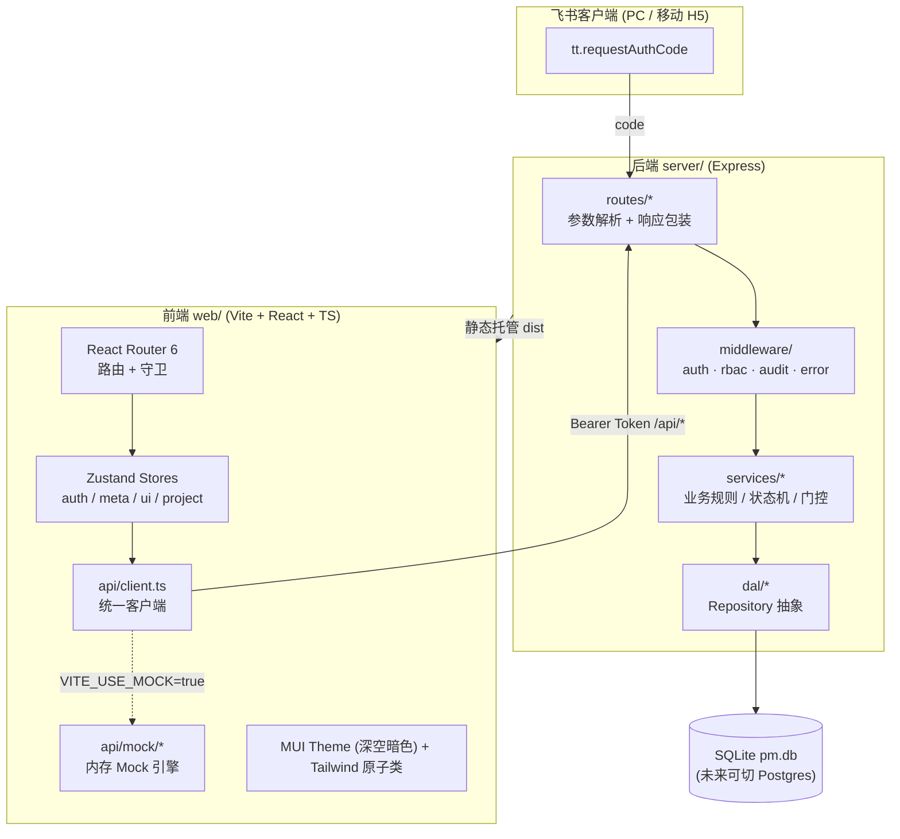
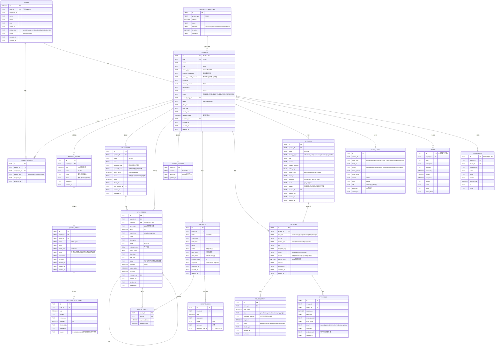
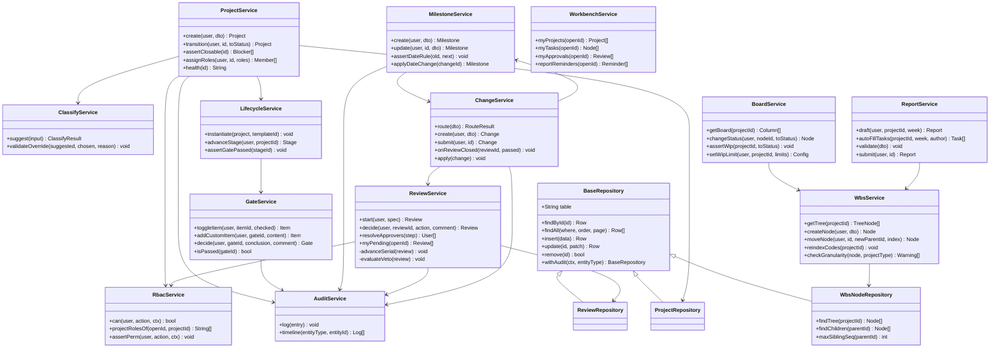
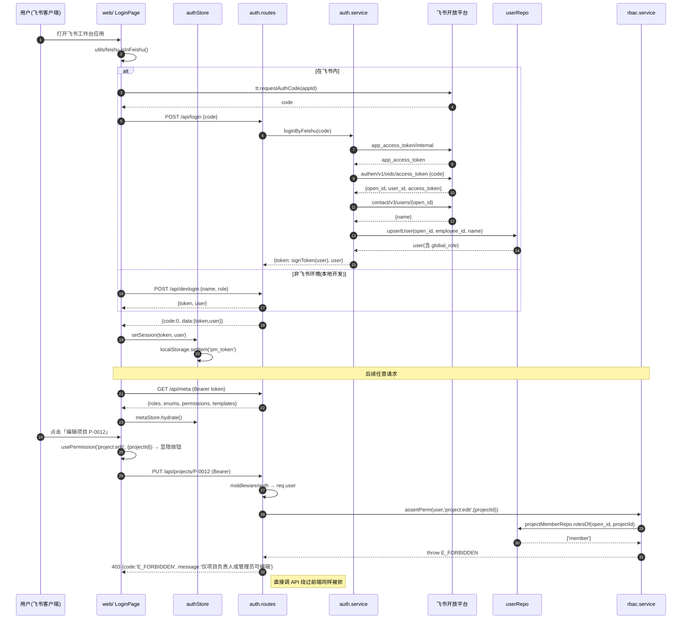
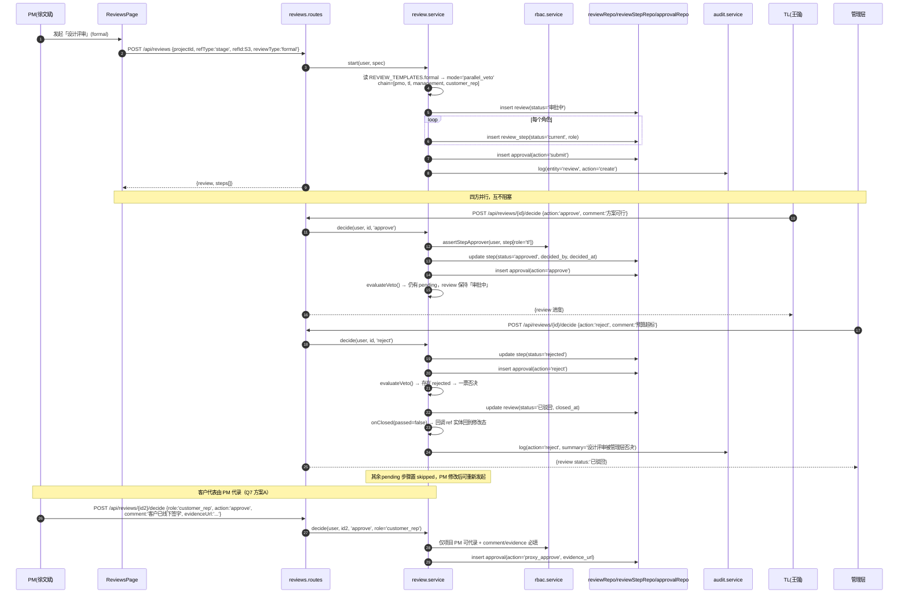
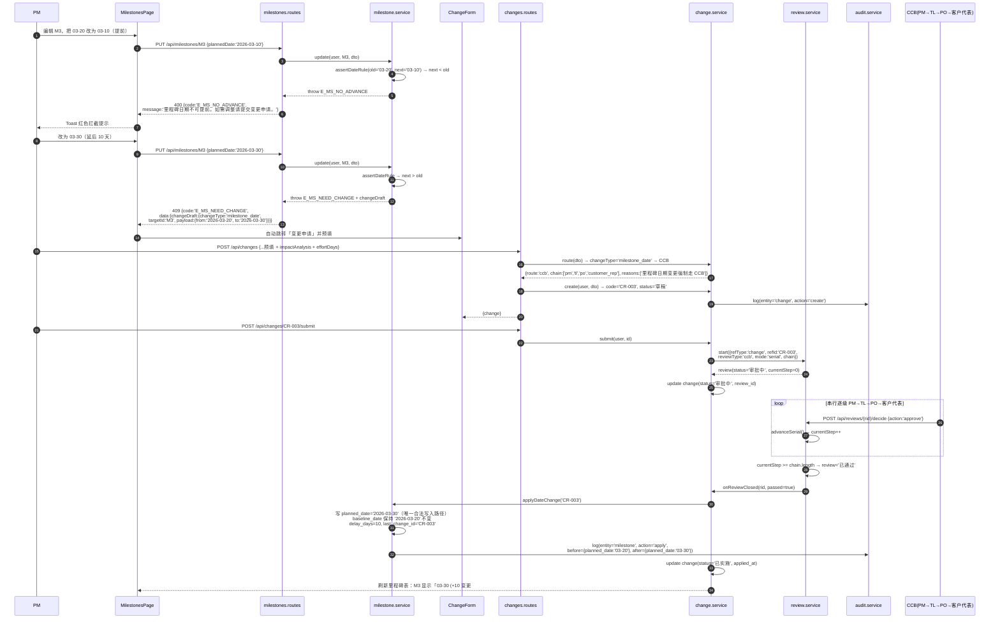
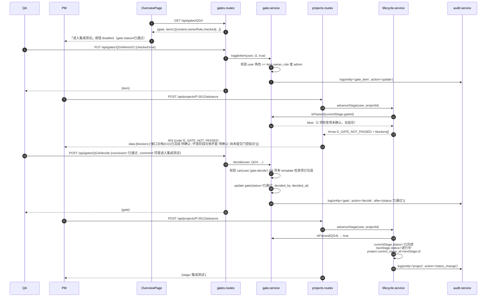
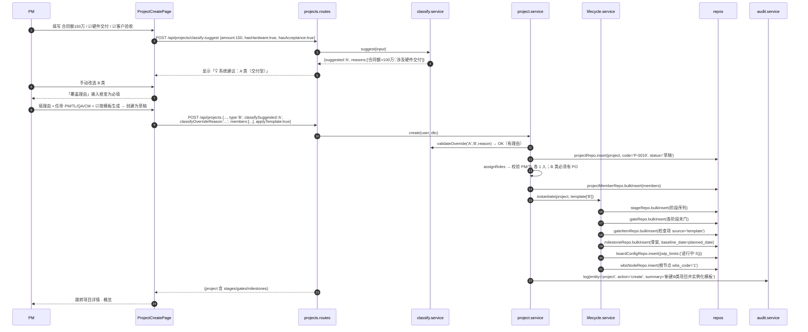
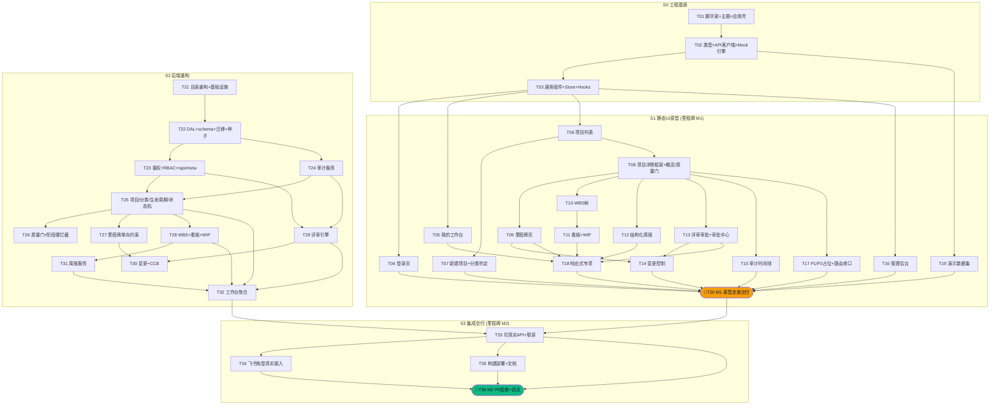

# 太空字节项目管理系统 · 架构设计 v1.0

| 项 | 内容 |
|---|---|
| 文档版本 | v1.0 |
| 撰写人 | 高见远（架构师） |
| 日期 | 2026-02 |
| 上游输入 | `docs/PRD-重构v1.md`（许清楚 v1.0）+ 现有 `pm-app` 代码库 |
| Project Name | `astrbytes_pm_system` |
| 覆盖范围 | P0 全部 17 条；P1/P2 仅做**结构预留**（建表/预留路由/预留菜单） |
| 交付节奏 | **S0 工程基座 → S1 静态 UI 原型（mock，不依赖后端）→ S2 后端重构 → S3 集成交付** |

> **锁定决策（硬约束，本设计全程遵循）**
> - **Q1** 前端 React + Vite + MUI + Tailwind；后端 Node/Express + better-sqlite3 保留，复用现有 API 契约/鉴权/RBAC/审批链
> - **Q2** 一期 = P0 共 17 条
> - **Q3** 飞书一期仅 H5 免登 + 身份绑定 + 权限
> - **Q4** 桌面优先，移动端只做「看项目 / 审批 / 改任务状态 / 填周报」四件事
> - **Q5** `pm.db` 无真实业务数据 → **自由重设计 schema**；`db.js` 抽象为 **DAL 层**，预留 Postgres 切换

---

## 一、实现方案与框架选型

### 1.1 核心技术难点与对策

| # | 难点 | 本质问题 | 对策 |
|---|---|---|---|
| D1 | **制度硬约束要"绕不过去"** | 前端禁用按钮≠约束，必须服务端裁决 | 所有门控/单向/RBAC 判定下沉到 `server/services/*`，路由层只做参数解析；前端仅做显隐提示 |
| D2 | **三类项目差异化生命周期** | A/B/C 阶段序列、质量门、里程碑骨架不同 | **模板驱动**：`lifecycle_templates` 存 JSON 定义，建项目时由 `lifecycle.service` **实例化**为 `project_stages` + `quality_gates` + `gate_checklist_items` + `milestones`。P1 模板中心只需改数据不改代码 |
| D3 | **tasks 扁平 → WBS 树** | 层级、编码连续性、粒度校验、看板双视图共用一份数据 | 单表 `wbs_nodes` 自引用（`parent_id` + `wbs_code` + `level`），服务端负责编码生成与重排；看板 = 同一批叶子节点按 `status` 分组 |
| D4 | **多形态评审/审批** | 串行链、并行一票否决、单人决议三种模式并存 | 抽象统一 **Review 引擎**（`reviews` + `review_steps` + `approvals`），`mode ∈ {serial, parallel_veto, single}`。现有 `/api/projects/:id/submit|approve|reject` 保留为该引擎的语法糖，**契约不破** |
| D5 | **里程碑只能延后** | 直接 UPDATE 会绕过约束 | `planned_date` 字段**只允许变更单驱动写入**；直接 PUT 提前→`E_MS_NO_ADVANCE`，延后→`E_MS_NEED_CHANGE` 并回传预填变更单草稿 |
| D6 | **全实体审计** | 手写 20 处 audit 调用必然遗漏 | DAL 层 `withAudit()` 装饰器 + 服务层统一 `auditCtx`，写操作自动落 before/after diff |
| D7 | **静态原型先行** | 前端不能等后端 | `src/api/client.ts` 双实现：`VITE_USE_MOCK=true` 走内存 Mock（同签名、带延迟、可写），`false` 走 HTTP。**页面代码零改动切换** |
| D8 | **MUI + Tailwind 共存** | 样式优先级打架、preflight 覆盖 MUI | 关闭 Tailwind `preflight`，`important: '#root'`；Tailwind 只用于布局/间距/响应式原子类，组件视觉全部走 MUI 主题 |
| D9 | **飞书内嵌 375px** | 表格/树/看板在窄屏不可用 | 响应式降级策略统一封装：`<ResponsiveTable>`（表格→卡片流）、看板→单列+状态 Tab 横滑、WBS→两级折叠、主操作固定底部 |

### 1.2 总体架构



### 1.3 前端选型

| 关注点 | 选型 | 理由 |
|---|---|---|
| 构建 | **Vite 5** + TypeScript 5 | 秒级冷启动；TS 保证 20+ 实体的类型安全 |
| UI 组件 | **MUI 5**（`@mui/material` + `@mui/icons-material`） | 深色主题能力强、表单/表格/对话框齐全、无障碍好 |
| 原子样式 | **Tailwind CSS 3** | 布局与响应式断点效率高，与 MUI 分工明确（见 D8） |
| 路由 | **React Router 6**（`createBrowserRouter` + 嵌套路由 + `loader` 不用，仅做守卫） | 项目详情天然嵌套，Tab 即子路由，URL 可分享 |
| 状态管理 | **Zustand**（分域 store） | 比 Context 少重渲染、比 Redux 少样板；store 可直接被 Mock 数据 seed，契合原型先行 |
| 服务端数据 | **自研 `useResource` hook**（基于 client + store 缓存） | 一期不引入 TanStack Query，降低复杂度（见「待明确事项 O1」） |
| 表单校验 | **react-hook-form + zod** | 周报风险行「owner/due 必填」、变更单、质量门结论等强校验场景多 |
| 拖拽 | **@dnd-kit/core + @dnd-kit/sortable** | 看板拖拽；react-beautiful-dnd 已停维护 |
| 树 | **@mui/x-tree-view**（MIT 社区版） | WBS 树、折叠、缩进开箱即用 |
| 日期 | **dayjs** + **@mui/x-date-pickers** | 里程碑/周报周次/截止日 |
| 图表 | **recharts**（P1 度量看板；一期只装不用或延后装） | 轻量、暗色适配简单 |
| 通知 | **notistack** | 门控拦截、WIP 超限等即时提示 |

### 1.4 后端选型与目录调整

- **保留**：Express 4、better-sqlite3、HMAC 无状态令牌、飞书 OIDC 换身份流程、`APPROVAL_TEMPLATES` 串行链思想。
- **调整**：单文件 `server.js`（515 行，将膨胀到 3000+）拆为 **routes / services / dal / middleware / config** 五层。
- **DAL 抽象（Q5 核心）**：
  ```
  dal/index.js        → 导出 { repos, tx, raw }
  dal/connection.js   → 驱动隔离层（当前 better-sqlite3；换 pg 只改此文件 + sql 方言）
  dal/base.repo.js    → findById/findAll/insert/update/remove/paginate + withAudit
  dal/*.repo.js       → 每个实体一个 Repository，业务层不写 SQL
  ```
  服务层**不允许**出现 `db.prepare(...)`，这是切换 Postgres 的唯一保障。
- **根 `server.js` 保留**为 4 行 bootstrap（`require('./server')`），**`render.yaml` 的 `node server.js` 不用改**。

### 1.5 构建与本地运行

```bash
# ── 开发（两个终端）────────────────────────────
cd pm-app && npm i && npm run dev:server     # Express :3000
cd pm-app/web && npm i && npm run dev        # Vite  :5173（proxy /api → :3000）

# ── S1 静态原型阶段（不依赖后端，单终端即可）──
cd pm-app/web && VITE_USE_MOCK=true npm run dev

# ── 生产构建 ─────────────────────────────────
cd pm-app/web && npm run build               # 输出到 ../public
cd pm-app && npm start                       # Express 托管 public + /api
```

| 环境变量 | 位置 | 说明 |
|---|---|---|
| `VITE_USE_MOCK` | `web/.env.*` | `true`=走内存 Mock（S1 阶段默认） |
| `VITE_API_BASE` | `web/.env.*` | 默认 `/api` |
| `FEISHU_APP_ID/SECRET`、`SESSION_SECRET`、`DB_PATH`、`ADMIN_OPEN_IDS` | `pm-app/.env` | **沿用现有 config.js，不变** |

---

## 二、文件列表（相对 `pm-app/`）

> 标记：🆕 新增 ｜ ♻️ 复用改造 ｜ 📦 归档

### 2.1 仓库总体结构

```
pm-app/
├── server.js                     ♻️ 收敛为 bootstrap（require('./server')）
├── package.json                  ♻️ 增加 dev:server / build / postinstall 脚本
├── render.yaml                   ♻️ 构建命令追加 web 构建
├── .env / .env.example           ♻️ 不变
├── pm.db                         ♻️ 重建（Q5：无真实数据）
├── legacy/
│   └── index.html                📦 原 public/index.html 归档，仅供交互参考
├── public/                       🆕 Vite 构建产物目录（.gitignore）
├── docs/
│   ├── PRD-重构v1.md
│   ├── 架构设计-重构v1.md         🆕 本文档
│   ├── class-diagram.mermaid      🆕
│   └── sequence-diagram.mermaid   🆕
├── server/  … 见 2.2
└── web/     … 见 2.3
```

### 2.2 后端 `server/`

| 路径 | 状态 | 职责 | 关联 PRD |
|---|---|---|---|
| `server/index.js` | 🆕 | 启动监听、优雅退出 | — |
| `server/app.js` | 🆕 | Express 装配：json/静态/路由挂载/错误兜底 | — |
| `server/config/index.js` | ♻️ | 由 `config.js` 迁入（PORT/飞书/密钥/DB_PATH/ADMIN_OPEN_IDS） | — |
| `server/config/roles.js` | ♻️ | `GLOBAL_ROLES`（增 cm/po）+ `PROJECT_ROLES` | P0-10 |
| `server/config/permissions.js` | 🆕 | 权限矩阵 `action → {global[], project[]}` | P0-10 |
| `server/config/approval-templates.js` | ♻️ | 由 `APPROVAL_TEMPLATES` 扩展为 `REVIEW_TEMPLATES`（formal/technical/code/ccb/project） | P0-09 P0-14 |
| `server/config/lifecycle/typeA.json` | 🆕 | A 类：6 阶段 + QG1~QG6 + 检查项 + M1~M7 骨架 + 文档清单 | P0-02 P0-03 P0-05 |
| `server/config/lifecycle/typeB.json` | 🆕 | B 类：Sprint 循环 5 阶段 + 发布门 | P0-02 |
| `server/config/lifecycle/typeC.json` | 🆕 | C 类：5 阶段 + 门 | P0-02 |
| `server/config/enums.js` | 🆕 | 全部状态枚举（项目/阶段/门/里程碑/节点/评审/变更） | 全局 |
| `server/lib/response.js` | 🆕 | `ok(data)` / `fail(code,msg)` 统一封装 | — |
| `server/lib/errors.js` | 🆕 | `AppError` + 错误码常量表 | — |
| `server/lib/token.js` | ♻️ | `signToken/verifyToken`（原样迁入） | P0-11 |
| `server/lib/feishu.js` | ♻️ | `getAppAccessToken/code2session/getUserName`（原样迁入） | P0-11 |
| `server/lib/id.js` | 🆕 | 前缀 ID 生成（P/M/W/G/R/CR/AL…）+ 项目内序号 | — |
| `server/lib/wbs.js` | 🆕 | `wbs_code` 生成/重排/校验纯函数 | P0-06 |
| `server/lib/logger.js` | 🆕 | 请求 ID + 结构化日志 | — |
| `server/middleware/auth.js` | ♻️ | Bearer 校验 → `req.user`（原样迁入） | P0-11 |
| `server/middleware/rbac.js` | 🆕 | `requirePerm(action, resolver)` | P0-10 |
| `server/middleware/audit.js` | 🆕 | 挂 `req.auditCtx`，响应后 flush | P0-15 |
| `server/middleware/error.js` | 🆕 | 统一异常 → `{code,message}` | — |
| `server/dal/connection.js` | 🆕 | 驱动隔离（better-sqlite3；WAL；foreign_keys） | Q5 |
| `server/dal/schema.sql` | 🆕 | 全量建表 DDL（见第三章） | Q5 |
| `server/dal/migrate.js` | 🆕 | 版本化迁移（`schema_migrations` 表） | Q5 |
| `server/dal/seed.js` | 🆕 | 生命周期模板 + 演示数据种子 | — |
| `server/dal/base.repo.js` | 🆕 | 通用 CRUD + 分页 + `withAudit` | P0-15 |
| `server/dal/{user,project,projectMember,stage,gate,gateItem,milestone,wbsNode,boardConfig,report,reportTask,reportRisk,review,reviewStep,approval,change,auditLog,risk,document}.repo.js` | 🆕 | 19 个 Repository | 全局 |
| `server/services/auth.service.js` | ♻️ | 飞书免登 / 开发登录 / upsertUser | P0-11 |
| `server/services/rbac.service.js` | 🆕 | `can(user, action, ctx)`；项目角色解析 | P0-10 |
| `server/services/user.service.js` | ♻️ | 角色分配 + 两条守卫 | P0-12 |
| `server/services/classify.service.js` | 🆕 | A/B/C 自动判定规则引擎 + 覆盖理由校验 | P0-01 |
| `server/services/lifecycle.service.js` | 🆕 | 模板实例化 + 阶段推进（含门控前置校验） | P0-02 |
| `server/services/gate.service.js` | 🆕 | 检查项勾选 / 门结论 / 硬拦截 | P0-03 |
| `server/services/project.service.js` | ♻️ | 项目 CRUD + 状态机 + 结项校验 + 项目角色任命 | P0-04 P0-17 |
| `server/services/milestone.service.js` | ♻️ | 单向约束 + 基线 + 变更驱动更新 | P0-05 |
| `server/services/wbs.service.js` | 🆕 | 树 CRUD / 编码 / 粒度校验 / 移动 | P0-06 |
| `server/services/board.service.js` | 🆕 | 列聚合 + WIP 限制 + 状态流转 | P0-07 |
| `server/services/report.service.js` | ♻️ | 四段校验 + 关联任务自动带出 + 快照冻结 | P0-08 |
| `server/services/review.service.js` | ♻️ | Review 引擎（serial / parallel_veto / single） | P0-09 |
| `server/services/change.service.js` | 🆕 | 路由判定（PM vs CCB）+ 批准后应用 | P0-14 |
| `server/services/audit.service.js` | 🆕 | 写日志 + 实体时间线查询 | P0-15 |
| `server/services/workbench.service.js` | 🆕 | 我的待办/待审批/周报提醒聚合 | P0-13 |
| `server/routes/index.js` | 🆕 | 路由汇总挂载 | — |
| `server/routes/auth.routes.js` | ♻️ | `/api/login` `/api/devlogin` `/api/me` `/api/appid` | P0-11 |
| `server/routes/meta.routes.js` | ♻️ | `/api/meta`（角色/枚举/权限矩阵/模板）取代 `/api/approval-config` 并向下兼容 | P0-10 |
| `server/routes/users.routes.js` | ♻️ | `/api/users`、`PUT /api/users/:id/role` | P0-12 |
| `server/routes/projects.routes.js` | ♻️ | 项目 CRUD + `/classify-suggest` + `/members` + `/stages` + `/advance` + `/close` | P0-01/02/04/17 |
| `server/routes/gates.routes.js` | 🆕 | 质量门与检查项 | P0-03 |
| `server/routes/milestones.routes.js` | ♻️ | 里程碑 CRUD（含拦截） | P0-05 |
| `server/routes/wbs.routes.js` | ♻️ | 由 `/api/tasks` 升级为 `/api/wbs`，保留 `/api/tasks` 兼容别名 | P0-06 P0-07 |
| `server/routes/board.routes.js` | 🆕 | 看板视图与 WIP 配置 | P0-07 |
| `server/routes/reports.routes.js` | ♻️ | 周报 CRUD + 提交 | P0-08 |
| `server/routes/reviews.routes.js` | ♻️ | 评审引擎；兼容 `/api/projects/:id/{submit,approve,reject,approval}` | P0-09 |
| `server/routes/changes.routes.js` | 🆕 | 变更单 | P0-14 |
| `server/routes/audit.routes.js` | 🆕 | 审计日志查询 | P0-15 |
| `server/routes/workbench.routes.js` | 🆕 | `/api/workbench`、`/api/dashboard`（兼容） | P0-13 |

### 2.3 前端 `web/`

```
web/
├── index.html                                🆕 挂 #root + 飞书 JSSDK
├── vite.config.ts                            🆕 proxy /api、outDir ../public、alias @
├── tailwind.config.ts                        🆕 preflight:false、important:'#root'、深空色板
├── postcss.config.js / tsconfig.json / .eslintrc.cjs / .prettierrc   🆕
├── .env.development / .env.production        🆕
└── src/
    ├── main.tsx                              🆕 Provider 装配
    ├── App.tsx                               🆕 RouterProvider
    ├── vite-env.d.ts                         🆕
    ├── styles/index.css                      🆕 Tailwind 指令 + 全局滚动条/字体
    ├── theme/tokens.ts                       🆕 深空 token（单一真源）
    ├── theme/muiTheme.ts                     🆕 createTheme(dark) 映射 token
    ├── config/enums.ts                       🆕 状态枚举与中文映射
    ├── config/permissions.ts                 🆕 前端权限镜像（仅显隐，运行时以 /api/meta 为准）
    ├── config/routes.ts                      🆕 路由常量 + 菜单定义
    ├── types/                                🆕 index.ts / project.ts / wbs.ts / review.ts / change.ts / report.ts / api.ts
    ├── api/
    │   ├── client.ts                         🆕 fetch 封装 + Bearer + 解包 + 错误码 → 中文
    │   ├── index.ts                          🆕 按 VITE_USE_MOCK 选实现
    │   ├── endpoints/{auth,meta,users,projects,gates,milestones,wbs,board,reports,reviews,changes,audit,workbench}.ts  🆕
    │   └── mock/{db.ts,handlers.ts,fixtures/*.ts,delay.ts}   🆕 内存 Mock 引擎 + 演示数据集
    ├── stores/{authStore,metaStore,uiStore,projectStore}.ts  🆕
    ├── hooks/{useResource,usePermission,useResponsive,useProject,useConfirm,useToast}.ts  🆕
    ├── layouts/{AppShell,SideNav,TopBar,MobileTabBar,ProjectLayout,ProjectTabs}.tsx  🆕
    ├── components/
    │   ├── common/{PageHeader,StatusChip,EmptyState,LoadingBlock,ConfirmDialog,ResponsiveTable,DataCard,ProgressBar,UserPicker,DateField,FormDrawer,PermissionGate}.tsx 🆕
    │   ├── project/{ProjectCard,ProjectFilters,ClassifyWizard,RoleAssignPanel,HealthDot,StatusFlow}.tsx 🆕
    │   ├── lifecycle/{StageStepper,GatePanel,GateChecklist,GateDecisionForm,AdvanceStageButton}.tsx 🆕
    │   ├── milestone/{MilestoneTable,MilestoneForm,BaselineDiff}.tsx 🆕
    │   ├── wbs/{WbsTree,WbsNodeRow,WbsNodeForm,GranularityWarning}.tsx 🆕
    │   ├── board/{KanbanBoard,KanbanColumn,TaskCard,WipBadge,TaskDrawer}.tsx 🆕
    │   ├── report/{WeeklyReportForm,SectionDone,SectionPlan,SectionRisks,SectionResource,ReportHistory}.tsx 🆕
    │   ├── review/{ReviewList,ReviewChain,ReviewStepItem,ReviewDecisionDialog,ReviewTypeBadge}.tsx 🆕
    │   ├── change/{ChangeList,ChangeForm,RouteHint,ChangeDetail}.tsx 🆕
    │   └── audit/{AuditTimeline,AuditDiff}.tsx 🆕
    ├── pages/
    │   ├── LoginPage.tsx                     🆕 P0-11
    │   ├── WorkbenchPage.tsx                 🆕 P0-13
    │   ├── ProjectListPage.tsx               🆕 P0-04
    │   ├── ProjectCreatePage.tsx             🆕 P0-01
    │   ├── project/{OverviewPage,MilestonesPage,WbsPage,BoardPage,ReportsPage,ReviewsPage,ChangesPage,AuditPage,RisksPage(P1),DocumentsPage(P1)}.tsx 🆕
    │   ├── ApprovalCenterPage.tsx            🆕 P0-09/13
    │   ├── MetricsPage.tsx                   🆕 P1 占位
    │   ├── admin/{UsersPage,AuditLogPage,TemplatesPage(P1)}.tsx 🆕 P0-12/15
    │   └── NotFoundPage.tsx                  🆕
    ├── router/{index.tsx,AuthGuard.tsx,RoleGuard.tsx}  🆕
    └── utils/{date.ts,format.ts,wbs.ts,download.ts,feishu.ts}  🆕
```

---

## 三、数据结构与接口

### 3.1 数据库 ER 图（重设计后 schema）



**索引清单**（`schema.sql` 尾部）

```sql
CREATE INDEX idx_pm_project      ON project_members(project_id);
CREATE INDEX idx_pm_user         ON project_members(user_open_id);
CREATE INDEX idx_stage_project   ON project_stages(project_id, seq);
CREATE INDEX idx_gate_project    ON quality_gates(project_id);
CREATE INDEX idx_gate_stage      ON quality_gates(stage_id);
CREATE INDEX idx_item_gate       ON gate_checklist_items(gate_id, seq);
CREATE INDEX idx_ms_project      ON milestones(project_id, planned_date);
CREATE INDEX idx_wbs_project     ON wbs_nodes(project_id, wbs_code);
CREATE INDEX idx_wbs_parent      ON wbs_nodes(parent_id);
CREATE INDEX idx_wbs_owner       ON wbs_nodes(owner, status);
CREATE INDEX idx_report_project  ON reports(project_id, week);
CREATE INDEX idx_review_project  ON reviews(project_id, status);
CREATE INDEX idx_step_review     ON review_steps(review_id, step_index);
CREATE INDEX idx_step_assignee   ON review_steps(assignee_open_id, status);
CREATE INDEX idx_change_project  ON changes(project_id, status);
CREATE INDEX idx_audit_entity    ON audit_logs(entity_type, entity_id, created_at);
CREATE UNIQUE INDEX uq_report    ON reports(project_id, week, author);
CREATE UNIQUE INDEX uq_wbs_code  ON wbs_nodes(project_id, wbs_code);
CREATE UNIQUE INDEX uq_member    ON project_members(project_id, user_open_id, project_role);
```

### 3.2 服务层类图



### 3.3 API 清单

> 全部返回 `{ code, data, message }`；错误同时置 HTTP 状态码。`♻️` = 现有契约保留。

| 方法 | 路径 | 说明 | 权限 | PRD |
|---|---|---|---|---|
| POST | `/api/login` ♻️ | 飞书 code 换会话 | 公开 | P0-11 |
| POST | `/api/devlogin` ♻️ | 开发登录 | 公开 | P0-11 |
| GET | `/api/me` ♻️ | 当前用户（含全局角色 + 项目角色映射） | 登录 | P0-10 |
| GET | `/api/appid` ♻️ | 飞书 AppId | 公开 | P0-11 |
| GET | `/api/meta` 🆕 | 枚举/角色/权限矩阵/评审模板/生命周期模板 | 登录 | P0-10 |
| GET | `/api/approval-config` ♻️ | 兼容别名 → meta 子集 | 登录 | P0-09 |
| GET | `/api/users` ♻️ | 用户列表（支持 `?role=`） | 登录 | P0-12 |
| PUT | `/api/users/:id/role` ♻️ | 分配全局角色（两条守卫） | admin | P0-12 |
| GET | `/api/workbench` 🆕 | 我的项目/待办/待审批/周报提醒 | 登录 | P0-13 |
| GET | `/api/dashboard` ♻️ | 聚合统计 | 登录 | P0-13 |
| POST | `/api/projects/classify-suggest` 🆕 | 分类建议（纯计算，不落库） | 登录 | P0-01 |
| GET/POST | `/api/projects` ♻️ | 列表（筛选/分页）/ 新建（含模板实例化） | 登录 | P0-01/04 |
| GET/PUT/DELETE | `/api/projects/:id` ♻️ | 详情 / 编辑 / 删除 | RBAC | P0-04 |
| GET/PUT | `/api/projects/:id/members` 🆕 | 项目角色查询 / 任命 | `project:member:assign` | P0-04/10 |
| GET | `/api/projects/:id/stages` 🆕 | 阶段 + 门状态 | 登录 | P0-02 |
| POST | `/api/projects/:id/advance` 🆕 | 推进到下一阶段（门未过 403） | `stage:advance` | P0-02/03 |
| POST | `/api/projects/:id/transition` 🆕 | 状态机流转（挂起/恢复/终止） | `project:transition` | P0-17 |
| GET | `/api/projects/:id/close-check` 🆕 | 结项阻塞项清单 | 登录 | P0-17 |
| POST | `/api/projects/:id/close` 🆕 | 结项（校验后转只读归档） | `project:close` | P0-17 |
| GET | `/api/gates?projectId=` 🆕 | 门列表 | 登录 | P0-03 |
| GET | `/api/gates/:id` 🆕 | 门详情 + 检查项 | 登录 | P0-03 |
| PUT | `/api/gates/:id/items/:itemId` 🆕 | 勾选/取消检查项 | 检查项 owner_role | P0-03 |
| POST | `/api/gates/:id/items` 🆕 | 追加项目专属检查项（模板项不可删） | `gate:item:add` | P0-03 |
| POST | `/api/gates/:id/decide` 🆕 | 提交门控结论 | `gate:decide`(qa/tl/pmo) | P0-03 |
| GET/POST | `/api/milestones` ♻️ | 列表 / 新建（写入 baseline_date） | RBAC | P0-05 |
| PUT/DELETE | `/api/milestones/:id` ♻️ | 编辑（含单向拦截）/ 删除 | RBAC | P0-05 |
| GET | `/api/wbs?projectId=` 🆕 | WBS 树（嵌套） | 登录 | P0-06 |
| POST | `/api/wbs` 🆕 | 新建节点（自动编码 + 粒度校验） | `wbs:edit` | P0-06 |
| PUT/DELETE | `/api/wbs/:id` 🆕 | 编辑 / 删除（有子节点需级联确认） | RBAC | P0-06 |
| POST | `/api/wbs/:id/move` 🆕 | 移动并重排编码 | `wbs:edit` | P0-06 |
| GET/PUT | `/api/tasks`、`/api/tasks/:id` ♻️ | 兼容别名（扁平视图） | RBAC | P0-06 |
| GET | `/api/board?projectId=` 🆕 | 看板四列 + WIP 配置 | 登录 | P0-07 |
| POST | `/api/board/move` 🆕 | 拖拽改状态（WIP 超限 409） | `task:status` | P0-07 |
| PUT | `/api/board/config` 🆕 | 设置 WIP 上限 | `board:config`(pm/tl) | P0-07 |
| GET | `/api/reports?projectId=&week=` ♻️ | 周报列表/历史 | 登录 | P0-08 |
| GET | `/api/reports/draft?projectId=&week=` 🆕 | 取草稿 + 自动带出本周任务 | 登录 | P0-08 |
| POST/PUT | `/api/reports`、`/api/reports/:id` ♻️ | 保存草稿 | 作者 | P0-08 |
| POST | `/api/reports/:id/submit` 🆕 | 提交（四段校验 + 快照冻结） | 作者 | P0-08 |
| GET | `/api/reviews?projectId=&status=&mine=` 🆕 | 评审列表 / 我的待审 | 登录 | P0-09 |
| POST | `/api/reviews` 🆕 | 发起评审（formal/technical/code/ccb） | `review:start` | P0-09 |
| GET | `/api/reviews/:id` 🆕 | 评审详情（步骤 + 留痕） | 登录 | P0-09 |
| POST | `/api/reviews/:id/decide` 🆕 | 通过/否决（含客户代表代录） | 步骤角色/admin | P0-09 |
| GET | `/api/projects/:id/approval` ♻️ | 兼容：项目立项审批视图 | 登录 | P0-09 |
| POST | `/api/projects/:id/{submit,approve,reject}` ♻️ | 兼容：转发到 Review 引擎 | RBAC | P0-09 |
| GET/POST | `/api/changes` 🆕 | 变更清单 / 新建（自动路由判定） | 登录 / `change:create` | P0-14 |
| GET | `/api/changes/:id` 🆕 | 变更详情 | 登录 | P0-14 |
| POST | `/api/changes/:id/submit` 🆕 | 提交审批（拉起 PM 或 CCB） | 创建人/PM | P0-14 |
| GET | `/api/audit?entityType=&entityId=` 🆕 | 实体变更历史时间线 | 登录 | P0-15 |
| GET | `/api/audit/logs` 🆕 | 全局审计（分页/筛选） | admin/pmo | P0-15 |

### 3.4 关键业务规则（服务端强制）

| 规则 | 实现位置 | 触发结果 |
|---|---|---|
| 分类建议：`合同额>100万 或 含硬件交付 或 有客户验收` → A；`自研迭代` → B；`基建施工` → C；冲突时优先级 A>C>B | `classify.service.suggest()` | 返回 `{suggested, reasons[]}` |
| 覆盖建议须填理由 | `classify.service.validateOverride()` | `E_CLASSIFY_REASON_REQUIRED` |
| B 类未指定 PO 不允许提交立项 | `project.service.transition()` | `E_PROJECT_PO_REQUIRED` |
| 每项目 PM/TL 有且仅有 1 人 | `project.service.assignRoles()` | `E_ROLE_CARDINALITY` |
| 阶段只能顺序推进；当前阶段门 ∉ {已通过, 有条件通过} 不得推进 | `lifecycle.service.advanceStage()` | `E_GATE_NOT_PASSED`（含未完成检查项清单） |
| 里程碑 `planned_date` 提前 | `milestone.service.assertDateRule()` | `E_MS_NO_ADVANCE` |
| 里程碑 `planned_date` 延后 | 同上 | `E_MS_NEED_CHANGE` + `data.changeDraft` |
| `baseline_date` 任何路径都不可写 | Repository 白名单字段 | 静默丢弃 + 审计告警 |
| WBS 叶子节点必须有 owner 与 estimate_days | `wbs.service.createNode/update` | `E_WBS_LEAF_INCOMPLETE` |
| 粒度告警：A 类 >5 人日、B 类 >2 人日 | `wbs.service.checkGranularity()` | 非阻塞 `warnings[]` |
| WIP 超限 | `board.service.assertWip()` | HTTP 409 `E_WIP_EXCEEDED` |
| 周报风险条目缺 owner/due | `report.service.validate()` | `E_REPORT_RISK_INCOMPLETE`（含行号） |
| 周报提交后进度冻结为 snapshot | `report.service.submit()` | 写 `snapshot` + `report_tasks.progress_after` |
| 正式评审一票否决 | `review.service.evaluateVeto()` | 任一 `rejected` → review `已驳回`，ref 实体回退到修改态 |
| 技术评审仅 TL 决议 | `review_steps.role='tl'` + `mode='single'` | 非 TL → `E_NOT_APPROVER` |
| 变更路由：`change_type ∈ {milestone_date, requirement_baseline}` 或 `effort_days ≥ 3` → CCB(pm→tl→po→customer_rep)，否则 pm_only | `change.service.route()` | 返回 `{route, chain[], reasons[]}` |
| 变更批准后自动应用 | `change.service.onReviewClosed()` | 里程碑 `planned_date` 更新 + `last_change_id` 记录 |
| 客户代表代录 | `review.service.decide()` role=`customer_rep` | 仅项目 PM 可代录，`comment` 或 `evidence_url` 必填，`action='proxy_approve'` |
| 结项校验 | `project.service.assertClosable()` | 返回阻塞项：未过门 / 未完成里程碑 / 审批中变更 |
| 结项后只读 | `middleware/rbac` 前置：`project.status='已结项'` 拒绝所有写 | `E_PROJECT_ARCHIVED` |
| 不能改自己角色 / 不能降级最后一名管理员 | `user.service`（♻️ 原逻辑迁移） | `E_SELF_ROLE` / `E_LAST_ADMIN` |

---

## 四、程序调用流程（时序图）

### 4.1 流程一：飞书免登 + RBAC 判定（P0-10 / P0-11）



### 4.2 流程二：正式评审（并行一票否决）+ 客户代表代录（P0-09）



### 4.3 流程三：里程碑延后 → 变更单 → CCB → 应用（P0-05 / P0-14）



### 4.4 流程四：质量门门控 + 阶段推进硬拦截（P0-03 / P0-02）



### 4.5 流程五：新建项目（分类判定 + 模板实例化）（P0-01 / P0-02 / P0-04）



---

## 五、任务列表

> **交付节奏**：S0 工程基座 → **S1 静态 UI 原型（里程碑 M1，可点击 Demo，零后端依赖）** → S2 后端重构 → S3 集成交付（里程碑 M2）。
> **列说明**：`端` = FE(前端) / BE(后端) / FS(全栈)；`P` = 优先级。

### 5.1 阶段 S0 · 工程基座（3 个任务）

| ID | 任务名 | PRD | 依赖 | 端 | P | 产出文件 | 完成判定 |
|---|---|---|---|---|---|---|---|
| **T01** | 前端脚手架 + 深空主题 + 应用壳 | P0-16 | — | FE | P0 | `web/package.json`、`vite.config.ts`、`tailwind.config.ts`、`postcss.config.js`、`tsconfig.json`、`index.html`、`src/main.tsx`、`src/App.tsx`、`src/styles/index.css`、`src/theme/tokens.ts`、`src/theme/muiTheme.ts`、`src/layouts/{AppShell,SideNav,TopBar,MobileTabBar}.tsx`、`src/router/index.tsx` | `npm run dev` 出现左导航+顶栏空壳；背景 `#0B1020`、卡片 `#141A2E` 生效；Tailwind 与 MUI 无样式冲突；375px 下侧栏折叠为底部 Tab |
| **T02** | 类型系统 + API 客户端 + Mock 引擎 | 全局 | T01 | FE | P0 | `src/types/*.ts`（19 实体）、`src/api/client.ts`、`src/api/index.ts`、`src/api/endpoints/*.ts`、`src/api/mock/{db.ts,handlers.ts,delay.ts}`、`src/api/mock/fixtures/*.ts`、`src/config/enums.ts` | `VITE_USE_MOCK=true` 时全部 endpoint 可读写内存数据并持久到 sessionStorage；切 `false` 后同签名走 HTTP，页面代码零改动 |
| **T03** | 通用组件库 + Store + Hooks | P0-10/16 | T01,T02 | FE | P0 | `src/components/common/*.tsx`（13 个）、`src/stores/{authStore,metaStore,uiStore,projectStore}.ts`、`src/hooks/*.ts`、`src/config/permissions.ts`、`src/router/{AuthGuard,RoleGuard}.tsx` | `ResponsiveTable` 在 <768px 自动降级为卡片流；`PermissionGate` 可按 action 控制显隐；Storybook 或 `/__kitchen-sink` 演示页可预览全部组件 |

### 5.2 阶段 S1 · 静态 UI 原型（15 个任务，里程碑 M1）

> 全部基于 Mock 数据，可完整点击导航，**不依赖后端**。这是给用户看的第一版可交付物。

| ID | 任务名 | PRD | 依赖 | 端 | P | 产出文件 | 完成判定 |
|---|---|---|---|---|---|---|---|
| **T04** | 登录页（飞书免登占位 + 开发登录） | P0-11 | T03 | FE | P0 | `src/pages/LoginPage.tsx`、`src/utils/feishu.ts`、`src/api/endpoints/auth.ts` | 非飞书环境展示开发登录表单（姓名+角色下拉）；飞书环境展示「免登中…」；登录后写 authStore 并跳工作台 |
| **T05** | 我的工作台（首页） | P0-13 | T03 | FE | P0 | `src/pages/WorkbenchPage.tsx`、`components/project/{ProjectCard,HealthDot}.tsx`、`components/common/DataCard.tsx` | 三张统计卡（待我审批/逾期任务/周报未填）+ 我负责的项目卡片列表 + 待我审批列表；点击任一条目路由跳转正确；无数据展示 EmptyState |
| **T06** | 项目列表 + 筛选 | P0-04 | T03 | FE | P0 | `src/pages/ProjectListPage.tsx`、`components/project/{ProjectFilters,StatusFlow}.tsx` | 类型/状态/负责人三个筛选 + 搜索；健康度红黄绿灯；375px 下表格降级为卡片；表头排序可用 |
| **T07** | 新建项目向导 + 分类自动判定 | P0-01 P0-04 | T06 | FE | P0 | `src/pages/ProjectCreatePage.tsx`、`components/project/{ClassifyWizard,RoleAssignPanel}.tsx` | 勾选条件实时显示「系统建议 X 类 + 依据」；手改类型后覆盖理由变必填；B 类未选 PO 提交按钮禁用并提示；模板勾选项存在 |
| **T08** | 项目详情框架 + 概览（阶段条 + 质量门） | P0-02 P0-03 P0-17 | T06 | FE | P0 | `src/layouts/{ProjectLayout,ProjectTabs}.tsx`、`src/pages/project/OverviewPage.tsx`、`components/lifecycle/{StageStepper,GatePanel,GateChecklist,GateDecisionForm,AdvanceStageButton}.tsx` | A/B/C 三类项目展示各自阶段序列；当前阶段高亮；门状态图标（✔/◉/○）正确；门未过时「进入下一阶段」按钮 disabled 且 Tooltip 列出阻塞项 |
| **T09** | 里程碑页（单向约束交互） | P0-05 | T08 | FE | P0 | `src/pages/project/MilestonesPage.tsx`、`components/milestone/{MilestoneTable,MilestoneForm,BaselineDiff}.tsx` | 表格含基线日期/当前日期/延后天数/状态；填入更早日期 → 红色拦截 Toast；填入更晚日期 → 跳转变更申请并预填 |
| **T10** | WBS 树视图 | P0-06 | T08 | FE | P0 | `src/pages/project/WbsPage.tsx`、`components/wbs/{WbsTree,WbsNodeRow,WbsNodeForm,GranularityWarning}.tsx`、`src/utils/wbs.ts` | 支持 3 层以上展开/折叠；编码 1.2.3 连续显示；A 类 >5 人日节点显示「⚠ 粒度超限，建议拆分」；叶子缺 owner/估算时行标黄；375px 下折叠为两级 |
| **T11** | 看板视图 + 拖拽 + WIP | P0-07 | T10 | FE | P0 | `src/pages/project/BoardPage.tsx`、`components/board/{KanbanBoard,KanbanColumn,TaskCard,WipBadge,TaskDrawer}.tsx` | 四列（待办/进行中/待评审/完成）；拖拽改状态并写 Mock；WIP=3 时拖入第 4 张被拦截并 Toast；逾期卡片红色高亮；移动端降级为单列 + 状态 Tab 横滑 |
| **T12** | 结构化周报表单 | P0-08 | T08 | FE | P0 | `src/pages/project/ReportsPage.tsx`、`components/report/{WeeklyReportForm,SectionDone,SectionPlan,SectionRisks,SectionResource,ReportHistory}.tsx` | 严格四段；①区自动带出本周关联任务及进度前后值；③区风险行缺 owner 或 due 时提交按钮禁用并高亮该行；可按周切换历史 |
| **T13** | 评审与审批页 + 审批中心 | P0-09 P0-13 | T08 | FE | P0 | `src/pages/project/ReviewsPage.tsx`、`src/pages/ApprovalCenterPage.tsx`、`components/review/{ReviewList,ReviewChain,ReviewStepItem,ReviewDecisionDialog,ReviewTypeBadge}.tsx` | 三类评审徽章区分；串行链与并行一票否决两种可视化；「⚠ 任一方否决 → 整体驳回」提示；决议弹窗含意见必填；审批中心汇总跨项目待办 |
| **T14** | 变更控制页 | P0-14 | T09,T13 | FE | P0 | `src/pages/project/ChangesPage.tsx`、`components/change/{ChangeList,ChangeForm,RouteHint,ChangeDetail}.tsx` | 填入工作量/类型实时显示「🔎 系统判定：… → 需走 CCB / 仅 PM 审批」；变更清单表格含编号/内容/工作量/路径/状态 |
| **T15** | 审计时间线组件 + 项目变更历史 | P0-15 | T08 | FE | P0 | `src/pages/project/AuditPage.tsx`、`components/audit/{AuditTimeline,AuditDiff}.tsx` | 任一实体详情页可打开「变更历史」抽屉；时间线展示 操作人/时间/动作/前后值 diff |
| **T16** | 管理后台（用户与角色 + 审计日志） | P0-12 P0-15 | T03 | FE | P0 | `src/pages/admin/{UsersPage,AuditLogPage,TemplatesPage}.tsx` | 用户表可改全局角色；改自己角色的行下拉 disabled；最后一名管理员降级时提示拦截；审计日志支持实体/操作人/时间筛选与分页；模板页为 P1 占位 |
| **T17** | P1/P2 占位页 + 路由收口 | P1-01/02/03 | T08 | FE | P1 | `src/pages/project/{RisksPage,DocumentsPage}.tsx`、`src/pages/MetricsPage.tsx`、`src/pages/NotFoundPage.tsx`、`src/config/routes.ts` | 菜单项存在但标注「二期」；点击展示占位说明而非 404；全部路由已注册，刷新任意深链不白屏 |
| **T18** | 移动端 / 飞书内嵌响应式专项 | P0-16 | T05,T09,T11,T12,T13 | FE | P0 | `src/hooks/useResponsive.ts`、`layouts/MobileTabBar.tsx`、各页面 `sm:` 断点补齐 | 375px 宽度下全站无横向滚动；「四件事」路径（看项目/审批/改任务状态/填周报）可完整走通；主操作固定底部安全区 |
| **T19** | 演示数据集完善 | 全 P0 | T02 | FE | P0 | `src/api/mock/fixtures/{users,projects,stages,gates,milestones,wbs,reports,reviews,changes,audit}.ts` | 至少 1 个 A 类（6 阶段/QG1~QG6/M1~M7/3 层 WBS）、1 个 B 类、1 个 C 类；含逾期任务、超 WIP、待审批、待填周报等边界样本 |
| **T20** | 🚩**里程碑 M1**：静态原型走查与交付评审 | 全 P0 | T04~T19 | FE | P0 | `docs/原型走查清单.md`、`web/README.md` | 按 PRD 17 条 P0 逐条走查界面覆盖度并出清单；`npm run build` 产物可静态托管演示；向用户/PM 演示通过 |

### 5.3 阶段 S2 · 后端重构（12 个任务）

| ID | 任务名 | PRD | 依赖 | 端 | P | 产出文件 | 完成判定 |
|---|---|---|---|---|---|---|---|
| **T21** | 后端目录重构 + 基础设施 | — | — | BE | P0 | `server.js`(收敛)、`server/{index,app}.js`、`server/config/{index,roles,enums,permissions,approval-templates}.js`、`server/lib/{response,errors,token,feishu,id,logger}.js`、`server/middleware/{auth,error}.js`、`legacy/index.html`(归档) | 现有 `/api/me` `/api/appid` `/api/login` `/api/devlogin` 在新结构下行为不变；统一响应包装生效；`node server.js` 正常启动 |
| **T22** | DAL 层 + 新 schema + 迁移 + 种子 | Q5 | T21 | BE | P0 | `server/dal/{connection,schema.sql,migrate,seed,base.repo}.js`、`server/dal/*.repo.js`(19 个)、`server/config/lifecycle/{typeA,typeB,typeC}.json` | 删除旧 `pm.db` 后首次启动自动建全部表与索引；`schema_migrations` 记录版本；A/B/C 三套模板 seed 成功；服务层可通过 repo 完成 CRUD 且**无任何裸 SQL** |
| **T23** | 鉴权 + RBAC 服务 + /api/meta | P0-10 P0-11 P0-12 | T21,T22 | BE | P0 | `server/services/{auth,rbac,user}.service.js`、`server/middleware/rbac.js`、`server/routes/{auth,meta,users}.routes.js` | 权限矩阵覆盖 30+ action；同一用户在 A 项目 PM、B 项目 member 判定正确；绕过前端直调 API 被 403；改自己角色/降级最后管理员被拒；`/api/meta` 返回完整枚举与矩阵 |
| **T24** | 审计服务 + 自动留痕 | P0-15 | T22 | BE | P0 | `server/services/audit.service.js`、`server/middleware/audit.js`、`server/dal/base.repo.js`(withAudit)、`server/routes/audit.routes.js` | 任一 repo 写操作自动落 `audit_logs` 含 before/after/diff；`GET /api/audit?entityType=&entityId=` 返回时间线；删除操作可追溯到人 |
| **T25** | 项目服务：分类判定 + 模板实例化 + 状态机 + 结项 | P0-01 P0-02 P0-04 P0-17 | T23,T24 | BE | P0 | `server/services/{classify,lifecycle,project}.service.js`、`server/routes/projects.routes.js` | 合同额 150 万 → 建议 A；自研迭代 → 建议 B；覆盖无理由被拒；建项目后自动生成阶段/门/检查项/里程碑/看板配置/WBS 根；B 类无 PO 不能提交立项；PM/TL 各限 1 人；结项存在未过门时返回 blockers 并拦截；结项后写操作全拒 |
| **T26** | 质量门服务 + 阶段推进硬拦截 | P0-03 P0-02 | T25 | BE | P0 | `server/services/gate.service.js`、`server/routes/gates.routes.js` | 检查项仅 owner_role 或 admin 可勾；模板项不可删、可追加自定义项（Q6）；未过门调用 `/advance` 返回 403 + blockers 清单；门决议写 decided_by/at/conclusion/comment 并审计 |
| **T27** | 里程碑服务：单向约束 + 基线 | P0-05 | T25 | BE | P0 | `server/services/milestone.service.js`、`server/routes/milestones.routes.js` | 提前 → `E_MS_NO_ADVANCE`；延后 → `E_MS_NEED_CHANGE` + changeDraft；`baseline_date` 任何请求都改不动；仅 `applyDateChange()` 可写 `planned_date` |
| **T28** | WBS 服务 + 看板 + WIP | P0-06 P0-07 | T25 | BE | P0 | `server/services/{wbs,board}.service.js`、`server/lib/wbs.js`、`server/routes/{wbs,board}.routes.js` | 建/移节点后 `wbs_code` 自动连续重排；叶子缺 owner/估算被拒；A 类 >5 人日返回非阻塞 warning；WIP 超限返回 409；`/api/tasks` 兼容别名可用 |
| **T29** | 评审引擎（serial / parallel_veto / single） | P0-09 | T23,T24 | BE | P0 | `server/services/review.service.js`、`server/routes/reviews.routes.js`、`server/config/approval-templates.js` | 三种 mode 均通过用例；正式评审任一否决 → 整体驳回且剩余步骤 skipped；技术评审仅 TL 可决；客户代表仅 PM 可代录且凭证必填；`/api/projects/:id/{approval,submit,approve,reject}` 旧契约行为一致 |
| **T30** | 变更服务 + CCB + 批准后应用 | P0-14 P0-05 | T27,T29 | BE | P0 | `server/services/change.service.js`、`server/routes/changes.routes.js` | 2 人日普通变更 → pm_only；里程碑日期/需求基线/≥3 人日 → CCB 四方串行；批准后自动写里程碑 `planned_date` 并置 `已实施`；驳回后变更回到草稿 |
| **T31** | 周报服务：四段校验 + 自动带出 + 快照冻结 | P0-08 | T28 | BE | P0 | `server/services/report.service.js`、`server/routes/reports.routes.js` | `/api/reports/draft` 按周自动带出作者名下有进度变化的任务；风险行缺 owner/due → 400 含行号；提交后写 snapshot 且任务进度冻结；同一 (project,week,author) 唯一 |
| **T32** | 工作台聚合接口 | P0-13 | T25,T28,T29,T31 | BE | P0 | `server/services/workbench.service.js`、`server/routes/workbench.routes.js` | `/api/workbench` 返回我负责的项目（含阶段/门/进度/下个里程碑）、我的待办任务（按 due 排序）、待我审批、周报未填提醒；`/api/dashboard` 兼容旧字段 |

### 5.4 阶段 S3 · 集成与交付（4 个任务，里程碑 M2）

| ID | 任务名 | PRD | 依赖 | 端 | P | 产出文件 | 完成判定 |
|---|---|---|---|---|---|---|---|
| **T33** | 前端切真实 API + 逐页联调 | 全 P0 | T20,T32 | FS | P0 | `web/.env.production`、`src/api/index.ts`、各 `endpoints/*.ts` 对齐 | `VITE_USE_MOCK=false` 后 17 条 P0 全流程可用；错误码 → 中文提示映射齐全；Mock 与真实响应结构差异清零 |
| **T34** | 飞书免登真实接入 + 内嵌调试 | P0-11 P0-16 | T33 | FS | P0 | `web/index.html`(JSSDK)、`src/utils/feishu.ts`、`server/services/auth.service.js`、`README.md`(飞书配置章节更新) | 飞书工作台点击应用无需任何凭证直接进入且身份正确；PC 端与移动端 H5 均正常；可信域名/重定向配置文档化 |
| **T35** | 构建部署 + 文档 | — | T33 | FS | P0 | `package.json`(scripts)、`render.yaml`、`.gitignore`、`README.md`、`docs/部署与运维.md` | `npm run build` 一键产出 `public/` 并由 Express 托管；`render.yaml` 构建命令含 web 构建；SQLite 持久化方案与备份说明成文 |
| **T36** | 🚩**里程碑 M2**：P0 验收 + 试点上线 | 全 P0 | T33,T34,T35 | FS | P0 | `docs/P0验收清单.md` | 按 PRD 每条 P0 的「验收标准」逐条实测通过并留证；边界用例（越权直调 API / 门未过推进 / 里程碑提前 / WIP 超限 / 周报缺 owner）全部被正确拦截；1 个 A 类 + 1 个 B 类真实项目试点就绪 |

### 5.5 任务依赖图



### 5.6 P0 需求 → 任务覆盖自检（17/17）

| PRD | 前端任务 | 后端任务 | 验收任务 |
|---|---|---|---|
| P0-01 分类自动判定 | T07 | T25 | T33, T36 |
| P0-02 差异化生命周期 | T08 | T25, T26 | T33, T36 |
| P0-03 质量门门控 | T08 | T26 | T33, T36 |
| P0-04 项目档案与角色配置 | T06, T07 | T25, T23 | T33, T36 |
| P0-05 里程碑单向约束 | T09 | T27, T30 | T33, T36 |
| P0-06 WBS 树 | T10 | T28 | T33, T36 |
| P0-07 看板 + WIP | T11 | T28 | T33, T36 |
| P0-08 结构化周报 | T12 | T31 | T33, T36 |
| P0-09 评审分级 + 审批引擎 | T13 | T29 | T33, T36 |
| P0-10 角色体系 + RBAC | T03 | T23 | T33, T36 |
| P0-11 飞书免登 | T04 | T23 | T34, T36 |
| P0-12 用户管理后台 | T16 | T23 | T33, T36 |
| P0-13 我的工作台 | T05, T13 | T32 | T33, T36 |
| P0-14 变更控制 | T14 | T30 | T33, T36 |
| P0-15 全实体审计 | T15, T16 | T24 | T33, T36 |
| P0-16 飞书内嵌响应式 | T01, T18 | — | T34, T36 |
| P0-17 项目状态机 + 结项 | T06, T08 | T25 | T33, T36 |

---

## 六、依赖包列表

### 6.1 前端 `web/package.json`

```jsonc
{
  "dependencies": {
    "react": "^18.3.1",
    "react-dom": "^18.3.1",
    "react-router-dom": "^6.26.0",
    "@mui/material": "^5.16.7",
    "@mui/icons-material": "^5.16.7",
    "@mui/x-tree-view": "^7.12.0",        // WBS 树 (P0-06)
    "@mui/x-date-pickers": "^7.12.0",     // 里程碑/周报日期
    "@emotion/react": "^11.13.0",
    "@emotion/styled": "^11.13.0",
    "zustand": "^4.5.4",                  // 全局状态
    "react-hook-form": "^7.52.2",         // 表单
    "@hookform/resolvers": "^3.9.0",
    "zod": "^3.23.8",                     // 校验 schema（前后端规则镜像）
    "@dnd-kit/core": "^6.1.0",            // 看板拖拽 (P0-07)
    "@dnd-kit/sortable": "^8.0.0",
    "dayjs": "^1.11.12",
    "notistack": "^3.0.1",
    "clsx": "^2.1.1"
  },
  "devDependencies": {
    "vite": "^5.4.0",
    "@vitejs/plugin-react": "^4.3.1",
    "typescript": "^5.5.4",
    "@types/react": "^18.3.3",
    "@types/react-dom": "^18.3.0",
    "tailwindcss": "^3.4.9",
    "postcss": "^8.4.41",
    "autoprefixer": "^10.4.20",
    "eslint": "^8.57.0",
    "@typescript-eslint/eslint-plugin": "^7.18.0",
    "@typescript-eslint/parser": "^7.18.0",
    "eslint-plugin-react-hooks": "^4.6.2",
    "prettier": "^3.3.3",
    "vitest": "^2.0.5"
  },
  "optionalDependencies": {
    "recharts": "^2.12.7"                 // P1-02 度量看板，一期可不装
  }
}
```

### 6.2 后端 `pm-app/package.json`

```jsonc
{
  "dependencies": {
    "express": "^4.19.2",                 // ♻️ 保留
    "better-sqlite3": "^11.3.0"           // ♻️ 保留（DAL 隔离，未来可换 pg）
  },
  "devDependencies": {
    "nodemon": "^3.1.4",
    "supertest": "^7.0.0",                // 后端服务/路由用例
    "vitest": "^2.0.5"
  },
  "scripts": {
    "start": "node server.js",
    "dev:server": "nodemon server.js",
    "dev:web": "npm --prefix web run dev",
    "build": "npm --prefix web ci && npm --prefix web run build",
    "db:migrate": "node server/dal/migrate.js",
    "db:seed": "node server/dal/seed.js",
    "db:reset": "node server/dal/migrate.js --reset && npm run db:seed",
    "test": "vitest run"
  }
}
```

> **刻意不引入**：Redux（过重）、TanStack Query（一期用自研 hook，见 O1）、react-beautiful-dnd（停维护）、moment（体积）、Sequelize/Prisma（与 better-sqlite3 同步 API 不匹配，且我们已有 DAL 抽象）、i18n（见 O3）。

---

## 七、共享知识（跨文件约定，全员必读）

### 7.1 API 响应格式

```jsonc
// 成功
{ "code": 0, "data": { /* 任意 */ }, "message": "ok" }
// 列表（分页）
{ "code": 0, "data": { "items": [], "total": 0, "page": 1, "pageSize": 20 }, "message": "ok" }
// 失败（HTTP 状态码同步设置）
{ "code": "E_GATE_NOT_PASSED", "data": { "blockers": ["…"] }, "message": "质量门未通过，无法进入下一阶段" }
```

- 前端 `api/client.ts` 统一解包：`code===0` 取 `data`，否则 `throw new ApiError(code, message, data)`。
- 兼容老响应（裸数组/裸对象、`{error}`）：客户端做一次 shape 探测，平滑过渡期用。

### 7.2 错误码表（`server/lib/errors.js` 单一真源，前端映射中文）

| 错误码 | HTTP | 含义 | PRD |
|---|---|---|---|
| `E_UNAUTHORIZED` | 401 | 未登录或登录已过期 | P0-11 |
| `E_FORBIDDEN` | 403 | 无操作权限 | P0-10 |
| `E_NOT_FOUND` | 404 | 资源不存在 | — |
| `E_VALIDATION` | 400 | 参数校验失败（`data.fields[]`） | — |
| `E_CLASSIFY_REASON_REQUIRED` | 400 | 覆盖分类建议须填理由 | P0-01 |
| `E_PROJECT_PO_REQUIRED` | 400 | B 类项目必须指定 PO | P0-04 |
| `E_ROLE_CARDINALITY` | 400 | PM/TL 有且仅有 1 人 | P0-04 |
| `E_GATE_NOT_PASSED` | 403 | 质量门未通过（`data.blockers[]`） | P0-03 |
| `E_GATE_ITEM_INCOMPLETE` | 400 | 存在未确认检查项，不能出结论 | P0-03 |
| `E_STAGE_SEQUENCE` | 400 | 不可跳阶 | P0-02 |
| `E_MS_NO_ADVANCE` | 400 | 里程碑日期不可提前 | P0-05 |
| `E_MS_NEED_CHANGE` | 409 | 延后须走变更（`data.changeDraft`） | P0-05 |
| `E_WBS_LEAF_INCOMPLETE` | 400 | 叶子节点缺负责人或估算 | P0-06 |
| `E_WBS_CYCLE` | 400 | 移动会造成环 | P0-06 |
| `E_WIP_EXCEEDED` | 409 | WIP 已达上限（`data.limit`） | P0-07 |
| `E_REPORT_RISK_INCOMPLETE` | 400 | 风险条目缺 owner/due（`data.rows[]`） | P0-08 |
| `E_REPORT_DUPLICATE` | 409 | 本周周报已存在 | P0-08 |
| `E_NOT_APPROVER` | 403 | 当前步骤无需您审批 | P0-09 |
| `E_REVIEW_CLOSED` | 400 | 评审已结束 | P0-09 |
| `E_PROXY_EVIDENCE_REQUIRED` | 400 | 客户代表代录须填凭证 | P0-09 |
| `E_SELF_ROLE` | 403 | 不能修改自己的角色 | P0-12 |
| `E_LAST_ADMIN` | 403 | 至少保留一名管理员 | P0-12 |
| `E_CHANGE_ROUTE` | 400 | 变更审批路径不匹配 | P0-14 |
| `E_PROJECT_ARCHIVED` | 403 | 项目已结项，只读 | P0-17 |
| `E_CLOSE_BLOCKED` | 409 | 结项被阻塞（`data.blockers[]`） | P0-17 |

### 7.3 鉴权与请求约定

- 头：`Authorization: Bearer <token>`；token = `base64url(payload).hmacSHA256(SESSION_SECRET)`，有效期 7 天（**沿用现有实现，不改**）。
- payload：`{uid, oid, nm, rl, exp}`；**项目级角色不进 token**，每次由 `rbac.service` 查库解析（保证任命即时生效）。
- 所有写请求带 `X-Request-Id`（前端 uuid），后端日志与审计记录同一 id，便于串联排查。
- 分页统一：`?page=1&pageSize=20`；筛选统一：`?projectId=&status=&type=&owner=&q=`。

### 7.4 主题 Token（`web/src/theme/tokens.ts` 单一真源，Tailwind 与 MUI 共读）

| Token | 值 | 用途 |
|---|---|---|
| `bg.base` | `#0B1020` | 页面背景（深空） |
| `bg.card` | `#141A2E` | 卡片/面板 |
| `bg.elevated` | `#1B2340` | 悬浮层/Dialog/Drawer |
| `border.subtle` | `#243056` | 分隔线/描边 |
| `text.primary` | `#E6EAF5` | 主文字 |
| `text.secondary` | `#8B96B8` | 次要文字/占位 |
| `brand.primary` | `#3B82F6` | 主色/主按钮/当前阶段 |
| `status.warning` | `#F59E0B` | 警示（门待检、里程碑临期、黄灯） |
| `status.danger` | `#EF4444` | 危险（逾期、否决、红灯、拦截） |
| `status.success` | `#10B981` | 成功（已通过、已达成、绿灯） |
| `status.neutral` | `#64748B` | 未开始/禁用 |

- MUI：`muiTheme.ts` 用 `createTheme({ palette:{ mode:'dark', ... } })` 映射上表，组件层**禁止硬编码色值**。
- Tailwind：`tailwind.config.ts` 的 `theme.extend.colors` 引同一份 token（`space-bg` / `space-card` / `brand` / `warn` / `danger` / `ok`）。
- 状态色映射固定：`已通过|已达成|完成|green → success`；`待检查|进行中|临期|yellow → warning`；`不通过|逾期|已驳回|red → danger`；`未开始|草稿 → neutral`。

### 7.5 需求编号全程可追溯（制度「需求可追溯」硬要求）

| 环节 | 规则 | 示例 |
|---|---|---|
| Git 分支 | `feat/P0-06-wbs-tree` | — |
| Commit | `<type>(P0-xx): <中文摘要>` | `feat(P0-05): 里程碑日期单向约束与变更驱动` |
| PR 标题 | `[P0-06][T10] WBS 树视图` | — |
| 代码注释 | 每个 service 方法头注明 `@prd P0-xx` | `/** @prd P0-03 质量门硬拦截 */` |
| 前端页面 | 页面组件顶部注释 `// @prd P0-13` | — |
| 测试用例 | `describe('P0-05 里程碑单向约束', …)` | — |
| 错误码 | 错误码表「PRD」列必须有归属 | 见 7.2 |
| 任务 | 本文档任务表「PRD」列 | 见第五章 |

### 7.6 其它工程约定

| 项 | 约定 |
|---|---|
| 时间 | 全部存 **ISO 8601 字符串**；日期型字段用 `YYYY-MM-DD`；时区按 `Asia/Shanghai` 展示，服务端不做时区换算 |
| ID | 业务 ID 用前缀 + base36：`P`/`M`/`W`/`G`/`GI`/`R`/`RV`/`RS`/`A`/`CR`/`AL`；对外展示编号另存 `code`（`P-0012`/`M3`/`CR-003`/`QG4`/`1.2.3`） |
| JSON 字段 | SQLite 存 TEXT；**Repository 层统一 parse/stringify**，服务层拿到的永远是对象 |
| 布尔 | SQLite 存 `INTEGER 0/1`；Repository 层转 `boolean` |
| 命名 | 后端 snake_case（DB/SQL）↔ Repository 出口转 camelCase；前端全 camelCase |
| 事务 | 跨表写（建项目实例化、变更应用、评审决议）必须包 `dal.tx(() => {...})` |
| 幂等 | `POST /submit` `/decide` `/advance` 带 `X-Request-Id` 去重，重复提交返回上次结果 |
| 前端权限 | `PermissionGate` 只控制显隐，**永远不能作为安全边界**；任何 action 服务端必须再判一次 |
| Mock 与真实一致性 | `api/mock/handlers.ts` 与 `endpoints/*.ts` 共用同一份 `types/`；T33 时逐个 diff |
| 目录禁令 | `services/` 禁止 `require('better-sqlite3')`；`routes/` 禁止写业务 if；`components/` 禁止直接 `fetch` |

---

## 八、待明确事项（需用户 / PM / 团队拍板）

| # | 事项 | 影响 | 架构师建议 |
|---|---|---|---|
| **O1** | **状态管理**：Zustand 自研 `useResource` vs 引入 TanStack Query | 后者自带缓存/失效/重试，审批类高频刷新场景更省心，但多一层心智与依赖 | **建议一期用 Zustand + `useResource`**（够用、原型阶段可直接 seed mock）。若 T33 联调时发现缓存失效逻辑散落严重，再在 P1 引入 TanStack Query（改动集中在 hooks 层） |
| **O2** | **是否强制 TypeScript** | TS 提高 19 实体的正确率，但若工程师不熟会拖慢初期 | **强烈建议 TS**。本项目实体多、状态枚举多，JS 出错成本高。若团队不接受，退而求其次用 JSDoc + `checkJs` |
| **O3** | **是否需要 i18n** | 引入 i18next 约增加 3-5% 工期与全量文案抽取成本 | **建议不引入**。用户为公司内部中文场景。但要求所有文案集中在 `config/enums.ts` 与组件内，不散落拼接，未来接 i18n 成本可控 |
| **O4** | **日志方案** | 排查线上问题依赖日志 | 建议 `server/lib/logger.js` 先用 console + 请求 ID + JSON 行格式（零依赖），部署侧用 Render/PM2 收集；量大后再换 pino |
| **O5** | **测试范围** | 影响 T36 验收可靠性 | 建议最小集：后端用 vitest + supertest 覆盖**8 条硬约束**（门控/里程碑单向/WIP/周报校验/一票否决/变更路由/RBAC 越权/结项拦截）；前端不做单测，靠 T20/T36 人工走查清单 |
| **O6** | **附件上传（客户代表凭证）** | Q7 方案 A 要求「上传扫描件」，但 P1-09 才做附件库 | 建议一期用 `approvals.evidence_url` 存**外链**（飞书文档/云盘链接）+ comment 必填，满足留痕；P1-09 落地后改为真上传 |
| **O7** | **是否需要软删除** | 制度要求「删除操作可追溯到人」，硬删后 audit 里只剩 before 快照 | 建议**项目/里程碑/WBS 节点加 `deleted_at`（软删）**，其余硬删 + 审计快照。需确认是否接受列表查询统一加 `WHERE deleted_at IS NULL` |
| **O8** | **WIP 默认上限** | PRD 示例用 5，UI 稿又出现 3 | 建议默认 `进行中 ≤ 5`，项目级可由 PM/TL 调整，`0` 表示不限。请 PM 确认 |
| **O9** ✅ | **A 类里程碑 M1~M7 具体名称** | T22 seed 需要确定文案 | **已在附录 A 给出定稿草案**：M1 项目启动 / M2 需求基线冻结 / M3 设计评审通过 / M4 首件调试完成 / M5 集成测试通过 / M6 客户验收通过 / M7 项目结项（B/C 类里程碑同步给出）。见 `docs/lifecycle/*.json`，PMO 无异议即视为定稿 |
| **O10** ✅ | **QG1~QG6 检查项清单明文** | T22 seed 与 T26 校验依赖 | **已在附录 A 给出架构师草拟版共 94 条**（A 38 / B 24 / C 32），全部带 ownerRole，T22 可直接开工。PMO 正式版到位后**只替换 JSON 文本、不改代码** |
| **O11** | **SQLite 持久化** | Render 免费盘重启即清空，试点期数据会丢 | 建议试点期**自建 VPS 或 Render 付费盘**（`DB_PATH=/data/pm.db`）+ 每日 `pm.db` 备份脚本；否则试点结论不可信 |
| **O12** | **旧 `public/index.html` 处置** | 是否需要并行保留一段时间 | 建议移到 `legacy/` 仅作参考，不再挂载路由（Q8 的并行试运行用**新旧两个部署实例**实现，而非同一进程双前端） |
| **O13** | **`customer_rep` 是否建虚拟用户** | 影响 review_steps 的 assignee 解析 | 建议**不建用户**，`review_steps.role='customer_rep'` + `assignee_open_id=null`，由项目 PM 代录（`action='proxy_approve'`）。若未来开放外部账号再演进 |

---

## 九、附：配套文件

### 9.1 Mermaid 源文件

- 类图 → `docs/class-diagram.mermaid`
- 时序图（5 个流程）→ `docs/sequence-diagram.mermaid`
- ER 图内嵌于本文档 3.1 节

### 9.2 落地物料（附录 A）

| 文件 | 内容 | 消费任务 |
|---|---|---|
| `docs/架构设计-附录A-落地物料.md` | 物料索引 + 模板字段字典 + 实例化算法 + delta 说明 + O9/O10 关闭说明 | 全员 |
| `docs/schema.sql` | 20 表完整 DDL + 30 索引 + 10 条服务层兜底约束 | T21 / T22 |
| `docs/permissions-matrix.md` | 37 权限点 + 全局/项目双矩阵 + 所有权校验 + 10 条 RBAC 验收用例 | T15 / T23 / T36 |
| `docs/lifecycle/A-delivery.json` | A 类 6 阶段 / QG1~QG6 / 38 检查项 / M1~M7 | T22 / T24 |
| `docs/lifecycle/B-product.json` | B 类 4 阶段 / QG1~QG4 / 24 检查项 / M1~M6 | T22 / T24 |
| `docs/lifecycle/C-infra.json` | C 类 5 阶段 / QG1~QG5 / 32 检查项 / M1~M6 | T22 / T24 |

> 附录 A 相对本文档有 2 处细化（D-1 门主角色放开至 5 种、D-2 里程碑表级 CHECK），以附录为准。

---

**文档结束** · 架构师 高见远 · 待评审
