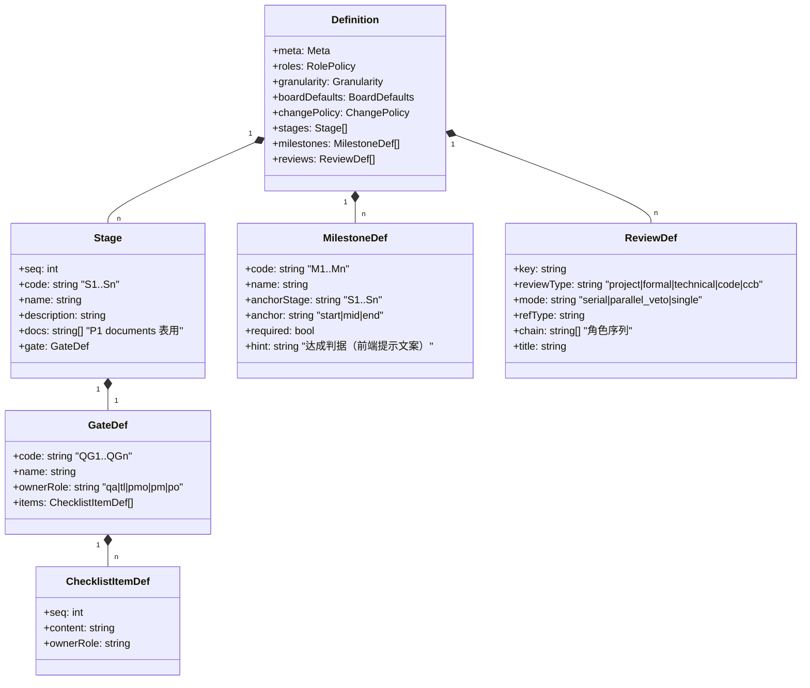
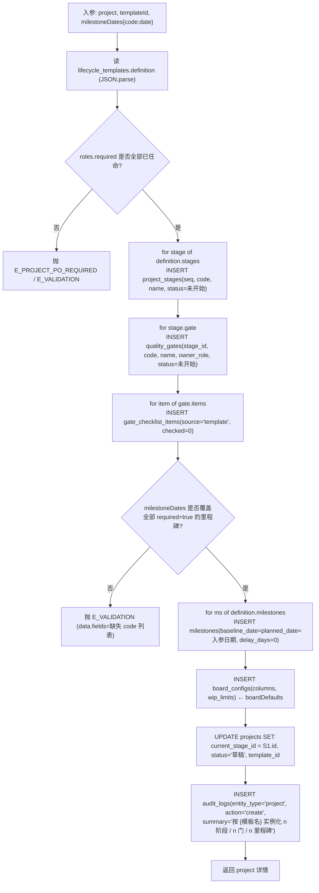
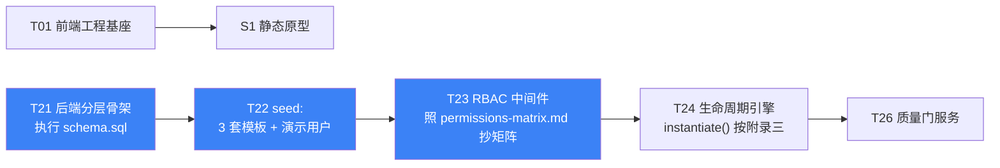

# 附录 A · 落地物料（DDL / 权限矩阵 / 生命周期模板）

> 主文档：`docs/架构设计-重构v1.md`
> 本附录目的：把主文档里「结构层面」的设计，落成工程师 **T01/T21/T22 可直接使用** 的三份物料，并关闭待明确事项 **O9、O10**。
> 版本：v1.0 · 架构师 高见远

---

## 一、本次新增物料清单

| # | 文件 | 内容 | 消费方（任务） |
|---|---|---|---|
| 1 | `docs/schema.sql` | 20 张表完整 DDL + 30 个索引 + 10 条「DDL 表达不了、服务层必须兜底」的约束清单 | **T21** 建库、**T22** seed、后续所有 Repository |
| 2 | `docs/permissions-matrix.md` | 37 个权限点 + 全局角色矩阵 + 项目角色矩阵 + 所有权二次校验 + `permissions.js` 结构示意 + 10 条验收用例 | **T23** RBAC 中间件、**T15** 前端 `PermissionGate`、**T36** 走查 |
| 3 | `docs/lifecycle/A-delivery.json` | A 类：6 阶段 / QG1~QG6 / 38 条检查项 / M1~M7 / 6 类评审链 | **T22** 模板 seed、**T24** 生命周期引擎 |
| 4 | `docs/lifecycle/B-product.json` | B 类：4 阶段 / QG1~QG4 / 24 条检查项 / M1~M6 / 6 类评审链 | 同上 |
| 5 | `docs/lifecycle/C-infra.json` | C 类：5 阶段 / QG1~QG5 / 32 条检查项 / M1~M6 / 5 类评审链 | 同上 |

> 三份 JSON 直接作为 `lifecycle_templates.definition` 的取值（`JSON.stringify` 后入库），**不需要再设计中间格式**。

---

## 二、模板 `definition` 字段字典



| 字段 | 类型 | 语义 | 落库去向 |
|---|---|---|---|
| `roles.required` | `string[]` | 建项目时**必须任命**的项目角色，缺一不允许提交立项 | 校验，不落库 |
| `granularity.maxLeafDays` | `number` | 叶子任务人日上限，超出出**非阻塞** `warnings[]` | `wbs.service.checkGranularity()` |
| `boardDefaults` | `object` | 建项目时写入 `board_configs` | `board_configs.columns / wip_limits` |
| `changePolicy.ccbTriggers` | `string[]` | 命中即强制 CCB 的 `change_type` | `change.service.route()` |
| `changePolicy.ccbEffortThresholdDays` | `number` | `effort_days ≥ 阈值` 即 CCB | 同上 |
| `changePolicy.ccbChain` | `string[]` | CCB 审批链角色序列 | `review_steps.role` |
| `stages[]` | — | 逐条实例化 | `project_stages` |
| `stages[].gate` | — | 逐条实例化 | `quality_gates` |
| `stages[].gate.items[]` | — | 逐条实例化，`source='template'` | `gate_checklist_items` |
| `stages[].docs` | `string[]` | P1 才开放 UI，一期只落库 | `documents`（P1） |
| `milestones[]` | — | 实例化时由前端「建项目向导」逐个填日期，写入 `baseline_date = planned_date` | `milestones` |
| `reviews[]` | — | 不落库，作为 `review.service.startReview(templateKey)` 的链路查表源 | 运行时读模板 |

---

## 三、模板实例化算法（`lifecycle.service.instantiate()`）

> 主文档 4.5 时序图的**内部展开**。全过程包在**单个事务** `dal.tx()` 内，任一步失败整体回滚。



### 三条实例化不变式（写单测覆盖）

| # | 不变式 | 校验点 |
|---|---|---|
| I1 | `project_stages.seq` 连续且从 1 开始，无重复 | `uq_stage_seq` |
| I2 | 每个 stage 有且仅有 1 个 gate | `quality_gates.stage_id UNIQUE` |
| I3 | 所有里程碑 `baseline_date == planned_date` 且 `delay_days == 0` | 实例化后断言 |

### 模板升版策略

- `lifecycle_templates` 按 `(project_type, version)` 累加，`is_active=1` 只允许一条（部分唯一索引）。
- **已实例化的项目不受模板升版影响**——阶段/门/检查项已复制成项目自有数据，模板只是「出厂设置」。
- 项目可通过 `POST /api/gates/:id/items` 追加 `source='custom'` 检查项；`source='template'` 的项**不可删**（可勾选、可不适用时由门主在结论里说明）。

---

## 四、相对主文档的两处细化（delta）

| # | 位置 | 主文档原设计 | 本附录细化 | 原因 |
|---|---|---|---|---|
| **D-1** | `quality_gates.owner_role` | `CHECK IN ('qa','tl','pmo')` | `CHECK IN ('qa','tl','pmo','pm','po')` | B 类「需求就绪门」门主是 PO；C 类部分门由 PM 兜底 |
| **D-2** | `milestones` 表 | 无表级 CHECK | 增加 `CHECK (planned_date >= baseline_date)` | 数据库层给「不可提前」加最后一道兜底，防绕过服务层的脚本写入 |
| **D-3** ⚠️ | `milestones.current_date` | 字段名 `current_date` | **重命名为 `planned_date`**（前端 DTO 同步 `currentDate → plannedDate`） | `CURRENT_DATE` 是 SQL 保留字。实测 SQLite 建索引时直接报 `non-deterministic functions prohibited in index expressions`；Postgres 更严格（必须双引号）。为守住「未来可切 Postgres」的目标，一次性改名 |

> 除以上三处，`schema.sql` 与主文档 3.1 ER 图**逐字段一致**。主文档、时序图、权限矩阵中的 `current_date` 已全量同步为 `planned_date`。

---

## 四之二、DDL 已实测（非纸面设计）

`schema.sql` 已在 `better-sqlite3` 内存库中**实际执行并跑通约束冒烟测试**：

```
执行结果：20 张业务表 + 22 个 idx_* + 8 个 uq_* 全部创建成功

=== 负向用例（应被 DDL 拦截）===
[OK] 里程碑 planned_date 早于 baseline_date → CHECK constraint failed
[OK] 非法项目类型 D                        → CHECK constraint failed: type IN ('A','B','C')
[OK] WBS progress 超出 0-100               → CHECK constraint failed
[OK] 同一类型出现第二条 is_active=1 模板    → UNIQUE constraint failed
[OK] 周报风险条目缺 owner                  → NOT NULL constraint failed
[OK] 外键：引用不存在的项目                → FOREIGN KEY constraint failed
[OK] 同一项目 WBS 编码重复                 → UNIQUE constraint failed
[OK] 一个阶段挂两个质量门                  → UNIQUE constraint failed: quality_gates.stage_id
=== 正向用例 ===
[OK] 里程碑延后：baseline 2026-03-20 保持不变，planned 改 2026-03-30，delay_days=10
[OK] 质量门必须挂阶段（stage_id NOT NULL）

结果：通过 10 / 失败 0
```

> 建议 **T21** 把这 10 条用例直接搬进 `server/dal/__tests__/schema.spec.js`，作为建库回归的第一道防线。

### 已知的驱动差异（切 Postgres 时需处理，一期不做）

| 项 | SQLite | Postgres | 处理位置 |
|---|---|---|---|
| 前向外键（`projects.current_stage_id` 引用后建的 `project_stages`） | 允许，DML 时才校验 | 建表即报错，需调整建表顺序或用 `ALTER TABLE ADD CONSTRAINT` | `dal/connection.js` 分方言加载 |
| `INTEGER PRIMARY KEY AUTOINCREMENT` | 原生 | 改 `GENERATED ALWAYS AS IDENTITY` | 同上 |
| 布尔 / JSON 存 TEXT | 需 Repository 转换 | 可用 `BOOLEAN` / `JSONB` | `dal/base.repo.js` |
| 部分唯一索引 `WHERE is_active = 1` | 支持 | 支持（语法一致） | 无需改 |

---

## 五、O9 / O10 关闭说明

| 事项 | 原状态 | 现状态 |
|---|---|---|
| **O9** A 类里程碑 M1~M7 具体名称 | 待 PMO 确认 | ✅ **已给出定稿草案**（A/B/C 三套里程碑全部命名 + 达成判据 hint），见 `docs/lifecycle/*.json`。PMO 若无异议即视为定稿，**T22 可直接开工** |
| **O10** QG1~QG6 检查项明文 | 待 PMO 提供 Excel | ✅ **已给出架构师草拟版共 94 条检查项**（A 38 / B 24 / C 32），全部带 `ownerRole`。流程可跑通；PMO 后续提供正式版时，**只需替换 JSON 文本内容，无需改任何代码**（检查项是数据不是代码） |

**替换成本说明**：模板是数据，改文案 = 改 JSON + 重跑 seed（未来项目生效）；已在途项目若要同步，需 PMO 单独发起「检查项补录」（追加 `source='custom'` 项），不做历史数据回刷 —— 这与「基线一经冻结不得回改」的制度一致。

---

## 六、其余待办项状态同步

| # | 事项 | 建议 | 当前状态 |
|---|---|---|---|
| O1 | 状态管理 Zustand vs TanStack Query | 一期 Zustand | 待 team-lead 拍板 |
| O2 | 是否强制 TypeScript | 强烈建议 TS | 待拍板（影响 T01） |
| O5 | 测试范围 | 后端 vitest 覆盖 8 条硬约束 | 已在 `permissions-matrix.md` 第八章补齐 **RBAC 10 条验收用例** |
| O7 | 是否软删除 | 项目/里程碑/WBS 加 `deleted_at` | **已在 `schema.sql` 中预留字段**，若不采用只需不写该列 |
| O8 | WIP 默认上限 | A/C 类 5、B 类 3 | **已在三套模板 `boardDefaults.wipLimits` 中给出差异化默认值**，请 PM 确认 |
| O11 | SQLite 持久化盘 | 付费盘 + 每日备份 | ⚠️ **仍是最高风险项**，需用户决策，否则试点数据会丢 |
| O13 | `customer_rep` 是否建用户 | 不建，PM 代录 | 已在权限矩阵中固化（`review:proxy`） |

---

## 七、给工程师的开工顺序建议（不改任务编号）



- **T21 现在零阻塞**：`schema.sql` 可直接拷进 `server/dal/schema.sql`。
- **T22 现在零阻塞**：三套模板 JSON 可直接 `require()` 后 `JSON.stringify` 入库。
- **T23 现在零阻塞**：权限矩阵已到权限点粒度，照抄即可，不需要再问 PM。
- 唯一仍需外部输入的是 **O11（部署盘）**、**O2（TS 与否）** —— 这两项不阻塞 T01~T24，但 O2 越早定越好。
