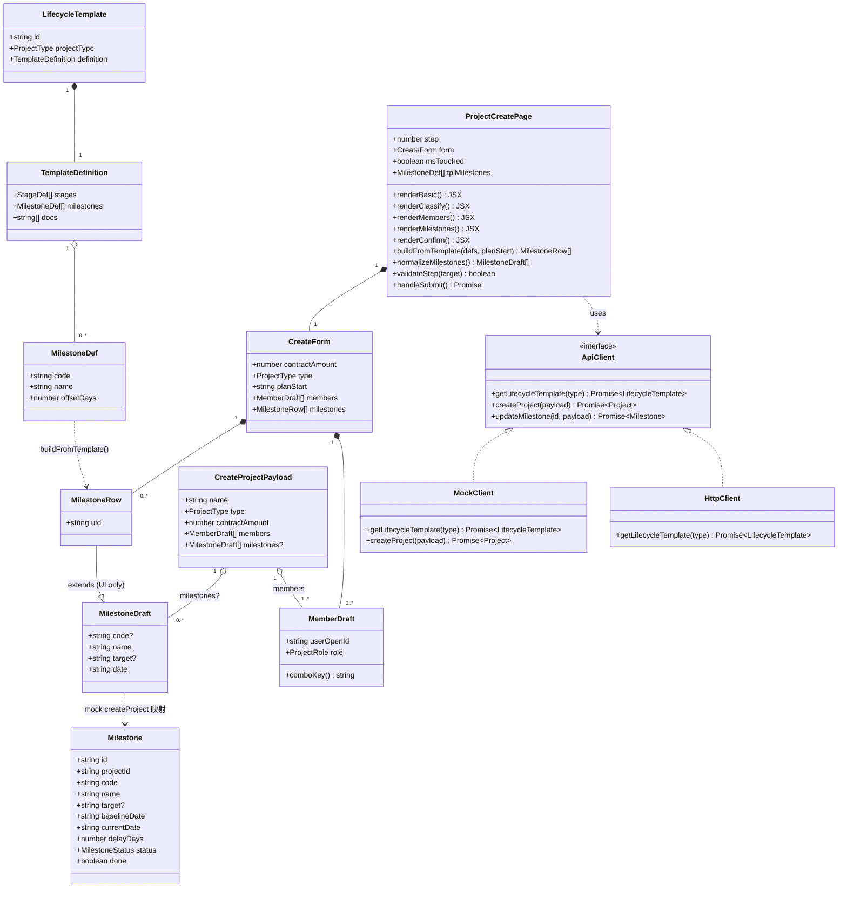
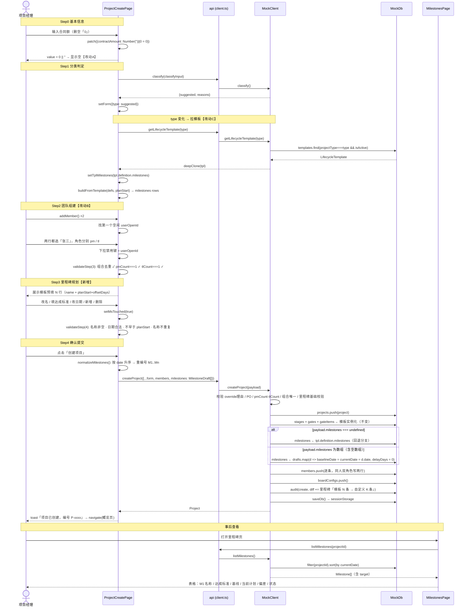
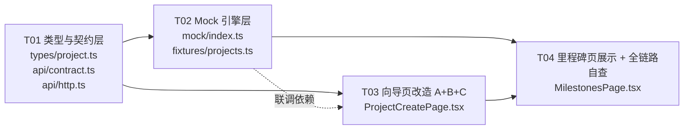

# 太空字节 PM 系统 · M1 新建项目向导增量设计 v1

> 范围：仅描述本次 3 项增量改动（Q3 合同额前导 0 / Q5 一人多角色 / 创建时里程碑可编辑）。
> 不重写既有架构，未提及部分一律沿用 `docs/架构设计-重构v1.md`。
> 影响面：`pm-app/web` 前端 + 前端 mock；真实后端 S2 落地，见 §8「S2 交接」。
> 分类规则 `classifyProject()` 本次**不改**。

---

## 1. 实现方案（Implementation Approach）

### 1.1 三项改动的技术难点

| 改动 | 难点 | 决策 |
|---|---|---|
| **A** 合同额前导 0 | MUI 受控 `<TextField type="number">` 的 `value` 是 `number`，`0` 会被格式化成字符串 `"0"` 常驻输入框；删空后 `Number('')\|\|0` 又回到 `0`，形成"清不掉"的死循环 | 只改**显示层**：`value={form.contractAmount \|\| ''}`。状态层仍是 `number`，zod / `classifyInput` / payload 全链路零改动 |
| **B** 一人多角色 | 现有唯一键是「人」（`disabled` 判断只比 `userOpenId`），要改成「人 + 角色」复合键；同时 **必须保住** "PM 恰 1 人、TL 恰 1 人" 的基数约束 | 唯一键从 `userOpenId` 升级为 `userOpenId#role`。基数校验（`pmCount!==1 \|\| tlCount!==1`）**一行不动** —— 它统计的是角色行数，天然允许这两行指向同一个人 |
| **C** 里程碑可编辑 | 里程碑当前 100% 由 mock 后端按模板生成，前端拿不到模板；且新增一步会打乱 `STEPS` / `validateStep(target)` / `handleSubmit` 的索引 | ① 新增 `getLifecycleTemplate(type)` 让前端拿到模板骨架；② `CreateProjectPayload.milestones` 用 **三态语义**（`undefined` / `[]` / 非空）实现"覆盖 or 回退"；③ 引入 `ERROR_STEP` 映射表，把"错误字段 → 步骤索引"显式化，杜绝硬编码索引 |

### 1.2 关键设计取舍

1. **不引入新依赖**。里程碑编辑复用已在用的 `@mui/x-date-pickers` `DatePicker` + `TextField`，无第三方表格库。
2. **不动数据库唯一约束**。`project_members` 现有 schema（`schema.sql:102`）本就**没有** `(project_id, user_open_id)` 唯一索引，改动 B 在 S1 mock 与 S2 后端都不会撞约束 —— 但必须**明令禁止**后续补这个索引，见 §8。
3. **`Milestone.target` 设为可选字段**（`target?: string`）。原因：mock db 持久化在 `sessionStorage['pm_mock_db_v1']`（`db.ts:45`），老会话里的里程碑没有该字段；设为可选即可平滑兼容，**不需要 bump STORAGE_KEY**，避免抹掉演示者已有的演示数据。
4. **`getLifecycleTemplate` 返回完整 `LifecycleTemplate` 而非 `milestones` 数组**。理由：mock 侧本就整对象存在（`db.templates`），返回全量零成本；后续「确认提交」步要展示阶段/质量门预览时可直接复用，不必再加接口。
5. **提交前按日期升序重排并重编号 `M1..Mn`**。理由：① 保证 mock 里 `id = ${projectId}-${code}` 唯一；② 与 `MilestonesPage` 已有的"按 `currentDate` 排序"（`mock/index.ts:756`）显示顺序一致，避免"我填的第 3 条怎么显示在第 1 行"。

---

## 2. 变更文件清单（File List）

绝对路径基准：`c:\Users\xuwen\WorkBuddy\AstrBytes\`

| # | 文件 | 改动点（一句话） |
|---|---|---|
| 1 | `pm-app\web\src\types\project.ts` | `Milestone` 增加可选字段 `target?: string`（达成标准 / 交付物） |
| 2 | `pm-app\web\src\api\contract.ts` | 新增 `MilestoneDraft` 接口；`CreateProjectPayload` 增 `milestones?: MilestoneDraft[]`；`MilestoneUpdatePayload` 增 `target?: string`；`ApiClient` 增 `getLifecycleTemplate(type)` |
| 3 | `pm-app\web\src\api\http.ts` | 补 `getLifecycleTemplate()` 的 HTTP 实现（`GET /meta/lifecycle-templates/:type`），保持双实现签名一致 |
| 4 | `pm-app\web\src\api\mock\index.ts` | ① 新增 `getLifecycleTemplate()`；② `createProject` 增里程碑覆盖分支 + 成员「人+角色」组合去重兜底 + 审计 diff；③ `updateMilestone` 支持写 `target` |
| 5 | `pm-app\web\src\pages\projects\ProjectCreatePage.tsx` | 改动 A + B + C 全部落在此文件：合同额显示修复、成员唯一键升级、新增第 4 步「里程碑规划」、`STEPS`/`STEP_RENDER`/`validateStep`/`handleSubmit` 重排 |
| 6 | `pm-app\web\src\pages\projects\MilestonesPage.tsx` | 「里程碑」列下方增行展示 `target`（达成标准），空值不占位 |
| 7 | `pm-app\web\src\api\mock\fixtures\projects.ts` | 种子里程碑补 `target: ''`（可选，纯为类型整洁；不加也能跑） |

**不改**：`rules.ts`（分类逻辑）、`db.ts`（不 bump STORAGE_KEY）、`config\enums.ts`、`types\api.ts`（复用 `E_VALIDATION`）、`fixtures\templates.ts`。

---

## 3. 数据模型变更（Data Structures）

### 3.1 `MilestoneDraft`（新增 · `api/contract.ts`）

向导 → 后端的**线上传输类型**，不含 UI 私有字段。

```jsonc
MilestoneDraft {
  "code":   { "type": "string", "required": false, "pattern": "^M\\d+$",
              "note": "前端提交前按日期升序重排为 M1..Mn；留空则由服务端按序号补" },
  "name":   { "type": "string", "required": true,  "minLength": 1, "maxLength": 40,
              "note": "里程碑名称，同一项目内不可重复" },
  "target": { "type": "string", "required": false, "maxLength": 200, "default": "",
              "note": "达成标准 / 交付物；用 target 而非 description，避免与 Project.goal 混淆" },
  "date":   { "type": "string", "required": true,  "pattern": "^\\d{4}-\\d{2}-\\d{2}$",
              "note": "DATE_FMT；创建时 baselineDate = currentDate = date" }
}
```

```ts
export interface MilestoneDraft {
  /** 里程碑编码；前端按日期升序重排为 M1..Mn，留空则服务端补 */
  code?: string;
  name: string;
  /** 达成标准 / 交付物 */
  target?: string;
  /** YYYY-MM-DD；创建时 baselineDate = currentDate = date */
  date: string;
}
```

### 3.2 `MilestoneRow`（新增 · 仅 `ProjectCreatePage.tsx` 内部，不导出到契约）

React 列表需要稳定 key，而 `code` 会在提交时被重排，不能当 key。

```ts
interface MilestoneRow extends MilestoneDraft {
  /** 本地行 ID（genId('MSR')），仅用于 React key 与行内更新定位，不提交 */
  uid: string;
}
```

### 3.3 `Milestone.target`（扩展 · `types/project.ts`）

```jsonc
Milestone {
  "...": "既有 14 个字段保持不变",
  "target": { "type": "string", "required": false, "default": "",
              "note": "达成标准 / 交付物。设为可选以兼容 sessionStorage 中的旧 mock 数据" }
}
```

```ts
export interface Milestone {
  id: string;
  projectId: string;
  code: string;
  name: string;
  /** 达成标准 / 交付物（M1 新增；旧数据可能缺失，展示时兜底） */
  target?: string;
  baselineDate: string;
  currentDate: string;
  delayDays: number;
  status: MilestoneStatus;
  done: boolean;
  doneAt: string | null;
  lastChangeId: string | null;
  createdAt: string;
  updatedAt: string;
}
```

### 3.4 `CreateProjectPayload.milestones`（扩展 · `api/contract.ts`）

⚠️ **三态语义是本次设计的核心契约，实现时不可简化成 `milestones ?? []`：**

| 取值 | 含义 | 服务端行为 |
|---|---|---|
| `undefined` | 调用方未参与里程碑规划（旧调用方 / 脚本 / 其它入口） | **回退**：按 `tpl.definition.milestones` 生成（现有行为，向后兼容） |
| `[]` | 用户在向导里**显式清空**了全部里程碑 | 创建后**不生成任何里程碑**，后续在里程碑页补 |
| `[...]` | 用户自定义清单 | **完全覆盖**模板，逐条生成 |

```ts
export interface CreateProjectPayload {
  /* ...既有 13 个字段不变... */
  members: Array<{ userOpenId: string; role: ProjectRole }>;
  /**
   * 里程碑规划（向导第 4 步产出）。三态：
   * - undefined → 服务端按生命周期模板生成（向后兼容）
   * - []        → 用户显式清空，不生成任何里程碑
   * - 非空数组  → 完全覆盖模板
   */
  milestones?: MilestoneDraft[];
}
```

### 3.5 `MilestoneUpdatePayload.target`（扩展 · 为里程碑页后续编辑预留）

```ts
export interface MilestoneUpdatePayload {
  currentDate?: string;
  done?: boolean;
  name?: string;
  /** 达成标准 / 交付物（M1 新增契约，本次只做后端支持，暂不出 UI） */
  target?: string;
}
```

### 3.6 类图（增量部分）



---

## 4. 新增 API：`getLifecycleTemplate(type)`

### 4.1 契约签名（`api/contract.ts` · `ApiClient` 接口，放在 `getMeta()` 下方）

```ts
/** 按项目分类取当前生效的生命周期模板（新建向导里程碑预填用） */
getLifecycleTemplate(type: ProjectType): Promise<LifecycleTemplate>;
```

- **入参**：`type: 'A' | 'B' | 'C'`
- **返回**：完整 `LifecycleTemplate`；前端只消费 `res.definition.milestones`（`Array<{code,name,offsetDays}>`）
- **错误**：`E_NOT_FOUND`（该分类无 active 模板）、`E_UNAUTHORIZED`

### 4.2 Mock 实现要点（`api/mock/index.ts`，紧邻 `getMeta()` 放）

```ts
/** @prd P0-02 取指定分类的生效模板（向导里程碑预填） */
async getLifecycleTemplate(type: ProjectType): Promise<LifecycleTemplate> {
  await delay(60);
  const db = getDb();
  currentUser(db);                        // 仅要求已登录，不做 project.create 权限断言
  const tpl = db.templates.find((t) => t.projectType === type && t.isActive) ?? nf();
  return deepClone(tpl);                  // 必须 deepClone，防止页面改到 db 内存态
}
```

要点：
1. `currentUser(db)` 而非 `assertCan(db, 'project.create')` —— 这是元数据读取，权限收口在 `createProject`。
2. **必须 `deepClone`**，否则向导里 `buildFromTemplate` 若误改对象会污染 `db.templates`（这是本仓库 mock 的通用铁律）。
3. 复用 `db.templates` 的 `isActive` 过滤，与 `createProject`（`mock/index.ts:448`）取模板的逻辑**完全一致**，保证"预填的 = 回退生成的"。

### 4.3 HTTP 实现（`api/http.ts`，`getMeta()` 下方）

```ts
getLifecycleTemplate(type: ProjectType): Promise<LifecycleTemplate> {
  return get<LifecycleTemplate>(`/meta/lifecycle-templates/${type}`);
}
```

> 备选方案（已否决）：复用现有 `getMeta()` 再前端 `find`。否决理由：`getMeta()` 额外带回全部 `reviewTemplates`，向导每次切分类都拉一遍浪费；且语义上"取某分类模板"应是独立读接口，S2 后端也更好实现缓存。

---

## 5. 向导步骤变更

### 5.1 `STEPS` / `STEP_RENDER` 重排

```ts
// 行 69 —— 4 步 → 5 步
const STEPS = ['基本信息', '分类判定', '团队组建', '里程碑规划', '确认提交'] as const;

// 行 549 —— 插入 renderMilestones
const STEP_RENDER: Array<() => JSX.Element> =
  [renderBasic, renderClassify, renderMembers, renderMilestones, renderConfirm];
```

索引位移一览（**所有硬编码索引都必须跟着改**）：

| 步骤 | 旧 index | 新 index | `validateStep(target)` 触发条件 |
|---|---|---|---|
| 基本信息 | 0 | 0 | `target >= 1` |
| 分类判定 | 1 | 1 | `target >= 2` |
| 团队组建 | 2 | 2 | `target >= 3` |
| **里程碑规划** | — | **3** | **`target >= 4`（新增）** |
| 确认提交 | 3 | 4 | — |

`handleNext` / `handleBack` 依赖 `STEPS.length`，**自动适配无需改**。

### 5.2 `handleSubmit` 的索引修复（原 `validateStep(3)` + `setStep(2)` 会错位）

引入错误字段 → 步骤映射，替代硬编码：

```ts
const ERROR_STEP: Record<string, number> = {
  name: 0, customer: 0, contractAmount: 0, background: 0, goalText: 0, planStart: 0, planEnd: 0,
  overrideReason: 1,
  members: 2,
  milestones: 3,
};

const handleSubmit = async (): Promise<void> => {
  if (!validateStep(4)) {
    const keys = Object.keys(errorsRef.current);        // 或 validateStep 直接返回 next
    setStep(Math.min(...keys.map((k) => ERROR_STEP[k] ?? 0)));
    return;
  }
  const payload: CreateProjectPayload = {
    /* ...既有字段不变... */
    members: form.members.map((m) => ({ userOpenId: m.userOpenId, role: m.role })),
    milestones: normalizeMilestones(),                  // 恒为数组（可能是 []），不传 undefined
  };
  /* ...既有 try/catch 不变... */
};
```

> 实现提示：`validateStep` 目前只 `setErrors(next)` 后返回 boolean，`errors` 是异步 state 读不到新值。请把 `validateStep` 改为**返回 `next` 对象**（或额外返回），供 `handleSubmit` 同步定位出错步骤。

### 5.3 `renderMilestones()` 职责清单

| 职责 | 说明 |
|---|---|
| **预填** | 首次进入 / 未手工编辑过时，按 `tplMilestones` + `form.planStart` 生成行：`date = addDays(planStart, offsetDays)` |
| **行编辑** | 每行：`M{n}` 编码（只读 Chip）· 名称（`TextField`，必填）· 达成标准（`TextField`，选填，`placeholder="如：需求规格说明书评审通过并签署"`）· 日期（`DatePicker`）· 删除按钮（`DeleteOutlineIcon`，复用团队组建步的交互） |
| **新增** | 「添加里程碑」按钮：追加 `{ uid: genId('MSR'), code: '', name: '', target: '', date: 上一行日期 + 7 天（无行则取 planStart） }` |
| **删除** | 逐条删（`filter(uid)`），**允许删到 0 条** |
| **重新预填** | 「按模板重新预填」按钮：`patch({ milestones: buildFromTemplate(tplMilestones, form.planStart) }); setMsTouched(false)` |
| **漂移提示** | 若 `msTouched === true` 且此后 `type` / `planStart` 变化过 → 顶部 `Alert severity="warning"`：「分类或计划开始日期已变更，当前里程碑仍是您手工编辑的版本」+ 上述按钮 |
| **规则说明** | 顶部 `Alert severity="info"`：「此处填写的日期将同时作为**基线日期**与**当前计划**；项目创建后，日期延后须走变更单（CCB）」 |
| **空态** | 0 条时提示：「已清空全部里程碑，创建后可在项目里程碑页逐条补充」 |

### 5.4 新增 / 修改的组件内状态与工具函数

```ts
/* 新增 state */
const [tplMilestones, setTplMilestones] = useState<MilestoneDef[]>([]);
const [msTouched, setMsTouched] = useState<boolean>(false);

/* CreateForm 增字段 */
interface CreateForm {
  /* ...既有 14 个字段... */
  milestones: MilestoneRow[];   // EMPTY_FORM 里初始化为 []
}

/* 模板 → 行 */
function buildFromTemplate(defs: MilestoneDef[], planStart: string): MilestoneRow[] {
  return defs.map((d) => ({
    uid: genId('MSR'),
    code: d.code,
    name: d.name,
    target: '',
    date: addDays(planStart, d.offsetDays),
  }));
}

/* 拉模板：分类变化即重拉（沿用现有 classify effect 的 alive 守卫写法） */
useEffect(() => {
  let alive = true;
  api.getLifecycleTemplate(form.type)
    .then((t) => { if (alive) setTplMilestones(t.definition.milestones); })
    .catch(() => { if (alive) setTplMilestones([]); });
  return () => { alive = false; };
}, [form.type]);

/* 自动预填：仅在用户未手工编辑时跟随 type / planStart 重算 */
useEffect(() => {
  if (msTouched) return;
  patch({ milestones: buildFromTemplate(tplMilestones, form.planStart) });
  // eslint-disable-next-line react-hooks/exhaustive-deps
}, [tplMilestones, form.planStart, msTouched]);

/* 提交前归一化：按日期升序 → 重编号 M1..Mn → 去掉 uid */
function normalizeMilestones(): MilestoneDraft[] {
  return [...form.milestones]
    .sort((a, b) => (a.date < b.date ? -1 : a.date > b.date ? 1 : 0))
    .map((m, i) => ({
      code: `M${i + 1}`,
      name: m.name.trim(),
      target: (m.target ?? '').trim(),
      date: m.date,
    }));
}
```

> 所有行编辑入口（改名 / 改目标 / 改日期 / 增 / 删）都必须调 `setMsTouched(true)`，否则会被自动预填 effect 覆盖掉。

### 5.5 `renderConfirm` 补充（第 5 步）

在「项目团队」`FieldRow` 之后追加：

```tsx
<FieldRow label="里程碑规划">
  {form.milestones.length === 0
    ? <Typography variant="body2" color="text.secondary">未规划（创建后在里程碑页补充）</Typography>
    : <Stack spacing={0.25}>
        {normalizeMilestones().map((m) => (
          <Typography key={m.code} variant="body2">
            {m.code} {m.name} · {m.date}{m.target ? ` · ${m.target}` : ''}
          </Typography>
        ))}
      </Stack>}
</FieldRow>
```

并把行 542 的底部 `Alert` 文案微调：模板自动生成里程碑 → **「阶段与质量门按模板自动实例化；里程碑采用您在上一步规划的 N 条」**（`length === 0` 时说明为空）。

---

## 6. 改动 A / B 的具体实现点

### 6.1 改动 A —— 合同额（`ProjectCreatePage.tsx` 行 298–306）

```tsx
<TextField
  label="合同额（万元）"
  type="number"
  value={form.contractAmount || ''}          // ← 唯一改动：0 显示为空
  onChange={(e) => patch({ contractAmount: Number(e.target.value) || 0 })}  // 保持不变
  error={Boolean(errors.contractAmount)}
  helperText={errors.contractAmount ?? '≥ 100 万会触发 A 类判定'}
  fullWidth
/>
```

回归确认（3 条，实现后必须逐条自查）：
1. `baseSchema.contractAmount.min(0)`（行 74）—— 状态层恒为 `number`，`Number('abc') || 0 → 0`，永不为 `NaN`/`undefined`，校验成立。
2. `classifyInput.contractAmount`（行 126）—— 读的是 state 不是 DOM value，判定链路不受影响。
3. **已知取舍**：用户主动输入 `0` 时输入框会显示为空（`0 || '' === ''`）。业务上「合同额 0」= 「无合同额 / 内部项目」，语义等价，接受。`fmtAmount(0)` 在确认页与分类页仍正常显示。

### 6.2 改动 B —— 一人多角色（唯一键 `userOpenId#role`）

**B-1 · 成员下拉禁用条件（行 464–472）**

```tsx
{userList.map((u) => (
  <MenuItem
    key={u.openId}
    value={u.openId}
    // 旧：x.userOpenId === u.openId          （禁掉整个人）
    // 新：仅禁掉「该用户 + 当前行角色」这一组合
    disabled={form.members.some((x, xi) => xi !== i && x.userOpenId === u.openId && x.role === m.role)}
  >
    {u.name} · {u.dept}
  </MenuItem>
))}
```

**B-2 · 角色下拉同样加组合守卫（行 482–486，原本无守卫）**

```tsx
{PROJECT_ROLES.map((r) => (
  <MenuItem
    key={r}
    value={r}
    disabled={form.members.some((x, xi) => xi !== i && x.userOpenId === m.userOpenId && x.role === r)}
  >
    {PROJECT_ROLE_LABEL[r]}
  </MenuItem>
))}
```

**B-3 · `addMember` 改为找第一个空闲「人+角色」组合（行 224–233）**

```ts
const comboKey = (userOpenId: string, role: ProjectRole): string => `${userOpenId}#${role}`;

const addMember = (): void => {
  const used = new Set(form.members.map((m) => comboKey(m.userOpenId, m.role)));
  // 优先补齐必填角色：PM → TL →（B 类）PO → member
  const wanted: ProjectRole =
    pmCount === 0 ? 'pm' : tlCount === 0 ? 'tl' : form.type === 'B' && !hasPo ? 'po' : 'member';

  // 先在 wanted 角色下找空闲用户；找不到再退化为「任意空闲组合」
  const byWanted = userList.find((u) => !used.has(comboKey(u.openId, wanted)));
  if (byWanted) { patch({ members: [...form.members, { userOpenId: byWanted.openId, role: wanted }] }); return; }

  for (const u of userList) {
    for (const r of PROJECT_ROLES) {
      if (!used.has(comboKey(u.openId, r))) {
        patch({ members: [...form.members, { userOpenId: u.openId, role: r }] });
        return;
      }
    }
  }
  toast.warning('没有更多可选的「成员 + 角色」组合');
};
```

**B-4 · 前端组合去重校验（`validateStep`，插在行 204–207 的基数校验之前）**

```ts
if (target >= 3) {
  const keys = form.members.map((m) => comboKey(m.userOpenId, m.role));
  if (new Set(keys).size !== keys.length) next.members = '同一成员的同一角色不能重复指派';
  else if (pmCount !== 1) next.members = '项目经理（PM）有且仅有 1 人';   // ← 原有，不动
  else if (tlCount !== 1) next.members = '技术负责人（TL）有且仅有 1 人'; // ← 原有，不动
  else if (form.type === 'B' && !hasPo) next.members = 'B 类（产品型）项目必须指定产品负责人（PO）';
}
```

**B-5 · ⚠️ 必修 React key bug（行 534）**

`renderConfirm` 里 `<Chip key={m.userOpenId}>` —— 改动 B 生效后同一个人会出现两行，**必然触发 React duplicate key 警告并导致渲染错乱**：

```tsx
<Chip key={`${m.userOpenId}#${m.role}`} ... />
```

同理确认行 454 的 `key={`${m.userOpenId}-${i}`}` 已含 index，安全，但建议统一改为 `` `${m.userOpenId}#${m.role}` ``。

**B-6 · 兼职提示（UX，可选但建议做）**

在成员步顶部 `Alert`（行 441–444）末尾补一句：「同一人可担任多个角色（如 PM 兼 TL），请分别添加成员行」。并在成员行右侧对**出现 ≥2 次的人**加一枚 `<Chip size="small" variant="outlined" label="兼任" />`。

---

## 7. Mock `createProject` 变更（`api/mock/index.ts:433–568`）

### 7.1 校验段增补（插在行 446 `E_ROLE_CARDINALITY` 之后）

```ts
// ── 改动 B 服务端兜底：「人 + 角色」组合唯一 ──
const comboKeys = payload.members.map((m) => `${m.userOpenId}#${m.role}`);
if (new Set(comboKeys).size !== comboKeys.length) {
  throw new ApiError(ErrorCode.E_VALIDATION, '同一成员的同一角色不能重复指派');
}

// ── 改动 C：里程碑草稿基础校验（仅当调用方传了数组） ──
if (payload.milestones) {
  for (const d of payload.milestones) {
    if (!d.name?.trim()) throw new ApiError(ErrorCode.E_VALIDATION, '里程碑名称不能为空');
    if (!/^\d{4}-\d{2}-\d{2}$/.test(d.date)) throw new ApiError(ErrorCode.E_VALIDATION, '里程碑日期格式非法');
  }
}
```

> 行 444–446 的 `pmCount !== 1 || tlCount !== 1` **原样保留**：它统计角色行数，一人兼 PM+TL 时 `pmCount = tlCount = 1`，天然放行。

### 7.2 里程碑生成分支（**替换** 行 524–541 整段）

```ts
/* ── 里程碑：用户覆盖优先，未传则回退模板 ─────────── */
const drafts = payload.milestones;          // undefined | [] | MilestoneDraft[]

if (drafts === undefined) {
  /* 分支 1 · 向后兼容：按生命周期模板生成（原有逻辑，一行不动） */
  tpl.definition.milestones.forEach((md) => {
    const date = addDays(payload.planStart, md.offsetDays);
    db.milestones.push({
      id: `${id}-${md.code}`, projectId: id, code: md.code, name: md.name,
      target: '',
      baselineDate: date, currentDate: date, delayDays: 0,
      status: '未开始', done: false, doneAt: null, lastChangeId: null,
      createdAt: ts, updatedAt: ts,
    });
  });
} else {
  /* 分支 2 · 用户覆盖：drafts 为空数组时不生成任何里程碑 */
  const seen = new Set<string>();
  drafts.forEach((d, i) => {
    // code 兜底：缺失 / 重复一律回退为 M{i+1}，保证 id 唯一
    let code = (d.code ?? '').trim();
    if (!code || seen.has(code)) code = `M${i + 1}`;
    seen.add(code);

    db.milestones.push({
      id: `${id}-${code}`, projectId: id, code, name: d.name.trim(),
      target: (d.target ?? '').trim(),
      baselineDate: d.date,        // 建单即基线
      currentDate: d.date,         // 与基线相等 → delayDays 恒 0
      delayDays: 0,
      status: '未开始', done: false, doneAt: null, lastChangeId: null,
      createdAt: ts, updatedAt: ts,
    });
  });
}
```

要点：
- `offsetDays` 在分支 2 中**不参与也不回算** —— 用户填的是绝对日期，`offsetDays` 是模板私有概念，`Milestone` 实体本就不存该字段。
- `baselineDate === currentDate` ⇒ `delayDays = 0`，满足 `schema.sql:188` 的 `CHECK (planned_date >= baseline_date)`，S2 无缝对接。
- 分支 2 允许 `drafts.length === 0`，此时 `db.milestones` 无新增，`MilestonesPage` 走已有的 `emptyTitle="暂无里程碑"` 空态。

### 7.3 审计增补（行 563–565）

```ts
const auditDiff: AuditDiffEntry[] = [
  { field: 'type', label: '项目分类', before: '', after: `${payload.type} 类` },
];
if (drafts !== undefined) {
  auditDiff.push({
    field: 'milestones', label: '里程碑',
    before: `模板 ${tpl.definition.milestones.length} 条`,
    after: `自定义 ${drafts.length} 条`,
  });
}
audit(db, me, 'project', id, 'create', id, `创建项目「${payload.name}」，分类 ${payload.type} 类`, auditDiff);
```

### 7.4 `updateMilestone` 支持 `target`（行 789–791 附近）

```ts
if (payload.target !== undefined && payload.target !== ms.target) {
  ms.target = payload.target;      // 纯文本字段，不触发单向约束，不写审计 diff
}
```

### 7.5 时序图（新建项目全流程 · 增量部分加粗标注）



---

## 8. S2 交接约束（真实后端必须遵守）

> 以下条目请一并同步到 `docs/架构设计-重构v1.md` 与 `docs/schema.sql` 的 TODO 区。

1. **🚨 `project_members` 严禁建 `(project_id, user_open_id)` 唯一索引。**
   现状 `schema.sql:102–110` 无该索引，正确。S2 若需要唯一约束，**必须是复合键 `(project_id, user_open_id, project_role)`**，或改为 `roles TEXT[]` 数组列。否则「一人兼 PM+TL」会直接撞唯一约束报 500。
   建议补：
   ```sql
   CREATE UNIQUE INDEX IF NOT EXISTS uq_member_combo
     ON project_members(project_id, user_open_id, project_role);
   ```
2. **`milestones` 表增列**：
   ```sql
   ALTER TABLE milestones ADD COLUMN target TEXT NOT NULL DEFAULT '';  -- 达成标准 / 交付物
   ```
   `target` 属于**普通可编辑字段**，不进 `baseline_date` / `planned_date` 的字段白名单管控（即改 `target` 不需要走变更单）。
3. **`POST /projects` 请求体**新增可选 `milestones: MilestoneDraft[]`，服务端必须实现 §7.2 的三态分支；`undefined` 与 `[]` 不可等价处理。
4. **新增只读接口** `GET /meta/lifecycle-templates/:type` → `LifecycleTemplate`，鉴权仅要求已登录。
5. **`baseline_date = planned_date`** 是用户自定义里程碑的建单不变式，满足 `CHECK (planned_date >= baseline_date)`，无需改 CHECK。
6. 项目角色解析（`projectRolesOf`）本就返回**数组**（`mock/index.ts:86–88`），一人多角色下权限自然取并集，`canDo()` 无需改动。S2 后端的角色解析也必须返回数组而非单值。

---

## 9. 共享约定（Shared Knowledge）

| 约定 | 内容 |
|---|---|
| **字段命名** | 用 **`target`**，不用 `description` / `criteria`。理由：① `Project.goal` 已表达"项目目标"，`description` 太泛易混；② `target` 语义 = "该里程碑的达成标准 / 交付物"，与制度文档措辞一致。UI 文案统一显示为**「达成标准」**（`placeholder`：如「需求规格说明书评审通过并签署」）。 |
| **日期格式** | 一律 `DATE_FMT = 'YYYY-MM-DD'`（`utils/date.ts:10`）。日期加减用 `addDays()`，比较用 `dayjs(a).isBefore(dayjs(b), 'day')`，**禁止**手写 `new Date()` 或字符串拼接。 |
| **DatePicker 用法** | 参考 `MilestonesPage.tsx:270–276`：`value` 传 `Dayjs \| null`，`onChange` 里 `v ? v.format(DATE_FMT) : ''`；**不要**把 API 调用挂在 `onChange` 上（MUI X v7 每敲一段就触发一次，中间态是 Invalid Date）。向导内是纯本地 state，无此风险，但格式化写法要统一。 |
| **里程碑编码** | `code` 一律 `M{n}`，`n` 从 1 起。mock 里 `Milestone.id = ${projectId}-${code}`，因此 **同项目内 code 必须唯一** —— 前端 `normalizeMilestones()` 重编号 + 服务端 `seen` 兜底，双保险。 |
| **成员唯一键** | 前后端统一用 `` `${userOpenId}#${role}` ``。建议在 `ProjectCreatePage` 内定义 `comboKey()` 局部函数（不足以进 `utils`）。 |
| **错误码** | 组合重复 / 里程碑非法一律复用 **`E_VALIDATION`** + 自定义 message，**不新增错误码**（`types/api.ts` 与 `server/lib/errors.js` 需保持一致，新增成本高于收益）。 |
| **mock 铁律** | 所有 `return` 出去的对象必须 `deepClone()`；所有写操作末尾必须 `saveDb()`。 |
| **主题取色** | 新 UI **禁止硬编码 hex**。用 `tokens.*`（`theme/tokens.ts:130`，底层是 CSS 变量，浅/深色自动切换）或 MUI `theme.palette` / `color="text.secondary"`。透明度用 `alphaOf()` 而非 MUI `alpha()`（后者处理不了 `var(--x)`）。 |
| **三态语义** | `CreateProjectPayload.milestones` 的 `undefined` / `[]` / 非空三态是硬契约，代码审查重点。前端向导**恒传数组**（哪怕是 `[]`）。 |
| **注释规范** | 沿用 `@prd Pxx-xx` 标注；本次三项改动分别标 `@prd P0-02`（向导）与 `@prd P0-05`（里程碑）。 |

---

## 10. 有序任务清单（Task List）

> 4 个任务，按依赖顺序。T2 / T3 可在 T1 完成后并行。

### T01 · 类型与契约层（P0，无依赖）

**源文件**
- `pm-app\web\src\types\project.ts`
- `pm-app\web\src\api\contract.ts`
- `pm-app\web\src\api\http.ts`

**内容**
1. `Milestone` 增 `target?: string`（含注释说明为何可选）。
2. `contract.ts` 新增导出 `MilestoneDraft` 接口（§3.1）。
3. `CreateProjectPayload` 增 `milestones?: MilestoneDraft[]`，注释写清三态语义。
4. `MilestoneUpdatePayload` 增 `target?: string`。
5. `ApiClient` 接口在 `getMeta()` 下方增 `getLifecycleTemplate(type: ProjectType): Promise<LifecycleTemplate>`。
6. `http.ts` 补对应实现 `GET /meta/lifecycle-templates/${type}`。

**完成判据**：`npx tsc --noEmit` 只剩 `mock/index.ts` 未实现 `getLifecycleTemplate` 的 1 处报错（由 T02 消除）。

---

### T02 · Mock 引擎层（P0，依赖 T01）

**源文件**
- `pm-app\web\src\api\mock\index.ts`
- `pm-app\web\src\api\mock\fixtures\projects.ts`（可选，补 `target: ''`）

**内容**
1. 新增 `getLifecycleTemplate()`（§4.2），放在 `getMeta()` 之后。
2. `createProject`：
   - 校验段增补「人+角色」组合去重 + 里程碑草稿基础校验（§7.1）；
   - **保留** `pmCount !== 1 || tlCount !== 1` 不动；
   - 替换行 524–541 为三态分支（§7.2）；
   - 审计 diff 增补里程碑覆盖记录（§7.3）。
3. `updateMilestone` 支持写 `target`（§7.4）。

**完成判据**：`npx tsc --noEmit` 全绿；手工在浏览器 console 调 `api.getLifecycleTemplate('A')` 返回 7 条里程碑。

---

### T03 · 向导页改造 A + B + C（P0，依赖 T01；建议 T02 完成后再联调）

**源文件**
- `pm-app\web\src\pages\projects\ProjectCreatePage.tsx`（单文件，避免与其它任务冲突）

**内容**（严格按此顺序做，每步可独立自测）
1. **改动 A**：合同额 `value={form.contractAmount || ''}`（§6.1）。
2. **改动 B**：`comboKey()` 工具 + 成员下拉禁用条件 + 角色下拉禁用条件 + `addMember` 重写 + `validateStep` 组合去重 + **`renderConfirm` Chip key 修复** + 成员步 Alert 兼职提示（§6.2 B-1~B-6）。
3. **改动 C**：
   - `CreateForm` 增 `milestones: MilestoneRow[]`，`EMPTY_FORM` 初始化 `[]`；
   - 新增 `tplMilestones` / `msTouched` state 与两个 `useEffect`（§5.4）；
   - `STEPS` / `STEP_RENDER` 重排（§5.1）；
   - 实现 `renderMilestones()`（§5.3）；
   - `validateStep` 增 `target >= 4` 分支（§5.6 见下）；
   - `handleSubmit` 改 `validateStep(4)` + `ERROR_STEP` 定位 + payload 带 `milestones`（§5.2）；
   - `renderConfirm` 增里程碑摘要 + 底部 Alert 文案调整（§5.5）。

**`validateStep` 里程碑分支（§5.6）**
```ts
if (target >= 4 && form.milestones.length > 0) {
  const rows = form.milestones;
  const names = rows.map((m) => m.name.trim());
  if (names.some((n) => !n))                                            next.milestones = '里程碑名称不能为空';
  else if (new Set(names).size !== names.length)                        next.milestones = '里程碑名称不能重复';
  else if (rows.some((m) => !m.date || !dayjs(m.date).isValid()))       next.milestones = '请为每条里程碑选择有效日期';
  else if (rows.some((m) => dayjs(m.date).isBefore(dayjs(form.planStart), 'day')))
                                                                        next.milestones = '里程碑日期不能早于计划开始日期';
}
// 注意：length === 0 不报错 —— 允许清空全部（见 §11 待确认 Q-C1）
// 超出 planEnd 只在 UI 上给 warning Alert，不写入 next（软提示）
```

**完成判据**：能走通「同一人 PM+TL → 里程碑改 3 条 → 创建成功」全流程。

---

### T04 · 里程碑页展示 + 全链路自查（P1，依赖 T01/T02/T03）

**源文件**
- `pm-app\web\src\pages\projects\MilestonesPage.tsx`

**内容**
1. `columns` 的 `name` 列 render 内，`lastChangeId` caption 之后增加：
   ```tsx
   {m.target && (
     <Typography variant="caption" color="text.secondary" sx={{ display: 'block' }} noWrap title={m.target}>
       达成标准：{m.target}
     </Typography>
   )}
   ```
   （空值不渲染，不占位；`title` 提供完整 tooltip）
2. **自查清单**（逐条勾选，全部通过才算完成）：

| # | 场景 | 期望 |
|---|---|---|
| 1 | 合同额删空「0」 | 输入框为空，可直接输 `150`，无前导 0 |
| 2 | 合同额输 `150` → 下一步 | 分类判定为 A 类，`fmtAmount` 显示「150 万」 |
| 3 | 合同额留空提交 | 按 0 处理，zod 不报错 |
| 4 | 同一人加两行：PM + TL | 允许；两行的成员下拉里该人**不互斥** |
| 5 | 同一人同一角色加两行 | 第二行下拉中该组合置灰；手工构造也被 `validateStep` 拦 |
| 6 | 一人兼 PM+TL 提交 | mock 不抛 `E_ROLE_CARDINALITY`，`db.members` 写入 2 行 |
| 7 | 确认页同人双角色 | 无 React duplicate key 警告（Console 干净） |
| 8 | 进入第 4 步 | A 类预填 7 条 / B 类 3 条 / C 类 5 条，日期 = planStart + offsetDays |
| 9 | 改 planStart 后回到第 4 步 | 未手工编辑过 → 日期自动重算 |
| 10 | 手工改过后再改分类 | 保留手工版本 + 顶部 warning + 「按模板重新预填」可恢复 |
| 11 | 新增 1 条 / 删除 2 条 | 行数正确，编码在确认页显示为连续 `M1..Mn` |
| 12 | 清空全部后提交 | 创建成功；里程碑页显示「暂无里程碑」空态 |
| 13 | 里程碑名称留空 → 下一步 | 报「里程碑名称不能为空」，停在第 4 步 |
| 14 | 里程碑日期早于 planStart | 报错拦截 |
| 15 | 创建后进里程碑页 | 基线 = 当前计划，偏差「准时」，`target` 正常展示 |
| 16 | 里程碑页对新项目改期（延后） | 仍正确弹变更单草稿（单向约束未被破坏） |
| 17 | 概览页 / 项目列表 | `milestoneTotal` / `nextMilestoneDate` 与自定义清单一致；清空时不崩 |
| 18 | 审计页 | 创建记录含「里程碑：模板 N 条 → 自定义 K 条」diff |
| 19 | **浅色主题**切换 | 第 4 步全部控件（TextField / DatePicker / Alert / IconButton）对比度正常，无硬编码深色残留 |
| 20 | 深色主题 | 同上 |
| 21 | 窄屏（≤600px） | 里程碑行不溢出（建议 `Stack direction={{ xs:'column', sm:'row' }}`） |
| 22 | `npx tsc --noEmit` + `npm run lint` | 全绿 |

---

### 10.1 任务依赖图



### 10.2 依赖包

**无新增第三方依赖。** 全部复用现有：

```
- react@^18            向导状态
- @mui/material@^5     TextField / Stepper / Alert / IconButton / Chip
- @mui/x-date-pickers  DatePicker（里程碑日期，已在 renderBasic 使用）
- @mui/icons-material  AddIcon / DeleteOutlineIcon（已引入）
- dayjs                日期比较与格式化（经 utils/date.ts 统一出口）
- zod@^3               baseSchema（本次不扩展 schema，里程碑校验走手写分支）
```

---

## 11. 待明确事项 / 需 PM 确认（Anything UNCLEAR）

| # | 问题 | 我的建议（若无回复即按此实现） | 影响 |
|---|---|---|---|
| **Q-C1** | 里程碑是否**硬校验非空**？ | **不加硬校验**，允许清空全部。理由：① 需求明确要求还原旧系统"逐条增减"的自由度；② 项目创建后仍是「草稿」态，立项审批前有充分时间补；③ 真要卡，更该卡在**立项质量门**（`QG1` 检查项），而不是卡在创建向导 —— 建议 PM 考虑给 A/C 类模板的 `QG1` 加一条检查项「里程碑计划已录入」。 | 影响 §5.6 与 T03 |
| **Q-C2** | 提交时**按日期升序重排并重编号**，还是**保留用户行序**？ | **按日期升序重排**。理由：`MilestonesPage` 已按 `currentDate` 排序展示（`mock/index.ts:756`），不重排会导致"我填的 M3 显示在第 1 行"。若 PM 认为编码应固定业务含义（M1 恒为"项目启动"），则改为保留行序 + 编码沿用模板 code。 | 影响 `normalizeMilestones()` |
| **Q-C3** | 里程碑日期**超出 `planEnd`** 是否拦截？ | **不拦截，仅 warning 提示**。理由：结项/质保类里程碑常晚于计划结束日（A 类模板 M7 结项 offsetDays=232，而 `EMPTY_FORM.planEnd = planStart + 90`，**默认就会超**）。若硬拦，A 类项目开箱即报错。 | 影响 §5.6 |
| **Q-C4** | 生命周期模板本身是否也要带 `target` 默认文案？ | **本次不做**。会改 `LifecycleTemplate.definition.milestones` 类型 + 影响 `AdminTemplatesPage` 渲染，超出增量范围。建议列入 S2：模板里预置达成标准，向导预填时一并带出，演示效果更好。 | 待排期 |
| **Q-B1** | 一人兼多职是否有**角色组合黑名单**？ | 当前**不限制**任意组合。但制度上「QA 兼 TL」「PMO 兼 PM」可能违反职责分离原则（自己检查自己）。请 PM 对照《太空字节项目管理制度 V1.0》确认是否需要禁用组合，若需要则在 `config/enums.ts` 加 `ROLE_CONFLICT: Array<[ProjectRole, ProjectRole]>` 并在 `validateStep` / mock 双端校验。 | 可能追加小任务 |
| **Q-B2** | 一人兼多职时**工作台 / 审批链**的表现？ | `projectRolesOf()` 已返回数组、`canDo()` 取并集，权限侧无问题。但**串行审批链**若同时命中 PM 和 TL 两步，同一人会被要求签两次。建议 PM 确认：自动跳过（同人连续步骤合并签一次）还是照签两次。**本次不改**审批逻辑，仅登记风险。 | S2 / 后续迭代 |
| **Q-A1** | 合同额输入 `0` 时显示为空，是否可接受？ | 可接受（「0 万」= 内部项目/无合同额，与 `customer` 留空语义一致）。若 PM 坚持要能显示 `0`，需把 `CreateForm.contractAmount` 改成 `string` 存原始输入、提交时才 `Number()` —— 改动面会扩到 zod + `classifyInput`，不建议。 | 影响 §6.1 |
| **Q-S2-1** | S2 后端 `project_members` 唯一约束 | 见 §8.1，**必须**复合键 `(project_id, user_open_id, project_role)`。请架构评审时确认已同步给后端负责人。 | S2 阻塞项 |

---

## 12. 风险登记

| 风险 | 等级 | 缓解 |
|---|---|---|
| `sessionStorage['pm_mock_db_v1']` 中的老数据无 `target` 字段 | 低 | `target?` 可选 + `MilestonesPage` 用 `{m.target && ...}` 守卫，不 bump STORAGE_KEY 以保护演示数据 |
| `renderConfirm` 的 duplicate React key（改动 B 直接触发） | **中** | T03 步骤 2 已列为必修项（§6.2 B-5），自查清单第 7 条覆盖 |
| `handleSubmit` 里 `validateStep(3)` / `setStep(2)` 的硬编码索引错位 | **中** | 引入 `ERROR_STEP` 映射表（§5.2），杜绝再次出现同类问题 |
| 自动预填 effect 覆盖用户手工编辑 | 中 | `msTouched` 守卫；所有行编辑入口必须 `setMsTouched(true)`，T03 实现时逐个检查 |
| A 类默认 `planEnd = planStart + 90`，但模板 M7 offsetDays = 232 | 低 | Q-C3 决定不硬拦，仅 warning；顺带提示 PM 该场景在演示时会出现"里程碑晚于计划结束"的黄色提示，属预期 |
| 里程碑步新增控件未走 token 取色导致浅色主题异常 | 低 | §9 主题约定 + 自查清单第 19/20 条 |
