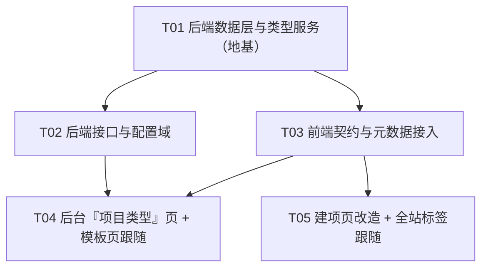

# 架构设计 · 项目类型后台可配置

> 版本：v1　日期：2026-09-11
> 上游输入：`docs/项目分类重构-草案.md`（设计已定稿）、`docs/项目类型可配置-PRD.md`
> 产出人：架构师（software-architect）　范围：**仅设计，不含业务代码**
> 配套图：`docs/项目类型可配置-class-diagram.mermaid`、`docs/项目类型可配置-sequence-diagram.mermaid`

---

## 0. 现状核实结论（落笔前已逐项核对源码 + 实测库）

| 项 | 实测结论 | 对设计的影响 |
|---|---|---|
| 类型常量 | 后端 `server/config/enums.js#PROJECT_TYPES=['A','B','C','D']`；前端 `web/src/config/enums.ts#PROJECT_TYPES` + `PROJECT_TYPE_LABEL` + `PROJECT_TYPE_SHORT` | 需**双删**，改为表驱动（见 §7 防漂移） |
| `projects.type` 约束 | ⚠ **实测库无 CHECK 约束**（`pm-data/pm.db` 实际 DDL = `type TEXT NOT NULL DEFAULT 'B'`）。`docs/schema.sql` 里的 `CHECK (type IN ('A','B','C'))` 是**过期文档**，非运行时 schema | **无需重建 `projects` 表**即可容纳任意标识（含 `T1/T2…`），风险显著降低 |
| `lifecycle_templates` | 实测列 = `id / project_type / version / name / definition / is_active / created_at`；索引 `idx_lifecycle_templates_type(project_type,is_active)`；**无 CHECK、无「每类型唯一 active」唯一索引**（允许多条 active，建项取 `ORDER BY version DESC LIMIT 1`） | 类型↔模板 **1:1 用「约定 + UI 保证」**，不加 DB 唯一约束（避免破坏版本历史/复制能力） |
| `review_templates` | 已后台可配（表 + `admin.routes.js` CRUD + `assignees` v28）；种子 10 条：`project:A/B/C/_default` + 6 业务类。**缺 `project:D`** | v29 需**补种 `project:D`**，否则 OQ-1 readiness 会挡住 D 类建项 |
| 审批解析链 | `server/services/review.service.js#createReview`：立项 `project:<type>` 回落 `project:_default`；变更 `ccb:<type>` 回落 `ccb`（均为 DB 优先 → 常量兜底） | **保持不动**，仅在建项口加 readiness 闸门（OQ-1），不破坏在途流程 |
| 生命周期种子 | `server/config/lifecycle.js` 四套（TPL-A/B/C/D）→ `seed.js` 幂等写入 | **保持不动**，`project_type` 字段继续承载标识 |
| 建项分类器 | `server/services/classify.service.js`（逐字移植 `web/src/api/mock/rules.ts#classifyProject`）；路由 `POST /api/projects/classify`；前端 `ProjectCreatePage` 有「分类判定」步 | 本轮**整链移除**（推荐/特征勾选/覆盖理由），见 §4、§6 |
| 角色目录先例 | `roles` 表 + `server/config/roles-catalog.js` 出生种子 + `server/services/roleCatalog.js` 运行时读表 | 新 `project_types` **照此分层**（唯一真相源=表，出生种子=常量），不引入第二套机制 |
| 权限点 | `admin:template`（= admin/management/pmo），`admin:user:role`（= admin/cho） | 项目类型 CRUD 复用 **`admin:template`**（模板同为「流程配置」域，R11 语义吻合） |
| 建项向导 | `web/src/pages/projects/ProjectCreatePage.tsx`：5 步（基本信息→分类判定→里程碑规划→团队组建→确认提交） | 移除「分类判定」步 → **4 步**，类型单选并入「基本信息」步 |
| 类型标签消费点 | `ProjectListPage` / `ProjectOverviewPage` / `WorkbenchPage` / `ProjectLayout` / `MetricsPage` / `AdminTemplatesPage` 共 6 处静态引用 `PROJECT_TYPE_LABEL/SHORT/PROJECT_TYPES` | 全部改走运行时 `useProjectTypes()`（否则新类型「无标签」） |

---

## 一、实现方案

### 1.1 核心难点与对策

| 难点 | 对策 |
|---|---|
| 类型从常量 → 实体，但**存量 A/B/C/D 项目不能失效** | 标识沿用 `A/B/C/D`，把 4 类作为**初始数据**写入 `project_types`；模板绑定沿用既有 `lifecycle_templates.project_type` 与 `review_templates.key='project:<标识>'` 约定 → **零数据迁移、零表重建** |
| 「类型↔模板 1:1」但系统本支持同类型多模板/版本 | 1:1 由**类型编辑页的 UI 约定**保证（每类型只维护「当前生效」一套），DB 不加唯一约束，保留版本/复制能力（简单够用） |
| OQ-1「未配模板/审批流 → 阻止建项」如何不破坏存量 | 在 `createProject` 入口加 **readiness 闸门**（校验：类型启用 + 有 active 生命周期模板 + 有 `project:<标识>` 立项流）；v29 补齐 `project:D`，使 A/B/C/D 全通过 |
| 前后端各一份常量会漂移 | 前端**删除** `PROJECT_TYPE_LABEL/SHORT/PROJECT_TYPES`，唯一来源 = `GET /api/meta/project-types`；后端删 `enums.PROJECT_TYPES`，唯一来源 = `project_types` 表 |
| 停用类型的历史项目仍要显示原类型名（OQ-2） | `/meta/project-types` **返回全部类型（含停用）**，页面按 `enabled` 过滤下拉、按 code 解析标签；停用项在项目详情打「已停用」标记 |

### 1.2 选型（尽量用现有栈，零新依赖）

- **后端**：Node/Express + better-sqlite3（现有）。新增 1 个 service 模块、1 个迁移、若干 route。**不引入新依赖**。
- **前端**：Vite + React + MUI + TS（现有）。新增 1 个管理页、1 个 hook、若干契约方法。**不引入新依赖**。
- **架构模式**：沿用现有分层 —— `routes（校验/信封）` → `services（事务/业务，零 Express 依赖）` → `dal（迁移/种子）`；前端沿用 `api/client（http|mock 双实现）` + `hooks` + `pages`。
- **表驱动分层（照 `roles` 先例）**：`project_types` 表 = 唯一真相源；`server/config/project-types-catalog.js` = 出生种子（仅空库首次 INSERT OR IGNORE，绝不覆盖后台改动）。

---

## 二、文件清单

### 2.1 新增

| 文件 | 说明 |
|---|---|
| `server/config/project-types-catalog.js` | 初始 4 类的**出生种子**（照 `roles-catalog.js` 风格），仅 v29 首次种入 |
| `server/services/projectType.service.js` | 类型读取/校验/标识生成/克隆 的单一访问层（**照 `roleCatalog.js` 风格**；读取为实时查表，不缓存） |
| `web/src/pages/admin/AdminProjectTypesPage.tsx` | 管理后台「项目类型」页（列表 + 新增/克隆 + 编辑抽屉：基本信息/生命周期模板/审批流） |
| `web/src/hooks/useProjectTypes.ts` | 运行时类型目录（`/meta/project-types`）+ `labelOf/shortOf/enabledTypes` + 模块级缓存，替代前端常量 |
| `docs/项目类型可配置-class-diagram.mermaid` | 类图（抽离） |
| `docs/项目类型可配置-sequence-diagram.mermaid` | 时序图（抽离） |

### 2.2 修改（后端）

| 文件 | 改动要点 |
|---|---|
| `server/dal/migrations.js` | 追加 **v29**：建 `project_types` + 种入 A/B/C/D + 补种 `project:D`（追加到 `MIGRATIONS`，不改已发布项） |
| `server/config/enums.js` | **删除** `PROJECT_TYPES`（去常量；补注释指向 `project_types` 表）；删除 `CLASSIFY_AMOUNT_THRESHOLD` 的剩余引用 |
| `server/services/project.service.js` | `assertCreatePayload` 类型校验改查表；`createProject` 加 readiness 闸门 + 去掉 `classifyService`；`getLifecycleTemplate`/`listActiveTemplateOptions` 去掉 `enums.PROJECT_TYPES` 守卫；`updateProjectBasic` 类型校验改查表 |
| `server/services/classify.service.js` | **删除**（连同文件） |
| `server/services/dashboard.service.js` | `enums.PROJECT_TYPES.indexOf(q.type)` → 放宽为「非空字符串即接受过滤」 |
| `server/routes/admin.routes.js` | 新增 `project-types` CRUD；把 `const PROJECT_TYPES=['A','B','C','D']`（生命周期模板建/改校验）改为查 `project_types` |
| `server/routes/meta.routes.js` | 新增 `GET /api/meta/project-types`（返回全部类型含停用，`requireAuth`） |
| `server/routes/projects.routes.js` | **删除** `POST /projects/classify` 路由 + `classifyService` require |
| `server/lib/errors.js` | 新增 `E_TYPE_NOT_CONFIGURED`（409）、`E_TYPE_DISABLED`（400） |

### 2.3 修改（前端）

| 文件 | 改动要点 |
|---|---|
| `web/src/types/project.ts` | `ProjectType` 收敛为 `type ProjectType = string`；新增 `ProjectTypeEntity`；删 `ClassifyInput/ClassifyResult`；`CreateProjectPayload` 去掉 `classify*`；`Project` 保留 `classify*` 只读字段（兼容 mapper 返回值） |
| `web/src/api/contract.ts` | `ApiClient` 加 `listProjectTypes()` / `createProjectType()` / `updateProjectType()`；删 `classify()` |
| `web/src/api/http.ts` | 实现上述 3 个方法（`/meta/project-types`、`/admin/project-types`）；删 `classify` |
| `web/src/api/mock/index.ts` | mock 同步实现（类型目录来自本地常量）；删 classify mock |
| `web/src/config/enums.ts` | **删除** `PROJECT_TYPES/PROJECT_TYPE_LABEL/PROJECT_TYPE_SHORT`；删除 `CLASSIFY_AMOUNT_THRESHOLD` 引用 |
| `web/src/config/routes.ts` | 加 `adminProjectTypes: '/admin/project-types'` |
| `web/src/config/adminTabs.ts` | 加 Tab `{ key:'projectTypes', label:'项目类型', path:ROUTES.adminProjectTypes, action:'admin:template' }` |
| `web/src/router/index.tsx` | 加 `/admin/project-types` 路由（`AdminPageGuard action="admin:template"`） |
| `web/src/pages/admin/AdminTemplatesPage.tsx` | 新增弹窗「适用分类」由写死 `MenuItem value="A".."D"` 改为 `useProjectTypes().types` 遍历；「适用分类」列用 `labelOf()` |
| `web/src/pages/projects/ProjectCreatePage.tsx` | 删「分类判定」步与特征勾选/推荐/覆盖理由；类型改**启用中列表单选**（名称+例子）；步骤 5→4 |
| `web/src/pages/projects/ProjectOverviewPage.tsx` | 类型标签走 `labelOf()`；类型下拉跟随启用列表；停用类型显示「已停用」标记（OQ-2） |
| `web/src/pages/projects/ProjectListPage.tsx` | 类型标签/筛选项走 `useProjectTypes()` |
| `web/src/pages/WorkbenchPage.tsx` / `web/src/components/layout/ProjectLayout.tsx` / `web/src/pages/MetricsPage.tsx` | 类型标签走 `labelOf()`/`shortOf()`；Metrics 的类型分布维度取 `types` |

---

## 三、数据模型与接口契约

### 3.1 新表 `project_types`（迁移 v29）

```sql
CREATE TABLE IF NOT EXISTS project_types (
  code       TEXT PRIMARY KEY,                 -- 标识：内置 A/B/C/D；新增 T1/T2…（系统生成，创建后不变）
  name       TEXT NOT NULL,                    -- 名称（可改，如「基建类」）
  example    TEXT NOT NULL DEFAULT '',         -- 例子/说明（可改，建项时辅助识别）
  enabled    INTEGER NOT NULL DEFAULT 1,       -- 启用：0=停用（建项不可选，历史项目保留）
  order_no   INTEGER NOT NULL DEFAULT 0,       -- 排序（升序；新增默认排到末尾）
  created_at TEXT NOT NULL,
  updated_at TEXT NOT NULL
);
CREATE INDEX IF NOT EXISTS idx_project_types_enabled ON project_types(enabled, order_no);
```

- **5 个业务字段** = 标识 / 名称 / 例子 / 启用 / 排序（贴合决策 1）；`created_at/updated_at` 为内部记账列，不上屏。
- **不删只停**：只提供 `enabled` 切换，无 DELETE。
- **标识生成规则（OQ-5，架构定）**：`T` + 自增整数（首位新类型 = `T1`）。
  规则：扫描现有 `code` 匹配 `^T(\d+)$` 取最大 `N`，下一个 = `N+1`（默认从 1 起）。
  **稳定 + 创建后不变**；与内置 `A/B/C/D`（不匹配 `^T\d+$`）**天然不冲突**。生成后写入且永不重算。

### 3.2 与既有表的关联（沿用既有约定，不新增第二机制）

| 关联 | 承载方式 | 说明 |
|---|---|---|
| `project_types` ↔ `projects` | `projects.type` = `project_types.code`（**逻辑外键，不加 DB FK**） | 存量 A/B/C/D 行原样有效；新增类型写入其 `code` 即可。停用不影响历史行 |
| `project_types` ↔ 生命周期模板 | `lifecycle_templates.project_type` = `code`，`is_active=1` 为「当前生效」 | **沿用现状**；1:1 由类型编辑页 UI 保证（每类型维护一条 active） |
| `project_types` ↔ 审批流 | `review_templates.key = 'project:'+code`（立项）与 `'ccb:'+code`（变更） | **沿用现状**；解析链 `createReview` 零改动 |
| 初始数据 | `server/config/project-types-catalog.js` → v29 `INSERT OR IGNORE` | 照 `roles-catalog.js` 分层：种子只在空库/首次迁移落，后台改动不被覆盖 |

**初始 4 类种子（OQ-4 文案照草案）**

| 标识 code | 名称 name | 例子 example | enabled | order_no | 关联的既有模板 |
|---|---|---|---|---|---|
| `A` | 载荷产品类 | 计算 / 网络 / 存储 | 1 | 1 | TPL-A（交付型 7 碑）；`project:A` |
| `B` | 软件产品类 | 平台 / 应用 | 1 | 2 | TPL-B（产品型 Sprint）；`project:B` |
| `C` | 基建类 | 卫星 / 地面站 / 激光 | 1 | 3 | TPL-C（基建型 5 碑）；`project:C` |
| `D` | 通用类 | 行政 / 人力 / 其他 | 1 | 4 | TPL-D（通用轻量 3 碑）；`project:D`（v29 补种） |

> ⚠ 名称↔标识的**配对**为架构判断（草案只给了 4 组「名称+例子」，未点名对应字母）。配对原则 = 保持标识→既有模板语义不变（C=基建型→基建类、D=通用轻量→通用类、A=交付型→载荷产品类、B=产品型→软件产品类）。名称始终可在后台改，故风险低。**需业务方确认（见 §9-风险 R1）。**

### 3.3 新增错误码

```
E_TYPE_NOT_CONFIGURED  (409)  所选类型尚未配置生命周期模板或立项审批流（OQ-1：阻止建项并提示）
E_TYPE_DISABLED        (400)  所选类型已停用，不可用于新建项目
```

### 3.4 REST 端点设计（新）

| 方法 | 路径 | 权限 | 入参 | 出参 | 说明 |
|---|---|---|---|---|---|
| GET | `/api/meta/project-types` | `requireAuth` | — | `ProjectTypeEntity[]`（**含停用**） | 建项下拉 / 全站标签解析；前端按 `enabled` 过滤 |
| GET | `/api/admin/project-types` | `admin:template` | — | `ProjectTypeEntity[]` | 后台列表（按 `order_no` 升序） |
| POST | `/api/admin/project-types` | `admin:template` | `{ name, example?, cloneFrom? }` | `ProjectTypeEntity` | 生成 `code`；`cloneFrom` 时克隆生命周期模板 + 审批流（`project:`/`ccb:`） |
| PUT | `/api/admin/project-types/:code` | `admin:template` | `{ name?, example?, orderNo?, enabled? }` | `ProjectTypeEntity` | 部分更新；`code` 不可改 |

**`ProjectTypeEntity`（API 形态）**
```jsonc
{ "code": "T1", "name": "预研类", "example": "技术预研 / 概念验证",
  "enabled": true, "orderNo": 5, "createdAt": "...", "updatedAt": "..." }
```

**POST 克隆语义（R9 / PRD §5.3）**：仅克隆 ①生命周期模板（`definition` 整包，新 `id`、`project_type=新code`、`is_active=1`）②审批流 `project:<src>`→`project:<新>`、`ccb:<src>`→`ccb:<新>`（新 key，`chain/assignees` 照抄）。**不克隆**标识、不迁移任何项目引用；克隆后互不影响。

**错误码**：`E_VALIDATION`（字段非法 / `name` 空 / `orderNo` 非数字）；`E_CONFLICT`（理论上 code 冲突，兜底）；`E_NOT_FOUND`（PUT 目标 code 不存在）。

### 3.5 对既有链路的最小改动

| 端点 / 函数 | 现状 | 改动 |
|---|---|---|
| `GET /api/meta/templates/:type`、`GET /api/meta/templates/options?type=` | 守卫 `enums.PROJECT_TYPES.indexOf(type)<0 → null/[]` | 去掉 enum 守卫，改按 `project_type` 查（任意标识可查） |
| `POST /api/admin/templates`（建生命周期模板） | 校验 `PROJECT_TYPES=['A','B','C','D']` | 改为校验 `project_types` 表存在该 `code`（含停用的新类型也要能配模板） |
| `POST /api/admin/review-templates`（建审批模板） | key 自由文本 | 无需改（新类型用 `project:<code>`） |
| `project.service#createProject` | `assertOverrideReason` + 取 active 模板 | 去掉 classify 调用；模板选择逻辑不变；**新增 readiness 闸门**（见 §5） |
| `project.service#updateProjectBasic` | `enums.PROJECT_TYPES.indexOf(b.type)<0` 拒绝 | 改为查 `project_types` 存在该 code |
| `POST /api/projects/classify` | 存在 | **删除** |
| `review.service#createReview` | `project:<type>` → `_default` | **不改**（readiness 已在建项口把关；保留兜底以护在途流程） |

---

## 四、前端改动点

### 4.1 新增「项目类型」管理页 `AdminProjectTypesPage.tsx`

- **列表**（`DataTable`）：名称 / 例子 / 启用（Switch，走 `updateProjectType`）/ 排序（上移下移或输入 `orderNo`）/ 关联模板摘要（生命周期「M 碑 / N 门」+ 审批链节点数）—— 数据来自 `listProjectTypes()` 与既有 `listTemplates()`/`listReviewTemplates()` 的组合。
- **新增弹窗**：`name`（必填）/ `example`（选填）/ `cloneFrom`（下拉：现有类型，含「空白起步」）。提交 `createProjectType`。
- **编辑抽屉**（三块，对齐草案 §四）：
  1. **基本信息**：名称 / 例子 / 排序 / 启用开关 → `updateProjectType`。
  2. **生命周期模板**：复用既有 `TemplateEditorDialog`（`web/src/components/admin/TemplateEditorDialog.tsx`）——进入时按 `lifecycle_templates.project_type=code` 找 active 模板；无则提示「尚未配置」并提供「空白新建 / 从其他类型克隆」；有则直接打开编辑器。1:1 由「该类型只呈现一条当前模板」保证。
  3. **审批流**：内嵌两段（立项 `project:<code>`、变更 `ccb:<code>`），复用既有审批模板编辑能力（`AdminReviewTemplatesPage` 的弹窗逻辑抽为可复用组件或在抽屉内镜像）；缺失则「一键创建默认链」。
- **停用**：Switch 切换 `enabled`；停用不删、不触碰历史项目。

### 4.2 `AdminTemplatesPage` 类型下拉跟随类型列表

- 删除写死的 `<MenuItem value="A">A 类（交付型）</MenuItem> …`，改 `useProjectTypes().types.map(t => <MenuItem value={t.code}>{t.name}</MenuItem>)`。
- 「适用分类」列由 `PROJECT_TYPE_LABEL[t.projectType]` 改 `labelOf(t.projectType)`。
- 页面副标题去掉「A/B/C/D 四类」硬编码措辞。

### 4.3 建项页 `ProjectCreatePage` 改造

- **移除**：`import { classifyProject }`、`api.classify` 调用、`classifyResult/classifyInput/isOverride/overrideReason` 状态、`renderClassify` 整个「分类判定」步、特征勾选框、系统建议 Alert、覆盖理由输入。
- **步骤**：`['基本信息','里程碑规划','团队组建','确认提交']`（4 步）；`collectErrors` 去掉 `overrideReason` 分支与步骤回跳映射。
- **类型单选**：在「基本信息」步顶部加「项目类型（单选）」——数据源 `useProjectTypes().enabledTypes`，每项展示 `名称`（`example` 作辅助说明/`helperText`）。默认选中第一条启用类型（或保留 B 作为默认，视业务）。
- **里程碑步**：逻辑保留（按所选 `type` 拉 `listTemplateOptions(type)`），仅去掉分类相关 key。
- **提交 payload**：去掉 `classifyInput/classifySuggested/classifyOverrideReason`。

---

## 五、程序调用流程（建项：选类型 → 解析生命周期模板 + 审批流）

> 详见 `docs/项目类型可配置-sequence-diagram.mermaid`。

**A. 加载建项表单**
1. `ProjectCreatePage` → `GET /api/meta/project-types` → 返回全部类型（含停用）；页面过滤 `enabled` 得下拉选项。
2. 用户选类型 `code` → `GET /api/meta/templates/options?type=<code>` → 该类型启用中的生命周期模板（版本倒序）。

**B. 提交建项（readiness 闸门 = OQ-1）**
3. `POST /api/projects` → `project.service#createProject`：
   a. `assertCreatePayload`：`type` 必须存在于 `project_types` 且 `enabled=1`（否则 `E_TYPE_DISABLED`）。
   b. **`assertTypeReadyForCreate(db, code)`**：
      - 无 active 生命周期模板 → `E_TYPE_NOT_CONFIGURED`（`missing:['lifecycleTemplate']`，提示「请先在后台为该类型配置生命周期模板」）；
      - 无 active `project:<code>` 立项流 → `E_TYPE_NOT_CONFIGURED`（`missing:['reviewTemplate']`）。
   c. 事务落库：项目 + 成员 + 里程碑（+ 门/检查项）+ 按模板 `skeleton` 生成 WBS 骨架；**不再写 classify_\* 语义值**（列保留，写空/默认）。
4. 返回 `Project`；前端跳概览。

**C. 发起立项审批（解析审批流）**
5. 概览页「发起立项审批」→ `POST /api/reviews`（`reviewType='project'`）→ `review.service#createReview`：
   `project:<code>`（DB，`active=1`）→ 命中即用其 `chain/mode/assignees` 生成审批步骤；未命中回落 `project:_default`（在途/历史兜底）。
6. 审批步骤由 `buildSteps`（角色/固定审批人绑定）落库，进入审批中心。

**D. 变更审批**：`ccb:<code>` → 回落 `ccb`（不变）。

---

## 六、任务分解（供工程师逐个实现，按依赖顺序，共 5 个）

> 分组原则：按**功能模块**聚合，不按单文件拆；每个任务 ≥3 个相关文件；尽量让 T03/T04/T05 只依赖 T01/T02。

| 任务 ID | 任务名 | 源文件（新建/修改） | 依赖 | 优先级 |
|---|---|---|---|---|
| **T01** | **后端数据层与类型服务（地基）** | `server/dal/migrations.js`（v29）、`server/config/project-types-catalog.js`（新）、`server/services/projectType.service.js`（新）、`server/config/enums.js`（删 `PROJECT_TYPES`）、`server/lib/errors.js`（加 2 码）、`server/services/project.service.js`（查表校验 + readiness 闸门 + 去 classify）、`server/services/dashboard.service.js`（放宽 type 过滤） | — | P0 |
| **T02** | **后端接口与配置域** | `server/routes/admin.routes.js`（类型 CRUD + 模板校验改查表）、`server/routes/meta.routes.js`（`/meta/project-types`）、`server/routes/projects.routes.js`（删 classify 路由）、`server/services/classify.service.js`（删除） | T01 | P0 |
| **T03** | **前端契约与元数据接入** | `web/src/types/project.ts`、`web/src/api/contract.ts`、`web/src/api/http.ts`、`web/src/api/mock/index.ts`、`web/src/hooks/useProjectTypes.ts`（新）、`web/src/config/enums.ts`（删常量）、`web/src/config/routes.ts`、`web/src/config/adminTabs.ts` | T01 | P0 |
| **T04** | **管理后台「项目类型」页 + 模板页跟随** | `web/src/pages/admin/AdminProjectTypesPage.tsx`（新）、`web/src/pages/admin/AdminTemplatesPage.tsx`、`web/src/router/index.tsx`、（可选）复用 `web/src/components/admin/TemplateEditorDialog.tsx` | T02, T03 | P0 |
| **T05** | **建项页改造 + 全站标签跟随 + 停用标记** | `web/src/pages/projects/ProjectCreatePage.tsx`、`web/src/pages/projects/ProjectOverviewPage.tsx`、`web/src/pages/projects/ProjectListPage.tsx`、`web/src/pages/WorkbenchPage.tsx`、`web/src/components/layout/ProjectLayout.tsx`、`web/src/pages/MetricsPage.tsx` | T03 | P0 |

**任务说明**
- **T01** 是一切的地基：迁移落地 `project_types` + 初始种子 + `project:D` 补种；`projectType.service` 提供 `getType/listTypes/listEnabled/nextTypeCode/assertTypeReadyForCreate`。**验收**：跑一次 `db.js` 启动，`schema_migrations` 到 v29，`project_types` 有 4 行，`review_templates` 含 `project:D`；现有 11 个项目仍可 `getProject`/建项。
- **T02** 只暴露 HTTP 能力，不改判定口径；`classify` 路由/服务在本任务物理移除（前后端在同批去引用，避免悬挂）。
- **T03** 纯前端契约；`useProjectTypes` 用模块级缓存 + 首次拉取，`labelOf/ shortOf` 对未知 code 兜底显示 code 原文。
- **T04** 依赖 T02（写接口）与 T03（hook/契约）。
- **T05** 只依赖 T03（读接口 + hook），与 T04 可并行。

---

## 七、共享知识 / 跨文件约定（防前后端漂移）

1. **唯一真相源**：项目类型 = DB `project_types` 表。
   - 后端：**删除** `server/config/enums.js#PROJECT_TYPES`；所有类型校验经 `server/services/projectType.service.js`。
   - 前端：**删除** `PROJECT_TYPE_LABEL / PROJECT_TYPE_SHORT / PROJECT_TYPES`；一律经 `web/src/hooks/useProjectTypes.ts`（数据源 `GET /api/meta/project-types`）。
   - 出生种子：`server/config/project-types-catalog.js`（仅 v29 首次落库，不动后台改动）。
2. **标识格式**：`code` ∈ `A/B/C/D`（内置）∪ `^T\d+$`（系统生成）。**创建后不可改**；前端无该字段输入框。
3. **审批 key 约定**：立项 = `project:<code>`；变更 = `ccb:<code>`。新增类型即新增这两个 key，**不改代码**。
4. **生命周期绑定约定**：`lifecycle_templates.project_type = <code>`；`is_active=1` 为当前生效；类型编辑页只维护一条 active（1:1）。
5. **停用语义**：`enabled=0` → 建项下拉排除、可重启用（OQ-3）；历史项目 `projects.type` 不变、标签仍可解析、审批/模板继续按创建时绑定流转；详情页展示「已停用」标记（OQ-2）。
6. **`projects.type` 无 CHECK**（已实测）：允许写入 `T1/T2…`，**无需重建表**。`docs/schema.sql` 的 CHECK 是过期文档，不作为约束依据（可在后续文档清理时同步）。
7. **错误码**：`E_TYPE_NOT_CONFIGURED`(409) / `E_TYPE_DISABLED`(400) 新增；前端 `ERROR_MESSAGE_ZH` 需补对应中文兜底文案。
8. **响应信封**：一律 `{code,data,message}`（`ok()`/`AppError`），**禁 snake_case**（`toApi*` 映射 `order_no→orderNo`）。
9. **枚举清理**：`CLASSIFY_AMOUNT_THRESHOLD` 随分类器一并移除；`ProjectType` 前端类型收敛为 `string`（union 收窄，保证既有注解可编译）。
10. **权限**：类型 CRUD 全部用 `admin:template`（与生命周期/审批模板同域）；`/meta/project-types` 仅 `requireAuth`（建项页非管理员也要读）。

---

## 八、任务依赖图



---

## 九、风险与待明确事项

| # | 类别 | 事项 | 影响 | 建议 |
|---|---|---|---|---|
| **R1** | ⚠ 待业务拍板 | **名称↔标识配对**：草案给了 4 组「名称+例子」但未点名对应 A/B/C/D。本设计配对为 A=载荷产品类、B=软件产品类、C=基建类、D=通用类（保持标识→既有模板语义不变） | 若业务期望别的配对，则现有 A/B/C/D 项目显示的「类型名」会与预期不符 | 开工前请业务方 30 秒确认；因名称可后台改，**不阻塞** T01/T02 |
| **R2** | 设计取舍 | 「类型↔模板 1:1」**无 DB 唯一约束**，靠 UI 保证；若有人绕过 UI 直接 `POST /admin/templates` 造第二条同类型 active 模板，则存在「多 active」 | 建项取 `version DESC` 最新，行为可预期但不严格 1:1 | 本轮接受（简单够用）；如需强约束再评估加部分唯一索引 |
| **R3** | 兼容性 | OQ-1 readiness 要求 `project:<code>` 存在；**存量 D 类靠 `_default` 兜底**，v29 补种 `project:D` 才通过 | 若漏补种，D 类建项会被 `E_TYPE_NOT_CONFIGURED` 挡住 | v29 必须包含 `project:D` 补种（已在 §3.1/T01 明确）；建议同时补 `ccb:D` 保持对称（非必需） |
| **R4** | 迁移/文档 | `docs/schema.sql` 含过期 `CHECK`；`web/src/api/mock/fixtures/*` 仍写死 A/B/C/D | 仅影响 Mock 模式与文档一致性 | 本轮确保 mock 类型目录与真后端同构；文档 CHECK 后续清理 |
| **R5** | 前端 | 6 处静态 `PROJECT_TYPE_LABEL/SHORT` 若漏改 → 新类型「标签 undefined」 | 新增类型在列表/概览显示空白 | T05 覆盖全部 6 处（已列全）；QA 需专门验证「新增类型 T1 后各页标签正常」 |
| **R6** | OQ-1 边界 | OQ-1 建议「阻止」与 PRD §5.4「需先配置**或使用默认**」措辞略有张力 | 若业务更想要「允许走默认」，需把闸门从「阻断」改为「警告 + 允许」 | 本设计按团队指令取**阻止**；如业务改口，仅需把 `assertTypeReadyForCreate` 从抛错改为返回 warning 列表（改动面小） |
| **R7** | 数据 | **存量迁移明确不做**（业务方定调）；本设计不触碰任何 `projects.type` 重写 | 若未来要归并旧类型，需另立需求 | 遵从非目标，不展开 |
| **R8** | 审计 | 类型变更审计（R12/P2）、停用影响面提示（R13/P2）本轮不做 | 后台无变更留痕 | 已在 PRD 标 P2；后续可在类型 CRUD 旁路 `writeAudit` 补齐 |

---

## 十、类图与接口一览（详见抽离的 mermaid 文件）

- **类图** `docs/项目类型可配置-class-diagram.mermaid`：`ProjectType`（实体）、`LifecycleTemplate`、`ReviewTemplate`、`Project` 的字段与关联；`ProjectTypeService`（`getType/listTypes/listEnabled/nextTypeCode/assertTypeReadyForCreate/createType/updateType/cloneType`）；`ProjectService.createProject` 与新闸门的关系；`ReviewService.createReview` 的 key 解析。
- **时序图** `docs/项目类型可配置-sequence-diagram.mermaid`：建项「选类型 → 解析生命周期模板 + 审批流」的完整调用序（含 readiness 闸门与错误分支）。
