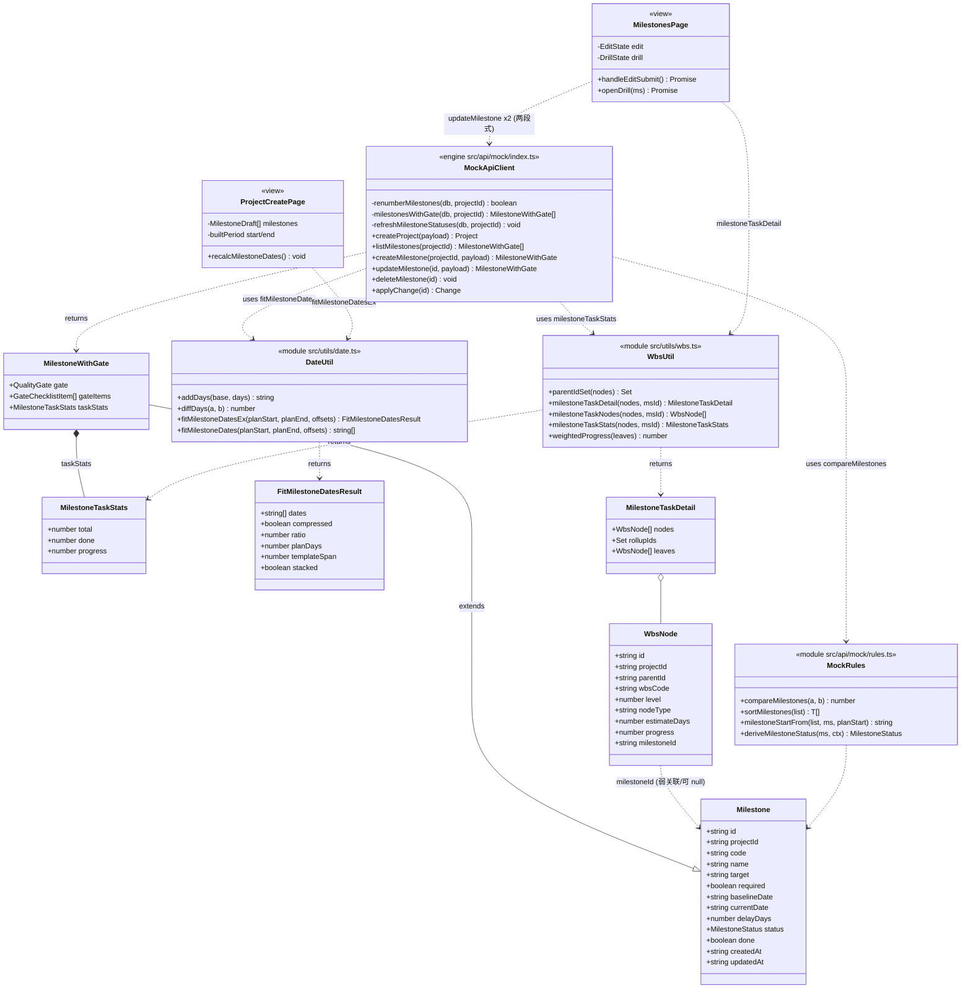
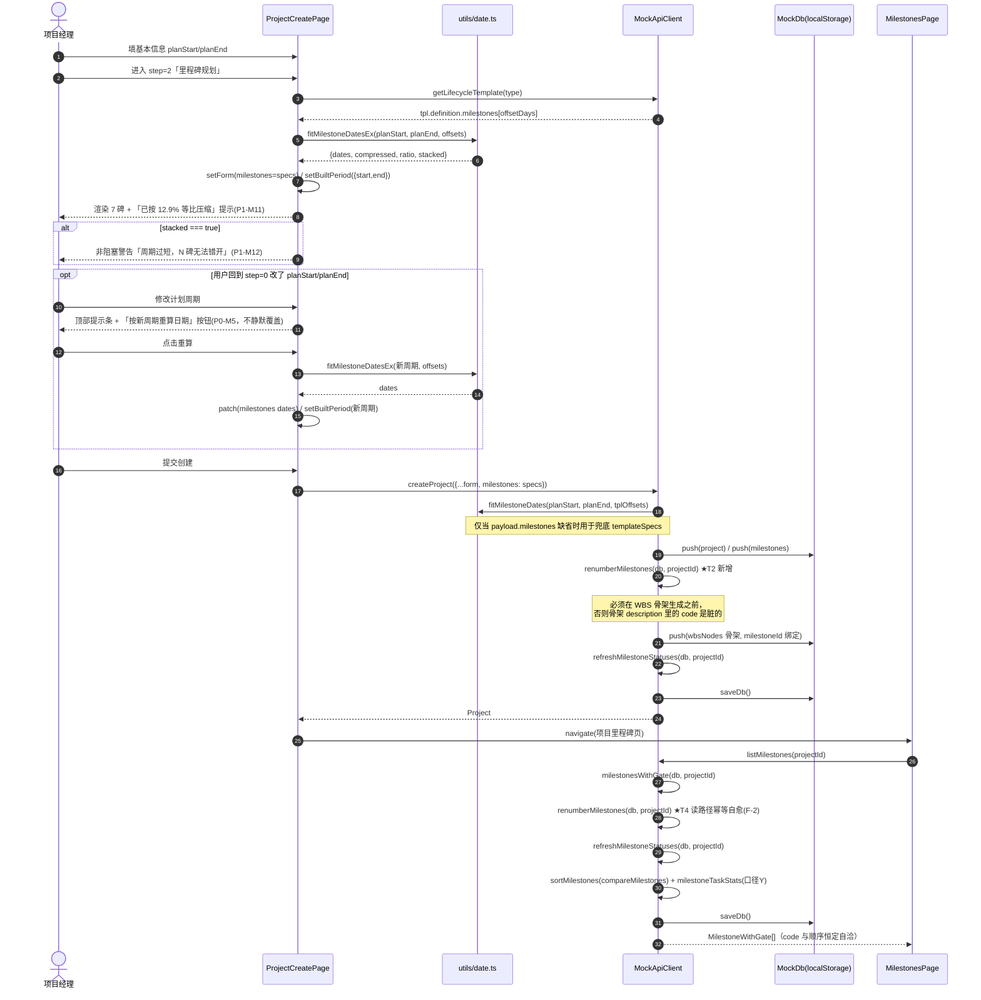
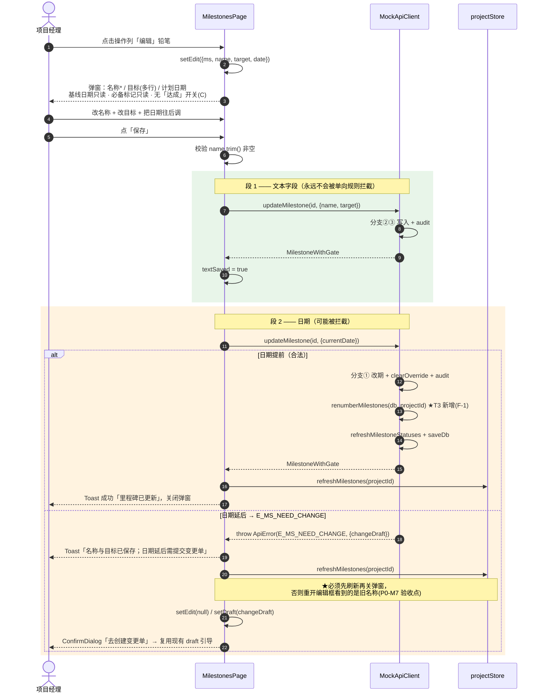
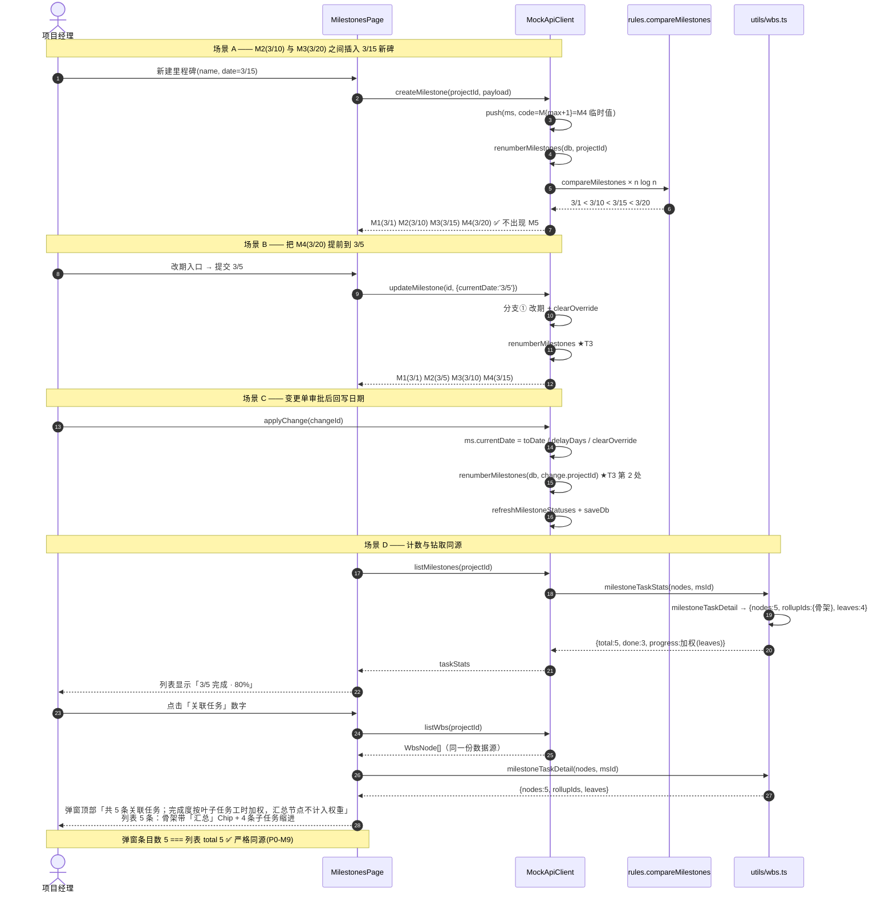
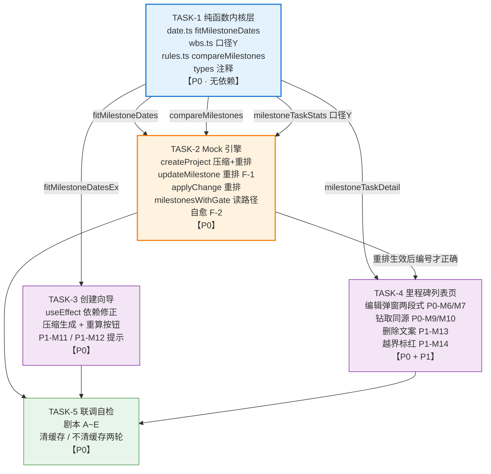

# 增量系统设计 · 里程碑模块 4 项用户反馈修复

| 项 | 内容 |
| --- | --- |
| 文档类型 | 增量系统设计 + 任务分解（Delta Design） |
| 产品 | 太空字节 · 太空数据中心项目管理系统（pm-app / web） |
| 作者 | 高见远（架构师） |
| 版本 | v1.0 |
| 输入 | 《增量 PRD · 里程碑模块 4 项用户反馈修复》v1.0（许清楚） |
| 架构基线 | 方案一·极简（Milestone 为唯一时间轴；WBS 仅 task / subtask） |
| 技术栈 | Vite + React + TypeScript + MUI + Tailwind + Zustand（Mock 引擎 `VITE_USE_MOCK=true`） |

---

## 0. 核实说明（我读了哪些代码）

本设计前，我逐行读取并核实了：`docs/delta-prd-milestone-fixes.md`（主输入）、`src/api/mock/index.ts`（2103 行，重点 L205-290 聚合层 / L560-700 `createProject` / L900-1106 里程碑 CRUD / L1921-1956 `applyChange`）、`src/utils/wbs.ts`（242 行，`milestoneTaskNodes` L116-133、`milestoneTaskStats` L139-146、`weightedProgress` L100-106）、`src/api/mock/rules.ts`（`sortMilestones` L315-320、`milestoneStartFrom` L307-312）、`src/pages/projects/MilestonesPage.tsx`（658 行，columns L255-447、`openDrill` L222-231）、`src/utils/date.ts`（98 行）、`src/pages/projects/ProjectCreatePage.tsx`（808 行，里程碑 useEffect L185-219、里程碑步骤 UI L663-757、提交映射 L360-370）、`src/api/contract.ts`（L95-128）、`src/types/project.ts`（L209-266）、`src/api/mock/fixtures/templates.ts`（A 类 offsets `0/30/70/125/170/210/232`）。

**PRD 全部结论与我核实的代码事实一致，并额外确认了 3 处 PRD 未点名但必须处理的细节**：

| 编号 | 新发现（代码级） | 影响 |
| --- | --- | --- |
| **F-3** | `rules.ts:315` 的 `sortMilestones` **tie-break 用的是 `code`**，而 `code` 又由 `renumberMilestones` 按排序结果反写 —— 这是一条 **`sort → code → sort` 的循环依赖**。同日里程碑的顺序会因 code 的历史脏值而抖动，且列表顺序与编号可能自相矛盾。必须把 tie-break 换成与 code 无关的稳定键。 | P0-M3 |
| **F-4** | `createProject`（`index.ts` L618-648）给同一批里程碑写入的 `createdAt` 是**同一个 `ts`**，因此「同日按 createdAt 升序」在默认里程碑之间**完全无法区分**。比较函数必须有第三级 tie-break。 | P0-M3 |
| **F-5** | 引擎 `updateMilestone` 的处理顺序是 ①`currentDate` → ②`name` → ③`target`（L1017-1057），日期分支在 L1020 **直接 `throw`**。因此单次提交 `{name,target,currentDate}` 时，只要日期被 `E_MS_NEED_CHANGE` 拦截，**②③ 根本不会执行**——PM 的两段式提交（P0-M7）不是体验优化，而是**功能正确性的硬性前提**。 | P0-M7 |

结论：**本次改动全部落在前端 + Mock 引擎，无契约破坏、无新增依赖包、无框架变更。**

---

## 1. 实现方案概述与选型

### 1.1 核心难点

| 难点 | 本质 | 解法 |
| --- | --- | --- |
| D1 编号与顺序自洽 | `sort` 与 `renumber` 各用一套比较逻辑，且互相依赖（F-3） | 抽出**唯一比较函数** `compareMilestones`，两者共用；tie-break 与 `code` 彻底解耦 |
| D2 重排触发面不全 | 4 个写路径缺口 + 存量脏数据无自愈通道（F-1 / F-2） | 写路径补齐 3 处 + **读路径幂等自愈** 1 处，共 6 个触发点 |
| D3 日期压缩的边界正确性 | 等比压缩后可能出现 0 偏移、同日、越界三类退化 | 单一纯函数 `fitMilestoneDates` 内做「压缩 → 非首碑保底 → 单调化 → 封顶」四道流水线，**可单测、可复用**（向导与引擎共用） |
| D4 计数口径漂移 | 集合定义混在统计函数里，钻取与计数各算各的 | 引入 `milestoneTaskDetail` 作为**唯一真源**，`milestoneTaskNodes` / `milestoneTaskStats` / 钻取 UI 全部从它派生 |
| D5 编辑被日期规则整单拦截 | 引擎串行处理 + 早抛异常（F-5） | 前端**两段式提交**：文本先落库，日期后提交；异常分支必须先 `refreshMilestones` 再弹变更单引导 |

### 1.2 选型

**沿用现状，零新增依赖**。理由：
- 日期运算已有 `dayjs`（`src/utils/date.ts` 已 `addDays` / `diffDays`），压缩算法只需整数运算 + `Math.round`，无需 `date-fns` 等。
- 集合去重用原生 `Map` / `Set`，里程碑量级 7~15、WBS 节点量级 10²，`O(n log n)` 完全无压力（回执 PM §5.1 的性能问询：**无风险，无需回报**）。
- UI 全部复用既有 `FormDialog` / `ConfirmDialog` / `DataTable` / `StatusChip`，不引入新组件库。

### 1.3 分层落点

```
纯函数层（无副作用、可单测）
  src/utils/date.ts        ← fitMilestoneDates（日期压缩）
  src/utils/wbs.ts         ← milestoneTaskDetail（口径 Y 唯一真源）
  src/api/mock/rules.ts    ← compareMilestones（排序/编号唯一比较函数）
        ↓
引擎层（唯一写入口，Mock DB）
  src/api/mock/index.ts    ← renumberMilestones 6 触发点 + createProject 压缩
        ↓
视图层
  src/pages/projects/ProjectCreatePage.tsx   ← 向导压缩 + 周期变更重算
  src/pages/projects/MilestonesPage.tsx      ← 编辑弹窗 + 钻取同源 + 越界标红
```

**依赖方向严格单向向下**，视图层不得自行实现日期压缩或计数口径。

---

## 2. 文件列表

### 2.1 修改的现有文件（9 个）

| # | 相对路径 | 改动性质 | 改动摘要 |
| --- | --- | --- | --- |
| 1 | `src/utils/date.ts` | **新增函数** | 追加 `FitMilestoneDatesResult` 接口、`fitMilestoneDatesEx()`、`fitMilestoneDates()`；不动现有导出 |
| 2 | `src/utils/wbs.ts` | **改语义** | 新增 `parentIdSet()`、`MilestoneTaskDetail`、`milestoneTaskDetail()`；重写 `milestoneTaskNodes()`（L116-133）与 `milestoneTaskStats()`（L139-146）为其薄封装 |
| 3 | `src/api/mock/rules.ts` | **改内部** | 新增导出 `compareMilestones()`；`sortMilestones()`（L315-320）改为委托给它，泛型约束由 `'currentDate'\|'code'` 改为 `'currentDate'\|'createdAt'\|'id'` |
| 4 | `src/api/mock/index.ts` | **改多处** | `renumberMilestones`（L253-260）改用共用比较函数并返回 `boolean`；`milestonesWithGate`（L237-247）读路径自愈；`createProject`（L599-682）压缩 + 重排 + 骨架顺序；`updateMilestone`（L1017-1039）改期后重排；`applyChange`（L1930-1947）回写后重排 |
| 5 | `src/types/project.ts` | **改注释** | `MilestoneTaskStats` L246-254 三字段注释按口径 Y 修订（**字段名与类型不变**） |
| 6 | `src/pages/projects/ProjectCreatePage.tsx` | **改逻辑 + UI** | `MilestoneDraft` 加 `offsetDays?`；里程碑 useEffect（L185-219）改用压缩；新增 `builtPeriod` 状态与「按新周期重算」提示条；`renderMilestones`（L663-757）加压缩说明与极端告警 |
| 7 | `src/pages/projects/MilestonesPage.tsx` | **加功能** | 新增编辑弹窗（两段式提交）；`openDrill`（L222-231）改用 `milestoneTaskDetail`；钻取弹窗渲染改造；删除确认文案分支；当前计划列越界标红 |
| 8 | `src/api/mock/fixtures/wbs.ts` | **改注释** | L41 注释「子树并集口径」→ 口径 Y 描述（仅注释，防后人误解） |
| 9 | `src/utils/wbs.ts`（注释） | 同 #2 | L108-115 函数头注释重写 |

### 2.2 新增文件（0 个业务文件 + 3 个可选测试文件）

| 相对路径 | 说明 |
| --- | --- |
| `src/utils/__tests__/date.fitMilestoneDates.test.ts` | *可选*，强烈建议：压缩算法 6 组边界用例 |
| `src/utils/__tests__/wbs.milestoneTask.test.ts` | *可选*，强烈建议：口径 Y 集合与加权分离 |
| `src/api/mock/__tests__/renumber.test.ts` | *可选*：比较函数幂等性 + 同日 tie-break |

> 若仓库当前未配置测试框架（未见 vitest 配置），T5 以**手工验收剧本**替代，不阻塞交付；但 `fitMilestoneDates` 的 6 组边界建议至少用一次性脚本跑通。

### 2.3 明确**不动**的文件

`src/api/contract.ts`（`MilestoneUpdatePayload` 已完备，L112-128 不改）、`src/api/http.ts`（真实后端适配层）、`src/api/mock/fixtures/templates.ts`（offsetDays 保持绝对天数，百分比模式是 P2-M17）、`src/stores/projectStore.ts`（`refreshMilestones` 已够用）。

---

## 3. 数据结构与接口设计

### 3.1 `fitMilestoneDates` —— 里程碑日期等比压缩（`src/utils/date.ts`）

#### 3.1.1 签名

```ts
/** 压缩结果（含透明化提示所需的元信息） */
export interface FitMilestoneDatesResult {
  /** 与入参 offsets **同索引对齐**的绝对日期数组 YYYY-MM-DD */
  dates: string[];
  /** 是否发生了压缩（planDays < templateSpan） */
  compressed: boolean;
  /** 压缩比 0~1；未压缩时为 1 */
  ratio: number;
  /** 计划周期天数 = diffDays(planStart, planEnd) */
  planDays: number;
  /** 模板跨度 = max(offsets)；offsets 为空或全 0 时为 0 */
  templateSpan: number;
  /** 是否出现同日堆叠（周期过短，规则 3 无法满足）→ 触发 P1-M12 非阻塞告警 */
  stacked: boolean;
}

/** 主函数：返回完整元信息，供向导做透明化提示 */
export function fitMilestoneDatesEx(
  planStart: string,
  planEnd: string,
  offsets: number[],
): FitMilestoneDatesResult;

/** 薄封装：只要日期数组（引擎侧使用） */
export function fitMilestoneDates(
  planStart: string,
  planEnd: string,
  offsets: number[],
): string[];
```

#### 3.1.2 算法伪码（四道流水线，逐条对应 PRD §4.B 边界规则）

```
function fitMilestoneDatesEx(planStart, planEnd, offsets):

  # ── 0. 防御 ────────────────────────────────────────
  if offsets.length === 0:
      return { dates: [], compressed:false, ratio:1, planDays:0, templateSpan:0, stacked:false }

  planDays     = max(0, diffDays(planStart, planEnd))     # 负周期按 0 处理，绝不抛异常
  templateSpan = max(offsets.map(o => max(0, o)))         # 负 offset 视作 0

  if templateSpan === 0:                                  # 退化：全部同偏移
      return { dates: offsets.map(_ => planStart), compressed:false, ratio:1,
               planDays, templateSpan:0, stacked: offsets.length > 1 }

  compressed = planDays < templateSpan
  ratio      = compressed ? planDays / templateSpan : 1

  # ── 1. 按 offset 升序处理（保留原索引，保证返回值与入参同序）─
  order = indices of offsets sorted ascending by offsets[i]
          # tie-break：offset 相同则按原索引升序，保证确定性

  dayOf  = new Array(offsets.length)
  prev   = -1
  stacked = false

  for i in order:
      off = max(0, offsets[i])

      # 规则：等比压缩（planDays >= templateSpan 时 ratio=1，即不压缩）
      d = round(off * ratio)

      # 规则 2：非首碑不允许被压到 planStart
      if off > 0 and d === 0: d = 1

      # 规则 3：严格单调不减；同日则顺延 1 天
      if d <= prev:
          d = prev + 1

      # 规则 3 后半 + 规则 5：顺延不得超过 planEnd；超出则封顶并标记堆叠
      if d > planDays:
          d = planDays
          if d <= prev: stacked = true          # 已无空间错开 → 允许同日堆叠
      # 注：prev 只能单调上升，封顶后连续多个碑会落在同一天

      dayOf[i] = d
      prev     = max(prev, d)

  # ── 2. 转绝对日期 ───────────────────────────────────
  dates = dayOf.map(d => addDays(planStart, d))
  return { dates, compressed, ratio, planDays, templateSpan, stacked }
```

**边界规则 ↔ 伪码对照**

| PRD 规则 | 伪码位置 | 说明 |
| --- | --- | --- |
| 1 首碑可与 planStart 同日 | `off === 0 → d = 0` 不做保底 | `offsetDays=0` 的「项目立项」落在开工日，正确语义 |
| 2 非首碑不可压到 planStart | `if off > 0 and d === 0: d = 1` | 至少 `planStart + 1 天` |
| 3 严格单调不减 | `if d <= prev: d = prev + 1` + 封顶 | 同日后碑顺延 1 天，且不超 `planEnd` |
| 4 末碑恰好 = planEnd | `off === templateSpan → round(templateSpan × planDays/templateSpan) = planDays` | 等比压缩的天然性质，无需特判 |
| 5 极端周期兜底 | `d > planDays → d = planDays; stacked = true` | 允许堆叠，**函数绝不抛异常、绝不阻断** |

#### 3.1.3 验收样例（必须逐个跑通）

| # | planStart | planEnd | offsets | 期望 dates | 期望标志 |
| --- | --- | --- | --- | --- | --- |
| S1 | 2026-03-01 | 2026-03-31 | `0,30,70,125,170,210,232` | `03-01, 03-05, 03-10, 03-17, 03-23, 03-28, 03-31` | compressed=true, ratio≈0.1293, stacked=false |
| S2 | 2026-03-01 | 2026-12-31 (305d) | 同上 | `03-01, 03-31, 05-10, 07-04, 08-18, 09-27, 10-19` | compressed=false, ratio=1 |
| S3 | 2026-03-01 | 2026-03-07 (6d) | 同上 | `03-01, 03-02, 03-03, 03-04, 03-05, 03-06, 03-07` | stacked=false（`planDays(6) === 碑数-1(6)` 恰好够错开） |
| S4 | 2026-03-01 | 2026-03-03 (2d) | 同上 | `03-01, 03-02, 03-03, 03-03, 03-03, 03-03, 03-03` | **stacked=true** → 触发 P1-M12 |
| S5 | 2026-03-01 | 2026-03-01 (0d) | 同上 | 全 `03-01` | stacked=true |
| S6 | 2026-03-01 | 2026-03-31 | `0,0,0` | 全 `03-01` | templateSpan=0, stacked=true |

> S1 是 PRD P0-M4 的强制验收样例，**必须一字不差**。手算校验：`ratio=30/232=0.12931`；`30×ratio=3.879→4`、`70×ratio=9.052→9`、`125×ratio=16.164→16`、`170×ratio=21.983→22`、`210×ratio=27.155→27`、`232×ratio=30`。

---

### 3.2 `compareMilestones` —— 排序与编号的唯一比较函数（`src/api/mock/rules.ts`）

#### 3.2.1 问题（F-3 / F-4）

现状 `sortMilestones` 的 tie-break 是 `a.code.localeCompare(b.code)`，而 `code` 由 `renumberMilestones` 按排序结果反写 —— **循环依赖**。同时 `createProject` 给同批里程碑写入同一个 `createdAt`（F-4），因此仅加 `createdAt` 仍不足以定序。

#### 3.2.2 设计

```ts
/** 里程碑排序 / 编号的**唯一**比较键（SK-M1） */
export type MilestoneOrderKey = Pick<Milestone, 'currentDate' | 'createdAt' | 'id'>;

/**
 * 里程碑确定性比较（SK-M1 · 排序与编号的唯一真源）
 *
 * 排序键：currentDate 升序 → createdAt 升序 → id 自然序
 *
 * ⚠️ 三级 tie-break 缺一不可：
 *   - currentDate：业务主序（时间轴）
 *   - createdAt  ：同日时「先建的排前面」，符合直觉
 *   - id         ：createProject 同批里程碑 createdAt 完全相同（F-4），
 *                  必须有终极键才能保证幂等；用 numeric localeCompare，
 *                  使 `P1-MS2` 正确排在 `P1-MS10` 之前
 *
 * 🚫 禁止把 `code` 作为比较键：code 由 renumberMilestones 按本函数结果反写，
 *    引入 code 会形成 sort→code→sort 循环依赖（F-3），导致编号抖动。
 */
export function compareMilestones(a: MilestoneOrderKey, b: MilestoneOrderKey): number {
  if (a.currentDate !== b.currentDate) return a.currentDate < b.currentDate ? -1 : 1;
  if (a.createdAt !== b.createdAt) return a.createdAt < b.createdAt ? -1 : 1;
  return a.id.localeCompare(b.id, 'en', { numeric: true });
}

/** 里程碑确定性排序（委托给 compareMilestones，保持既有函数名与调用点不变） */
export function sortMilestones<T extends MilestoneOrderKey>(list: T[]): T[] {
  return [...list].sort(compareMilestones);
}
```

**兼容性核查（已逐点确认）**：`sortMilestones` 的泛型约束由 `Pick<Milestone,'currentDate'|'code'>` 变为 `MilestoneOrderKey`，现有 3 处调用点传入的都是完整 `Milestone` / `MilestoneWithGate`（`rules.ts:308`、`index.ts:207`、`index.ts:240`），**全部满足新约束，无编译错误**。

#### 3.2.3 `renumberMilestones` 改造（`src/api/mock/index.ts` L253-260）

```ts
/**
 * 里程碑编号重排（用户反馈① / P0-M1 / P0-M2）：按 compareMilestones 排序后重排为 M1..Mn。
 *
 * - **幂等**：连续调用结果一致（比较函数不依赖 code）
 * - 仅改显示用 `code`；身份是 `id`，WBS 经 `milestoneId` 关联，重排不影响引用完整性
 * - 只在**内存 db** 上改，是否落盘由调用方决定（读路径不主动 saveDb）
 *
 * @returns 是否发生了变化（供读路径判断要不要落盘 / 供测试断言幂等性）
 */
function renumberMilestones(db: MockDb, projectId: string): boolean {
  let changed = false;
  db.milestones
    .filter((m) => m.projectId === projectId)
    .sort(compareMilestones)              // ← 与 sortMilestones 同一比较函数（SK-M1）
    .forEach((m, i) => {
      const next = `M${i + 1}`;
      if (m.code !== next) {
        m.code = next;
        changed = true;
      }
    });
  return changed;
}
```

> `filter()` 返回新数组，`sort()` 不改变 `db.milestones` 的物理顺序；`forEach` 内改的是**同一批对象引用**，因此外层持有的 `ms` 变量在重排后依然有效（`updateMilestone` 依赖这一点）。

---

### 3.3 口径 Y —— `milestoneTaskDetail` / `milestoneTaskNodes` / `milestoneTaskStats`（`src/utils/wbs.ts`）

#### 3.3.1 数据结构

```ts
/**
 * 里程碑关联任务明细（口径 Y · SK-M2）
 * 「关联任务」的**唯一真源**：计数、加权、钻取列表三处必须全部从这里派生。
 */
export interface MilestoneTaskDetail {
  /** 口径 Y 集合：{ milestoneId === msId 的节点 } ∪ { 这些节点子树内的真叶子 }，按 id 去重、按 wbsCode 自然序排列 */
  nodes: WbsNode[];
  /** nodes 中的**非叶子**（汇总）节点 id —— 钻取弹窗据此渲染「汇总」Chip 且不计权重 */
  rollupIds: Set<string>;
  /** nodes 中的**真叶子** —— 加权完成度的唯一输入（P0-M10） */
  leaves: WbsNode[];
}
```

#### 3.3.2 实现设计

```ts
/** 扁平节点集 → 「拥有子节点」的父 id 集合（O(n)，真叶子判定的统一入口） */
export function parentIdSet(nodes: WbsNode[]): Set<string> {
  const s = new Set<string>();
  for (const n of nodes) if (n.parentId) s.add(n.parentId);
  return s;
}

export function milestoneTaskDetail(nodes: WbsNode[], milestoneId: string): MilestoneTaskDetail {
  const childrenOf = indexChildren(nodes);          // 复用现有私有函数
  const parents    = parentIdSet(nodes);
  const anchors    = nodes.filter((n) => n.milestoneId === milestoneId);
  const collected  = new Map<string, WbsNode>();

  const walkLeaves = (node: WbsNode, guard: number): void => {
    if (guard > 64) return;                          // 脏数据成环兜底（沿用现状）
    const kids = childrenOf.get(node.id) ?? [];
    if (!kids.length) { collected.set(node.id, node); return; }
    for (const k of kids) walkLeaves(k, guard + 1);
  };

  for (const a of anchors) {
    collected.set(a.id, a);   // ★ 口径 Y 的关键一行：锚点自身先入集（口径 X 缺的就是这行）
    walkLeaves(a, 0);         //   再并入其子树真叶子；Map 天然按 id 去重
  }

  // 钻取渲染需要父在子之前 → 按 wbsCode 自然序
  const list = [...collected.values()].sort((a, b) => compareWbsCode(a.wbsCode, b.wbsCode));

  return {
    nodes:     list,
    rollupIds: new Set(list.filter((n) => parents.has(n.id)).map((n) => n.id)),
    leaves:    list.filter((n) => !parents.has(n.id)),
  };
}

/** 口径 Y 集合（供钻取列表 / 计数）—— 保留原签名，向后兼容 */
export function milestoneTaskNodes(nodes: WbsNode[], milestoneId: string): WbsNode[] {
  return milestoneTaskDetail(nodes, milestoneId).nodes;
}

/**
 * 里程碑关联任务统计（P0-M8 / P0-M10）
 * total / done → 口径 Y 全集；progress → **仅真叶子**加权（父节点权重记 0）
 */
export function milestoneTaskStats(nodes: WbsNode[], milestoneId: string): MilestoneTaskStats {
  const d = milestoneTaskDetail(nodes, milestoneId);
  return {
    total:    d.nodes.length,
    done:     d.nodes.filter((n) => n.progress >= 100).length,
    progress: weightedProgress(d.leaves),   // ← 关键：传 leaves，不是 nodes
  };
}
```

#### 3.3.3 口径变化对照（M3 骨架 task「详细设计完成」+ 4 子任务）

| 场景 | 现状（口径 X） | 改造后（口径 Y） |
| --- | --- | --- |
| 骨架 task 未拆分（自身是叶子） | total=1, progress=骨架 progress | total=1, leaves=[骨架], progress 同左 —— **无变化** |
| 拆出 4 个子任务后 | total=**4**（骨架蒸发） | total=**5**，leaves=4 个子任务，progress 按子任务 `estimateDays` 加权 |
| 骨架 `estimateDays=0` 是否稀释 progress | — | **否**。骨架是非叶子 → 进 `rollupIds`、不进 `leaves`、权重为 0 |
| done 计数 | 4 个子任务中 progress≥100 的数 | 5 个节点中 progress≥100 的数（父 100% ⟺ 子全完成，不会矛盾） |

**契约影响**：`MilestoneTaskStats` 三字段名与类型**完全不变**，仅 `src/types/project.ts` L246-254 注释按下表修订：

```ts
/** 里程碑关联任务完成度（§2.5.3 · 口径 Y，SK-M2） */
export interface MilestoneTaskStats {
  /** 关联节点数 = 直接绑定该碑的节点 ∪ 其子树真叶子（按 id 去重） */
  total: number;
  /** 上述集合中 progress >= 100 的节点数 */
  done: number;
  /** 加权完成度 0~100：**仅对集合中的真叶子**按 estimateDays 加权，汇总节点权重为 0 */
  progress: number;
}
```

---

### 3.4 类图



---

## 4. 程序调用流程

### 4.1 流程一：创建项目 → 生成默认里程碑（压缩）→ 读路径自愈重排



### 4.2 流程二：列表编辑里程碑 → 两段式提交



> **反例警示**：若合并成一次 `updateMilestone(id, {name, target, currentDate})`，引擎 L1017-1030 会在写 name/target **之前**就 `throw`，用户的文字修改**全部丢失**（F-5）。两段式不可省。

### 4.3 流程三：插入 / 改期里程碑 → 重排 → 计数同源钻取



---

## 5. 有序任务列表

> **任务分组原则**：按「纯函数层 → 引擎层 → 视图层 → 验收」分层，共 **5 个任务**。
> 下表给出与主理人原始 T1–T8 编号的映射，**8 项要求 100% 覆盖，无遗漏**。

| 主理人编号 | 内容 | 归属任务 |
| --- | --- | --- |
| T1 date.ts 加 `fitMilestoneDates` | → | **TASK-1** W1 |
| T6 wbs.ts 口径 Y + 真叶子加权 | → | **TASK-1** W2 |
| （决策 D 比较函数） | → | **TASK-1** W3 |
| T2 createProject 压缩 + 生成后重排 | → | **TASK-2** W5 |
| T3 updateMilestone 改期后重排（+ 变更单回写） | → | **TASK-2** W6 / W7 |
| T4 milestonesWithGate 读路径幂等重排 | → | **TASK-2** W8 |
| T5 ProjectCreatePage useEffect 依赖修正 | → | **TASK-3** W9 |
| T7 编辑弹窗两段式 + 钻取同源 + 删除确认 + 达成独立 | → | **TASK-4** W12–W15 |
| T8 运行期越界标红（P1） | → | **TASK-4** W16 |

---

### TASK-1 · 纯函数内核层（日期压缩 / 排序键 / 计数口径）

**优先级 P0 ｜ 依赖：无 ｜ 涉及文件 4 个**

| 文件 | 函数 / 位置 | 改动 |
| --- | --- | --- |
| `src/utils/date.ts` | 文件末尾（`addDays` L94-96 之后） | 新增 |
| `src/utils/wbs.ts` | `milestoneTaskNodes` L116-133、`milestoneTaskStats` L139-146 | 重写 + 新增 |
| `src/api/mock/rules.ts` | `sortMilestones` L315-320 | 新增 + 改内部 |
| `src/types/project.ts` | `MilestoneTaskStats` L246-254 | 改注释 |

#### W1 · `src/utils/date.ts` 新增日期压缩

- 新增 `export interface FitMilestoneDatesResult`（见 §3.1.1）。
- 新增 `export function fitMilestoneDatesEx(planStart, planEnd, offsets)`，严格按 §3.1.2 伪码实现四道流水线。
- 新增 `export function fitMilestoneDates(...)` 薄封装，`return fitMilestoneDatesEx(...).dates`。
- 复用文件内已有的 `diffDays` / `addDays`，**不引入新依赖**。
- 函数必须是**纯函数**：不读 `today()`、不抛异常、入参非法（空数组 / 负周期 / 全零 offset）时按 §3.1.2 步骤 0 降级返回。

**验收点**
- [ ] §3.1.3 的 S1–S6 六组样例全部通过，S1 输出与 PRD P0-M4 逐字一致。
- [ ] `fitMilestoneDatesEx(a, b, [0,30,70,125,170,210,232]).dates` 返回数组长度恒为 7，且**与入参同索引对齐**（传入乱序 offsets 也不错位）。
- [ ] 连续调用两次结果完全相同（无内部状态）。

#### W2 · `src/utils/wbs.ts` 口径 Y 改造

- 新增 `export function parentIdSet(nodes): Set<string>`。
- 新增 `export interface MilestoneTaskDetail` 与 `export function milestoneTaskDetail(nodes, milestoneId)`，实现见 §3.3.2。**关键一行是 `collected.set(a.id, a)`**（锚点自身入集）。
- `milestoneTaskNodes` 改为 `return milestoneTaskDetail(...).nodes`（**签名不变**，`MilestonesPage` 现有导入不破）。
- `milestoneTaskStats` 改为：`total = d.nodes.length`、`done = d.nodes.filter(progress>=100).length`、`progress = weightedProgress(d.leaves)`。
- 重写 L108-115 的函数头注释：删除「只收集真叶子」的旧描述，写明口径 Y 与「计数/加权分离」。
- 同步修订 `src/api/mock/fixtures/wbs.ts` L41 的注释（「子树并集口径」→「口径 Y」）。
- **不动** `leafNodesOf` / `weightedProgress` / `isLeafNode`（项目整体进度 `rollupProjectProgress` 仍走 `leafNodesOf`，口径不受影响）。

**验收点**
- [ ] 骨架 task（`estimateDays=0, progress=0`）+ 4 个子任务 → `total=5`、`leaves.length=4`、`rollupIds.size=1`。
- [ ] `progress` 的分母**不含**骨架 task：4 子任务各 `estimateDays=2`、其中 2 个 100% → `progress=50`（而非被 0 工时骨架拉低）。
- [ ] 骨架 task 未拆分时 `total=1`、`leaves=[骨架]`（数字只增不减，无认知断裂）。
- [ ] 父子同时绑定同一 `milestoneId` 时不重复计数（Map 按 id 去重）。
- [ ] 返回的 `nodes` 按 `wbsCode` 自然序（`1` 在 `1.1` 之前、`1.2` 在 `1.10` 之前）。
- [ ] `tsc --noEmit` 通过，`MilestonesPage` 现有 `milestoneTaskNodes` 调用零改动即可编译。

#### W3 · `src/api/mock/rules.ts` 唯一比较函数

- 新增 `export type MilestoneOrderKey` 与 `export function compareMilestones(a, b)`（见 §3.2.2）。
- `sortMilestones` 泛型约束改为 `<T extends MilestoneOrderKey>`，函数体改为 `[...list].sort(compareMilestones)`。
- 在 `compareMilestones` 上方写入 §3.2.2 的完整注释块，特别是 **🚫 禁止用 `code` 做比较键** 的警告（防后人回退）。

**验收点**
- [ ] `milestoneStartFrom`（L307-312）行为不回归：首碑取 `planStart`，其余取前一碑 `currentDate`。
- [ ] 同 `currentDate` 且同 `createdAt` 的两个碑（模拟 `createProject` 同批），排序结果由 `id` 决定且稳定；`P1-MS2` 排在 `P1-MS10` 之前。
- [ ] `tsc --noEmit` 通过（3 处调用点均传完整 `Milestone`，无需改调用方）。

#### W4 · `src/types/project.ts` 注释修订

- 按 §3.3.3 末尾代码块替换 L246-254 注释。**字段名、类型、顺序一律不动**（契约零破坏）。

**验收点**：`git diff` 仅含注释行；`tsc --noEmit` 通过。

---

### TASK-2 · Mock 引擎：重排 6 触发点 + 创建期压缩

**优先级 P0 ｜ 依赖：TASK-1 ｜ 涉及文件 1 个（`src/api/mock/index.ts`，5 个函数）**

#### W5 · `createProject`（L560-682）：压缩 + 生成后重排 + 骨架顺序

1. **L599-613 `templateSpecs`**：先算 `const tplDates = fitMilestoneDates(payload.planStart, payload.planEnd, tpl.definition.milestones.map(md => md.offsetDays));`，再把 L603 的 `date: addDays(payload.planStart, md.offsetDays)` 改为 `date: tplDates[i]`（`map` 加上 `(md, i)`）。
2. **L644-648 之后**（`specList.forEach` 循环结束后、`if (wbsRules.skeleton === 'per-milestone')` 之前）插入：
   ```ts
   /* P0-M1 触发点⑤：向导可能改过日期 / 加过碑，模板 code 顺序已失效 */
   renumberMilestones(db, id);
   ```
3. **顺序强约束**：`renumberMilestones` 必须在 WBS 骨架生成（L655-682）**之前**，因为骨架节点的 `description`（L665）内嵌了 `ms.code`，重排后才是正确编号。
4. `import` 补 `fitMilestoneDates`（`@/utils/date`），并检查 `addDays` 是否还有其他用处（有则保留）。

**验收点**
- [ ] `planStart=2026-03-01 / planEnd=2026-03-31 / type=A` 创建项目 → 7 个里程碑日期为 `03-01 / 03-05 / 03-10 / 03-17 / 03-23 / 03-28 / 03-31`，**无任何碑晚于 planEnd**。
- [ ] 里程碑 `code` 为连续 `M1..M7`；WBS 骨架节点 description 中的 code 与之一致。
- [ ] 向导传了 `payload.milestones`（用户改过日期）时，走 `specList` 分支且创建后 code 仍按日期升序连续。
- [ ] `baselineDate === currentDate === 压缩后日期`（创建即基线，L628-629 逻辑不变）。

#### W6 · `updateMilestone`（L1010-1106）：改期后重排 ★F-1 主因

- 在分支 ① 内，`audit(...)` 调用（L1036-1038）**之后**插入：
  ```ts
  /* P0-M1 触发点③：改期后必须重排，否则 M4 提前编号不动（F-1） */
  renumberMilestones(db, ms.projectId);
  ```
- 放在分支 ① 内部（而非函数末尾）的理由：① 局部性最强；② 分支 ②③④⑤ 的 audit 摘要引用 `ms.code`，重排后它们记录的是**新编号**，语义更准；③ `ms` 是 `db.milestones` 中的同一对象引用，重排在原地改 `code`，`ms` 变量依然有效。
- **不要**动 L1031-1033 的 `before` 快照与 `delayDays` 计算。

**验收点**
- [ ] M1(3/1) M2(3/10) M3(3/15) M4(3/20)，把 M4 改期到 3/5 → 立即变为 M1(3/1) **M2(3/5)** M3(3/10) M4(3/15)。
- [ ] 审计日志中 L1036 那条记录的 `summary` 使用**改期前**的 code（因为 audit 在 renumber 之前执行），符合「记录当时发生了什么」的审计语义。
- [ ] 仅改 name/target（不带 `currentDate`）时**不触发**重排（分支 ① 未进入）。

#### W7 · `applyChange`（L1922-1956）：变更单回写后重排

- 在 L1946 的 `}` 之后、L1949 `change.status = '已实施'` 之前（或紧邻 L1952 `refreshMilestoneStatuses` 之前）插入：
  ```ts
  /* P0-M1 触发点④：变更单回写里程碑日期后重排 */
  if (change.changeType === 'milestone_date' && change.targetType === 'milestone') {
    renumberMilestones(db, change.projectId);
  }
  ```
- 条件判断可与 L1930 的外层 `if` 合并（在 L1946 内层 `}` 后、外层 `}` 前直接调用），更简洁；两种写法均可，以不重复判断为佳。

**验收点**
- [ ] 提交「M2 延后到 M4 之后」的变更单 → 审批 → 实施后，列表编号按新日期重排且连续。
- [ ] 非 `milestone_date` 类型的变更实施不触发重排（避免无谓写操作）。

#### W8 · `milestonesWithGate`（L237-247）：读路径幂等自愈 ★F-2

- 在 L238 `refreshMilestoneStatuses(db, projectId);` **之前**插入：
  ```ts
  /* P0-M2：读路径幂等重排，自愈 localStorage 中的历史脏 code（F-2）。
   * 仅改内存 db 的 code 显示字段；落盘由调用方决定（listMilestones 已 saveDb）。 */
  renumberMilestones(db, projectId);
  ```
- **不在此处调用 `saveDb()`**。理由：`milestonesWithGate` 是纯聚合读函数，被 `listMilestones` / `createMilestone` / `updateMilestone` / `decideGate` 共 4 处调用；后 3 处在调用前已 `saveDb()` 且已完成写路径重排，此处必为 no-op（`changed === false`），无需重复写盘。持久化的唯一承担者是 `listMilestones`（L908 已有 `saveDb()`）。
- `renumberMilestones` 的返回值当前不使用，保留 `boolean` 返回签名供测试断言幂等性。

**验收点**
- [ ] **不清 localStorage**，手工把某项目里程碑 code 改成 `M1/M2/M5`，刷新页面 → 自动修正为 `M1/M2/M3`。
- [ ] 连续刷新 10 次编号稳定不抖动（幂等性）。
- [ ] 第 2 次及以后调用 `renumberMilestones` 返回 `false`。
- [ ] 里程碑页、概览页、项目列表页（`toListItem` L207 用 `sortMilestones`）三处显示的「下一里程碑」编号一致。

#### W9 · `renumberMilestones`（L253-260）本体改造

- 按 §3.2.3 重写：改用 `compareMilestones`、返回 `boolean`、补完整注释。
- `import` 从 `@/api/mock/rules` 补入 `compareMilestones`（`sortMilestones` 已在 L65 导入）。

**验收点**：见 W8；另需确认 `db.milestones` 数组的**物理顺序未被改变**（`filter()` 产生新数组，`sort` 不影响原数组）。

---

### TASK-3 · 项目创建向导：周期变更重算 + 压缩透明化

**优先级 P0 ｜ 依赖：TASK-1 ｜ 涉及文件 1 个（`src/pages/projects/ProjectCreatePage.tsx`）**

#### W10 · `MilestoneDraft` 增加 `offsetDays`（L54-62）

```ts
interface MilestoneDraft {
  code: string;
  name: string;
  target: string;
  date: string;
  required: boolean;
  gate: /* ... 保持不变 ... */;
  /** 模板原始偏移天数；用户手动新增的碑为 undefined（重算时按旧周期反推） */
  offsetDays?: number;
}
```
- **务必检查 L367 的提交映射**：`milestones: form.milestones.map(m => ({ code, name, target, date, required, gate }))` 是显式字段映射，`offsetDays` **不会泄漏**到 `CreateMilestoneSpec`。若发现是 `...m` 展开，必须改为显式映射。

#### W11 · 里程碑生成 useEffect（L185-219）改造 + 依赖修正

```ts
const [builtPeriod, setBuiltPeriod] = useState<{ start: string; end: string }>({ start: '', end: '' });
const [fitInfo, setFitInfo] = useState<FitMilestoneDatesResult | null>(null);

useEffect(() => {
  if (step !== 2) return;
  if (msBuiltFor === form.type) return;          // 首次 / 分类变化才重建，仍不覆盖用户编辑
  const { planStart, planEnd } = form;
  let alive = true;
  api.getLifecycleTemplate(form.type).then((tpl) => {
    if (!alive || !tpl) return;
    const offsets = tpl.definition.milestones.map((md) => md.offsetDays);
    const fit = fitMilestoneDatesEx(planStart, planEnd, offsets);   // ★ 不再直算 addDays
    const specs: MilestoneDraft[] = tpl.definition.milestones.map((md, i) => ({
      code: md.code, name: md.name, target: '',
      date: fit.dates[i],                                           // ★
      required: md.required, gate: /* 原样 */, offsetDays: md.offsetDays,
    }));
    setForm((f) => ({ ...f, milestones: specs }));
    setFitInfo(fit);
    setBuiltPeriod({ start: planStart, end: planEnd });
    setMsBuiltFor(form.type);
  }).catch(() => { if (alive) setMsBuiltFor(form.type); });
  return () => { alive = false; };
  // eslint-disable-next-line react-hooks/exhaustive-deps
}, [step, form.type, msBuiltFor, form.planStart, form.planEnd]);   // ★ 补 planStart/planEnd
```

> 补依赖后，`msBuiltFor === form.type` 的早退守卫使**周期变更不会静默重建**（符合 P0-M5「不静默覆盖用户已手改的日期」）；补依赖的实际作用是消除 lint 警告并保证首次进入时读到最新周期。真正的重算由 W12 的显式按钮触发。

#### W12 · 周期变更提示条 + 「按新周期重算日期」按钮（P0-M5）

```ts
const periodDirty =
  step === 2 &&
  form.milestones.length > 0 &&
  Boolean(builtPeriod.start) &&
  (form.planStart !== builtPeriod.start || form.planEnd !== builtPeriod.end);

const recalcMilestoneDates = (): void => {
  const offsets = form.milestones.map(
    (m) => m.offsetDays ?? Math.max(0, diffDays(builtPeriod.start, m.date)),
  );
  const fit = fitMilestoneDatesEx(form.planStart, form.planEnd, offsets);
  patch({ milestones: form.milestones.map((m, i) => ({ ...m, date: fit.dates[i] })) });
  setFitInfo(fit);
  setBuiltPeriod({ start: form.planStart, end: form.planEnd });
};
```
- 用户手动新增的碑没有 `offsetDays` → 用「相对旧 planStart 的天数」反推，保证重算对全表统一生效。
- 在 `renderMilestones()`（L663-668 的 Alert 之后）插入：
  ```tsx
  {periodDirty && (
    <Alert severity="warning" variant="outlined"
      action={<Button size="small" onClick={recalcMilestoneDates}>按新周期重算日期</Button>}>
      计划周期已调整为 {form.planStart} ~ {form.planEnd}，当前里程碑日期仍按旧周期生成。
      点击重算会按新周期等比调整全部日期，<strong>你手动修改过的日期会被覆盖</strong>。
    </Alert>
  )}
  ```

#### W13 · 压缩透明化（P1-M11）与极端周期告警（P1-M12）

在 `renderMilestones()` 顶部 Alert 之后追加：
```tsx
{fitInfo?.compressed && (
  <Alert severity="info" variant="outlined">
    计划周期 {fitInfo.planDays} 天 &lt; 模板跨度 {fitInfo.templateSpan} 天，
    里程碑日期已按 <strong>{(fitInfo.ratio * 100).toFixed(1)}%</strong> 等比压缩，节奏保持不变。
  </Alert>
)}
{fitInfo?.stacked && (
  <Alert severity="warning" variant="outlined">
    计划周期过短（{fitInfo.planDays} 天），{form.milestones.length} 个里程碑无法完全错开，
    存在同日里程碑。建议延长周期或删减里程碑。<strong>不影响提交</strong>。
  </Alert>
)}
```
- `stacked` **只提示，不进 `collectErrors`**（L270-279），绝不阻断创建（PRD §4.B 规则 5）。

#### W14 · import 补齐

`import { dayjs, today, addDays, diffDays, DATE_FMT } from '@/utils/date';` + `import { fitMilestoneDatesEx } from '@/utils/date';` + `import type { FitMilestoneDatesResult } from '@/utils/date';`（可合并为一条）。若 `addDays` 在改造后无其他调用点，删除以免 lint `no-unused-vars`。

**TASK-3 验收点**
- [ ] 新建 A 类项目、周期 2026-03-01 ~ 2026-03-31 → 里程碑步骤展示 7 碑，日期为 `03-01/03-05/03-10/03-17/03-23/03-28/03-31`，并显示「已按 12.9% 等比压缩」。
- [ ] 回到步骤 1 把 planEnd 改成 2026-12-31 → 里程碑步骤顶部出现黄色提示条；**日期未被静默改动**；点「按新周期重算」后日期按新周期展开。
- [ ] 周期改为 2026-03-01 ~ 2026-03-03 → 出现「无法错开」警告；「下一步 / 提交」按钮**依然可用**，能成功创建。
- [ ] 用户手改某碑日期后不点重算直接提交 → 提交的是用户改后的日期（引擎走 `specList` 分支）。
- [ ] `npm run lint` 无 `react-hooks/exhaustive-deps` 新增警告。

---

### TASK-4 · 里程碑列表页：编辑 / 钻取 / 删除 / 越界

**优先级 P0（W18 为 P1）｜ 依赖：TASK-1、TASK-2 ｜ 涉及文件 1 个（`src/pages/projects/MilestonesPage.tsx`）**

#### W15 · 编辑弹窗 + 两段式提交（P0-M6 / P0-M7）★核心

**状态与入口**
```ts
interface EditState { ms: MilestoneWithGate; name: string; target: string; date: string; }
const [edit, setEdit] = useState<EditState | null>(null);

const openEdit = (m: MilestoneWithGate): void =>
  setEdit({ ms: m, name: m.name, target: m.target, date: m.currentDate });
```
在 `columns` 的 `actions` 列（L420-446）**最前面**插入铅笔按钮（`import EditOutlinedIcon from '@mui/icons-material/EditOutlined';`），并把该列 `width` 从 `96` 调到 `128`：
```tsx
<Tooltip title="编辑里程碑" arrow>
  <span>
    <IconButton size="small" disabled={!editable} onClick={() => openEdit(m)}>
      <EditOutlinedIcon sx={{ fontSize: 16 }} />
    </IconButton>
  </span>
</Tooltip>
```

**弹窗内容**（复用 `FormDialog`，`maxWidth="sm"`）
| 控件 | 字段 | 约束 |
| --- | --- | --- |
| `TextField` required | `name` | trim 后非空，`disabled={submitting}` |
| `TextField` multiline minRows=3 | `target` | 允许清空 |
| `DatePicker` | `date` | 变更后按单向规则处理；下方实时显示「提前 N 天 / 延后 N 天」提示，复用 `rescheduleDelta` 同款文案 |
| `Typography` 只读 | `baselineDate` | 「基线日期（永不修改）：2026-03-10」 |
| `Chip` 只读 | `required` | 必备碑显示「模板必备」Chip + caption「必备标记来自模板，不可编辑」 |
| — | `achieved` / `status` | **弹窗内一律不出现**（PRD §4.C：动作与编辑物理分离） |

**两段式提交**
```ts
const handleEditSubmit = async (): Promise<void> => {
  if (!edit) return;
  const { ms } = edit;
  const name = edit.name.trim();
  if (!name) { toast.warning('里程碑名称不能为空'); return; }

  const textDirty = name !== ms.name || edit.target !== ms.target;
  const dateDirty = Boolean(edit.date) && edit.date !== ms.currentDate;
  if (!textDirty && !dateDirty) { toast.info('没有需要保存的修改'); return; }

  setSubmitting(true);
  let textSaved = false;
  try {
    /* 段 1：文本字段先落库（引擎分支②③，永不被单向规则拦截） */
    if (textDirty) await api.updateMilestone(ms.id, { name, target: edit.target });
    textSaved = textDirty;

    /* 段 2：日期单独提交（引擎分支①，可能抛 E_MS_NEED_CHANGE） */
    if (dateDirty) await api.updateMilestone(ms.id, { currentDate: edit.date });

    toast.success(`「${ms.code} ${name}」已更新`);
    setEdit(null);
    await refreshMilestones(id);
  } catch (e) {
    if (isApiError(e) && e.code === ErrorCode.E_MS_NEED_CHANGE) {
      const data = e.data as { changeDraft?: ChangeDraft } | undefined;
      toast.warning(textSaved
        ? '名称与目标已保存；日期延后需提交变更单'
        : '日期延后需提交变更单');
      setEdit(null);
      await refreshMilestones(id);          // ★ 必须先刷新，保证重开编辑框看到已保存的新值
      setDraft(data?.changeDraft ?? buildFallbackDraft(ms, edit.date));
      return;
    }
    toast.error(e);                          // 段 1 自身失败时 dateDirty 未执行，状态一致
  } finally {
    setSubmitting(false);
  }
};
```

**验收点**
- [ ] 同时改「名称 + 目标 + 日期延后」→ 提示「名称与目标已保存；日期延后需提交变更单」→ 弹出变更单引导 → 重新打开编辑框，**名称/目标是新值，日期回到旧值**。
- [ ] 只改名称 → 一次请求，成功 Toast。
- [ ] 只把日期提前 → 一次请求，成功且列表编号立即重排（依赖 W6）。
- [ ] 名称清空 → 前端拦截，不发请求。
- [ ] 弹窗中 `baselineDate` 只读、`required` 只读、**无「达成」勾选框**。
- [ ] 归档项目（`archived`）下铅笔按钮 disabled。

#### W16 · 钻取同源改造（P0-M9 / P0-M10）

```ts
const [drill, setDrill] = useState<{ ms: MilestoneWithGate; detail: MilestoneTaskDetail } | null>(null);

const openDrill = async (ms: MilestoneWithGate): Promise<void> => {
  if (ms.taskStats.total === 0) return;
  try {
    const nodes = await api.listWbs(ms.projectId);
    setDrill({ ms, detail: milestoneTaskDetail(nodes, ms.id) });   // ★ 与引擎计数同一函数
  } catch (e) { toast.error(e); }
};
```
弹窗渲染（替换 L631-654）：
- **顶部说明行**（必加）：
  ```tsx
  <Alert severity="info" variant="outlined" sx={{ py: 0.5 }}>
    共 <strong>{drill.detail.nodes.length}</strong> 条关联任务；
    完成度按<strong>叶子任务工时加权</strong>计算，汇总节点不计入权重。
  </Alert>
  ```
- **条目渲染**：`drill.detail.nodes.map(...)`，每条：
  - 缩进：`sx={{ ml: (n.level - 1) * 2 }}`（`WbsNode.level` 已有，顶层=1、子任务=2）。
  - 汇总标记：`drill.detail.rollupIds.has(n.id)` → 渲染 `<Chip size="small" label="汇总" />`，且**不显示工时** `fmtDays(n.estimateDays)`（避免误导「0 人日」）。
  - 叶子：保持现有「负责人 / 截止 / 工时」caption。

**验收点**
- [ ] 弹窗条目数 **=== 列表 `taskStats.total`**，逐项可核对（拆分前 1 条、拆出 4 子任务后 5 条）。
- [ ] 骨架 task 带「汇总」Chip、缩进级别 0、不显示工时；4 个子任务缩进一级。
- [ ] 顶部说明行文案与 PRD P0-M10 一致。

#### W17 · 删除二次确认文案分支（P1-M13）

替换 L615-619 的 `content`：
```tsx
content={
  !deleteTarget ? '' : deleteTarget.required ? (
    <>
      「{deleteTarget.code} {deleteTarget.name}」是
      <strong>{PROJECT_TYPE_SHORT[project?.type ?? 'A']}</strong> 模板的
      <strong>必备里程碑</strong>，删除后本项目将偏离该生命周期规范，其质量门一并删除。
      关联 WBS 节点会解绑（<strong>不删除任务</strong>）。该操作不可撤销。
    </>
  ) : (
    `确定删除「${deleteTarget.code} ${deleteTarget.name}」？关联 WBS 节点会解绑（不删除），其挂载的质量门一并删除。该操作不可撤销。`
  )
}
```
- `import { MILESTONE_OVERRIDES, PROJECT_TYPE_SHORT } from '@/config/enums';`
- 删除按钮**不按 `required` 禁用**（保持现状 L437 `disabled={!editable}`）。
- `handleDelete` 中 `E_MS_REQUIRED_LOCKED` 的 catch 分支（L172-176）**保留不动**（真实后端兼容）。

**验收点**：必备碑与非必备碑的确认文案不同；必备碑确认后**能真正删除成功**；WBS 节点解绑而非删除。

#### W18 · 运行期越界标红（P1-M14，可后置）

在 `current` 列（L309-347）：
```ts
const outOfRange = Boolean(project?.planEnd) && m.currentDate > project!.planEnd;
```
- 可点击态：按钮 `sx` 追加 `...(outOfRange && { color: toneColor.danger, borderColor: toneColor.danger })`。
- 只读态：`<Typography sx={{ fontSize: 13, color: outOfRange ? toneColor.danger : undefined }}>`。
- Tooltip 文案在越界时改为「已超出项目计划结束日 {project.planEnd}」。
- 日期为 `YYYY-MM-DD` 定长格式，字符串比较即字典序比较，**无需 dayjs**。

**验收点**：把某碑改期到 planEnd 之后（经变更单实施）→ 该行日期红色 + Tooltip 提示；**日期本身不被修改**。

---

### TASK-5 · 联调自检与验收剧本

**优先级 P0 ｜ 依赖：TASK-2、TASK-3、TASK-4**

#### W19 · 静态检查
- [ ] `npx tsc --noEmit` 零错误。
- [ ] `npm run lint` 无新增警告（重点：`react-hooks/exhaustive-deps`、未使用的 `addDays` 导入）。

#### W20 · 剧本 A —— 清空 localStorage（全新数据）
1. DevTools → Application → Local Storage → 清空 mock DB → 刷新。
2. 新建 A 类项目，周期 `2026-03-01 ~ 2026-03-31`。
   - [ ] 里程碑步骤显示压缩提示 + 7 碑日期 `03-01/03-05/03-10/03-17/03-23/03-28/03-31`。
3. 提交创建 → 进入里程碑页。
   - [ ] 编号 `M1..M7` 连续，顺序与日期一致，无碑晚于 `03-31`。
4. 新建一个日期为 `03-13` 的里程碑。
   - [ ] 变为 8 碑，`03-13` 的碑编号为 **M4**，其后顺延，**不出现 M9**。
5. 把最后一个碑改期提前到 `03-02`。
   - [ ] 立即重排，该碑变成 M2，列表顺序与编号同步。
6. 删除 M2（必备碑）。
   - [ ] 弹出**必备碑专用文案** → 确认后删除成功 → 剩余碑重排为连续 M1..Mn。
   - [ ] 去 WBS 页确认原绑定节点仍在，只是 `milestoneId` 解绑。

#### W21 · 剧本 B —— **不清** localStorage（存量脏数据自愈）
1. 手工在 Local Storage 中把某项目某碑的 `code` 改成 `M9`。
2. 刷新页面进入里程碑页。
   - [ ] code 自动修正为连续编号（F-2 读路径自愈）。
3. 连续刷新 10 次。
   - [ ] 编号稳定不抖动（幂等性）。

#### W22 · 剧本 C —— 编辑两段式
1. 打开任一里程碑「编辑」，同时修改名称、目标，并把日期**往后**调 5 天，保存。
   - [ ] Toast：「名称与目标已保存；日期延后需提交变更单」。
   - [ ] 弹出变更单引导；点「去创建变更单」跳转到变更页且草稿预填。
2. 返回里程碑页，重新打开编辑框。
   - [ ] 名称/目标为**新值**，日期为**旧值**。
3. 走完变更单审批 + 实施。
   - [ ] 日期回写成功且编号重排（W7）。

#### W23 · 剧本 D —— 计数同源
1. 在 WBS 页给某骨架 task 挂 4 个子任务（各 `estimateDays=2`，其中 2 个进度 100%）。
2. 回里程碑页。
   - [ ] 列表显示 `x/5`（不是 `x/4`）。
   - [ ] `progress` = 50%（骨架 0 工时不参与加权，未被稀释）。
3. 点击数字钻取。
   - [ ] 弹窗顶部「共 5 条关联任务…」；列表 5 条；骨架带「汇总」Chip 且无工时；4 条子任务缩进。
   - [ ] 弹窗条目数 === 列表 total。

#### W24 · 剧本 E —— 极端周期
1. 新建项目，周期 `2026-03-01 ~ 2026-03-03`。
   - [ ] 显示「无法错开」黄色警告。
   - [ ] **能成功提交创建**（不阻断）。
   - [ ] 创建后里程碑日期允许同日，末碑 = `03-03`。

---

## 6. 依赖包列表

**无新增依赖。** 现有相关依赖均已在 `package.json` 中：

| 包 | 版本约束 | 本次用途 |
| --- | --- | --- |
| `dayjs` | 现有 | `addDays` / `diffDays`（`fitMilestoneDates` 内部） |
| `@mui/material` | 现有 | 编辑弹窗 `TextField` / `Chip` / `Alert` / `Button` |
| `@mui/icons-material` | 现有 | **新增 import**：`EditOutlinedIcon`（包已装，无需 `npm i`） |
| `@mui/x-date-pickers` | 现有 | 编辑弹窗 `DatePicker` |
| `zustand` | 现有 | `refreshMilestones` |
| `zod` | 现有 | 向导校验（本次不改 schema） |

---

## 7. 共享知识（跨文件约定）

以下 6 条为本次迭代新增/强化的跨文件契约，**请在对应文件的函数头注释中原样写入**，供后续维护者与 Code Review 检索。

### SK-M1 · 里程碑排序与编号的唯一比较函数
> `compareMilestones(a, b)`（`src/api/mock/rules.ts`）是里程碑定序的**唯一真源**。
> 排序键：`currentDate` 升序 → `createdAt` 升序 → `id` 自然序（numeric localeCompare）。
> `sortMilestones` 与 `renumberMilestones` **必须**共用它，否则列表顺序与 M 编号会不一致。
> 🚫 **禁止把 `code` 用作比较键** —— `code` 由 `renumberMilestones` 按本函数结果反写，会形成 `sort→code→sort` 循环依赖（F-3）。
> 三级 tie-break 缺一不可：`createProject` 同批里程碑的 `createdAt` 完全相同（F-4），必须靠 `id` 终结。

### SK-M2 · `code` 仅显示，`id` 才是身份
> `Milestone.code`（`M1..Mn`）是**时间轴序号**，回答「这是项目的第几个里程碑」，随日期变化随时重排。
> 身份由 `id` 承载；WBS 节点经 `milestoneId` 关联；质量门经 `gate.milestoneId` 关联。
> 因此**重排永不破坏引用完整性**。
> 🚫 任何业务逻辑、URL、存储键、跨表关联都**禁止**以 `code` 作为标识。

### SK-M3 · `renumberMilestones` 的 6 个触发点
> 缺一即出现「M4 排在 M2 上面」类缺陷。
> **写路径 5 处**：`createMilestone`(L957) / `deleteMilestone`(L995) / `updateMilestone` 改期分支 / `applyChange` 里程碑日期回写 / `createProject` 默认碑生成后。
> **读路径 1 处**：`milestonesWithGate` 返回前（幂等自愈存量脏数据，F-2）。
> 读路径**只改内存 `code`、不主动 `saveDb()`**；持久化由 `listMilestones`（已有 `saveDb`）统一承担。
> `renumberMilestones` 必须保持**幂等**：连续调用结果一致，返回 `boolean` 表示是否发生变化。

### SK-M4 · 关联任务口径 Y：计数与加权分离
> `milestoneTaskDetail(nodes, msId)`（`src/utils/wbs.ts`）是「关联任务」的**唯一真源**。
> 集合 = `{ milestoneId === msId 的节点 }` ∪ `{ 这些节点子树内的真叶子 }`，按 `id` 去重。
> - `total` / `done` → **口径 Y 全集**（用户心智 = 看到几条就是几条）
> - `progress` → **仅真叶子加权**（`weightedProgress(detail.leaves)`）；汇总节点权重记 0
>
> 理由：父节点 `progress` 是汇总值，参与加权即**重复计权**；骨架 task `estimateDays=0`（权重回落为 1）且 `progress` 长期为 0，计入会**永久拉低**整碑完成度。**这是数学正确性要求，不可妥协。**
> 🚫 UI 层禁止自行推导关联任务集合 —— 一律调 `milestoneTaskDetail`。

### SK-M5 · 计数与钻取严格同源
> 列表数字来自引擎 `milestoneTaskStats(db.wbsNodes, msId)`；钻取弹窗来自前端 `milestoneTaskDetail(await api.listWbs(pid), msId)`。
> 两者**必须调用同一函数、基于同一数据集**（`listWbs(pid)` 与引擎的 `db.wbsNodes.filter(projectId===pid)` 是同一集合）。
> 验收铁律：**弹窗条目数 === 列表 total**，永不出现差值。
> 弹窗顶部必须有一行说明：「共 N 条关联任务；完成度按叶子任务工时加权，汇总节点不计入权重。」

### SK-M6 · 里程碑编辑必须两段式提交
> 引擎 `updateMilestone` 的处理顺序是 ①`currentDate` → ②`name` → ③`target`，且分支 ① 在日期延后时**直接 `throw E_MS_NEED_CHANGE`**（`index.ts` L1020），②③ 不会执行。
> 因此前端**任何同时修改文本与日期的场景**，都必须拆成两次调用：
> 1. `updateMilestone(id, { name, target })` —— 文本先落库
> 2. `updateMilestone(id, { currentDate })` —— 日期后提交
>
> 第 2 段被拦截时：Toast 明示「名称与目标已保存」→ **先 `await refreshMilestones()`** → 再关弹窗、弹变更单引导。刷新顺序不可颠倒，否则用户重开编辑框看到的是旧值。
> 🚫 禁止把 `achieved` / `statusOverride` 合并进编辑表单提交 —— 它们是带审计留痕的**状态动作**，与资料编辑物理分离（PRD §4.C）。

### SK-M7 · 日期压缩的唯一入口
> `fitMilestoneDates(planStart, planEnd, offsets)`（`src/utils/date.ts`）是里程碑默认日期生成的**唯一算法入口**，向导（`ProjectCreatePage`）与引擎（`createProject`）共用，两侧结果必须一致。
> 🚫 禁止在任何地方再写 `addDays(planStart, offsetDays)` 直算里程碑日期。
> 函数**永不抛异常、永不阻断创建**：极端周期返回 `stacked=true` 供 UI 做非阻塞告警。

---

## 8. 待明确事项

**无。** PRD §4 A/B/C/D 四项决策边界完整，本设计已全部落地为可执行任务。

以下是对 PRD §5 三点「需工程侧回执确认的技术事实」的**回执**：

| PRD 问询 | 架构回执 |
| --- | --- |
| 1. 读路径调用 `renumberMilestones` 的性能开销 | **无风险，无需回报**。里程碑量级 7~15，`O(n log n)` 约几十次比较；且读路径**不触发 `saveDb()`**（不产生 localStorage 序列化开销）。即使某项目有 100 个碑也在微秒级。 |
| 2. 骨架 task 的 `progress` 是否 rollup 回写到存储字段 | **不会回写**。已核实 `WbsNode.progress` 是存储字段，rollup 只发生在 `buildTree` 之后的视图层（`rollupProgress`，`wbs.ts` L216-226），引擎从不把汇总值写回父节点。因此骨架 task 的存储 `progress` 长期为 0 —— **更加印证 P0-M10「父节点不参与加权」的必要性**。两种情况下决策一致。 |
| 3. 变更单审批回写里程碑日期的函数位置 | **已定位**：`src/api/mock/index.ts` L1922-1956 的 `applyChange(id)`，日期回写在 L1930-1947（`changeType === 'milestone_date' && targetType === 'milestone'` 分支，L1935 `ms.currentDate = toDate`）。重排插入点见 TASK-2 · W7。 |

---

## 9. 任务依赖图



**并行建议**：TASK-1 完成后，TASK-2 / TASK-3 可并行；TASK-4 需等 TASK-2 的重排落地才能完整验收编号相关表现（但编辑弹窗与钻取部分可与 TASK-2 并行开发）。

---

## 10. PRD 需求 ↔ 任务落点全覆盖对照

| PRD 编号 | 需求 | 落点 |
| --- | --- | --- |
| P0-M1 | 编号重排 + 扩大触发面（5 条路径） | TASK-2 W5 / W6 / W7（+ 现有 `createMilestone` / `deleteMilestone`） |
| P0-M2 | 读路径幂等重排 | TASK-2 W8 / W9 |
| P0-M3 | tie-break 显式化 + 列表顺序与编号同序 | TASK-1 W3（SK-M1） |
| P0-M4 | 默认里程碑等比压缩 | TASK-1 W1 + TASK-2 W5 + TASK-3 W11 |
| P0-M5 | 周期变更后可重算（不静默覆盖） | TASK-3 W11 / W12 |
| P0-M6 | 编辑入口三字段 | TASK-4 W15 |
| P0-M7 | 两段式提交 | TASK-4 W15（SK-M6） |
| P0-M8 | 计数改口径 Y | TASK-1 W2（SK-M4） |
| P0-M9 | 计数与钻取严格同源 | TASK-1 W2 + TASK-4 W16（SK-M5） |
| P0-M10 | 加权仅按真叶子 | TASK-1 W2（SK-M4） |
| P1-M11 | 压缩透明化提示 | TASK-3 W13 |
| P1-M12 | 极端周期非阻塞告警 | TASK-1 W1（`stacked`）+ TASK-3 W13 |
| P1-M13 | 必备碑删除强化确认 | TASK-4 W17 |
| P1-M14 | 运行期越界标红 | TASK-4 W18 |
| P2-M15/16/17 | 审计入口 / 拖拽调序 / 百分比模板 | **本次不做**，已在设计中预留扩展位（`fitMilestoneDates` 接受任意 offsets，P2-M17 只需模板侧把百分比换算成 offsets 即可复用） |
| F-1 | `updateMilestone` 未重排 | TASK-2 W6 |
| F-2 | 存量脏 code 无自愈 | TASK-2 W8 |
| F-3 | `sortMilestones` 用 code 做 tie-break（循环依赖） | TASK-1 W3 |
| F-4 | 同批里程碑 `createdAt` 相同 | TASK-1 W3（id 终极 tie-break） |
| F-5 | 引擎日期分支早抛导致文本丢失 | TASK-4 W15（两段式） |
| 向导 useEffect 依赖缺 planStart/planEnd | 问题②第二根因 | TASK-3 W11 |
