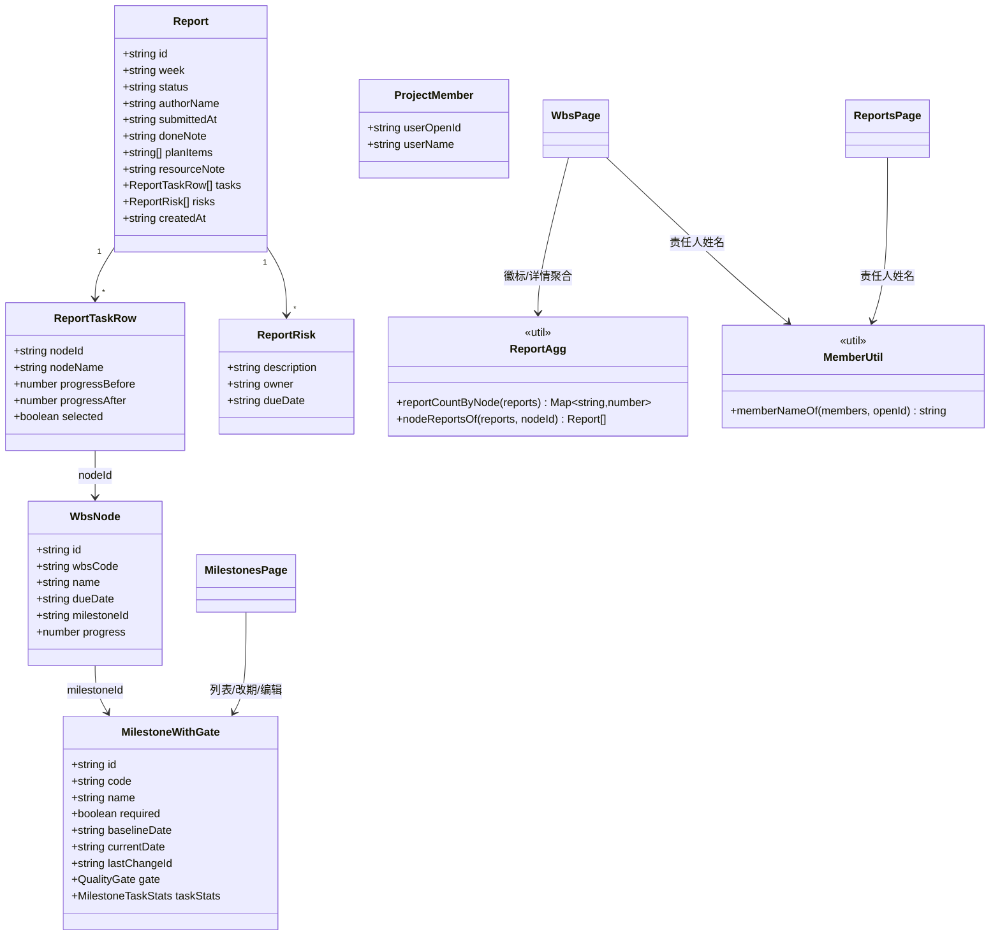
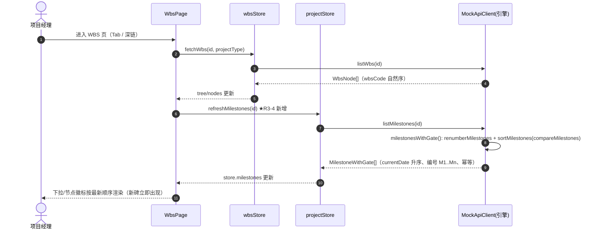
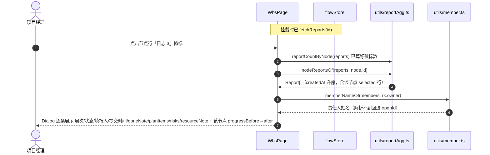
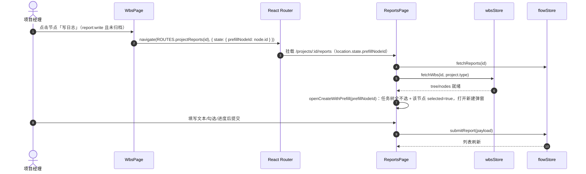
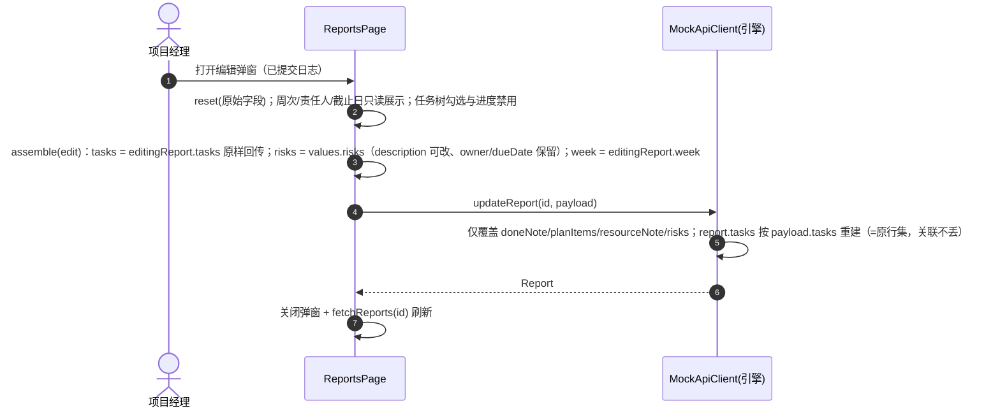

# 增量系统设计 + 任务分解 · 第三轮 6 项优化（round3-optimize）

> **核实声明**：本文档基于对以下关键文件的 Read 核实后产出（非凭记忆）：
> `docs/delta-prd-round3-optimize.md`（需求池 R3-1~R3-11）、`src/pages/projects/MilestonesPage.tsx` / `WbsPage.tsx` / `ReportsPage.tsx` / `ProjectCreatePage.tsx` / `ProjectOverviewPage.tsx`、
> `src/api/mock/index.ts`（createProject / createMilestone / deleteMilestone / updateMilestone / upsertReport / updateReport）、`src/api/mock/rules.ts`（compareMilestones / sortMilestones）、
> `src/stores/projectStore.ts` / `flowStore.ts` / `wbsStore.ts`、`src/api/contract.ts`、`src/types/project.ts` / `wbs.ts` / `report.ts` / `api.ts`、`src/config/enums.ts` / `routes.ts`、`src/api/http.ts`、`src/components/layout/ProjectLayout.tsx`、`src/router/index.tsx`。
> 已确认项目现状：Vite+React+TS+MUI+Tailwind+Zustand，`VITE_USE_MOCK=true`；引擎 `updateReport` 恒按 `payload.tasks` 整体重建 `report.tasks`（index.ts L1599-1610）；`WbsPage` 挂载 effect 只 `fetchWbs`、从不刷新里程碑（WbsPage.tsx L105-108）；`MilestonesPage` 挂载 effect 有 `refreshMilestones`（L95-97）；引擎 `deleteMilestone`/`updateMilestone` 已不再抛 `E_MS_REQUIRED_LOCKED`/`E_GATE_NOT_PASSED`（index.ts L997、L1081）。

---

## 0) 结论速览（实现方案概述）

- **沿用现有框架，零新增依赖、零引擎核心改动**。六项决策（A~F）全部落实为 R3-1~R3-11，改动集中在 5 个页面文件 + 2 个新增纯函数工具 + 枚举/类型微调。
- 四个关键工程判断：
  1. **R3-4 排序 bug 根因 = WbsPage 挂载不刷新里程碑**（PM 排查结论已核实：页面层 `.tsx` 无任何 `sortMilestones` 调用，`WbsPage` 只 `fetchWbs`）。修复采用**挂载时 `refreshMilestones(id)`**（与 `MilestonesPage` L95-97 既有模式一致），不在消费处引入 `sortMilestones` 兜底（理由见 §3.3）。
  2. **R3-7 编辑回传机制采用「前端原样回传原始 `report.tasks`」（方案 A）**，不改引擎、不改 `ReportPayload.tasks` 契约（理由见 §3.1）。
  3. **R3-11 只清理 MilestonesPage 死分支；`src/types/api.ts` 错误码表与中文文案映射保留**（理由见 §3.4）。
  4. **R3-5「写日志」采用路由 state 跳转 + 自动打开新建弹窗 + 预勾选**（复用 ReportsPage 既有表单，与 MilestonesPage→ChangesPage 传 `changeDraft` 的模式一致）。
- 架构模式不变：页面层 + Zustand store + ApiClient（Mock/HTTP 双实现）+ 纯函数规则层。新增 `src/utils/member.ts`、`src/utils/reportAgg.ts` 为纯函数层（可单测、可被多个页面复用）。

---

## 1) 实现方案概述

### 1.1 技术难点与对策

| 难点 | 对策 |
|---|---|
| 跨页数据一致性（WBS 下拉与里程碑页顺序不一致，bug③） | WbsPage 挂载时同步 `refreshMilestones(id)`，数据源收敛到引擎 `listMilestones`（引擎已保证 `compareMilestones` 排序 + `renumberMilestones` 编号 M1..Mn） |
| 日志编辑「防误改」与引擎「tasks 整体重建」冲突 | 编辑态 `assemble()` 的 `tasks` 直接取原始 `editingReport.tasks` 原样回传（selected/progressAfter 不变）；周次/责任人/截止日只读展示，用隐藏 input 保持 react-hook-form 注册与校验 |
| WBS 节点日志聚合（计数/详情/新建入口） | 新增纯函数 `reportAgg.ts`（按 nodeId 计数、按 createdAt 聚合）；徽标 + 就近 Dialog + 路由 state 跳转复用 ReportsPage 表单 |
| 「必备/质量门」UI 残留与基线歧义 | 纯 UI 删除清单（R3-1/R3-2/R3-9）+ 死分支清理（R3-11），引擎字段与错误码表不动 |

### 1.2 选型说明

- 不引入任何新第三方包（react-hook-form / zod / dayjs / MUI 均已存在）。
- 编辑只读字段用「隐藏 input + 只读 Typography」而非 `disabled`：RHF v7 中 `disabled` 字段不参与提交，会丢失 owner/dueDate/week 导致 zod 校验失败或数据被清；隐藏 input 保持注册，值随表单提交。
- 路由 state 传 `{ prefillNodeId }`：与现有 `navigate(ROUTES.projectChanges(id), { state: { changeDraft } })`（MilestonesPage L662）同款模式，无需新增 URL 参数解析。

---

## 2) 文件列表（相对路径）

| 文件 | 状态 | 改动要点 |
|---|---|---|
| `src/utils/member.ts` | **新增** | `memberNameOf(members, openId): string` 成员姓名解析（R3-7③ / R3-8） |
| `src/utils/reportAgg.ts` | **新增** | `reportCountByNode(reports)`、`nodeReportsOf(reports, nodeId)`（R3-5 计数与聚合唯一真源） |
| `src/config/enums.ts` | 修改 | `REPORT_SECTION_TITLE` 追加 `taskAssoc` 文案（R3-6） |
| `src/types/report.ts` | 修改 | 新增 `ReportTaskRef` 类型（R3-7 原样回传的类型别名） |
| `src/pages/projects/MilestonesPage.tsx` | 修改 | R3-1①②③ / R3-2 / R3-9② / R3-10 / R3-11 |
| `src/pages/projects/ProjectCreatePage.tsx` | 修改 | R3-1④ / R3-9① |
| `src/pages/projects/ProjectOverviewPage.tsx` | 修改 | R3-1⑤ |
| `src/pages/projects/WbsPage.tsx` | 修改 | R3-3 / R3-4 / R3-5（WBS 侧：截止、刷新、徽标、详情、写日志跳转） |
| `src/pages/projects/ReportsPage.tsx` | 修改 | R3-5③接收端 / R3-6 / R3-7 / R3-8 |
| `src/api/contract.ts` | 修改（仅注释） | `updateReport` 的 `tasks` 原样回传不变量注释；`deleteMilestone`/`CreateMilestoneSpec` 注释去「锁删」表述 |

**明确不改**：`src/api/mock/index.ts`（引擎，含 updateReport）、`src/api/mock/rules.ts`（排序/编号逻辑已正确）、`src/stores/*`（refreshMilestones / fetchReports 均已存在）、`src/types/api.ts`（错误码表保留）、`src/api/http.ts`。

---

## 3) 数据结构与接口

### 3.1 R3-7 `updateReport` 编辑提交机制（重点）

**现状（已核实）**：
- 引擎 `updateReport`（index.ts L1587-1623）：`report.tasks = payload.tasks.map(...)` **无条件整体重建**；不更新 `week`（周次天然保持）。
- 页面 `assemble()`（ReportsPage.tsx L162-175）：`tasks: nodes.map(...)` 从**当前全量 WBS 节点**重建——若编辑时新增了节点，会把新节点以 `selected:false` 塞进行集；若原报告关联的节点已被删除，该行会丢失（进度历史丢失）。

**方案 A（选定）：编辑态前端原样回传原始 `report.tasks`**。

```ts
// types/report.ts 新增
/** 编辑回传任务行的最小契约：nodeId + progressAfter + selected 必须与原始 report.tasks 完全一致（R3-7） */
export type ReportTaskRef = Pick<ReportTaskRow, 'nodeId' | 'progressAfter' | 'selected'>;
```

```ts
// ReportsPage.tsx 新增状态（与 editingReportId 并存）
const [editingReport, setEditingReport] = useState<Report | null>(null);
// openEditReport(r) 时：setEditingReport(r)（同时保留 setEditingReportId(r.id)）
// doSave 成功后 / 关闭弹窗时：setEditingReport(null)

const assemble = (values: FormValues): ReportPayload => ({
  projectId: id,
  // 编辑态周次以原始报告为准（引擎不更新 week；也规避 disabled 字段丢失）
  week: editingReport ? editingReport.week : values.week,
  doneNote: values.doneNote,
  planItems: planItems.map((p) => p.trim()).filter(Boolean),
  resourceNote: values.resourceNote,
  // ★ 编辑态：原样回传原始 report.tasks（selected / progressAfter 不变），防止引擎重建清空关联
  tasks: editingReport
    ? editingReport.tasks.map<ReportTaskRef>((t) => ({ nodeId: t.nodeId, progressAfter: t.progressAfter, selected: t.selected }))
    : nodes.map((n) => ({
        nodeId: n.id,
        progressAfter: taskMap[n.id]?.progressAfter ?? n.progress,
        selected: taskMap[n.id]?.selected ?? false,
      })),
  risks: values.risks,
});
```

**为何不改引擎（否决方案 B）**：
- `ReportPayload.tasks` 是必填契约字段（contract.ts L151），改成 optional 会波及 mock/http 双实现、所有创建/编辑调用点与类型推导，属于跨层契约变更，风险面大；
- 方案 B 的「仅当显式提供才重建」语义模糊：编辑态若漏传 tasks 会静默保留旧数据，掩盖前端 bug；而方案 A 让「tasks 是行集唯一真源」的不变量保持显式、可审计；
- 方案 A 仅改 `ReportsPage.tsx` 一个文件，且对**已删除节点**也安全（原行原样回传，引擎按 id 查不到节点时 nodeCode/nodeName 落空但行保留）。

**编辑态只读字段的隐藏 input 模式**（周次 / 风险责任人 / 风险截止日）：
```tsx
{/* 编辑态：周次只读展示 + 隐藏 input 保持注册（disabled 会丢值） */}
{editingReport ? (
  <>
    <input type="hidden" {...register('week')} />
    <Typography variant="body2">{values.week /* 或 watch('week') */}</Typography>
  </>
) : (
  <TextField select label="周次" {...register('week')} ...>...</TextField>
)}

{/* 编辑态：风险责任人 / 截止日 只读展示 + 隐藏 input；description 保持可编辑 */}
{risks.fields.map((field, index) => (
  <Stack key={field.id} ...>
    <TextField {...register(`risks.${index}.description` as const)} label="风险描述" ... /> {/* 可编辑 */}
    {editingReport ? (
      <>
        <input type="hidden" {...register(`risks.${index}.owner` as const)} />
        <input type="hidden" {...register(`risks.${index}.dueDate` as const)} />
        <Typography variant="body2">责任人：{memberNameOf(members, field.owner)}（截止 {field.dueDate}）</Typography>
      </>
    ) : (
      <>
        <TextField {...register(`risks.${index}.owner` as const)} select ...>...</TextField>
        <TextField {...register(`risks.${index}.dueDate` as const)} type="date" ... />
      </>
    )}
  </Stack>
))}
```
> 兜底：`assemble` 的 `risks: values.risks` 已含隐藏 input 注册值；若仍担心 RHF 丢字段，可在 assemble 内按索引合并 `owner/dueDate` 回退到 `editingReport.risks[i]`（实现时二选一，推荐保留隐藏 input 即可）。

### 3.2 R3-5 日志详情数据装配（reportAgg）

```ts
// utils/reportAgg.ts（新增，纯函数）
import type { Report } from '@/types/report';

/** 每个 WBS 节点被勾选关联的日志条数（口径 = report.tasks 中 selected===true 且 nodeId 命中，与 ReportsPage 列表「关联任务数」一致） */
export function reportCountByNode(reports: Report[]): Map<string, number> {
  const counts = new Map<string, number>();
  for (const r of reports) {
    for (const t of r.tasks) {
      if (t.selected) counts.set(t.nodeId, (counts.get(t.nodeId) ?? 0) + 1);
    }
  }
  return counts;
}

/** 某节点关联的全部日志：按 createdAt 升序；每条日志取该节点 selected 行用于展示进度 before→after */
export function nodeReportsOf(reports: Report[], nodeId: string): Report[] {
  return reports
    .filter((r) => r.tasks.some((t) => t.nodeId === nodeId && t.selected))
    .sort((a, b) => (a.createdAt < b.createdAt ? -1 : 1));
}
```

- WbsPage 消费：挂载时 `fetchReports(id)`（flowStore 已有）→ `reportCountByNode(reports)` 得徽标数；点击徽标 → `nodeReportsOf(reports, node.id)` → 详情 Dialog。
- 详情 Dialog 每条日志展示：周次 / 状态 / 填报人 / 提交时间 / doneNote / planItems / risks（责任人 `memberNameOf(members, rk.owner)` + 截止）/ resourceNote，并附该节点 `progressBefore → progressAfter`（取 `r.tasks.find(t => t.nodeId === node.id)?.progressBefore/progressAfter`）。

### 3.3 R3-4 排序修复方案（真 bug，根因与改法写透）

**根因链（已核实代码定位）**：
1. `ProjectLayout` 挂载时 `fetchDetail(id)` 一次性加载 `milestones`（projectStore.ts L79-97），此后 **只有 `refreshMilestones` 会更新**（L99-101）；Tab 切换不触发（ProjectLayout effect 依赖仅 `[id]`，L26-34）。
2. `MilestonesPage` 挂载 effect 会 `refreshMilestones`（L95-97），所以**在里程碑页内操作后 store 是新的**；但 `WbsPage` 挂载 effect **只 `fetchWbs`（L105-108），从不刷新里程碑**。
3. 因此 WBS 页的「关联里程碑」下拉（L452-471）与 `milestoneOf`（L157-160）消费的是 **store 里的旧快照**：新插入的里程碑缺失、或编号/顺序停留在旧值（插入 M2 后仍显示旧 M1..M5 序列）→ 反馈③「插入 M2 排 M5 后」。
4. 引擎侧无 bug：`createMilestone` 已 `renumberMilestones`（index.ts L974）、`listMilestones` 返回 `sortMilestones` 结果（L244）——**只要页面拉一次全量，顺序与编号就正确且幂等**。

**修复（选定一项）：WbsPage 挂载 effect 增加 `refreshMilestones(id)`**：

```ts
// WbsPage.tsx L105-108 改造
useEffect(() => {
  if (!id) return;
  void fetchWbs(id, projectType);
  // ★ R3-4 根因修复：WBS 页挂载即同步刷新里程碑，保证下拉/徽标使用引擎最新排序（currentDate 升序 + M1..Mn）
  void useProjectStore.getState().refreshMilestones(id);
  // eslint-disable-next-line react-hooks/exhaustive-deps
}, [id, projectType]);
```

**为何不选「消费处 sortMilestones 兜底」**：
- `sortMilestones` 只能修正**顺序**，无法修正**缺行/旧编号**——若 store 里根本没有新插入的 M2，排序救不回来，验收点「新碑立即出现」（R3-4④）必然失败；
- 引擎 `listMilestones` 已保证「排序 + 编号」正确且幂等，`refreshMilestones` 是唯一能拉全量的入口；消费处再排一次是重复且可能引入「排序源不一致」风险（SK-M1 要求排序/编号唯一真源 = `compareMilestones`）；
- 与 `MilestonesPage` 既有挂载刷新模式一致（L95-97），代码库约定统一。
- **附加验收**：`refreshMilestones` 是异步的，首帧可能短暂显示旧值（与里程碑页行为一致，可接受）；下拉数据源仍是 `store.milestones` 原序（引擎已排序），**不要**在 WbsPage 里改按 `code` 排序。

**全局排查项**：T05 回归时 grep 确认无任何「按 `m.code` 排序里程碑」的调用点；WBS 下拉（WbsPage L466-470）保持 store 顺序即可。

### 3.4 R3-11 错误码表判断

- **`src/types/api.ts` 的 `ErrorCode` 枚举与 `ERROR_MESSAGE_ZH` 保留不动**。理由：① 注释声明与 `server/lib/errors.js` 保持一致，真实后端（`VITE_USE_MOCK=false`）可能仍返回这些码；② 保留的兜底文案成本极低，删除反而破坏契约对称性。
- **只删页面死分支**：
  - `MilestonesPage.handleAchieve` L213-217（`E_GATE_NOT_PASSED` 分支）→ 直接 `toast.error(e)`；
  - `MilestonesPage.handleDelete` L230-235（`E_MS_REQUIRED_LOCKED` 分支）→ 直接 `toast.error(e)` + `setDeleteTarget(null)`；
  - `isApiError` / `ErrorCode` import **保留**（`E_MS_NEED_CHANGE` 在改期/编辑两处仍用：L144、L192）。
- `ProjectOverviewPage`：`blockersFromError` 中的 `E_GATE_ITEM_INCOMPLETE` 仍存活（`decideGate` 会抛），**必须保留**；其 `handleAchieve` 的 `E_GATE_NOT_PASSED` 分支（L179-182）同为死分支，本轮一并清理（可选，不清理也不影响功能）。

### 3.5 类图



---

## 4) 程序调用流程（时序图）

### 4.1 ① WBS 挂载刷新里程碑 → 下拉排序一致



### 4.2 ② 节点行点「日志 n」→ 聚合详情弹窗



### 4.3 ③ 点「写日志」→ 跳转工作日志页 → 预勾选任务 → 新建



### 4.4 ④ 编辑日志 → 仅文本可改 → 原样回传 tasks



---

## 5) 有序任务列表（按实现顺序，覆盖 R3-1~R3-11 全部）

> 约定：P0 = 本轮必须交付；P1 = 建议一并做。验收点均可在 `npm run dev` + `VITE_USE_MOCK=true` 下手工验证。

### T01 · 共享基础层：文案常量 + 类型 + 纯函数工具（P0 前置）

- **Source Files**：`src/config/enums.ts`（改）、`src/types/report.ts`（改）、`src/utils/member.ts`（新增）、`src/utils/reportAgg.ts`（新增）
- **Dependencies**：无（首个任务；本轮无构建配置/依赖变更，故以「枚举/类型/工具」充当基础设施层，并在验收点确认 package.json 零新增）
- **Priority**：P0
- **要点**：
  1. `enums.ts` 的 `REPORT_SECTION_TITLE` 追加：`taskAssoc: '任务关联（勾选本日志涉及的任务，可同步更新进度）'`（R3-6 标题，T04 消费）。
  2. `types/report.ts` 新增 `export type ReportTaskRef = Pick<ReportTaskRow, 'nodeId' | 'progressAfter' | 'selected'>;`（R3-7 原样回传类型）。
  3. 新增 `utils/member.ts`：`export function memberNameOf(members: ProjectMember[], openId: string): string`——按 `userOpenId` 查 `userName`，解析不到返回 `openId` 原文（R3-7③/R3-8 唯一入口，供 WbsPage/ReportsPage 共用）。
  4. 新增 `utils/reportAgg.ts`：`reportCountByNode(reports): Map<string, number>` + `nodeReportsOf(reports, nodeId): Report[]`（R3-5 计数与聚合唯一真源，口径 = `selected===true`）。
- **验收点**：`npm run dev` 启动无 TS 报错；两个新工具为纯函数（无副作用、无 React 依赖），可独立单测；`package.json` 无新增依赖。

### T02 · 里程碑 / 向导 / 概览「必备 + 基线」语义清理（R3-1 / R3-2 / R3-9 / R3-10 / R3-11）

- **Source Files**：`src/pages/projects/MilestonesPage.tsx`、`src/pages/projects/ProjectCreatePage.tsx`、`src/pages/projects/ProjectOverviewPage.tsx`
- **Dependencies**：T01（member.ts 无关，本任务基本独立，仅类型/常量可先就位）
- **Priority**：P0（R3-1/R3-2/R3-9/R3-11）+ P1（R3-10）
- **要点**：
  1. **MilestonesPage（主战场）**：
     - R3-1①：删名称列「必备」Chip（L322-324）。
     - R3-2②：删「基线日期」列（L358-367）；「当前计划」列（L368-412）改 label 为 `计划日期（到期）`（L370），width 调至 ~200，仍展示 `currentDate`，点击改期交互不变。
     - R3-10：同列内 `const changed = m.currentDate !== m.baselineDate;`，为 true 时日期旁加弱标记 `<Chip size="small" label="已变更" ...>` + `Tooltip title={`基线 ${m.baselineDate} → 计划 ${m.currentDate}（变更单 ${m.lastChangeId ?? '—'}）`}`；逾期标红（L374-375、L390、L408）保留。
     - R3-2④/R3-9②：顶部 Alert（L523-527）改为「**计划日期（到期）为当前生效计划，提前可直接改，延后须走变更单；基线日期仅用于审计对比。**里程碑状态由引擎派生，达成可由手动标记触发；里程碑可自由编辑与删除。」
     - R3-2③：改期弹窗基线说明（L565-567）与编辑弹窗基线说明（L736-740）改为「基线日期（创建时原始日期，仅作对比，不是到期日）」。
     - R3-1②：编辑弹窗删「模板必备」Chip 与「必备标记来自模板，不可编辑」（L741-747）。
     - R3-1③：删除确认（L680-699）去掉 `required` 三分支，统一为「确定删除「{code} {name}」？关联 WBS 节点会解绑（不删除任务）。该操作不可撤销。」；`PROJECT_TYPE_SHORT` import（L32）不再使用则删除。
     - R3-11：`handleAchieve` 删 `E_GATE_NOT_PASSED` 分支（L213-217）；`handleDelete` 删 `E_MS_REQUIRED_LOCKED` 分支（L230-235）；`isApiError`/`ErrorCode` import 保留（E_MS_NEED_CHANGE 仍用）。
     - R3-9：文件头注释（L60-64）去掉「模板必备里程碑锁删」表述。
  2. **ProjectCreatePage**：
     - R3-1④：删里程碑行内「必备」Chip（L728-730）；删除按钮去掉 `disabled={m.required}`（L766）；删「模板必备里程碑不可删除…」提示（L773-777）；确认页「X 个必备」计数（L665）改为「{n} 个里程碑 · 创建后可在里程碑页自由增删改」。
     - R3-9①：里程碑步骤 Alert（L695-698）去掉「必备里程碑锁删」；确认页 Alert（L668-671）去掉「配套质量门」表述。
     - 保留：`MilestoneDraft.required` 字段与 `payload.milestones[].required`（引擎仍写血缘语义）。
  3. **ProjectOverviewPage**：R3-1⑤：删时间轴卡片「必备」Chip（L290-292）。
- **验收点**：
  - 全局 grep `必备`：仅剩「模板血缘」注释/字段，页面可见文案为 0（向导/里程碑页/概览页无 Chip、无计数、无提示）。
  - 里程碑列表仅一列日期「计划日期（到期）」；对经变更单调整的碑显示「已变更」弱标记 + tooltip 含变更单号；逾期仍标红。
  - 删除任一里程碑（含模板生成的 required 碑）确认弹窗文案统一；删除后编号仍连续 M1..Mn。
  - 编辑弹窗不再出现「必备」相关 UI；基线日期以辅助说明出现。

### T03 · WBS：截止显示 + 排序修复 + 日志聚合（R3-3 / R3-4 / R3-5）

- **Source Files**：`src/pages/projects/WbsPage.tsx`（改）、`src/utils/reportAgg.ts`（消费，T01）、`src/utils/member.ts`（消费，T01）
- **Dependencies**：T01
- **Priority**：P0
- **要点**：
  1. R3-4 根因修复：挂载 effect（L105-108）增加 `void useProjectStore.getState().refreshMilestones(id);`（见 §3.3 代码）；同时新增 `useFlowStore` 的 `reports` / `fetchReports`，挂载时 `void fetchReports(id).catch(...)`（供徽标与详情）。
  2. R3-3：`renderNode` label Stack（L278-344）在里程碑 Chip 后新增 `Typography variant="caption"`：「截止 {fmtDate(node.dueDate)}」或「截止 —」（所有节点，task 与 subtask 一致；无 dueDate 显示「截止 —」）；表单内 dueDate 编辑（L473-479）不受影响。
  3. R3-5：
     - 徽标：`const counts = useMemo(() => reportCountByNode(reports), [reports]);`；节点行显示 `<Chip size="small" label={`日志 ${counts.get(node.id) ?? 0}`} variant={count > 0 ? 'filled' : 'outlined'} sx={{...}} onClick={() => setLogDetailNode(node)} />`（n=0 弱化样式，仍可点击）。
     - 详情 Dialog：`const nodeReports = useMemo(() => nodeReportsOf(reports, logDetailNode.id), [reports, logDetailNode]);`；`FormDialog` 标题「工作日志详情 · {wbsCode} {name}」；每条日志展示周次/状态/填报人/提交时间/doneNote/planItems/risks（责任人 `memberNameOf(members, rk.owner)` + 截止）/resourceNote + 该节点 `progressBefore → progressAfter`（取 `r.tasks.find(t => t.nodeId === node.id)`）；n=0 时显示空态文案。
     - 写日志入口：`const canWriteLog = can('report:write') && !archived;`，徽标旁放 `<PermissionButton action="report:write" disabledReason={archived ? '项目已归档' : ''} size="small" onClick={() => navigate(ROUTES.projectReports(id), { state: { prefillNodeId: node.id } })}>写日志</PermissionButton>`（新增 `useNavigate`、`ROUTES` import；入口不在 wbs:edit 动作区，保证只有 report:write 权限的人也能写）。
- **验收点**（对应 R3-4）：
  - 在 M1 与 M3 之间插入计划日期的里程碑后，**直接进入 WBS 页**：下拉按 currentDate 升序（M1 < M2 < M3 < …）、编号连续、新碑立即出现；离开再进入/刷新后顺序与编号不变（幂等）。
  - 里程碑页列表与 WBS 下拉顺序一致。
  - 每个节点行显示「截止 YYYY-MM-DD」或「截止 —」；无 dueDate 节点显示「截止 —」。
  - 节点「日志 n」徽标计数与工作日志列表「关联任务数」口径一致（selected=true）；点击弹详情按 createdAt 升序；「写日志」跳转工作日志页并自动打开新建弹窗、预勾选该任务。

### T04 · 工作日志页：编辑收敛 + 标题 + 责任人姓名 + 预勾选接收（R3-5③接收端 / R3-6 / R3-7 / R3-8）

- **Source Files**：`src/pages/projects/ReportsPage.tsx`（改）、`src/api/contract.ts`（改，仅注释）、`src/utils/member.ts`（消费，T01）
- **Dependencies**：T01（与 T03 无硬依赖，但 prefill 的 state 形状 `{ prefillNodeId }` 须与 T03 一致——见共享知识 §7）
- **Priority**：P0（R3-6/R3-7）+ P1（R3-8）
- **要点**：
  1. R3-6：任务树容器（L315-327 的 Box 上方）加固定标题 `<Typography variant="subtitle2">{REPORT_SECTION_TITLE.taskAssoc}</Typography>`；编辑态追加 `<Typography variant="caption" color="text.secondary">编辑已提交日志时该区域只读</Typography>`。
  2. R3-7：
     - 新增 `const [editingReport, setEditingReport] = useState<Report | null>(null);`；`openEditReport(r)`（L146-160）同时 `setEditingReport(r)`；`doSave` 成功与关闭弹窗时置 null。
     - `assemble()` 按 §3.1 改造：编辑态 `tasks` 原样回传 `editingReport.tasks`、`week` 取 `editingReport.week`。
     - 周次字段（L307-313）：编辑态改只读展示 + 隐藏 `register('week')` input（避免 disabled 丢值）。
     - 任务树（L232-263）：编辑态 checkbox `disabled`、progressAfter `TextField disabled`。
     - 风险行（L357-385）：编辑态 description 可编辑；owner / dueDate 改隐藏 input + 只读姓名/日期展示（见 §3.1 片段）；新建态保持原 Select/date 交互。
  3. R3-8：详情弹窗风险行（L459）`责任人：{rk.owner}` → `责任人：{memberNameOf(members, rk.owner)}`。
  4. R3-5③接收端：新增 `const location = useLocation();`；挂载 effect（L121-125）在 `fetchWbs` resolve 后读取 `(location.state as { prefillNodeId?: string } | null)?.prefillNodeId`，若命中且节点存在则 `openCreateWithPrefill(nodeId)`（reset 表单 + taskMap 全不选 + 该节点 selected=true + 打开弹窗）；用 `useRef(false)` 守卫避免同一 state 重复触发；节点不存在则降级 `openCreate()`。
  5. `contract.ts`：`updateReport`（L259）注释补充「编辑提交必须原样回传原始 report.tasks（selected/progressAfter 不变），引擎按 payload.tasks 整体重建，否则关联被清空（R3-7）」；`deleteMilestone`（L239）与 `CreateMilestoneSpec`（L99-110）注释去掉「锁删」表述。
- **验收点**：
  - 新建弹窗任务关联区有标题；编辑已提交日志时该区只读且有说明。
  - 编辑日志：可改 doneNote / planItems / resourceNote / 风险描述；周次、任务勾选、进度、风险责任人、风险截止日只读；责任人显示成员姓名（解析不到显示 openId）。
  - **关键**：编辑提交后，`report.tasks` 关联与 `selected/progressAfter` 与编辑前完全一致（可对比编辑前后详情弹窗的关联任务列表）；同周多次提交互不影响；周次不变。
  - 从 WBS「写日志」跳转过来自动打开新建弹窗且预勾选该任务，提交后 WBS 徽标数 +1。

### T05 · 跨页联调与回归验证（全量验收）

- **Source Files**：`src/pages/projects/MilestonesPage.tsx`（复查）、`src/pages/projects/WbsPage.tsx`（复查）、`src/pages/projects/ReportsPage.tsx`（复查）
- **Dependencies**：T02、T03、T04
- **Priority**：P0
- **要点**：
  1. 全局 grep 校验：`必备里程碑|模板必备|配套质量门|必备锁删` 在页面可见文案为 0；`E_MS_REQUIRED_LOCKED|E_GATE_NOT_PASSED` 仅存在于 `types/api.ts`（错误码表）与 `contract.ts`（注释），页面 catch 分支为 0；无任何按 `m.code` 排序里程碑的调用点。
  2. 端到端回归：建项目 → 里程碑页插入 M2 → WBS 页下拉/编号一致；WBS 节点挂里程碑；写日志 → WBS 徽标 → 详情；编辑日志文本 → 关联不丢。
  3. 兜底修复：验收中发现任一页面的边缘问题（如 prefill 重复触发、详情弹窗空态文案），在本任务内修完。
- **验收点**：R3-1~R3-11 全部验收标准逐条通过（见 PRD §3 需求池）；`npm run build`（tsc + vite）无错误。

---

## 6) 依赖包列表

**零新增**。全部改动复用既有依赖：

```
- react / react-dom（既有）
- @mui/material @mui/icons-material @mui/x-date-pickers @mui/x-tree-view（既有）
- zustand（既有）
- react-hook-form @hookform/resolvers zod（既有，编辑只读用隐藏 input 保持注册）
- react-router-dom（既有，路由 state 传 prefill）
- dayjs（既有）
```

---

## 7) 共享知识（跨文件约定）

1. **编辑回传 tasks 原样机制（R3-7 硬约束）**：`updateReport` 编辑提交时，`payload.tasks` 必须是**原始 `report.tasks` 的 `{nodeId, progressAfter, selected}` 原样映射**，不得从当前 WBS `nodes` 重建；引擎按 `payload.tasks` 整体重建 `report.tasks`，违反会导致关联被清空。
2. **日志计数口径（R3-5）**：节点徽标数 = 该节点在日志 `tasks` 中 `selected===true` 的日志条数；与 ReportsPage 列表「关联任务数」（`r.tasks.filter(t => t.selected).length`）同源。一律经 `utils/reportAgg.ts` 计算，禁止页面自行 for 循环推导。
3. **currentDate 展示口径（R3-2/R3-10）**：里程碑列表日期列只展示 `currentDate`（当前生效计划）；`baselineDate` 仅作内部审计字段，UI 只在改期/编辑弹窗以「基线日期（创建时原始日期，仅作对比，不是到期日）」出现；`currentDate !== baselineDate` 时列内加「已变更」弱标记 + tooltip（含 `lastChangeId`）。
4. **required 保留但 UI 不展示（R3-1）**：引擎 `ms.required` 与向导 `CreateMilestoneSpec.required` 继续写入（模板血缘，供后续「模板预设」使用）；页面**任何位置**不再出现「必备」Chip / 计数 / 锁删提示 / 删除禁用。
5. **责任人姓名唯一解析入口（R3-7③/R3-8）**：风险责任人 = `report.risks[].owner`（openId），从项目 `members` 解析 `userName` 只读展示；解析不到显示 openId 原文。一律走 `utils/member.ts` 的 `memberNameOf`，不得在页面内散落 find。
6. **编辑只读字段用隐藏 input（R3-7）**：周次/风险责任人/风险截止日在编辑态用「隐藏 `register` input + 只读 Typography」保持 react-hook-form 注册与校验（`disabled` 字段不参与提交会丢值）。
7. **WBS 页挂载即刷新里程碑（R3-4）**：WbsPage 挂载 effect 必须同时 `fetchWbs` + `refreshMilestones`（与 MilestonesPage 一致）；里程碑排序/编号唯一真源 = 引擎 `compareMilestones`/`renumberMilestones`，页面禁止按 code 排序。
8. **错误码表保留（R3-11）**：`types/api.ts` 的 `ErrorCode`/`ERROR_MESSAGE_ZH` 是前后端契约，保留；只清理页面死 catch 分支。
9. **「写日志」跳转约定（R3-5③）**：WbsPage → `navigate(ROUTES.projectReports(id), { state: { prefillNodeId: node.id } })`；ReportsPage 消费 `location.state.prefillNodeId`，挂载 + `fetchWbs` 完成后自动打开新建弹窗并预勾选该任务；用 ref 守卫防重复触发。

---

## 8) 待明确事项

**无**。六项决策均已落到需求池与边界（PRD §5 亦确认无待确认问题）；如后续「模板预设」功能立项，再单独评审 `required` 的去留与展示。
