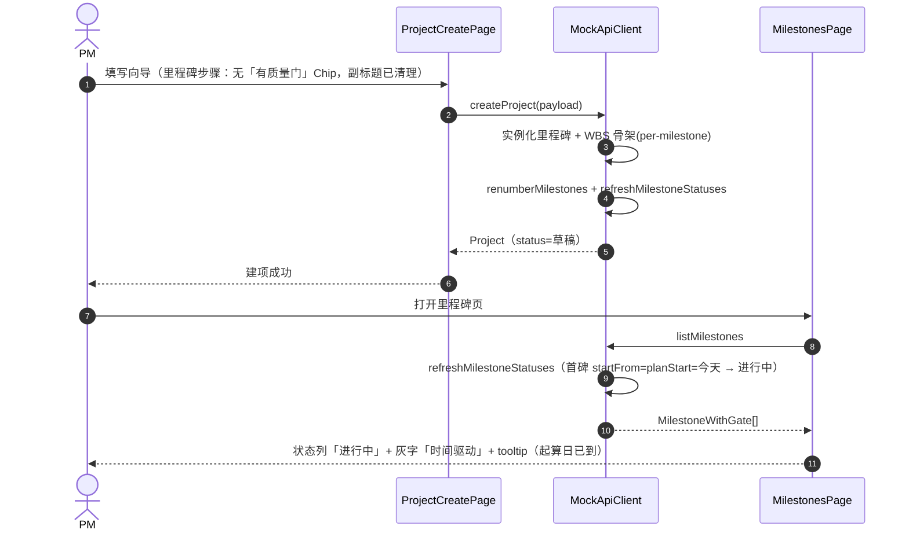
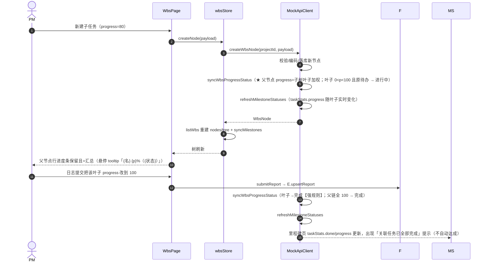
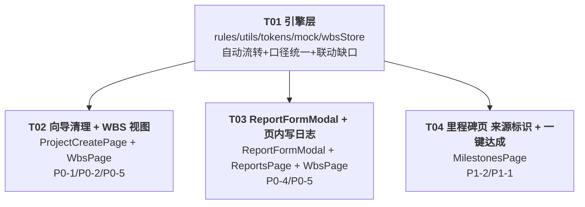

# 增量架构设计 · 第四轮 5 项优化（round4-optimize）

> 项目：太空字节 PM 系统（pm-app）｜前端：Vite + React + TS + MUI + Tailwind + Zustand（Mock 引擎 `VITE_USE_MOCK=true`）
> 架构师：高见远（Bob）｜输入：许清楚《delta-prd-round4-optimize.md》｜基线 commit：571b437

## 0. 核实说明（Read 依据，非凭记忆）

已逐行 Read 核实：`src/pages/projects/WbsPage.tsx`（确认 L300-302 `progress=rollupProgress(node)`/`isLeaf`，L369-373 进度条被 `{isLeaf &&}` 包裹、L374-378 估算列同条件，L349-363「写日志」为 `navigate(ROUTES.projectReports)` 跳转）、`src/pages/projects/ReportsPage.tsx`（确认表单为页内 `FormDialog` L347-485、`renderTaskTree` L282-316 checkbox 新建态可取消、`doSave` L226-246 提交后 `setOpen(false)`、`ProgressBar value={n.progress}` 展示存储值）、`src/pages/projects/ProjectCreatePage.tsx`（确认 L728-730「有质量门」Chip 与 L530 副标题残留）、`src/pages/projects/MilestonesPage.tsx`（状态列 L422-427、关联任务列 L442-479、`handleAchieve` L207-216 已存在）、`src/api/mock/index.ts`（确认 `upsertReport` L1502 提交分支仅 `progress>=100→完成`、**未调 `refreshMilestoneStatuses`**；`moveTask` L1418 亦未调）、`src/api/mock/rules.ts`（`deriveMilestoneStatus` P4 规则 L369-380）、`src/utils/wbs.ts`（`rollupProgress` L273-283、`weightedProgress` L100-106、`milestoneTaskStats` 仅真叶子加权）、`src/components/common/Widgets.tsx`（`ProgressBar` 签名 `{value,tone,showLabel,height,sx}`，`tone: SemanticTone`）、`src/components/common/StatusChip.tsx`（签名 `{status,label,size,variant,sx}`，`variant: 'soft'|'outlined'|'dot'`）、`src/theme/tokens.ts`（`SemanticTone` 五色、`toneOf` 映射：进行中→warning）、`src/types/wbs.ts`（`TaskStatus = 待办|进行中|待评审|完成|阻塞`）、`src/config/enums.ts`、`src/stores/flowStore.ts`/`wbsStore.ts`/`projectStore.ts`、`src/api/contract.ts`（`ReportPayload`/`WbsNodePayload`/`ApiClient`）。git 基线确认 `571b437`。

---

# Part A · 系统设计

## 1. 实现方案概述（沿用现有框架，零新范式）

### 1.1 核心难点与应对

| 难点 | 应对 |
|---|---|
| D2 状态自动流转「回写 vs 派生」二义性 | **结论：引擎写回（落库）**。理由见 §1.2，不给工程师二选一 |
| 父节点进度展示值与存储值可能不一致 | **统一口径**：父节点进度 = 子树**真叶子**按 estimateDays 加权（口径 Y，与 `milestoneTaskStats` 完全一致），视图层与引擎共用同一纯函数，消除双源漂移 |
| 日志表单双入口（ReportsPage / WbsPage）复用 | 抽取共享组件 `ReportFormModal`，通过 `keepOpenOnSubmit` / `lockNodeId` 两个 props 区分两入口行为 |
| 里程碑「任务全完成不自动达成」审计语义 | 任务进度只联动 `taskStats`（自动），达成走既有 `updateMilestone{achieved:true}`（人工，doneBy=当前用户）；引擎**永不**写 `doneAt/doneBy` 于任务完成路径 |

### 1.2 D2「回写 vs 派生」明确结论（主决策）

**采用「引擎回写存储字段」**，具体：

1. 在引擎内新增**唯一收口函数** `syncWbsProgressStatus(db, projectId)`（模块级私有函数，不进 ApiClient 契约），任何改动 progress/父子结构的写路径**必须**经它收敛；
2. 收敛逻辑：先**自底向上**回写每个节点的 `progress`——叶子保留自身存储值，父节点 = 子树真叶子按 estimateDays 加权（与视图层 `rollupProgress` 重构后同算法）；再对每个节点调用纯函数 `syncNodeStatusFromProgress(status, progress)` 推导 `status`；
3. 回写后**不写审计日志**（自动流转属引擎派生，避免刷屏），仅更新 `updatedAt`；
4. 视图层 `rollupProgress` **重构为同一叶子加权口径**，WbsPage 展示值与存储值恒等。

**为什么必须回写而不是纯视图层派生**：
- ReportsPage 任务树进度条直接展示**存储值** `n.progress`（L300），纯视图派生会让父节点行显示陈旧 0；
- 里程碑钻取弹窗展示**存储 status**（MilestonesPage L769 `n.status`），父节点不回写则显示陈旧「待办」；
- R4-P0-5 要求 WBS 节点行全量 `StatusChip`，其数据源即存储 status，不回写则父节点状态标识错误；
- PRD D2-④ 明确「父节点 progress **回写** = 子树叶子加权汇总（落库）」。

### 1.3 技术选型

- **零新增依赖**（package.json 已含 react-hook-form / zod / @mui/x-tree-view / @mui/x-date-pickers / zustand / notistack）；
- 纯规则函数放 `src/api/mock/rules.ts`（与 `deriveMilestoneStatus` 同层，WbsPage 已有从 `@/api/mock/rules` 导入先例）；
- 进度条色调映射放 `src/theme/tokens.ts`（`progressToneOf`，与 `toneOf` 同层）；
- 共享 Modal 放 `src/components/report/ReportFormModal.tsx`（与 `components/review` 平级，页面组件不直连 store 的惯例下，业务表单组件就近放业务组件目录）。

---

## 2. 文件列表

### 2.1 修改文件（8）

| 文件 | 改动 |
|---|---|
| `src/api/mock/rules.ts` | 新增 `syncNodeStatusFromProgress(status, progress)` 纯函数（D2 规则唯一实现） |
| `src/utils/wbs.ts` | 重构 `rollupProgress` 为**子树真叶子加权**口径；新增扁平版 `rollupProgressFlat(nodes, nodeId)`（引擎写回用） |
| `src/theme/tokens.ts` | 新增 `progressToneOf(status)`（进行中→brand 例外，其余与 `toneOf` 一致） |
| `src/api/mock/index.ts` | 新增模块级 `syncWbsProgressStatus(db, projectId)`；在 `createWbsNode`/`updateWbsNode`/`deleteWbsNode`/`moveWbsNode`/`moveTask`/`upsertReport(已提交)` 六个写路径收口调用；`upsertReport` 与 `moveTask` 补调 `refreshMilestoneStatuses`（D3 联动缺口修复）；`upsertReport` 提交分支删除孤立 `if (progress>=100) status='完成'` |
| `src/stores/wbsStore.ts` | `moveTask` 补 `void syncMilestones(projectId)`（看板拖拽后里程碑联动） |
| `src/pages/projects/ProjectCreatePage.tsx` | 删 L728-730「有质量门」Chip 条件块；L530 副标题改「最终分类（决定生命周期模板与默认里程碑）」 |
| `src/pages/projects/WbsPage.tsx` | D1 进度条全节点渲染（去 `isLeaf` 包裹）；E：进度条包 Tooltip + `progressToneOf` 色调、节点行加 `StatusChip`；C：「写日志」改页内开 `ReportFormModal`（去 navigate），`onSubmitted` 刷新 WBS+里程碑 |
| `src/pages/projects/MilestonesPage.tsx` | B：进行中来源标识（时间驱动/任务驱动 + tooltip）；D3：任务全完成提示 + 一键标记达成入口 |

### 2.2 新增文件（1）

| 文件 | 说明 |
|---|---|
| `src/components/report/ReportFormModal.tsx` | 从 ReportsPage 抽出的共享日志表单 Modal（RHF+zod+任务树勾选+锁定+keepOpen 重置） |

> 明确**不动**：`AdminTemplatesPage`（主理人拍板：后台模板预览非建项流程，本轮不做，质量门数列保留）；`src/types/*`（`drivenBy` 页面计算，零契约变更）；`src/api/contract.ts`（ApiClient 签名不变）。

---

## 3. 数据结构与接口

### 3.1 新增 / 重构纯函数（TS 片段）

```ts
// ── src/api/mock/rules.ts 追加 ─────────────────────────────
import type { TaskStatus } from '@/types/wbs';

/**
 * R4-P0-3 任务状态自动流转（D2 规则**唯一实现**，禁止页面散落判断）：
 * 1. 强规则：progress >= 100 → '完成'（无条件，含 阻塞/待评审）
 * 2. 弱规则：progress === 0 且当前 ∈ {进行中, 完成} → '待办'
 * 3. 弱规则：0 < progress < 100 且当前 ∈ {待办, 完成} → '进行中'
 * 4. 人工态边界：当前为 待评审/阻塞 时，除规则1外不被覆盖
 */
export function syncNodeStatusFromProgress(status: TaskStatus, progress: number): TaskStatus {
  if (progress >= 100) return '完成';
  if (progress === 0) return status === '进行中' || status === '完成' ? '待办' : status;
  return status === '待办' || status === '完成' ? '进行中' : status;
}

// ── src/utils/wbs.ts 重构 + 新增 ────────────────────────────
/**
 * R4-P0-2 父节点进度口径（重构）：子树**真叶子**按 estimateDays 加权（口径 Y，
 * 与 milestoneTaskStats 一致）；叶子返回自身 progress。
 * ⚠️ 本函数与 rollupProgressFlat 是唯一实现，展示/回写共用，禁止另写加权逻辑。
 */
export function rollupProgress(node: WbsTreeNode): number {
  const leaves: WbsTreeNode[] = [];
  const collect = (n: WbsTreeNode): void => {
    if (n.children.length === 0) { leaves.push(n); return; }
    n.children.forEach(collect);
  };
  collect(node);
  return weightedProgress(leaves); // WbsTreeNode extends WbsNode，类型兼容
}

/** 扁平版（引擎 syncWbsProgressStatus 回写用）：与 rollupProgress 同算法 */
export function rollupProgressFlat(nodes: WbsNode[], nodeId: string): number {
  const byId = new Map(nodes.map((n) => [n.id, n]));
  const hasChild = new Set(nodes.filter((n) => n.parentId).map((n) => n.parentId as string));
  const leaves: WbsNode[] = [];
  const stack: string[] = [nodeId];
  while (stack.length) {
    const id = stack.pop()!;
    if (!hasChild.has(id)) { const leaf = byId.get(id); if (leaf) leaves.push(leaf); continue; }
    nodes.filter((n) => n.parentId === id).forEach((n) => stack.push(n.id));
  }
  return weightedProgress(leaves);
}

// ── src/theme/tokens.ts 追加 ────────────────────────────────
/**
 * R4-P0-5 进度条语义色映射（决策 E：进行中=brand 青，与 StatusChip 的 warning 解耦）：
 * 待办=neutral / 进行中=brand / 待评审=warning / 完成=success / 阻塞=danger
 */
export function progressToneOf(status: string | null | undefined): SemanticTone {
  if (status === '进行中') return 'brand';
  return toneOf(status);
}
```

### 3.2 引擎收口函数（src/api/mock/index.ts 模块级私有）

```ts
/**
 * R4-P0-3 单点收口：进度→状态自动流转 + 父节点回写。
 * 触发点（PRD D2）：createWbsNode / updateWbsNode / 日志提交 upsertReport / moveTask；
 * 结构性路径（deleteWbsNode / moveWbsNode）同样调用（父子变化会影响汇总，属同口径超集）。
 * 流程：① 自底向上回写父节点 progress = rollupProgressFlat（叶子保留自身值）；
 *       ② 每节点 status = syncNodeStatusFromProgress(status, progress)；
 *       ③ 仅实际变化时写 updatedAt（不写审计，避免派生噪音）。
 */
function syncWbsProgressStatus(db: MockDb, projectId: string): void {
  const nodes = db.wbsNodes.filter((n) => n.projectId === projectId);
  if (!nodes.length) return;
  const ts = nowIso();
  nodes.forEach((n) => {
    const next = rollupProgressFlat(nodes, n.id);
    const nextStatus = syncNodeStatusFromProgress(n.status, next);
    if (n.progress !== next || n.status !== nextStatus) {
      n.progress = next;
      n.status = nextStatus;
      n.actualDays = Number(((n.estimateDays * next) / 100).toFixed(1));
      n.updatedAt = ts;
    }
  });
}
```

调用点修改（均位于 `MockApiClient` 方法内）：
- `createWbsNode`：`db.wbsNodes.push(node)` 之后、`refreshMilestoneStatuses` 之前插 `syncWbsProgressStatus(db, projectId)`；
- `updateWbsNode`：`node.updatedAt = nowIso()` 之后插 `syncWbsProgressStatus(db, node.projectId)`；
- `deleteWbsNode`：`db.wbsNodes = db.wbsNodes.filter(...)` 之后插；
- `moveWbsNode`：`node.updatedAt = nowIso()` 之后插；
- `moveTask`：状态/progress 赋值后插 `syncWbsProgressStatus(db, node.projectId)` **并补** `refreshMilestoneStatuses(db, node.projectId)`（D3 联动口径统一）；
- `upsertReport`（`status === '已提交'` 分支）：回写循环内**删除** `if (node.progress >= 100) node.status = '完成'`，循环结束后插 `syncWbsProgressStatus(db, payload.projectId)` + `refreshMilestoneStatuses(db, payload.projectId)`（**D3 联动缺口修复**）。

### 3.3 共享组件 ReportFormModal

```ts
// ── src/components/report/ReportFormModal.tsx（新增）──
import type { Report } from '@/types/report';

export interface ReportFormModalProps {
  /** 是否打开 */
  open: boolean;
  projectId: string;
  /** 编辑目标；null/undefined = 新建 */
  editingReport?: Report | null;
  /**
   * R4-P0-4 新建态预关联锁定节点 id（WBS 入口传入）：
   * checkbox `checked + disabled` + 锁图标 + tooltip「由「写日志」进入，该任务已锁定；可继续勾选其他任务」；
   * 仅锁定关联关系，进度值输入保持可编辑；可额外勾选其他任务。
   */
  lockNodeId?: string | null;
  /**
   * 提交成功回调（组件 resolve 后按 keepOpenOnSubmit 决定行为）：
   * - true（WBS 入口，主理人拍板）：保持打开并重置（周次默认本周、锁定任务不变）→ 连续添加；
   * - false（ReportsPage 入口）：调用 onClose 关闭，行为与现状一致。
   */
  onSubmitted: (report: Report) => void;
  keepOpenOnSubmit?: boolean;
  onClose: () => void;
}

/**
 * 内部数据源（沿用页面直连 store 惯例）：
 * - useProjectStore: members（风险责任人下拉）、current?.name（标题）
 * - useWbsStore: nodes / tree（任务树勾选数据源；父节点行进度条用存储 progress，D2 回写后=汇总）
 * - useFlowStore: saveReport / submitReport / updateReport（提交后 store 自动刷新 reports）
 * 内部状态：RHF(zod schema) + planItems 本地数组 + risks useFieldArray + taskMap，均从 ReportsPage 原样迁移。
 */
```

### 3.4 里程碑来源标识（纯展示，零契约变更）

```ts
// ── src/pages/projects/MilestonesPage.tsx 内部 ──────────────
// B（R4-P1-2）：状态为「进行中」且非人工覆盖时，计算来源标注
// 时间驱动 = taskStats.progress === 0 && diffDays(startFrom, today) >= 0（startFrom 由 milestoneStartFrom 得出）
// 任务驱动 = taskStats.progress > 0
// 展示：StatusChip 旁灰字「时间驱动 / 任务驱动」+ MUI Tooltip
// tooltip（时间驱动）：「已到计划起算日 {startFrom}，按时间轴自动进入进行中；如需调整可人工覆盖状态」
import { milestoneStartFrom } from '@/api/mock/rules'; // WbsPage 已有同源导入先例
import { diffDays, today } from '@/utils/date';
```

---

## 4. 程序调用流程（Mermaid 时序图）

### 4.1 ① 向导清理后建项（R4-P0-1 + P4 时间驱动背景）



### 4.2 ② WBS 写日志页内 Modal（R4-P0-4：锁定 → 提交 → 保持打开重置）

```mermaid
sequenceDiagram
  autonumber
  actor U as 填写人
  participant W as WbsPage
  participant M as ReportFormModal
  participant F as flowStore
  participant E as MockApiClient
  U->>W: 点任务行「写日志」（不再 navigate）
  W->>W: setReportLockNodeId(node.id); setReportModalOpen(true)
  W->>M: <ReportFormModal open lockNodeId keepOpenOnSubmit />
  M->>M: 初始化 taskMap：全不选 + lockNodeId checked
  M-->>U: 锁定节点 checkbox checked+disabled+锁图标（进度输入可编辑）
  U->>M: 填写并提交（可追加勾选其他任务）
  M->>F: submitReport(payload)
  F->>E: upsertReport(payload, '已提交')
  E->>E: 回写节点 progress + syncWbsProgressStatus（父节点回写/状态收敛）
  E->>E: refreshMilestoneStatuses（★ D3 缺口修复：taskStats 实时联动）
  E-->>F: Report
  F-->>M: store.reports 已刷新
  M->>M: keepOpenOnSubmit=true → 保持打开并重置（周次=本周、锁定任务不变）
  M-->>U: 连续添加第二条日志
  U->>M: 点「关闭」→ onClose
  M-->>W: WbsPage 关闭 Modal，回到 WBS 树
```

### 4.3 ③ 创建/更新子任务 → 父进度汇总 → 状态自动流转 → 里程碑 taskStats（D1/D2/D3）



### 4.4 ④ 里程碑页一键标记达成（R4-P1-1 / D3）

```mermaid
sequenceDiagram
  autonumber
  actor U as PM
  participant MS as MilestonesPage
  participant E as MockApiClient
  participant S as projectStore
  U->>MS: 里程碑「关联任务全部完成」提示区点「标记达成」
  MS->>E: updateMilestone(id, { achieved: true })
  E->>E: ms.doneAt=today(); ms.doneBy=currentUser.openId（★ 审计留痕，引擎不代写）
  E->>E: clearOverride + refreshMilestoneStatuses（status → 已达成）
  E-->>MS: MilestoneWithGate
  MS->>S: refreshMilestones(id)
  MS-->>U: 状态列「已达成」（success 绿），来源标识消失
```

---

## 5. 待明确事项

1. **P2-1 AdminTemplatesPage 质量门数**：主理人已拍板保留、本轮不做 → 设计按「不动」落实，无待明确。
2. **moveTask 边界**：拖拽任务到「进行中」列但 progress 仍 = 100 时，会被强规则收敛回「完成」（PRD 强规则字面语义）。按 PRD 执行，不另行拦截；如需「拖回进行中自动降进度」属产品扩展，建议下轮再议。
3. **P2-2 WBS 编辑弹窗 helperText**（「进度达 100% 自动置为完成；0~100% 自动置为进行中（待评审/阻塞除外）」）：P2 可选，已并入 T02 低优先子项，工程师可顺手完成。

---

# Part B · 任务分解

## 6. 依赖包列表（预计零新增）

```
- react@^18.3.1 / react-dom@^18.3.1：UI 框架（已有）
- @mui/material@^5.16.7 + @mui/icons-material@^5.16.7：组件库（已有，Tooltip/Chip/Box）
- @mui/x-tree-view@^7.12.0：WBS 树（已有，SimpleTreeView）
- @mui/x-date-pickers@^7.12.0：日期选择（已有）
- react-hook-form@^7.52.2 + @hookform/resolvers@^3.9.0 + zod@^3.23.8：日志表单（已有，随表单迁移）
- zustand@^4.5.4：状态管理（已有）
- notistack@^3.0.1：toast（已有）
- dayjs@^1.11.12：日期（已有）
```

## 7. 任务列表（4 个实现任务，按依赖排序；覆盖 P0×5 + P1×2）

### T01 引擎层：状态自动流转 + 进度口径统一 + 里程碑联动缺口修复（P0-3 引擎侧 / P0-2 引擎侧 / P1-1 联动缺口）

- **源文件**：`src/api/mock/rules.ts`、`src/utils/wbs.ts`、`src/theme/tokens.ts`、`src/api/mock/index.ts`、`src/stores/wbsStore.ts`
- **依赖**：无（本轮最底层，其余任务均依赖）
- **优先级**：P0
- **要点**：
  1. `rules.ts`：新增 `syncNodeStatusFromProgress(status, progress)`（D2 规则唯一实现，见 §3.1）；
  2. `utils/wbs.ts`：重构 `rollupProgress` 为子树真叶子加权口径（保留签名）；新增 `rollupProgressFlat(nodes, nodeId)`；
  3. `tokens.ts`：新增 `progressToneOf(status)`（进行中→brand 例外）；
  4. `mock/index.ts`：新增模块级 `syncWbsProgressStatus(db, projectId)`；在 `createWbsNode` / `updateWbsNode` / `deleteWbsNode` / `moveWbsNode` / `moveTask` / `upsertReport(已提交)` 六路径收口调用；`upsertReport` 提交分支删孤立 `if(progress>=100)`、补 `refreshMilestoneStatuses`；`moveTask` 补 `refreshMilestoneStatuses`；
  5. `wbsStore.ts`：`moveTask` 补 `void syncMilestones(projectId)`。
- **验收点**：
  - 叶子 progress 100（含阻塞/待评审）→ status=完成；0→进行中/完成回落待办；0<p<100 且原待办/完成 → 进行中；待评审/阻塞除 100% 外不被覆盖；
  - 创建/更新子任务后父节点 `progress` 落库值 = 子树真叶子加权，父链 status 按同规则收敛；
  - 日志提交后里程碑 `taskStats.progress/done` 实时变化（无需刷新页面）；
  - 看板拖拽到完成 → 父链与里程碑同步。

### T02 建项向导残留清理 + WBS 视图增强（P0-1 / P0-2 视图侧 / P0-5 WBS 部分 / P2-2 可选）

- **源文件**：`src/pages/projects/ProjectCreatePage.tsx`、`src/pages/projects/WbsPage.tsx`、`src/config/enums.ts`（可选 P2-2 helperText 常量）
- **依赖**：T01（WbsPage 使用 `rollupProgress` 重构结果与 `progressToneOf`）
- **优先级**：P0
- **要点**：
  1. `ProjectCreatePage.tsx`：删 L728-730 `{m.gate && <Chip label="有质量门">}` 条件块；L530 副标题改「最终分类（决定生命周期模板与默认里程碑）」；
  2. `WbsPage.tsx` renderNode（L300-413）：
     - L369-373 去掉 `{isLeaf && ...}` 包裹 → 全节点渲染 `<Box sx={{ width: 120, flexShrink: 0 }}><ProgressBar value={progress} height={5} showLabel={false} tone={progressToneOf(node.status)} /></Box>`，外层包 `<Tooltip title={`${node.name} ${progress}%（${node.status}）`} arrow>`；
     - L374-378 估算列**保持** `isLeaf` 条件（父节点无估算展示，120px 进度条保证行对齐）；
     - L321-323 名称 Typography 之后、L324 里程碑 Chip 之前，插入 `<StatusChip status={node.status} variant="soft" sx={{ width: 52, justifyContent: 'center', flexShrink: 0 }} />`（全节点可见）；
     - 导入 `progressToneOf` from '@/theme/tokens'、`StatusChip` 已导入；
  3. （可选 P2-2）WBS 编辑弹窗状态字段（L565-577）helperText 追加「进度达 100% 自动置为完成；0~100% 自动置为进行中（待评审/阻塞除外）」。
- **验收点**：
  - `grep -rn "有质量门\|必备" src/pages/projects/ProjectCreatePage.tsx` 无 UI 文案命中（注释可留）；副标题不含「质量门」；
  - 创建子任务后父节点进度条保留且=子任务汇总；全叶子 100% → 父 100%；叶子行为不变；
  - WBS 树任意进度条悬停显示「{节点名} {p}%（{状态}）」；五状态颜色可区分（进行中=青）；节点行始终有 StatusChip。

### T03 ReportFormModal 抽取 + WBS 页内写日志（P0-4 / P0-5 Reports 部分）

- **源文件**：`src/components/report/ReportFormModal.tsx`（新增）、`src/pages/projects/ReportsPage.tsx`、`src/pages/projects/WbsPage.tsx`
- **依赖**：T01（提交后引擎联动是连续添加体验的前提）
- **优先级**：P0
- **要点**：
  1. 新建 `src/components/report/ReportFormModal.tsx`：从 ReportsPage L347-485 FormDialog 整体迁移（RHF/zod schema、planItems、risks useFieldArray、renderTaskTree L282-316、assemble/doSave 逻辑内聚）；props 见 §3.3；
     - 任务树 checkbox：`disabled = readOnly || (!editingReport && lockNodeId === n.id)`；`checked = t.selected || (!editingReport && lockNodeId === n.id)`；锁定行加锁图标 + Tooltip「由「写日志」进入，该任务已锁定；可继续勾选其他任务」；进度值输入**不受锁影响**；
     - 进度条包 Tooltip + `progressToneOf`（P0-5 Reports 树部分）；
     - `keepOpenOnSubmit`：true → 提交成功后 reset（周次=本周、taskMap 全不选+lockNodeId 保留 checked、planItems=['']、risks=[]）并保持 open；false → 调 onClose；
  2. `ReportsPage.tsx`：替换 FormDialog 为 `<ReportFormModal open={open} projectId={id} editingReport={editingReport} lockNodeId={prefillLockNodeId} onClose={...} onSubmitted={...} />`；`openCreate` / `openEditReport` / `openCreateWithPrefill` 改为设置对应 state；`openCreateWithPrefill` 兼容分支（location.state 旧链接）传入 `lockNodeId=nodeId`；原「新建日志」提交后关闭行为不变（keepOpenOnSubmit=false）；提交后补 `void fetchWbs(id, project.type)` 保持树最新；
  3. `WbsPage.tsx`：新增 `reportModalOpen` / `reportLockNodeId` state；L349-363 写日志按钮 onClick 改为 `e.stopPropagation(); setReportLockNodeId(node.id); setReportModalOpen(true);`（删除 navigate）；渲染 `<ReportFormModal open={reportModalOpen} projectId={id} lockNodeId={reportLockNodeId} keepOpenOnSubmit onSubmitted={() => { void fetchWbs(id, projectType); void refreshMilestones(id); }} onClose={() => setReportModalOpen(false)} />`。
- **验收点**：
  - WBS 点「写日志」不跳转，页内开 Modal；预关联任务 checkbox 锁定不可取消（有锁标识+tooltip），进度可编辑、可追加勾选其他任务；
  - 提交成功 Modal 保持打开并重置（周次默认本周、锁定任务不变），可连续添加；可手动关闭回 WBS 树；
  - ReportsPage 原「新建日志」入口行为不变（提交后关闭）；编辑态只读语义不回归。

### T04 里程碑页：来源标识 + 一键达成（P1-2 / P1-1）

- **源文件**：`src/pages/projects/MilestonesPage.tsx`（主改动）；引用 `src/api/mock/rules.ts`（`milestoneStartFrom`，T01 已改）、`src/utils/date.ts`（`today`/`diffDays`，已有）
- **依赖**：T01（联动缺口修复后数据已实时；`milestoneStartFrom` 可导入）
- **优先级**：P1
- **要点**：
  1. 状态列（L422-427）：`m.status === '进行中' && !m.statusOverride` 时，`StatusChip` 旁追加灰字 `<Typography variant="caption" color="text.secondary">时间驱动 / 任务驱动</Typography>` + Tooltip（时间驱动话术见 §3.4；`startFrom = milestoneStartFrom(milestones, m, project?.planStart ?? '')`，`time = taskStats.progress === 0 && diffDays(startFrom, today()) >= 0`）；
  2. 关联任务列（L442-479）：`m.taskStats.progress === 100 && m.taskStats.total > 0 && !m.done && editable` 时，进度条下追加提示「关联任务已全部完成」+ `<Button size="small" onClick={() => void handleAchieve(m)}>标记达成</Button>`（复用既有 `handleAchieve` → `updateMilestone{achieved:true}`，引擎写 doneAt/doneBy=当前用户并审计）；
  3. 页面顶部 Alert（L518-522）补一句「任务全部完成不会自动达成里程碑，需人工确认」。
- **验收点**：
  - 里程碑「进行中」旁显示来源标识 + tooltip（起算日/时间轴语义秒懂）；人工覆盖时不显示；
  - 关联任务全 100% 时出现提示与一键达成入口；点击后 status→已达成、doneBy=当前用户、审计留痕；任务全完成但未点按钮时**不自动达成**（状态仍由时间轴判定）。

---

## 8. 共享知识（跨文件约定）

1. **状态自动流转单点收口**：`syncNodeStatusFromProgress`（rules.ts）是规则唯一实现；`syncWbsProgressStatus`（mock/index.ts）是引擎侧唯一编排入口。**页面禁止**任何 `if (progress >= 100) status = ...` 类散落判断（`upsertReport` 内旧代码必须删除）。
2. **父节点进度口径 = 子树真叶子按 estimateDays 加权（口径 Y）**：`rollupProgress`（树形展示）/ `rollupProgressFlat`（扁平回写）唯一实现，与 `milestoneTaskStats` 的叶子加权同源；禁止另写加权循环。
3. **D2 采用「引擎回写存储字段」**：父节点 `progress`/`status` 落库；视图层展示存储值即可（WbsPage 用 `rollupProgress` 保证一致，ReportsPage 树直接读 `n.progress`）。
4. **里程碑不自动达成边界**：任务 100% 只联动 `taskStats`（自动，经 `refreshMilestoneStatuses`）；`doneAt/doneBy` 仅由 `achieved=true`（人工）或门决议写入；任何写路径不得在任务完成时写达成真值。
5. **ReportFormModal 双入口复用**：`keepOpenOnSubmit=true`（WbsPage，保持打开+重置）/ `false`（ReportsPage，提交后关闭）；`lockNodeId` 仅新建态生效（编辑态走原有只读语义）。
6. **进度条色调**：一律 `progressToneOf(status)`（进行中=brand 青；与 StatusChip 的 warning 映射解耦）；悬停 Tooltip 统一「{节点名} {p}%（{状态}）」。
7. **审计纪律**：自动流转属引擎派生，不写审计日志（仅 `updatedAt`）；人工动作（标记达成、改期、覆盖）照旧留痕。
8. **联动刷新口径**：任何写路径改动 progress/父子结构 → `syncWbsProgressStatus` → `refreshMilestoneStatuses`；store 侧（wbsStore/projectStore/flowStore）保持既有 `syncMilestones` / 刷新模式，页面提交后按需补 `fetchWbs`。

## 9. 任务依赖图



> T02 / T03 / T04 仅依赖 T01，可并行实施；T03 与 T02 都改 WbsPage.tsx，建议 T02 先合入（T03 基于 T02 后的 WbsPage 行号改动），或同一工程师顺序完成避免行号冲突。
