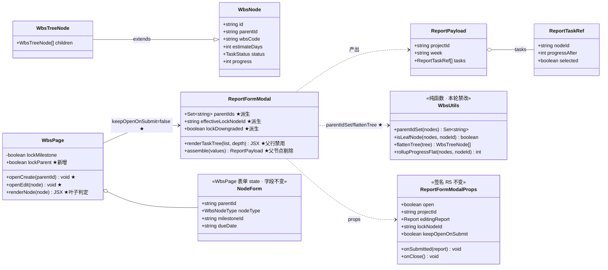
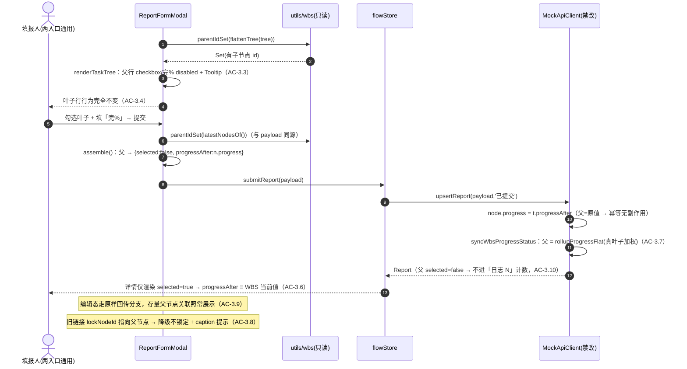
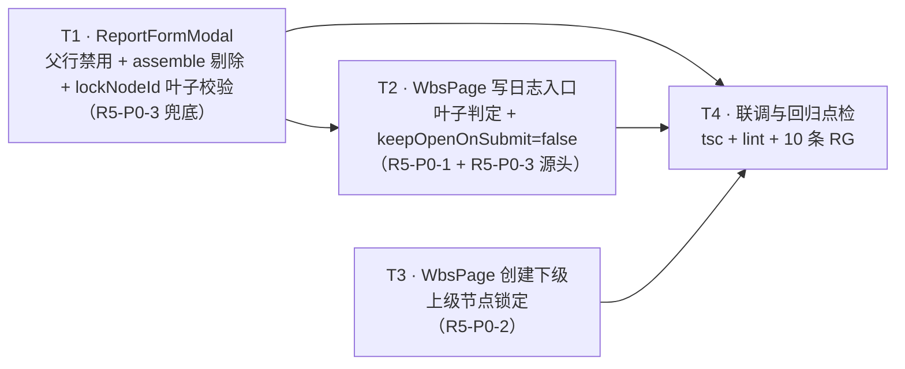

# 增量架构设计 · 第五轮 WBS 面板三条交互优化（round5-wbs）

> 项目：太空字节 PM 系统（pm-app）｜前端：Vite + React + TS + MUI + Tailwind + Zustand（Mock 引擎 `VITE_USE_MOCK=true`）
> 架构师：高见远（Gao）｜输入：许清楚《delta-prd-round5-wbs.md》+ 主理人齐活林 Q1~Q5 裁定｜基线 commit：`0b14953`（已 `git log` 核实）
> 范围：**纯前端交互约束**，引擎层（`api/mock/index.ts`、`api/mock/rules.ts`、`utils/wbs.ts`）**零改动**

---

## 0. 核实说明（Read 依据，非凭记忆）

已逐行 Read 核实：

| 文件 | 核实到的事实（本设计的落点依据） |
|---|---|
| `src/components/report/ReportFormModal.tsx` | Props L59-79（`open/projectId/editingReport/lockNodeId/onSubmitted/keepOpenOnSubmit/onClose`）；open effect L133-160（新建态 `selected: n.id === lockNodeId`）；`assemble` L162-183（新建态 L177-181 **全节点**入 payload）；`doSave` L185-220（L200-213 keepOpen 分支 / L215 `onClose()`；catch L217-219 不关窗）；`renderTaskTree` L223-266（L231-237 checkbox 全节点可勾、L252-261「完%」仅 `readOnly` 时禁用）；任务区标题行 L312-325 |
| `src/pages/projects/WbsPage.tsx` | 无 `navigate` 引入（AC-1.3 现状已满足）；state L107-118（含 `lockMilestone`）；`openCreate` L195-208；`openEdit` L210-224；`changeParent` L226-246；`renderNode` L302-424（L304 `isLeaf`、L358-372 写日志按钮、L385 估算列已用 `isLeaf`）；上级节点 Select L474-490；里程碑锁定范式 L526-545；`<ReportFormModal>` L677-687（`keepOpenOnSubmit` 简写 = true） |
| `src/pages/projects/ReportsPage.tsx` | L178-189 已传 `keepOpenOnSubmit={false}`；L85-95 `openCreateWithPrefill` 仅校验「节点存在」，**未校验叶子** → AC-3.8 的真实缺口 |
| `src/components/common/PermissionButton.tsx` | L32-33：`disabled = rest.disabled \|\| !allowed \|\| Boolean(disabledReason)`，`tip = disabledReason` 且自动包 `<Tooltip><span>` → **父节点禁用+Tooltip 不需要新组件，一个 `disabledReason` 表达式即可** |
| `src/utils/wbs.ts` | 已有 `parentIdSet(nodes)` L109-113、`isLeafNode(nodes,id)` L92-94、`flattenTree` L255-265、`rollupProgress` L277-289、`rollupProgressFlat` L295-310 → **叶子口径唯一入口已存在，本轮零新增纯函数** |
| `src/api/mock/index.ts` | `upsertReport` L1580-1591 按 `payload.tasks` 整体重建 `report.tasks`；L1603-1614 **遍历全部 tasks（不看 selected）** 写 `node.progress = t.progressAfter`；L1617 `syncWbsProgressStatus` 立刻按叶子加权覆盖父节点 → 账实不符根因确认，**修复点只能落在 UI 侧 payload 洁净性** |
| `src/utils/reportAgg.ts` | `reportCountByNode` / `nodeReportsOf` 均以 `selected===true` 为口径 → AC-3.10「新日志不再增加父节点计数」由 `selected=false` 自动成立；AC-3.6 的详情展示天然只看 selected 行 |
| `src/config/enums.ts` / `src/api/mock/rules.ts` | `DEFAULT_WBS_RULES.childTypes = {root:['task'], task:['task','subtask'], subtask:[]}`、`maxDepth:4`；`allowedChildTypes` 按 `parent.level+1 > maxDepth` 返回 `[]` |
| `src/components/common/Dialogs.tsx` | `FormDialog` 的 `onClose` 即 Dialog 关闭入口，`extraActions`（存草稿）与主提交按钮共用 `handleSubmit` |

---

# Part A · 系统设计

## 1. 实现方案概述与选型

### 1.1 核心难点与应对

| 难点 | 应对（本设计的决定） |
|---|---|
| **账实不符（R5-P0-3）的修复点选在哪一层** | 引擎禁改 → 只能保证**进入引擎的 payload 本身是洁净的**。父节点行 `progressAfter` 原样回传**存储值**，使引擎 L1609 的写入退化为**幂等无副作用写**，随后 `syncWbsProgressStatus` 照常按叶子加权回算 → 数据链路全程一致，且零引擎改动 |
| **两个入口（WBS / ReportsPage）规则不能两处维护** | 规则**全部落在 `ReportFormModal` 内部**（PRD §4.1），两入口自动一致；WBS 侧只做「源头不让点」，属体验层加强，非正确性依赖 |
| **叶子判定不能出现第二套口径** | 复用 `utils/wbs.ts` 既有 `parentIdSet` / `flattenTree`（SK-4 唯一入口）。**禁止**写 `nodeType === 'subtask'` 或 `n.children.length === 0` 的散装判断（弹窗内 `tree` 与 `nodes` 双数据源，散装判断必然漂移） |
| **`tree`（渲染源）与 `nodes`（payload 源）可能不同步** | 渲染判定用 `parentIdSet(flattenTree(tree))`；`assemble` 内**重新**用 `parentIdSet(latestNodesOf())`——与 payload 数组同源，保证「被剔除的父节点」与「被写进 payload 的节点」严格出自同一份数据 |
| **锁定表现不能新造范式** | 字段级锁定完全对齐同弹窗 `lockMilestone`（disabled + label 后缀 + helperText）；行级锁定沿用 R4 `lockNodeId`（checked+disabled+锁图标+Tooltip）。本轮**不引入新图标、不引入新组件** |
| **`keepOpenOnSubmit` 是删还是留** | **留**。R5 两入口均传 `false`，但保留 prop 与 `doSave` 分支（PRD §4.1 明示复用既有分支；且「连续填报」是主理人 R4 拍过的能力，删了将来回滚成本更高）。分支内的锁定判定同步换成派生值，避免留下不一致死代码 |

### 1.2 框架选型

- **零新增依赖**：MUI（`Tooltip` / `TextField` / `Typography`）、`@mui/icons-material`（`LockOutlinedIcon` 已在弹窗内引入）、既有 `PermissionButton`、既有 `utils/wbs` 纯函数，全部现成。
- **架构模式不变**：页面/组件直连 Zustand store + Mock 引擎单点收口，本轮不引入新 store、新 hook、新 util 文件。
- **改动规模**：**2 个文件**（`ReportFormModal.tsx`、`WbsPage.tsx`），预计净增 ≈ 40 行，无文件新增、无文件删除。

---

## 2. 改动文件清单（相对 `web/`）

### 2.1 A · `src/components/report/ReportFormModal.tsx`（兜底层，T1）

| 位置（R4 行号） | 现状 | R5 改动 | 锚定 AC |
|---|---|---|---|
| L19-30 imports | 未引入 wbs 工具 | 新增 `import { flattenTree, parentIdSet } from '@/utils/wbs';` | — |
| L59-79 `ReportFormModalProps` | JSDoc 描述 R4 语义 | **签名一字不改**（零破坏性）；仅更新 JSDoc：`lockNodeId` 补「非叶子自动降级为不锁定」；`keepOpenOnSubmit` 补「R5 起两入口均传 false，分支保留备用」 | AC-3.8 |
| L113 后（新增派生块） | — | ① `const parentIds = useMemo(() => parentIdSet(flattenTree(tree)), [tree]);`<br>② `const effectiveLockNodeId = useMemo(() => (lockNodeId && !parentIds.has(lockNodeId) ? lockNodeId : null), [lockNodeId, parentIds]);`<br>③ `const lockDowngraded = Boolean(lockNodeId) && !effectiveLockNodeId;` | AC-3.3 / AC-3.8 |
| L149-158 open effect · 新建分支 | `selected: n.id === lockNodeId` | → `selected: n.id === effectiveLockNodeId` | AC-3.8 |
| L133-148 open effect · 编辑分支 | 原样回填 | **不改**（历史父节点关联照常回显） | AC-3.9 |
| L177-181 `assemble()` · 新建分支 | 全节点带 `taskMap` 值 | 按 §3.3 规则剔除父节点：`selected:false`、`progressAfter: n.progress`（存储值） | AC-3.5 / AC-3.6 |
| L171-176 `assemble()` · 编辑分支 | 原样回传 `editingReport.tasks` | **不改**（不清洗存量） | AC-3.9 |
| L200-213 `doSave` keepOpen 分支 | `selected: n.id === lockNodeId` | → `effectiveLockNodeId`（分支保留，R5 起两入口都不会走到） | — |
| L214-216 / L217-219 | `onClose()` / catch | **不改**（成功走 onClose、失败不关窗，正是 R5-P0-1 要用的现成分支） | AC-1.1/1.2/1.5 |
| L223-266 `renderTaskTree` | 全节点可勾、可填 | ① `const hasChildren = parentIds.has(n.id);`<br>② `locked` 改用 `effectiveLockNodeId`<br>③ checkbox：`disabled={readOnly \|\| locked \|\| hasChildren}`，父节点时用 `<Tooltip title={PARENT_ROW_TIP}><span>…</span></Tooltip>` 包裹（disabled input 不触发 hover，**必须**套 span）<br>④ 名称 `Typography`：父节点 `color: 'text.secondary'`（视觉弱化，不改布局）<br>⑤「完%」`TextField`：`disabled={readOnly \|\| hasChildren}`（灰显当前汇总值）<br>⑥ 进度条 + 层级缩进 + 递归渲染**保持原样**（禁用可见，Q3 裁定） | AC-3.3 / AC-3.4 |
| L312-325 任务区标题行 | 编辑态 / 锁定态两条 caption | 追加两条 caption：① `!editingReport` 恒显「父任务进度由子任务汇总，不可直接勾选」（PRD §3.3 末句）；② `lockDowngraded` 时显「该任务已有下级，请到具体子任务记录进度」 | AC-3.3 / AC-3.8 |

> **不改**：schema / RHF 注册 / planItems / risks / 周次 / 提交按钮 / FormDialog 外壳。

### 2.2 B · `src/pages/projects/WbsPage.tsx`（源头层，T2 + T3）

| 位置（R4 行号） | 现状 | R5 改动 | 锚定 AC |
|---|---|---|---|
| L107-118 state 区 | `lockMilestone` | 新增 `const [lockParent, setLockParent] = useState<boolean>(false);`（紧邻 `lockMilestone` 声明，保持范式聚拢） | AC-2.1 |
| L195-208 `openCreate(parentId)` | 预填 parentId + 继承碑/日期 + `setLockMilestone` | ① 增 `setLockParent(Boolean(parentId));`（`openCreate('')` 天然 false）<br>② `nodeType` 收敛：`nodeType: allowedChildTypes(parent, rules)[0] ?? EMPTY_FORM.nodeType`（**防御**：上级锁定后用户无法再靠换父收敛类型；默认规则下取值恒为 `'task'`，行为零变化） | AC-2.1 / AC-2.5 / AC-2.7 |
| L210-224 `openEdit(node)` | `setLockMilestone(false)` | 增 `setLockParent(false);` | AC-2.8 |
| L226-246 `changeParent` | 换父 + 继承 + 类型收敛 | **不改**（锁定态下该 onChange 不可触发） | AC-2.8 |
| L302-306 `renderNode` 头部 | 已有 `isLeaf`（L304） | **不改**，直接复用 | AC-3.1 |
| L358-372 「写日志」`PermissionButton` | `disabledReason={archived ? '项目已归档' : ''}` | → `disabledReason={archived ? '项目已归档' : isLeaf ? '' : '该任务已有下级，请在具体子任务上记录工作日志'}`（`PermissionButton` L32-33 自动 disabled + Tooltip，**无需**加 `disabled` 属性、无需包 span） | AC-3.1 / AC-3.2 |
| L474-490 「上级节点」`TextField select` | 恒可改 | ① `label={lockParent ? '上级节点（已锁定）' : '上级节点'}`<br>② `disabled={lockParent}`<br>③ `helperText={lockParent ? '由「创建下级任务」进入，上级节点已锁定；如需调整层级，请到该节点「编辑」中修改上级' : '根层可建任务；任务下可继续挂任务或子任务，子任务为最底层'}`<br>④ `value` / `onChange` / MenuItem 列表**保持原样**（disabled 下 value 照常渲染为 `1.2 名称（任务）`） | AC-2.1 / AC-2.2 / AC-2.4 |
| L526-545 里程碑锁定 | `lockMilestone` 范式 | **不改**（两个锁定并存，文案语气一致） | AC-2.4 |
| L677-687 `<ReportFormModal>` | `keepOpenOnSubmit`（简写=true） | → `keepOpenOnSubmit={false}`，并更新上方注释；`onSubmitted` 的 `fetchWbs + refreshMilestones` **保留不动**；`onClose` 保持仅 `setReportModalOpen(false)`，**刻意不清 `reportLockNodeId`**（关闭动画期间清空会导致锁图标闪烁；下次点击在同一 handler、同一 render 内被新 id 覆盖，AC-1.6 依然成立） | AC-1.1/1.2/1.4/1.6 |

### 2.3 C · 不改动但纳入回归范围

| 文件 | 为什么不改 / 要验什么 |
|---|---|
| `src/pages/projects/ReportsPage.tsx` | 已传 `keepOpenOnSubmit={false}`；`openCreateWithPrefill` 的非叶子风险由弹窗内 `effectiveLockNodeId` 兜底（AC-3.8），**不在页面侧再加一套判定**（避免两处口径） |
| `src/utils/wbs.ts` · `src/api/mock/rules.ts` · `src/api/mock/index.ts` | **本轮禁改**。仅只读复用 `parentIdSet` / `flattenTree`；聚合、状态流转、六写路径收口全部保持 R4 原状（AC-3.7） |
| `src/utils/reportAgg.ts` | 口径不变（`selected===true`），AC-3.10 靠 payload 洁净性自动成立 |

---

## 3. 关键数据结构与接口

### 3.1 类图



### 3.2 接口与 state 增量一览

| 项 | 类型 | 归属 | R5 变化 | 说明 |
|---|---|---|---|---|
| `ReportFormModalProps` | interface | ReportFormModal | **无签名变化** | 仅 JSDoc；两个消费方（WbsPage / ReportsPage）无需改类型 |
| `parentIds` | `Set<string>` | ReportFormModal（派生） | 新增 | `parentIdSet(flattenTree(tree))`，渲染层叶子口径唯一来源 |
| `effectiveLockNodeId` | `string \| null` | ReportFormModal（派生） | 新增 | `lockNodeId` 非叶子 → `null`（AC-3.8）；渲染与 taskMap 初始化统一用它 |
| `lockDowngraded` | `boolean` | ReportFormModal（派生） | 新增 | 仅用于 caption 提示；**不弹 toast**（打开即 toast 属噪音，且旧链接场景低频） |
| `taskMap` | `Record<string, {progressAfter, selected}>` | ReportFormModal | 结构不变 | 父节点条目仍存在（进度条/灰显需要），但 `assemble` 不采信其值 |
| `lockParent` | `boolean` | WbsPage | 新增 state | 与 `lockMilestone` 同层同范式；`openCreate`/`openEdit` 两处赋值，**仅此两处** |
| `NodeForm` | interface | WbsPage | **字段不变** | 锁定是「UI 是否允许改 `parentId`」，不是新数据字段——不污染表单模型 |

### 3.3 `assemble()` payload 组装规则（唯一真源）

```
tasks =
  editingReport
    ? editingReport.tasks.map(原样回传)                    // 编辑态：不清洗存量（AC-3.9）
    : latestNodesOf().map(n => {
        const isParent = parentIdSet(latestNodesOf()).has(n.id);   // 与 payload 同源
        return {
          nodeId:        n.id,
          selected:      isParent ? false : (taskMap[n.id]?.selected      ?? false),
          progressAfter: isParent ? n.progress                            // ★ 存储值原样回传
                                  : (taskMap[n.id]?.progressAfter ?? n.progress),
        };
      })
```

| 行类型 | `selected` | `progressAfter` | 引擎侧后果 |
|---|---|---|---|
| 叶子（勾选） | `true` | 用户输入值 | `node.progress` 被更新 → `syncWbsProgressStatus` 顺链回算父级 |
| 叶子（未勾选） | `false` | `taskMap` 值（默认=存储值） | 与现状一致（引擎不看 selected，写入=原值即幂等） |
| **父节点** | **恒 `false`** | **恒 `n.progress`（提交前存储值）** | 写入幂等 → 随即被 `rollupProgressFlat` 覆盖为叶子加权值 → **账实一致（AC-3.5/3.6）**，且不进「日志 N」计数（AC-3.10） |

### 3.4 `renderTaskTree` 行渲染判定矩阵

前置：`readOnly = Boolean(editingReport)`；`locked = !editingReport && effectiveLockNodeId === n.id`；`hasChildren = parentIds.has(n.id)`。

| 行类型 | checkbox `checked` | checkbox `disabled` | 「完%」`disabled` | 锁图标 | Tooltip | 名称色 |
|---|---|---|---|---|---|---|
| 叶子 · 普通 | `t.selected` | `false` | `false` | — | — | 默认 |
| 叶子 · 锁定（`locked`） | `true` | `true` | `false`（R4 规则不变） | ✓ | 「由「写日志」进入，该任务已锁定；可继续勾选其他任务」 | 默认 |
| **父节点（`hasChildren`）** | `t.selected`（新建态恒 false） | **`true`** | **`true`** | — | 「该任务已有下级，进度由子任务加权汇总，请在子任务中记录」 | `text.secondary` |
| 编辑态 · 任意行 | `t.selected`（存量原值，含历史父节点 `true`） | `true`（现状） | `true`（现状） | — | 沿用「编辑已提交日志时该区域只读」 | 父节点弱化 |

> **不变量**：本轮**只动 `disabled` 与文案，绝不动 `checked`**——否则会把历史父节点关联在编辑态显示成未勾选（违反 AC-3.9）。

### 3.5 WbsPage 创建/编辑表单锁定矩阵

| 入口 | `form.parentId` | `lockParent` | 「上级节点」 | `lockMilestone` | 锚定 AC |
|---|---|---|---|---|---|
| 节点行「+」`openCreate(node.id)` | 入口节点 id | **`true`** | disabled + label「（已锁定）」+ helperText | `Boolean(parent.milestoneId)`（不变） | AC-2.1/2.2/2.3/2.4 |
| 卡片右上「新建任务」`openCreate('')` | `''` | `false` | 可选（含「（根节点）」） | `false` | AC-2.7 |
| 节点行「编辑」`openEdit(node)` | `node.parentId ?? ''` | `false` | 可改 → 触发 `changeParent` 继承逻辑 | `false`（不变） | AC-2.8 |

---

## 4. 程序调用流程（时序图）

> 完整三图同步落盘：`web/docs/sequence-diagram.mermaid`（本轮已覆盖为 R5 版）。

### 4.1 ① WBS 写日志：点击 → 提交/存草稿 → 关闭（R5-P0-1）

```mermaid
sequenceDiagram
  autonumber
  actor U as 填报人
  participant W as WbsPage
  participant M as ReportFormModal
  participant F as flowStore
  participant E as MockApiClient(禁改)
  U->>W: 点叶子行「写日志」（父节点行 disabled+Tooltip，AC-3.2）
  W->>W: setReportLockNodeId(node.id); setReportModalOpen(true)
  W->>M: open=true / lockNodeId / keepOpenOnSubmit=false ★
  M->>M: effectiveLockNodeId = 叶子校验(lockNodeId)（AC-3.8）
  M->>M: taskMap 初始化：仅 effectiveLockNodeId 预勾
  U->>M: 填写 → 点「提交」或「存草稿」
  M->>M: assemble()：父节点 selected=false / progressAfter=存储值
  M->>F: submitReport(payload) 或 saveReport(payload)
  F->>E: upsertReport(payload, 已提交|草稿)
  E->>E: 写叶子 progress → syncWbsProgressStatus → refreshMilestoneStatuses
  E-->>F: Report
  F-->>M: resolve(saved)
  M->>M: toast.success「工作日志已提交 / 已存草稿」
  M->>W: onSubmitted(saved) → fetchWbs + refreshMilestones（AC-1.4）
  M->>W: onClose() → setReportModalOpen(false)（AC-1.1/1.2）★
  W-->>U: 弹窗关闭，仍在 /projects/:id/wbs，无 navigate（AC-1.3）
  Note over M,W: 失败 → catch → toast.error；不调 onSubmitted/onClose，内容保留（AC-1.5）
  U->>W: 再点另一行「写日志」→ 同一 render 覆盖 lockNodeId（AC-1.6/1.7）
```

### 4.2 ② 创建下级任务：上级锁定（R5-P0-2）

```mermaid
sequenceDiagram
  autonumber
  actor U2 as PM
  participant W2 as WbsPage
  participant R as rules.ts(只读)
  participant S as wbsStore
  participant E2 as MockApiClient(禁改)
  U2->>W2: 点节点行「+」（canAddChild=true）
  W2->>W2: openCreate(node.id)
  W2->>R: allowedChildTypes(parent, rules)
  R-->>W2: ['task','subtask']
  W2->>W2: setForm{parentId, nodeType=allowed[0], 继承 milestoneId/dueDate}
  W2->>W2: setLockMilestone(...); setLockParent(true) ★
  W2-->>U2: 「上级节点（已锁定）」disabled + helperText（AC-2.1/2.2），与碑锁定并存（AC-2.4）
  Note over W2: 锁定 → changeParent 不可触发 → allowedTypes 恒定（AC-2.5）
  U2->>W2: 填写 → 点「创建」
  W2->>R: validateWbsPlacement 前端预校验（AC-2.6）
  W2->>S: createNode({parentId: form.parentId, ...})
  S->>E2: createWbsNode → 校验/编码/落库/收口
  E2-->>S: WbsNode（parentId === 入口节点 id，AC-2.3）
  S-->>W2: 树刷新 → toast「节点已创建」
  Note over W2,U2: 「新建任务」openCreate('') → lockParent=false（AC-2.7）；openEdit → false（AC-2.8）
```

### 4.3 ③ 弹窗 assemble：父节点禁用与剔除（R5-P0-3）



---

## 5. 待明确事项

**无。**

以下 4 项 PRD 未指定、由架构侧直接裁定，工程按此执行，不再回问：

| # | 事项 | 裁定 | 依据 |
|---|---|---|---|
| D-1 | 上级锁定用「label 后缀」还是「锁图标」 | **label 后缀「（已锁定）」+ helperText**，不加图标 | AC-2.2 二选一即可；同弹窗 `lockMilestone` 已是该形态，AC-2.4 要求「同一套禁用样式与文案语气」 |
| D-2 | AC-3.8 的降级提示用 toast 还是行内文案 | **任务关联区标题行 caption**（与既有 lockNodeId caption 同位置），不弹 toast | 打开弹窗即 toast 属噪音；该路径仅旧链接触发，低频 |
| D-3 | 关闭弹窗时是否清空 `reportLockNodeId` | **不清空** | 清空会在 Dialog 淡出动画期间闪掉锁图标；下次点击在同一 handler 内被新值覆盖，AC-1.6 已成立 |
| D-4 | `openCreate` 是否收敛 `nodeType` | **收敛**为 `allowedChildTypes(parent, rules)[0]` | 上级锁定后用户无法再靠换父触发 `changeParent` 的收敛；默认规则下取值恒为 `'task'`，零行为变化，属纯防御 |

---

# Part B · 任务分解

## 6. 依赖包列表

**零新增依赖**，全部沿用：

```
- react@^18 / typescript：现有
- @mui/material、@mui/icons-material（Tooltip / TextField / LockOutlinedIcon）：现有
- @mui/x-tree-view、@mui/x-date-pickers：现有
- zustand、react-hook-form、@hookform/resolvers、zod、notistack：现有
```

`package.json` **不需要任何改动**。

## 7. 任务列表（按实现顺序，含依赖）

### T1 · 弹窗兜底：父节点行禁用 + assemble 剔除 + lockNodeId 叶子校验

| 项 | 内容 |
|---|---|
| **改动文件** | `src/components/report/ReportFormModal.tsx`（唯一） |
| **优先级** | **P0（实质最高——修账实不符，非体验）** |
| **依赖** | 无 |
| **做什么** | ① 引入 `flattenTree` / `parentIdSet`，新增三个派生值 `parentIds` / `effectiveLockNodeId` / `lockDowngraded`（§2.1）；② `renderTaskTree` 按 §3.4 矩阵改 `disabled` 与文案（**不动 `checked`**），父行 Tooltip 需 `<Tooltip><span>` 包裹；③ `assemble` 新建分支按 §3.3 剔除父节点；④ open effect 与 `doSave` keepOpen 分支的 `lockNodeId` 全部换成 `effectiveLockNodeId`；⑤ 任务区标题行补两条 caption；⑥ 更新 Props JSDoc |
| **验收锚定** | AC-3.3 / AC-3.4 / AC-3.5 / AC-3.6 / AC-3.8 / AC-3.9 / AC-3.10 / AC-3.11 |
| **自测要点** | 在 **ReportsPage「新建日志」** 入口（无节点上下文）验证：父行不可勾、完%灰显汇总值；勾一个叶子填 100 提交 → 打开日志详情，父任务不出现在「关联任务」列表；WBS 树父节点进度 = 叶子加权值，与详情中叶子 `progressAfter` 一致 |
| **红线** | 不改 `api/mock/*`、`utils/wbs.ts`；不改 Props 签名；不改编辑态 assemble 分支 |

### T2 · WBS 写日志入口：叶子判定 + 提交后关窗

| 项 | 内容 |
|---|---|
| **改动文件** | `src/pages/projects/WbsPage.tsx`（L358-372、L677-687） |
| **优先级** | P0 |
| **依赖** | T1（先有兜底再收源头；T1 未完成时 WBS 侧收紧会掩盖弹窗层缺陷，不利于验 AC-3.5） |
| **做什么** | ① 「写日志」`PermissionButton` 的 `disabledReason` 三分支表达式（archived → 非叶 → 空）；② `keepOpenOnSubmit` 改 `{false}`，更新注释；③ `onSubmitted` 的 `fetchWbs + refreshMilestones` 保持不动；④ `onClose` 保持不清 `reportLockNodeId`（D-3） |
| **验收锚定** | AC-1.1 / AC-1.2 / AC-1.3 / AC-1.4 / AC-1.5 / AC-1.6 / AC-1.7 / AC-3.1 / AC-3.2 |
| **自测要点** | 叶子行提交 → 弹窗关闭、URL 不变、该行进度条与「日志 N」即时刷新；存草稿同样关闭；把叶子进度改成非法值触发引擎报错 → 弹窗不关、内容保留；关闭后点**另一**叶子行 → 预勾为新节点；父节点行按钮置灰且 hover 出 Tooltip |
| **红线** | 不引入 `navigate`；不动 `onSubmitted` 回调内容 |

### T3 · WBS 创建下级：上级节点锁定

| 项 | 内容 |
|---|---|
| **改动文件** | `src/pages/projects/WbsPage.tsx`（L107-118、L195-208、L210-224、L474-490） |
| **优先级** | P0 |
| **依赖** | 无（与 T1/T2 正交，可并行；同文件与 T2 无重叠行区间，按 T2→T3 顺序提交冲突为零） |
| **做什么** | ① 新增 `lockParent` state；② `openCreate` 设 `setLockParent(Boolean(parentId))` + `nodeType` 收敛（D-4）；③ `openEdit` 设 `false`；④ 「上级节点」Select 的 label / disabled / helperText 三处按 §2.2 改；⑤ `changeParent`、里程碑锁定、类型下拉一律不动 |
| **验收锚定** | AC-2.1 / AC-2.2 / AC-2.3 / AC-2.4 / AC-2.5 / AC-2.6 / AC-2.7 / AC-2.8 |
| **自测要点** | 从「1.2 某任务」的「+」进入 → 上级显示 `1.2 …（任务）` 且点不开；创建后新节点确实挂在 1.2 下（wbsCode = `1.2.x`）；带碑父节点进入时两个锁定同屏、文案不打架；顶部「新建任务」上级可自由选；编辑任一节点上级仍可改且触发继承 |
| **红线** | 不给 `NodeForm` 加字段；不改 `validateWbsPlacement` 调用链 |

### T4 · 联调与回归点检

| 项 | 内容 |
|---|---|
| **改动文件** | 无（必要时为前三任务的缺陷修复；产出走查记录） |
| **优先级** | P0 |
| **依赖** | T1 + T2 + T3 |
| **做什么** | 按下表在 `http://127.0.0.1:5173/` 逐条走查，`npx tsc --noEmit` + `npm run lint` 零报错，`git diff --stat` 确认**仅 2 个源文件**被改 |
| **验收锚定** | 全量 AC-1.x / AC-2.x / AC-3.x |

**T4 回归点检表**

| # | 场景 | 期望 | AC |
|---|---|---|---|
| RG-1 | 账实一致主链路：叶子 30%→90% 提交 | 父节点进度=加权值；日志详情中该叶子 90% 与 WBS 完全一致；父任务不出现在关联列表 | AC-3.5 / 3.6 / 3.7 |
| RG-2 | ReportsPage 新建日志（无上下文） | 父行禁用可见、叶子行如常；提交后弹窗关闭（现状不变） | AC-3.3 / 3.4 |
| RG-3 | 历史存量日志（已关联父节点） | 列表/详情/编辑态照常展示，不报错、不清洗；WBS 父节点「日志 N」保留历史计数 | AC-3.9 / 3.10 |
| RG-4 | 旧链接 `prefillNodeId` 指向父节点 | 弹窗打开、不预勾、caption 提示「该任务已有下级…」 | AC-3.8 |
| RG-5 | 全根任务均有子节点 | 仍可从叶子行 / 「新建日志」正常填报 | AC-3.11 |
| RG-6 | 提交失败（引擎抛错） | 弹窗不关、内容保留、仅 toast | AC-1.5 |
| RG-7 | 连续填报两条不同叶子 | 第二次预勾为新节点，无上一次残留 | AC-1.6 / 1.7 |
| RG-8 | 滚动位置 | 深层树滚到底部点写日志 → 关闭后位置不重置 | AC-1.3 |
| RG-9 | 看板 / 里程碑 / 工作台 | 进度、`taskStats`、状态流转与 R4 完全一致（本轮零引擎改动的证明） | AC-3.7 |
| RG-10 | 权限与归档 | 无 `report:write` 不渲染按钮；归档项目行为不变 | PRD §3.4 |

## 8. 共享知识（跨文件约定）

### 8.1 锁定表现三范式（禁止新造第四种）

| 范式 | 形态 | 既有出处 | R5 使用者 |
|---|---|---|---|
| **字段级锁定** | `disabled` + label 追加「（已锁定）/（已继承上级·锁定）」+ helperText 一句话说明「为什么锁 + 去哪解锁」 | `WbsPage` 里程碑 `lockMilestone`（L526-537） | T3 上级节点 Select |
| **行级/勾选级锁定** | `checked + disabled` + `LockOutlinedIcon`（14px，`text.secondary`）+ Tooltip | `ReportFormModal` `lockNodeId`（L227-242） | T1 保持（换派生值） |
| **禁用可见（不隐藏）** | 保留控件与布局 → `disabled` + Tooltip 说明「为什么不能用 + 去哪里做」 | 同行「新建子节点」`canAddChild`（L405-415）、`PermissionButton.disabledReason` | T1 父节点行 / T2 父节点写日志按钮 |

> Q1/Q3 裁定的共同内核：**行布局绝不因禁用而跳动**——不隐藏、不改宽度、不撤 Tooltip。

### 8.2 统一文案表（**逐字使用，禁止改写**）

| 场景 | 文案 |
|---|---|
| WBS 父节点「写日志」Tooltip | `该任务已有下级，请在具体子任务上记录工作日志` |
| 弹窗任务树父节点行 Tooltip | `该任务已有下级，进度由子任务加权汇总，请在子任务中记录` |
| 弹窗任务关联区统一说明（新建态恒显） | `父任务进度由子任务汇总，不可直接勾选` |
| `lockNodeId` 非叶子降级提示（caption） | `该任务已有下级，请到具体子任务记录进度` |
| 上级节点锁定 label | `上级节点（已锁定）` |
| 上级节点锁定 helperText | `由「创建下级任务」进入，上级节点已锁定；如需调整层级，请到该节点「编辑」中修改上级` |
| 已有锁定文案（沿用不动） | `由「写日志」进入，该任务已锁定；可继续勾选其他任务` / `该任务继承自上级里程碑，不可修改；如需调整请到上级节点更改` |

### 8.3 `keepOpenOnSubmit` 去留结论

- **保留** prop 与 `doSave` 的 `if (keepOpenOnSubmit)` 分支；R5 起 **WBS 与 ReportsPage 两入口均传 `false`**，分支成为「备用能力」。
- 分支内部的锁定判定必须同步换成 `effectiveLockNodeId`，不留口径不一致的死代码。
- 任何人想恢复「连续填报」，只需把 WBS 侧改回 `true`，**不得**再引入第二个开关。

### 8.4 叶子口径唯一入口（SK-4 延续，硬约束）

- 判定「有没有子节点」只允许三种等价写法，且各自绑定场景：
  1. `WbsTreeNode` 单节点渲染 → `node.children.length === 0`（`WbsPage.renderNode` L304 既有）；
  2. 树形批量渲染 → `parentIdSet(flattenTree(tree))`（T1 弹窗渲染）；
  3. 扁平数组 / payload 组装 → `parentIdSet(nodes)` 或 `isLeafNode(nodes, id)`（T1 assemble）。
- **禁止** `nodeType === 'task' / 'subtask'` 充当叶子判定；**禁止**在组件内自写 for 循环推导父子关系。

### 8.5 数据一致性契约（R5 的核心不变量）

> **父节点的 `progress` 只有一个来源：`rollupProgressFlat`（存储）/ `rollupProgress`（视图）。任何 UI 路径都不得向 payload 写入父节点的用户输入值。**

推论（工程侧必须同时满足）：
1. `payload.tasks` 中父节点 `selected` 恒 `false`；
2. `payload.tasks` 中父节点 `progressAfter` 恒等于提交前 `node.progress`；
3. 引擎对父节点的写入因此恒为幂等；
4. 「日志 N」徽标（`selected=true` 口径）不再因新日志增长于父节点。

### 8.6 引擎层红线

`src/api/mock/index.ts`、`src/api/mock/rules.ts`、`src/utils/wbs.ts` **本轮只读**。若走查发现必须改引擎才能满足某条 AC，**停下来回报主理人**，不得自行扩范围（R4 六写路径单点收口是既有资产，任何旁路都会破坏它）。

## 9. 任务依赖图



> T3 与 T1/T2 无代码耦合，可并行；串行提交时建议顺序 **T1 → T2 → T3 → T4**（T2/T3 同文件但行区间不重叠）。

---

## 附：变更影响面速查

| 维度 | 影响 |
|---|---|
| 改动源文件 | 2（`ReportFormModal.tsx`、`WbsPage.tsx`） |
| 新增文件 / 依赖 / store / util | 0 / 0 / 0 / 0 |
| Props 或类型签名破坏性变更 | 无 |
| 引擎 / 聚合算法 / 写路径 | 零改动 |
| 数据迁移或存量清洗 | 无（Q5 裁定：存量如实展示） |
| 回滚方式 | 单 commit revert 即可（无 schema、无持久化格式变化） |
